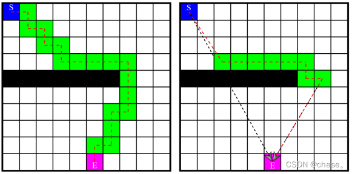

## A* 算法介绍

对于传统的A* 算法从起始点到目标点的寻找需要不断地创建代价函数, 本节主要是对A* 算法进行裁剪, 其代价函数的启动在从起始点直线到目标点的过程中碰到障碍物前启动, 并且在子节点离开障碍物后, 关闭代价函数的建立, 判断子节点是否可直线到达终点, 若否则继续达到下一个障碍物前, 继续之前的操作直到找到终点为止。

传统A*算法是一种基于栅格的最短无碰路径求解的启发式算法, 其评价函数为：

```math
f(x) = g(x) + h(x)
```

其中：
- g(x): 从起点到当前节点 x 的实际代价
- h(x): 从节点 x 到终点的估计代价（启发值）
- f(x): 通过节点 x 的路径总代价
 
当所在的环境地图被分割成三维立体地图时, 是从起始栅格到栅格x的实际栅格数, 是从栅格 **x** 到目标栅格的预计栅格数, 那么是从起始栅格经过中间栅格 **x** 到达目标栅格的预计栅格数。

## 改进思路
传统 A* 算法在寻路过程中需要持续创建和更新代价函数。本文提出的改进方案主要针对代价函数的计算进行优化：

1. 仅在遇到障碍物时启动代价函数计算
2. 离开障碍物区域后暂停代价函数更新
3. 优先考虑直线路径可行性

## A* 算法裁剪流程

||
|:--:|
|*左：传统 A* 算法的网格遍历  右：改进后的选择性搜索*|

裁剪A* 算法流程：
 1. 首先判断起始点S和目标点E在三维栅格地图中是可到达的点, 若起始点S或目标点E不是可达点则退出寻路过程, 若都是则继续进行寻路过程;
 2. 判断起始点S到目标点E之间是否可直线通过, 采用根据两点结合递归和二分法的方式快速遍历, 若是则返回空路径, 若否则继续;
 3. 对起点S开始, 把S作为一个待检查的方格, 寻找起点S周围可到达的方格(最多26个), 检测是否有不可到达的点, 若是则将起点S和周围可达的点都放入OPEN开启列表, 开启寻路操作, 跳转至⑤, 若不是则进行快速接近, 跳转至④;
 4. 在三维栅格地图中, 以起点B到终点E的方向开始遍历, 直到接近障碍物为止, 将临近障碍物的P点作为新的起始点S, 寻找周围可到达的点, 并放入到OPEN开启列表;
 5. 计算每个周围方格的F值, F=G+H, 其中G值表示从起点S移动至指定方格的实际距离, H值表示从指定方格移动至终点E的估计距离。
 6. 从OPEN列表中选择F值最低的方格a, 将其从OPEN列表中取出并放入到CLOSE列表中;
 7. 检查方格a所有临近的方格, 若周围的范围都是可到达的方格, 则进行快速接近, 否则继续, 并只检测方格a临近且可到达的点; 	
    - 障碍物和CLOSE列表中的不考虑; 	
    - 若不在OPEN列表中, 则加入到OPEN列表中, 并计算F值, 将父方格设置为方格a; 	
    - 若方格a相邻的方格c已在OPEN列表, 计算新的路径从S经方格a到达方格c, 若新G值是否比上一个G值更小, 则修改父节点为方格a, 再度计算F值, H值不变;而如果G值更高, 值不做改变;
 8. 在OPEN列表中比较每个值, 继续找出F值最小的, 从OPEN列表取出并添加至CLOSE列表, 继续寻找周围可达的方格, 如此循环; 	
    - 直到OPEN列表中出现方块E则路径找到; 	
    - 而若OPEN列表中无数据, 则无合适路径。
