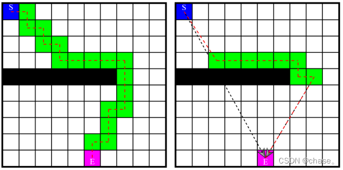

## 先分清搜索与路径裁剪

A* 在图上搜索路径；视线检测（line of sight，LOS）判断两个位置能否用无碰直线连接。将二者结合可以减少拐点或扩展节点，但“靠近障碍物才搜索”的自定义策略，不自动继承标准 A* 的完备性和最优性。

本文保留原有三维栅格裁剪思路，并说明实现时需要单独验证的边界。

## 标准 A* 的代价与终止条件

$$
f(x)=g(x)+h(x).
$$

$g(x)$ 是起点到节点 $x$ 的当前最佳累计代价，$h(x)$ 是到目标的估计代价。在边长为 $s$ 的三维 26 邻接栅格中，轴向、面对角和体对角边可分别取 $s,\sqrt2s,\sqrt3s$；启发函数必须与实际边权一致。

欧氏距离对这种边权是可采纳且一致的下界。若使用不一致的启发函数，需要允许更优路径重新打开节点；不能一律跳过 CLOSED 中的节点。

目标节点以有效的最小 $f$ 值从 OPEN 中弹出时，才按标准 A* 的条件终止。**目标首次进入 OPEN，不代表已找到最短路径。** 优先队列中保留旧条目时，还需跳过已经过期的代价记录。

## 两种加入视线检测的方法

### 先搜索，再简化路径

先用标准 A* 得到一条有效路径，再从当前路点尝试连接更远的路点，仅在完整线段通过碰撞检查时跳过中间点。这种后处理容易独立验证，但得到的是新的几何路径，仍需检查机器人尺寸和运动约束。

起点到终点已经直通时，通常返回 `[start, goal]`；若两点相同则返回单点路径。不要用空路径同时表示“直通成功”和“搜索失败”，除非 API 另有明确状态字段。

### 在搜索中加入直达候选

可以从当前节点尝试直连目标，或引入可见祖先作为父节点，但必须更新真实路径代价、父指针和 OPEN 顺序。遇到第一个直达候选就退出，只能说明找到可行解，不能无条件声称最优。

原文“无障碍区域快速前进、障碍物附近启用 A*”应视作自定义启发式规划器。若希望保证标准 A* 的性质，需要保留相应的搜索状态和证明条件。

## 三维碰撞检查的常见漏项

- 不能只检测线段端点或少数中点：窄障碍可能落在采样间隔之间。使用覆盖穿越体素的遍历方法，并定义擦边时的占用规则。
- 26 邻接允许对角移动，但不应从相邻障碍的公共边或角间“穿过去”。
- 点机器人路径不等于实体机器人可行路径：需要障碍膨胀或实际几何的扫掠碰撞检查。
- 平滑或裁剪后要重新检查整段轨迹，不能只复用原路径离散点的检查结果。

## 如何评价改进

在同一地图、分辨率、邻接规则与碰撞模型下，分别记录成功率、路径长度、扩展节点数、LOS 次数和总耗时。包含直通、窄通道、死胡同、不可达目标、边界点和起终点相同的测试，不以单幅示意图替代实验。

## 阅读自测与验收

- 用拐角障碍测试视线裁剪：只检查连线两端为空闲是不够的，整段线及机器人占据空间都要合法。
- 记录简化前后的代价和碰撞检测分辨率；折点减少只说明表示更简洁，不自动证明长度全局最短或满足动力学。
