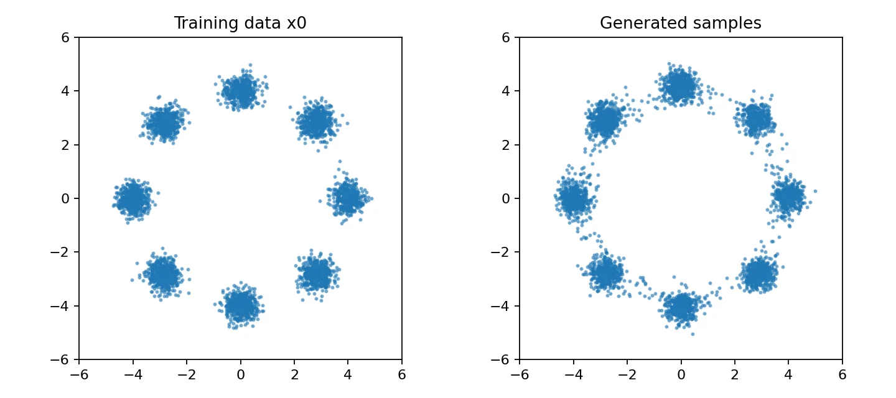

本文从“逐步破坏数据，再学习逆过程”这一核心直觉出发，推导 DDPM 的前向加噪、训练目标与反向采样，并介绍条件生成、DDIM、Latent Diffusion 和 Diffusion Transformer。文末提供一个可直接运行的二维生成示例。

> **学习目标**：能够解释 `x₀ → xₜ → εθ → x̂₀` 的数据流，写出训练与采样循环，并区分噪声调度器、去噪网络和采样器各自负责什么。

## 阅读路线

1. 第 1～3 节建立直觉并理解前向加噪公式。
2. 第 4～6 节理解模型学什么、如何训练和采样。
3. 第 7～9 节理解条件生成、潜空间扩散和常见变体。
4. 最后运行第 10 节代码，并用第 11 节清单自测。

### 快速目录

- [整体框架](#1-扩散模型在做什么)
- [符号表](#2-符号与张量)
- [前向加噪](#3-前向扩散从数据到噪声)
- [训练目标](#4-模型到底学习什么)
- [去噪网络](#5-去噪网络u-net-与-dit)
- [反向采样](#6-反向过程从噪声生成样本)
- [条件生成与 CFG](#7-条件生成与-classifier-free-guidance)
- [像素与潜空间扩散](#8-像素扩散与-latent-diffusion)
- [DDPM、DDIM 与其他预测目标](#9-常见变体与选型)
- [完整可运行示例](#10-完整二维-ddpm-示例)
- [训练工程、评测与排错](#11-常见问题与自测)

## 1. 扩散模型在做什么

真实数据分布通常十分复杂，直接从中采样很困难。扩散模型把问题拆成两部分：

- **前向扩散（Forward Diffusion）**：不断向真实样本加入少量高斯噪声，最终得到近似标准高斯噪声。这个过程固定，不需要学习。
- **反向去噪（Reverse Denoising）**：训练神经网络预测噪声或等价目标，再从随机噪声逐步恢复出数据。

<figure class="article-figure">
  
  <figcaption>
    <span class="article-figure__number">图 1</span>
    <span class="article-figure__text">训练时学习逆转已知的加噪过程；生成时从随机噪声开始反复调用去噪网络。</span>
  </figcaption>
</figure>

扩散模型不是把一张训练图片“从噪声中找回来”。模型通过大量样本学习数据分布的统计规律，因此可以生成训练集中没有的新样本。

## 2. 符号与张量

| 符号 | 英文 | 含义 |
|---|---|---|
| `B` | Batch Size | 一批样本数量 |
| `C` | Channels | 图像通道数，如 RGB 为 3 |
| `H, W` | Height, Width | 图像高度和宽度 |
| `T` | Number of Timesteps | 扩散总时间步数 |
| `t` | Timestep | 当前时间步，通常在 `[0,T-1]` |
| `x₀` | Clean Sample | 未加噪的真实样本 |
| `xₜ` | Noisy Sample | 第 `t` 步的带噪样本 |
| `ε` | Gaussian Noise | 从 `N(0,I)` 采样的真实噪声 |
| `εθ` | Predicted Noise | 参数为 `θ` 的网络预测的噪声 |
| `βₜ` | Noise Schedule | 第 `t` 步加入的噪声强度 |
| `αₜ` | Signal Retention | `1-βₜ`，单步保留信号的比例 |
| `ᾱₜ` | Cumulative Product | `α₁…αₜ`，累计信号保留率 |
| `c` | Condition | 文本、类别、图像等条件信息 |

图像输入通常为 `[B,C,H,W]`；每个样本的时间步为 `[B]`。必须把 `ᾱₜ` 变成 `[B,1,1,1]`，才能与图像正确广播。

## 3. 前向扩散：从数据到噪声

### 3.1 单步转移

第 `t` 步把上一时刻样本缩小一点，再加入少量高斯噪声：

$$
q(x_t\mid x_{t-1})=
\mathcal N\left(x_t;\sqrt{\alpha_t}x_{t-1},\beta_t I\right),
\qquad \alpha_t=1-\beta_t
$$

`βₜ` 太大会让逆过程困难，太小则需要更多步骤。常见调度方式包括 Linear、Cosine 和 Sigmoid schedule。

### 3.2 任意时间步的闭式采样

训练时不需要真的从 `x₀` 循环加噪到 `xₜ`。利用高斯分布的性质，可以一步得到任意时刻：

$$
\bar\alpha_t=\prod_{s=1}^{t}\alpha_s
$$

$$
\boxed{x_t=\sqrt{\bar\alpha_t}x_0+\sqrt{1-\bar\alpha_t}\,\epsilon},
\qquad \epsilon\sim\mathcal N(0,I)
$$

<figure class="article-figure">
  
  <figcaption>
    <span class="article-figure__number">图 2</span>
    <span class="article-figure__text">时间越晚，原始信号分量越弱，噪声分量越强；精确系数以上方闭式公式为准。</span>
  </figcaption>
</figure>

PyTorch 实现：

```python
import torch

def extract(values, t, x_shape):
    """从长度 T 的表中取出每个样本对应的 t，并扩展到可广播形状。"""
    return values.gather(0, t).reshape(t.shape[0], *((1,) * (len(x_shape) - 1)))

def q_sample(x0, t, alpha_bar, noise=None):
    noise = torch.randn_like(x0) if noise is None else noise
    signal = extract(alpha_bar.sqrt(), t, x0.shape)
    noise_scale = extract((1.0 - alpha_bar).sqrt(), t, x0.shape)
    return signal * x0 + noise_scale * noise, noise

T = 1000
beta = torch.linspace(1e-4, 2e-2, T)
alpha = 1.0 - beta
alpha_bar = torch.cumprod(alpha, dim=0)

x0 = torch.randn(8, 3, 32, 32)       # [B,C,H,W]
t = torch.randint(0, T, (x0.size(0),))
xt, epsilon = q_sample(x0, t, alpha_bar)
assert xt.shape == x0.shape == epsilon.shape
```

### 3.3 Scheduler、SNR 与时间步索引

噪声调度器首先给出 `βₜ`，再派生 `αₜ=1-βₜ` 和 `ᾱₜ=∏αₛ`。真正决定某个时间步还剩多少信号的常用指标是：

$$
\operatorname{SNR}(t)=\frac{\bar\alpha_t}{1-\bar\alpha_t}
$$

| 区域 | `ᾱₜ` | SNR | 模型看到的内容 |
|---|---:|---:|---|
| 早期，小 `t` | 接近 1 | 高 | 图像清晰，只需修复少量噪声 |
| 中期 | 介于 0 和 1 | 中 | 轮廓仍在，纹理明显受损 |
| 晚期，大 `t` | 接近 0 | 低 | 几乎只有噪声，更多依赖分布先验与条件 |

Linear schedule 是让 `βₜ` 线性变化，不代表 `ᾱₜ` 或 SNR 线性变化。Cosine schedule 通常让有效信号衰减更平缓。训练时还可采用 SNR-based Loss Weighting，避免某些噪声区间主导梯度。

<figure class="article-figure">
  
  <figcaption>
    <span class="article-figure__number">图 3</span>
    <span class="article-figure__text">即使 β 线性增长，累计信号 ᾱ 和 SNR 也呈非线性变化；右图使用对数纵轴。</span>
  </figcaption>
</figure>

下面是生成该图的完整代码。保存为任意 Python 文件并运行后，会在当前目录写出 `schedule-and-snr.png`：

```python
from pathlib import Path

import matplotlib.pyplot as plt
import torch


steps = 1000

# Linear beta schedule
beta_linear = torch.linspace(1e-4, 2e-2, steps)
alpha_bar_linear = torch.cumprod(1.0 - beta_linear, dim=0)

# Cosine cumulative schedule，并保证起始累计信号为 1
offset = 0.008
grid = torch.linspace(0, 1, steps + 1)
alpha_bar_cosine = torch.cos(
    ((grid + offset) / (1 + offset)) * torch.pi / 2
).square()
alpha_bar_cosine = alpha_bar_cosine / alpha_bar_cosine[0]
alpha_bar_cosine = alpha_bar_cosine[1:].clamp_min(1e-8)

# SNR(t) = alpha_bar(t) / (1 - alpha_bar(t))
snr_linear = alpha_bar_linear / (1.0 - alpha_bar_linear)
snr_cosine = alpha_bar_cosine / (1.0 - alpha_bar_cosine)
t = torch.arange(steps)

plt.style.use("seaborn-v0_8-whitegrid")
fig, axes = plt.subplots(1, 2, figsize=(12, 4.2))

axes[0].plot(t, alpha_bar_linear, label="Linear beta", linewidth=2.2)
axes[0].plot(t, alpha_bar_cosine, label="Cosine", linewidth=2.2)
axes[0].set(
    title="Cumulative signal retention",
    xlabel="Timestep t",
    ylabel="alpha_bar(t)",
)
axes[0].set_ylim(-0.02, 1.02)
axes[0].legend()

axes[1].semilogy(
    t, snr_linear.clamp_min(1e-8), label="Linear beta", linewidth=2.2
)
axes[1].semilogy(
    t, snr_cosine.clamp_min(1e-8), label="Cosine", linewidth=2.2
)
axes[1].set(
    title="Signal-to-noise ratio",
    xlabel="Timestep t",
    ylabel="SNR(t), log scale",
)
axes[1].legend()

fig.suptitle("Noise schedules describe a nonlinear loss of signal", fontsize=14)
fig.tight_layout()
output = Path("schedule-and-snr.png")
fig.savefig(output, dpi=180, bbox_inches="tight")
print(f"saved: {output.resolve()}")
```

图中的 Cosine 曲线直接定义累计量 `alpha_bar_cosine`；若训练代码需要逐步的 `beta_t`，应再由相邻累计量反推并裁剪到合法范围，而不是把该累计曲线直接当成 `beta`。

> **索引约定**：论文常写 `t=1…T`，代码常用 `t=0…T-1`。两种都可以，但 `alpha_bar_prev`、最后一步是否加噪和 Scheduler 查表必须采用同一套约定。

特别注意：数学符号 `x₀` 始终指干净数据；但本文代码里的数组下标 `t=0` 对应第一档非零噪声，因为 `beta[0] > 0`。可以把代码的 `alpha_bar[0]` 理解为论文一基索引中的 `ᾱ₁`。采样循环的 `step=0` 是最后一次网络预测，随后直接输出均值，不再额外添加随机噪声。

## 4. 模型到底学习什么

### 4.1 噪声预测目标

最常见的教学形式让网络接收 `xₜ` 和 `t`，预测当初加入的噪声：

$$
\epsilon_\theta(x_t,t)\approx\epsilon
$$

简化损失是均方误差：

$$
L_{\text{simple}}=
\mathbb E_{x_0,t,\epsilon}
\left[\lVert\epsilon-\epsilon_\theta(x_t,t)\rVert_2^2\right]
$$

一次训练迭代只有五步：

```text
真实样本 x₀
  → 随机采样时间步 t
  → 随机采样噪声 ε
  → 闭式构造 xₜ
  → 网络预测 εθ(xₜ,t)，用 MSE(εθ, ε) 更新参数
```

关键点是：**训练时每个样本只随机选择一个时间步**，不同 batch 长期覆盖全部噪声强度；生成时才需要从大到小遍历采样时间步。

### 4.2 为什么必须输入时间步

同一个 `xₜ` 在轻噪声和重噪声阶段需要完全不同的修复力度。时间步通常先经过 Sinusoidal Embedding，再由 MLP 投影并注入残差块：

```python
import math
import torch

def timestep_embedding(t, dim, max_period=10_000):
    half = dim // 2
    freq = torch.exp(
        -math.log(max_period)
        * torch.arange(half, device=t.device, dtype=torch.float32)
        / max(half - 1, 1)
    )
    angles = t.float()[:, None] * freq[None, :]
    emb = torch.cat([angles.cos(), angles.sin()], dim=-1)
    if dim % 2:
        emb = torch.cat([emb, torch.zeros_like(emb[:, :1])], dim=-1)
    return emb
```

### 4.3 EMA 为什么常用于采样

训练参数每一步都受当前 mini-batch 梯度影响。Exponential Moving Average（EMA）维护一份更平滑的影子权重：

$$
\theta_{\text{EMA}}\leftarrow
\gamma\theta_{\text{EMA}}+(1-\gamma)\theta
$$

`γ` 通常非常接近 1。训练仍更新原参数 `θ`，验证和生成常切换到 EMA 参数。Checkpoint 应同时保存训练权重、EMA 权重、优化器、学习率调度器、全局 step、模型配置与噪声调度配置；只保存去噪器权重不足以严格恢复训练。

## 5. 去噪网络：U-Net 与 DiT

扩散公式没有限定网络架构，只要求模型输入带噪样本与时间条件，输出形状兼容的预测目标。

### 5.1 时间条件 U-Net

U-Net 的 Encoder 逐步降低空间分辨率、扩大感受野；Decoder 恢复分辨率；Skip Connection 把高分辨率细节直接送到对应解码层。时间嵌入告诉每个残差块当前噪声等级，文本等条件可以通过 Cross-Attention 注入。

<figure class="article-figure">
  
  <figcaption>
    <span class="article-figure__number">图 4</span>
    <span class="article-figure__text">U-Net 同时利用低分辨率语义、高分辨率细节、时间步以及可选条件。</span>
  </figcaption>
</figure>

### 5.2 Diffusion Transformer（DiT）

DiT 把潜变量切成 Patch Token，用 Transformer Block 代替卷积 U-Net。时间步、类别或文本条件可通过加法、AdaLN 或 Cross-Attention 注入。它改变的是去噪网络，不改变前向加噪与训练目标的基本逻辑。

| 去噪器 | 优势 | 注意点 |
|---|---|---|
| U-Net | 多尺度归纳偏置强，图像任务成熟 | 大模型结构较复杂 |
| DiT | 结构规则，易随数据与计算扩展 | 高分辨率 Token 数带来计算压力 |
| MLP | 适合二维点等低维教学数据 | 不适合直接处理高分辨率图像 |

## 6. 反向过程：从噪声生成样本

DDPM 用网络预测的噪声构造反向高斯分布。常用均值写法为：

$$
\mu_\theta(x_t,t)=\frac{1}{\sqrt{\alpha_t}}
\left(x_t-\frac{\beta_t}{\sqrt{1-\bar\alpha_t}}
\epsilon_\theta(x_t,t)\right)
$$

从 `x_T ~ N(0,I)` 开始，依次计算：

$$
x_{t-1}=\mu_\theta(x_t,t)+\sigma_t z,
\qquad z\sim\mathcal N(0,I)
$$

网络预测 `ε` 后，也可以先估计对应的干净样本：

$$
\hat x_0=
\frac{x_t-\sqrt{1-\bar\alpha_t}\,\epsilon_\theta(x_t,t)}
{\sqrt{\bar\alpha_t}}
$$

DDPM 的真实前向后验为：

$$
q(x_{t-1}\mid x_t,x_0)=
\mathcal N\left(x_{t-1};\tilde\mu_t(x_t,x_0),\tilde\beta_t I\right)
$$

$$
\tilde\beta_t=
\beta_t\frac{1-\bar\alpha_{t-1}}{1-\bar\alpha_t}
$$

代码中的 `posterior_var` 正是 `β̃ₜ`。实际系统可能使用固定方差、学习方差，或采用不显式遵循该随机后验的 DDIM/ODE 类更新，因此不要只复制均值公式后随意选择噪声尺度。

当 `t=0` 时不再添加随机噪声。一次训练迭代和一次完整生成应这样比较：

| 对比项 | 一次训练迭代 | 一次完整生成 |
|---|---|---|
| 已知数据 | 从数据集取得真实 `x₀` | 从 `N(0,I)` 采样初始状态 `x_T` |
| 时间步 | 为 batch 中每个样本随机采样 `t` | 按采样器定义的推理时间表从大到小推进 |
| 当前 `xₜ` 如何得到 | 用闭式公式从 `x₀`、`t` 和新采样的 `ε` 一步构造 | 使用上一个反向步骤的输出，不需要真实 `x₀` |
| 去噪器调用 | 每个训练迭代通常前向一次，然后反向传播 | 每个推理步骤调用一次，共调用 `NFE` 次 |
| 参数与梯度 | 计算梯度并更新训练参数，EMA 另行跟随 | 使用 `eval()` 和 `no_grad()`，参数保持冻结 |

`NFE` 是 Number of Function Evaluations（去噪网络求值次数），可能小于训练使用的 `T`。例如模型训练了 1000 个离散噪声等级，推理时可以只选其中 20～50 个时间点。采样慢的根本原因是反向步骤互相依赖，不能像训练 batch 那样一次并行完成。

<figure class="article-figure">
  
  <figcaption>
    <span class="article-figure__number">图 5</span>
    <span class="article-figure__text">训练对随机 t 做一次监督预测并更新参数；采样冻结参数，沿下降的推理时间表重复去噪。</span>
  </figcaption>
</figure>

## 7. 条件生成与 Classifier-Free Guidance

无条件模型学习 `p(x)`；条件模型学习 `p(x|c)`，其中 `c` 可以是类别、文本、深度图、边缘图或另一张图像。

文本到图像模型通常先用文本编码器得到上下文 Token，再让图像去噪器通过 Cross-Attention 读取它们：图像特征提供 Query，文本特征提供 Key 和 Value。

Classifier-Free Guidance（CFG）训练时以一定概率丢弃条件。采样时分别计算无条件与有条件预测：

$$
\hat\epsilon=\epsilon_{\text{uncond}}
+s\left(\epsilon_{\text{cond}}-\epsilon_{\text{uncond}}\right)
$$

`s` 是 Guidance Scale。`s=1` 等于普通条件预测；更大的值通常增强条件一致性，但过大会造成过饱和、细节僵硬或多样性下降。Negative Prompt 本质上是用另一组条件替换无条件分支，并不是模型“理解了禁止规则”。

下面展示 CFG 的核心张量运算。实际实现常把无条件与有条件输入沿 batch 维拼接，只调用一次去噪器，以减少调度开销：

```python
import torch

def classifier_free_guidance(denoiser, xt, t, cond, null_cond, scale):
    # 两个分支合并成一个 2B batch；前半无条件，后半有条件
    model_x = torch.cat([xt, xt], dim=0)
    model_t = torch.cat([t, t], dim=0)
    model_c = torch.cat([null_cond, cond], dim=0)
    eps_uncond, eps_cond = denoiser(model_x, model_t, model_c).chunk(2)
    return eps_uncond + scale * (eps_cond - eps_uncond)
```

这只把两次逻辑预测合并为一次批处理前向，计算量仍接近普通条件预测的两倍。若模型使用 Guidance Distillation 或原生单分支引导，成本关系会不同。

### 7.1 图生图、局部重绘与结构控制

这些任务通常不是完全不同的模型，而是改变采样初始状态、可更新区域或附加条件：

| 任务 | 核心做法 | 关键参数 |
|---|---|---|
| Text-to-Image | 从纯噪声开始，文本提供条件 | Prompt、Seed、Steps、CFG |
| Image-to-Image | 将输入图编码后加到某个噪声等级，再反向去噪 | Strength / 起始时间步 |
| Inpainting | 每一步只更新 Mask 内区域，外部区域保持与输入一致 | Mask 方向、边缘羽化 |
| Outpainting | 扩大画布，将新增区域视为待重绘区域 | 扩展尺寸、边界上下文 |
| Structural Control | 将边缘、姿态或深度等空间条件送入控制分支 | 条件强度、控制起止步 |

Image-to-Image 的 `strength` 越大，起始状态通常越接近高噪声，输出越可能偏离原图；它不是简单的效果强度。Inpainting 还需在反向过程中持续约束非 Mask 区域，否则未编辑部分也会漂移。

### 7.2 Seed 能控制什么

Seed 只固定随机数生成序列。要获得可复现结果，还需固定模型、VAE、文本编码器、Prompt、尺寸、采样器、推理步数、CFG、精度和软件版本。不同硬件或非确定性内核仍可能造成细微差异。

## 8. 像素扩散与 Latent Diffusion

Pixel-space Diffusion 直接在 `[B,3,H,W]` 图像上去噪，直观但计算昂贵。Latent Diffusion 先用 VAE Encoder 把图像压缩为较小潜变量 `z`，在潜空间扩散，最后由 VAE Decoder 恢复图像。

<figure class="article-figure">
  
  <figcaption>
    <span class="article-figure__number">图 6</span>
    <span class="article-figure__text">潜空间扩散把主要去噪计算放到更小的表示中；VAE 负责图像与潜变量之间的转换。</span>
  </figcaption>
</figure>

必须区分三个组件：

- **Text Encoder**：把 Prompt 变成条件表示。
- **Denoiser（U-Net/DiT）**：在每个时间步预测噪声、速度或干净样本。
- **VAE**：在像素空间和潜空间之间编码、解码，不负责逐步去噪。

VAE 压缩过强会损失小字和精细纹理；潜空间过大则削弱计算优势。

## 9. 常见变体与选型

### 9.1 DDPM 与 DDIM

| 方法 | 采样特点 | 适合用途 |
|---|---|---|
| DDPM | 随机反向过程，通常需要较多步 | 理解基础理论、重视随机性 |
| DDIM | 可使用确定性或较低随机性的非马尔可夫路径 | 更少采样步、可重复生成与编辑 |
| 高阶求解器 | 利用更高阶数值方法减少函数评估 | 实际部署中的快速采样 |

采样器决定“如何沿去噪轨迹走”，不等于重新训练一个模型。同一组权重通常可以配合多种兼容采样器，但时间参数化与预测类型必须匹配。

### 9.2 `ε`、`x₀` 与 `v` Prediction

- **Noise Prediction**：预测 `ε`，最适合理解 DDPM。
- **Data Prediction**：直接预测干净样本 `x₀`。
- **Velocity Prediction**：预测信号与噪声的特定线性组合 `v`，可改善不同噪声等级间的训练平衡。

三者可以相互换算，但训练配置、Scheduler 和推理公式必须保持一致。把 `v`-prediction 权重当作 `ε`-prediction 使用会得到错误结果。

### 9.3 Score 的联系

Score Function 是带噪分布对输入的对数密度梯度：

$$
s_\theta(x_t,t)\approx\nabla_{x_t}\log p_t(x_t)
$$

在高斯扰动下，噪声预测与 Score Matching 只差一个由噪声尺度决定的系数。这解释了为什么“预测噪声”实际上能提供朝更高数据密度方向移动的信息。

### 9.4 采样参数如何共同作用

| 参数 | 增大后的典型影响 | 常见误区 |
|---|---|---|
| Steps / NFE | 通常先改善质量，随后收益递减 | 步数越多不一定越好，必须适配采样器 |
| CFG Scale | 条件一致性增强，多样性可能下降 | 不能弥补错误或含糊的 Prompt |
| DDIM `η` | 随机性增强 | `η=0` 才是确定性 DDIM 路径 |
| Strength | 图生图偏离输入的空间增大 | 不等于简单的风格强度 |
| Resolution | 细节与计算量同时增加 | 超出训练分辨率可能破坏构图 |

比较采样器时，应固定模型、Seed、Prompt、分辨率和 NFE。只固定 Steps 可能不公平，因为不同方法每一步调用网络的次数可能不同。

### 9.5 离散扩散、SDE/ODE 与 Flow Matching

这些方法共享“从简单分布变换到数据分布”的目标，但训练向量场和采样方程并不相同：

| 视角 | 模型学习什么 | 采样方式 |
|---|---|---|
| DDPM | 离散噪声等级下的 `ε`、`x₀` 或 `v` | 随机反向马尔可夫链 |
| Score SDE | 各连续时刻带噪分布的 Score | Reverse-time SDE 或 Probability Flow ODE |
| Flow Matching | 给定概率路径上的速度场 | 对 ODE 积分 |

它们在特定参数化下存在紧密联系，但不能仅替换采样循环就假设权重兼容。必须同时核对训练目标、时间参数化、噪声路径和求解器输入输出约定。

## 10. 完整二维 DDPM 示例

下面的程序只依赖 PyTorch 和 Matplotlib。它学习由 8 个二维高斯簇组成的数据分布，训练后从纯噪声生成点，并保存 `diffusion_2d_result.png`。二维数据使用 MLP；真实图像模型会把它替换为 U-Net 或 DiT。

### 10.1 运行前先理解数据尺度

扩散噪声是单位高斯分布，因此数据尺度会直接改变实际 SNR。图像训练常把像素从 `[0,1]` 映射到 `[-1,1]`；Latent Diffusion 则必须使用与 VAE 训练一致的潜变量缩放因子。训练和推理的归一化不一致，即使形状完全正确也会导致采样崩坏。

还应确保：图像与模型参数位于同一设备；时间步为整数 `torch.long`；Scheduler 系数使用足够稳定的精度；增强操作不会破坏条件与目标的空间对齐。

### 10.2 完整程序

```bash
python -m pip install torch matplotlib
```

将下面代码保存为 `simple_ddpm_2d.py`，然后运行 `python simple_ddpm_2d.py`。CPU 可以运行；如果只想快速验证流程，可先把训练的 `range(3000)` 改成 `range(300)`，但生成分布可能尚未收敛。

```python
import math
import torch
import torch.nn as nn
import torch.nn.functional as F
import matplotlib.pyplot as plt

torch.manual_seed(0)
device = "cuda" if torch.cuda.is_available() else "cpu"

# T = Number of Timesteps；D = Time Embedding Dimension
T = 100
D = 64
# 缩短到 100 步时不能直接照搬 1000 步线性 beta 的端点。
# 从 cosine 累计量反推出每步 beta，再重算实际累计量。
grid = torch.linspace(0, 1, T + 1, device=device, dtype=torch.float64)
f = torch.cos((grid + 0.008) / 1.008 * math.pi / 2).square()
f = f / f[0]
beta = (1 - f[1:] / f[:-1]).clamp(1e-8, 0.999).float()
alpha = 1.0 - beta
alpha_bar = torch.cumprod(alpha, dim=0)
assert alpha_bar[-1] < 1e-5  # 末端应接近采样使用的标准高斯先验
alpha_bar_prev = F.pad(alpha_bar[:-1], (1, 0), value=1.0)
posterior_var = beta * (1.0 - alpha_bar_prev) / (1.0 - alpha_bar)

def sample_data(batch_size):
    """八个高斯簇组成的二维训练分布。"""
    index = torch.randint(0, 8, (batch_size,), device=device)
    angle = index.float() * (2 * math.pi / 8)
    centers = 4.0 * torch.stack([angle.cos(), angle.sin()], dim=-1)
    return centers + 0.30 * torch.randn(batch_size, 2, device=device)

def time_embedding(t, dim=D):
    half = dim // 2
    freq = torch.exp(
        -math.log(10_000)
        * torch.arange(half, device=device)
        / (half - 1)
    )
    angles = t.float()[:, None] * freq[None, :]
    return torch.cat([angles.sin(), angles.cos()], dim=-1)

def take(values, t):
    return values.gather(0, t)[:, None]

def add_noise(x0, t, noise):
    return take(alpha_bar.sqrt(), t) * x0 + take(
        (1.0 - alpha_bar).sqrt(), t
    ) * noise

class NoisePredictor(nn.Module):
    def __init__(self):
        super().__init__()
        self.net = nn.Sequential(
            nn.Linear(2 + D, 128), nn.SiLU(),
            nn.Linear(128, 128), nn.SiLU(),
            nn.Linear(128, 2),
        )

    def forward(self, xt, t):
        return self.net(torch.cat([xt, time_embedding(t)], dim=-1))

model = NoisePredictor().to(device)
optimizer = torch.optim.AdamW(model.parameters(), lr=2e-3)

model.train()
for step in range(3000):
    x0 = sample_data(512)
    t = torch.randint(0, T, (x0.size(0),), device=device)
    noise = torch.randn_like(x0)
    xt = add_noise(x0, t, noise)
    predicted_noise = model(xt, t)
    loss = F.mse_loss(predicted_noise, noise)

    optimizer.zero_grad()
    loss.backward()
    optimizer.step()
    if step % 500 == 0:
        print(f"step={step:4d} loss={loss.item():.4f}")

@torch.no_grad()
def sample(model, count=4000):
    model.eval()
    x = torch.randn(count, 2, device=device)
    for step in reversed(range(T)):
        t = torch.full((count,), step, device=device, dtype=torch.long)
        eps = model(x, t)
        mean = (x - beta[step] / (1.0 - alpha_bar[step]).sqrt() * eps)
        mean = mean / alpha[step].sqrt()
        if step > 0:
            x = mean + posterior_var[step].sqrt() * torch.randn_like(x)
        else:
            x = mean
    return x.cpu()

real = sample_data(4000).cpu()
generated = sample(model)
fig, axes = plt.subplots(1, 2, figsize=(9, 4))
axes[0].scatter(real[:, 0], real[:, 1], s=3, alpha=0.5)
axes[0].set_title("Training data x0")
axes[1].scatter(generated[:, 0], generated[:, 1], s=3, alpha=0.5)
axes[1].set_title("Generated samples")
for ax in axes:
    ax.set_aspect("equal")
    ax.set_xlim(-6, 6)
    ax.set_ylim(-6, 6)
plt.tight_layout()
plt.savefig("diffusion_2d_result.png", dpi=160)
print("saved: diffusion_2d_result.png")
```

首次实验建议依次修改：`T=50/200`、训练步数和网络宽度，并同时观察 Loss 和最终分布；Loss 较低不保证采样轨迹一定正确。改变步数时应重新构造完整噪声调度，而不是只截短原数组。



本次运行的 4000 个生成点均为有限值，平均半径约 4.046；训练簇中心半径为 4，但带噪样本的平均半径并不严格等于 4。这里只提供一个可复核的教学运行，不作为跨设备性能或生成质量基准。

这里采用 [Improved DDPM](https://arxiv.org/abs/2102.09672) 的 cosine 调度思路。原来的 100 步线性 `beta=1e-4…0.02` 会留下约 0.364 的累计信号系数，对于半径 4 的训练簇并不接近标准高斯；直接从标准高斯采样会造成训练与采样起点不一致。上例末端 `alpha_bar` 约为 2.43e-7，只修正先验匹配，不代表少量训练后就有高质量生成。应另外检查各簇覆盖率与样本半径，不能只看平均 loss。

### 10.3 从二维代码迁移到图像

| 二维示例 | 图像扩散中的替换 |
|---|---|
| `x0: [B,2]` | 图像 `[B,C,H,W]` 或潜变量 `[B,Cz,Hz,Wz]` |
| MLP `NoisePredictor` | 时间条件 U-Net 或 DiT |
| 八个高斯簇 | 归一化后的图像数据集 |
| 无条件输入 | 可加入类别、文本或空间条件 |
| 普通参数 | 训练参数加一份 EMA 影子权重 |

迁移时不要同时更换数据、网络、Scheduler、预测目标和采样器。先在小分辨率和少量数据上验证前向加噪、单 batch 过拟合与反向采样，再逐项增加复杂度。

## 11. 常见问题与自测

### 11.1 训练监控与评测

训练 Loss 主要衡量预测误差，不能单独代表生成质量。建议固定一组 Seed 和条件，周期性使用 EMA 权重生成样本，同时记录：

- 不同时间区间的 Loss，而不只记录总体均值；
- 梯度范数、学习率、吞吐量、显存与 NaN/Inf；
- 固定 Prompt 样本、无条件样本和条件一致性；
- 数据重复、版权、隐私、安全性与偏差检查。

FID 比较生成集与真实集的特征分布，CLIP 类指标可估计图文一致性，但二者都不能替代人工评估。FID 对样本量、预处理和特征提取实现敏感，只应在相同设置下比较。

### 11.2 高频错误

| 现象 | 优先检查 |
|---|---|
| Loss 不下降 | `ε` 标签是否与构造 `xₜ` 使用同一份噪声 |
| 生成结果始终像噪声 | 反向均值公式、时间步顺序、Scheduler 是否一致 |
| 出现 NaN | `βₜ` 范围、除数 `1-ᾱₜ`、混合精度溢出 |
| 图像颜色过饱和 | CFG Scale 是否过高、VAE 缩放是否正确 |
| 训练正常但采样失败 | 训练预测类型与采样器假设是否匹配 |
| 显存不足 | 分辨率、Batch、Attention、激活检查点、潜空间压缩 |
| 条件不起作用 | 条件是否送入网络、丢弃概率与 CFG 分支是否正确 |

### 11.3 必须掌握的形状

```text
图像：       x₀, xₜ, ε, εθ  [B,C,H,W]
时间步：     t               [B]
调度表：     β, α, ᾱ        [T]
广播系数：   ᾱ[t]            [B,1,1,1]
文本上下文： c               [B,L,C_text]
潜变量：     z               [B,C_latent,H/f,W/f]
```

### 11.4 知识检查

<details>
<summary>1. 前向加噪需要训练吗？</summary>

不需要。它由预先选择的噪声调度器定义；需要学习的是逆过程中的预测网络。
</details>

<details>
<summary>2. 为什么训练时可以随机选择一个 t？</summary>

闭式公式允许从 `x₀` 一步采样任意 `xₜ`。对数据、时间步和噪声取随机样本，长期平均就是目标期望的蒙特卡洛估计。
</details>

<details>
<summary>3. 为什么生成比单次训练前向慢？</summary>

采样需要按时间顺序反复调用去噪器，`xₜ₋₁` 依赖 `xₜ`；单次训练只为随机时间步调用一次网络。
</details>

<details>
<summary>4. U-Net、Scheduler、Sampler 有什么区别？</summary>

U-Net/DiT 预测噪声等目标；Scheduler 保存噪声强度及相关系数；Sampler 决定如何用模型输出从当前状态更新到下一状态。
</details>

<details>
<summary>5. Latent Diffusion 为什么更省计算？</summary>

主要去噪过程发生在空间尺寸更小的潜变量中，而不是原始高分辨率像素上。代价是引入 VAE 重建误差。
</details>

### 11.5 学习完成标准

- [ ] 能解释 `βₜ`、`αₜ`、`ᾱₜ` 的关系。
- [ ] 能从闭式公式构造任意时间步的 `xₜ`。
- [ ] 能说明训练为何预测已知噪声，以及采样为何要倒序迭代。
- [ ] 能区分去噪器、时间调度器、采样器、文本编码器和 VAE。
- [ ] 能解释 CFG Scale 过高的代价。
- [ ] 能独立运行二维 DDPM，并排查训练正常但采样失败的问题。

## 12. 进一步学习路线

- **理论方向**：变分下界（ELBO）、Score Matching、SDE/ODE 视角。
- **采样方向**：DDIM、Euler、Heun、高阶求解器与蒸馏。
- **模型方向**：Improved DDPM、Latent Diffusion、DiT、Flow Matching。
- **控制方向**：Inpainting、Image-to-Image、ControlNet、Adapter 与结构条件。
- **工程方向**：混合精度、EMA、梯度检查点、分布式训练和推理量化。

建议先完全理解并运行本文的二维 DDPM，再进入图像 U-Net。二维点云能快速暴露公式、时间索引和采样循环错误，而不必先承担图像训练的计算成本。

### 代表性原始论文

- [Denoising Diffusion Probabilistic Models（DDPM）](https://arxiv.org/abs/2006.11239)
- [Denoising Diffusion Implicit Models（DDIM）](https://arxiv.org/abs/2010.02502)
- [Improved Denoising Diffusion Probabilistic Models](https://arxiv.org/abs/2102.09672)
- [High-Resolution Image Synthesis with Latent Diffusion Models](https://arxiv.org/abs/2112.10752)
- [Classifier-Free Diffusion Guidance](https://arxiv.org/abs/2207.12598)
- [Scalable Diffusion Models with Transformers（DiT）](https://arxiv.org/abs/2212.09748)

论文适合用于追溯定义和设计动机；初学时不必从证明开始，可先将本文公式逐行对应到二维代码，再回看论文中的完整推导。


## 阅读自测与验收

- 固定干净样本、噪声和时间步，检查前向加噪公式的 shape 与量级；t 的编号方式应与噪声表索引一致。
- 先确认训练目标是预测噪声、干净样本还是 v，再检查采样更新式；换采样器时不能只替换步数而保留不匹配的系数。
