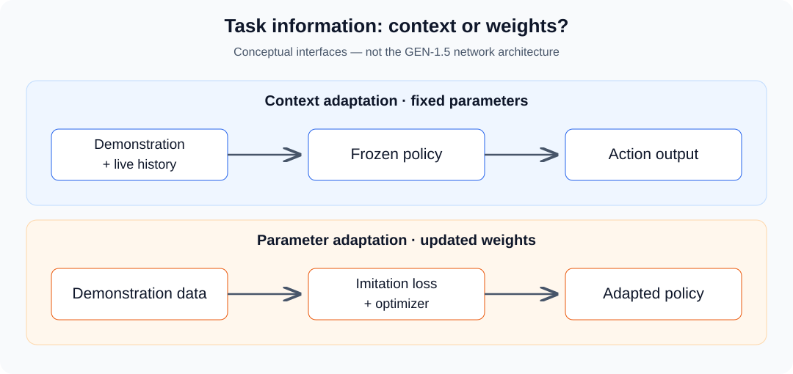

**看到一次示范后开始执行，与看完示范后重新训练，是两种不同的适应方式。** GEN-1.5 值得讨论的地方，是它让我们重新审视：教机器人一个任务时，哪些信息应进入输入，哪些需要写入参数？

本文以 Generalist 于 2026-08-19 发布的 [GEN-1.5 官方文章](https://generalistai.com/blog/gen-1.5)为入口。先简要核对发布内容，再给出独立的机制解释、评测设计和 Python 练习；不将通用公式或教学代码标成官方内部实现。

| 阅读目的 | 入口 |
| --- | --- |
| 先了解发布结果 | [事实摘要](#release) |
| 分清提示与训练 | [两条适应路径](#adaptation) |
| 理解闭环与数据接口 | [示范如何成为条件](#context) |
| 判断实验说明什么 | [评测方法](#evaluation) |
| 动手计算 | [Python 练习](#lab) |
| 继续读相关研究 | [研究脉络](#related) |

## 1. 官方发布内容：先保留实验口径 {#release}

官方描述：模型接收多模态观测，使用 30 秒记忆，输出 100 Hz 动作轨迹。一次 3–12 秒的示范可作为上下文，无需更新参数；在 10 个短时任务上，平均成功率为 59%±10%。另一设置使用每任务 5 分钟数据、10 次梯度更新，结果为 83%±9%；± 标注为标准差。文中还展示技能组合、仿真示范迁移及部分人手示范案例。这些都是团队报告，不能扩展为任意任务的保证。详见[官方结果与示例](https://generalistai.com/blog/gen-1.5)。

以下各节提供分析框架。公式不用于推断其未说明的网络结构、动作编码或训练损失，也不据这些汇总数字反推试验次数。

## 2. 两条适应路径：任务信息存在哪里 {#adaptation}

### 2.1 上下文适应：参数固定，条件改变

把示范写成序列 $D=\{(o_k,q_k,a_k)\}_{k=1}^{K}$，其中 o 是观测，q 是机器人状态，a 是动作。令 $H_t$ 表示执行到当前的历史，一种通用的条件策略写法是：

$$
a_t\sim\pi_\theta(\cdot\mid D,H_t).
$$

这里固定的是参数 theta，变化的是输入中的示范和当前历史。换一段 D，模型面对的条件分布就变了；不需要调用优化器，也能改变输出行为。

这种“学习”描述输入条件下的适应，不意味着模型永久记住了新任务。若后续清空示范或移除有关历史，是否还能执行，需要单独测试。上下文记忆、持久任务库与模型参数是三种不同的存储位置。

### 2.2 参数适应：示范用于改变模型

另一条路径把示范作为训练数据，例如采用通用的模仿损失：

$$
\theta^{(k+1)}=\theta^{(k)}-\eta\nabla_\theta
\mathcal L_{\mathrm{imit}}(\theta^{(k)};D).
$$

eta 是学习率，k 是优化器步骤。更新后，新参数可能在不保留原始示范上下文的情况下表达任务，但仍需通过测试确认。该式只说明梯度适应的概念，不是 GEN-1.5 官方损失的复现。

| 问题 | 上下文适应 | 参数适应 |
| --- | --- | --- |
| 示范的直接用途 | 输入条件 | 梯度计算的数据 |
| 可训练参数是否变化 | 不变化 | 至少部分参数变化 |
| 如何切换任务 | 更换上下文或任务提示 | 更换权重、适配器，或重新适应 |
| 主要检查项 | 提示选择、历史保留、输入对齐 | 学习率、更新范围、数据划分、遗忘 |
| 是否免除前期训练成本 | 否 | 否 |

从这一区分出发，“一步更新”应与“一次示范”分开计数。一次优化器更新可以消费一个很大的 batch，也可能包含梯度累积；示范数量、数据时长、更新次数、训练墙钟时间与峰值显存，都应独立记录。

### 2.3 为什么不能把少步适应直接称为元学习

MAML 明确把“新任务上少量更新后表现好”纳入训练设计，通过跨任务优化获得易于适应的初始化。因此，观察到一个模型能快速微调，只能说明一种能力，不能反推出它使用了 MAML 或某个内外循环。方法定义可参考 [MAML 原始论文](https://arxiv.org/abs/1703.03400)。

## 3. 示范提供任务信息，闭环处理当前世界 {#context}

设想一个自拟任务：示范中，操作者将桌面上的一个圆柱放入左侧盒子。测试时，圆柱位置变了，盒子也移动了。

如果控制器只按时间重放示范中的关节角，它可能仍然伸向旧位置。条件策略则需要利用当前观测，判断“取这个物体放入那个容器”在新场景中对应什么动作。示范提供任务约束，当前传感反馈提供实际状态；二者都不能被另一方替代。

下面是为了理解接口而画的概念图，不代表官方模块划分：



### 3.1 一个示范究竟可能包含什么

纯视频只呈现外观变化；带状态与动作的序列还可能提供接触时机、夹爪开闭、移动方向和执行速度。要把这样的序列作为输入，至少需要把时间戳、坐标系、单位和动作语义讲清楚。

| 字段 | 必须回答的问题 |
| --- | --- |
| 图像或视频 | 相机视角是什么？多相机是否同步？ |
| 机器人状态 | 是关节空间、末端空间，还是两者都有？ |
| 动作 | 表示目标位置、增量、速度还是力矩？ |
| 时间 | 采样间隔固定吗？是否存在掉帧或重复记录？ |
| 任务边界 | 哪一帧是开始，哪一帧代表成功？ |

跨机器人时，两个同样形状的数组也可能语义不同。六个数可以表示位姿、速度或力，数值相近并不证明可直接互换。任何复现实验都应先定义适配层，不能只把人手或另一台机器人的数据拼进 Tensor 就称为跨本体迁移。

这里还有一个容易混淆的输入条件：官方通常所说的 physical prompt 是传感与动作示范，来自手持夹爪采集或机器人轨迹；文中的部分直接人手示范案例不能推成“任意普通视频都可用”。参见[官方上下文学习说明](https://generalistai.com/blog/gen-1.5)。

下面是一份**本文自拟的示范元数据**，用于说明实验记录应该包含哪些信息，不是官方 SDK 的参数格式：

```json
{
  "demo_id": "cylinder_to_box_001",
  "task_id": "place_cylinder",
  "duration_s": 6.0,
  "observation_clock": "capture_monotonic",
  "action_frame": "robot_base",
  "translation_unit": "m",
  "action_semantics": "end_effector_target_pose",
  "success_rule": "object_inside_box_and_gripper_released",
  "split": "adaptation"
}
```

这份记录不能替代视频、动作数组或标定文件，但能防止同一个字段被不同人作出不同解释。例如 `end_effector_target_pose` 与位姿增量不是同一命令，世界坐标中的目标也不能直接当作基座坐标目标。若真实模型接口不接受这些语义，需要另做转换并验证。

### 3.2 组合技能比拼接轨迹多了什么

继续使用自拟例子：一段示范教“打开盒盖”，另一段教“放入物体”。中间还需要让手从开盖结束姿态移动到可抓物体的姿态，并处理盒盖是否弹回、物体是否可达等状态。

验证组合能力时，应单独标注这些过渡动作是否出现在示范中，并测试不同起始状态。若只播放一次成功视频，无法判断系统是理解了任务关系、复用了常见运动片段，还是偶然匹配了熟悉布局。

### 3.3 时间窗口不等于 token 数，也不等于推理频率

用一个预算模型表示：

$$
T_{\mathrm{demo}}+T_{\mathrm{live}}+T_{\mathrm{reserve}}
\leq T_{\mathrm{window}}.
$$

这只是时长账本。实际 token 数还取决于视频采样率、视觉压缩、动作表示和多模态编码。动作轨迹有固定采样频率，也不意味着大模型每个采样点都重新前向；它可能生成一段轨迹，再由执行端按时钟消费。

因此应分别记录模型请求频率、动作轨迹频率、低层伺服频率和端到端延迟。仅知道其中一个，不能推导其他三个。

## 4. 如何评测“看一次就会” {#evaluation}

下面是本文建议的评测设计，不是对官方未披露试验细节的补写。

### 4.1 把适应数据与测试数据隔开

先选定任务与成功标准，再记录示范，最后在未用于选择示范的测试初始状态上执行。若先看了测试失败，再反复挑一段最合适的提示，提示选择本身已经使用了测试反馈，应报告这笔预算。

“新任务”也有不同强度：新物体位置、新物体实例、新的动作组合、新的目标关系和新的机器人本体，不能压成一个泛化标签。建议逐层分开记录，才能知道变化发生在哪一维。

### 4.2 最少需要哪些对照

| 对照 | 主要回答的问题 |
| --- | --- |
| 正确示范与无示范 | 上下文是否提供了额外任务信息？ |
| 正确示范与错误任务示范 | 策略是否真的受示范内容影响？ |
| 完整示范与打乱时序示范 | 动作顺序是否重要？ |
| 新布局与示范布局 | 是否依赖轨迹或背景匹配？ |
| 固定提示与多次挑选提示 | 成功率是否包含提示搜索收益？ |
| 相同数据预算下的上下文与微调 | 输入适应和参数适应的成本如何比较？ |

各实验还应统一重置方式、超时、人工干预与失败判定。暂停机器人、重新摆放物体或额外口头提醒，都可能改变结果，应进入日志。

### 4.3 短任务成功率不能直接当成长流程成功率

假设一个自拟流程有 10 个阶段，每个阶段在此前阶段全部成功的条件下，成功概率都是 0.9。若不允许失败恢复，整条流程的通过率是：

$$
P(S_1\cap\cdots\cap S_{10})
=P(S_1)\prod_{k=2}^{10}P(S_k\mid S_1,\ldots,S_{k-1})
=0.9^{10}\approx0.3487.
$$

这是条件概率链式法则的算例，不是 GEN-1.5 的实测结果。它不需要假定阶段独立，但需要每个阶段在成功前缀下都满足所设条件概率；把单独重置后测得的十个成功率直接代入，往往并不满足这一前提。

真正的组合测试应记录阶段切换、成功前缀带来的状态分布变化，以及是否发生恢复。一个允许重新抓取的控制器与“一次抓取失败即判负”的控制器，评测口径不同。建议同时报告最终成功率、完成时间、恢复次数与人工介入次数，而不是只数完成了多少原子动作。

### 4.4 怎样判断模型确实使用了示范

给同一个初始场景两段不同任务示范，比如分别要求放入左盒和右盒，观察行为是否随提示改变。这个测试有助于识别条件依赖，但仍不能证明模型形成了某一种内部任务表征。

再把示范移除、替换成另一个任务或保留物体外观却打乱动作顺序。如果行为完全不变，可能是任务先验已经很强，也可能是提示没有被正确送入模型，需要通过更多对照定位。一次对照失败不必然证明没有上下文能力；它首先说明该实验不能支持所期待的因果解释。

对于仿真或跨本体示范，应把“未用目标任务真机数据微调”“没有任何目标任务示范”“预训练没有某类数据”分别列出。zero-shot 的名称必须说明相对于哪一种数据或更新而言，否则不同实验可能在比较不同难度的问题。

### 4.5 平均值、标准差和置信区间回答不同问题

每任务成功率可以先求平均，形成任务等权的 macro 指标；也可以合并全部试验，形成 trial 等权的 micro 指标。任务试验次数不同时，两者通常不同。

例如自拟任务 A 成功 9/10，任务 B 成功 10/20：macro 为 70%，micro 为 19/30≈63.33%。这不是两个程序谁算错了，而是赋予任务的权重不同。

标准差描述某个指定统计对象的离散程度；置信区间需要说明抽样单位与估计方法。任务间波动、随机种子间波动和单任务重复执行的波动都可能不同。只有汇总百分比时，不能补造样本数、把标准差直接当成置信区间，或判断任意两个模型具有统计显著差异。

## 5. 可运行 Python：预算与评测口径 {#lab}

下载 [prompt_eval.py](prompt_eval.py) 和 [test_prompt_eval.py](test_prompt_eval.py)，放在同一目录。仅使用 Python 标准库：

```bash
python3 -m unittest -v test_prompt_eval.py
python3 prompt_eval.py
```

脚本提供四项独立练习：

1. 给定窗口、示范时长与实时历史，检查是否超预算。
2. 用自拟成功次数计算 macro 和 micro。
3. 对自拟二项试验计算 Wilson 区间，练习区分样本成功率与不确定性。
4. 对已配对的两种提示结果，统计哪些场景改善、哪些场景退步。

[实际输出](assets/example-results.json)中，30 秒窗口内放入 6 秒和 8 秒两段示范，保留 12 秒实时历史，共使用 26 秒、剩余 4 秒。若按 100 个动作采样点/秒换算，共对应 2600 个名义动作采样点。**这些不是模型 token 数、KV cache 大小或模型调用次数**，该布局也不是官方输入格式。

Wilson 示例使用上面自拟的 19/30，假设试验独立同分布。真实机器人数据可能因共享物体、操作者或重置过程而相关，不能无条件套用这个区间。代码是统计练习，不调用 GEN-1.5，也不控制机器人。

### 5.1 不只比较平均数：同一组场景中谁改善、谁退步 {#paired-evaluation}

考虑一个自拟的 8 对试验。每对使用同一任务和匹配的初始场景，分别测试“正确示范”与“无示范”。真实物理执行不能共享同一次随机轨迹，因此需要重置场景，并随机化两种条件的执行先后；这里的配对指实验设计上的匹配，而不是事后按结果排序。

脚本中的布尔数组代表下面的合成记录，不是 GEN-1.5 评测：

| 配对结果 | 数量 | 解读 |
| --- | --- | --- |
| 两种条件都成功 | 2 | 这些场景不能区分提示收益 |
| 仅正确示范成功 | 3 | 本批中提示条件改善的场景 |
| 仅无示范成功 | 1 | 本批中提示条件退步的场景 |
| 两种条件都失败 | 2 | 提示没有解决这些失败 |

正确示范成功 5/8，无示范成功 3/8，差值是 `(3−1)/8=0.25`，即 **25 个百分点**，不是“相对提升 25%”。这是样本描述，不是总体显著性结论；八对试验远不足以概括复杂机器人任务。

`paired_outcomes` 会拒绝空数据、缺失值、不等长度和非布尔结果，避免默默丢弃没有执行完的一侧。但它不能验证两侧是否真的对应同一个场景，这需要调用方保存 `task_id`、`scene_id`、条件、运行顺序、模型版本与提示 ID。多个任务混合时，先按任务分别报告，再明确怎样汇总，不能把所有配对当成同一个同质分布。

### 5.2 失败日志应能解释下一次怎么改

可以先把失败按执行链分为四类，再用原始视频和传感日志核对：

| 观察到的现象 | 待验证假设 | 下一项有针对性的对照 |
| --- | --- | --- |
| 稳定地执行另一个任务 | 提示含糊或任务信息未生效 | 相同场景替换目标明确的示范 |
| 目标方向正确，但总偏离物体 | 标定、坐标或时序不一致 | 固定目标，单独检查观测—动作对齐 |
| 单项动作完成，组合时卡在过渡 | 中间状态分布没有覆盖 | 保持子任务不变，仅改变过渡起始状态 |
| 接触后失败且不再调整 | 反馈不足或恢复策略失效 | 记录触碰前后观测、动作与介入时间 |

这些是排查假设，不是从一次录像就能下的模型诊断。比如末端以 0.2 m/s 移动时，80 ms 的时序偏差对应 1.6 cm 的位移；在小物体抓取中，输入对齐错误可能表现得像“模型不理解任务”。这个运动学算例假定速度恒定，只用于说明为什么要先测时间戳，不能作为某个系统的实际延迟估计。

最后固定一条规则：测试失败后更换示范、修改成功判定、增加重试或人工摆正物体，都属于实验条件变化。保留原始结果再启动新条件，才能判断改动是否带来收益。

## 6. 放回研究脉络：哪些问题已有可读实现 {#related}

ICRT 将传感、状态与动作序列作为提示，用因果 Transformer 进行预测，并在测试时保持策略参数固定。它提供了一条阅读“上下文模仿学习如何组织输入”的具体路线；不应据此推断 GEN-1.5 使用相同架构。可从 [ICRT 论文](https://arxiv.org/abs/2408.15980)继续阅读。

Instant Policy 用图表示和扩散过程建模上下文模仿，并用仿真生成的伪示范训练。这提供了另一条带明确结构偏置的路线，也说明“无需新任务微调”并不限定为一种网络或一种数据来源。参见 [Instant Policy 论文](https://arxiv.org/abs/2411.12633)。

实际选读时，可以围绕三个具体问题对照这些工作：示范如何编码，测试时允许改变什么，训练分布如何覆盖测试任务。这样比只比较 one-shot 或 foundation model 标签更容易定位技术差异。

现有博客中的 [RynnBrain](../rynnbrain/)侧重具身理解及输出协议，[PPO、DPO、GRPO](../ppo-dpo-grpo/)侧重通过优化改变策略；本文则关注任务条件与少量示范如何参与适应。三条路线可以共同进入机器人系统，但输入输出与训练职责应分别核对。

## 阅读自测与验收

- 能否区分上下文适应与参数适应，并说明一次示范、一个 batch 和一步梯度更新为何不是同一单位？
- 运行五项测试，解释时间窗口、动作采样点、模型 token 与推理频率之间不能直接换算的原因。
- 用自拟成功次数计算 macro 与 micro，并说明标准差为何不能直接当作置信区间。

<details>
<summary>展开核对：关键结论</summary>

- 上下文适应改变条件输入，参数适应改变权重；两者都依赖前期训练，任务级成本应分项记录。
- 时间账本只约束时长；动作编码、视觉压缩与执行接口决定其他资源，脚本没有官方编码器。
- macro 对任务等权，micro 对试验等权；不确定性估计需要样本量、抽样单位与相关性假设。

</details>

## 参考资料

- [GEN-1.5 官方文章](https://generalistai.com/blog/gen-1.5)：发布结果来源，核对日期 2026-09-09。
- [In-Context Imitation Learning via Next-Token Prediction](https://arxiv.org/abs/2408.15980)：ICRT 的输入与策略定义。
- [Instant Policy: In-Context Imitation Learning via Graph Diffusion](https://arxiv.org/abs/2411.12633)：另一种上下文模仿路线。
- [Model-Agnostic Meta-Learning](https://arxiv.org/abs/1703.03400)：区分快速适应能力与明确的元学习训练目标。
