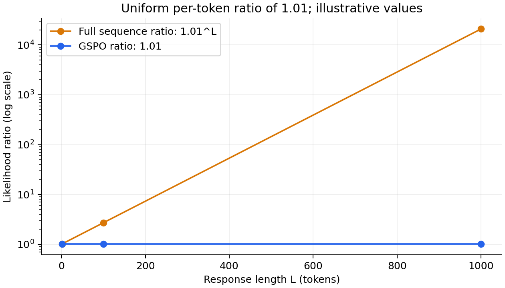
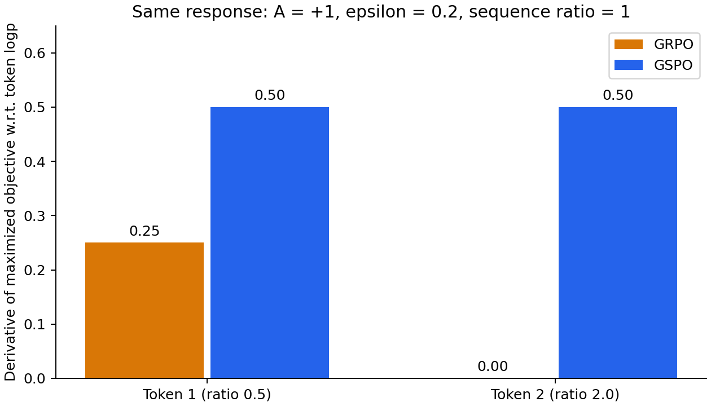
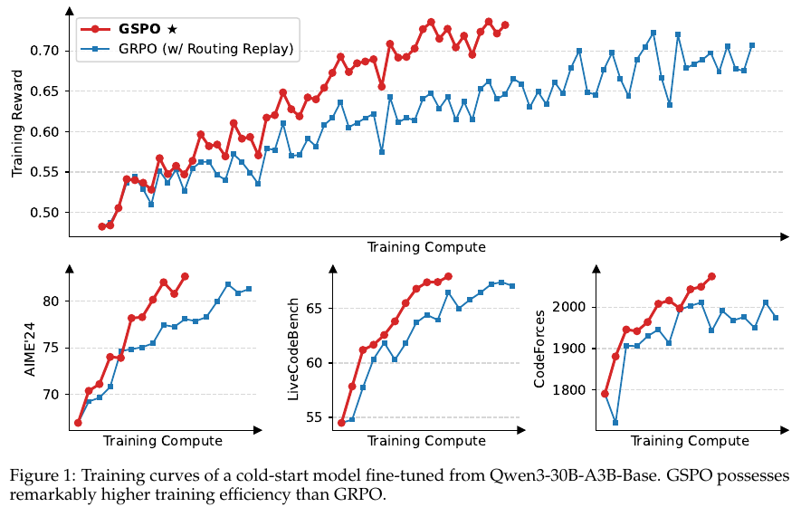
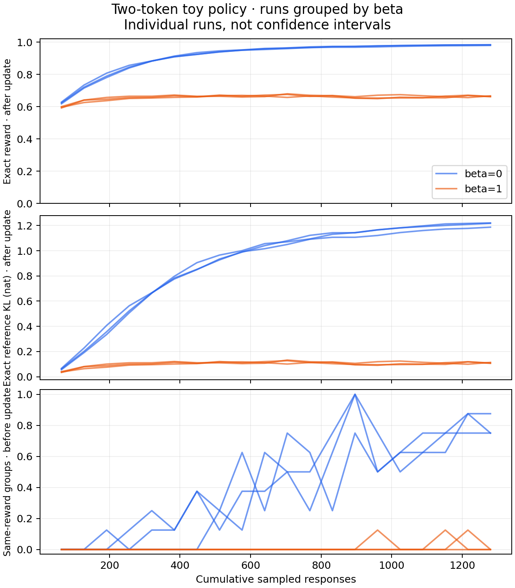

**GSPO 保留 GRPO 的组内相对优势，把每个 token 各自的概率比，换成整条回答共享的、经过长度归一化的序列概率比，再以回答为单位裁剪。** 变化看起来只有几行公式，却会改变同一条回答中各 token 的梯度权重，以及一条样本何时停止贡献策略梯度。

本文分析 Qwen 团队的 *Group Sequence Policy Optimization*。依据是所提供的 7 页 PDF，文件页边标注 **arXiv:2507.18071v1，2025-07-24**，首页内部日期为 2025-07-25。[arXiv 版本页](https://arxiv.org/abs/2507.18071v1)还列出了后续 v2；下文的公式编号、图表和结论范围均对应这份 v1，不将后续框架行为混入论文原始定义。

阅读重点有三项：理解概率比为什么改，弄清长度归一化改变了什么，以及实验究竟验证到了哪一步。配套代码在 CPU 上核对目标与一阶梯度，并用一个两 token 策略演示真实参数更新；不下载模型，也不声称复现 Qwen3 的训练收益。

| 阅读目的 | 入口 |
| --- | --- |
| 先理解算法变化 | [核心公式](#objective)、[梯度对照](#gradients) |
| 判断理论解释是否充分 | [重要性采样与归一化](#importance-sampling) |
| 正确实现裁剪与 detach | [裁剪](#clipping)、[GSPO-token](#gspo-token) |
| 评估论文证据 | [实验解读](#evidence)、[MoE 与工程边界](#moe) |
| 自己运行验证 | [实验层级](#lab-map)、[在线采样](#online-loop)、[参数对照](#experiment-config) |

## 1. 论文想解决什么问题 {#problem}

大模型 RL 往往先批量生成回答，再把 rollout 切成多个 mini-batch 更新参数。同一批回答由旧策略生成，后续更新时当前策略已经变化，因此会出现采样策略与训练策略的差异。

GRPO 不训练 critic，而是对同一个问题生成一组回答，根据组内奖励计算相对优势。一个回答通常只有一个最终奖励，其所有 token 共享优势；但 GRPO 仍为每个 token 使用不同的 current/old 概率比，并逐 token 裁剪。论文认为，这种组合在长回答和稀疏 MoE 上会放大训练噪声，并报告了严重的训练稳定性问题。

GSPO 的回应是让奖励、概率变化度量和裁剪决策都以完整回答为单位。它不是新的奖励模型，也没有取消 old policy；与 GRPO 一样，仍要采样、评分、计算优势和更新策略。

本文比较的是论文式 (2) 的 outcome GRPO：每回答先平均 token，再平均回答，并省略 KL 项。不同实现对长度归约、KL、采样和截断的选择可能不同，不能只看算法名称就认定目标完全一致。PPO、GRPO、DPO 的基础关系可先看[已有教程](../ppo-dpo-grpo/)。

### 1.1 把一次语言模型 RL 拆成四个对象

可以把问题 x 看作环境给出的初始条件，把一条完整回答 y 看作一条轨迹。token 是逐步采取的动作，生成到 EOS 或长度上限时，验证器为整条回答打分。数学题可以用最终答案是否正确作为奖励，代码题可以用测试通过率；奖励并不自动告诉我们是哪一个 token 做对了。

这里有四种职责不同的对象：

| 对象 | 保存或计算什么 | 本批更新时如何处理 |
| --- | --- | --- |
| 行为策略 old | 生成当前回答的策略，以及该回答的旧 logps | 采样后冻结，不能随着 mini-batch 更新覆盖 |
| 当前策略 current | 用可训练参数重新计算同一回答的 logps | 参与反向传播和优化器更新 |
| 验证器或奖励函数 | 对完整回答打分 | 本文把奖励当成不反传的标量 |
| 同题回答组 | G 条候选及其奖励 | 提供相对比较，不需要单独训练价值网络 |

“没有 critic”表示省去了拟合价值函数的网络与相应训练，不表示省去了奖励计算，也不表示不再需要 baseline。GRPO 和 GSPO 用组内奖励统计量构造优势；其信号是“比同题其他候选更好或更差”，而不是直接知道某个 token 的真实长期价值。

### 1.2 从原始奖励目标到策略梯度

对固定的问题分布，最直接的目标是让当前策略的平均奖励更高：

$$
F(\theta)=\mathbb E_x\sum_y\pi_\theta(y\mid x)r(x,y).
$$

若奖励不直接依赖参数，使用 $\nabla\pi=\pi\nabla\log\pi$，并展开自回归概率，得到：

$$
\nabla F(\theta)=\mathbb E_{x\sim D,\,y\sim\pi_\theta(\cdot\mid x)}
\left[r(x,y)\sum_t\nabla\log\pi_\theta(y_t\mid x,y_{<t})\right].
$$

这就是完整回答奖励如何进入每个 token 的梯度。并不是奖励先被分解成了每个 token 的正确分数，而是完整序列的对数概率本来就等于各 token 对数概率之和。最终奖励给所有动作提供同一个标量信号，信用分配因此可能很粗。

如果减去与被采样回答无关、仅依赖 x 的 baseline，期望梯度中的 baseline 项为零，可以降低方差。组内均值则包含当前回答自身，标准差也由这一组计算；它不是一个可以不加说明就套入“独立 baseline 无偏性”的常数。本文把组内标准化看作算法定义的一部分，不将其目标与原始期望奖励的精确梯度画等号。

请记住两条线索：**原始奖励目标解释我们想提高什么；实际 surrogate 定义我们这一次怎样更新。** 从前者到后者，还经过旧数据复用、组内优势、长度归一化与裁剪，不能漏掉这些改变。

## 2. 先把三个概率比写清楚 {#objective}

设 x 为问题，$y_i=(y_{i,1},\ldots,y_{i,L_i})$ 为组内第 i 条回答，$L_i$ 为有效回答 token 数，G 为组大小。用以下简写表示对**同一条已采样回答、同一个前缀**计算的概率：

$$
p_{i,t}=\pi_\theta(y_{i,t}\mid x,y_{i,<t}),\qquad
p^{\mathrm{old}}_{i,t}=\pi_{\theta_{\mathrm{old}}}(y_{i,t}\mid x,y_{i,<t}).
$$

### 2.1 GRPO 的 token 概率比

$$
w_{i,t}=\frac{p_{i,t}}{p^{\mathrm{old}}_{i,t}}.
$$

每个 token 拥有自己的比例，某一处概率增加、另一处概率下降，会分别影响它们的梯度和裁剪状态。

### 2.2 原始序列概率比

自回归分解给出：

$$
R_i=\frac{\pi_\theta(y_i\mid x)}{\pi_{\theta_{\mathrm{old}}}(y_i\mid x)}
=\prod_{t=1}^{L_i}w_{i,t}.
$$

这才是完整回答分布之间的原始似然比。长序列上直接连乘既不便计算，也可能产生很大的数值变化。

### 2.3 GSPO 实际采用的比例

论文式 (8) 定义：

$$
s_i=R_i^{1/L_i}
=\exp\left(\frac1{L_i}\sum_{t=1}^{L_i}
\big[\log p_{i,t}-\log p^{\mathrm{old}}_{i,t}\big]\right).
$$

它是 token 概率比的**几何平均**，不是算术平均，也不是完整序列概率比本身。实现时先对 log-probability 差求有效 token 平均，再取 exp。

例如每个 token 的概率比都为 1.01，长度 100 时原始序列比约为 2.7048，长度 1000 时约为 20959.16，但两条回答的 GSPO 比例都为 1.01。归一化使比例更容易在统一数值尺度上比较，同时也弱化了长度累积的变化。



### 2.4 优势与最终目标

GSPO 保留组内标准化奖励：

$$
\widehat A_i=\frac{r(x,y_i)-\operatorname{mean}_j r(x,y_j)}
{\operatorname{std}_j r(x,y_j)}.
$$

其最大化目标为论文式 (6)：

$$
J_{\mathrm{GSPO}}=
\mathbb E\left[\frac1G\sum_{i=1}^{G}
\min\left(s_i\widehat A_i,
\operatorname{clip}(s_i,1-\epsilon,1+\epsilon)\widehat A_i\right)\right].
$$

期望覆盖问题与旧策略采样的回答组。实际实现需处理零方差；本文代码采用总体标准差 `correction=0`，分母加 $10^{-8}$，同分组的优势为零。这是明确的数值实现约定，不能从论文未写出的 epsilon 或标准差自由度直接猜出官方实现。

论文为突出策略目标而省略 KL，不意味着 GSPO 必须禁用 KL。old policy 是本批数据的行为策略，reference policy 是可能用于 KL 约束的参考模型，两者不能混为一谈。

### 2.5 一组奖励如何变成四个优势

假设同题四条回答的奖励为 `[0, 0.5, 0.5, 1]`。均值为 0.5，总体方差为 0.125，标准差约为 0.353553；忽略数值 epsilon 时，优势为：

$$
\widehat A=[-\sqrt2,0,0,\sqrt2].
$$

最差回答得到负信号，最好回答得到正信号，两条中间回答的策略优势为零。如果四条都答错且奖励相同，标准化不会创造出“哪一条更值得鼓励”的信息。

标准化还意味着，不同问题组的奖励差距被重新缩放。一组的原始奖励差非常小，也可能得到与大差距组相近的标准化优势。这有助于形成相对比较，却也可能放大奖励噪声。需要区分奖励是否准确、组内是否有区分度、优势是否经过额外裁剪，不能只看平均奖励。

### 2.6 组内 baseline 为什么不能直接套用无偏性结论 {#group-baseline}

先做一个简化推导：固定同一个问题，G 条回答由当前策略独立同分布采样，令 $z_i=\nabla_\theta\log\pi_\theta(y_i\mid x)$，使用完整序列的 score，暂时不做长度平均、标准差归一化或裁剪。记该问题的期望奖励为 F，组内均值为 $\bar r$。因为 $\mathbb E[z_i]=0$，其他回答的奖励与 $z_i$ 独立：

$$
\mathbb E[(r_i-\bar r)z_i]
=\mathbb E[r_i z_i]-\frac1G\mathbb E[r_i z_i]
=\left(1-\frac1G\right)\nabla_\theta F.
$$

同题均值包含当前回答自身，因此产生了一个缩放；这比笼统说“baseline 有偏”更具体。若改用其余回答的平均奖励，记为 $\bar r_{-i}$，则逐样本满足：

$$
r_i-\bar r_{-i}=\frac{G}{G-1}(r_i-\bar r).
$$

这解释了 leave-one-out baseline 在这个简化条件下如何恢复期望梯度。它不说明完整 GRPO 或 GSPO 只差一个常数：再除以本组随机标准差、使用每回答长度平均、复用旧策略样本或进行裁剪后，上面的前提已经改变。

尤其要区分两件事：一个 baseline 是否与当前动作独立，是期望恒等式的问题；实际替代目标是否能稳定提高任务表现，是还需实验回答的问题。本文代码保留组内标准化的算法定义，不能给 loss 乘上 G/(G−1) 就声称修复了全部偏差。

## 3. 重要性采样：支持算法动机，但不能跳过归一化这一步 {#importance-sampling}

论文式 (5) 使用完整序列比得到重要性采样恒等式：

$$
\mathbb E_{y\sim\pi_\theta}[r(x,y)]
=\mathbb E_{y\sim\pi_{\mathrm{old}}}
\left[\frac{\pi_\theta(y\mid x)}{\pi_{\mathrm{old}}(y\mid x)}r(x,y)\right].
$$

这要求行为分布覆盖目标分布所需的支持集，并且奖励函数按该期望定义固定。若用 $R_i^{1/L_i}$ 替换 $R_i$，上述恒等式一般不再成立；再加裁剪和组内标准化后，更应把实际目标理解为用于稳定更新的替代目标。

可以用两个长度均为 2 的完整回答验证。旧分布为 `[0.5, 0.5]`，新分布为 `[0.8, 0.2]`，奖励为 `[1, 0]`。目标期望是 0.8；使用原始权重 `[1.6, 0.4]` 时，旧分布加权结果仍是 0.8。若对权重开平方，则得到：

$$
0.5\sqrt{1.6}\times1+0.5\sqrt{0.4}\times0
\approx0.63246.
$$

这不是代码 bug，而是长度归一化改变目标的直接结果。因此，不能把“序列比有清晰的重要性采样解释”扩展为“GSPO 的归一化裁剪目标是原奖励期望的无偏估计”。

论文第 3 节还强调：每个前缀的 next-token 分布只观察到一次采样，token 权重难以发挥修正作用。阅读时需要保留一个区别：**单样本会带来高方差，但不会仅因样本数为 1 就使重要性采样恒等式失效。** 对完整回答奖励的期望，单个条件概率比又确实不能直接替代完整序列比，因为前缀分布和后续生成也参与了联合分布变化。

更稳妥的理解是：作者提出了一个针对 GRPO surrogate 的失稳解释，并用训练结果支持序列层设计；这不构成“所有 token 级策略梯度都无效”的一般性证明。

## 4. 梯度究竟改变在哪里 {#gradients}

先忽略 clipping，把采样数据、old logps 和组内优势视为常量。GSPO 对单条回答的梯度为：

$$
\nabla_\theta J_i^{\mathrm{GSPO}}
=s_i\widehat A_i\frac1{L_i}\sum_t\nabla_\theta\log p_{i,t}.
$$

与之对照，论文所写 GRPO 的梯度为：

$$
\nabla_\theta J_i^{\mathrm{GRPO}}
=\frac{\widehat A_i}{L_i}\sum_t w_{i,t}\nabla_\theta\log p_{i,t}.
$$

GSPO 让整条回答共享一个标量权重 $s_i\widehat A_i$；GRPO 让每个 token 再乘自己的 $w_{i,t}$。所谓“token 权重相同”指这一个外部系数，不表示各 token 对模型参数的梯度向量相同，也不表示长短回答的梯度范数相同。

当 current 与 old 完全相等、两边使用相同优势与归约时，所有比值为 1，二者的策略目标一阶梯度相同。差异主要在同批数据经过更新、current 偏离 old 后显现；不能用更新前的一次梯度相等证明两个算法始终等价。

### 4.1 用链式法则逐步得到 GSPO 梯度

定义 $d_i=L_i^{-1}\sum_t(\log p_{i,t}-\log p^{\mathrm{old}}_{i,t})$，则 $s_i=\exp(d_i)$。反向传播经过三步：

1. 对 exp 求导得到 $\nabla s_i=s_i\nabla d_i$。
2. old 和长度固定，因此 $\nabla d_i=L_i^{-1}\sum_t\nabla\log p_{i,t}$。
3. 优势固定，未进入平坦裁剪分支时，再乘 $\widehat A_i$。

对**独立的 logp 输入坐标**，一条回答内每个有效 token 的导数都是 $s_i\widehat A_i/L_i$；若全批平均 N 条回答，还要乘 $1/N$。但真正训练时 logps 来自共享神经网络，某个参数会同时影响多个位置与多个候选，优化器移动参数后的概率变化不等于这些坐标导数本身。

### 4.2 一个能手算的两 token 例子

令两个 token 的概率比分别为 0.5 和 2，优势为 +1，教学裁剪范围为 [0.8, 1.2]。GRPO 的第二个 token 被上界裁剪，GSPO 的比例则为 $\sqrt{0.5\times2}=1$，两 token 都贡献梯度。

| 方法 | 目标值 | 对第一个 logp 的导数 | 对第二个 logp 的导数 |
| --- | --- | --- | --- |
| GRPO | 0.85 | 0.25 | 0 |
| GSPO | 1 | 0.5 | 0.5 |
| GSPO-token，同一优势 | 1 | 0.5 | 0.5 |

这里展示的是**最大化目标对 token logp 的导数**。如果代码最小化 `loss=-objective`，符号反转；对模型参数的梯度还要乘各 logp 的参数雅可比。



这一例子也揭示代价：一个 token 的概率下降可被另一个 token 的上升抵消。序列比接近 1，不等于每个 token 都接近旧策略，也不能单独当作 token KL 的上界。

## 5. 序列裁剪不是“比例越界就全部丢掉” {#clipping}

必须同时看比例和优势符号。对论文的 `min` 型 clipped surrogate，在边界之外：

| 优势 | 比例情况 | 当前策略目标的行为 |
| --- | --- | --- |
| 正 | $s>1+\epsilon$ | 取常数裁剪分支，该回答的此项梯度为零 |
| 正 | $s<1-\epsilon$ | 仍使用 $sA$，有梯度 |
| 负 | $s<1-\epsilon$ | 取常数裁剪分支，该回答的此项梯度为零 |
| 负 | $s>1+\epsilon$ | 仍使用 $sA$，有梯度 |

它限制的是已经朝奖励偏好方向变化过多的更新。若概率变化方向不利，仍保留纠正信号。边界处是不可微点，具体自动微分约定不应通过离散表格推断；本文测试刻意避开边界。

在原始 GSPO 中，一条回答的所有 token 共享裁剪决定。这里“梯度为零”仅指该 clipped 策略项；如果训练还包含 KL、熵或其他损失，并不意味着这些项也停止贡献梯度。

本文为方便手算使用 $\epsilon=0.2$，**不是论文公布的 GSPO 最优超参数**。v1 指出 GSPO 与 GRPO 的裁剪范围往往相差数量级，但没有在正文给出完整可复现的训练配置。不能直接复制 GRPO 的范围后，将结果视为公平的 GSPO 对照。

### 5.1 把裁剪区间放到 log 空间观察

实现虽然保存 logps，裁剪的仍是比例。因为 exp 单调，$s_i\in[1-\epsilon,1+\epsilon]$ 等价于：

$$
\log(1-\epsilon)\leq d_i\leq\log(1+\epsilon).
$$

当 epsilon=0.2，下界约为 −0.22314，上界约为 0.18232，并不是对称的 ±0.2。因为 $\log R_i=L_i d_i$，原始序列比对应的区间是 $[(1-\epsilon)^{L_i},(1+\epsilon)^{L_i}]$；可见控制平均 log-ratio 与控制完整序列比，是不同的约束尺度。

还要分清 **clipped objective 与硬约束**。优化器可以一步跨过区间；即使某条回答的策略项进入平坦分支，其他回答的梯度、KL 项或优化器动量仍可能改变它的概率。clipping 限制的是该项继续鼓励更新的方式，并不把参数投影到一个保证所有比例都在区间内的集合。

## 6. GSPO-token：数值相同，梯度从另一路进入 {#gspo-token}

论文式 (15) 定义：

$$
s_{i,t}=\operatorname{sg}(s_i)
\frac{p_{i,t}}{\operatorname{sg}(p_{i,t})},
$$

其中 sg 表示停止梯度。右侧分母是**当前概率的停止梯度版本**，不是 old probability。前向计算中后一个比例为 1，所以每个 token 看到的数值仍是 $s_i$；反向传播时，$s_i$ 被固定，只从当前 token 的概率进入梯度。

在 log-probability 空间可以写成：

```python
ratio = sequence_ratio.detach()[:, None] * (
    current_logps - current_logps.detach()
).exp()
```

再对每个 token 计算 clipped surrogate，并按有效长度平均。当一条回答内所有 token 使用相同优势时，GSPO-token 与 GSPO 的目标值、裁剪条件和一阶梯度一致。它们的计算图不同，不应进一步推断二阶导数也一致。

若给不同 token 设置不同优势，GSPO-token 允许更细的分配；尤其在多轮 RL 中可以表达回合或片段级差异，但优势如何设计仍需另外论证。此时正负优势可能并存，不能再认为整条回答的裁剪梯度状态必然一致。

## 7. 论文实验支持了什么 {#evidence}

以下事实来自所提供 PDF 第 4–6 页，主要对应图 1–3。正文没有完整超参数表、逐点原始数据或误差条，因此适合做机制与趋势分析，不适合据图计算精确加速倍数。

| 项目 | v1 报告的设置或观察 | 阅读边界 |
| --- | --- | --- |
| 起点 | 从 Qwen3-30B-A3B-Base 微调得到的 cold-start 模型 | 不等于直接从 Base 权重开始 RL |
| 对照 | GSPO 与调参后的 GRPO；GRPO 使用 Routing Replay | 不是一个完全没有稳定化措施的 GRPO 基线 |
| AIME’24 | 32 次采样评估 Pass@1 | 不能写成 Pass@32 或 Best-of-32 |
| LiveCodeBench | 202410–202502，8 次采样评估 Pass@1 | 不能写成 Pass@8 |
| CodeForces | Elo Rating | 是不同量纲的评估指标 |
| 图 1 | GSPO 在训练奖励与三个基准曲线上显示更好的效率趋势 | 横轴 Training Compute 没有给出可换算的绝对刻度 |
| 图 2 | clipped token fraction：GSPO 0.15，GRPO 0.0013 | 约 115 倍差异，不代表同等倍数的速度或样本效率增益 |
| 图 3 | GRPO 有无 Routing Replay 的稳定性对照 | 支持该 MoE 配置下路由处理的重要性 |



这张原图对应表中的训练比较：[查看清晰原图](assets/paper-figure-1.png)，来源为 [GSPO v1](https://arxiv.org/abs/2507.18071v1)。红蓝曲线的高低与横向进展可支持趋势判断，但横轴没有绝对数值刻度，因此不能从图中换算 GPU 小时或精确加速倍数。它与第 9 节由本地玩具实验绘制的曲线属于不同证据来源。

“Pass@1 over 32 samplings”表示用多次采样估计单次回答成功率，不是允许从 32 个候选中挑一个答对的通过率。对推理模型，解码预算和采样方式会明显影响指标解释。

图 1 的叙述还涉及训练中调整 query set、延长生成长度、增加计算投入。它体现整套训练流程的扩展表现，但缺少更多受控消融时，不能把所有提升都精确归因于某一项数学变化。

图 2 的裁剪比例很有启发性：保留更多 token 梯度不一定产生更有效的更新。但它也不能单独证明“裁剪越多越好”。统计 token 比例时，长回答权重更高；还应区分纯粹越过裁剪区间的比例，与结合优势符号后真正停止该项梯度的比例。

## 8. MoE 与训练基础设施：有价值的证据，也有条件 {#moe}

### 8.1 Routing Replay 为什么出现在论文中

MoE 只激活部分专家。论文在 48 层 Qwen3-30B-A3B-Base 上观察到：一次 RL 梯度更新后，对同一个 rollout 样本，新旧策略激活的专家约有 10% 不同。这个百分比描述专家激活变化，不是“10% 的参数被更新”或“10% 的 token 错误”。

作者先前用 Routing Replay 缓存旧策略的专家选择，在训练计算中重放，使 current 与 old 的相关 token 计算使用一致的激活网络。它有额外存储和通信开销，也会约束更新时的路由行为。图 3 展示了这种处理对该 GRPO 配置的作用。

GSPO 在作者报告的实验中不依赖 Routing Replay，仍保持较好的训练稳定性。序列层汇总可能缓和局部 token 概率剧烈变化带来的影响，这是算法具有工程吸引力的地方。

不过，序列平均是否降噪还取决于扰动相关性。若各 token 的 log-ratio 都朝同一方向偏移，平均并不会消除这个共同偏差。第 4 节的抵消例子也说明，聚合可能掩盖局部大变化。因此应写成“论文在这些设置中观察到稳定化”，而不是“GSPO 从理论上保证所有 MoE 永不崩溃”。

### 8.2 能否直接使用推理引擎返回的 old logps

论文第 5.4 节提出，序列层比例可能更容忍训练引擎与推理引擎的数值差异，因此有望省去训练端重算 old logps。其措辞与证据性质更接近工程潜力，不能当作任意训练系统都可删除该步骤的证明。

实际迁移时应核对行为策略的定义：采样温度、top-k/top-p、约束解码、模型版本、精度与路由设置都会影响“采样分布”和“所保存概率”是否一致。尤其是截断采样，不能拿任意未经处理的模型概率，就声称得到了真实行为分布的重要性权重。

可以分别记录训练端与推理端的平均 log-ratio 差、差异分布尾部、GSPO 裁剪状态变化以及实际奖励曲线，再判断能否省略重算。本文的 CPU 目标实验不包含 MoE 或双引擎，不能回答这项性能问题。

## 9. 可运行 Python：核对公式与梯度 {#run}

### 先选实验层级，再解释结果 {#lab-map}

三个脚本沿同一目标函数逐步增加复杂度；选哪一个，取决于要验证的问题：

| 脚本 | 输入与变化 | 可以验证什么 | 不能据此判断什么 |
| --- | --- | --- | --- |
| `gspo_lab.py` | 固定 logps，对输入坐标求导 | 目标值、裁剪方向、detach、梯度等价条件 | 神经网络训练是否收敛 |
| `gspo_update.py` | 固定枚举批次，更新归一化策略参数 | logp 到参数的反传、单批裁剪平台 | 新策略采样后的长期训练趋势 |
| `gspo_online.py` | 每轮重新采样，多次更新，固定 reference | 本玩具任务上的采样闭环与奖励/KL 取舍 | MoE 稳定性、语言能力或硬件吞吐 |

建议先检查第一层，再进入第二、第三层。如果目标函数写错了，在线奖励曲线仍可能上升；反过来，原子测试通过也不保证大模型实验成立。这张表同时说明为何三个脚本应保留，而不是把所有检查合成一条成功率曲线。


可以直接下载 [完整实验包](gspo-lab.zip)，解压后进入 `gspo-lab` 目录；包内 [README](README.txt) 列出了依赖、命令和预期结果。也可以逐个下载 [gspo_lab.py](gspo_lab.py)、[test_gspo_lab.py](test_gspo_lab.py)、[gspo_update.py](gspo_update.py)、[gspo_online.py](gspo_online.py) 和 [requirements.txt](requirements.txt)，放在同一目录。使用 Python 3.10+：

```bash
python3 -m venv .venv-gspo
source .venv-gspo/bin/activate
python -m pip install -r requirements.txt --index-url https://download.pytorch.org/whl/cpu
python -m unittest -v test_gspo_lab.py
python gspo_lab.py --output results.json
```

本文实际运行环境为 PyTorch 2.8.0+cu128，全部实验张量仍在 CPU 上；上面的安装命令选择 CPU wheel，不需要 GPU。十二项测试检查正负优势的单侧裁剪、变长回答下 GSPO-token 的一阶梯度等价、old 与优势停止梯度、NaN padding 的屏蔽、零方差组与空回答，以及 current=old 时的梯度一致性；另外用有限差分独立核对梯度，并检查实际参数更新进入裁剪平台的行为。

### 9.1 关键实现只有几步，但归约顺序不能错

脚本中 `current`、`old`、`mask` 的形状均为 `[回答数, padded token 数]`。优势是一条回答一个值；例子按等大小组展开，因此直接平均回答对应每问题等权。

```python
lengths = mask.sum(-1)
c = torch.where(mask, current, torch.zeros_like(current))
o = torch.where(mask, old.detach(), torch.zeros_like(old))
sequence_ratio = ((c - o).sum(-1) / lengths).exp()
a = advantages.detach()
objective = torch.minimum(
    sequence_ratio * a,
    sequence_ratio.clamp(1 - epsilon, 1 + epsilon) * a,
).mean()
loss = -objective
```

先按回答求平均 log-ratio，再 exp、再裁剪。若先裁剪各 token 比例然后平均，已经回到了另一种目标。若把全批 token 一起平均，长回答会获得额外权重，也改变了本文采用的回答等权约定。

实际训练应先用 `log_softmax(logits)`，再 gather 当前回答 token 的 logp，并保证 logits 与 next-token label 错位对齐。prompt 和 PAD 不计入回答长度；EOS 是否计入，应与真实生成、奖励和旧概率记录保持一致。本文使用已对齐的 logps 隔离目标差异，相关 token 构造可参考[已有 token 实验](../ppo-dpo-grpo/#token-lab)。

掩码在相减前生效：直接算出 NaN 后再乘零，并不能把 NaN 清掉。空回答则直接报错，不能靠长度 clamp 悄悄制造一个虚构训练样本。脚本对比值溢出也会报错，而不额外截断 log-ratio 来改变论文目标。

### 9.2 应看到哪些结果

运行后可对照[本文实际结果 JSON](assets/results.json)。关键字段为：

- `cancellation`：正优势下 GRPO 梯度约 `[0.25, 0]`，GSPO 与 GSPO-token 为 `[0.5, 0.5]`；负优势下分别约 `[0, -1]` 与 `[−0.5, −0.5]`。
- `clipping`：验证第 5 节四种情况，而不是只统计概率比是否越界。
- `is_identity`：原始权重给出 0.8，开方权重给出约 0.63246。
- `advantages`：同分组为零；非同分组接近 ±1，微小偏差来自分母 epsilon。

`gspo_lab.py` 是固定 log-probability 的目标与梯度检查，不含在线 rollout、奖励模型、优化器训练或 benchmark 评测。通过测试说明这些原子计算与推导一致，不能说明已经复现论文的训练效率。

可选下载 [plot_results.py](plot_results.py) 重画本文两张机制图：

```bash
python -m pip install matplotlib==3.10.6
python plot_results.py --input results.json --output figures
```

### 9.3 再向前一步：从 logits 到真实 SGD 更新 {#parameter-update}

前面的实验把 logps 当作输入坐标，适合隔离公式；现在运行 [gspo_update.py](gspo_update.py)，让 logps 真正来自一个归一化策略，并通过优化器改变参数：

```bash
python gspo_update.py --output update-results.json
```

策略有两个位置，每个位置只能输出 0 或 1。参数 `logits` 的形状为 `[2, 2]`，每行 softmax 给出该位置两种选择的概率。第二个位置在这个教学模型里不依赖第一个位置，因此它是一个非常简单、但合法的自回归策略。奖励定义为回答中 1 的比例。

初始 logits 全零，四条回答 `00、01、10、11` 的概率均为 1/4。脚本把它们各取一次，组成确定性的均衡批次；这是人为枚举的旧策略批次，不是随机 rollout。它的优势恰好就是第 2.5 节的 `[-√2, 0, 0, √2]`，old logps 在随后五次更新中始终冻结。

核心数据流为：

```python
# responses: [4, 2]; logits: [2 positions, 2 choices]
current = logits.log_softmax(-1).unsqueeze(0).expand(4, -1, -1)
current = current.gather(-1, responses.unsqueeze(-1)).squeeze(-1)
value = objective(current, old, mask, advantages)
optimizer.zero_grad()
(-value).backward()
optimizer.step()
```

完整脚本已包含参数、旧概率、奖励与优化器定义，上面只展示更新链。它使用 float64、SGD、学习率 0.5，无动量、无 KL，epsilon=0.2。由于模型足够小，当前策略的真实期望奖励可以直接算成两个位置输出 1 的概率的平均，不需要蒙特卡洛估计。

[实际运行结果](assets/update-results.json)如下，每行是完成相应次数更新后、下一次反传之前的状态：

| 已更新次数 | GSPO 目标 | 当前策略精确期望奖励 | 00 的序列比例 | 11 的序列比例 |
| --- | --- | --- | --- | --- |
| 0 | 0 | 0.500000 | 1.000000 | 1.000000 |
| 1 | 0.062338 | 0.544079 | 0.911841 | 1.088159 |
| 2 | 0.123243 | 0.587146 | 0.825708 | 1.174292 |
| 3 | 0.141421 | 0.627986 | 0.744028 | 1.255972 |
| 4、5 | 0.141421 | 0.627986 | 0.744028 | 1.255972 |

这个小实验值得逐行读：

- **初始目标为零仍然可以更新。** 正负优势数值抵消，但它们依赖不同回答概率；函数值为零不意味着梯度为零。
- **比例确实可以越过区间。** 第三次更新把 00 压到 0.8 以下、把 11 推到 1.2 以上，说明 clipping 并非投影操作。
- **固定批次出现平台。** 00 的负优势与 11 的正优势都进入各自平坦分支，另外两条优势本来就是零；在这个无动量、无额外损失的设置里，总梯度因此归零。
- **平台不是任务最优解。** 期望奖励只有约 0.628，而策略若总输出 11 可以得到 1。完整在线训练会按更新后的行为策略再采样，冻结新的 old logps，再开始下一轮；本脚本有意停在单批数据复用，展示它的边界。

第一步还可以手算。初始每个位置对两类 logits 的目标梯度约为 `[-0.176777, +0.176777]`；SGD 最小化负目标后，两类 logit 差增加约 0.176777，输出 1 的概率变成 sigmoid(0.176777)≈0.544079，与表格一致。这也把“奖励信号—序列目标—logp 梯度—参数更新—新概率”串成了一条可检查的链。

### 9.4 完成闭环：重新采样，并加入固定 reference {#online-loop}

下载同目录的 [gspo_online.py](gspo_online.py)，执行：

```bash
python gspo_online.py --output online-results.json
```

它延续两个独立二元动作的策略，但每轮真正从当前策略采样：8 个同题组，每组 8 条回答，每条 2 个 token。这里所有组都来自同一个教学问题；组的重复是为了估计同一任务的更新，不代表 8 种任务。每轮生成后冻结 old logps，再用同一批数据更新 3 次；下一轮才更新行为策略并重新采样，共运行 20 轮。

除了移动的 old，代码还保留一份**始终固定的初始均匀 reference**。增加以下最小化损失：

$$
\mathcal L=-J_{\mathrm{GSPO}}+\beta D_{\mathrm{KL}}(\pi_\theta\Vert\pi_{\mathrm{ref}}).
$$

old 控制本批回答的概率比；reference 表达长期偏离哪一个策略的代价。更新 old 不意味着 reference 跟着变化。若每次把 reference 也替换成 current，就改变了这个正则目标。

本玩具策略的两个位置独立，词表只有两个元素，所以能对所有选择精确求和：

$$
D_{\mathrm{KL}}(\pi_\theta\Vert\pi_{\mathrm{ref}})
=\sum_{t=1}^{2}\sum_{a=0}^{1}p_{\theta,t}(a)
\log\frac{p_{\theta,t}(a)}{p_{\mathrm{ref},t}(a)}.
$$

这是完整序列的 forward KL，以自然对数计算，单位为 nat，没有再除以长度。普通语言模型的条件分布依赖此前生成的 token；不能直接把这段独立位置的精确求和当成通用 LLM KL 实现。尤其是从 old 采样的一个 token 的 logp 差，不自动等于当前策略完整分布下的 KL。测试通过枚举四条序列，独立核对了这里的 KL。

[实测记录](assets/online-results.json)包含 seed=0、1、2，分别运行 beta=0 和 beta=1。下面是三次运行结束后的最小—最大值，**不是置信区间**：

| 设置 | 当前策略精确期望奖励 | 到初始 reference 的精确 KL |
| --- | --- | --- |
| beta=0 | 0.979609–0.983805 | 1.187229–1.220781 |
| beta=1 | 0.661570–0.666853 | 0.106317–0.113904 |



读这张图时，先看横轴：它是累计采样回答数，不是优化器步数或墙钟时间。每轮固定采样 64 条，随后复用数据更新 3 次。再按纵轴依次核对：第一行显示策略奖励，第二行显示偏离 reference 的程度，第三行显示下一步能获得多少组内差异信号。第三行的同分组比例发生在该轮更新前，不能拿它与更新后的概率做逐点恒等比较。

蓝色的高奖励与高 KL 同时出现；橙色更接近固定参考策略。哪个更合适，取决于任务是否需要保留参考行为，不能把更高的训练奖励直接当成全面更好的模型。两组实验的有效奖励尺度还受组内标准化影响，beta 的数值不能直接移植到原始奖励或不同 KL 归约下。

重画曲线时，将 [plot_online.py](plot_online.py) 与下载的结果 JSON 放在同一目录，使用前文相同的 Matplotlib 环境：

```bash
python plot_online.py --input online-results.json --output online-training.png
```

脚本只读取已保存数据，不重新训练、不平滑曲线，也不补造论文实验点。改变训练参数后，应先用新配置重新运行 `gspo_online.py` 并保存结果，再绘图；仅修改图例不能代表完成了新实验。

每次运行均采样 1280 条回答、2560 个 token，执行 60 次参数更新。这些数值只说明该玩具问题上奖励与参考策略偏离的取舍，不是 GSPO/GRPO 排名，也不是论文超参数建议。两种 beta 使用相同 seed，但策略变化后，后续采样的回答会不同，不能把它们描述为完全相同的数据集。

JSON 特意把 `sampled_reward_before_update` 和 `exact_reward_after_update` 分开：前者来自本轮行为策略的有限样本，后者是更新后策略的精确枚举期望。把前者画成更新后模型的评测结果，会混淆策略版本与采样噪声。

beta=0 的最终一轮中，75%–87.5% 的组奖励完全相同；策略越接近总输出 11，越容易抽到全对组，组内优势反而消失。这说明零方差组增多可能来自任务太难，也可能来自任务已经太容易，需要结合奖励水平判断。加入 KL 后，即使某个组的策略优势为零，固定 reference 的正则项仍可贡献梯度。

### 9.5 用命令行完成一次可追溯的对照 {#experiment-config}

在线脚本的默认参数对应本文已保存的六次运行；现在也可以直接指定实验配置，不必修改源码：

```bash
python gspo_online.py --help
python gspo_online.py --seeds 7 --betas 0.2 --rounds 10 \
  --groups 8 --group-size 4 --updates 2 \
  --learning-rate 0.1 --epsilon 0.1 --output custom-results.json
python plot_online.py --input custom-results.json --output custom-training.png
```

这个自定义示例采样 `10×8×4=320` 条回答、640 个 token，共进行 `10×2=20` 次参数更新。它同时改变了多项因素，只用于展示参数入口，**不能用它与默认结果比较后归因于某一个超参数**。输出 JSON 会记录实际配置和预算。

若想单独研究 rollout 复用次数，固定 seeds、betas、rounds、groups、group-size、learning-rate 与 epsilon，只比较 `--updates 1` 和 `--updates 3`。两组名义采样预算相同，但梯度计算预算不同；策略开始分化后，后续实际采样内容也会不同。若想研究组大小，则同时报告每轮采样回答数、组数和同分组比例，说明自己固定的是哪一种预算。

解压包中的 `assets/` 是文章使用的参考结果，读者的新输出默认写到当前目录，便于保留原始对照。运行后按顺序核对：

1. 测试先通过，确认导数、detach 与分母约定没有被破坏。
2. JSON 中参数与本次命令一致，采样回答数和 token 数能手算复核。
3. 每轮首次计算的 `initial_ratio_max_error` 为零，`old_logps_max_change` 为零；这只检查本玩具实现的时序约定，不代表双引擎系统也会精确相等。
4. 最后再比较奖励、KL 与同分组比例，保留每个 seed 的原始结果。

跨 PyTorch 版本或平台运行时，随机采样与浮点末位不必逐字节相同。应先确认环境、参数与预算，再定位差异；固定一个 seed 也不代表已经估计了结果的不确定性。

### 9.6 零方差组出现的概率，可以直接算出来

假设同题回答独立采样，离散奖励取值分别以概率 $q_1,\ldots,q_m$ 出现。G 条回答的奖励完全相同，当且仅当它们全部落在某一种奖励上，因此：

$$
P(\text{零方差组})=\sum_{j=1}^{m}q_j^G.
$$

它不要求回答文本相同，只要求评分相同。二值奖励、答对概率为 p 时，公式变为 $p^G+(1-p)^G$。当 p 接近 0 或 1，都容易缺乏组内差异；中等难度更容易提供相对信号。

我们的两 token 实验奖励有 0、0.5、1 三种。为方便手算，假设两个位置输出 1 的概率都为 p，则奖励分布为 `[(1-p)², 2p(1-p), p²]`。G=8 时，p=0.5 的零方差组概率约为 0.003937；p=0.98 时约为 0.723798。策略接近成功后，大部分候选拿到相同高分，正好解释上一节观察到的现象。实际训练两个位置概率未必完全相同，此处是对称策略下的解释性算例，不是对实测最后一轮比例的精确预测。

增加 G 通常会降低非退化奖励分布下的同分概率，但也线性增加采样回答数；如果奖励完全恒定，增加多少候选都无济于事。筛掉同分组再补采样，还会改变训练实际消费的问题分布与预算，比较算法时必须记录被丢弃的数据。

最后，序列级权重没有解决所有信用分配问题：一条回答可能前半段推理正确、最后一步错误，最终奖励仍把一个相同优势传到整条回答。GSPO 改的是概率权重和裁剪粒度，不自动识别“哪个 token 真正导致失败”。过程奖励或 token 优势属于另外的设计，使用 GSPO-token 也不会自动获得可靠的局部奖励。

## 10. 从原子实验迁移到训练系统 {#implementation}

一个可核对的训练流程应依次完成：

1. 固定行为策略与采样配置，对每个问题生成 G 条回答，保存回答、有效 mask、旧策略概率和版本信息。
2. 评分并在同题组内构造优势，明确标准差、零方差组和截断回答的处理方式。
3. 当前策略对相同 token、相同前缀计算 logps，以每条回答的有效长度计算 $s_i$。
4. 对回答应用 clipped surrogate，必要时另加明确定义的 KL 或其他损失，再反向更新。
5. 复用本批 rollout 时保持 old logps 不变；新一批采样才更新相应行为策略信息。

除了奖励，还应观察回答长度、有效组比例、平均与尾部 log-ratio、按优势符号区分的裁剪比例、梯度范数，以及长度分桶后的指标。零方差组占比很高时，应先检查任务难度和奖励区分度；更换比例定义不会凭空产生优势信号。

做 GRPO/GSPO 对照时，尽量固定起始 checkpoint、问题分布、奖励、rollout 数、生成预算、优化器和评估协议。裁剪范围允许按各目标的数值尺度调参，但应报告调参预算。MoE 路由策略与 old logps 的计算来源也属于实验条件，不能隐藏在同一个算法标签下。

### 10.1 把张量与时间边界画在同一张表里

若每批有 B 个问题、每题 G 条回答、回答补齐到 T 个 token，可在计算时展开为 N=B×G 行。不同批次或过滤后若 G 不相等，就必须重新决定如何保持问题等权，不能继续无条件地平均所有行。

| 数据 | 典型形状 | 什么时候产生 | 是否反传 |
| --- | --- | --- | --- |
| 回答 token IDs、mask | `[B, G, T]` | rollout 与整理批次时 | 否 |
| 奖励 | `[B, G]` | 验证器评分时 | 本文设定为否 |
| 优势 | `[B, G]` | 按原问题分组后 | 否 |
| old logps | `[B, G, T]` | 行为策略采样或一致的旧策略重算时 | 否 |
| current logps | `[B, G, T]` | 每个更新步骤重新前向时 | 是 |
| 平均 log-ratio、序列比例 | `[B, G]` | 当前前向之后 | 是 |
| clipped 策略目标 | 标量 | 按回答、按问题归约后 | 是 |

组内统计应先按照正确的问题 ID 完成，再打乱回答行组成 mini-batch。若先随机混合来自不同问题的回答再算均值，得到的就不再是“同一个问题下的相对优势”。跨设备训练时，同题回答可能分布在不同进程，奖励统计需要包含完整的组，不能默认本设备恰好拥有全部候选。

长回答被拆成多个计算块时，应先汇总同一回答所有有效位置的 log-ratio 与长度，再得到一份共享的序列比例；每个块独立求 exp 和 clip 会改变目标。梯度累积同样要核对分母：对大小不同的 micro-batch 简单平均各自的 mean loss，并不等于对所有回答求一次等权平均。实际通信与自动微分实现取决于训练框架，本文不提供未经验证的分布式替代代码。

### 10.2 长度与分组：三个平均对应三个目标

考虑两条回答，长度分别为 2 和 8。假设它们各自所有有效 token 的某个残差分别为 1 和 3：

- 回答等权：先按各自长度平均，再平均回答，得到 `(1+3)/2=2`。
- token 等权：把有效 token 全部合并，得到 `(2×1+8×3)/10=2.6`。
- 问题等权：若两条来自不同问题且每题候选数不同，还要先按各问题的候选集合归约，不能只看回答长度。

GSPO 的序列比例已经在每条回答内部平均 log-ratio；这并不替我们决定批次外层如何平均。代码中的 `.mean()` 对应固定等大小组的回答平均，这一约定要贯穿梯度累积。

例如把 3 条回答拆成含 1 条和 2 条的 micro-batch，其 mean loss 必须分别乘 1/3 和 2/3，再累积梯度。直接各乘 1/2 会让第一条回答多占权重。配套测试既检查正确加权与整批梯度一致，也确认错误平均会产生不同梯度。

### 10.3 遇到异常，先找到发生变化的那一个量

| 现象 | 优先检查 | 为什么 |
| --- | --- | --- |
| 目标接近零但参数在变 | 梯度范数、正负优势贡献 | 有符号目标可以抵消，参数梯度未必抵消 |
| 大部分组没有策略梯度 | 组内奖励方差、优势、平坦分支比例 | 同分组与裁剪平台是两种不同原因 |
| 第一次前向比例就偏离 1 | old/current 版本、概率处理、模型模式、精度与路由 | 相同参数不保证两条计算路径保存了相同概率 |
| loss 出现 NaN/Inf | 有效位置 logps、空回答、exp 前的 log-ratio | 先判断数据与策略漂移，不要立即随意截断数值 |
| 本地正常，多卡后梯度尺度变了 | 组统计、回答计数与 loss 的归约分母 | 平均的对象可能从问题变成设备或计算块 |
| 奖励上升但回答越来越长 | 长度分桶奖励、截断率、评分规则与生成预算 | 不能仅凭平均奖励判断推理质量或算力效率 |

调参时一次改变一类因素。先确认概率与梯度链正确，再比较序列裁剪范围，最后讨论 rollout 复用次数与吞吐；否则一个更稳定的曲线可能来自更少的更新、更短的生成或不同的奖励，而非 GSPO 目标本身。

## 阅读自测与验收

- 能否区分 token 比例、原始序列比例和长度归一化比例，并解释为什么后者不保留原始重要性采样恒等式？
- 能否推导仅做组内中心化时的 (1−1/G) 缩放，并说明加入随机标准差、长度平均或裁剪后为何不能直接沿用结论？
- 运行十二项测试，解释正负优势的裁剪方向，以及 GSPO-token 与 GSPO 一阶梯度等价的条件。
- 能否区分论文的训练趋势、裁剪比例与工程潜力，不把 CPU 原子实验当作 MoE 训练复现？
- 运行两 token 参数更新实验，解释初始目标为零仍能学习、比例可以越界，以及单批数据平台为何不等于最优策略。
- 运行在线扩展，区分 old 刷新和固定 reference，并解释奖励统计的时间点以及不等大小 micro-batch 的权重。

<details>
<summary>展开核对：关键结论</summary>

- 原始序列比是 token 比的乘积，GSPO 使用其长度次方根；归一化改变了加权目标。
- 在同题独立 on-policy 采样、完整序列 score 且没有其他归一化或裁剪时，组均值中的自身奖励贡献产生 1/G 缩放；leave-one-out 可在该条件下消除它。完整 GSPO 不满足这一简化推导的全部前提。
- 只有特定优势符号与越界方向的组合进入平坦裁剪分支；GSPO-token 在同回答优势一致时与 GSPO 的值和一阶梯度等价。
- v1 提供单一 cold-start 模型设置下的主要曲线证据；在线扩展仅含两步二元采样，不涉及 MoE、语言模型或跨引擎吞吐。
- 正负目标值抵消不代表梯度抵消；clipping 不投影参数。固定批次的所有有效优势进入平坦分支后可停止更新，但新策略的奖励仍可能远未最优。

- old 只在新采样轮次刷新；reference 保持固定。行为策略的采样奖励与更新后策略的期望不是同一统计量，micro-batch 按回答数加权才能恢复整批平均。

</details>

## 参考资料与版本

- [Group Sequence Policy Optimization，arXiv v1](https://arxiv.org/abs/2507.18071v1)：本文分析对象；式 (6)–(8) 为主目标，式 (14)–(18) 为 GSPO-token，图 1–3 为实验与路由对照。
- [Qwen 官方 GSPO 介绍](https://qwenlm.github.io/blog/gspo/)：作者团队对方法与工程动机的补充说明。
- [PPO 原始论文](https://arxiv.org/abs/1707.06347)、[DeepSeekMath / GRPO 原始论文](https://arxiv.org/abs/2402.03300)：用于继续追溯基线；本文比较公式以所提供 GSPO v1 中的定义为准。
