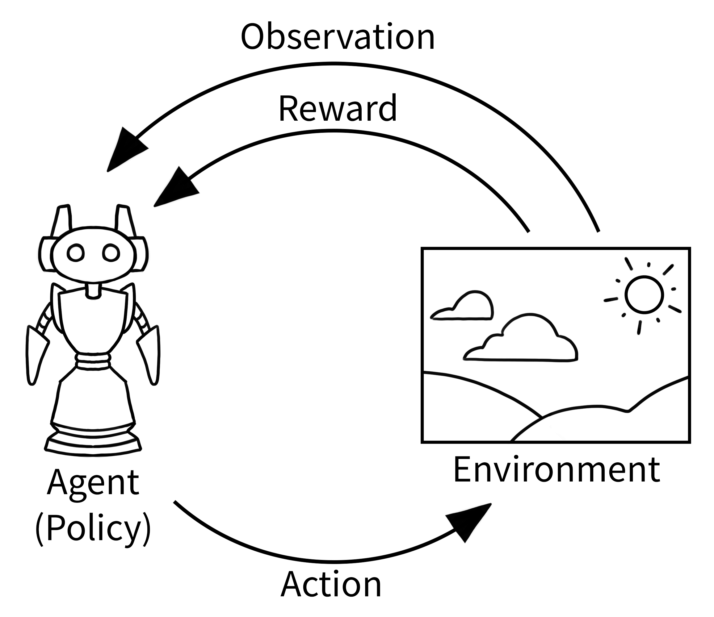
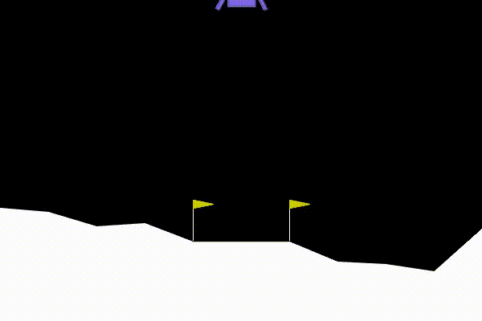

## Gymnasium 提供环境接口，不自动训练策略

强化学习中的 agent 根据观测选择动作，环境返回下一步观测和奖励。Gymnasium 统一这套交互接口；随机调用 `action_space.sample()` 只是接口测试，并没有学习策略。



观测不一定包含环境完整状态。编写算法时应检查 `observation_space` 和 `action_space`，不要仅凭变量名推断可观测性或数据类型。

## 安装与最小运行

本文使用 Gymnasium 的五返回值 step API 和 `LunarLander-v3` 环境。在独立 Python 环境中安装：

```bash
python -m pip install swig
python -m pip install "gymnasium[box2d]"
python -c "import gymnasium; print(gymnasium.__version__)"
```

Box2D 的构建条件取决于平台和可用 wheel；安装失败时保留第一条编译错误，核对 Python 版本与编译工具，不反复混用不同环境的 pip。

下面是完整的随机交互示例，默认不打开窗口，适合先验证接口：

```python
import gymnasium as gym

env = gym.make("LunarLander-v3")
try:
    observation, info = env.reset(seed=42)
    env.action_space.seed(42)
    episode_return = 0.0
    for _ in range(1000):
        action = env.action_space.sample()
        observation, reward, terminated, truncated, info = env.step(action)
        episode_return += reward
        if terminated or truncated:
            print(f"return={episode_return:.2f}, {terminated=}, {truncated=}")
            observation, info = env.reset()
            episode_return = 0.0
finally:
    env.close()
```

需要实时画面时，将创建环境的语句改为 `gym.make("LunarLander-v3", render_mode="human")`，并确认有可用图形会话。渲染模式在创建时指定。

## reset 与 step 的返回值

| 调用 | 返回 | 含义 |
| --- | --- | --- |
| `reset(seed=42)` | `observation, info` | 开始回合并初始化环境随机数 |
| `step(action)` | `observation, reward, terminated, truncated, info` | 推进一步，返回观测、奖励与两种结束标记 |
| `close()` | 无 | 释放窗口、视频或环境资源 |

`reset(seed=42)` 不会自动为 `action_space.sample()` 的随机数生成器设种子，所以示例分别设置两者。固定种子有助于同一实现下复现，但不保证跨平台、跨依赖版本逐位一致。后续回合一般调用无 seed 的 `reset()`，避免每回合重播同一个初始随机序列。

## terminated 和 truncated 为什么必须分开

- `terminated`：到达任务定义的终止状态，例如成功或失败；它是布尔值，不是正负奖励。
- `truncated`：因为任务定义之外的条件停止，例如外部时间限制。

两者任一为真都需要结束当前回合并 reset。但在价值学习的目标中，通常只在真正终止时取消下一状态的 bootstrap：

$$
y_t=r_t+\gamma(1-\mathrm{terminated}_t)V(s_{t+1}).
$$

这要求使用结束前的真实下一观测；自动重置的向量环境可能另行提供 final observation，不能用新回合的初始观测替代。具体还需遵循环境的有限时域建模方式。

## 保存视频

以下是独立示例；录像功能需要与所用 Gymnasium 版本匹配的视频依赖。

```python
import gymnasium as gym
from gymnasium.wrappers import RecordVideo

env = RecordVideo(
    gym.make("LunarLander-v3", render_mode="rgb_array"),
    video_folder="videos",
    episode_trigger=lambda episode: episode == 0,
)
try:
    observation, info = env.reset(seed=42)
    env.action_space.seed(42)
    for _ in range(1000):
        observation, reward, terminated, truncated, info = env.step(
            env.action_space.sample()
        )
        if terminated or truncated:
            break
finally:
    env.close()
```



录像与随机 rollout 只证明环境可交互，不代表策略训练成功。进一步实现学习算法时，应单独记录奖励、回合长度、结束原因和评估种子。

参考：[Gymnasium Env API](https://gymnasium.farama.org/api/env/)、[终止与截断的设计说明](https://farama.org/Gymnasium-Terminated-Truncated-Step-API)。


## 阅读自测与验收

- 同一 seed 下比较 reset 与动作采样，确认环境随机源和 action_space 都已设置；有渲染和无渲染时任务逻辑应一致。
- 人为设置较短时间限制，核对 truncated 与 terminated 的差别；继续计算价值目标时应使用截断前的最终观测，而不是 reset 后的新初态。
