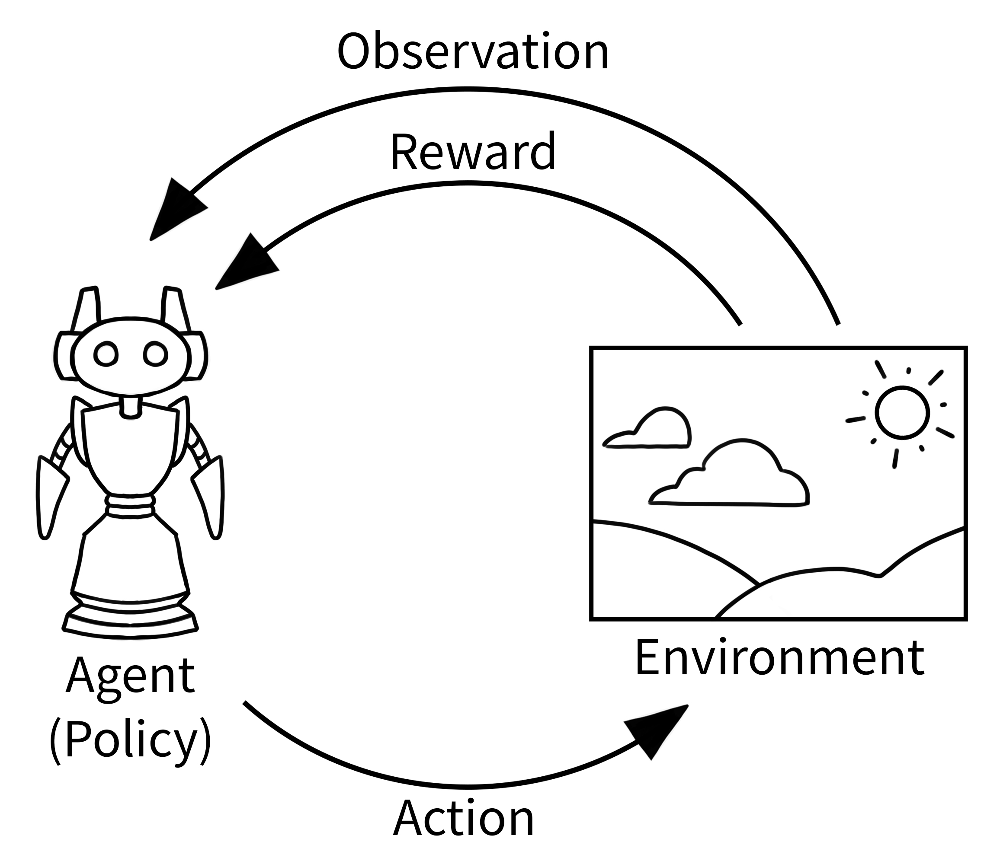

强化学习（Reinforcement Learning, RL）是一种机器学习方法，通过与环境的交互来学习如何采取行动，以最大化累积奖励。强化学习在机器人控制、游戏 AI、自动驾驶等领域有广泛应用。
### 1. 强化学习的基本概念

1. **Agent（智能体）**：在环境中执行动作并学习如何最大化累积奖励的实体。
2. **Environment（环境）**：智能体与之交互的外部系统，定义了状态空间、动作空间和奖励机制。
3. **Observation（观察）**：智能体从环境中获取的当前状态信息。
4. **Action（动作）**：智能体在某个状态下可以执行的操作，影响环境的状态。
5. **Reward（奖励）**：智能体执行某个动作后环境反馈的即时信号，用于指导智能体的学习。


# 2. 使用 Gym 进行强化学习：LunarLander 环境示例
参考: https://gymnasium.farama.org/index.html
在这篇博客中，我们将介绍如何使用 Gym 库进行强化学习，并以 LunarLander 环境为例进行演示。Gym 是一个用于开发和比较强化学习算法的工具包，它提供了许多标准化的测试环境。

## 2.1 安装 Gym 和依赖项

首先，我们需要安装 Gym 库及其依赖项。你可以使用以下命令通过 pip 安装：

```bash
pip install gymnasium
pip install swig
pip install "gymnasium[box2d]"
```

这些命令将安装 Gym 库、SWIG 以及 Box2D 依赖项。

## 2.2 初始化环境

接下来，我们将初始化 LunarLander 环境。LunarLander 是一个经典的控制任务，目标是控制一个着陆器在月球表面安全着陆。

```python
import gymnasium as gym

# 初始化环境
env = gym.make("LunarLander-v3", render_mode="human")
```

- `gym.make("LunarLander-v3", render_mode="human")`：创建并返回一个指定环境的实例。在这里，我们选择了 "LunarLander-v3" 环境，并设置 `render_mode` 为 "human" 以便在运行时显示图形界面。

## 2.3 重置环境

在开始训练之前，我们需要重置环境以生成初始观察值。

```python
# 重置环境以生成初始观察值
observation, info = env.reset(seed=42)
```

- `env.reset(seed=42)`：重置环境到初始状态，并返回初始观察值和额外信息。`seed=42` 用于设置随机数种子，以确保结果的可重复性。

## 2.4 运行环境

我们将运行环境 1000 步，并在每一步中采取随机动作。你可以在这里插入你的策略来替换随机动作。

```python
for _ in range(1000):
    # 这里可以插入你的策略
    action = env.action_space.sample()

    # 使用动作在环境中进行一步
    observation, reward, terminated, truncated, info = env.step(action)

    # 如果回合结束，则重置环境
    if terminated or truncated:
        observation, info = env.reset()
```

- `env.action_space.sample()`：从动作空间中随机采样一个动作。在实际应用中，你可以用你的策略来替换这个随机动作。
- `env.step(action)`：使用指定的动作在环境中执行一步。返回值包括：
  - `observation`：执行动作后环境的下一个状态。
  - `reward`：执行动作后获得的奖励。
  - `terminated`：布尔值，表示当前回合是否结束。
  - `truncated`：布尔值，表示当前回合是否被截断。
  - `info`：额外的诊断信息。
- `if terminated or truncated:`：检查当前回合是否结束或被截断。如果是，则重置环境。

## 2.5 关闭环境

最后，别忘了关闭环境以释放资源。

```python
env.close()
```

- `env.close()`：关闭环境并释放资源。

## 2.6 完整代码

以下是完整的代码示例：

```python
import gymnasium as gym

# 初始化环境
env = gym.make("LunarLander-v3", render_mode="human")

# 重置环境以生成初始观察值
observation, info = env.reset(seed=42)
for _ in range(1000):
    # 这里可以插入你的策略
    action = env.action_space.sample()

    # 使用动作在环境中进行一步
    observation, reward, terminated, truncated, info = env.step(action)

    # 如果回合结束，则重置环境
    if terminated or truncated:
        observation, info = env.reset()

env.close()
```
以下是对代码中涉及的函数及其参数的详细说明：

-  `gym.make()`
	- **参数**:
	  - **id (str)**: 环境的名称或ID，例如 `"LunarLander-v3"`。
	  - **render_mode (str, optional)**: 渲染模式，例如 `"human"` 表示以人类可读的方式渲染环境。

- `env.reset()`
	- **参数**:
	  - **seed (int, optional)**: 随机数生成器的种子，用于确保结果的可重复性。
	  - **options (dict, optional)**: 其他选项，具体取决于环境。
	- **返回值**:
	  - **observation (ObsType)**: 环境的初始观察值。
	  - **info (dict)**: 包含辅助诊断信息。

-  `env.step()`
	- **参数**:
	  - **action (ActType)**: 代理提供的用于更新环境状态的操作。
	- **返回值**:
	  - **observation (ObsType)**: 环境观察空间的一个元素，作为代理动作的下一个观察结果。
	  - **reward (SupportsFloat)**: 采取行动的结果的奖励。
	  - **terminated (bool)**: 代理是否达到最终状态，可以是正数或负数。
	  - **truncated (bool)**: 是否满足MDP范围外的截断条件。通常，这是一个时间限制，但也可用于指示代理实际越界。可用于在达到最终状态之前提前结束情节。
	  - **info (dict)**: 包含辅助诊断信息（有助于调试、学习和记录）。

-  `env.close()`
	- **作用**: 关闭环境，释放资源。


### 2.7 保存视频
```python
import gymnasium as gym
from gymnasium.wrappers import RecordVideo

# 初始化环境并包装以记录视频
env = gym.make("LunarLander-v3", render_mode="rgb_array")
env = RecordVideo(env, video_folder="videos", episode_trigger=lambda x: True)

# 重置环境以生成初始观察值
observation, info = env.reset(seed=42)
for _ in range(1000):
    # 这里可以插入你的策略
    action = env.action_space.sample()

    # 使用动作在环境中进行一步
    observation, reward, terminated, truncated, info = env.step(action)

    # 如果回合结束，则重置环境
    if terminated or truncated:
        observation, info = env.reset()

env.close()
```


