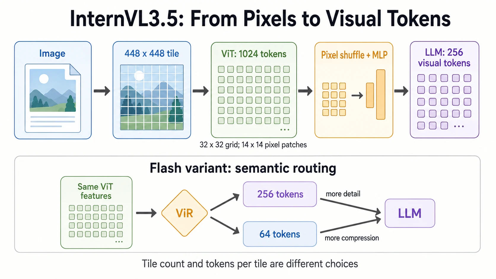
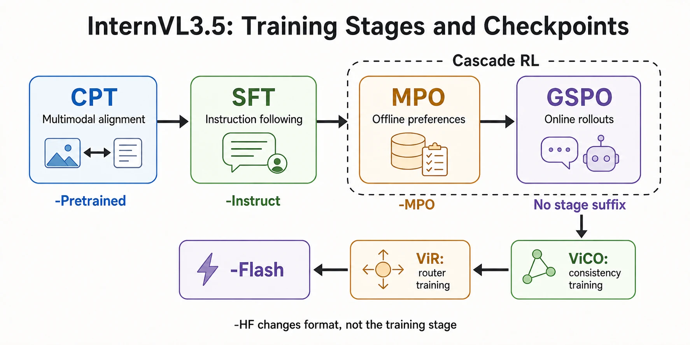

InternVL 3.5 可以沿三个问题理解：**图像怎样变成语言模型能使用的 token，模型怎样学会更可靠地推理，多模态服务怎样降低视觉输入的成本。** 把这三条线连接起来，比记住一个榜单成绩更有帮助。

本文以 [OpenGVLab / InternVL3.5 集合](https://huggingface.co/collections/OpenGVLab/internvl35)为入口，结合技术报告、模型卡和固定 revision 的配置与源码展开。**规模、训练阶段、权重格式与 Flash 变体是不同的选择维度**；文末集中记录来源版本，便于复查。

范围明确限定为 **3.5 系列**。文中的性能数字属于原论文设置，不是当前所有模型的排行榜；普通版、不同训练阶段、HF 格式、Flash 版分别讨论。本文提供离线数值练习与固定 revision 的单图推理入口，但不声称已本地复现大模型训练、完整权重推理或论文服务吞吐。

| 阅读目标 | 建议路线 | 关键产出 |
| --- | --- | --- |
| 理解表示 | 第 1～4 节：模型家族、图块与张量形状 | 算出真实视觉 token 数 |
| 研究训练 | 第 5～8 节：SFT、Cascade RL 与 Flash | 区分训练目标、推理预算与压缩策略 |
| 准备部署 | 第 9～12 节：服务、显存与输入检查 | 跑通 Processor，建立资源预算 |
| 评测或微调 | 第 13～16 节：对照实验与复现 | 用一致协议比较质量和成本 |

想先动手，可以从 [8B 预算算例](#104-算例把图块上下文与显存放在同一本账里)开始，再运行 [CPU 输入检查](#115-先准备输入再决定是否加载权重)。

## 1. 先建立全貌：3.5 改进的是哪几层

| 层次 | 关键设计 | 它主要解决什么 |
| --- | --- | --- |
| 输入表示 | Dynamic High Resolution | 不同尺寸、长宽比和细节密度的图像如何进入模型 |
| 多模态网络 | ViT–MLP–LLM | 视觉特征与语言序列如何连接 |
| 后训练 | SFT、MPO、GSPO | 指令适配、偏好学习与在线推理优化 |
| 高效变体 | ViCO、ViR | 哪些图块可以使用更少视觉 token |
| 服务架构 | DvD | 视觉编码与语言推理怎样异步协作 |

这些设计并不是一个统一的“加速开关”。更强的后训练主要改变模型分布；视觉压缩主要改变送入 LLM 的序列长度；服务解耦改变资源调度。它们可以组合，但生效条件不同。[作者发布说明](https://internvl.github.io/blog/2025-08-26-InternVL-3.5/)



## 2. 模型集合怎么选：规模、阶段、格式是三个维度

### 2.1 不能把集合中的每个名字都当成独立架构

同一规模的模型可能发布多个训练阶段，用于研究不同步骤的增益。作者发布说明给出的关系是：

| 检查点后缀 | 已完成阶段 | 更适合的用途 |
| --- | --- | --- |
| `-Pretrained` | 多模态持续预训练 CPT | 研究后训练起点 |
| `-Instruct` | CPT + SFT | 指令模型与后续偏好训练对照 |
| `-MPO` | CPT + SFT + 离线 MPO | 离线偏好阶段消融 |
| 无训练阶段后缀 | CPT + SFT + Cascade RL | 常规使用的完整后训练版本 |
| `-HF` | Hugging Face 原生格式 | 与 Transformers 标准类集成；不是一个额外训练阶段 |
| `-Flash` | 增加视觉压缩与路由训练的高效变体 | 研究视觉 token 成本与质量的权衡 |

注意“无后缀”的意思是没有 `-Pretrained/-Instruct/-MPO` 这类**阶段后缀**，而不是说 `-HF` 权重质量更低。正式选择时要同时确认模型卡中的训练路径、架构和格式。[阶段对照来源](https://internvl.github.io/blog/2025-08-26-InternVL-3.5/)



### 2.2 参数规模与骨干对应

下面保留主要型号和近似总参数，避免把营销名称当成逐个参数计数：

| 型号 | 视觉编码器 | 语言骨干 | 近似总参数 |
| --- | --- | --- | ---: |
| 1B | InternViT-300M | Qwen3-0.6B | 1.1B |
| 2B | InternViT-300M | Qwen3-1.7B | 2.3B |
| 4B | InternViT-300M | Qwen3-4B | 4.7B |
| 8B | InternViT-300M | Qwen3-8B | 8.5B |
| 14B | InternViT-300M | Qwen3-14B | 15.1B |
| 38B | InternViT-6B | Qwen3-32B | 38.4B |
| 30B-A3B | InternViT-300M | Qwen3-30B-A3B | 30.8B |
| 241B-A28B | InternViT-6B | Qwen3-235B-A22B | 240.7B |

来源为[原始报告表 1](https://arxiv.org/html/2508.18265v2#S2)。集合中还包含 GPT-OSS 路线的 Preview 检查点，应按其单独模型卡处理，不能仅修改上面某个 Qwen 版本的名称就假定加载流程完全相同。

`A3B/A28B` 描述激活规模，不等于整个模型只存储这么多参数。特别是视觉编码器、投影模块和 MoE 专家存储各有成本；总参数、激活参数、训练 FLOPs 与端到端延迟不能相互替代。

### 2.3 Flash 的发布状态不能停留在最初公告

最初作者博客写着 Flash 将后续发布；核对时已存在独立的 [InternVL3.5-Flash 集合](https://huggingface.co/collections/OpenGVLab/internvl35-flash)。选择检查点时，应分别检查普通版与 Flash 版的模型卡和加载路径。

类似地，后续的 Core 集合有自己的范围，本文不把它的配方或指标倒灌进原始 3.5 报告。

## 3. 从像素到 token：tile 与 patch 为什么容易混淆

### 3.1 两种“块”处在不同层

在阅读 InternVL 时，最好人为区分两个词：

- **tile**：高分辨率原图经过动态划分后，送入视觉编码器的图像块；这里常见尺寸是 `448×448`。
- **ViT patch**：视觉编码器内部对 tile 划分的小块；8B 配置中的边长是 14 像素。

因此，一个 tile 内部对应的空间网格为：

$$
\frac{448}{14}\times\frac{448}{14}=32\times32=1024.
$$

去除不用于空间表示的特殊位置后，这个网格经过空间重排与投影，得到送入语言模型的视觉 token。不要把“原图被切成 12 块”和“ViT 有 1024 个空间位置”放在同一层比较。

这些具体数值可直接对照 [8B-HF 的固定配置](https://huggingface.co/OpenGVLab/InternVL3_5-8B-HF/blob/741a7d03020411e666c6109218ab71e08151ef86/config.json)：`image_size=[448,448]`、`patch_size=[14,14]`、`downsample_ratio=0.5`、`image_seq_length=256`。

### 3.2 动态高分辨率到底动态在哪里

官方普通格式的预处理示例会在允许的网格中寻找与原图长宽比相适应的划分，缩放后切分图块；多块情况下还可额外添加整图缩略图。[预处理示例](https://huggingface.co/OpenGVLab/InternVL3_5-8B#inference-with-transformers)

用一个自拟例子理解：一张长条形文档若直接压成方图，小字很容易丢失。分成多个 tile 后，每个局部区域获得更多像素；缩略图则帮助保留整体布局。

但分块不是免费的，也不是无限精度放大。它仍受原始成像分辨率、压缩质量与上下文预算限制。已经模糊的文字不能靠增加 tile 数恢复为真实清晰字符。

### 3.3 Pixel shuffle 不是把四个 token 简单平均

以常见的空间到通道重排理解，`32×32×C` 可以先重排为 `16×16×4C`，然后经过投影回到语言模型所需的特征维度。

位置数量减少为原来的四分之一：

$$
1024\longrightarrow256.
$$

重排本身主要改变维度组织方式；后续投影与学习决定了哪些信息保留。它不同于随机删掉 75% 的特征，也不能据此直接保证无损。

如果需要复习“序列长度”和“通道维度”的区别，可结合本站的 [Transformer Attention 指南](/posts/ai/transformer-attention/)阅读。语言模型的注意力成本对前者尤其敏感。

### 3.4 沿 8B-HF 源码追踪张量形状

把第 3.1 节的配置代入原生实现，设 $n$ 是当前请求所有 tile 的总数，而不是文本 batch size；标准分支可以写成下面这份“形状账本”：

| 阶段 | 张量形状 | 此时发生什么 |
| --- | --- | --- |
| Processor 输出 | `[n,3,448,448]` | 图块进入视觉编码器 |
| ViT 序列 | `[n,1025,1024]` | 1024 个空间位置加 1 个 CLS 位置 |
| 选择空间特征 | `[n,1024,1024]` | 默认策略去掉首个特殊位置 |
| 恢复空间网格 | `[n,32,32,1024]` | 第二维的序列重新解释为空间布局 |
| Pixel shuffle | `[n,16,16,4096]` | 空间长宽减半，通道维变为四倍 |
| 展平与投影 | `[n,256,4096]` | 接入该 8B 语言骨干的隐藏维度 |

对应入口是 `InternVLModel.get_image_features`、`pixel_shuffle` 与 `InternVLMultiModalProjector`；投影包含 LayerNorm、两层 Linear 与非线性。这些是按固定配置推导的形状，不是本地执行完整 ViT/LLM 得到的性能记录。[Transformers 4.55.0 源码](https://github.com/huggingface/transformers/blob/v4.55.0/src/transformers/models/internvl/modeling_internvl.py)

这里 `1024` 先后表示“空间位置数”和“视觉隐藏维”，只是恰好相同，不是同一个概念。Pixel shuffle 后的 `4096` 也不表示增加了四倍视觉 token。

语言侧先生成整段 `input_ids` 的 embedding，再根据 `image_token_id` 找到视觉占位，将投影特征放入这些位置。因此必须满足：

$$
L_{\mathrm{placeholder}}=256n.
$$

这里 $L_{\mathrm{placeholder}}$ 是 `input_ids` 中等于 `image_token_id` 的位置数量。原生 `get_placeholder_mask` 会检查数量，`forward` 再做替换。只有数量相等还不够：多图场景中，图像顺序、图块顺序和模板边界也必须一致。把图片二的特征放入图片一的位置，未必触发 shape error，却会破坏问题语义。

## 4. 视觉 token 预算：一张图片到底占多少上下文

### 4.1 标准版的基础估算

设实际送入编码器的 tile 数为 $n$，这里已包含可能增加的缩略图，则标准分支的视觉 token 数近似为：

$$
L_{\mathrm{vis}}=256n.
$$

如果切出 12 个局部块并增加一个缩略图，$n=13$，视觉表示就是 3328 个 token，而不是 3072。文本模板、图像边界和用户问题还需另外计入。

**这些是输入规模算例，不是每个图片必然采用 13 个 tile。** 实际数目由 Processor、图像长宽比和配置决定。

### 4.2 多图和视频会怎样扩张

假设有 $F$ 帧，每帧 $n_f$ 个 tile，则：

$$
L_{\mathrm{vis}}=256\sum_{f=1}^{F}n_f.
$$

例如 16 帧、每帧 5 个 tile，就需要 20480 个视觉 token。再加入任务提示、历史对话和长回答预算，很容易超过原先给单图设计的配置。

实践中应优先问：任务需要识别短暂事件，还是只理解慢变化的场景？前者需要更谨慎地采样时间，后者可能更受单帧细节影响。把全部资源都用来提高空间分辨率，不一定改善视频理解。

### 4.3 训练长度、配置长度与可用上下文不是同一件事

原始配方使用 32K 训练上下文；核对的 8B-HF 配置中，文本侧 `max_position_embeddings=40960`。这两个数字并不矛盾：一个描述训练设置，一个描述模型配置。[训练设置](https://internvl.github.io/blog/2025-08-26-InternVL-3.5/)、[检查点配置](https://huggingface.co/OpenGVLab/InternVL3_5-8B-HF/blob/741a7d03020411e666c6109218ab71e08151ef86/config.json)

真正运行时还需要满足：

$$
L_{\mathrm{text}}+L_{\mathrm{vis}}+L_{\mathrm{template}}+L_{\mathrm{output}}
\leq L_{\mathrm{runtime}}.
$$

所以“测试可使用很多图块”不意味着“所有这些图块还能再配一个同样长的文本上下文”。另外，能够接受某个长度与在该长度下仍保持可靠推理，也不是同一个结论。

## 5. 预训练与 SFT：原生多模态训练是什么意思

### 5.1 不只是冻结视觉编码器、训练一个连接器

3.5 的持续预训练混合多模态与纯文本数据，并联合更新视觉、投影和语言模块；SFT 则强调指令与更高质量任务数据。作者说明中的规模约为：CPT 116M 样本、250B token，SFT 56M 样本、130B token。[训练数据与可训练模块说明](https://internvl.github.io/blog/2025-08-26-InternVL-3.5/)

这些数字描述训练语料规模，不代表所有样本都独立，也不等于公开数据集总量。一个长视频或多轮对话可产生大量 token；不同报告之间比较数据量时，要区分样本、图像、视频、问答对与 token。

个人理解是，纯文本混合的价值在于让多模态适配不要只围绕“看图回答”，同时保留语言与推理能力。但是否实现了这种平衡，应同时用纯文本和多模态保留集验证，而不是靠训练目标的名称推断。

### 5.2 Square averaging 如何改变样本权重

对样本 $i$，若有 $N_i$ 个需要监督的 token，把每个 token 的权重设为 $1/\sqrt{N_i}$，则该样本总权重与 $\sqrt{N_i}$ 成正比。这个归约方式介于“每个 token 等权”和“每个样本等权”之间。[原始报告的训练目标](https://arxiv.org/html/2508.18265v2#S2.SS2)

可以用一个自拟算例直观看出差异：

| 两个样本的答案长度 | Token 等权下总权重比 | 样本等权下总权重比 | Square averaging 下总权重比 |
| --- | --- | --- | --- |
| 100 与 400 | 1:4 | 1:1 | 1:2 |

把这个规则写成归一化目标更容易实现。设 $\ell_{it}$ 是有效答案位置上的 token loss，$\bar\ell_i$ 是样本内均值，一种与上述权重关系一致的写法为：

$$
\mathcal L=\frac{\sum_i N_i^{-1/2}\sum_{t=1}^{N_i}\ell_{it}}
{\sum_i\sqrt{N_i}}
=\sum_i w_i\bar\ell_i,
$$

$$
w_i=\frac{\sqrt{N_i}}{\sum_j\sqrt{N_j}}.
$$

例如两段答案长度为 100 和 400，样本内平均 loss 为 2 和 1，则 token 等权得到 1.2，样本等权得到 1.5，square averaging 得到 $4/3$。这固定的是损失系数；实际梯度大小和方向还取决于模型与样本。

该式用于解释归约方式。实现时须排除 padding、图像占位和未监督前缀，并处理 $N_i=0$ 的样本。分布式训练还要对齐归一化范围：各 Rank 各自归一化后再平均，通常不等于对全局 batch 一次归一化，参见[梯度归一化推导](/posts/ai/distributed-training-memory/#44-变长文本平均局部均值未必等于全局-token-均值)。

### 5.3 Loss mask、Attention mask 与冻结参数 {#53-sft-学到的是输出范式不是正确性证明}

这三个设置作用于不同位置，微调多模态模型时尤其容易混淆：

| 设置 | 它控制什么 | 对图像输入的影响 |
| --- | --- | --- |
| Loss mask / `labels=-100` | 哪些目标位置直接计入交叉熵 | 图像位置可以不作为预测目标，仍参与答案生成 |
| Attention mask | 哪些位置可以参与注意力计算 | 错误屏蔽视觉位置会阻止答案利用图像信息 |
| `requires_grad=False` | 哪些参数不累积自身梯度 | 冻结模块仍可能需要传递输入梯度 |

用链式法则理解：答案 loss 依赖语言模型，语言模型依赖视觉投影，因此图像占位本身不计 loss，并不阻止梯度回到投影层或视觉编码器。能否更新这些模块，取决于参数是否可训练、计算图是否连通，以及训练器是否保留了这条路径。[PyTorch Autograd 规则](https://docs.pytorch.org/docs/2.8/notes/autograd.html#setting-requires-grad)

SFT 在选定的答案位置学习示范；后续 MPO 和 GSPO 则进一步引入偏好或奖励信号。排查训练效果前，应先核对监督位置和梯度路径。

## 6. Cascade RL：为什么先 MPO，再 GSPO

### 6.1 两个阶段的数据来源不同

Cascade RL 不是让两个模型同时“投票”，而是串行后训练：离线 MPO 使用已有偏好样本，在线 GSPO 则从当前策略采样新的回答进行优化。[3.5 后训练说明](https://huggingface.co/OpenGVLab/InternVL3_5-8B#post-training)

从工程上理解，前者可以复用离线数据，采样成本相对集中；后者能追踪当前模型最常犯的错误，但需要持续生成回答并计算奖励。先把模型调整到较好的起点，再进行在线采样，是一种训练成本与优化效果的权衡。

比较两阶段收益时，需要控制奖励设计、样本难度、输出长度与训练预算。 如果需要从策略梯度、偏好目标与组内优势开始推导，可先运行 [PPO、DPO 与 GRPO 的 CPU 实验](../ppo-dpo-grpo/)。

### 6.2 MPO 不只是一个 DPO 损失

MPO 将相对偏好、质量判断和生成学习组合起来，可以概括为：

$$
\mathcal L_{\mathrm{MPO}}=
w_p\mathcal L_{\mathrm{DPO}}+
w_q\mathcal L_{\mathrm{BCO}}+
w_g\mathcal L_{\mathrm{LM}}.
$$

其中 DPO 关注较优回答相对于较差回答，BCO 提供质量层面的约束，LM 项保留对较好回答的生成学习。[MPO 原始论文](https://arxiv.org/html/2411.10442v2)

不展开整套实现，也可以理解一个重要问题：如果两个候选都很差，单纯把其中一个排得更高，并不表示模型已经学会了高质量答案。因此“谁更好”和“是否足够好”是互补的学习信号。

复现 MPO 时，三个损失的权重和数据处理方式都应按对应配方固定。

### 6.3 GSPO 的序列级重要性比

GSPO 的一个关键点，是把策略变化组织到序列级。设旧策略采样了回答 $y_i$，其长度为 $|y_i|$，则几何平均比率为：

$$
s_i(\theta)=\exp\left[
\frac{1}{|y_i|}\sum_t
\left(\log\pi_\theta(y_{i,t}\mid x,y_{i,<t})
-\log\pi_{\mathrm{old}}(y_{i,t}\mid x,y_{i,<t})\right)
\right].
$$

同一问题的多个回答组成一个 group，奖励在组内归一化形成优势；再利用 clipped surrogate 限制更新幅度。[GSPO 原始论文](https://arxiv.org/html/2507.18071v2)

用自拟数据理解：若两个 token 的新旧概率比为 2 和 0.5，则序列几何平均比为 $\sqrt{2\times0.5}=1$，而算术平均是 1.25。二者不是同一个量。

对实际实现，还要检查：

- 计算长度时是否排除了 padding 和无效位置；
- 组内所有奖励相同、标准差为零时怎么办；
- 重要性比在何处 detach，采样策略是否与记录的旧概率一致；
- 最终实现是最大化目标还是最小化其负值。

调试时先用第 6.5 节的正负优势算例确认优化方向，再接入真实采样器。

### 6.4 训练数据为什么要筛选难度

官方给出 [MMPR-v1.2](https://huggingface.co/datasets/OpenGVLab/MMPR-v1.2) 作为离线偏好数据，约 200K 对；在线阶段使用 [MMPR-Tiny](https://huggingface.co/datasets/OpenGVLab/MMPR-Tiny)，约 70K 个问题。这两个数量来自[作者发布说明](https://internvl.github.io/blog/2025-08-26-InternVL-3.5/)，两个数据集卡本身没有写死样本总数。作者说明中的筛选过程是：计算每个 query 在已有 rollout 上的准确率，只保留 0.2～0.8 之间的中等难度样本，再并入近期多模态数据构成 MMPR-Tiny。

一个直观解释是：如果某组采样全部正确，奖励差异可能很小；全部错误也可能缺少有效的相对信号。适当难度的样本更容易提供区分，但“对旧模型难度合适”并不保证训练全程都合适，所以还需要关注数据与当前策略的分布变化。

### 6.5 用四个数值检查 clipping 方向

将第 6.3 节的序列比率 $s_i$ 和组优势 $\hat A_i$ 放在一起，省略期望符号及其他正则项后，单个组的最大化目标可写为：

$$
\begin{aligned}
q_i&=\operatorname{clip}(s_i,1-\epsilon,1+\epsilon),\\
j_i&=\min(s_i\hat A_i,q_i\hat A_i),\\
J&=\frac1G\sum_{i=1}^{G}j_i.
\end{aligned}
$$

采用梯度下降时，对应基础 loss 是 $-J$。这里的 `min` 比较的是乘上优势后的两项，不是简单地“无论如何都先把比率裁进区间”。[GSPO 原始目标，第 4.1 节](https://arxiv.org/html/2507.18071v2#S4.SS1)

以下取 $\epsilon=0.2$ **仅为便于手算**，不是 InternVL 发布配方的超参数：

| 比率 $s$ | 优势 $A$ | $sA$ | clip 后乘 $A$ | 取较小值 |
| ---: | ---: | ---: | ---: | ---: |
| 1.5 | +1 | 1.5 | 1.2 | 1.2 |
| 0.5 | −1 | −0.5 | −0.8 | −0.8 |
| 1.5 | −1 | −1.5 | −1.2 | −1.5 |
| 0.5 | +1 | 0.5 | 0.8 | 0.5 |

前两行限制已经朝有利方向变化过大的样本继续提高目标；后两行保留不利方向的惩罚。尤其是负优势，错误地先取 `min(s,clip(s))` 再乘优势，会把比较方向弄反。

```python
from token_budget import clipped_surrogate

assert clipped_surrogate(1.5, 1, epsilon=0.2) == 1.2
assert clipped_surrogate(0.5, -1, epsilon=0.2) == -0.8
assert clipped_surrogate(1.5, -1, epsilon=0.2) == -1.5
```

这个标准库函数只检查标量算术，没有 autograd、采样器或策略更新。真实训练还需使用有效回答 token 的 mask，冻结旧策略概率与奖励估计，并保持当前策略概率的梯度；不能直接把 Python 浮点数版本接进训练器。

## 7. Thinking 与 Best-of-N：增加推理预算不等于免费涨分

官方区分更长的单次推理与多候选选择；后者使用 VisualPRM-v1.1 作为评判模型。普通模型卡还给出了 Thinking 的系统提示方式与采样建议。[Thinking 设置](https://huggingface.co/OpenGVLab/InternVL3_5-8B#thinking-mode)、[Test-Time Scaling 说明](https://huggingface.co/OpenGVLab/InternVL3_5-8B#test-time-scaling)

按模型卡的描述，有三个容易误读的细节：

- **输出协议**：先用 `<think>...</think>` 包裹逐步推理，换行后再给出最终答案；
- **解码设置**：卡片建议开启 Thinking 时使用 `do_sample=True` 与 `temperature=0.6` 以减轻重复输出；
- **TTS 适用范围**：报告中的评测分数默认**没有**应用 TTS（Test-Time Scaling）；作者说明 TTS 目前只用于推理类基准，感知与理解类任务开启后提升不明显。

评估时至少区分三种预算：

| 方式 | 额外消耗 | 不能混淆的指标 |
| --- | --- | --- |
| 单次短回答 | 基线输出长度 | 单次准确率 |
| 单次 Thinking | 更多生成 token 与更长时间 | 不能只报告最终答案的 token 数 |
| Best-of-N | 多次生成 + 评判模型 | 选出的答案正确率不等于随机一次采样的正确率 |

一个自拟的概率例子：若各候选独立、正确率均为 $p$，则 N 个候选中至少一个正确的概率是 $1-(1-p)^N$。在这个假设下，它对应能认出正确答案的理想选择器；真实 Best-of-N 还受候选相关性和评判错误影响。该公式也不是任意相关分布下的上界，评测时应分别记录“候选中有正确答案”和“最终选中了正确答案”的比例。

对于 OCR 看不清的小字，增加解释长度可能只会让错误答案更详细。应先确认视觉信息进入模型，再增加推理预算。

## 8. Flash、ViR 与 ViCO：究竟压缩了哪一部分

### 8.1 ViR 不是减少所有图像的像素数

标准分支将一个 tile 表示为 256 个 LLM 视觉 token；Flash 提供更强压缩的 64-token 分支，并根据视觉内容选择。ViR 的选择发生在视觉特征到语言输入的路径上，**不是给普通模型打开 FlashAttention 就自动获得**。[Flash 模型卡](https://huggingface.co/OpenGVLab/InternVL3_5-8B-Flash)

Dynamic High Resolution 决定一张原图切多少 tile；ViR 决定一个 tile 送入 LLM 时使用多少 token。二者一个偏向空间划分，一个偏向特征表示预算，应分别调试。

### 8.2 Token 节省比例可以直接算，不能凭名字猜

设共 $n$ 个 tile，其中 $k$ 个保留 256-token 分支，其余使用 64-token 分支：

$$
L_{\mathrm{vis}}=256k+64(n-k)=64n+192k.
$$

与全部使用 256-token 分支相比，比例为：

$$
\rho=\frac{L_{\mathrm{vis}}}{256n}
=\frac14+\frac34\frac{k}{n}.
$$

所以，如果恰好一半 tile 进入 64-token 分支，剩余 token 比例是 62.5%，即**减少 37.5%**，不是减少 50%。这里没有实验假设，只有计数。

具体测试集平均减少多少，还取决于路由结果、缩略图策略与统计口径。宣传中的总体节省数，不能用“有两条分支，所以减半”来解释。

### 8.3 为什么先训练一致性，再训练路由器

如果直接把未经适配的表示从 256 压到 64，语言模型未必知道怎样利用新分布。ViCO 的思想是先训练压缩条件下的回答分布接近参考分布，再学习哪些图块对压缩更敏感；路由器训练阶段冻结主要多模态模型。[ViCO 后续专项论文](https://arxiv.org/html/2510.12793v2)

一个便于理解的形式是（固定同一问题 $Q$ 与回答前缀 $y_{<t}$）：

$$
\mathcal L_{\mathrm{consistency}}
=\mathbb E\left[\mathrm{KL}
\left(p_{\mathrm{ref}}(\cdot\mid I,Q,y_{<t})
\;\|\;p_\theta(\cdot\mid I_{\mathrm{compressed}},Q,y_{<t})\right)\right].
$$

它约束的是响应分布，不是要求压缩后的每一个视觉向量逐项相等。随后根据压缩造成的损失变化生成路由监督，让模型学习“哪里可以节省表示预算”。

请注意论文版本：3.5 原始报告与后续 ViCO 专项论文对压缩采样的描述并不完全相同。若要复现，应该固定其中一份方法与对应代码，不能把两篇论文中的局部细节拼成一个未经验证的新配方。

### 8.4 Flash 的潜在失败场景

下面是工程上应专门构造的测试，而非本文已经测得的失败结果：

- 大片背景里只有一行很小但决定答案的文字；
- 图表中有多个近似颜色、极细曲线或密集刻度；
- 用户问的是常见场景里不常被关注的局部细节；
- 同一图片换一个问题后，需要关注的信息发生改变。

一个按图像内容进行路由的模块，并不自动等同于“完全理解每一种用户问题后再最优分配 token”。质量评估应该覆盖低频但重要的细节任务。

## 9. DvD：为什么分开部署视觉和语言可以提高吞吐

### 9.1 两种计算的资源需求不同

DvD 将 ViT、MLP 及可选的 ViR 放在视觉服务，把 LLM 放在语言服务，中间传递视觉特征并组织异步流水。它是服务架构，不是把整个模型随意平均分到几张卡。[官方 DvD 说明](https://huggingface.co/OpenGVLab/InternVL3_5-8B-Flash#decoupled-vision-language-deployment)

按官方模型卡的实现说明，拆分的依据与做法是：

- **分工**：视觉服务负责 ViT 与 MLP（Flash 版还含 ViR），语言服务只执行 LLM；
- **通信**：单向，通过 TCP 传输 BF16 视觉特征，可选 RDMA 提速；
- **流水**：视觉处理、特征传输与语言处理组织成异步三段流水，让阶段之间互相重叠；
- **理由**：两种计算的瓶颈不同——视觉编码高度可并行、不依赖长历史状态；语言解码自回归、对显存带宽和延迟更敏感。同卡部署时两者会互相阻塞，分离后视觉侧提高利用率，语言侧不再被视觉计算卡住。

用一个没有真实测量含义的模型解释：设视觉阶段耗时 $a$，传输耗时 $b$，语言阶段耗时 $c$。对孤立请求，依赖关系仍要求视觉特征先产生；理想稳态流水线处理很多请求时，吞吐则可能由最慢阶段约束，接近：

$$
\mathrm{throughput}\lesssim\frac{1}{\max(a,b,c)}.
$$

这只是帮助理解流水的上界。真实系统还受批处理、网络带宽、排队、显存和请求长度分布影响。**不同请求的阶段重叠，不等于同一个请求可以绕过数据依赖。**

### 9.2 “4.05×”应如何引用

原始报告表 18 在 896 分辨率、38B 设置中，列出 baseline 2.71 requests/s，与 DvD + ViR 的 10.97 requests/s，比值约为 4.05。该表注明语言模型运行在 8 张 A100 上，并采用指定负载条件。[完整吞吐表与协议](https://arxiv.org/html/2508.18265v2#S3.SS15)

因此，这个数字不是“任意单卡单次回答快 4.05 倍”，也不是“只换 3.5 权重便快 4.05 倍”。还必须交代是否有独立视觉资源，以及总资源、输入、输出和并发设置。

对自己的服务，应同时记录吞吐、TTFT、P95/P99 延迟、失败率与总 GPU 成本，并声明计时位置。客户端测量包含网络与排队，服务端指标可能采用不同起点，不能直接混算。[vLLM 指标定义](https://docs.vllm.ai/en/v0.12.0/design/metrics/)

用一个人工时间线区分指标：请求在 0 秒提交，第一个 token 在 0.8 秒到达，第 101 个 token 在 2.8 秒到达，随后立即结束。假设能观测每个 token 的到达时间：

| 指标 | 本例计算 | 说明 |
| --- | --- | --- |
| TTFT | 0.8 秒 | 从提交到首 token，包含此前等待 |
| 生成间隔均值 | `(2.8−0.8)/(101−1)=0.02` 秒 | 首 token 之后平均 20 ms/token |
| 单请求输出速率 | `101/2.8≈36.1` token/s | 包含首 token 等待，分母不同 |

流式响应的一块文本可能包含多个 token，不能把响应块数当 token 数。并发服务吞吐应使用同一观测窗口的总完成请求数或总输出 token 数除以窗口时长；不能把每个请求的速率直接相加。首次模型加载、编译与缓存预热另行记录，稳态对比固定到达速率、并发上限及输入/输出长度分布。

## 10. 显存预算：8B、30B-A3B 到底要多少资源

### 10.1 先算权重下限，不把它当部署结论

核对 [8B-HF 的参数元数据](https://huggingface.co/api/models/OpenGVLab/InternVL3_5-8B-HF)，其 BF16 参数总数为 8,528,318,464。仅权重占用为：

$$
M_{\mathrm{weights}}=8{,}528{,}318{,}464\times2
\approx17.06\ \mathrm{GB}\approx15.89\ \mathrm{GiB}.
$$

其余部分至少包括：视觉编码的中间激活、文本 prefill 激活、KV Cache、采样缓冲和框架开销。所谓“16-bit 权重能放下”不是“足够运行任意长度的多图请求”。

官方 Flash 模型卡的 Quick Start 还给出一个部署量级参考：[部署量级出处](https://huggingface.co/OpenGVLab/InternVL3_5-8B-Flash#quick-start)

| 总参数规模 | 官方参考量级 |
| --- | --- |
| 不超过 30B | 单张 A100 |
| 38B | 两张 A100 |
| 235B（即 241B-A28B 检查点在报告中的命名） | 八张 A100 |

这是官方给出的参考量级，不是对任意并发与上下文长度的承诺，也不等于最小可运行配置。

### 10.2 用 8B 配置估算 KV Cache

对普通全注意力 + GQA 骨干，一个基础估算式是：

$$
M_{\mathrm{KV}}=2BLSH_{\mathrm{kv}}D_hs,
$$

其中前面的 2 表示 K 和 V，$B$ 是 batch，$L$ 是层数，$S$ 是每个 batch 槽位实际分配的缓存长度，$H_{\mathrm{kv}}$ 是 KV heads，$D_h$ 是每个 head 的维度，$s$ 是单元素字节数。对矩形缓存，$S$ 不能直接填入样本的平均有效长度。

8B-HF 配置给出 $L=36$、$H_{\mathrm{kv}}=8$、$D_h=128$。若采用 BF16、batch 为 1、缓存长度为 32768，则理论缓存约为 **4.5 GiB**。[配置来源](https://huggingface.co/OpenGVLab/InternVL3_5-8B-HF/blob/741a7d03020411e666c6109218ab71e08151ef86/config.json)

缓存布局决定如何合并长短请求。仍用该 8B 配置，假设同一时刻两个请求需要保留的有效长度分别为 2048 和 8192，不共享前缀：

| 缓存布局假设 | 需要存储的位置数 | BF16 KV 理论值 |
| --- | ---: | ---: |
| 矩形缓存，两行都分配到 8192 | `2×8192=16384` | 2.25 GiB |
| 理想按请求长度分别分配 | `2048+8192=10240` | 1.40625 GiB |

第二行忽略分页块取整与元数据，不能当作框架实测值。可用 [token_budget.py](token_budget.py) 复算：

```python
from token_budget import kv_cache_bytes

lengths = (2048, 8192)
shape = dict(layers=36, kv_heads=8, head_dim=128)
dense = kv_cache_bytes(
    sequence=max(lengths), batch=len(lengths), **shape,
)
separate = sum(kv_cache_bytes(sequence=n, **shape) for n in lengths)
print(dense / 2**30, separate / 2**30)  # 2.25 1.40625
```

Attention mask 屏蔽 padding 的参与，不会自动释放矩形 Tensor 中对应位置的存储。Static Cache 还可能预先分配更长的最大容量；分页缓存则按块组织每个请求的 KV，实际分配仍有取整与空闲池成本。[Transformers 缓存策略](https://huggingface.co/docs/transformers/v4.55.4/en/kv_cache)、[vLLM 分页布局](https://docs.vllm.ai/en/v0.12.0/design/paged_attention/)

以上只估算完整全注意力缓存，不含工作区。不同注意力架构、量化或卸载需要重算，尤其不能直接套到 RynnBrain 1.1 的混合注意力骨干。

### 10.3 降成本的顺序建议

先量化任务真实需要，再优化实现：减少无关图片或历史轮次、控制 tile 和帧数、限制输出预算、合理批处理；之后再比较权重量化、KV 量化、Flash 变体或模型并行。

推理框架方面，官方模型卡提示大多数情况下 LMDeploy 与 vLLM 都可用，但 GPT-OSS 路线的 20B-A4B 推荐使用 vLLM。不要只凭一个框架名就假定所有规模都能正常加载，权重格式与引擎支持程度要一起核对。

每一次压缩都应在同一个保留集上复测。视觉问答总体不变，不代表小字、数字、坐标和格式有效率同样不变。

### 10.4 算例：把图块、上下文与显存放在同一本账里

以下是**单请求、标准 8B-HF、BF16、完整 GQA 缓存**的人工预算。假设 Processor 实际生成 13 个 tile（含缩略图），文本与模板共 768 token，最多生成 4096 token：

| 项目 | 计算 | 结果 |
| --- | --- | ---: |
| 视觉输入 | $13\times256$ | 3328 token |
| 完整输入 | $3328+768$ | 4096 token |
| 缓存长度预算 | $4096+4096$ | 8192 token |
| BF16 KV Cache | 第 10.2 节公式，$B=1,S=8192$ | 1.125 GiB |
| 权重 + KV 小计 | $15.89+1.125$ | 约 17.01 GiB |

把 [token_budget.py](token_budget.py) 放到当前目录，可以独立复算：

```python
from token_budget import visual_tokens, kv_cache_bytes

input_tokens = visual_tokens(13) + 768
cache_gib = kv_cache_bytes(
    layers=36, sequence=input_tokens + 4096,
    kv_heads=8, head_dim=128,
) / 2**30
print(input_tokens, cache_gib)  # 4096 1.125
```

17.01 GiB 只是两项小计，不能据此承诺在某张显卡上运行。视觉编码与 prefill 仍需中间张量，服务框架还可能提前预留 KV 块；动态缓存的实际长度则随生成增长。应将估算与**同一缓存策略、同一请求负载**下的峰值测量比较。

这个例子还能解释并发成本：若同时处理 4 个同长度请求且不共享前缀，KV 项约为 4.5 GiB，而单份模型权重保持约 15.89 GiB。增加请求数与增加模型副本是两种不同的显存变化。

微调时则要另建训练账本：冻结层、可训练参数、梯度、优化器状态和激活分别统计，不能把上面的推理预算乘一个固定倍数。对应计算方法见[分布式训练与显存优化](/posts/ai/distributed-training-memory/)。

## 11. 单图推理：普通格式与 HF 格式不要混用

### 11.1 两条加载路线

| 路线 | 常见接口 | 输入准备 |
| --- | --- | --- |
| 原始自定义格式 | `AutoModel`、`model.chat()` | 自定义图块处理、Tokenizer、图像 token 对应 |
| `-HF` 原生格式 | `AutoModelForImageTextToText`、`AutoProcessor` | 由匹配的 Processor 与 chat template 构造输入 |

下载第二条路线的 [infer_image.py](infer_image.py)，进入文件所在目录。脚本固定使用 `OpenGVLab/InternVL3_5-8B-HF` 及 revision `741a7d03020411e666c6109218ab71e08151ef86`，不执行远程自定义代码。[HF 模型卡](https://huggingface.co/OpenGVLab/InternVL3_5-8B-HF)、[Transformers 原生接口](https://huggingface.co/docs/transformers/model_doc/internvl)

安装应独立于 RynnBrain 环境：

```bash
python3 -m venv .venv-internvl35
source .venv-internvl35/bin/activate
python -m pip install --upgrade pip
# 先安装适合本机驱动/CUDA 的 PyTorch 与匹配的 torchvision。
python -m pip install "transformers==4.55.0" pillow
python infer_image.py --image /absolute/path/to/document.png --prepare-only
```

4.55.0 对应本文核对的检查点配置；示例采用 SDPA，无需额外安装 FlashAttention。先运行 `--prepare-only` 检查输入，确认后在兼容的 CUDA 设备上去掉该参数，才会加载约 17 GB 的 BF16 权重并生成回答。生成阶段会打印输入和输出 token 数；显存预算见第 10 节。

此前的 CPU 检查验证了固定 revision 的原生类解析及 CPU 输入构造：使用本站 Transformer 文章的结构图和提示词 `Describe the diagram.`，Processor 产生 9 个 `448×448` 图块，输入序列共 2319 个 token，其中视觉位置为 $9\times256=2304$，其余来自文本与模板。这个结果取决于示例图和提示词，不是任意单图的固定开销；检查中没有加载模型参数或执行前向计算。

### 11.2 为什么必须用匹配的 Processor

Processor 负责图像预处理、图块数量和模板中的视觉占位。自己手写一段聊天字符串，却让图像预处理生成了不同数量的视觉特征，很容易触发 token 与 feature 数量不一致。

因此，最小示例应先保证：图像、Processor、Tokenizer、模型配置来自同一个检查点 revision；输入能产生明确形状；输出只解码新生成部分，不把用户提示再打印一遍。

### 11.3 Thinking 的一个真实文档细节

核对的普通模型卡定义了 `R1_SYSTEM_PROMPT`，随后赋值示例却写成 `R1_SYSTEMP_PROMPT`。照抄会得到未定义变量错误。本文不复制这一拼写错误，也不把添加一个系统提示误称为重新训练模型。[模型卡原示例](https://huggingface.co/OpenGVLab/InternVL3_5-8B#thinking-mode)

第一次跑通时，建议先用短回答完成输入链检查。之后再按官方模板启用 Thinking；官方建议此时使用 `do_sample=True`、`temperature=0.6` 以减轻重复输出，并记录完整生成预算、采样设置和停止条件（Thinking 的输出协议见第 7 节）。

### 11.4 Flash 模型卡也要核对实际模型名

本文核对的 Flash 模型卡快照，其部分 Quick Start 代码仍填写普通 `InternVL3_5-8B` 路径。即使该代码正常运行，也不能据此说已经测试了 Flash 路由。[Flash Quick Start](https://huggingface.co/OpenGVLab/InternVL3_5-8B-Flash#quick-start)

确认是否运行 Flash，应检查实际下载的配置与实现、视觉路由模块以及进入 LLM 的 token 数；不能只看页面标题，也不能把 `use_flash_attn=True` 当成证据。

### 11.5 先准备输入，再决定是否加载权重

第 11.1 节的 `--prepare-only` 命令输出 JSON 报告：模型 revision、处理器版本、实际图块张量、输入 token 数与计划输出预算。其中 `reserved_output_tokens` 是生成上限，不表示已经分配缓存。

该模式不要求 CUDA，不加载模型权重，也不执行前向；首次可能下载少量配置与 Tokenizer 文件。检查时把 `inputs.pixel_values.shape` 对应的 tile 数与第 4 节预算相互核对，再用 `input_tokens` 统计完整输入。

文件已缓存后，可以检查真正的无网络准备流程：

```bash
HF_HUB_OFFLINE=1 python infer_image.py \
  --image /absolute/path/to/document.png \
  --prepare-only --local-files-only
```

如果只把输入上限设为 `1`，正常图片应在加载权重之前被拒绝。这是一个很有用的负向测试：证明保护逻辑先于昂贵的权重加载，而不是已经占用大量显存之后才发现输入不合适。

脚本默认输入上限 8192，可设置到 28672；输出上限为 4096，合计不超过本例的 32768-token 预算。`--max-input-tokens` 是处理完成后的验收阈值，不会改变 Processor 的 tile 数。超限时应调整图像或文本后重新准备，不能截断视觉占位。

前述 9-tile 示例的预算应使用完整输入长度 2319 加生成预算；2304 只计入了视觉位置。

### 11.6 常见故障与检查顺序

| 现象 | 第一项检查 | 后续检查 |
| --- | --- | --- |
| `.chat()` 不存在 | 是否把自定义格式代码用于 `-HF` 权重 | 选择与格式匹配的原生入口 |
| 图像 token 与特征不匹配 | Processor、模板和权重 revision 是否一致 | 多图顺序、占位、是否手工截断 |
| 输入准备成功但 CUDA OOM | 实际输入与生成长度、权重之外的显存开销 | tile 数、batch、缓存与运行时余量 |
| 显示 Flash 页面但没有 token 压缩 | 实际加载的 model ID | 是否存在 ViR，而非仅开启 FlashAttention |
| 离线缓存未命中 | 对应 revision 的小文件是否齐全 | 不依赖别的环境偶然下载过的文件 |

脚本只接受没有 EXIF 方向标签或方向值为 1 的图片；其他方向会在加载 Processor 前被拒绝。这是为了避免上游图像加载函数自动旋转后，像素坐标与预检查报告不一致。对扫描件、手机照片或带坐标标注的数据，先统一方向和标注，再比较 OCR、定位和细节结果。[4.55.0 图像加载实现](https://github.com/huggingface/transformers/blob/v4.55.0/src/transformers/image_utils.py)

CPU 预检查成功只证明输入链可用，仍需独立记录模型回答的正确性。

## 12. 多图、视频和结构化输出：最小示例之后还差什么

### 12.1 多图必须保存图像边界

若问题是“图一和图二哪里不同”，模型输入必须能区别两张图，而不只是看到一个没有边界的图块序列。原始自定义接口中的图像占位和 `num_patches_list` 等信息，不能随意省略。[多图示例入口](https://huggingface.co/OpenGVLab/InternVL3_5-8B#inference-with-transformers)

原生 HF 路线则应使用其多图消息结构，让 Processor 负责对应关系。两条路线的原理相通，具体张量与字段不能机械交换。

### 12.2 视频理解还需要时间协议

均匀采样能够控制成本，但容易漏掉短暂动作。增加帧数又会占用上下文。对视频任务，应保存采样帧索引与原始时间戳，并测试“相同帧、不同顺序”的对照，判断模型是否真的利用了时间信息。

如果题目依赖音频，而你只提交了图像帧，那么回答失败可能是输入缺失，不是视觉推理算法本身的问题。不要把“支持视频帧输入”泛化成音视频全模态理解。

### 12.3 结构化输出需要第二层验证

让模型返回 JSON 或坐标，只约束了表达目标，不保证每次合法。应用端应该先解析，再检查字段、范围、类型与任务语义。遇到图像中的指令文本，应把它作为待分析的数据，不能让它覆盖应用自身的权限规则。

尤其是 GUI 或具身代理，模型提出的点击、文件操作、技能调用只是候选动作。执行前仍要检查用户授权范围、目标对象与失败恢复，不应把论文里的 agentic 能力直接等同于一个已安全部署的代理系统。

## 13. 读懂评测：不要用一个 Overall 覆盖所有任务

### 13.1 先分能力，再分输入与解码预算

文档 OCR、图表、一般问答、视频时序、空间定位与数学推理的失败机制不同。即使都输出自然语言，指标也可能分别是准确率、字符串匹配、定位误差或评判模型得分。

建议对每组结果记录：数据集版本与 split、输入分辨率、tile/帧数、是否 Thinking、是否 Best-of-N、答案提取规则、最大输出长度，以及错误样本如何计数。

“某个平均分接近另一模型”只能说明该表的任务集合与权重下数值接近，不能推出两者在每个任务、每种语言、每种延迟约束下等价。

### 13.2 看一个小而完整的 Flash 权衡例子

原始报告表 17 中的 8B 对照如下：

| 模型 | DocVQA | MMMU | MathVista | 该表九项平均 |
| --- | ---: | ---: | ---: | ---: |
| InternVL3.5-8B | 92.3 | 73.4 | 78.4 | 80.2 |
| InternVL3.5-8B-Flash | 91.9 | 72.9 | 78.0 | 79.8 |

这些是作者在特定设置下报告的分数，最后一列不是前三列的平均。[完整表 17](https://arxiv.org/html/2508.18265v2#S3.SS15)

更有价值的解读是：在该实验里，视觉压缩换来了较小的平均质量变化；这值得在自己的任务上验证。但表中并没有证明每张图片都无损，也没有替你完成最坏情况测试。

### 13.3 公平比较：等输入对照与部署选型分开 {#133-如何设计自己的公平比较}

先确定自己在比较什么，再选择控制变量：

| 比较目标 | 固定什么 | 允许变化什么 |
| --- | --- | --- |
| 比较 Flash 变体 | 图像、tile/帧采样、问题、输出预算与评分器 | 模型变体及其实际视觉 token 数 |
| 固定资源下选型 | 总 GPU 资源、质量下限与延迟要求 | tile 数、batch、量化与服务配置 |
| 固定质量下降本 | 任务集及质量门槛 | 型号、推理配置和部署资源 |

第一行控制输入与评测预算，后两行服务于部署决策。标准版与 Flash 的对照仍包含压缩训练和路由等变化；若要单独归因到路由器，还需在同一 Flash 检查点下比较固定路由与学习路由。若同时换了分辨率和 Thinking 设置，就更难解释某个模块的独立贡献。

平均准确率之外，还应按同一个样本 ID 配对检查。下面是 **100 题的人工对照**：

| 标准版结果 | Flash 结果 | 题数 |
| --- | --- | ---: |
| 正确 | 正确 | 80 |
| 正确 | 错误 | 8 |
| 错误 | 正确 | 6 |
| 错误 | 错误 | 6 |

标准版为 88%，Flash 为 86%，平均只差 2 个百分点，但有 14 题的正确性发生变化，其中 8 题退化。应进一步检查这些退化是否集中在小字、刻度或细线等特定任务；仅用平均分会掩盖错误分布的变化。

每条记录至少包含：样本 ID、模型 revision、实际 tile/视觉 token 数、输入与生成长度、解码设置、原始回答、解析状态和评分。超时、OOM 与无法解析的输出也要保留；若允许重试，单独统计调用开销。带随机采样的设置需多次运行，不能用一次配对结果判断稳定差异。

## 14. 离线教学实验：不下载权重，也能验证关键推导

附带 [token_budget.py](token_budget.py)，仅用标准库，验证以下内容：

- 标准版与 Flash 混合分支的视觉 token 计数；
- 8B 配置下理想 BF16 KV Cache 的数量级；
- Square averaging 的样本总权重；
- GSPO 几何平均比率、零方差组奖励处理以及正负优势下的 clipping 方向。

在本页 bundle 目录运行：

```bash
python3 token_budget.py
```

其中使用 12 个 tile、6 个保留高分辨率分支的人工例子：标准表示为 3072 token，混合表示为 1920 token，保留比例为 0.625。它只验证计数公式，**不模拟 ViR 的真实决策，也不测量 GPU 加速比**。

按第 13.3 节的记录方式，可以进一步安排以下实测：

| 实验 | 控制变量 | 应记录的结果 |
| --- | --- | --- |
| 相同模型改变 tile 上限 | 图片、问题、解码固定 | 正确率、实际 tile 数、峰值显存、延迟 |
| 普通版与 Flash 对照 | 尽量匹配规模与任务预算 | token 变化、细节失败率、整体质量 |
| Instruct、MPO、完整阶段对照 | 相同问题集与采样预算 | 正确率、格式失败、长度、重复输出 |

## 15. 复现与微调：先保证数据和验证闭环

如果是领域文档、仪表盘或机器人观测任务，第一步应建立有代表性的保留集，而不是立刻增加训练轮数。

我会按以下顺序推进：

1. 固定原模型、Processor 与评测协议，记录基础结果。
2. 检查错误来自信息看不清、任务知识不足、格式错误还是权限与工具接口。
3. 先验证输入预处理和提示格式；只对仍未解决的问题考虑训练。
4. 选择与训练框架匹配的权重格式；不要假定自定义 `internvl_chat` 与 HF `internvl` 可无修改互换。
5. 用少量样本验证数据加载、loss mask、保存与重载，再扩展训练规模。
6. 同时评估领域集和通用回归集，检查是否出现灾难性遗忘或输出风格偏移。

选定训练框架后，明确可训练模块、LoRA 目标层、视觉冻结策略与多图格式；先检查第 5.3 节的梯度路径，再按[部分微调显存账本](/posts/ai/distributed-training-memory/#34-部分微调冻结参数后还剩哪些显存)估算资源。[官方微调入口](https://huggingface.co/OpenGVLab/InternVL3_5-8B-HF#finetune)

许可证方面，相关模型卡标注 Apache-2.0；仍需分别核对所选检查点、底座与所用数据的具体条款，不能用集合页面代替全部依赖的许可检查。

## 16. 与 RynnBrain 的关系：通用多模态与具身接口各有所长

[RynnBrain](../rynnbrain/)的解析重点是时空 Grounding、操作部位与动作策略迁移；InternVL 3.5 的重点是通用多模态表示、后训练以及视觉输入成本。二者不是可以仅凭参数名互相替换的组件。

如果只需要从照片或文档获得解释，应首先比较任务准确率和成本；如果需要接机器人，就必须继续检查空间协议、相机标定、动作表示和闭环验证。一个在多模态问答上表现很好的模型，不会自动提供你所需的全部控制接口。

## 阅读自测与验收

- 能否解释 tile、ViT patch、视觉 token 的区别，并独立算出 12 个 tile 加一个缩略图的标准视觉 token 数？同时说明它还没包含哪些上下文开销。
- 能否区分 Pretrained、Instruct、MPO、无阶段后缀、HF 与 Flash，并说明 Flash 模型与 FlashAttention 为什么不是同一件事？
- 运行离线预算脚本，验证半数 tile 使用 64-token 分支时节省 37.5%；解释为什么这个比例不能直接变成实际吞吐提升。
- 对照一次评测的分辨率、解码预算、硬件和数据 split，分别描述质量与效率；不把生成示意图、CPU 算例或权重内存下限当成模型实测结果。
- 能否追踪 8B-HF 的张量形状，核对视觉占位数，并分别计算正负优势下的 clipped surrogate？用 prepare-only 模式检查输入，不把它当成完整模型推理。
- 能否说明 DvD 中视觉服务与语言服务各自承担什么、视觉特征如何传输，并解释 4.05× 吞吐比需要哪些条件？
- 能否说明 Thinking 模式官方推荐的解码设置与 TTS 的适用范围，并区分单次 Thinking 与 Best-of-N 的开销？

<details>
<summary>展开核对：token、Loss 与显存算例</summary>

- 12 个局部 tile 加 1 个缩略图，共 `13×256=3328` 个视觉 token；完整输入还包括文本与模板。
- 12 个 tile 中一半走 64-token 分支：`6×256+6×64=1920`，相比 3072 减少 37.5%。
- 长度 100、400 的两个样本，在 square averaging 下总权重为 `1/3、2/3`；若各自平均 loss 为 2、1，归约后为 `4/3`。
- 第 10.4 节的 8192-token 缓存占 1.125 GiB；约 17.01 GiB 的权重加 KV 小计仍未包含激活与运行时开销。

</details>

## 参考材料与版本记录

- [InternVL3.5 官方集合](https://huggingface.co/collections/OpenGVLab/internvl35)：模型与阶段清单入口。
- [原始技术报告：2508.18265v2](https://arxiv.org/html/2508.18265v2)：本文引用的原始评测版本。
- [作者发布博客](https://internvl.github.io/blog/2025-08-26-InternVL-3.5/)：规模、训练路径与模型格式说明。
- [MPO 原始论文](https://arxiv.org/html/2411.10442v2)与[GSPO 原始论文](https://arxiv.org/html/2507.18071v2)：后训练目标的原始来源。
- [ViCO 专项论文](https://arxiv.org/html/2510.12793v2)：后续视觉一致性与路由训练研究，应与原始 3.5 配方区分。
- [8B-HF 固定权重文件](https://huggingface.co/OpenGVLab/InternVL3_5-8B-HF/tree/741a7d03020411e666c6109218ab71e08151ef86)：本文推理脚本和配置分析使用的 revision。
- [Transformers InternVL 文档](https://huggingface.co/docs/transformers/model_doc/internvl)：原生处理器与推理接口；页面随库版本变化。
