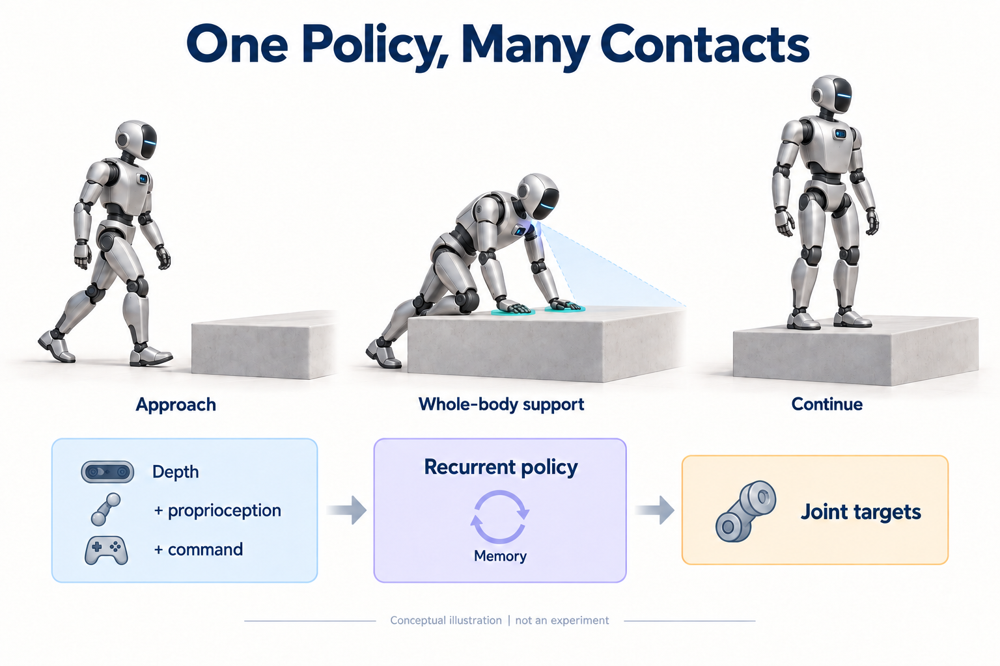
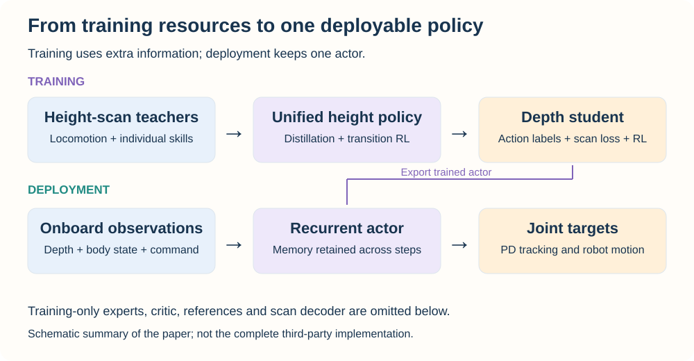
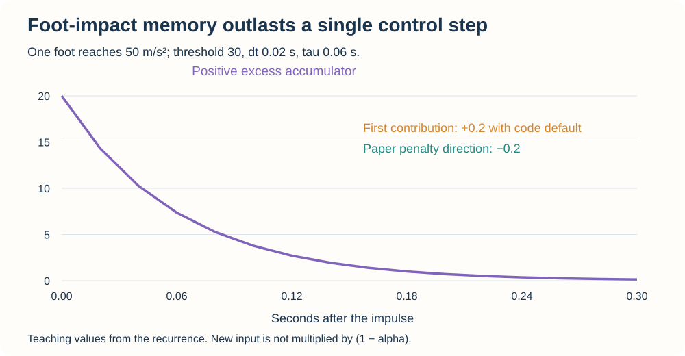
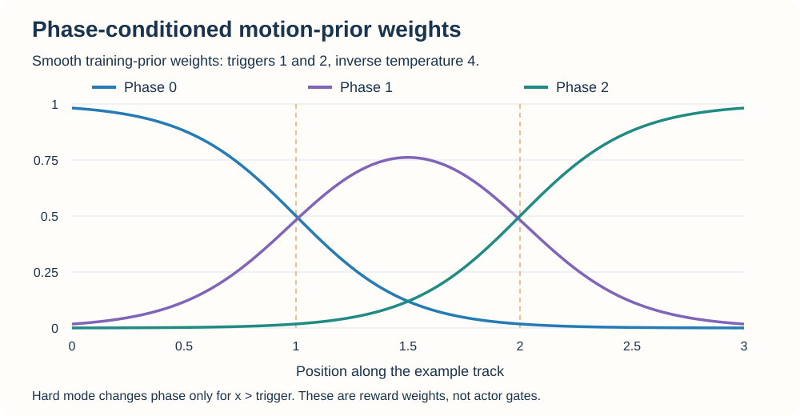
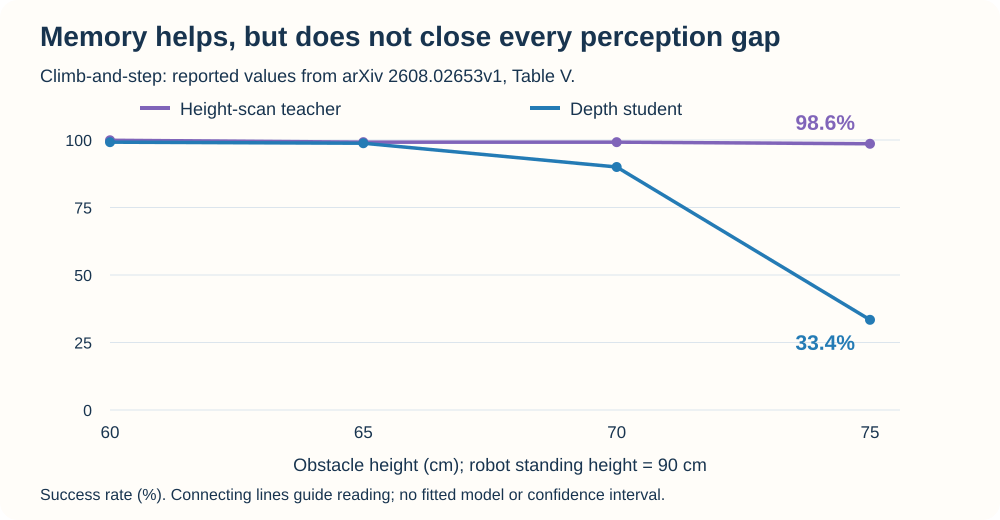

**Light-Loco-Parkour 研究的是：一个人形机器人怎样从眼前地形判断何时继续行走，何时用手臂、膝盖和躯干越过障碍，再自然地回到行走。** 难点不只是学会一次翻越，而是让参考动作适应不同障碍，让多个技能在真实观测下衔接，并最终由一个可部署策略完成控制。

本文同时阅读两份材料：[Light Origins 的原论文 v1](https://arxiv.org/abs/2608.02653v1)与 [lucidrains/light-loco-parkour](https://github.com/lucidrains/light-loco-parkour)。后者是本文分析的本地目录所对应的**第三方实现**，README 标注 WIP；源码固定在提交 [`963a6ec`](https://github.com/lucidrains/light-loco-parkour/tree/963a6ec3b8b42eb29dd6b9dfed34ededd3c64c7b)，包版本为 `0.0.29`，核对日期为 2026-09-12。

这个区分决定了怎样理解后面的内容：论文给出完整的人形机器人训练与部署系统；仓库提供神经网络、PPO、蒸馏、奖励和动作先验等组件，以及若干教学／接口测试。它没有附带论文的 IsaacLab 场景、机器人资产、参考增强流水线或可直接部署的权重。文中的论文成功率来自作者报告，CPU 结果则来自本文在固定源码上的独立检查。

| 想先回答的问题 | 阅读入口 |
| --- | --- |
| 整套方法为什么要分这么多阶段 | [训练路线](#pipeline)、[参考增强](#references-data) |
| 多个专家怎样变成一个策略 | [单技能学习](#skill-learning)、[多技能与衔接](#transitions) |
| 深度相机看不见脚下时怎么办 | [深度蒸馏与记忆](#depth-memory)、[时序接口](#temporal-contract) |
| 想读 PyTorch 实现 | [源码地图](#code-map)、[PPO 与奖励分组](#ppo)、[蒸馏接口](#distillation-code) |
| 想核对默认值和实现边界 | [奖励符号](#acceleration-sign)、[额外潜变量目标](#latent-prediction)、[可运行实验](#lab) |
| 论文究竟证明了什么 | [结果与消融](#evaluation)、[复现还缺什么](#reproduction-scope) |



## 1. 先看整条训练路线：每一步去掉一种依赖 {#pipeline}

理解这篇论文，可以先问：**当前阶段的策略还依赖哪些部署时拿不到的东西？** 原始动作专家知道参考轨迹与障碍的精确几何；高度扫描策略逐步摆脱显式参考；最终深度策略还要适应相机遮挡、噪声和延迟。

| 阶段 | 主要输入与监督 | 学到什么 | 本阶段仍不能替代什么 |
| --- | --- | --- | --- |
| 感知行走 | 本体信息、高度扫描、速度命令；强化学习奖励 | 行走、平衡和地形落脚 | 力量与接触高度协调的全身技能 |
| 参考动作增强 | 人体动作种子、人工配对障碍、物理仿真 | 不同障碍上的可执行参考 | 无参考输入的感知策略 |
| 单技能学习与泛化 | 专家动作、学生访问状态、配对地形与参考奖励 | 根据地形完成某一技能 | 在一条轨迹中决定何时进入、退出技能 |
| 多专家蒸馏 | 行走与各技能专家提供动作标签 | 一个网络容纳多个行为 | 行为之间的可靠衔接 |
| 衔接微调 | 混合地形、任务奖励、阶段条件动作先验 | 接近、越障、返回行走的连续行为 | 深度相机的部分可观测问题 |
| 深度蒸馏与微调 | 深度图、本体信息、速度命令；动作监督与扫描重建 | 可部署的带记忆策略 | 任意机器人上的直接复用 |

论文先把“能做什么”学扎实，再让策略学会“什么时候做”，最后处理“在板载传感器条件下怎样做”。这些阶段用到的训练资源很多，但不意味着部署时仍运行同样多的网络。[论文 Figure 2、Sections III–VI](https://arxiv.org/pdf/2608.02653v1)



最终控制链可以写成：

```text
depth + proprioception + velocity command
                ↓
       encoding + recurrent memory
                ↓
           joint targets
                ↓
          PD control + robot
                ↓
          next observation
```

论文报告的策略控制频率是 50 Hz，动作是由 PD 控制器跟踪的关节位置目标。这里的 50 Hz 是部署策略的控制周期，不是相机帧率、低层电机环频率，也不能仅凭它推出单次神经网络前向耗时恰好为 20 ms。

## 2. 为什么需要教师、学生和不对称 critic {#observations}

### 2.1 这是部分可观测控制问题

令机器人真实状态为 $s_t$，可获得观测为 $o_t$，历史为 $o_{\le t}$。策略需要根据观测与记忆选择动作：

$$
h_t=\operatorname{GRU}(e_t,h_{t-1}),\qquad
\pi_\theta(a_t\mid e_t,h_t),
$$

其中 $e_t$ 来自本体信息、地形感知与速度命令的编码。机器人是否已经把重量移到手上、相机刚才看见的平台边缘在哪里，都不一定能由当前单帧深度恢复。

论文的高度扫描教师使用 MLP，并堆叠最近 5 帧提供短期历史；最终深度学生使用循环记忆。作者还比较过卷积与全连接地图编码器，在该设置下卷积没有带来可测量收益，因而采用 MLP。不能看到输入是深度图，就自动把它描述成 CNN 或视觉 Transformer。[论文 Section IV-A](https://arxiv.org/pdf/2608.02653v1)

### 2.2 教师越“全知”，未必越容易蒸馏

训练时可以从模拟器得到精确地形、接触状态和动力学信息，但学生部署时拿不到全部真值。因此应区分两个角色：

| 网络 | 训练时的任务 | 信息设计原则 |
| --- | --- | --- |
| Actor | 根据自身观测选择动作 | 尽量使用学生能够观测或从历史推断的信息 |
| Critic | 为训练估计回报与优势 | 可以读取更多模拟器真值，提高价值估计质量 |

不对称 actor–critic 不是把所有特权信息都塞给 actor。假如同一学生观测对应两个教师动作 $+1$ 与 $-1$，且学生历史也无法区分两种状态，单纯最小化均方误差只会倾向于条件均值 0。更强的教师不能消除学生信息不足造成的歧义；需要改善可推断性、记忆或监督设计。

原论文从学生的信息条件反推教师 actor 的输入设计，并将额外真值更多地交给 critic。学生不能直接读取底座线速度等量时，循环网络需要从深度与本体历史中推断它们。高度扫描和深度图也不是同一张图换个名字：前者可提供较宽的局部地形覆盖，后者受到视野与自遮挡限制。[论文 Sections IV-A、IV-B、VI](https://arxiv.org/pdf/2608.02653v1)

### 2.3 不要把动作维数当成控制接口

源码 `Actor` 默认 `num_actions=21`，与论文平台的 21 个驱动自由度相呼应。但代码只负责产生数值或概率分布；它没有规定第几个输出对应哪台电机，也没有实现关节顺序、零位偏置、目标缩放或 PD 增益映射。

换机器人时至少要同时对应关节顺序、单位、目标定义与控制时钟。这个原则与 [X-VLA 的动作接口分析](#action-space)一致：形状匹配是必要检查，控制含义匹配才决定机器人收到什么命令。

## 3. 感知行走：奖励怎样鼓励机器人真正跨出去 {#locomotion-rewards}

### 3.1 速度跟踪与“敢于前进”解决不同问题

论文使用高斯核奖励跟踪平面速度与偏航角速度：

$$
r_{vel}=\exp\left(-\frac{\|v-v_{cmd}\|^2}{\sigma^2}\right).
$$

如果困难地形上的失败代价较高，仅靠精确速度跟踪，策略可能选择停在障碍前。论文额外加入速度松弛奖励，让机器人在命令附近的一段速度范围内获得奖励，以便减速攀爬而不必始终严格追踪瞬时速度。

固定源码计算的是“当前前向速度 / 命令前向速度”，检查其是否落在 `[0.3, 1.5]`，并对很小的命令幅值加门控。默认允许反向命令：例如命令为 −1、当前速度为 −0.6，比例是 0.6，属于沿命令方向移动；命令为 +1、当前速度为 −0.6，则不会得到这个奖励。

论文 Eq. (3) 附近对带上标与不带上标速度的文字定义，与前面的记号习惯有所变化。阅读时应以“哪个量是当前速度、哪个量是命令”为准；本文直接使用源码字段名，避免只按上标猜测比例方向。[`reward_velocity_slack`](https://github.com/lucidrains/light-loco-parkour/blob/963a6ec3b8b42eb29dd6b9dfed34ededd3c64c7b/light_loco_parkour/light_loco_parkour.py#L1095)

### 3.2 非法落脚惩罚看的是接触脚下的支撑几何

对每只已接触的脚，向下发射 $K$ 条高度射线。若脚高度与某条射线命中高度之差大于阈值 $\delta$，说明该位置可能悬在孔洞或边缘上：

$$
p_{foot}=\sum_i c_i\frac1K\sum_{k=1}^{K}
\mathbf1[z_i^{foot}-z_{ik}^{hit}>\delta].
$$

$c_i$ 表示脚是否处于接触状态。论文和源码的默认阈值为 0.1 m。若某只接触脚的 4 条射线中有 1 条越过阈值，它贡献 0.25；未接触的摆动脚不会因为正好位于空中而得到同一项落脚惩罚。

这个量衡量支撑区域的风险，不是地图重建误差。脚部射线在训练奖励和特权信息中有用途，并不意味着部署时机器人额外安装了脚底激光扫描仪。[论文 Eq. (4)、Figure 3](https://arxiv.org/pdf/2608.02653v1)

### 3.3 脚部加速度项是有记忆的累积量 {#acceleration-sign}

设每只脚的加速度为 $a_i$，阈值为 $\bar a$，先计算超出部分：

$$
e_t=\sum_i\max(\|a_i\|-\bar a,0),\qquad
\widetilde e_t=\alpha\widetilde e_{t-1}+e_t,
\quad \alpha=e^{-\Delta t/\tau}.
$$

默认 $\bar a=30\,\mathrm{m/s^2}$、$\Delta t=0.02$ s、$\tau=0.06$ s，因此 $\alpha\approx0.7165$。若第一步只有一只脚的加速度为 50，之后都低于阈值，累积量依次约为 20、14.3306、10.2683。一次冲击会在后续几步持续产生影响。



这里没有在新输入前乘上 $(1-\alpha)$，所以它不是保持输入幅值的标准指数滑动平均。持续输入同样的超限量 $e$ 时，稳态为 $e/(1-\alpha)$，不是 $e$。

**固定仓库的默认符号需要额外处理。** 论文 Table I 给脚部加速度项的权重是 **−0.01**；源码 `FootAccelerationPenalty` 返回非负累积量，但 `default_stateful_reward_fns()` 配置的是 **+0.01**，`RewardShapingWrapper` 随后直接加权求和。因此，上面的第一步在默认实现中贡献约 **+0.2**，而按论文惩罚方向应为 **−0.2**。[源码默认值](https://github.com/lucidrains/light-loco-parkour/blob/963a6ec3b8b42eb29dd6b9dfed34ededd3c64c7b/light_loco_parkour/light_loco_parkour.py#L1194)

若自己的实验希望采用论文方向，可以显式配置，而不是只根据类名中的 `Penalty` 判断符号：

```python
from light_loco_parkour import (
    FootAccelerationPenalty, RewardHyperParams, RewardShapingWrapper,
)

rewards = RewardShapingWrapper(
    reward_hparams=RewardHyperParams(),
    stateful_reward_fns=((FootAccelerationPenalty(), -0.01),),
)
```

本文没有改动被分析的第三方仓库；[源码检查结果](source-results.json)保留了默认正号的实际输出。奖励配置改变属于训练方案改变，应记录在自己的实验中。

### 3.4 奖励函数需要上游提供正确的物理量

`State` 是一组张量字段，不是模拟器适配器。例如 `contact_forces` 要先按所需部位选取并形成接触强度；函数本身不会从全部连杆的三维力向量中识别“非脚部接触”。`joint_limit_flags` 也要求调用方先判断关节是否接近限位且仍向限位移动。

不少奖励函数按 `b ... -> b` 求和，预期每次调用代表一批环境的一个控制步。直接传入 `[B,T,...]` 可能把时间维也累计掉。脚部加速度滤波还保存跨调用状态，应在对应 episode 结束时清除；当前 `reset_()` 是整体重置，没有逐环境 reset mask 的接口。

这些约定会改变实际奖励，不能靠把所有张量拼进 `State` 就自动满足论文定义。

## 4. 参考增强：为什么不能把人体轨迹直接抬高 {#references-data}

### 4.1 动作必须与障碍配对

人体视频可以提供动作形态，但翻越是否可执行取决于身体在哪里接触障碍。论文先用 GVHMR 恢复人体运动，再用 GMR 重定向到机器人，并根据手、脚等接触位置人工放置虚拟障碍，形成一个粗糙的“动作—地形”种子。

这个种子通常仍有问题：手可能穿进平台，膝盖可能碰到前缘，机器人动力学也不同于人。把动作各关节逐帧重放，不能保证接触约束、力矩和惯性都可行。

### 4.2 用物理 rollout 修正参考，再逐步扩展

论文的 Object-Interaction Mimic 在跟踪中增加场景约束：关注全局根位置与目标接触部位的位置，并向专家提供障碍距离和尺寸。参考状态初始化（RSI）会从参考动作的不同阶段启动 episode，使策略能够探索腾空、支撑和推起等关键中间状态。

随后进行迭代自增强：

1. 在当前动作与地形配对 $(r_i,d_i)$ 上训练跟踪策略。
2. 在物理模拟中执行多个 rollout，选择较好的轨迹 $\widehat r_i$。
3. 以这条实际 rollout 作为下一轮参考基础。
4. 将参考和对应障碍共同提高约 5–10 cm，继续下一轮训练。
5. 保存各轮地形与对应参考，形成后续技能泛化的数据集。

关键不是对一段静态关节轨迹反复加高度，而是**每轮都让策略在物理环境中重新解决接触，再把解决结果用作新的参考**。轨迹可以逐渐偏离最初的人体姿态，却更适合机器人的动力学与障碍几何。[论文 Section V-A、Algorithm 1](https://arxiv.org/pdf/2608.02653v1)

论文称这些 rollout 参考在模拟器及执行器约束下具有动力学可行性。这个条件不应扩展成真实硬件的无条件保证：模型误差、接触参数和传感器条件仍需通过后面的随机化、学生训练与实机验证处理。

### 4.3 保存的单位应是动作与地形这一对

后续随机到某个障碍高度时，应读取对应参考，而不是对所有高度仍使用同一条关节轨迹。否则，模仿奖励可能奖励一个脚放不到台面的动作，而任务奖励又要求完成越障，两者会互相冲突。

固定 `lucidrains` 仓库没有实现这条视频重建、重定向、参考评分与地形递进流水线。它提供的奖励和蒸馏组件可以参与后续训练，但不能仅靠调用 `LightLocoParkour(...)` 生成论文的参考数据。

## 5. 单技能学习：DAgger 与 PPO 为什么同时存在 {#skill-learning}

### 5.1 从最困难的专家开始蒸馏

参考增强阶段会得到不同地形上的跟踪专家。论文为每项技能选取最困难的专家，再把它蒸馏到与感知行走一致的观测接口：本体信息、局部高度扫描和速度命令。

这时，学生不再把整段参考轨迹作为部署输入。它需要从地形判断当前应该怎样运动，而不是读取“参考第几帧”。参考仍可以参与训练奖励或初始化，**从观测中移除参考，不等于训练时完全不用参考**。

### 5.2 DAgger 的关键是学生访问到的状态

行为克隆常在预先采集的专家轨迹上训练。DAgger（Dataset Aggregation，数据集聚合）则让学生进入环境，对学生实际访问到的状态调用专家提供标签：

$$
\mathcal L_{DAgger}=
\mathbb E_{s\sim d_{\pi_S}}
\left[\|\pi_E(o_E(s))-\pi_S(o_S(s))\|^2\right].
$$

$o_E$ 与 $o_S$ 可以包含不同信息，但必须来自同一时刻、同一个物理状态。不能用学生摔偏之后的观测，去匹配专家原始录像中相同帧号的动作；那是另一种监督关系。

仅做动作模仿仍可能产生恢复能力不足的学生。论文在这一阶段加入 PPO，用任务、目标与参考奖励提供环境反馈：

$$
\mathcal L=\mathcal L_{DAgger}+\lambda_{RL}\mathcal L_{PPO}.
$$

教师标签告诉学生在这个状态“专家会怎么做”，环境奖励则帮助它在已经偏离理想状态时继续解决任务。[论文 Eqs. (7)–(8)、Section V-B1](https://arxiv.org/pdf/2608.02653v1)

### 5.3 泛化阶段去掉专家，但保留配对参考

学生先学会最困难专家对应的技能，随后在增强得到的障碍范围内继续强化学习。这个阶段不再依赖专家动作标签，却仍使用与当前地形配对的参考奖励，并增加越过障碍后的目标奖励。

论文还调整初始化：关闭随机参考帧初始化，从动作起点附近开始，并用感知行走策略的关节姿态初始化身体。这样，技能面对的起始状态更接近后面真实的“行走 → 技能”交接，而不只是参考轨迹中某个理想中间姿态。[论文 Section V-B2](https://arxiv.org/pdf/2608.02653v1)

因此，“训练一项技能”“让它适应地形变化”“让它从行走状态自然启动”是不同的训练问题。增加专家数或训练步数，不会自动替代这些分布变化。

## 6. 多技能统一：一个网络会多个动作，为什么还不会衔接 {#transitions}

### 6.1 多专家蒸馏只解决能力合并

论文把并行环境划分为行走组与各个技能组，每个组由对应专家给出动作标签。统一学生通过 DAgger 学习这些行为；这一轮多专家合并使用动作模仿，不加入 PPO。

学生 actor 不接收技能标签，它必须根据感知和命令给出适当动作。critic 则可以接收训练组的 one-hot，帮助解释不同任务的奖励。**训练器知道哪位专家负责当前样本，与部署 actor 需要技能编号，是两回事。**

但如果每次 rollout 只出现完整行走，或者只出现一个已经启动的翻越，学生没有学过前者怎样进入后者。把两类训练数据混合，并不自动覆盖衔接状态。[论文 Section V-C1](https://arxiv.org/pdf/2608.02653v1)

### 6.2 单独加入衔接组，保留原技能作为约束

论文新增包含接近地形、障碍技能区和越障后区域的 transition group。这个组不再有贯穿整段的逐帧参考，而是通过强化学习优化速度跟踪、目标到达、目标接近和动作先验奖励。

原行走组与各技能组仍参与训练，维持已经学到的能力；新增衔接组让策略探索如何在这些能力之间转换。初始化还覆盖障碍前、技能区和障碍后，使“成功到达后方”的奖励有机会被采到，而不是完全依赖尚不会越障的策略偶然发现它。

这是一种训练分布设计：让策略在真正需要切换的状态附近获得经验，同时避免它为新目标丢失旧技能。

### 6.3 阶段条件 AMP 是训练奖励，不是部署状态机 {#phase-prior}

AMP（Adversarial Motion Priors，对抗运动先验）使用判别器判断当前运动是否接近参考行为。令判别器 logit 为 $\ell_\phi(z)$，概率为 $D_\phi(z)=\sigma(\ell_\phi(z))$，则：

$$
r_{AMP}(z)=-\log(1-D_\phi(z))
=\operatorname{softplus}(\ell_\phi(z)).
$$

论文中 $z$ 表示运动状态转移。衔接训练时，障碍触发位置之前使用行走先验，之后使用对应技能先验。它改变的是策略获得的训练奖励，促使策略在适当区域产生合适运动；最终 actor 仍根据自身观测输出动作。

因此，论文同时使用“训练先验按阶段切换”和“部署不使用手写技能切换器”并不矛盾。前者是教师信号的组织方式，后者是部署控制图的性质。若把 `PhaseConditionalMotionPrior` 直接当成线上技能调度器，便改变了原来的系统。[论文 Eq. (12)、Figure 6](https://arxiv.org/pdf/2608.02653v1)

固定源码提供两种先验权重。硬选择以**严格大于**触发位置计数；恰好位于触发位置时仍属于前一阶段。平滑模式使用累计 sigmoid：

$$
s_j(x)=\sigma(\beta(x-p_j)),\qquad
w_0=1-s_0,\quad w_j=s_{j-1}-s_j,\quad w_K=s_{K-1}.
$$

触发位置有序且 $\beta>0$ 时，各权重非负且和为 1。代码里的 `handoff_temperature` 对应这里的乘数 $\beta$，数值越大切换越陡；它更接近通常所说的逆温度。[`phase_weights`](https://github.com/lucidrains/light-loco-parkour/blob/963a6ec3b8b42eb29dd6b9dfed34ededd3c64c7b/light_loco_parkour/light_loco_parkour.py#L1515)



平滑混合是这个实现提供的选项，不应当作原论文必然使用的配置。还有三个具体接口要注意：

- 没有提供实际位置或显式 phase 时，`reward()` 会生成等间距的假想位置。它适合构造数组示例，不能代表机器人真实穿过障碍的进度。
- 触发位置的顺序没有自动校验；将 `(1, 2)` 写成 `(2, 1)`，平滑模式可能产生负权重，即使权重总和仍然为 1。
- 给构造器一个 `MotionPrior` 对象，会在各阶段复用同一对象、共享参数；不会自动复制出独立的行走与技能判别器。

### 6.4 AMP 必须进入能影响策略的学习路径

在通常的 PPO 流程中，先验分数作为环境奖励的一部分，参与回报、GAE 和策略损失。判别器则另外通过参考运动与策略运动进行训练。

固定仓库的 `test_full_pipeline_e2e` 构造随机张量，计算 `amp_reward.detach()`，再把它从最终策略损失中减去。这个减去的标量没有梯度，而且该测试并未将 AMP 分数加入先前的 GAE 回报，所以这一行不会使 actor 学到先验运动。它能检查组件是否能共同执行，但不能说明动作先验已改善闭环行为。[测试中的奖励与反向传播](https://github.com/lucidrains/light-loco-parkour/blob/963a6ec3b8b42eb29dd6b9dfed34ededd3c64c7b/tests/test_light_loco.py#L112)

一个最小例子是 $L(p)=p^2-0.01\operatorname{stopgrad}(3p)$：在 $p=2$ 时，梯度仍为 4，与完全去掉第二项相同。`detach` 本身并没有错；PPO 通常也不对环境奖励直接求导。关键是这个分数是否已经进入优势估计，而不是在打印出来的 loss 中有没有出现它。

### 6.5 价值 critic 与动作判别器承担不同任务

PPO critic 估计未来回报，用来构造优势；AMP discriminator 区分参考运动与策略运动，用来提供风格奖励。固定 `MotionPrior.discriminator_loss` 将两类样本拼接，计算平均二元交叉熵，并默认加入权重为 10、以零梯度为中心的输入梯度正则。其正则覆盖拼接后的样本，具体定义应按源码读取。

判别器输出的是 logit，`reward()` 才将它变为 softplus 分数。logit 为 0 时奖励是 $\log2$；正 logit 增大时奖励继续增长，因此它不是范围固定在 0 到 1 的成功概率。调用方还要把真实／生成运动编码成一致的转移特征，并决定如何与任务奖励组合。[`MotionPrior`](https://github.com/lucidrains/light-loco-parkour/blob/963a6ec3b8b42eb29dd6b9dfed34ededd3c64c7b/light_loco_parkour/light_loco_parkour.py#L1390)

## 7. 从高度扫描到深度：记忆为什么不可缺少 {#depth-memory}

### 7.1 感知变化比“换一个输入编码器”更大

高度扫描可以覆盖附近地形，而胸前相机的视野随躯干运动变化。机器人前倾越障时，平台表面可能离开视野；落脚点也可能在脚真正接触前就被身体遮住。

深度学生需要同时恢复部分不可测状态和保留刚刚看到的地形。论文使用 GRU，并增加从内部表示重建教师高度扫描的辅助损失：

$$
\mathcal L_{recon}=\|D_\psi(h_t)-s_t^{scan}\|^2.
$$

这个解码器帮助训练记忆保存与地形有关的信息，部署时可以移除。它不是要求硬件实时获得教师扫描，也不意味着部署时必须显式建立一张高度地图。[论文 Section VI、Eq. (13)](https://arxiv.org/pdf/2608.02653v1)

### 7.2 训练必须见过相机噪声和陈旧帧

原论文对模拟深度施加按距离增长的高斯噪声，标准差为 $0.005+0.02d$，其中 $d$ 以米计；还包括 ±5% 深度尺度扰动和持续数帧的块状缺失。

时间上，作者模拟约 27–33 Hz 的相机帧率与 30–60 ms 的处理延迟，而策略在 50 Hz 下运行。于是一次相机处理延迟相当于约 1.5–3 个策略周期，且策略可能在相邻周期重复使用同一深度帧。

GRU 可以利用历史改善控制，但不会让图像自动变成当前时刻的观测。复现时仍应记录采集、处理和动作生效时间。这里与 [RTC 的端到端时间分析](#runtime)有关，但 Light-Loco-Parkour 不是直接输出 RTC 式长动作块的同一种接口，不能把两者的调度公式直接互换。

### 7.3 为什么蒸馏后还要微调

教师在高度扫描下给出的动作，未必总能由带延迟和遮挡的深度学生准确推断。动作模仿可以得到可用策略，最终的强化学习微调则在学生实际的观测条件下优化任务完成。

论文的消融也显示，记忆并不能完全消除信息缺口：最高的 75 cm 攀爬设置中，教师仍有很高的报告成功率，深度学生却明显下降。后面的[结果表](#evaluation)会把这个差距与较容易的设置一起列出，避免只挑选接近满分的任务。

## 8. 源码地图：从输入张量走到损失 {#code-map}

固定仓库的主要组件集中在一个约 1,600 行的 Python 文件中。建议按数据流阅读，而不是从最外层类名猜测它实现了整套训练。

| 组件 | 实际职责 | 没有自动完成的部分 |
| --- | --- | --- |
| `StateEncoder` | 展平、堆帧、MLP，可选 FiLM 与 GRU | 相机采集、图像校准、跨调用原始帧缓存 |
| `Actor` | 状态特征到动作分布参数、采样或均值 | 关节语义、硬件通信与低层 PD |
| `Critic` | 单头／多头价值预测与价值损失 | 任务分组、回报采集与终止标注 |
| `Agent` | 输入路由、GAE、优势与 PPO 损失 | rollout buffer、优化器、训练循环 |
| `DistillationWrapper` | 学生与教师动作均值 MSE，可选特权重建 | DAgger 数据采集、多专家调度 |
| `RewardShapingWrapper` | 奖励项及其权重的组合 | 从模拟器构造正确的物理状态 |
| `MotionPrior` / `PhaseConditionalMotionPrior` | 判别器奖励、损失与阶段权重 | 参考转移数据、真实位置与策略奖励接线 |
| `LightLocoParkour` | 当前仅保存传入的 `agent` | 没有完整训练方法或 `forward` |

源码中的 `Agent` 可以给 actor 与 critic 选择不同字段。例如学生读取 `('proprio', 'depth')`，critic 读取 `('proprio', 'scan')`。字段路由提供了实现不对称观测的能力，但具体选择和维数仍由调用方指定。[核心实现](https://github.com/lucidrains/light-loco-parkour/blob/963a6ec3b8b42eb29dd6b9dfed34ededd3c64c7b/light_loco_parkour/light_loco_parkour.py)

### 8.1 一个具体的形状例子

取本文构造的配置：$B=2$、$T=8$、观测展平后 $D=9$、堆帧数 $F=5$、隐藏维度 $h=32$、动作数 $A=3$。这些是教学参数，不是论文的实际深度分辨率。

```text
原始观测                  [2, 8, 9]
左侧补零后堆 5 帧         [2, 8, 45]
MLP 编码                  [2, 8, 32]
可选 GRU                  [2, 8, 32]
动作 MLP + 参数头         [2, 8, 3, 2]
Gaussian / Beta 均值      [2, 8, 3]
联合动作 log probability  [2, 8]
```

最后的 2 表示每个动作维度的分布参数，不是预测了两个未来动作。默认启用分布模块后，普通 `actor(...)` 返回的是分布对象与循环状态；要得到均值动作，应使用 `deterministic=True`，要采样并保存 PPO 所需概率，则使用 `sample_action=True, return_log_prob=True`。

### 8.2 三种“组”不能混用

`num_skill_groups` 决定网络是否拼接 one-hot 条件；`num_value_heads` 决定 critic 有多少价值输出头；`RewardShapingWrapper` 的 reward groups 决定产生多少奖励流。三者控制不同事情。

论文让统一 actor 不读取技能标签，可以将 actor 的 `num_skill_groups` 保持为 1，而 critic 根据需要配置训练组条件。若 actor 设成多技能 one-hot 输入维数，却又不传 `skill_groups`，代码不会替你从深度中补出那个 one-hot，反而会出现输入维数不匹配。

类似地，多价值头应与分组回报的最后一维对齐。增加几个 critic 头不会自动把一个总奖励拆成独立的速度、接触和姿态奖励。

### 8.3 Gaussian 与 Beta 的两个输出参数含义不同

`Gaussian` 默认将第一项作为均值，第二项作为 log standard deviation，经截断和正值变换得到标准差。高斯分布本身无界；它不会因为动作最终交给关节位置控制器，就自动具有机器人的关节范围。

Beta 则由独立依赖 `mean-conc-beta` 提供。本文安装的 0.0.8 版本先用 `tanh` 将均值映射到默认动作区间 $(-1,1)$，再构造单位区间上的 Beta 分布。令 $u=(\mu+1)/2$，浓度为 $\kappa$，则基础分布参数为 $\alpha=u\kappa,\beta=(1-u)\kappa$，最后将样本 $x$ 变为动作 $a=2x-1$。

该依赖还加入保持单峰的浓度下界。默认原始输出为两个零时，动作均值是 0，初始浓度 10 加上单峰修正后为 12，因此基础分布是 $\operatorname{Beta}(6,6)$，不是均匀分布。这个值已在[源码探针](source-results.json)中实际检查；它依赖所安装的外部包版本，不只是本仓库的 Git 提交。

区间变换还影响密度：$\log p_A(a)=\log p_X((a+1)/2)-\log2$，微分熵相应增加 $\log2$。因此应使用分布提供的 `log_prob` 和 `entropy` 接口，不要将单位区间上的密度直接用于变换后的动作。映射到机器人关节范围时，也要明确变换发生在策略概率空间还是环境适配层。

## 9. PPO 与分组优势：每个数字来自哪里 {#ppo}

### 9.1 `calc_gae` 返回的是价值目标

固定实现先计算 TD 残差，再通过反向扫描累积：

$$
\delta_t=r_t+\gamma m_tV_{t+1}-V_t,
\qquad A_t=\delta_t+\gamma\lambda m_tA_{t+1},
\qquad R_t=A_t+V_t.
$$

这里 $m_t$ 是是否继续 bootstrap／跨步传播的 mask。`calc_gae` 最终返回 $R_t$，不是 $A_t$。函数接受 $T$ 或 $T+1$ 个价值估计；如果只给 $T$ 个，就在末尾补零，不能因此声称已经计算了正确的非终止 bootstrap。[`calc_gae`](https://github.com/lucidrains/light-loco-parkour/blob/963a6ec3b8b42eb29dd6b9dfed34ededd3c64c7b/light_loco_parkour/light_loco_parkour.py#L723)

例如 $r=[1,2]$、$V=[0.5,0.4,0.3]$、$m=[1,0]$，取 $\gamma=0.9,\lambda=0.8$，得到：

```text
TD residuals  = [0.86, 1.6]
advantages    = [2.012, 1.6]
value targets = [2.512, 2.0]
```

最后一步是终止，所以传入的 0.3 不会参与 bootstrap。若它只是时间上限，应该按所用环境协议保留终点价值贡献，同时阻断向下一个 episode 传播；这需要数据采集层区分真正终止与截断。

### 9.2 先分别标准化，再按组组合

分组价值头分别估计各奖励流的 $R_t^{(g)}$。代码对每组优势在有效的 batch 和时间位置上做标准化，再加权相加：

$$
\widetilde A_t=\sum_g w_g
\frac{A_t^{(g)}-\mu_g}{\sqrt{\operatorname{Var}(A^{(g)})+\epsilon}}.
$$

这样可以减少某个奖励流单纯因为数值尺度较大而主导 actor 更新。它不保证所有目标都同等重要；权重 $w_g$、各组梯度方向及奖励定义仍然决定取舍。固定实现的方差是按有效样本平均的总体方差，$\epsilon$ 加在方差内部。

组内标准化还意味着：将某组奖励整体放大，不等于按同样倍数提高其对策略的影响。如果要控制组间偏好，应区分“组内奖励项权重”和“标准化后的组权重”。`actor_loss` 默认还会对组合后的优势再标准化一次；公共缩放的效果因此又不同于相对组权重。[`calc_advantages` 与 `actor_loss`](https://github.com/lucidrains/light-loco-parkour/blob/963a6ec3b8b42eb29dd6b9dfed34ededd3c64c7b/light_loco_parkour/light_loco_parkour.py#L770)

### 9.3 PPO 使用 rollout 中实际采到的动作

概率比为：

$$
\rho_t=\exp\big(\log\pi_\theta(a_t\mid o_{\le t})-
\log\pi_{old}(a_t\mid o_{\le t})\big).
$$

当前策略重新评价的是缓存的动作 $a_t$，不是重新采一个动作后与旧概率相减。源码把各动作维度的 log probability 相加，然后使用 clipped surrogate 与熵项。

`mask`／`lens` 控制哪些样本参与损失平均；它与 GAE 的继续传播 mask 作用不同。padding mask 全为真，不代表相邻位置属于同一 episode；反过来，一个终止动作仍可能是应该训练的有效样本。

对于循环策略，公式中的条件还包含当时的记忆。即使网络权重未变，重放时丢掉起始隐藏状态，也可能使概率比偏离 1。这个问题将在[时序接口](#temporal-contract)中用实际源码演示。

## 10. 蒸馏接口：一个 MSE wrapper 还不是 DAgger {#distillation-code}

### 10.1 它比较的是动作均值

`DistillationWrapper` 为学生和教师分别选择输入字段，再以 `deterministic=True` 调用两者，比较动作均值。默认对教师使用 `torch.no_grad()`，但这不等于自动调用 `teacher.eval()`，也不负责维护教师的运行模式。

对于 Gaussian，确定性输出是均值；对于 Beta，则是经过变换后的有界均值。两个分布均值相同，即使方差完全不同，这个蒸馏项仍然可以为零。因此不能把它叫作完整分布匹配或 KL 蒸馏。

代码先对动作维度取平均，再加可选的特权重建损失。论文中写成平方范数的公式与代码中按动作维度平均的实现，在多动作维度下会相差一个尺度因子；与 PPO 或辅助损失组合时，损失权重应按实际 reduction 核对。[`DistillationWrapper.forward`](https://github.com/lucidrains/light-loco-parkour/blob/963a6ec3b8b42eb29dd6b9dfed34ededd3c64c7b/light_loco_parkour/light_loco_parkour.py#L935)

`weights` 也不是自动归一化的采样概率。若两个有效位置的损失为 1 和 9，权重为 1 和 3，代码得到 $(1\times1+9\times3)/2=14$；按权重和归一化则会得到 7。本文的源码探针直接验证了前一种行为。

### 10.2 采集与训练循环仍要自己组织

一个真正的 DAgger 迭代至少需要：学生访问环境、在对应状态查询教师、形成监督样本、更新学生，然后用更新后的学生继续采集。这个 wrapper 只处理已经传入的一批张量。

它也没有自动根据环境组选择多个专家，或者把 PPO、判别器损失和优化器组合起来。名字中有 `Distillation`，不代表已经覆盖论文的全部训练阶段。

循环状态同样需要处理：wrapper 接受师生的初始隐藏状态，但内部没有把更新后的隐藏状态作为输出返回。用它做跨调用的循环蒸馏时，应明确训练片段如何切分、起始记忆从哪里来，而不是假设 wrapper 已经维护连续轨迹。

### 10.3 特权重建与额外潜变量预测是不同目标 {#latent-prediction}

论文的辅助目标是重建教师高度扫描。当前仓库还增加了 `NextLatentPredictionWrapper`，引用 SPR 与 next-latent prediction 工作，预测下一时刻内部表示：

$$
\widehat h_{t+1}=h_t+f_\psi(h_t,a_t),\qquad
\mathcal L_{latent}=2-2\cos\big(P\widehat h_{t+1},P\operatorname{sg}(h_{t+1})\big).
$$

它是第三方实现的扩展，不是原论文深度重建项的另一个名字。该目标通过时间相邻的潜变量训练前向动力学；高度扫描重建则有明确的地形目标。

默认行为尤其容易误读：`Actor(next_latent_prediction=None)` 会先被替换为 `{}`，随后创建自动启用的 wrapper；在训练模式、梯度开启且至少两个时间步时计算该损失。显式传入 `False` 才会关闭。固定 Pendulum 脚本在命令行选项为 false 时传给 Actor 的却是 `None`，所以不能仅根据 CLI 布尔值认定辅助目标已关闭。

还有三个求导细节值得保留：

- 目标分支只对下一时刻 latent 做 detach，后面的共享投影 $P$ 仍然可训练；不是整个目标分支都停止梯度。
- 未显式传动作时，wrapper 使用输出参数的第一项。对 Beta，这个原始参数不等于经过 `tanh` 后的动作均值。`Agent.actor_loss` 会显式传入 rollout 动作，具有不同语义。
- mask 只检查两个相邻位置是否都有效，不检查中间是否跨过 episode reset。训练片段或额外的转移 mask 需要避免把两个 episode 错当成一条动力学轨迹。

`Agent.actor_loss` 会加上这个潜变量损失；`DistillationWrapper` 返回的总损失则没有自动把它加进去。比较配置时，应保存真正参与反向传播的各项，而不只是记录网络中安装了哪些模块。[潜变量目标与 Actor 构造](https://github.com/lucidrains/light-loco-parkour/blob/963a6ec3b8b42eb29dd6b9dfed34ededd3c64c7b/light_loco_parkour/light_loco_parkour.py#L301)

## 11. 时序接口：训练片段和在线记忆必须一致 {#temporal-contract}

### 11.1 五帧堆叠不等于自动维护五帧缓存

`StateEncoder` 对本次输入的时间轴左侧补零，再用 `unfold` 构造帧窗口。它没有保存前一次调用的原始观测。因此，整段 `[B,T,D]` 输入与连续调用 $T$ 次 `[B,1,D]`，在 `num_stacked_frames=5` 时并不具有相同的输入窗口。

本文固定随机种子，比较同一套 GRU 权重的两种调用方法，并在线逐步传递返回的隐藏状态：

| 配置 | 整段与单步调用的最大动作均值差 |
| --- | ---: |
| 堆 1 帧，正确传递 GRU 隐藏状态 | 约 $8.94\times10^{-8}$ |
| 堆 5 帧，只传递 GRU 隐藏状态 | 约 0.0100 |

这不是机器人误差或模型质量评测，而是两种张量接口是否等价的检查。GRU 记忆不能代替缺失的原始帧窗口。

在线接入时应明确由谁维护原始历史。一个可研究的接口方案是由调用方堆好历史，将它作为单时刻特征输入，并相应配置编码器的维度与堆帧数；不能把含有旧帧的完整窗口一遍遍交给 GRU，同时又沿用已经处理过这些旧帧的隐藏状态，否则会重复更新记忆。

### 11.2 TBPTT 截断的是梯度，不是前向记忆

TBPTT 指截断的时间反向传播（Truncated Backpropagation Through Time）。启用 GRU 时，默认 `tbptt_timesteps=10` 会把时间序列分块。每块的末尾隐藏状态继续传给下一块，但先做 `detach()`，因此前向信息可以继续传播，梯度不能跨过这个边界。

即使关闭分块，当前实现仍会将返回的隐藏状态 detach。调用者不能假定跨多次 `forward` 会自动形成无限长的反向传播图。[`StateEncoder.forward`](https://github.com/lucidrains/light-loco-parkour/blob/963a6ec3b8b42eb29dd6b9dfed34ededd3c64c7b/light_loco_parkour/light_loco_parkour.py#L229)

### 11.3 循环 PPO 需要重放当时的条件

本文另取一个 GRU 策略，先对完整序列计算动作分布，再从序列中间截取后三步、以空隐藏状态重新计算。权重完全不变，但对同一动作的概率比约为：

```text
[1.00927, 1.00483, 1.00218]
```

差异来自起始记忆变化。固定 Pendulum 示例的更新函数会按连续小块处理数据，但没有为每个小块携带 rollout 中对应的初始隐藏状态，也没有提供 burn-in 前缀。保留时间维本身还不够保证循环 PPO 的条件一致性。[`ppo_update`](https://github.com/lucidrains/light-loco-parkour/blob/963a6ec3b8b42eb29dd6b9dfed34ededd3c64c7b/validate_pendulum.py#L217)

如果还开启上一动作反馈，同样要维护片段之前的那一步动作。`use_last_action` 把 $a_{t-1}$ 编码后加到当前状态表示，而不是把当前动作当成过去信息。切片后丢掉前一动作，也会改变策略条件。

### 11.4 字段顺序与状态生命周期也是接口的一部分

直接给编码器传字典时，它按字典值的顺序组织特征；通过 `Agent` 的 key 路由则会变成按指定 key 排列的列表。FiLM 的 `cond_key` 若使用字符串，只适用于字典路径；被路由成列表后应使用对应的整数位置。

此外，episode reset 时需要一致地处理 GRU 隐藏状态、原始帧历史、过去动作与有状态奖励。当前奖励 wrapper 的 `reset_()` 负责它自己的状态，不会替 actor 清理隐藏状态，也不会自动识别某个并行环境刚刚结束。

## 12. 论文结果：既看高成功率，也看感知缺口 {#evaluation}

### 12.1 攀爬高度增加后，学生与教师的差距会扩大

下表选取论文 Table V 的攀爬行。`Ours` 是深度学生，FT 表示最终强化学习微调；数值为作者报告的成功率百分比。

| 平台高度 | 深度学生 | 不做最终 FT | 不用 GRU | 高度扫描教师 |
| --- | ---: | ---: | ---: | ---: |
| 60 cm | 99.2 | 88.4 | 54.0 | 99.9 |
| 65 cm | 98.8 | 89.8 | 56.6 | 99.2 |
| 70 cm | 90.0 | 76.4 | 34.2 | 99.2 |
| 75 cm | 33.4 | 17.0 | 0.0 | 98.6 |



论文平台身高 90 cm，所以 75 cm 约为身高的 0.83 倍。这表示被测试的障碍尺度，不等于深度学生能以接近满分的成功率处理该极限高度。教师仍能较好完成，而学生明显下降，提示这里存在感知与控制条件之间的缺口；GRU 缓解了它，但没有完全消除。

速度撑越（speed-vault）在 40、45、50 cm 下，深度学生报告值分别为 99.0、95.0、93.4；去掉最终微调后为 65.2、68.4、61.8。对于 stepping stones，完整学生为 99.9，不做最终微调为 34.6，不用 GRU 为 0。不同任务对记忆和微调的依赖程度并不相同。[论文 Table V](https://arxiv.org/pdf/2608.02653v1)

作者说明各设置进行 500 次随机试验，并描述了 15,000 次迭代的配置，其中深度蒸馏 14,000 次、最终微调 1,000 次；无微调版本在蒸馏后停止。因此该消融移除的是整个微调阶段，不能把差异完全归因于某个单独损失项。

表内同时存在 99.9 等报告值。本文按原表保留，不据此反推整数成功次数或构造置信区间；若要重新统计，需要逐次 rollout 结果和作者的具体汇总方式。

### 12.2 学会技能衔接，需要专门的训练分布

论文 Table VII 将成功定义为：既切换到地形要求的行为，又完成随后的技能或行走段。每种设置进行 100 次随机试验。

| 配置 | 衔接与后续任务共同成功率 |
| --- | ---: |
| 平地行走 + 独立技能，没有衔接组 | 0% |
| 粗糙地形行走 + 独立技能，没有衔接组 | 33% |
| 去掉 AMP | 51% |
| 完整衔接训练 | 98% |

这组结果支持“多技能合并不自动产生可靠衔接”，也说明动作先验对该实验的表现有作用。它不等于任意路线、任意障碍和任意实机条件下都有 98% 成功率。

论文还展示了隐藏状态的 t-SNE 可视化。它可以帮助观察轨迹随行为变化的局部结构，却不能单凭二维聚类距离证明策略内部存在离散技能开关。[论文 Table VII、Figure 11](https://arxiv.org/pdf/2608.02653v1)

### 12.3 实机部署与泛化应分别阅读

原论文使用 Lightbot 0：身高 90 cm、质量 18.9 kg、21 个驱动自由度，配备胸前 RealSense D435、IMU 与关节编码器。作者报告在板载 Jetson Orin Nano 上运行 50 Hz 策略，展示室内外越障、窄板桥、踏脚石和连续技能切换。

形状泛化实验还将训练箱体换为未见过的鞍马状梯形障碍，报告 reverse-vault 与 speed-vault 分别为 93.4% 和 95.3%。它说明这些技能可以适应被测试的形状变化，不能推广为任意物体几何上的可靠性。[论文 Sections VII-A、VII-B、Table VI](https://arxiv.org/pdf/2608.02653v1)

这些硬件实验属于原论文系统。本文分析的第三方仓库没有附带相同场景、标定、训练产物与部署适配器，不能把安装该包作为获得这些能力的等价步骤。

## 13. 可运行实验与核对结果 {#lab}

### 13.1 先跑不依赖模型的数学练习

下载 [parkour_lab.py](parkour_lab.py)，使用 Python 3.10 或更新版本运行即可，无需安装第三方库：

```bash
python3 parkour_lab.py
```

程序验证奖励累积、终止／截断的 GAE 差异、严格触发边界、平滑权重、分组标准化、蒸馏权重 reduction，以及 Beta 区间变换的密度和熵。输出末尾 `passed: true` 表示教学检查通过；[本次输出](teaching-results.json)可供逐项对照。

如需重建四张 SVG，再将 [make_figures.py](make_figures.py) 下载到同一目录：

```bash
python3 make_figures.py
python3 make_figures.py --check
```

第一条命令生成 `assets/` 下的图，第二条只比较已有文件是否与生成器一致。数值图对应教学公式；师生对比图的数字来自论文 Table V，生成图表本身不会运行机器人评测。

### 13.2 在固定源码上复查接口

另外提供 [source_probe.py](source_probe.py)，实际调用本次固定仓库的组件。它要求 PyTorch 及该包的依赖，与上面的纯标准库练习分开。本次使用 Python 3.10.0、PyTorch 2.9.0 CPU、NumPy 2.2.6；完整依赖约束保存在 [source-constraints.txt](source-constraints.txt)。

以下命令对应本次验证的 Linux x86_64 CPU 环境。先下载约束文件，再在独立目录安装；其他平台需要选择匹配的 PyTorch 安装包，不能直接假定同一组二进制依赖可用：

```bash
git clone https://github.com/lucidrains/light-loco-parkour.git
cd light-loco-parkour
git checkout 963a6ec3b8b42eb29dd6b9dfed34ededd3c64c7b
python3 -m venv ../light-loco-env
. ../light-loco-env/bin/activate
python -m pip install 'pip==25.2'
python -m pip install 'torch==2.9.0+cpu' \
  --index-url https://download.pytorch.org/whl/cpu
python -m pip install -c /path/to/source-constraints.txt '.[test]'
```

`/path/to/source-constraints.txt` 需要替换为下载文件的实际路径。包的直接要求写着 `torch>=2.5`，但本次解析到的 `accelerated-scan` 要求更高版本；这也是不能仅根据顶层依赖判断环境兼容性的原因。本文使用独立 CPU 环境验证，没有修改本机其他 PyTorch 环境。

随后从下载探针的目录执行：

```bash
python source_probe.py \
  --source-root /path/to/light-loco-parkour \
  --output source-results-local.json
```

程序检查 Git 提交和工作区状态，确保结果对应未修改的固定源码，再运行奖励符号、堆帧与 GRU、潜变量默认开关、蒸馏权重、GAE、阶段权重、循环重放和动作输出等检查。[本次实际结果](source-results.json)记录了依赖版本与数值。

### 13.3 源码测试通过到哪一层

切回固定源码仓库的根目录，保持前述虚拟环境已激活。本次运行以下两个原仓库测试文件：

```bash
PYTHONDONTWRITEBYTECODE=1 OMP_NUM_THREADS=1 MKL_NUM_THREADS=1 \
python -m pytest -p no:cacheprovider -q \
  tests/test_agent.py tests/test_next_latent_prediction.py
```

结果为 **33 passed**。这些测试包含张量接口、损失与小型潜变量／积分器学习任务，不包含人形机器人仿真。

运行全量测试收集时，`tests/test_light_loco.py` 会导入仓库中缺失的 `validate_transition`，产生 `ModuleNotFoundError`。因此本文没有将结果描述为“全部测试通过”，也没有补造这个模块后再把结果算到原仓库上。

此外，以下三轮 Pendulum 短跑可以执行完成：

```bash
PYTHONDONTWRITEBYTECODE=1 OMP_NUM_THREADS=1 MKL_NUM_THREADS=1 \
python validate_pendulum.py \
  --max_iterations=3 --steps_per_iter=256 \
  --ppo_epochs=1 --batch_size=64 --num_envs=2 --use_rnn=True
```

本次三轮平均 episode reward 约为 −1251.28、−1247.76、−1197.08。这个短跑确认采集、GAE 和更新路径可运行，不能证明策略已收敛，更不能代表跑酷性能。脚本对循环片段、辅助目标开关等处理还应按前面的接口分析核对。

## 14. 从组件走向完整复现，还需要补哪些工作 {#reproduction-scope}

如果目标是研究本文的数学与实现，随文练习和源码探针已经提供了直接入口。如果目标是训练论文中的人形机器人系统，则需要继续补齐以下相互关联的环节：

| 环节 | 需要形成的具体产物 | 应验证的问题 |
| --- | --- | --- |
| 机器人与场景 | 模型、执行器约束、接触与传感器配置 | 同一动作目标是否产生符合预期的运动？ |
| 参考数据 | 成对保存的轨迹与障碍几何、筛选记录 | 每条参考是否对应当前地形与接触位置？ |
| 训练环境 | 奖励状态、终止／截断、课程与随机化 | 奖励符号、单位和 bootstrap 是否一致？ |
| 多阶段训练 | 专家选择、学生采集、PPO／DAgger／AMP 接线 | 每个阶段究竟使用哪些标签与奖励？ |
| 循环数据管线 | 帧窗口、隐藏状态、过去动作、episode 边界 | 重放是否保持 rollout 时的条件？ |
| 部署与评测 | 观测预处理、时间戳、动作映射、分项结果 | 学生是否在真实传感器条件下完成任务？ |

这些工作不是几个待填写的模型超参数，而是论文能力赖以成立的数据与控制系统。`LightLocoParkour` 当前的薄封装可以组织已有 agent，却不能代替它们。

阅读这套方法最有价值的收获，是把四件事分开并重新接起来：**地形配对参考提供可学习的接触经验，蒸馏把经验转移到更现实的观测条件，专门的衔接训练覆盖行为转换，而记忆与传感器建模帮助最终学生闭环执行。** 每一层都要用对应的证据验证，不能由上一层的成功自动推断下一层也成立。

## 阅读自测与验收 {#reading-checks}

- 区分原论文完整系统与固定第三方仓库的组件范围，解释全量测试为何无法直接通过。
- 说明参考增强、单技能 DAgger、多专家合并、衔接 RL 与深度蒸馏分别改变什么训练条件。
- 运行 CPU 练习，核对脚部加速度的符号、GAE 目标、阶段权重与蒸馏 reduction。
- 用源码探针解释堆帧缓存、GRU 隐藏状态及潜变量默认开关为什么影响结果。
- 按论文各自评测口径解释 75 cm 攀爬的师生差距和 98% 衔接成功率。

## 参考资料 {#references}

- Chen et al. [Light-Loco-Parkour: Versatile Perceptive Whole-Body Locomotion via Multi-Skill Distillation，v1](https://arxiv.org/abs/2608.02653v1)，2026-08-01。方法、训练阶段与实验结果的主要来源。
- Light Origins. [Light-Loco-Parkour 项目主页](https://light-loco-parkour.github.io/)。实机演示与系统概述。
- Phil Wang / lucidrains. [light-loco-parkour，固定提交 `963a6ec`](https://github.com/lucidrains/light-loco-parkour/tree/963a6ec3b8b42eb29dd6b9dfed34ededd3c64c7b)。本文逐项核对的第三方实现与测试。
- Mysore et al. [Multi-Critic Actor Learning: Teaching RL Policies to Act with Style](https://openreview.net/forum?id=rJvY_5OzoI)，ICLR 2022。仓库分组优势与多 critic 设计引用的研究。
- Schwarzer et al. [Data-Efficient Reinforcement Learning with Self-Predictive Representations](https://arxiv.org/abs/2007.05929)；Teoh et al. [Next-Latent Prediction Transformers Learn Compact World Models](https://arxiv.org/abs/2511.05963)。第三方实现潜变量预测扩展引用的工作，不应与原论文的高度扫描重建目标混为一谈。
