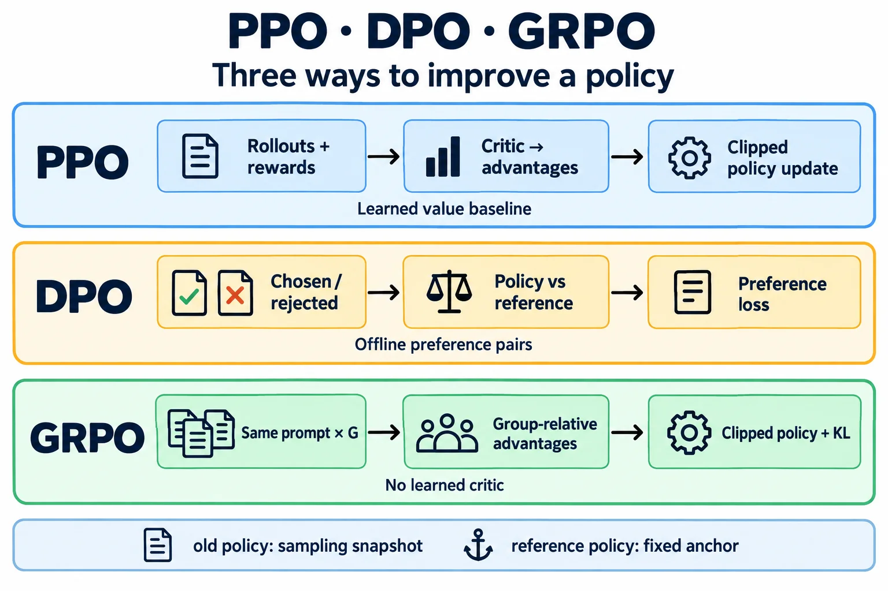
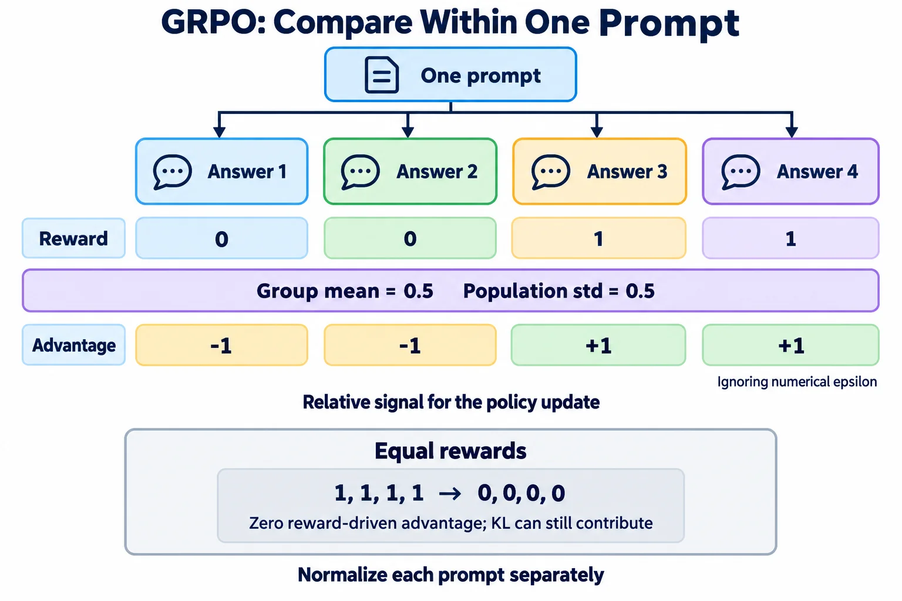
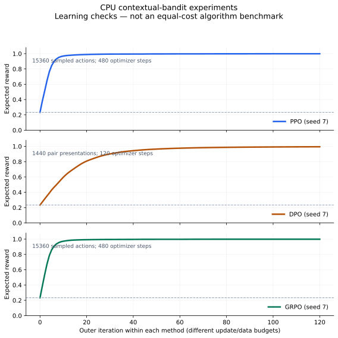

**PPO 用交互得到的优势更新策略；DPO 用偏好对直接更新策略；GRPO 用同题多次采样的相对奖励构造优势。** 三者共享概率模型与梯度下降，但数据从哪里来、比较谁、如何控制更新幅度并不相同。

本文把“原子算法”理解为能单独解释、计算和测试的基础模块：log-probability、REINFORCE、baseline、TD/GAE、重要性采样、KL、clipping、Bradley–Terry 偏好模型。先拆解，再组装训练循环。PPO 以原始 **PPO-Clip** 为主，DPO 以原始 sigmoid 目标为主，GRPO 以 DeepSeekMath 的 outcome-supervision 版本为主；后来的变体单独讨论。

附带的实验在 CPU 上真实执行采样、反向传播和优化器更新。为让读者能逐项核对，它使用**四个上下文、三个动作的一步任务**，不下载语言模型，也不依赖 Gym。另附一个**两步决策树 PPO 实验**，实际调用 GAE 传递延迟奖励，以及一个**变长 token 目标实验**，核对回答概率、EOS/PAD 和归约。三层实验分别检查更新机制、时间边界和序列边界。

| 阅读目标 | 建议入口 | 要验证什么 |
| --- | --- | --- |
| 先跑起来 | [第 1 节](#run) | 参数确实更新，结果可重复 |
| 理解基础公式 | [第 2～3 节](#notation) | 区分奖励、价值、优势与概率比 |
| 对比三种方法 | [PPO](#ppo)、[DPO](#dpo)、[GRPO](#grpo) | 数据流、目标与梯度 |
| 验证多步 PPO | [两步决策树](#ppo-chain) | 终点奖励传向前面的决策，不跨回合串联 |
| 迁移到 LLM | [第 7 节](#llm)、[token 实验](#token-lab) | token 对齐、mask、采样与奖励协议 |
| 排错与继续研究 | [验收](#diagnostics)、[扩展](#extensions) | 用证据判断失败发生在哪一层 |
| 接入机器人控制 | [MPC 与 WBC](#mpc-wbc) | 区分策略训练、预测规划与当前拍执行 |



读图时先沿每一行看数据怎样变成更新信号：PPO 的 critic 提供价值 baseline，DPO 比较 chosen/rejected 相对 reference 的概率间隔，GRPO 比较同题回答的奖励。底部的 old 是采样快照，reference 是固定参照；具体目标中的 KL 和 clipping 位置见后文公式。

## 1. 先运行完整实验 {#run}

下载并完整解压 [实验代码包](rl-lab.zip)，包内的 [README.txt](README.txt) 包含离线使用说明、预期结果和排错步骤。也可把以下源码文件保存到同一个目录：

| 文件 | 用途 |
| --- | --- |
| [rl_lab.py](rl_lab.py) | 原子函数与 PPO/DPO/GRPO 一步训练循环 |
| [ppo_chain.py](ppo_chain.py) | 两步决策树 PPO：完整轨迹、GAE 与价值回归 |
| [token_objectives.py](token_objectives.py) | 变长回答、EOS/PAD、DPO/GRPO 序列目标与一次更新 |
| [test_rl_lab.py](test_rl_lab.py) | 梯度方向、GAE、mask、重现性与训练测试 |
| [requirements.txt](requirements.txt) | 核心依赖：PyTorch 2.8.0 |
| [plot_results.py](plot_results.py) | 从 CSV 绘图，单独依赖 Matplotlib |
| [参考结果](assets/reference-results.json) | 本文运行环境、配置及三种方法的首末指标 |

以下命令在上述文件所在目录执行。本次验证使用 Python 3.10、PyTorch 2.8.0，计算设备显式为 CPU；Python 3.10/3.11 可作为环境起点。

```bash
python3 -m venv .venv
source .venv/bin/activate
python -m pip install --upgrade pip
python -m pip install -r requirements.txt --index-url https://download.pytorch.org/whl/cpu

# 单独观察基础模块的数值
python -B rl_lab.py --algorithm atoms

# 分别执行三种训练，默认 seed=7、120 个外层迭代
python -B rl_lab.py --algorithm all --output results

# 两步延迟奖励实验，实际调用 GAE
python -B ppo_chain.py --output results-chain

# token 对齐、变长归约与一次梯度更新
python -B token_objectives.py --output results-tokens.json

# 原子模块、序列目标与三个 seed 的训练检查
python -B -m unittest -v test_rl_lab.py
```

测试应以 `Ran 19 tests` 和 `OK` 结束；其中一步训练与两步 PPO 均检查 seed 0、7、19。若只想检查命令入口，训练命令可加 `--steps 3`；三轮结果不能用于判断收敛。

安装完成后，这些运行命令不需要网络。只测试某种方法时，可使用 `--algorithm ppo`、`dpo` 或 `grpo`；`--group-size` 改变 GRPO 的同题采样数，`--grpo-prompts` 改变每轮 prompt 组数（默认 16）；二者乘积才是每轮采样动作数。

训练输出 `ppo/dpo/grpo.csv` 与对应 JSON。CSV 记录每个外层迭代的指标；JSON 保存配置、奖励表、软件版本及首末指标。输出目录同名文件会被覆盖，改变 seed 时应换目录：

```bash
python -B rl_lab.py --algorithm grpo --seed 19 --group-size 4 --output results-seed19-g4
```

一步任务的核心结果不是“打印一个 loss”，而是检查最优动作概率是否从初始的 $1/3$ 上升。两步任务检查 `expected_return` 和轨迹中的优势，token 案例检查 mask、loss 与梯度；三者应按各自标准验收。有限任务使用可训练 logits 表，没有神经网络泛化难题，因此通过它们只说明相应计算链条工作正常。

## 2. 统一符号：先区分三个策略、两类模型 {#notation}

| 符号 | 含义 | 何时变化 |
| --- | --- | --- |
| $\pi_\theta$ | 当前待训练策略 | 每次 optimizer step |
| $\pi_{\mathrm{old}}$ | 产生当前 rollout 的行为策略 | 下轮采样时更新快照 |
| $\pi_{\mathrm{ref}}$ | 参考策略，约束偏离的起点 | 本文实验始终固定 |
| $r$ / $R$ | 单步奖励 / 回答级评分 | 由环境、规则或奖励模型给出 |
| $V_\phi(s)$ | 状态的预期回报，critic | PPO 中回归更新 |
| $\hat A$ | 相对 baseline 的优势估计 | 由当前批次计算后固定 |

**old 与 ref 解决的是两个问题。** old 回答“这些样本由谁产生”，ref 回答“希望保留哪个策略的行为”。把二者都每个梯度步刷新，会同时破坏概率比和参考约束。

Reward model 与 critic 也不同：前者评价动作或回答的质量，后者预测某状态之后的预期回报。GRPO 去掉的是学习得到的 critic，不代表所有 GRPO 任务都能去掉奖励模型；只有奖励能由规则可靠计算时，才可以用规则替代它。

### 2.1 环境动作与语言 token 怎样对应

多步环境中，策略看到 $s_t$，采样 $a_t$，环境产生 $r_t,s_{t+1}$。语言模型中，可以把 prompt 与已生成前缀视为状态，把下一个 token 视为动作：

$$
s_t=(x,y_{<t}),\qquad a_t=y_t.
$$

一段回答的对数概率是条件 log-probability 的**和**：

$$
\log\pi_\theta(y\mid x)
=\sum_{t=1}^{T}\log\pi_\theta(y_t\mid x,y_{<t}).
$$

下面的一步实验把整个候选回答压缩为一个离散动作，所以序列级与 token 级目标在该实验里没有长度差异。真实文本中的长度归一化、EOS 和 padding 问题将在第 7 节单独展开。

### 2.2 SFT、奖励学习、策略优化处在不同位置

| 阶段 | 训练样本 | 典型目标 |
| --- | --- | --- |
| SFT | prompt 与示范答案 | 增大示范答案的条件概率 |
| Reward modeling | 同题 chosen/rejected | 学习相对质量评分 |
| PPO / GRPO | 当前策略采样与评分 | 提高有利行为的概率 |
| DPO | 已有同题偏好对 | 相对参考策略扩大偏好间隔 |

DPO 可以省掉“先训练一个显式奖励模型、再做在线 RL”的路径；它仍需要偏好数据，数据收集本身可能涉及模型采样与人工判断。PPO 和 GRPO 也不专属于 RLHF：奖励来源不同，可以是人类偏好、可验证答案或真实环境回报。

## 3. 原子模块：从概率到可用梯度 {#atoms}

### 3.1 Log-softmax 与 REINFORCE

离散策略以 logits $z_a$ 表示：

$$
\pi_\theta(a\mid s)=\frac{\exp z_a}{\sum_b\exp z_b}.
$$

计算时使用 `log_softmax`，避免先 softmax 再 log 的数值损失。若轨迹 $\tau$ 的回报为 $R(\tau)$，对数导数技巧给出策略梯度：

$$
\nabla_\theta J
=\mathbb E_{\tau\sim\pi_\theta}
\left[R(\tau)\nabla_\theta\log p_\theta(\tau)\right].
$$

环境转移不依赖策略参数时，轨迹对数概率中的可训练部分来自动作概率。只使用动作之后的 reward-to-go 可以避免把过去奖励重复当作当前动作的学习信号。这里不要求对采样操作或奖励函数求导。[策略梯度推导](https://spinningup.openai.com/en/latest/spinningup/rl_intro3.html)

```python
# logp 来自当前策略；returns 是采样后得到、停止梯度的回报
loss = -(logp * returns.detach()).mean()
```

正回报提升已采样动作的概率，但回报的绝对零点会影响梯度方差，baseline 正是为此引入。

### 3.2 Baseline 与 advantage：奖励高不等于动作有优势

对于与当前采样动作无关的状态 baseline $b(s)$：

$$
\mathbb E_{a\sim\pi_\theta}
[b(s)\nabla_\theta\log\pi_\theta(a\mid s)]=0.
$$

所以可以把回报换成 $R-b(s)$，不改变相应策略梯度的期望。常用 $b(s)=V_\phi(s)$：

$$
A^\pi(s,a)=Q^\pi(s,a)-V^\pi(s).
$$

例如某状态通常能拿到 8 分，某动作得到 6 分，即使绝对分数为正，其相对优势仍是 −2；另一个困难状态通常 1 分，得到 3 分则优势为 +2。

```python
advantage = returns - old_values
policy_loss = -(logp * advantage.detach()).mean()
value_loss = (current_values - returns.detach()).square().mean()
```

PPO 的 actor 更新不应通过 advantage 反向训练 critic。critic 通过自己的回归目标学习，actor 通过动作概率学习；共享骨干时，两种 loss 仍可能共同更新共享参数。

### 3.3 TD residual、GAE 与时间边界

单步 TD residual 为：

$$
\delta_t=r_t+\gamma b_t V(s_{t+1})-V(s_t),
$$

其中 $b_t=0$ 表示真正终止，不再 bootstrap。GAE 用递推混合多步 residual：

$$
\hat A_t=\delta_t+\gamma\lambda c_t\hat A_{t+1}.
$$

$c_t$ 控制是否继续跨时间递推。$\lambda=0$ 得到一步 TD；$\lambda=1$ 在正确终止/截断处理下累积全部可用 residual。它控制偏差与方差的权衡，不是“越大越准确”的单向开关。[GAE 原论文](https://arxiv.org/abs/1506.02438)

**bootstrap 与递推边界不能始终共用一个 done。**

| 情况 | 是否 bootstrap 下一状态价值 | 是否跨到下一个 episode 递推 |
| --- | --- | --- |
| 环境真正终止 | 否 | 否 |
| 外部时间上限截断 | 通常是 | 否 |
| rollout 缓冲区在中途收满 | 是 | 当前缓冲区在此结束 |
| 普通连续转移 | 是 | 是 |

时间上限截断时，应取截断前 final observation 的价值，不能误取自动 reset 后初始状态的价值。若有限时域本身就是任务定义的一部分，则要按真正的任务终止语义处理。[Gymnasium 时间边界说明](https://gymnasium.farama.org/tutorials/gymnasium_basics/handling_time_limits/)

附带 `gae` 用 `terminated` 控制 bootstrap，用 `boundary` 控制递推。一个终点奖励为 1、$\gamma=\lambda=1$、所有旧价值为 0 的三步例子：

```python
import torch
from rl_lab import gae

rewards = torch.tensor([0., 0., 1.], dtype=torch.float64)
values = torch.zeros_like(rewards)
terminated = torch.tensor([False, False, True])
advantages, returns = gae(
    rewards, values, values, terminated, terminated,
    gamma=1.0, lam=1.0,
)
print(advantages.tolist())  # [1.0, 1.0, 1.0]
```

这说明终点奖励可以沿时间回传到此前动作。测试还覆盖截断 bootstrap 与 episode 之间的隔离。

### 3.4 重要性比：为什么必须保存 old log-probability

在同一个状态与动作上：

$$
\rho_t(\theta)=
\frac{\pi_\theta(a_t\mid s_t)}
{\pi_{\mathrm{old}}(a_t\mid s_t)}
=\exp(\log\pi_\theta-\log\pi_{\mathrm{old}}).
$$

同批数据的多轮优化中，分母必须固定。否则每次用当前策略同时算分子分母，会让比率恒等于 1，失去对相对变化的度量。

完整轨迹重要性采样还涉及轨迹分布；PPO 的 token/动作级 surrogate 不应被表述成对任意陈旧离线数据都严格无偏。行为策略与当前策略越远，数据重用越需要谨慎。

### 3.5 三种 clipping，含义完全不同

| 操作 | 作用对象 | 示例 |
| --- | --- | --- |
| PPO ratio clipping | surrogate 中的概率比 | 限制继续朝有利方向变化的激励 |
| Gradient clipping | 参数梯度范数 | `clip_grad_norm_(parameters, 1.0)` |
| Reward clipping | 奖励数值 | 改变奖励尺度，可能改变目标 |

PPO-Clip 并不会执行“更新完后把每个概率比强制拉回区间”。共享参数、其他样本梯度、价值损失与优化器动量，都可能使比率越界；因此仍需监测 KL 和 clip fraction。

### 3.6 KL：方向、采样分布与梯度分别核对

离散动作空间中的正向 KL 为：

$$
D_{\mathrm{KL}}(\pi_\theta\Vert\pi_{\mathrm{ref}})
=\sum_a\pi_\theta(a)\left(\log\pi_\theta(a)-\log\pi_{\mathrm{ref}}(a)\right).
$$

本文只有三个动作，`categorical_kl` 可以直接求和并通过当前概率反向传播。语言模型词表较大时，经常使用采样估计，但必须写清方向与采样分布。

令 $\ell=\log\pi_{\mathrm{ref}}(a)-\log\pi_\theta(a)$，GRPO 论文使用的单样本表达式是：

$$
k_3=\exp(\ell)-\ell-1\geq0.
$$

当 $a\sim\pi_\theta$ 且支持集满足要求时，其期望等于上述正向 KL。若样本来自固定的 $\pi_{\mathrm{old}}$，这个等式不能不加条件地沿用；离散采样的期望与对固定样本直接求导，也不是同一个操作。本文训练实验使用**精确分类 KL**，没有把该采样表达式冒充精确 KL 梯度。[DeepSeekMath 的 KL 项](https://arxiv.org/html/2402.03300v3#S4.SS1.SSS1)

## 4. PPO：用 critic 与受限 surrogate 迭代改进 {#ppo}

### 4.1 从 vanilla policy gradient 到 PPO-Clip

固定一个 rollout 的 advantage 后，PPO-Clip 的最大化目标是：

$$
\begin{aligned}
q_t&=\operatorname{clip}(\rho_t,1-\epsilon,1+\epsilon),\\
J_{\mathrm{clip}}&=\mathbb E_t
[\min(\rho_t\hat A_t,q_t\hat A_t)].
\end{aligned}
$$

通常用梯度下降实现其负值，并加 value regression 与可选 entropy bonus：

$$
L=-J_{\mathrm{clip}}+c_vL_V-c_hH(\pi_\theta).
$$

PPO 是方法族，原论文也讨论 KL-penalty 版本；此处展开最常用的 clipped surrogate，不把 clip 当成严格 trust-region 约束。[PPO 原论文](https://arxiv.org/abs/1707.06347)、[PPO-Clip 实现说明](https://spinningup.openai.com/en/latest/algorithms/ppo.html)

### 4.2 四个数值看清正负优势

设 $\epsilon=0.2$：

| $\rho$ | $\hat A$ | 未 clip 项 | clip 后项 | 取 min |
| ---: | ---: | ---: | ---: | ---: |
| 1.5 | +1 | 1.5 | 1.2 | 1.2 |
| 0.5 | −1 | −0.5 | −0.8 | −0.8 |
| 1.5 | −1 | −1.5 | −1.2 | −1.5 |
| 0.5 | +1 | 0.5 | 0.8 | 0.5 |

前两行已经朝有利方向变化过多，目标进入平坦区域；后两行属于不利变化，继续保留纠正信号。**必须先乘 advantage 再比较两项**，负优势时把顺序写反会改变目标。

不仅比较数值，还可以验证对 log-probability 的导数：

```python
import torch
from rl_lab import clipped_policy_loss

logp = torch.tensor([1.5, .5, 1.5, .5], dtype=torch.float64).log()
logp.requires_grad_()
advantages = torch.tensor([1., -1., -1., 1.], dtype=torch.float64)
loss = clipped_policy_loss(logp, torch.zeros_like(logp), advantages)
loss.sum().backward()
print(logp.grad.tolist())  # [0.0, 0.0, 1.5, -0.5]，浮点末位可能略有差异
```

这是**最小化 loss** 的梯度，故第三项为正意味着梯度下降会降低这个负优势动作的 log-probability。

### 4.3 完整的一轮训练顺序

1. 复制行为策略快照，采样新 rollout，保存 actions、old logps、旧价值、奖励和终止信息。
2. 计算 GAE 与 value targets，将它们停止梯度。
3. 对同一批数据执行若干 epoch；当前策略重新计算 logps，old 数据保持不变。
4. 计算策略损失与 value loss；反向、梯度裁剪、optimizer step。
5. 监测相对 old 的 KL，必要时提前结束该批更新，再采集新数据。

本文一步任务的终止回报为：

$$
R_{\mathrm{shaped}}=
R-\beta_{\mathrm{KL}}
(\log\pi_{\mathrm{old}}(a\mid x)-\log\pi_{\mathrm{ref}}(a\mid x)).
$$

随后 $\hat A=R_{\mathrm{shaped}}-V_{\mathrm{old}}(x)$。它是 LLM RLHF 中 KL reward shaping 的一个小型对应；不使用多步 GAE 是因为每个 episode 只有一步，而不是 PPO 无需处理时间。

在 `train("ppo")` 中，128 个上下文动作样本用于一次 rollout，最多更新 4 次；相对 old 的精确 KL 超过 0.05 时停止后续更新。这个阈值只能阻止进一步漂移，不能撤销已经完成的一步。实验不额外添加 entropy bonus，也没有 value clipping。

### 4.4 PPO 里最容易混淆的两个 KL

- **当前策略相对 old 的 KL**：监测本批数据上的更新幅度，控制是否继续使用这批 rollout。
- **当前策略相对 ref 的 KL**：限制相对训练起点的长期偏移。

前者小，不代表后者小：每轮只走一小步，经过很多轮仍可能离起点很远。日志里应分开保存，而不是只有一个名叫 `kl` 的字段。

### 4.5 两步实验：第一步没有奖励，为什么还能学会选路 {#ppo-chain}

一步任务可以验证 loss，却无法检验跨时间的信用分配。[ppo_chain.py](ppo_chain.py) 增加一个两步决策树：从状态 0 出发，动作 0 进入状态 1，动作 1 进入状态 2；第一步奖励始终为 0。第二步动作决定终点奖励，随后结束回合。

| 完整路线 | 第一步奖励 | 第二步奖励 | 总回报 |
| --- | ---: | ---: | ---: |
| 状态 0 → 状态 1 → 动作 0 | 0 | 1 | 1 |
| 状态 0 → 状态 1 → 动作 1 | 0 | 0 | 0 |
| 状态 0 → 状态 2 → 动作 0 | 0 | 0 | 0 |
| 状态 0 → 状态 2 → 动作 1 | 0 | 0.2 | 0.2 |

策略是一张 `3×2` logits 表，critic 为三个状态各预测一个标量。每轮采集 64 个完整回合，按“回合 0 的两步、回合 1 的两步……”排列 128 条 transition，再调用第 3 节的 `gae`。**不能先堆完所有回合的第一步，再堆第二步**，否则一维反向递推会串到别的回合。

取 $\gamma=1,\lambda=0.95$，初始 critic 全为零。对获得终点奖励 1 的回合，手算为：

$$
\delta_1=1,\qquad \delta_0=0,\qquad
\hat A_1=1,\qquad \hat A_0=0+1\times0.95\times1=0.95.
$$

第一步虽然没有即时奖励，仍获得正优势。`returns = advantages + old_values` 得到供 critic 回归的 **GAE λ-return**；当 λ 小于 1 时，它不必等于整条轨迹的 Monte Carlo 回报。采样、旧价值、优势与 targets 均停止梯度，在同一批的更新期间保持固定。

```bash
python -B ppo_chain.py --seed 7 --gae-lambda 0.95 --output results-chain

# 控制变量：只改变 lambda，输出到不同目录
python -B ppo_chain.py --seed 7 --gae-lambda 0 --output results-chain-lambda0
python -B ppo_chain.py --seed 7 --gae-lambda 1 --output results-chain-lambda1
```

JSON 的 `first_rollout_trace` 保存第一批前四个完整回合，可以逐项检查状态、动作、奖励、旧价值、边界、优势和 λ-return。λ=0 时，**第一批**中起点优势为零；critic 学到后续价值后，起点仍可通过 TD bootstrap 获得信号，所以不能把“λ=0 永远无法学习”作为验收条件。

训练仍使用 clip=0.2、Adam 学习率 0.08、每批最多 4 次更新，value loss 权重 0.5。这里没有 reference KL、entropy bonus、优势标准化或 value clipping；old→current KL 只用于提前停止后续更新。KL 对 rollout 中出现的状态取平均，对两个动作精确求和。该简化循环对应 [PPO-Clip 的采样、优势估计和价值回归步骤](https://spinningup.openai.com/en/latest/algorithms/ppo.html#pseudocode)，不是论文训练配置的复现。

评估枚举全部四条路线，计算从起点出发的期望总回报：

$$
J=\pi(0\mid0)\pi(0\mid1)
+0.2\,\pi(1\mid0)\pi(1\mid2).
$$

初始均匀策略的 $J=0.3$，理论最优值为 1。本地 seed=7、120 轮的结果为 **0.9996**，起点选择状态 1 的概率约 **0.9997**；原始 [CSV](assets/ppo-chain.csv) 和 [JSON](assets/ppo-chain.json) 包含配置、采样成本与首批轨迹。这是与第 8 节一步任务不同的环境，回报不能放进同一排行榜。

`value_start` 是学习得到的价值估计，可能暂时略高于 1；`expected_return` 才是由当前策略精确计算的行为指标。所有 CSV 指标均在本轮更新后记录，`step=0` 为初始评估。测试检查三个 seed 下的学习趋势，同时验证奖励不跨回合传播。

这个环境每回合都真实终止，因此 `terminated` 与 `boundary` 在第二步同时为真。外部时间截断的情形仍由第 3.3 节及独立测试覆盖；接入 Gymnasium 时应保留 [final observation 的 bootstrap 与 reset 边界区分](https://gymnasium.farama.org/tutorials/gymnasium_basics/handling_time_limits/)。

## 5. DPO：把偏好建模代入 KL 正则化最优策略 {#dpo}

### 5.1 先建立 Bradley–Terry 偏好概率

对于同一 prompt 的较优答案 $y_w$ 与较差答案 $y_l$，用奖励差表达偏好：

$$
P(y_w\succ y_l\mid x)
=\sigma(r(x,y_w)-r(x,y_l)).
$$

这个模型表达相对偏好，不保证 $y_w$ 绝对正确。“两个错误答案里较好的一个”仍然可能得到 chosen 标签。

### 5.2 从奖励目标得到策略形式

对每个 prompt 考虑：

$$
\max_\pi\;
\mathbb E_{y\sim\pi}[r(x,y)]
-\beta D_{\mathrm{KL}}(\pi\Vert\pi_{\mathrm{ref}}).
$$

加入概率和为 1 的约束，对各个 $\pi(y\mid x)$ 求导，可得到：

$$
\pi^*(y\mid x)
=\frac{\pi_{\mathrm{ref}}(y\mid x)\exp(r(x,y)/\beta)}{Z(x)}.
$$

反过来表达奖励：

$$
r(x,y)=
\beta\log\frac{\pi^*(y\mid x)}{\pi_{\mathrm{ref}}(y\mid x)}
+\beta\log Z(x).
$$

同题两个回答相减时，$Z(x)$ 消失。以可训练的 $\pi_\theta$ 代替目标策略，便得到 DPO 的偏好分类损失。这一步是理论上的重参数化关系，不等于有限数据和有限容量下必然找到真实奖励的最优策略。[DPO 原论文，第 4 节](https://arxiv.org/html/2305.18290v3)

### 5.3 DPO loss 与一次梯度更新

定义相对参考策略的偏好间隔：

$$
\begin{aligned}
\Delta_\theta
&=\log\pi_\theta(y_w\mid x)-\log\pi_\theta(y_l\mid x),\\
\Delta_{\mathrm{ref}}
&=\log\pi_{\mathrm{ref}}(y_w\mid x)-\log\pi_{\mathrm{ref}}(y_l\mid x),\\
L_{\mathrm{DPO}}
&=-\log\sigma(\beta(\Delta_\theta-\Delta_{\mathrm{ref}})).
\end{aligned}
$$

用 `-F.logsigmoid(...)` 实现，避免不稳定的 `-log(sigmoid(...))`。当当前策略等于参考策略时，loss 为 $\log2\approx0.6931$，但梯度不为零。

```python
import torch
from rl_lab import dpo_loss

chosen = torch.tensor([-2.], dtype=torch.float64, requires_grad=True)
rejected = torch.tensor([-2.], dtype=torch.float64, requires_grad=True)
reference = torch.tensor([-2.], dtype=torch.float64)
loss = dpo_loss(chosen, rejected, reference, reference, beta=.5).mean()
loss.backward()
print(round(loss.item(), 4))  # 0.6931
print(chosen.grad.item(), rejected.grad.item())  # -0.25 0.25
```

这只是把两项 log-probability 当成独立变量来检查方向。真实 softmax 模型中，概率受归一化与共享参数耦合影响；偏好间隔变大，不保证 chosen 的绝对概率单调上升。

### 5.4 为什么 β 不能只按“力度旋钮”理解

理论上，固定奖励目标中的较大 β 更强调贴近参考策略。可是在有限偏好数据的 DPO loss 中，β 同时改变 sigmoid 输入与梯度尺度。因此不能承诺“把 β 调大，实测 KL 一定减小”，应结合数据、学习率、训练步数与参考模型共同验证。

原始 DPO 使用**回答 token log-probability 求和**。改成平均相当于改变偏好模型中的分数，不能仍称为完全相同的原始目标。后续算法会有不同的长度处理，应显式命名。

### 5.5 实验怎样构造离线偏好

本文固定奖励表中，每个上下文有三个候选动作，按奖励大小构造三对偏好，共 12 对。`train("dpo")` 重复使用这份离线数据，每轮做一次 full-batch 更新；reference 的 pair logps 可以预先缓存。

它没有在线采样、critic 或额外 reward model，也没有显式添加第二个 KL loss。默认偏好完整且无噪声，训练很容易记住动作排序；这正适合验算更新方向，却不能说明对新 prompt 的泛化。第 10.3 节提供[偏好翻转对照](#dpo-noise)，可以只改变训练标签，检查 loss 与真实奖励怎样分离。

## 6. GRPO：同题多次采样，构造组内相对优势 {#grpo}

### 6.1 从 critic baseline 切换为 group baseline

对同一个问题 $x$，从 $\pi_{\mathrm{old}}$ 独立采样 $G$ 个回答，得到奖励 $R_1,\ldots,R_G$。本文采用总体标准差：

$$
\begin{aligned}
\bar R&=\frac1G\sum_iR_i,\\
\sigma_R&=\sqrt{\frac1G\sum_i(R_i-\bar R)^2},\\
\hat A_i&=\frac{R_i-\bar R}{\sigma_R+\varepsilon_{\mathrm{num}}}.
\end{aligned}
$$

这里 $\varepsilon_{\mathrm{num}}$ 是数值稳定项，与 PPO clip 宽度 $\epsilon$ 无关。不能跨不同 prompt 把全部奖励合成一个 group；问题难度不同，混合会改变比较基准。

```python
import torch
from rl_lab import group_advantages

rewards = torch.tensor([[0., 0., 1., 1.], [5., 5., 5., 5.]], dtype=torch.float64)
print(group_advantages(rewards))
# 第一组约为 [-1, -1, 1, 1]；第二组为全零。
```

组均值包含样本自身，且除以随机标准差，所以它不等于第 3.2 节中与当前动作独立的状态 baseline。应把它看作组相对学习规则，而不是直接套用“baseline 不引入偏差”的证明。



图中的 `0, 0, 1, 1` 对应上方代码的第一行。第二个例子使用全 1 奖励，代码使用全 5；减去各自均值后都为零。优势的正负是相对于**本组平均奖励**而言，不能直接解释成回答绝对正确或错误。

### 6.2 原始 outcome GRPO 的 token 目标

为每个回答 token 定义：

$$
\rho_{i,t}=
\frac{\pi_\theta(y_{i,t}\mid x,y_{i,<t})}
{\pi_{\mathrm{old}}(y_{i,t}\mid x,y_{i,<t})}.
$$

单个 prompt 的目标可紧凑地写为：

$$
\begin{aligned}
S_{i,t}
&=\min\left(\rho_{i,t}\hat A_i,
\operatorname{clip}(\rho_{i,t},1-\epsilon,1+\epsilon)\hat A_i\right),\\
J_{\mathrm{GRPO}}
&=\frac1G\sum_i\frac1{T_i}
\sum_{t=1}^{T_i}(S_{i,t}-\beta k_{i,t}).
\end{aligned}
$$

Outcome supervision 将回答级优势赋给该回答的所有有效 token；这不意味着它已经识别出具体哪一步推理造成成功或失败。原始目标先对每条回答按长度平均，再对回答平均。[DeepSeekMath 的 GRPO 目标](https://arxiv.org/html/2402.03300v3#S4.SS1)

在本文一步实验中 $T_i=1$，每组采样 8 个动作，直接使用同一个 `clipped_policy_loss`，再加精确分类 KL。没有 critic 或 value loss；reward 来自固定表，也无需训练奖励模型。

### 6.3 全对、全错与没有梯度

如果同组二值奖励全为 0 或全为 1，则所有 $\hat A_i=0$。此时奖励驱动的 surrogate 梯度为零；如果保留 KL loss，它仍可能更新参数。

这个现象还需要与另一个情况区分：混合奖励组的优势均值为零，在 $\rho=1$ 时平均 surrogate 的**数值**也可能为零，但对策略 log-probability 的梯度仍可能非零。不能看到 loss 接近 0 就认定训练停止。

日志里的 `zero_group_fraction` 统计无组内奖励差异的比例。**高零方差比例不必然意味着失败**：全错和全对都产生零优势，必须一起查看实际奖励。对于独立采样、成功概率为 p 的二值奖励，一组 G 个回答全同的概率为：

$$
P(\text{零方差})=p^G+(1-p)^G.
$$

例如 p=0.99、G=8 时，该概率仍约为 0.9227，多数来自全对组。若奖励也很低，再检查难度、采样多样性和评分粒度；如果奖励已接近最优，大量等值组可以是合理现象。

本文三个动作的奖励彼此不同。若动作概率为 $p_1,p_2,p_3$，零方差要求 G 次都采到同一动作，所以概率为 $\sum_a p_a^G$。初始均匀策略下等于 $3^{1-G}$：G=2 时为 1/3，G=8 时约为 0.000457。策略逐渐集中后，该概率又会上升。以上是给定同一 prompt 分布、独立采样下的概率推导，不是观测到的每批比例必然等于该值。

### 6.4 去掉 critic 后仍有哪些成本

一个 batch 有 $B$ 个 prompt，每题采样 G 个回答，平均回答长度 T，则至少涉及约 $BGT$ 个生成 token。old logps、reference 计算、奖励验证、长回答 KV 与反向激活仍需资源。

对于数学或代码任务，验证器也可能成为瓶颈。降低模型状态显存，不保证端到端训练更快；应记录有效回答 token/s、奖励计算时间、失败/超时比例和每次更新使用的真实样本量。

### 6.5 固定动作预算，再比较 group size {#grpo-budget}

默认每轮 16 个 prompt 组，若只把 G 从 8 改为 16，采样量就从 128 增至 256。为区分分组方式与样本数量，可以同时调节组数 B，使 $B\times G=128$：

```bash
for g in 2 4 8 16; do
  python -B rl_lab.py --algorithm grpo --seed 7 --steps 120 \
    --group-size "$g" --grpo-prompts "$((128 / g))" \
    --output "results-grpo-g$g"
done
```

这里 B 表示 prompt **抽样组数**，不是互不重复的问题数；小环境始终只有四个上下文，按均匀分布有放回抽样。日志配置中的 `online_batch_prompts` 保存 B，`group_size` 保存 G。

本地 seed=7、120 轮的实际结果：

| G | 每轮组数 B | 最终期望奖励 | 全程平均零方差组比例 |
| ---: | ---: | ---: | ---: |
| 2 | 64 | 0.998333 | 0.961458 |
| 4 | 32 | 0.999099 | 0.939063 |
| 8 | 16 | 0.998825 | 0.921875 |
| 16 | 8 | 0.999380 | 0.891667 |

四组都采样 15360 个动作，这次运行也都执行 480 次 optimizer step。平均零方差比例取第 1～120 轮的 `zero_group_fraction` 算术平均，排除初始占位行；由于各运行内 B 固定，它也等于该运行全部采样组中的零方差组占比。完整记录见 [CSV](assets/grpo-budget.csv) 与[配置和指标 JSON](assets/grpo-budget-results.json)。

这些高零方差比例与接近最优的奖励同时出现，说明不能只凭这个指标判定训练失败。四种 G 的结果也未呈严格单调顺序，不应按末位小数选“最佳 G”。

**固定动作数只控制了一种预算。** G 增大时，同题比较更充分，但每轮独立抽取的 prompt 组数减少，优势估计和上下文覆盖随之变化。真实 LLM 还涉及回答长度、生成耗时、KV cache 和有效 token 数；相同动作数不代表相同 FLOPs、时间或显存。这里只验证控制变量的方法，不给出通用的 G 推荐值。

## 7. 迁移到语言模型：最容易写错的是数据轴 {#llm}

### 7.1 先做 causal shift，再选择 response mask

设 logits 形状为 `[B,T,V]`。位置 t 的 logits 预测位置 t+1 的 token；所以应该用：

```python
logp = logits[:, :-1].log_softmax(dim=-1)
targets = input_ids[:, 1:]
token_logp = logp.gather(-1, targets.unsqueeze(-1)).squeeze(-1)
valid = response_mask[:, 1:]
sequence_logp = token_logp.masked_fill(~valid, 0).sum(dim=-1)
```

以上变量由模型前向和 tokenizer 提供；附带 `response_token_logps` 返回 `[B,T-1]` 的已 mask 分数和有效位置，`response_logps` 再按序列求和。两者共用同一套形状与边界校验。response mask 表示**目标 token** 是否属于回答；prompt 为 False，padding 为 False，有效 EOS 通常为 True。

例如 `[prompt0,prompt1,answer,EOS,PAD]` 的 mask 为 `[0,0,1,1,0]`。评分位置是 logits 的 1、2 两行，不能再向右错移一位。使用 EOS 兼作 padding token 时，更不能用 `token_id != eos_id` 构造 mask，否则会删掉真正的终止 token。

### 7.2 Attention mask 与 loss mask 分开

Attention mask 决定模型读取哪些上下文；response/loss mask 决定哪些位置计入训练目标。prompt 不计算直接 loss，仍必须作为回答的条件输入。

拼接 chosen/rejected 时，应确保两者对应完全相同的 prompt 和预处理协议；Tokenizer 在字符串拼接边界的行为也要核对，不能随意把单独编码的 prompt 长度当成最终边界。使用 chat template 时尤其要保留角色分隔和结束标记。[TRL 偏好数据与模板说明](https://huggingface.co/docs/trl/dpo_trainer)

### 7.3 每个序列等权与每个 token 等权不同

两条回答分别有 10、100 个有效 token：

- 先各自 mean，再取回答 mean：两条回答各占一半权重。
- 把全部有效 token 求和后除以 110：长回答获得 $100/110$ 的总权重。

原始 DPO 的序列概率求和、原始 outcome GRPO 的每回答 token 平均、某些变体的全局 token 归约不是可互换的小优化。多卡训练还要处理不同 Rank 的有效 token 数，参见[分布式 Loss 分母](../distributed-training-memory/#44-变长文本平均局部均值未必等于全局-token-均值)。

### 7.4 采样设置属于行为策略定义

Temperature、top-k/top-p、EOS、最大生成长度、chat template 都会影响实际采样分布。若 rollout 经过重整化采样，训练却把未调整的概率当成严格行为概率，importance ratio 的假设就发生变化。

生产框架可能使用特定近似或采样修正；必须记录该选择，不能只保存 model ID。Dropout 也会导致同一输入多次重算 logps 不一致；`eval()` 控制模块行为，但**不会关闭梯度**，可在确定性前向下训练参数。`no_grad()` 才会关闭该段 autograd。

### 7.5 奖励协议本身就是算法的一部分

| 奖励来源 | 首先固定 | 典型误判 |
| --- | --- | --- |
| 数学答案 | 提取规则、数值容差、单位与等价表达 | 格式正确被当成数学正确 |
| 代码测试 | 固定测试集、资源限制、超时与隔离执行 | 测试泄漏、只对可见样例过拟合 |
| 人类/模型偏好 | 比较顺序、评分 rubrics、重复标注 | 长度偏好被误当成能力提升 |
| 环境回报 | 成功条件、终止条件、观测协议 | 奖励投机与真实任务脱节 |

保留原始回答、解析结果、奖励分项与失败原因，防止解析器修改掩盖模型失败。训练集与独立评测集应分离；本文的四上下文任务只做闭环验算，不声称具有独立评测意义。

### 7.6 可运行的序列目标：同一个 EOS 编号，两个不同角色 {#token-lab}

[token_objectives.py](token_objectives.py) 用一张可训练的 `5×5` bigram 表预测下一个 token：模型只看上一个 token，五个编号分别表示 BOS、prompt、good、bad、EOS/PAD。它在 CPU 上执行模型前向、两个目标的反向传播和各自一次 SGD 更新，无需下载模型或 tokenizer。

两条固定回答对应相同 prompt，故意采用不同长度：

| 回答 | 完整 token ID | response mask | 计分 token 数 |
| --- | --- | --- | ---: |
| chosen | `[0,1,2,4,4]` | `[0,0,1,1,0]` | 2 |
| rejected | `[0,1,3,3,4]` | `[0,0,1,1,1]` | 3 |

chosen 的倒数第二个 `4` 是真实 EOS，最后一个 `4` 是 PAD；编号相同，是否计分由位置和序列边界决定。如果使用 `mask & (ids != 4)`，两条回答都会漏掉一个有效 EOS。测试会检查这一错误，也会检查追加四个 PAD 后 loss 与**模型参数梯度**均保持不变。

```bash
python -B token_objectives.py --output results-tokens.json
python -B -m unittest -v test_rl_lab.TokenObjectives
```

完整输出见[参考 JSON](assets/token-objectives.json)。全零初始化时，每个 token 的 log-probability 为 $-\log5$，可以手算：

| 检查量 | 初始值 | 为什么 |
| --- | ---: | --- |
| chosen 序列 logp | −3.218876 | 两个有效 token 求和 |
| rejected 序列 logp | −4.828314 | 三个有效 token 求和 |
| 两条回答各自的平均 logp | 均为 −1.609438 | 除以各自有效长度 |
| DPO loss | 0.693147 | 当前与 reference 的序列间隔相同，相减后为零 |
| GRPO 每回答平均的 loss | 约 0 | 概率比为 1，正负组优势抵消 |
| 改为全局 token 平均的 loss | 约 0.2 | 长度 3 的负优势回答获得更高权重 |

GRPO 使用奖励 `[1,0]`，忽略稳定项时组优势为 `[+1,−1]`。每回答平均的 loss 为 $(-1+1)/2=0$；全局 token 平均为 $(-2+3)/5=0.2$。这是**归约方式改变目标**的可核对例子，而不是哪一种 loss 更好看的比较。

两个目标分别从相同初始化出发，用学习率 0.1 做一次更新，DPO 的 loss 从 0.693147 降至约 0.668435；GRPO 初始 loss 虽接近零，参数梯度范数约为 0.414997，更新后 loss 约为 −0.017285。`old`、`reference` 固定且不接收梯度。这里的相对偏好间隔也在增大，但这不构成任意模型与学习率下的单步改进保证。

**这个案例验证序列目标的接线，不是完整 GRPO 训练。** 两条回答是预先写好的测试输入，并非 old policy 的在线采样；没有自回归生成循环、Transformer attention mask 或独立质量评测。GRPO 的 KL 在各个已观察前缀上对五个 token 精确求和，替代原始目标中的采样估计。迁移到真实模型时，仍须补齐第 7.2～7.5 节的数据与采样协议，并分别对照 [DPO 序列目标](https://arxiv.org/html/2305.18290v3#S4) 与 [原始 GRPO 的长度归约](https://arxiv.org/html/2402.03300v3#S4.SS1)。

## 8. 本地实验结果与如何解释 {#results}

三种策略均从全零 logits 开始，即每个动作概率相同。奖励表为：

| 上下文 | 动作 0 | 动作 1 | 动作 2 |
| --- | ---: | ---: | ---: |
| 0 | 1.0 | 0.2 | −0.5 |
| 1 | −0.5 | 1.0 | 0.2 |
| 2 | 0.2 | −0.5 | 1.0 |
| 3 | 1.0 | −0.5 | 0.2 |

初始期望奖励是 $(1+0.2-0.5)/3=0.2333$，理论最大值为 1。评估按四个上下文等权、对全部动作概率精确求和，没有评估采样噪声。

本地 seed=7、120 个外层迭代的参考结果：

| 方法 | 初始期望奖励 | 最终期望奖励 | 最优动作概率 |
| --- | ---: | ---: | ---: |
| PPO | 0.2333 | 0.9989 | 0.9990 |
| DPO | 0.2333 | 0.9950 | 0.9938 |
| GRPO | 0.2333 | 0.9988 | 0.9990 |



图中数据来自本文脚本实际运行，可下载 [PPO CSV](assets/ppo.csv)、[DPO CSV](assets/dpo.csv)、[GRPO CSV](assets/grpo.csv)，并用 [plot_results.py](plot_results.py) 重画。横轴只表示各方法自身的外层迭代，**不是等数据、等 FLOPs 或等时间的公平比较**：

- PPO 每轮采样 128 个动作，训练 actor 与 critic，最多更新 4 次。
- GRPO 每轮采样 `16×8=128` 个动作，无 critic，最多更新 4 次。
- DPO 每轮访问 12 对固定偏好并更新 1 次，没有新增在线采样。
- PPO 使用 sampled KL reward shaping，GRPO 使用直接精确 KL 正则，DPO 使用偏好目标中的 β；这些目标并不完全相同。

`sampled_actions`、`pair_presentations` 与 `optimizer_steps` 已随 CSV 记录。三条曲线用来检查各自有没有学到奖励表，不能用最后几位小数判断真实 LLM 任务应选谁。

读 CSV 时还要区分指标的统计时点和含义：

| 字段 | 本实验的统计口径 |
| --- | --- |
| `expected_reward`、`best_action_probability`、`kl_reference` | 本轮更新后，按完整动作分布精确评估 |
| `loss`、`value_loss` | 本轮最后一次 optimizer step **之前**的训练目标；DPO/GRPO 不训练 critic，`value_loss` 为占位零 |
| `dpo_training_loss`、`dpo_clean_loss` | 仅 DPO 输出：更新后分别在实际训练标签、未翻转标签上计算的偏好 loss；两者都使用相同当前策略与 reference |
| `clip_fraction` | 更新后概率比超出 clip 区间的样本比例；还需结合优势符号，才能判断 surrogate 是否进入平坦分支 |
| `old_policy_kl` | 更新后的 old 到 current 的精确 KL；DPO 无 rollout old policy，对应字段为占位零 |
| `zero_group_fraction` | 当前 GRPO 采样批次中，奖励标准差为零的组比例；其他方法为占位零 |

`step=0` 是更新前的初始评估，`loss`、`value_loss` 和采样/更新计数为占位零；新增两项 DPO 诊断 loss 会真实计算，初始均为 log 2。其余行中，不能把 `loss` 与更新后奖励视为同一参数时点；需要同期对照时使用 `dpo_training_loss`。也不能仅凭 `clip_fraction` 推断有多少样本失去了策略梯度。

自行重画：

```bash
python -m pip install "matplotlib==3.10.6"
python plot_results.py --input results --output training-curves.svg
```

软件版本、平台或 seed 改变时，末位数可能不同；测试检查合理的学习趋势与数值正确性，不要求跨机器逐 bit 重现图中结果。

## 9. 用梯度与行为验收，而不是只看 loss {#diagnostics}

附带测试分别验证：

| 检查 | 应观察到的证据 |
| --- | --- |
| PPO 正负优势与 clipping | 两个平坦区导数为 0，不利变化仍有纠正梯度 |
| DPO 方向 | chosen logp 的 loss 导数为负，rejected 为正 |
| frozen 数据 | old、ref 和 advantage 不获得 actor 的梯度 |
| GAE | 终点奖励向前传播，截断 bootstrap，重置 episode 不串联 |
| response mask | causal shift 正确，增加 padding 不改变序列分数 |
| KL | 同分布为 0，非同分布非负，当前策略可反向传播 |
| 训练 | 三个 seed 下三种方法都提高最优动作概率 |

排查真实训练时，按下表先定位：

| 现象 | 先检查 |
| --- | --- |
| loss 改变但策略概率不动 | optimizer 是否包含 actor；是否错误 detach 当前 logps |
| PPO 一开始 ratio 远离 1 | old 快照、dropout、采样与重算概率、模板是否一致 |
| KL 突然飙升 | 学习率、数据重复轮数、奖励尺度、有效 token 分母 |
| DPO loss 下降但生成退化 | 偏好质量、chosen/rejected 长度、绝对似然与独立评测 |
| GRPO 奖励低且零方差组很多 | 奖励解析、prompt 内分组、难度与采样多样性；先区分全对和全错 |
| 扩卡后训练曲线改变 | global batch、组是否跨 Rank 完整、Loss 分母与同步 |
| 回答越来越长但正确率不变 | 长度奖励、截断规则、token 归约与评测口径 |

PPO 的 value loss、DPO 的偏好分类 loss、GRPO 的 surrogate 不是同一个量，不能跨方法比较谁的 loss 更小。即使同一种方法，也应把 loss 与 reward、KL、entropy、输出长度和失败率一起看。

## 10. 三种方法怎么选，怎样继续拓展 {#extensions}

### 10.1 按数据与反馈条件选起点

| 已有条件 | 可优先尝试 | 需要接受的成本 |
| --- | --- | --- |
| 成对偏好充足，在线评分昂贵 | DPO | 离线覆盖不足、分布偏移与偏好噪声 |
| 有多步环境、需要状态价值与时间信用分配 | PPO | critic 学习、rollout 与更新调度 |
| 同题可多次采样，答案能可靠打分 | GRPO | group rollout、零方差组和奖励验证 |
| 只有示范答案 | 先建立 SFT 基线 | 数据并非自动构成偏好对或 reward |

这不是“新算法淘汰旧算法”的排序。数据覆盖、任务可验证性、模型起点与计算预算会改变结果。

### 10.2 沿原子模块理解后续工作

| 扩展方向 | 改动的模块 | 建议研究问题 |
| --- | --- | --- |
| TRPO | 显式 KL 约束与受限优化 | clip surrogate 与真正约束优化的差别 |
| RLOO | baseline 改为同组其他回答的均值 | 与包含自身的 group mean 有何区别 |
| DAPO | 非对称 clip、动态采样、token 归约、超长处理 | 哪个改动解决探索，哪个改动改变样本权重 |
| Dr. GRPO | 长度与奖励标准化偏差 | 长短回答、难易问题怎样被重新加权 |
| GSPO | token ratio 改为长度归一化的序列 ratio | 长输出与 MoE 下如何降低更新噪声 |
| IPO 等偏好目标 | 偏好损失与正则化形式 | 可分偏好数据是否导致过度拟合 |

这些名称代表具体目标与训练选择，不应只换一个 loss 名字就声称复现。参考 [TRPO](https://arxiv.org/abs/1502.05477)、[RLOO / REINFORCE 风格后训练](https://arxiv.org/abs/2402.14740)、[DAPO](https://arxiv.org/html/2503.14476v2)、[Dr. GRPO 分析](https://arxiv.org/html/2503.20783v1)、[GSPO](https://arxiv.org/html/2507.18071v2)、[IPO](https://arxiv.org/abs/2310.12036)。

RLOO 的一个可直接推导的 baseline 是：

$$
b_{-i}=\frac{\sum_{j\ne i}R_j}{G-1}.
$$

它与包含自身的均值中心化满足
$R_i-b_{-i}=\frac{G}{G-1}(R_i-\bar R)$。
只有在条件独立采样等假设成立时，才能使用其 baseline 独立性论证；再除标准差又会引入另一层变化。

GSPO 的一个关键量是：

$$
s_i=\exp\left(
\frac1{T_i}\sum_t(\log\pi_\theta-\log\pi_{\mathrm{old}})
\right).
$$

它是 token 概率比的几何平均，既不是算术平均，也不是未归一化的完整序列概率比。与本文 GRPO 的逐 token clipping 不同。完整推导、GSPO-token 与可运行梯度对照见 [GSPO 论文详解](../gspo/)。模型应用可继续阅读 [InternVL 3.5 的 GSPO 部分](../internvl-3-5/#63-gspo-的序列级重要性比)。

### 10.3 可运行对照：偏好标签与真实奖励 {#dpo-noise}

DPO 优化的是提供给它的偏好数据；标签与实际任务目标不一致时，低 loss 也可能对应差行为。下面只修改训练标签：从固定 12 对偏好中按 seed 随机选 N 对，将 chosen/rejected 交换一次，之后每轮复用同一份数据。**奖励表、参考策略、学习率、训练步数和偏好总数均保持不变。**

```bash
# N=0/3/6/12 分别翻转 0%/25%/50%/100% 的固定偏好
for n in 0 3 6 12; do
  python -B rl_lab.py --algorithm dpo --seed 7 --steps 120 \
    --preference-flips "$n" --output "results-dpo-flips$n"
done
```

`--preference-flips` 是整数个数，不是每轮重新抽样的翻转概率。它只作用于 DPO；`--algorithm all` 时其他两种方法保持默认数据。JSON 保存 `flipped_pair_indices`、`clean_preference_pairs` 和 `training_preference_pairs`，三列含义为 context/chosen/rejected，方便核对究竟改了哪条数据。

本地 seed=7、120 次更新的实际结果如下。所有 loss 与期望奖励都在最后一次更新**之后**计算；初始两项 loss 均为 0.693147，初始期望奖励为 0.233333。

| 翻转对数 | 训练标签 loss | 原始标签 loss | 原始奖励表下的期望奖励 |
| ---: | ---: | ---: | ---: |
| 0 / 12 | 0.052461 | 0.052461 | 0.995038 |
| 3 / 12 | 0.052461 | 0.900474 | 0.597673 |
| 6 / 12 | 0.212633 | 1.484653 | 0.036860 |
| 12 / 12 | 0.052461 | 3.444512 | −0.495651 |

可下载[完整配置与首末指标](assets/dpo-noise-results.json)，以及各轮 CSV：[0 对](assets/dpo.csv)、[3 对](assets/dpo-flips3.csv)、[6 对](assets/dpo-flips6.csv)、[12 对](assets/dpo-flips12.csv)。四组均访问 1440 次偏好对、执行 120 次 optimizer step；本对照控制了这些预算。

全量反转组把最差动作当成最优方向，训练 loss 同样降到约 0.0525，行为回报却接近理论下限 −0.5。这说明优化器可以正确执行一个错误的任务目标。**原始标签 loss 也只是同一批上下文上的一致性诊断，不是独立验证集指标。** 真实应用仍需独立任务评测。

部分翻转是否形成循环偏好、是否集中在某些上下文，都取决于实际选中的标签；不能从一个 seed 推断任意翻转比例与性能之间的单调关系。100% 反转是便于核对的极端对照，不代表真实标注噪声分布。测试检查三个 seed 下全量反转时“训练 loss 下降、原始标签 loss 上升、真实回报下降”，也检查部分翻转的数量与重现性。

还可以在此基础上修改脚本继续研究两件事：给同一上下文的奖励整体加常数，检查优势与 critic 的反应；或改为稀疏奖励，再按[固定动作预算对照](#grpo-budget)改变 G，同时记录零方差组比例与采样成本。每次只改变一个因素，并为修改后的奖励表和数据保存独立版本。

### 10.4 从表格策略走向环境和 LLM

迁移到通用多步环境时，可从[两步 PPO 实验](#ppo-chain)出发，用网络代替 logits 表，接入环境 reset/step、可变长度轨迹缓冲区、mini-batch 与独立评估；保留 GAE 的边界与梯度测试。

迁移到 LLM 时，新增自回归生成、response mask、可复核奖励、固定参考模型、old logps 缓存与分布式组管理。TRL 的 [DPOTrainer](https://huggingface.co/docs/trl/dpo_trainer) 和 [GRPOTrainer](https://huggingface.co/docs/trl/grpo_trainer) 可作为接口阅读入口，但库中的默认 loss、归约与 KL 设置可能随版本变化。应锁定完整依赖和配置，逐项映射到本文公式。

显存预算还要统计 actor、critic、reference、reward 的实际存储方式、是否共享骨干、是否缓存 logps，以及 rollout KV 和训练激活。不能简单认定 PPO 永远需要四份完整模型、GRPO 永远只需两份；具体账本见[分布式训练与显存优化](../distributed-training-memory/)。

## 11. 从策略学习到机器人：MPC 与 WBC 放在哪里 {#mpc-wbc}

前面的训练目标决定策略怎样学，MPC 与 WBC 决定一个具体控制栈怎样利用模型规划和执行。以行走为例，策略可以输出期望速度，上层规划未来质心/接触运动，下层根据当前状态协调关节与接触；但这是一种组合方式，不是所有机器人都必须经过同样的模块。

| 模块 | 被优化或计算的对象 | 主要反馈 |
| --- | --- | --- |
| PPO / DPO / GRPO | 策略参数及其概率分布 | rollout 奖励、优势或偏好标签 |
| MPC | 从当前状态出发的一段未来控制与状态序列 | 新状态估计、预测误差、目标变化 |
| WBC | 当前拍的全身任务协调与关节指令 | 当前构型、速度、接触与执行器边界 |

### 11.1 MPC 的滚动时域不是 PPO 的多轮更新

MPC 用模型预测 $x_{k+1}=f_d(x_k,u_k)$，在有限时域里最小化跟踪与控制代价、满足状态和输入约束，再执行当前一小段，重新观测后求解。PPO 则在采样数据上调整策略参数，old policy 固定到这批更新结束。两者都使用优化，但变量、时间含义、数据依赖与约束保证不同。

MPC 可以使用质心、单刚体或全身模型；某些实现优化接触力，某些直接优化关节轨迹。不能只凭“MPC”缩写判断它向下游提供什么。具体预测问题与参考接口见 [MPC 章节](../../planner/to_mpc_wbc/#mpc)。

### 11.2 WBC 的约束只覆盖它实际建模的内容

动力学 WBC 常联合求广义加速度、接触力和关节力矩，满足浮动基动力学、接触与执行器约束；速度级 WBC 则可能仅求关节速度，使各任务的雅可比残差尽量小。后者即使跟踪很好，也不能据此证明摩擦、平衡或力矩可行。加权 QP 也不等于严格任务层级。相关方程见 [WBC 章节](../../planner/to_mpc_wbc/#wbc)。

本文参考的 WholeBodyX 当前实现属于固定基座运动学基线：`JointMPC` 输出关节位置/速度参考，`MPCReferenceManager` 管理时间戳、有效期与重规划，`KinematicWBC` 输出速度命令，`JointIntegrator` 完成积分执行。它尚未把浮动基动力学、真实接触和力矩执行纳入闭环。不具备该源码环境时，可先运行[仅依赖 NumPy 的 MPC/QP 原子算例](../../planner/to_mpc_wbc/#atomic-control)。源码映射与 [WholeBodyX 可运行对照](../../planner/to_mpc_wbc/#run-control)单独展开，避免将框架中的 H1 运动展示误读成动态行走验证。

### 11.3 学习策略接入控制器时，先固定动作契约

| 策略输出方式 | 控制器怎样消费 | 训练与部署需保持一致 |
| --- | --- | --- |
| 高层速度或姿态目标 | MPC 生成参考，WBC 跟踪 | 单位、坐标系、更新周期与目标有效期 |
| 任务空间参考 | WBC 协调末端、姿态等任务 | 任务权重、参考可达性与约束处理 |
| 有界残差 | 叠加在已有参考或指令上，再执行约束处理 | 残差尺度、叠加位置与饱和规则 |
| 优化器示范或偏好数据 | SFT/DPO 学习控制选择 | 标签质量、数据覆盖与独立闭环评测 |

如果 $a_t\sim\pi_\theta(\cdot\mid s_t)$ 经控制器映射为实际命令 $u_t=C(s_t,a_t)$，将 C 视为环境的一部分时，PPO 的概率比仍对应原始采样动作 $a_t$。缓冲区应分别保存原始动作、old logp 和执行命令；不能直接把修正后的 $u_t$ 填回原动作的 log-probability 位置。若要改用执行命令分布，就必须另外定义并计算经过映射后的概率分布。

奖励需要来自整个组合闭环，而不是仅评价控制器修正前的理想动作。应同时记录任务完成度、动作修正幅度、约束余量、规划/WBC 失败次数、参考过期次数与端到端延迟。MPC/WBC 的模型误差、采样周期或执行接口变化，也会改变策略面对的环境。

DPO 可以学习对控制策略或轨迹的偏好，但偏好 loss 不会自动加入物理约束；GRPO 的奖励组也不会替代碰撞、接触或限位检查。前文的[标签翻转对照](#dpo-noise)和[固定采样预算对照](#grpo-budget)仍适用：先确认评估目标和预算，再讨论组合系统是否改善。

## 阅读自测与验收

- 能否区分 current、old、reference 与 reward model、critic，并说明哪些张量应停止梯度？
- 运行原子模块与测试，解释 PPO 四种 clipping 情况、DPO 的初始梯度方向以及 GAE 的终止/截断边界。
- 能否正确对齐回答 token 的 log-probability，并解释 DPO 求和与 GRPO 每回答平均的差别？
- 运行三个 CPU 训练，记录 seed、配置、奖励、KL 与样本成本，说明这些曲线为什么不能构成公平的 LLM 排行榜。
- 能否解释 GRPO 零方差组、RLOO baseline 与 GSPO 序列概率比，并设计一个只改变单项因素的扩展实验？

<details>
<summary>展开核对：按上面五个问题逐项验收</summary>

1. **策略、模型与停止梯度**：current 每个 optimizer step 更新；old 固定于本批 rollout；reference 固定于声明的参考阶段。reward model 评分，critic 预测后续回报。old/ref logps、优势和 value targets 在各自损失中都应停止梯度；当前策略和 critic 分别通过自己的损失更新。对应[第 2 节](#notation)与测试中的 frozen 数据检查。
2. **三类原子计算**：第 4.2 节四行 surrogate 依次为 **1.2、−0.8、−1.5、0.5**；前两行平坦，后两行保留纠正梯度。DPO 在 current=reference、β=0.5 时 loss 为 log 2，对 chosen/rejected logp 的导数为 −0.25/+0.25。真实终止关闭 bootstrap；外部截断保留 final observation 的 bootstrap，但停止 GAE 跨到 reset 回合。分别对照[原子模块](#atoms)和[两步实验](#ppo-chain)。
3. **token 与长度**：位置 t 的 logits 预测 t+1，mask 应作用于目标 token。真实 EOS 计分，PAD 不计分，即使两者 ID 相同。DPO 先对回答 logps 求和；原始 outcome GRPO 先按各回答有效长度平均，再平均回答。运行[token 案例](#token-lab)，检查长度 `[2,3]`，并确认追加 PAD 不改变 loss 和参数梯度。
4. **实验与成本**：运行三种一步训练，保存 JSON 配置及 CSV；默认初始奖励约 0.2333，训练后应明显上升。PPO/GRPO 每轮各采样 128 个动作、最多更新 4 次；DPO 每轮访问 12 对固定偏好、更新 1 次，目标和 KL 方式也不同。应一起记录 `sampled_actions`、`pair_presentations`、`optimizer_steps`，不能按相同外层轮数认定成本相同。参考[第 8 节](#results)。
5. **组优势与扩展**：等值奖励组的奖励优势为零，KL 仍可能有梯度；混合奖励组的平均 loss 为零，也不代表梯度为零。RLOO 用其余 G−1 个回答的均值作 baseline；GSPO 使用 token 概率比的几何平均进行序列层面的更新约束。可只改变 G，并同时记录零方差组比例与采样成本，其余设置固定；解释时说明增加 G 也改变了本实验的动作预算。定义和边界见[第 10 节](#extensions)。

</details>

## 参考资料与版本边界

- [PPO：1707.06347v2](https://arxiv.org/abs/1707.06347v2)、[GAE：1506.02438](https://arxiv.org/abs/1506.02438)：策略更新与优势估计。
- [DPO：2305.18290v3](https://arxiv.org/html/2305.18290v3)：偏好模型与 KL 正则化策略的关系。
- [DeepSeekMath：2402.03300v3](https://arxiv.org/html/2402.03300v3)：原始 GRPO、outcome/process supervision 与 KL 项。
- [Spinning Up 策略梯度](https://spinningup.openai.com/en/latest/spinningup/rl_intro3.html)、[PPO](https://spinningup.openai.com/en/latest/algorithms/ppo.html)：原理与实现步骤。
- [Gymnasium 时间限制](https://gymnasium.farama.org/tutorials/gymnasium_basics/handling_time_limits/)：终止与截断的价值 bootstrap。
- 本文代码基线为 PyTorch 2.8.0；概念图由 imagegen 生成，训练曲线由 Matplotlib 3.10.6 从本地实验数据生成；框架文档核对日期为 2026-09-08。教学超参数与简化条件已经单独声明，未复现论文的大模型训练和榜单结果。
