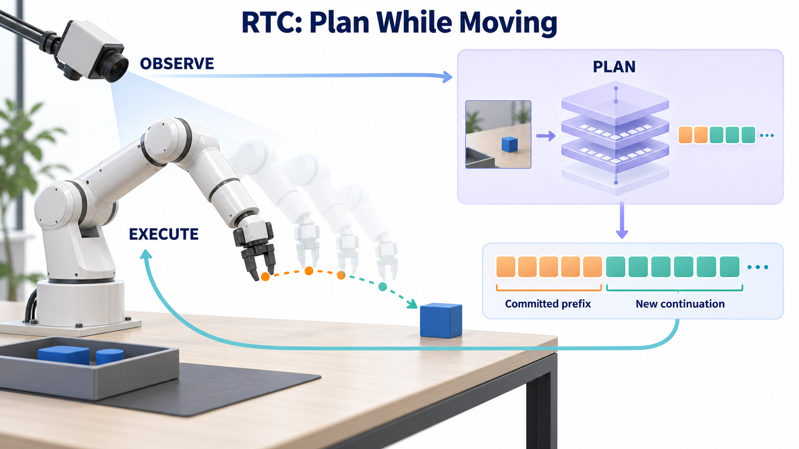
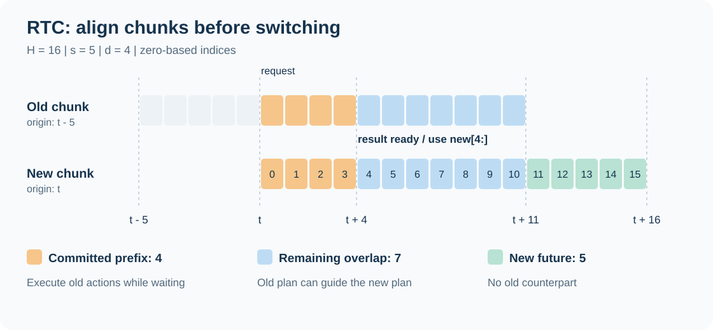
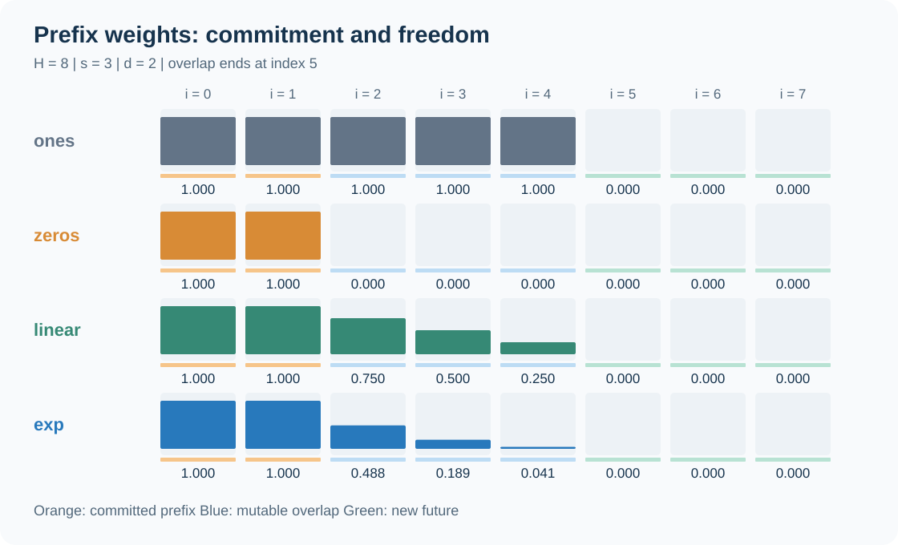
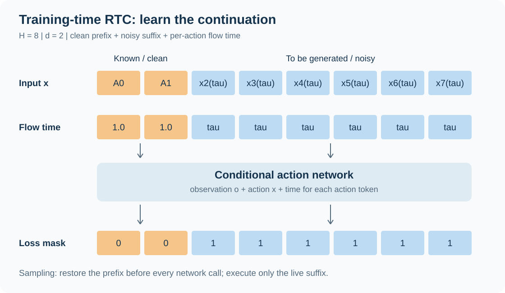
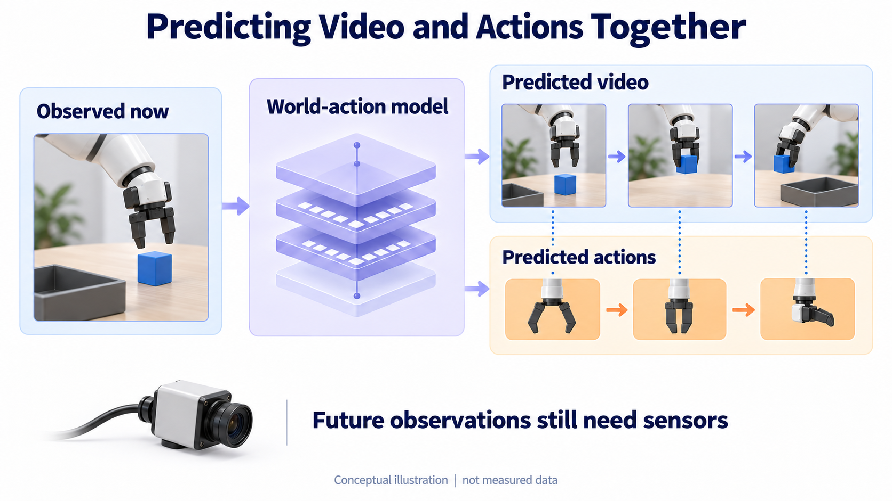

**RTC（Real-Time Chunking）要解决的是：模型还在生成下一段动作时，机器人怎样继续执行，并让新动作接得上已经发生的运动。** 这件事同时涉及异步调度、动作块的时间对齐和条件生成。单纯让推理跑到另一个线程，并不能保证切换时动作连续。

本文围绕三篇材料展开，源码固定在 [Physical Intelligence 的 Kinetix 实现，提交 `9296f31`](https://github.com/Physical-Intelligence/real-time-chunking-kinetix/tree/9296f31d62d5bfeb5779dcb2f9bcf71ca37f448b)，核对日期为 2026-09-12。

| 材料 | 本文使用的版本 | 主要回答的问题 |
| --- | --- | --- |
| [Real-Time Execution of Action Chunking Flow Policies](https://arxiv.org/abs/2506.07339v2)，Black、Galliker、Levine | v2，2025-12-05 | 不重新训练，如何在推理时让新动作块延续旧计划？ |
| [Training-Time Action Conditioning for Efficient Real-Time Chunking](https://arxiv.org/abs/2512.05964v2)，Black、Ren、Equi、Levine | v2，2025-12-09 | 能否把前缀条件加入训练，省去推理时引导开销？ |
| [World Action Models in Real Time: An Empirical Study of Smooth Execution via Asynchronous Deployment](https://arxiv.org/abs/2608.01880v2)，Motubrain Team | v2，2026-08-11 | 在视频与动作联合生成、延迟更高的系统中，各种衔接方法表现如何？ |

下文分别简称为 **原始 RTC、训练时 RTC、WAM 实证研究**。论文结果均为作者报告；本文的图示与 CPU 算例是独立编写的教学材料。Kinetix 仓库对应前两篇论文的模拟实验，不包含第三篇论文的完整 WAM 部署系统。

| 阅读目的 | 推荐入口 |
| --- | --- |
| 先理解实时动作块执行 | [问题与时间轴](#problem) → [三个动作区间](#timeline) |
| 看算法推导 | [Flow Matching](#flow) → [推理时 RTC](#inference-rtc) → [训练时 RTC](#training-rtc) |
| 接入实际机器人 | [运行时调度](#runtime) → [WAM 实证](#wam) → [部署诊断](#deployment) |
| 对照官方代码复现 | [源码地图](#code) → [运行入口](#reproduce) → [CPU 实验](#lab) |
| 核对训练预算与恢复行为 | [checkpoint 与 epoch 计数](#checkpoint-semantics) |
| 控制器还会插值、滤波或限速 | [已承诺执行的动作与前缀条件](#executed-prefix) |
| 不同动作单位怎样影响引导 | [模型坐标与误差尺度](#action-metric) |

## 1. 为什么动作块会在执行时出问题 {#problem}

### 1.1 一次预测多步动作，收益与代价同时存在

视觉—语言—动作策略通常不会每个控制周期都从头运行一次大模型。它根据观测 $o_t$ 生成长度为 $H$ 的动作块：

$$
A_t=[a_{t\mid t},a_{t+1\mid t},\ldots,a_{t+H-1\mid t}].
$$

这里 $a_{u\mid t}$ 表示“根据时刻 $t$ 的观测，为绝对时刻 $u$ 预测的动作”。竖线右边强调观测来源；它不是条件概率记号。

一次生成多步，可以摊薄大模型推理成本，也能表达抓取、移动、放置等具有时间结构的行为。但模型生成的动作从观测时刻开始计时，而结果要经过一段延迟才能到达控制器。

设控制周期为 $\Delta t$，端到端推理延迟为 $\delta$。当结果终于返回，动作块开头的一部分时间已经过去。**新块的第 0 项通常已经过期，不能直接当作“现在该执行的动作”。**

### 1.2 三个目标需要分别验证

| 目标 | 需要解决的事 | 单独做到之后仍可能发生什么 |
| --- | --- | --- |
| 持续有动作执行 | 在后台推理期间保留可执行动作队列 | 新旧块切换时跳变 |
| 块间协调 | 新计划考虑推理期间已经执行的动作 | 计划过于依赖旧轨迹，响应变慢 |
| 根据新观测及时修正 | 观测足够新，推理与排队足够快 | 更新频繁但每次都改变运动模式 |

同步方式在动作块之间等待结果，机器人可能停住或重复最后一个指令。对于位置控制，这有时可以工作；对于依靠持续施力保持平衡、接球或追踪运动目标的任务，等待本身就会改变任务状态。

朴素异步方式让旧动作继续执行，解决了等待问题，却容易出现另一个问题：旧块选择从障碍物左侧绕行，新块选择右侧绕行，两段单独合理的轨迹拼起来可能不合理。把两条轨迹直接平均，也可能落到障碍物中间。

RTC 的核心思路是：**下一次规划必须把推理期间将执行的旧动作作为条件，然后生成与这些动作相容的后续计划。**



## 2. 先对齐时间：前缀、剩余重叠与新增未来 {#timeline}

### 2.1 四个量不能混用

本文使用从 0 开始的索引与左闭右开的区间。

| 符号 | 含义 | 单位 |
| --- | --- | --- |
| $H$ | 每次预测的动作块长度 | 控制步 |
| $s$ | 相邻两块观测起点的间隔；在原始 RTC 稳态调度中也是每轮推进的步数 | 控制步 |
| $d$ | 推理期间经过的控制步数 | 控制步 |
| $\delta$、$\Delta t$ | 端到端耗时、控制周期 | 秒 |

原始论文用 $d=\lfloor\delta/\Delta t\rfloor$ 离散化，并说明不考虑控制步内部的精细同步。部署时应根据动作真正生效的控制边界计算索引；若计算“必须预留多少完整步才能覆盖延迟”，保守预算常用 $\lceil\delta/\Delta t\rceil$。这两种取整回答的问题不同，不能拿一个固定取整替代真实时间戳。

例如，50 Hz 控制对应 20 ms 一步，108 ms 推理跨过 5.4 个周期：论文可以记作 $d\approx5$，但从周期起点出发，为等待结果预留动作通常需要覆盖 6 个周期。网络、调度和发送队列还可能增加实际开销。

### 2.2 两个块在同一绝对时间上比较

旧块起点为 $t-s$，覆盖 $[t-s,t-s+H)$；新块根据 $o_t$ 生成，覆盖 $[t,t+H)$。把旧块左侧已经过去的 $s$ 项移走，就得到与新块起点对齐的参考序列：

$$
Y_i=a_{t+i\mid t-s},\qquad 0\le i<H-s.
$$

新块按相对索引分为三段：

1. **已承诺前缀 $[0,d)$**：后台推理期间，机器人会执行旧块中的这些动作。生成器不能再改变已经发生的执行。
2. **剩余重叠 $[d,H-s)$**：新旧块都预测了这些未来时刻；可以参考旧计划，也需要根据新观测修正。
3. **新增未来 $[H-s,H)$**：旧块没有对应项，需要由新块自行生成。



图中的例子是 $H=16,s=5,d=4$：总重叠 11 步，其中前缀 4 步、剩余重叠 7 步、新增未来 5 步。**前缀长度由延迟决定，重叠长度由两个观测起点之间的距离决定。**

### 2.3 可调度范围有前提

旧块必须覆盖等待新结果的时间，因此：

$$
d\le H-s.
$$

在原始 RTC 的单路、连续、无重叠推理请求设置下，下一次请求不能比当前推理结束更早开始，还要求 $s\ge d$。两式合起来：

$$
d\le s\le H-d,\qquad d\le H/2.
$$

这解释了为什么原始 Kinetix 实验用 $H=8$，延迟扫描到 $d=4$。它是该调度设置下的覆盖约束，不是所有异步系统的普适定理：并发推理、不同触发语义或不同动作缓存方式，会改变约束的写法。

第三篇论文报告 $H=24,s=4,d_{est}=8$，其中 $s$ 按文中定义是当前块执行到下一次推理触发之间的步数。该论文采用自己的部署时序；不能把它直接代入原始仓库的 `assert s >= d`。尤其不能据此宣称单路服务能够在 800 ms 请求延迟下，持续每 400 ms 完成一个新请求。实际吞吐、并发数量和观测起点间隔仍需独立测量。[原始 RTC，第 3 节](https://arxiv.org/pdf/2506.07339v2)；[WAM 实证研究，第 3 节](https://arxiv.org/pdf/2608.01880v2)

## 3. Flow Matching：区分控制时间和生成时间 {#flow}

控制步 $t$ 表示机器人世界里的时间。下面的 $\tau\in[0,1]$ 则表示模型从噪声生成动作的积分进度，两者没有一一对应关系。

给定示范动作块 $A$ 与高斯噪声 $\epsilon$，采用从噪声到数据的线性路径：

$$
x^\tau=(1-\tau)\epsilon+\tau A,
\qquad
u^\tau=\frac{\mathrm dx^\tau}{\mathrm d\tau}=A-\epsilon.
$$

网络 $v_\theta(x^\tau,o,\tau)$ 学习这一速度场，基本训练目标为：

$$
\mathcal L_{FM}=\mathbb E\left[
\left\|v_\theta(x^\tau,o,\tau)-(A-\epsilon)\right\|^2
\right].
$$

推理从 $x^0\sim\mathcal N(0,I)$ 开始，用 $N$ 步 Euler 积分：

$$
x^{\tau+\Delta\tau}=x^\tau+
\Delta\tau\,v_\theta(x^\tau,o,\tau),\qquad
\Delta\tau=1/N.
$$

一次 denoising step 更新整段动作，不表示机器人执行了一步。降低 denoising 步数可能减少延迟，却也会改变采样误差与动作质量。

**版本勘误：**训练时 RTC 的 v2 PDF 第 2 页公式 (1) 写的是上述噪声到数据路径，但公式 (2) 将目标印为 $\epsilon-A$，与该路径及后文从 0 到 1 的积分方向不一致。核对 PDF 原页后，这不是文本提取导致的符号丢失。其附录 Algorithm 1 与固定版本源码 `u_t = action - noise` 一致。本文采用 $A-\epsilon$，读其他 Flow Matching 实现时也应先核对路径与积分方向。[训练时 RTC，公式 (1)–(2) 与 Algorithm 1](https://arxiv.org/pdf/2512.05964v2)；[源码 `FlowPolicy.loss`](https://github.com/Physical-Intelligence/real-time-chunking-kinetix/blob/9296f31d62d5bfeb5779dcb2f9bcf71ca37f448b/src/model.py)

## 4. 推理时 RTC：用旧计划引导新动作生成 {#inference-rtc}

### 4.1 条件应该施加到“最终动作估计”上

在积分中间阶段，$x^\tau$ 仍包含噪声。直接比较它和旧动作 $Y$，会把生成过程的噪声状态与干净控制目标混在一起。

原始 RTC 先估计最终干净动作：

$$
F_\tau(x)=x+(1-\tau)v_\theta(x,o_t,\tau).
$$

这可以理解为：假设当前速度保持不变，把剩余的 $1-\tau$ 路程走完。它是模型给出的终点估计，不是精确求解完整 ODE 得到的终点。

然后衡量 $F_\tau(x)$ 与已对齐旧动作 $Y$ 的差异，并用这项差异修正当前速度。旧动作的约束通过生成网络传回当前噪声状态，因此能影响整段动作如何协调变化。

### 4.2 Soft masking 给不同时间位置分配不同权重

令 $W_i$ 为时间位置 $i$ 的权重，广播到各动作维度。记 $e=H-s$ 为重叠结束位置：

$$
c_i=\frac{e-i}{e-d+1},
\qquad
W_i=
\begin{cases}
1,&0\le i<d,\\
c_i\dfrac{\exp(c_i)-1}{\exp(1)-1},&d\le i<e,\\
0,&e\le i<H.
\end{cases}
$$

前缀权重为 1，因为这些动作已经承诺；剩余重叠的权重逐渐下降，因为越远的未来越应允许新观测改变计划；新增未来权重为 0，因为旧块没有参考值。

这不是纯粹的 $\exp(-ki)$，而是源码中线性权重与归一化指数项的乘积。以 $H=8,s=3,d=2$ 为例：

```text
新块索引     0      1      2      3      4      5      6      7
区域         前缀   前缀   重叠   重叠   重叠   新增   新增   新增
linear      1.000  1.000  0.750  0.500  0.250  0      0      0
exp         1.000  1.000  0.488  0.189  0.041  0      0      0
zeros       1      1      0      0      0      0      0      0
ones        1      1      1      1      1      0      0      0
```



源码中的 `zeros` 指“可变重叠区域的权重为零”，不代表完全关闭引导。`end=0` 才会使所有位置都忽略旧动作。另外，论文与评测中所谓 **hard masking** 指这类二值权重；它本身仍是引导，不等于直接把生成结果硬覆盖为旧动作。[源码 `get_prefix_weights`](https://github.com/Physical-Intelligence/real-time-chunking-kinetix/blob/9296f31d62d5bfeb5779dcb2f9bcf71ca37f448b/src/model.py)

### 4.3 VJP 把终点误差传回当前生成状态 {#input-vjp}

为便于推导，临时把动作块展平成向量。定义：

$$
r=W\odot(Y-F_\tau(x)),\qquad
g=J_{F_\tau}(x)^{\mathsf T}r.
$$

这里 $J_F$ 是 $F$ 对输入动作 $x$ 的 Jacobian。实际代码使用 `jax.vjp` 直接计算向量—Jacobian 乘积，不需要显式构造一个巨大的矩阵。

求导对象是整个终点估计 $F_\tau(x)=x+(1-\tau)v_\theta(x,o,\tau)$。固定观测与生成时间后，有：

$$
\begin{aligned}
J_F&=I+(1-\tau)J_v,\\
g&=r+(1-\tau)J_v^{\mathsf T}r.
\end{aligned}
$$

第一项来自终点估计中的直接输入 $x$，第二项来自速度网络。只对 $v_\theta$ 做 VJP 会漏掉第一项及剩余时间系数；将速度输出断开梯度，则只剩第一项，也改变了原算法。

例如取标量速度 $v(x)=3x$、$\tau=0.5$、当前 $x=0$、旧目标 $Y=1$、权重为 1，此时 $F(x)=2.5x$、残差 $r=1$，正确修正为 $g=2.5$。直接对速度求 VJP 得到 3，仅保留恒等分支得到 1。源码变量虽然叫 `pinv_correction`，这一行实际执行的仍是 $J_F^{\mathsf T}r$，没有显式计算 Jacobian 的 Moore–Penrose 伪逆；在此标量例子里，伪逆乘残差是 0.4，不能用它替换 2.5。[`denoiser` 与 VJP 调用](https://github.com/Physical-Intelligence/real-time-chunking-kinetix/blob/9296f31d62d5bfeb5779dcb2f9bcf71ca37f448b/src/model.py#L235)

从加权误差能量看，令：

$$
E(x)=\frac12\sum_j W_j\big(Y_j-F_\tau(x)_j\big)^2,
$$

则 $g=-\nabla_x E$。因此，在当前局部近似下，沿 $g$ 方向移动会减小旧计划与新终点估计之间的差异。

**这里的权重只乘一次。** 如果改写成 $\tfrac12\|W\odot(Y-F)\|^2$ 再求梯度，得到的是 $W^2$。二值掩码下看不出差别，软权重下却会改变引导强度。

还要注意：$W_i=0$ 只表示“不直接惩罚终点估计的第 $i$ 个位置”，不一定使修正 $g_i=0$。网络会跨时间混合信息，一个位置的输入可以影响另一个位置的终点预测。例如 $F(x_0,x_1)=(x_0+x_1,x_1)$，只约束第一项、当前 $x=(0,0)$、目标第一项为 1 时，VJP 得到 $g=(1,1)$。第二个输入坐标也会更新，以帮助第一项满足条件。若在 VJP 后再次用时间掩码清零梯度，就改变了参考方法。

RTC 的速度修正为：

$$
\widetilde v=v_\theta+\lambda(\tau)g,
\qquad
r_\tau^2=\frac{(1-\tau)^2}{\tau^2+(1-\tau)^2},
$$

$$
\lambda(\tau)=\min\left(
\beta,\frac{1-\tau}{\tau r_\tau^2}
\right).
$$

$\beta$ 限制最大引导系数。公式在端点涉及除零；固定源码在 $\tau=0$ 用 `nan_to_num` 处理无穷大并裁剪，Euler 采样的网络求值发生在 $0,1/N,\ldots,(N-1)/N$，不需要在 $\tau=1$ 再求速度。

每步采样于是变成：

```python
# 概念代码：vjp_of_F 返回对当前动作状态 x 的向量—Jacobian 乘积。
v = policy(x, observation, tau)
clean = x + (1 - tau) * v
residual = weights * (previous_aligned - clean)
correction = vjp_of_F(residual)
x = x + dtau * (v + guidance_weight * correction)
```

这是对采样状态的引导，不是在线训练模型参数。网络权重保持不变，但每个 denoising step 多了反向传播相关计算，所以会增加推理延迟。

移植到其他自动微分框架时，应保留“当前动作输入 → 终点估计”的计算图，同时将观测、旧计划和时间权重当作该步的固定条件。冻结模型参数与关闭整次前向的梯度记录是不同的操作：前者仍可以计算输入梯度，后者可能直接切断所需路径。每步只需要当前状态上的一阶 VJP，无需为了 RTC 本身而反传穿过全部历史采样步骤。若前处理还屏蔽了某些输入通道，梯度也会经过这个屏蔽操作，见 X-VLA 的[夹爪条件边界](#gripper-conditioning)。

### 4.4 引导能促进衔接，但不提供严格连续性证明

有限的引导系数、近似的终点估计和有限积分步数，都意味着新块的前缀预测不一定逐元素等于 $Y$。实际控制器在等待期间执行的是旧块中的已承诺动作；新块中过去的前缀不会被重新执行。

因此，应区分“生成器更倾向于延续旧计划”和“位置、速度、加速度严格连续”。RTC 主要解决策略层面的块间协调，低层轨迹约束仍需要独立处理。

### 4.5 引导参数不是越大越好

增加 $\beta$ 会允许更强的旧计划引导，但其收益取决于终点估计、积分步数与动作尺度。本文建议调参时同时观察三件事：块间差异有没有下降，任务是否仍能根据新观测修正，额外计算是否增大了真正的延迟。

原始论文附录 A.2 的消融发现，模拟任务中把 $\beta$ 提高到 5 以上没有带来进一步收益；在较少去噪步数下，过大的系数还会使示例动作块发散。作者因此使用 $\beta=5$。按 5 步 Euler 的求值时间，把本文公式算开可得：

| $\tau$ | 0 | 0.2 | 0.4 | 0.6 | 0.8 |
| --- | ---: | ---: | ---: | ---: | ---: |
| 未裁剪系数 | 发散 | 4.25 | $13/6$ | $13/6$ | 4.25 |
| $\beta=5$ 时 | 5 | 4.25 | $13/6$ | $13/6$ | 4.25 |

所以在这组特定离散时间上，只要 $\beta\ge4.25$，改变阈值仅改变第一步的系数。它不意味着第一步的影响很小：第一步改变的状态会继续影响后续网络求值。增加采样步数会改变时间网格，以上结论也必须重新检查。[原始 RTC，附录 A.2、Figure 7](https://arxiv.org/pdf/2506.07339v2)

| 调整项 | 直接改变什么 | 需要一起测量什么 |
| --- | --- | --- |
| 最大引导系数 $\beta$ | 每步允许的约束修正强度 | 任务质量、数值稳定性、对旧计划的依赖 |
| soft-mask 衰减 | 剩余重叠区域保留多少旧计划 | 接触精度、运动模式切换、突发事件响应 |
| denoising 步数 $N$ | 积分精细程度和计算次数 | 完整端到端延迟及动作质量 |
| 执行间隔 $s$ | 新观测使用频率及重叠长度 | 服务吞吐、队列覆盖、相邻块分歧 |

这些是基于公式的实验设计建议，不是论文给出的通用最优配置。尤其是 $N$ 增大后，不能继续沿用较小 $N$ 测得的延迟来构造前缀。

### 4.6 时间掩码不负责统一动作尺度 {#action-metric}

固定源码在 `realtime_action` 内直接计算 `error = (y - x_1) * weights[:, None]`，没有在这里另做动作标准化。因此，旧前缀 `y` 必须已经与生成器的终点估计使用同一种表示。若某个策略在标准化空间生成动作，前缀也要使用该策略的相同统计量转换；不能将控制器的物理单位数组直接与标准化输出相减。[推理时引导实现](https://github.com/Physical-Intelligence/real-time-chunking-kinetix/blob/9296f31d62d5bfeb5779dcb2f9bcf71ca37f448b/src/model.py#L219)

以下是对接其他策略时的数学分析，不是说 Kinetix 在这个函数里提供了标准化器。设某连续通道使用 $z_j=(a_j-\mu_j)/\sigma_j$，其中 $\sigma_j>0$。标准化空间的加权误差为：

$$
\begin{aligned}
E_z&=\frac12\sum_{i,j}W_i
\left(z^{old}_{ij}-\widehat z_{ij}\right)^2\\
&=\frac12\sum_{i,j}\frac{W_i}{\sigma_j^2}
\left(a^{old}_{ij}-\widehat a_{ij}\right)^2.
\end{aligned}
$$

可见，时间权重 $W_i$ 决定约束哪些时刻，尺度 $\sigma_j$ 则决定各通道的误差如何进入同一个目标。模型空间里“各维同权”，换到物理数值空间后并不意味着每维仍以相同系数计量。

以一个位置通道为例：旧目标与新估计相差 0.01 m，训练尺度为 0.1 m，标准化残差是 0.1。若接口使用毫米，相应误差是 10 mm、尺度是 100 mm，残差仍为 0.1；但把 10 除以尚未换算的 0.1，会得到 100，单项平方误差放大 $10^6$ 倍。转换绝对数值时，均值也要按相同单位换算。这类不一致不能靠更换 soft-mask schedule 修好。

反向传播同样要与误差的定义一致。若选择在物理空间评价终点差异，应对“模型输出 → 反标准化 → 误差”的完整计算求输入梯度；只在 VJP 外把残差换成物理单位，会漏掉链式法则中的尺度。更改误差度量、通道权重或优化坐标属于算法适配，需要重新验证引导强度与采样行为。上面的等式说明的是误差目标的换算，不保证换坐标后直接使用相同 Euler 步长就得到相同轨迹。

旋转 6D、夹爪 logit 和二值开合也不能统一当成可任意换单位的连续位置。X-VLA 的[损失权重与动作尺度](#action-scaling)说明了另一层区别：训练损失里的系数，并不会自动成为 RTC 的通道权重或输入归一化规则。

## 5. 训练时 RTC：直接学习给定前缀的后续分布 {#training-rtc}

### 5.1 把推理时补条件，改成训练时学条件

推理时 RTC 借助额外引导，让原本的生成策略适应旧动作前缀。训练时 RTC 则直接学习：

$$
p_\theta\big(A_{d:H}\mid o_t,A_{0:d},d\big).
$$

训练样本仍来自示范轨迹。给定一段完整动作 $A$，随机选取延迟 $d$：前 $d$ 步当作已知的干净条件，后面的动作才需要去噪生成。部署时，再把示范前缀换成控制器已承诺执行的旧动作前缀。

这使后缀网络在生成过程中能够使用“机器人接下来必定先这样运动”的信息，而无需每步再计算 VJP。[训练时 RTC，第 IV 节](https://arxiv.org/pdf/2512.05964v2)

这里学习的是动作序列的条件分布，不要求先运行一个显式动力学模型，把 $o_t$ 推演成未来观测。前缀可以帮助网络推断后续动作应如何延续，但条件中的视觉观测仍来自原来的 $o_t$。推理过程中才出现的新障碍、新接触或目标移动，不会因为加入动作前缀就自动被看见；它们仍需要通过后续观测进入策略。这也是“块间更协调”不能直接等同于“反馈延迟消失”的原因。

### 5.2 三处修改缺一不可

对每个动作位置定义自己的生成时间：

$$
\tau_i=
\begin{cases}
1,&i<d,\\
\tau,&i\ge d.
\end{cases}
\qquad
x_i=(1-\tau_i)\epsilon_i+\tau_i A_i.
$$

于是前缀是干净动作，后缀仍位于噪声到数据的中间路径。

| 修改 | 具体操作 | 为什么需要 |
| --- | --- | --- |
| 输入前缀 | 将前 $d$ 个动作槽位放入干净动作 | 提供实际要延续的计划 |
| 逐动作时间 | 前缀时间为 1，后缀时间为 $\tau$ | 告诉网络哪些是已知条件、哪些还在去噪 |
| 后缀损失 | 仅对 $i\ge d$ 的输出计算损失 | 将学习目标集中在待生成部分 |

若网络采用 adaLN，时间 embedding 产生的 scale、shift、gate 需要支持不同动作 token 使用不同值。论文指出这样可以不增加可学习参数数量，但仍需要改变时间条件的广播方式。对于只接收单个标量时间的已有策略，不能只改输入数组就声称已经支持训练时 RTC。



用平均到后缀动作元素的形式表达教学目标：

$$
\mathcal L_{suffix}=\mathbb E\left[
\frac{\sum_{i=d}^{H-1}\sum_{j=1}^{D}
\big(v_\theta(x,o,\boldsymbol\tau)_{ij}-(A_{ij}-\epsilon_{ij})\big)^2}
{(H-d)D}\right].
$$

这里 $D$ 是动作维度。固定源码使用略有不同的归一化：分子累加所有动作维度，分母只计后缀 token 数。因此，在相同有效位置上，它的损失是“每 token 的各维误差之和”，而不是每个标量动作元素的均方误差。普通训练分支用 `jnp.mean`，会同时平均动作维度。**即使 $d=0$，两个分支的原始 loss 数值也可能相差 $D$ 倍**，不要把日志曲线的变化全部解释为模型性能变化。

上式便于描述单个样本；源码还在整个 batch 上汇总分子、分母。若样本 $b$ 的前缀长度为 $d_b$，精确对应的是：

$$
\mathcal L_{code}=
\frac{\sum_b\sum_{i=d_b}^{H-1}\sum_{j=1}^{D} e_{bij}^2}
{\sum_b(H-d_b)+10^{-8}}.
$$

这里 $e_{bij}$ 是预测速度减去训练目标的误差。这与“每个样本先平均后缀损失，再对 batch 平均”也有区别。举例说，两条样本分别有 8、4 个有效 token，且每 token 各维平方误差之和分别为 1、4，那么源码得到 $(8\times1+4\times4)/12=2$；按样本等权平均则是 $(1+4)/2=2.5$。前者让每个有效 token 等权，后者让每条样本等权；复现时应保留实际使用的口径。

### 5.3 推理时每一步都恢复前缀

训练时 RTC 的生成过程可以写为：

```python
x = gaussian_noise(shape=(batch, horizon, action_dim))
for k in range(num_steps):
    tau = k / num_steps
    x[:, :delay] = previous_aligned[:, :delay]
    time_per_action = full((batch, horizon), tau)
    time_per_action[:, :delay] = 1.0
    velocity = policy(x, observation, time_per_action)
    x += velocity / num_steps

# 控制器只使用尚未过期的后缀；这里先假定实际延迟恰好等于 delay。
actions_to_use = x[:, delay:]
```

固定源码是在**每次网络求值之前**恢复前缀，然后更新整个动作块；最后一次更新后没有再覆盖一次。因此，返回数组的前缀不保证逐元素等于旧动作。条件在网络求值时成立，控制器也会丢弃已经过期的前缀。这一细节不影响后缀接口，但对编写“前缀必须完全相等”的单元断言很重要。

### 5.4 延迟分布也是训练配置 {#delay-distribution}

Kinetix 实现的 `simulated_delay=5` 表示从 $\{0,1,2,3,4\}$ 中采样，并不是固定延迟 5，也不包含延迟 5。采样权重与 $\exp([4,3,2,1,0])$ 成正比，所以小延迟更常见。

随机延迟同时改变了各位置收到直接训练损失的频率。索引 $i$ 只有在 $d\le i$ 时属于后缀，因而其直接监督覆盖率为：

$$
P(i\text{ 参与后缀损失})=P(d\le i).
$$

根据该源码分布计算：

| 位置 $i$ | 0 | 1 | 2 | 3 | 4–7 |
| --- | ---: | ---: | ---: | ---: | ---: |
| 参与后缀损失的概率 | 约 63.64% | 约 87.05% | 约 95.67% | 约 98.83% | 100% |

这解释了为什么训练延迟分布不仅是部署参数，也会改变训练信号的分配。它描述的是该位置的输出是否直接计入损失；前缀仍可通过影响后缀预测参与共享网络的梯度计算。该概率也不是各位置对最终参数更新的精确贡献，还要考虑误差大小、Jacobian 与第 5.2 节的归一化方式。不能仅凭这张概率表推导成功率会升高或降低多少。

真实机器人实验采用另一套分布：论文正文报告在 0 到 10 之间均匀采样，以支持 50 Hz 系统约 200 ms 的延迟。不要把模拟配置的指数分布、上界排除规则直接移植成真实实验的设置；自行实现时应明确随机 API 的上界是否包含。

从训练与部署差异还可推导出一个需要验证的问题：训练前缀来自示范，部署前缀来自模型先前的预测，后者可能有偏差。这是本文根据条件接口提出的分布差异分析，并非论文给出的定量失败结论。延迟超出训练范围、旧动作包含错误时，都应单独评测。

### 5.5 两种 RTC 的能力边界

| 维度 | 推理时 RTC | 训练时 RTC |
| --- | --- | --- |
| 是否需要额外训练 | 可在兼容的已有 flow 策略上应用 | 需要前缀条件训练或微调 |
| 条件范围 | 已承诺前缀，以及可软约束的剩余重叠 | 论文方法主要条件于已承诺前缀 |
| 每步采样成本 | 网络前向与输入 VJP | 条件网络前向 |
| 延迟适应 | 推理时调整掩码与长度 | 依赖训练分布及模型泛化 |
| 主要取舍 | 灵活，但引导增加延迟 | 推理更轻，但需要训练支持 |

训练时 RTC 消除了这部分引导开销，并没有消除视觉编码、模型前向、网络传输或控制队列带来的延迟。

## 6. 算法之外：异步运行时怎样交换动作块 {#runtime}

### 6.1 推理线程与控制线程承担不同职责

控制线程按控制周期取出当前队列中的动作，更新观测和执行进度。推理线程在满足触发条件后，快速复制观测、旧动作的剩余部分及延迟估计，然后释放共享状态锁，执行耗时的模型计算。

新结果返回后，推理线程再次取得锁，检查控制线程已经推进到哪里，再原子地安装新块。推理期间一直持有锁，会使控制线程无法取动作，破坏异步执行本身。

原始 RTC 的 Algorithm 1 用短窗口历史延迟的最大值作为下一次推理的延迟估计，并在安装结果后记录本次实际延迟。这样的估计考虑了近期较慢请求，但仍不能保证覆盖从未出现过的延迟尖峰。[原始 RTC，Algorithm 1](https://arxiv.org/pdf/2506.07339v2)

### 6.2 新块的第几项，取决于它的观测起点

设请求使用控制步 $t_{obs}$ 的观测，结果可用时下一个待执行步为 $t_{now}$，则：

$$
i_{new}=t_{now}-t_{obs}.
$$

该式采用本文从第 2 节开始的约定：新块索引 0 对应 $t_{obs}$，且每项恰好占一个控制步。它比“每次返回就从预测延迟 $d_{est}$ 开始播放”更可靠。原始算法用切换时的共享计数减去请求开始前已经推进的 $s$，保留本次推理期间真正经过的步数。

若接入的策略输出的是从观测之后开始的未来目标，或者动作锚点间隔不同于控制周期，先为每一项构造实际目标时间，再按控制接口选择或重采样。X-VLA 的公共数据处理器就把当前点作为状态、后续点作为动作，具体推导见其[时间采样章节](#action-timing)。不能把观测经过的控制步数未经转换就当成任意模型的数组索引。

一个具体例子：请求源于步 100，预测等待 4 步，但直到步 106 才能切换。此时新块的索引应为 6；从索引 4 开始会把计划错位两步。与此同时，若生成时只把前 4 步设成条件，实际执行的旧动作已覆盖前 6 步，即使索引改对，条件也仍有缺口。

所以应分别处理：

1. **时间对齐误差**：通过实际时钟与动作生效边界，定位新块对应的当前项。
2. **条件覆盖不足**：通过延迟预算、排队策略和超时处理，控制“实际已执行前缀”超出生成条件的程度。

### 6.3 用绝对时间描述部署接口 {#queue-installation}

以下是本文建议的接口草图，不是仓库中现成的机器人控制程序：

```python
request = {
    "request_id": request_id,
    "observation_step": observation_step,
    "prefix": committed_actions_aligned_to_observation,
    "estimated_delay_steps": estimated_delay,
}

# 结果返回时，在受保护的队列更新区间内执行。
# committed_until_step 是不可撤回指令区间的右端点（不包含端点）。
# 没有提前缓存指令时，它等于 next_command_step。
replace_from = max(next_command_step, committed_until_step)
new_index = replace_from - result.observation_step
if result.request_id <= installed_request_id:
    discard(result)                  # 乱序返回的旧请求
elif result.observation_step > next_command_step:
    handle_clock_mismatch(result)
elif new_index >= result.horizon:
    handle_no_replaceable_suffix(result)  # 已过期，或全部落在不可替换区间
else:
    replace_queue_from(replace_from, result.actions[new_index:])
    installed_request_id = result.request_id
```

这里沿用“索引 0 对应观测步、一个元素对应一个控制步”的约定，并假设同一 episode 内请求编号单调增加。`replace_queue_from` 只替换指定时刻及其后的可变队列，保留此前不可撤回的指令；检查和替换必须处于同一次原子更新中。真实系统还要将相机采样、状态读取和控制器接收的时钟对齐。初次启动需要先准备首个动作块或明确的启动策略，不能凭空假设已经存在旧块。

例如，观测来自步 100，结果返回时下一个待执行步是 106，但驱动已经接受步 106、107 的指令且无法撤回。此时可替换边界为 108，新块应从索引 8 安装，旧队列中的 106、107 保持原样。如果只按当前步选择索引 6，动作虽然没有时间错位，却可能错误地覆盖已经承诺的命令。这也说明**结果安装边界可能晚于结果到达时刻**。

生成条件需要同步考虑这个边界。请求发出时，前缀应覆盖预计切换前将执行或不可撤回的动作；若低层队列在生成期间继续扩大不可撤回范围，即使安装时正确跳过了这些项，也不能声称生成器已经对新增承诺进行过条件化。这与第 6.2 节的“条件覆盖不足”是同一问题；第 12.3 节进一步解释[前缀应该使用哪一层的动作值](#executed-prefix)。

## 7. 前两篇论文的证据：成功率、吞吐和延迟分开看 {#evidence}

### 7.1 原始 RTC 的动态模拟实验

原始论文选取 12 个 Kinetix 动态任务，包括发射、接取、平衡等，采用基于力的控制，并给动作加入高斯噪声。这样的环境需要持续闭环修正，不能通过长时间保持位置轻易绕过延迟问题。

动作模型是 $H=8$、4 层 MLP-Mixer，训练 32 个 epoch；每个评测点使用 2,048 条 rollout，并报告 95% Wilson 区间。主要趋势是：

- RTC 在论文的延迟扫描中优于所比较的朴素异步、时间集成与 BID 基线。
- 较短执行间隔允许更频繁地利用新观测；RTC 的协调机制使这种更新更有效。
- soft masking 在较低延迟和较短执行间隔下优于只约束前缀的 hard masking。
- 多模态动作中，时间集成可能把多条有效计划平均成无效计划。

论文中的 BID 使用强、弱两个策略各采样 32 个块，mode size 为 3，弱策略取训练 8 个 epoch 的 checkpoint。因此论文对比不等于仓库默认参数的一次调用，具体差别在[复现章节](#reproduce)说明。[原始 RTC，第 4.1 节、Figure 5](https://arxiv.org/pdf/2506.07339v2)

### 7.2 原始 RTC 的真实机器人实验

真实实验基于 $\pi_{0.5}$，动作块长 $H=50$，控制频率 50 Hz，使用 5 个 denoising step。作者报告：普通采样模型延迟 76 ms，RTC 97 ms；局域网远程推理再增加 10–20 ms。额外注入 100 ms、200 ms 延迟后，RTC 的延迟约为 11、16 个控制步。

任务覆盖点蜡烛、插网线、整理床铺、折叠衣服、批量折衣和收拾餐具，其中包含移动操作。每个任务和方法配置评测 10 次，总计 480 个 episode、约 28 小时机器人执行。

这些实验使用任务子步骤衡量进度，并比较随时间累积的进度与任务吞吐。它们回答的是“同样的墙钟时间里完成了多少任务工作”，不能全部换算成某个统一的二值成功率提升。[原始 RTC，第 4.2 节、Figure 6](https://arxiv.org/pdf/2506.07339v2)

论文 Figure 6 的吞吐量按每个 episode 的“完成任务比例除以持续时间”计算，再对 episode 求平均。作者报告 RTC 在所测延迟下取得最高吞吐，在额外 100 ms、200 ms 下的优势具有统计显著性；两种时间集成基线在这两个额外延迟设置中因振荡触发机器人保护停止，未能运行。对这些基线不能编造一个正常运行的吞吐数值。作者还比较了扣除推理暂停后的控制步进度，发现收益不仅来自少等待，也包括部分任务中更少的错误和重试。这些结论限定于该实验模型、任务和延迟范围。[原始 RTC，Figure 6 图注与结果分析](https://arxiv.org/pdf/2506.07339v2)

### 7.3 训练时 RTC 的公平比较与收益

模拟实验控制总训练预算：普通策略训练 32 个 epoch；训练时 RTC 从第 24 个 epoch 的 checkpoint 继续训练 8 个 epoch。论文报告在 $d\ge2$ 时，训练时 RTC 优于推理时 RTC；在 $d=0,1$ 时略差。该结果不支持“加入前缀条件在所有延迟下都更好”。

真实实验基于 $\pi_{0.6}$，任务是制作浓缩咖啡与组装纸盒。两类 checkpoint 都从基础模型微调 8,000 个梯度步，batch size 为 512。在远程 H100 上使用 5 步去噪时：

| 方法 | 平均端到端延迟 | 50 Hz 下论文报告的近似延迟 |
| --- | --- | --- |
| 推理时 RTC | 135 ms | $d\approx7$ |
| 训练时 RTC | 108 ms | $d\approx5$ |

从 135 ms 降到 108 ms，延迟减少约 20%。这是**该设置中的推理管线耗时下降**，不能直接写成任务完成速度提升 20%。作者报告两种 RTC 的成功率与任务时间相近，相比同步方式有改善；真实实验成功率误差线为 68% Wilson 区间，时间误差线为一个标准误，与模拟实验的 95% 区间口径不同。[训练时 RTC，第 V 节、Figure 3–5](https://arxiv.org/pdf/2512.05964v2)

### 7.4 额外成本发生在去噪，未必同比放大整个模型

原始 RTC 附录 A.3 给出 $\pi_{0.5}$ 在 RTX 4090 上的一次 profiling 分解：

| 模型组件 | 普通采样 | 推理时 RTC |
| --- | ---: | ---: |
| 图像编码 | 18 ms | 18 ms |
| 语言主干 prefill | 44 ms | 44 ms |
| 5 步去噪合计 | 14 ms | 35 ms |
| 模型合计 | 76 ms | 97 ms |

去噪部分约为原来的 2.5 倍，但模型总耗时约为 1.28 倍，因为图像编码与 prefill 没有同比增加。不能把“每步去噪成本增加 2.5 倍”改写为“整个机器人系统延迟增加 2.5 倍”。这组数据来自各方法一次 profiling trace；前一节 H100 上的 108/135 ms 属于另一篇论文、另一模型与端到端测量，不能拼成一张同配置排行榜。[原始 RTC，附录 A.3、Table 3](https://arxiv.org/pdf/2506.07339v2)

## 8. World Action Models：高延迟系统会放大哪些问题 {#wam}

### 8.1 研究对象与 Kinetix 不同

第三篇论文研究视频与动作联合生成的 World Action Models。其推理管线较重，实时部署需要处理视觉采集、网络、模型推理和命令分发的联合延迟。



联合预测可以同时描述动作与预期场景变化，但预测的视频仍是模型输出。机器人执行后是否抓稳物体、物体是否被外力移动，需要后续真实观测确认。图中的上下对应只表达两类预测具有时间关系，不代表本文核对了该 WAM 内部的 token 排列或跨模态注意力实现。评估实时性时，应继续测量传感器观测到动作生效的延迟，不能把生成的未来画面当成已经收到的新反馈。

实验报告动作频率 10 Hz、$H=24$、$s=4$、估计延迟 $d_{est}=8$，对应一个 2.4 秒动作块与约 0.8 秒的延迟预算。按论文的成对动作块定义，总重叠为 20 步，其中延迟前缀 8 步、剩余重叠 12 步、新增未来 4 步。

较长块能给系统更多可执行余量，但也意味着更远的动作依赖更旧的观测。对于运动目标或突然出现的障碍，连续执行与快速响应之间的矛盾会更明显。论文的 $s$ 与调度语义应按其自身定义理解，见[前面的时序说明](#timeline)。

### 8.2 六种方法分别在哪里干预

| 论文标签 | 生成时 | 结果返回后 | 训练要求 |
| --- | --- | --- | --- |
| `sync` | 正常生成 | 等待完成再继续执行 | 无额外条件训练 |
| `async` | 后台正常生成 | 按延迟对齐后直接切块 | 无额外条件训练 |
| `async+blend` | 后台正常生成 | 对输出动作做重叠区域加权 | 无额外条件训练 |
| `simple` | 每个去噪步骤对重叠动作做加权混合 | 执行生成结果 | 无额外条件训练 |
| `infer` | 对生成速度施加 RTC 引导 | 执行生成结果 | 无额外条件训练 |
| `train` | 使用前缀条件生成后续动作 | 执行生成结果 | 需要前缀条件训练 |

`async+blend` 与 `simple` 的区别在于混合的位置：前者在生成之后处理最终输出；后者介入每步去噪。`simple` 与 `infer` 的区别在于修改动作值还是修改生成速度。它们不能统一叫作“把旧轨迹平滑一下”。

第三篇论文使用上述方法家族来组织实验，不能据标签就认定其全部参数、实现细节与 Kinetix 仓库完全相同。[WAM 实证研究，第 3–4 节、Figure 1–2](https://arxiv.org/pdf/2608.01880v2)

### 8.3 离线重叠一致性，不等于在线任务效果

作者从训练示范的离线回放中取相隔 $s$ 步的观测，比较连续预测块在重叠区的差异，并分别观察延迟区与剩余重叠区。图 3–4 报告不同身体部位的平均绝对误差与最大绝对误差：机械臂和躯干使用米，头部使用弧度，夹爪使用命令单位。

`train` 和 `simple` 在前缀区有较小差异，`infer` 在该平台上的约束效果较弱。`simple` 进一步压低整个重叠区的差异，但这有一部分来自方法直接混合动作的定义。

这类图衡量的是“相邻块同一时间位置的预测是否一致”，不是对真实正确动作的误差；数据也不是独立留出的在线任务测试。两块一直重复同一个错误动作，同样可以得到很小的重叠误差。因此必须结合任务完成情况看。[WAM 实证研究，第 5.1 节、Figure 3–4](https://arxiv.org/pdf/2608.01880v2)

### 8.4 在线结果：平滑性与精度确实可能冲突

作者测试了传送带拾取、积木插槽、食物放入微波炉三个任务，每种方法在每个任务上运行 **5 次**。完成分数按任务里程碑计算，满分 100；它不是百分比成功率。例如传送带任务有 5 个物体，每次拾取和放置各计 10 分。

下表转录 Figure 5 中的**平均完成分数**：

| 方法 | 传送带拾取 | 积木插槽 | 食物放入微波炉 |
| --- | ---: | ---: | ---: |
| `sync` | 20 | 72.5 | 96 |
| `async` | 20 | 40 | 44 |
| `async+blend` | 40 | 37.5 | 80 |
| `simple` | 80 | 27.5 | 80 |
| `infer` | 30 | 50 | 80 |
| `train` | 96 | 70 | 96 |

积木插槽最能说明区别：`simple` 的平移 RMS jerk 为 0.5674 m/s³，比 `train` 的 0.9444 m/s³ 更低，但完成分数只有 27.5，明显低于 `train` 的 70。更平滑的平均轨迹，不一定更容易对准一个精确接触目标。

在这一任务中，`train` 的报告时间为 12.13 秒，`sync` 为 19.4 秒；微波炉任务中，两者分数同为 96，时间分别为 68.9 秒和 85.18 秒。任务完成程度不同的配置之间，较短时间不应独立视为优势；需一起阅读分数和时间。

这些结果支持该平台上的经验结论：前缀条件训练取得了较好的精度、平滑与速度平衡；简单混合在精度要求较低的场景也有价值。由于每个配置只有 5 次试验，且模型、任务与延迟都不同，不能据此断言推理时 RTC 在所有平台上都不如训练时 RTC。[WAM 实证研究，第 5.2 节、Figure 5](https://arxiv.org/pdf/2608.01880v2)

### 8.5 旧计划也可能成为错误的条件

论文最后展示了突然出现障碍物的情形：新观测要求明显改变运动，但旧动作前缀仍将模型拉向原路径。这里的困难并非只来自块边界，而是“延续旧计划”和“及时改变计划”之间的冲突。

因此，该研究中 `infer` 的效果较差不能只归因为理论方法不成立：额外引导成本增大了有效延迟，约束强度与模型特性也会影响结果。同样，`train` 的条件机制也不能自动解决突发环境变化。评测响应能力时，需要观察新事件发生到控制动作真正改变之间的时间。[WAM 实证研究，第 6 节、Figure 6](https://arxiv.org/pdf/2608.01880v2)

## 9. 官方 Kinetix 实现：从训练数据到延迟模拟 {#code}

### 9.1 按调用链阅读

| 文件或入口 | 作用 | 首先核对什么 |
| --- | --- | --- |
| `src/train_expert.py` | 训练 Kinetix 专家 | 任务列表、种子、环境步数 |
| `src/generate_data.py` | 用专家生成示范 | 专家混合、episode 边界、数据目录 |
| `src/train_flow.py` | 训练或微调动作块 flow 策略 | `config.eval.model`、数据与恢复目录 |
| `src/model.py` / `FlowPolicy` | MLP-Mixer、普通采样、RTC、BID、损失 | 时间条件、掩码、VJP、训练分支 |
| `src/eval_flow.py` / `eval` | 在模拟环境中执行延迟策略 | 旧块前缀、新块后缀、缓存平移 |
| `src/eval_flow.py` / `main` | 加载模型并扫描配置 | 扫描范围、方法默认值、输出 CSV |

源码使用符号观测的 Kinetix 环境与较小的动作策略。这有利于大量受控模拟，并不意味着仓库已经实现摄像头接入、VLA 视觉编码或真实机械臂通信。[固定版本源码目录](https://github.com/Physical-Intelligence/real-time-chunking-kinetix/tree/9296f31d62d5bfeb5779dcb2f9bcf71ca37f448b/src)

训练代码还为每个 level 初始化独立的 `FlowPolicy` 参数，通过 `vmap` 与设备分片并行处理，并分别保存各 level 的 `.pkl`。因此，12 个模拟任务的汇总成绩比较的是同一算法在多任务环境上的表现，不能直接解释成一个共享 VLA checkpoint 的跨任务泛化成绩。[按 level 初始化与保存策略](https://github.com/Physical-Intelligence/real-time-chunking-kinetix/blob/9296f31d62d5bfeb5779dcb2f9bcf71ca37f448b/src/train_flow.py)

### 9.2 `realtime_action` 内部其实有两种生成路径

`FlowPolicy.realtime_action` 通过 `self.simulated_delay is not None` 分支：

- 为 `None` 时，使用终点估计、掩码误差和 VJP，执行推理时 RTC。
- 不为 `None` 时，每步恢复前缀并设置逐动作时间，执行训练时 RTC；该分支不会使用 soft-mask schedule 和最大 guidance weight 来生成速度。

这意味着同一个函数名甚至同一个 CSV 方法名，可能对应不同算法。评测必须同时保存网络配置、checkpoint 来源和采样配置。

特别是对前缀训练模型，`realtime` 与 `hard_masking` 两个评测标签都会进入前缀条件分支；不能把这两行当成有效的 soft/hard guidance 消融实验。

### 9.3 延迟通过动作选择模拟，没有真的睡眠等待

设 $H=8,s=3,d=2$，当前观测对应绝对步 $t$。一次评测迭代生成新块后，交给环境的动作是：

```text
old[0], old[1], new[2]
```

前两步来自旧块，表示推理尚未完成；第三步使用新块中时间对齐的动作。随后新块左移 3 项，并在尾部补 3 个零：

```text
new[3], new[4], new[5], new[6], new[7], 0, 0, 0
```

此时环境已到 $t+3$，缓冲区索引 0 也对应 $t+3$。补零项只是没有旧参考的占位；正确的 overlap mask 会把这些位置的引导权重归零。

这段逻辑由 JAX 的环境扫描完成。它在行为层面模拟“前 $d$ 步无法使用新策略结果”，而不是另起真实控制线程、等待 $d\Delta t$ 秒。因此，增加 `inference_delay` 能研究延迟对任务的影响，却不能直接测出 GPU 推理的真实耗时。[源码 `eval`](https://github.com/Physical-Intelligence/real-time-chunking-kinetix/blob/9296f31d62d5bfeb5779dcb2f9bcf71ca37f448b/src/eval_flow.py)

### 9.4 为什么 $s=d$ 时也会用到新块

在最快的串行更新设置中，常取 $s=d$。此时 `new[d:s]` 为空，本轮执行的全部动作确实来自旧块。但本轮生成的 `new` 会先左移 $s$ 项，成为下一轮的 `old`，下一轮等待期间就会执行它的后缀。

例如 $H=8,s=d=2$：

```text
轮次起点 t：     生成 B，执行 A[0], A[1]，缓存变为 B[2], B[3], ...
轮次起点 t+2：   生成 C，执行 B[2], B[3]，缓存变为 C[2], C[3], ...
轮次起点 t+4：   生成 D，执行 C[2], C[3]，缓存变为 D[2], D[3], ...
```

因此，新观测仍在持续影响执行，只是结果在一个推理延迟之后进入动作流。若只看单次循环里 `new[d:s]` 的长度，会误判成“策略一直执行旧块，生成新块毫无作用”。附带 CPU 实验会连续推进两轮来验证这一点。

### 9.5 episode 结束处理与 RTC 前缀掩码各管一件事

`train_flow.py` 从示范中截取动作块后，会查找块内第一个 `done=True` 的位置 $j$，把索引 $i\ge j$ 的动作标签置为零。注意这里包含第 $j$ 项，而不只是它之后的项。数据生成器把执行该动作后环境返回的 `done` 与该动作存放在同一条记录中，因此复现时需要保留这一确切边界，不能仅根据注释“after done”把比较符号改成 `>`。

例如，下列窗口会变成：

```text
原动作：  [10, 11, 12, 20, 21, 22, 23, 24]
done：    [ F,  F,  T,  F,  F,  F,  F,  F]
训练标签：[10, 11,  0,  0,  0,  0,  0,  0]
```

随后 `FlowPolicy.loss` 接收的是修改后的动作标签，没有同时接收一个 episode 有效性掩码。只要这些位置属于 RTC 训练后缀，零标签仍然参与损失。这与“把无效位置从损失中排除”不同，也与“把推理期间前缀从损失中排除”不同。[训练窗口处理](https://github.com/Physical-Intelligence/real-time-chunking-kinetix/blob/9296f31d62d5bfeb5779dcb2f9bcf71ca37f448b/src/train_flow.py#L166)；[动作与 done 的保存](https://github.com/Physical-Intelligence/real-time-chunking-kinetix/blob/9296f31d62d5bfeb5779dcb2f9bcf71ca37f448b/src/generate_data.py#L181)

这是固定实现的训练约定，本文不据此判断它优于其他终止处理方案。迁移到绝对关节位置或末端位姿目标时，也不能默认“补零”就代表“保持当前位置”：零值的控制含义由动作空间决定。

## 10. 复现入口与容易踩到的配置差异 {#reproduce}

本节命令依据固定源码与函数签名整理，供具备数据和计算资源的环境使用。本文没有下载完整专家数据，也没有运行 GPU 训练或大规模 rollout；本地验证范围见[CPU 实验](#lab)。

### 10.1 环境和数据先检查范围

仓库的 `pyproject.toml` 要求 Python 3.11 或更新版本，锁定 JAX/CUDA 等依赖，并通过子模块使用 Kinetix。按仓库流程：

```bash
cd /path/to/real-time-chunking-kinetix
git submodule update --init
uv sync
```

官方提供 `gs://rtc-assets/expert/` 与 `gs://rtc-assets/bc/`。前者包括专家 checkpoint 和数据，整个目录约 60 GiB；后者为动作块模仿学习策略。首次验证可先明确要使用的已有数据和模型，不必从训练全部专家开始。

默认有 12 个 level，计算沿 level 维分片，设备数量需要整除 level 数。专家训练脚本当前 README 写的是每个 level 默认 8 个种子；原始论文描述生成示范时使用 6 个专家。复现实验应以目标论文配置为准，不能把脚本默认值视作论文所有设置的完整记录。[仓库 README](https://github.com/Physical-Intelligence/real-time-chunking-kinetix/blob/9296f31d62d5bfeb5779dcb2f9bcf71ca37f448b/README.md)

### 10.2 普通 flow 与训练时 RTC

已有专家数据目录时，普通动作块训练入口为：

```bash
uv run src/train_flow.py \
  --config.run-path /path/to/expert-run
```

下面保留 README 对发布权重使用的 `bc/24` 路径示例，从其中的策略参数开始进行 8 个 epoch 的前缀条件微调。**目录名 24 的训练计数含义需要另行核对**，见[checkpoint 说明](#checkpoint-semantics)：

```bash
uv run src/train_flow.py \
  --config.run-path /path/to/expert-run \
  --config.load-dir /path/to/bc/24 \
  --config.num-epochs 8 \
  --config.eval.model.simulated-delay 5
```

`run-path` 指示范数据所在的专家运行目录；`load-dir` 指待恢复的动作模型目录，两者用途不同。训练模型配置嵌套在 `Config.eval.model`，所以这里是 `--config.eval.model.simulated-delay`，不是 `--config.model.simulated-delay`。

### 10.3 评测参数要跟着函数签名走

评测普通 checkpoint：

```bash
uv run src/eval_flow.py \
  --run-path /path/to/bc-run \
  --output-dir /path/to/results
```

评测前缀条件 checkpoint 时还需要恢复相同的模型行为配置：

```bash
uv run src/eval_flow.py \
  --run-path /path/to/prefix-trained-run \
  --output-dir /path/to/prefix-results \
  --config.model.simulated-delay 5
```

固定 README 的评测示例写成 `--config.run-path`，但 `eval_flow.py` 中 `run_path` 是 `main` 的顶层参数，因此对应 `--run-path`。训练脚本的嵌套写法则是正确的。以上选项路径由源码签名核对，本文没有在完整 JAX 环境中执行这些训练与评测命令。

另外，`config.step=-1` 是排序后的数字 checkpoint 目录列表索引，用来选最后一个；它不是“epoch 编号为 -1”。`simulated_delay` 这类行为配置也不能仅靠加载网络参数自动推断出来。[训练入口](https://github.com/Physical-Intelligence/real-time-chunking-kinetix/blob/9296f31d62d5bfeb5779dcb2f9bcf71ca37f448b/src/train_flow.py)；[评测入口](https://github.com/Physical-Intelligence/real-time-chunking-kinetix/blob/9296f31d62d5bfeb5779dcb2f9bcf71ca37f448b/src/eval_flow.py)

例如运行目录里只有 `0`、`4`、`9` 三个数字子目录，`config.step=1` 会选择目录 `4`，`config.step=-1` 选择 `9`；`config.step=9` 则不是“选择目录 9”，而是越界的列表索引。`weak_step` 使用同样规则。这里也没有读取评测分数后自动挑选最佳 checkpoint，尽管附近的源码注释写着“best checkpoints”。记录实际解析出的目录路径，可以避免把最后一个模型、最佳模型和指定 epoch 混为一谈。

### 10.4 默认评测是一整轮扫描

`eval_flow.py` 的 `main` 硬编码扫描 $d=0,1,2,3,4$，并对每个延迟扫描 $s\in[\max(1,d),8-d]$。合计有 $8+7+5+3+1=24$ 个 $(d,s)$ 组合，每组执行 `naive`、`realtime`、`bid`、`hard_masking` 四种方法。

按默认 12 个 level、每点 2,048 条 rollout 计算，这对应：

$$
24\times4\times12\times2048=2{,}359{,}296
$$

条 rollout 的配置量级。通过命令行单独传入某个延迟或执行间隔，并不会自然把主函数限制成一个评测点，因为循环会覆盖它们。要做小规模验证，需要缩小主函数扫描，或直接调用单次 `eval`；修改动作块长度时，也要同步检查写死的 `8`。

BID 的默认配置是 `n_samples=16`、`bid_k=None`，且未指定弱策略 checkpoint。这与原始论文的强弱策略各 32 个候选及 $K=3$ 不同。默认运行得到的 `bid` 行不能直接当作论文 BID 数值的严格复现。

### 10.5 加载权重、恢复训练状态与 epoch 计数 {#checkpoint-semantics}

固定 `train_flow.py` 在 `load_dir` 非空时读取各 level 的策略 `.pkl`，装入新建的 `FlowPolicy`，随后**重新创建优化器**。保存时也只写出 `nnx.state(policy)`，没有连同优化器状态、随机数状态和训练计数一起保存。因而这个入口应理解为“从已有策略权重开始微调”，不应描述为位级连续的断点续训。

| 内容 | 固定入口的行为 |
| --- | --- |
| 策略参数／状态 | 从指定 `.pkl` 恢复 |
| AdamW 动量等优化器状态 | 重新初始化 |
| 学习率预热 | 新优化器从自己的第 0 步重新开始 |
| 随机数 | 按当前配置种子重新建立 |
| 输出 epoch 目录 | 新运行从 `0` 开始写 |

这不会自动破坏论文的“24 个 epoch 加 8 个 epoch”预算比较，但意味着复现时要同时匹配权重来源和微调优化过程，而非只把两个数字相加。

另一个容易出现偏差的地方是目录编号。当前循环先完成 `train_epoch`，再把结果写入 `str(epoch_idx)`，而 `epoch_idx` 来自 `range(num_epochs)`。**由这个固定脚本自行导出的目录 `0` 对应已完成 1 个 epoch，目录 `23` 对应已完成 24 个，目录 `24` 对应已完成 25 个。** 若按本脚本从头训练，再严格执行 24+8 的预算，应选自己运行目录中的 `23`；README 所指发布资产 `bc/24` 的命名来源需以其发布记录为准，不能仅凭文件夹名认定计数一致。[加载、新建优化器与保存顺序](https://github.com/Physical-Intelligence/real-time-chunking-kinetix/blob/9296f31d62d5bfeb5779dcb2f9bcf71ca37f448b/src/train_flow.py)

训练期间的评测也不应与 RTC 对比实验混为一谈。默认 `config.eval.method` 是 `NaiveMethodConfig()`；`train_epoch` 只遍历执行长度，并未自动把方法切换成 RTC。即使开启 `simulated_delay` 做了前缀条件训练，默认训练日志里的 rollout 指标也不是完整的 RTC 延迟扫描。比较两种 RTC，应使用第 10.3–10.4 节的评测入口并保存实际配置。

## 11. NumPy CPU 实验：验证公式与执行接口 {#lab}

下载 [RTC CPU 实验包](real-time-chunking-lab.zip)，解压后进入 `real-time-chunking-lab` 目录即可运行，不需要持有博客仓库、Kinetix 数据或 GPU。包内包含 [rtc_lab.py](rtc_lab.py)、[运行说明](README.txt)与固定 NumPy 版本的 [requirements.txt](requirements.txt)。本次验证环境为 Python 3.10.0、NumPy 2.2.6；Linux/macOS 命令如下：

```bash
python3 -m venv .venv
. .venv/bin/activate
python -m pip install -r requirements.txt
python rtc_lab.py
```

依赖安装完成后可离线运行。所有检查通过时，末尾会打印 `All RTC teaching checks passed.`；默认输出的 `source parity: False` 表示尚未启用额外的源码对照，不表示实验失败。

它执行四组检查：

1. **时间对齐**：验证 $H=8,s=3,d=2$ 时执行旧块前两项、新块第三项，并正确平移缓存；验证迟到结果按真实时间跳过前缀，拒绝已整块过期的结果。
2. **掩码语义**：打印四种 schedule 的值，检查重叠边界、无重叠和仅前缀权重。
3. **VJP 方向**：先验证终点估计的恒等分支与速度分支，再对一个带跨时间耦合的线性终点估计器做中心差分，验证 $J_F^{\mathsf T}[W(Y-F)]$ 是加权误差的负梯度，并确认小步更新能降低误差。
4. **训练条件与损失**：检查前缀干净、时间为 1、前缀不参与损失，验证动作维度归一化差异及“网络求值时固定前缀、最终数组前缀仍可能漂移”的细节。

实验还覆盖 $s=d$ 时跨两轮采用新块、5 步采样的引导系数、不同损失平均方式，以及 episode 终止位置包含在补零范围内的数值例子。它们分别对应执行缓存、积分时间网格和训练数据／统计口径，避免把这些差异混在一个“RTC 实现是否正确”的结论里。

随机延迟部分使用精确分布求和计算监督覆盖率，不依赖少量随机样本估计；将延迟分布改为均匀分布后，程序也会检查前四个位置的覆盖率变成 20%、40%、60%、80%。这属于训练采样规则的对照，不是两种分布的策略效果比较。

程序还包含第 12.3 节的一维限速队列例子，用来检查原始预测和已承诺指令可能不一致。它只演示命令变换，不模拟机械臂动力学，也不代表 Kinetix 仓库已经集成了这种适配层。

安装索引练习另外覆盖了“观测步 100、当前步 106、驱动已承诺到 108”的情况：应保留旧指令到步 107，从新块索引 8 接续；如果不可替换区间已经覆盖整段新块，则拒绝安装空后缀。

动作尺度练习检查米与毫米的正确换算，并用有限差分验证反标准化后的误差梯度，展示只换残差单位却漏掉链式法则会怎样改变 VJP。该部分验证的是仿射坐标变换，不覆盖旋转解码或真实夹爪控制。

如果本机也有固定版本仓库，可以额外对照原函数：

```bash
python rtc_lab.py \
  --source-model /path/to/real-time-chunking-kinetix/src/model.py
```

该选项只提取 `get_prefix_weights` 函数，并以 NumPy 替换 `jnp` 做数值对照，不导入整个 JAX 训练环境。它用于核对纯数组公式，不验证 JIT、自动微分性能或机器人闭环。

这是理解接口与数学的确定性实验，不是策略训练，也不能复现论文成功率。若要重建三张 SVG 配图，另将 [make_figures.py](make_figures.py) 下载到 `rtc_lab.py` 同一目录后执行 `python make_figures.py`；它会写入 `assets/`。配图生成器不包含在这个 CPU 实验包中，图中的权重数值由同一个掩码函数计算。

## 12. 部署诊断：先定位时间，再判断生成方法 {#deployment}

### 12.1 把延迟拆成可测量的部分

建议至少记录观测采样、请求发出、推理开始、推理结束、结果接收与动作生效六个时间点。GPU 计算时间较短，不代表动作采用的观测足够新；请求排队或相机缓冲都可能消耗反应时间。

除了平均值，还应检查延迟分布与尖峰，并同时记录每次请求的旧块剩余覆盖长度。对同一套时序，可以定义覆盖余量：

$$
m=H-s-d_{actual}.
$$

$m<0$ 表示旧块无法覆盖等待过程；这时调整生成掩码也不能凭空产生已经缺失的可执行动作。延迟预算增大可以减少这种情况，但也会使更多动作被提前承诺，影响响应性。这是根据时序约束作出的工程分析。

### 12.2 指标需要覆盖动作质量与任务结果

| 指标 | 能观察什么 | 容易误读的地方 |
| --- | --- | --- |
| 端到端延迟及尾部 | 推理结果有多旧，是否会耗尽队列 | 只测模型前向时间 |
| 队列欠载、过期块比例 | 调度是否持续提供有效动作 | 只看机器人有没有停住 |
| 切换点位置、速度差 | 新旧块在边界是否协调 | 只比较动作数组而忽略控制空间 |
| 重叠区误差 | 同一绝对时间的预测是否一致 | 误认为一致就是正确 |
| RMS jerk | 执行轨迹的快速变化程度 | 与不同频率、滤波方法直接比较 |
| 完成分数、成功率、耗时 | 是否完成任务及完成效率 | 把里程碑分数写成成功百分比 |
| 突发事件响应时间 | 新观测多久真正改变控制 | 用平滑性替代响应能力 |

若用位置序列估计 jerk，可用三阶差分：

$$
j_k\approx\frac{q_{k+3}-3q_{k+2}+3q_{k+1}-q_k}{\Delta t^3}.
$$

微分会放大噪声，采样周期、滤波与单位必须一并报告。姿态还需要合适的旋转距离，不能把四元数分量或欧拉角直接当作普通位置随意平均。

### 12.3 RTC 与低层轨迹处理各管一层 {#executed-prefix}

RTC 在动作策略层协调相邻预测块。如果还需要满足速度、加速度或 jerk 限制，可以在动作表示允许的前提下接入 [Ruckig]() 等低层轨迹生成器。

但低层插值、滤波或重定时会改变动作何时生效，也可能改变原本的路径跟踪行为。应把实际执行时序反馈进前缀构造与延迟预算，而不是在策略层假设指令发送即执行。RTC 不会自动把位置目标、末端位姿或力矩变成彼此等价的控制接口。

接入适配层时，至少要区分三类量：

| 数据 | 表示什么 | 对 RTC 的作用 |
| --- | --- | --- |
| 策略原始预测 | 模型希望执行的动作块 | 可作为尚未修改的旧计划参考 |
| 已承诺的控制指令 | 经插值、限速等变换后，执行系统已经确定会发送的指令及时间 | 不可撤回部分应与前缀条件保持一致；需转换到策略使用的动作空间 |
| 传感器实测状态 | 机器人实际到达的位置、速度等 | 更新观测与跟踪误差；不能代替尚未发生的未来指令 |

以下是本文构造的一维例子，所有位置均使用同一单位，初始指令为 0，每个控制步最多变化 0.1：

```text
相同控制时刻：       k      k+1    k+2
策略原始位置目标：   0.0    0.4    0.8
逐步限速后的指令：   0.0    0.1    0.2
```

假设这三个限速后的指令已经成为不可撤回的队列，新生成过程若仍以 `[0.0, 0.4, 0.8]` 作为这些时刻的固定前缀，就在要求自己延续一个执行系统不会原样发送的计划。应让前缀表达已承诺的 `[0.0, 0.1, 0.2]`，并保留相应时间戳。这里讨论的是命令一致性；机器人实测位置仍可能因为跟踪误差而偏离这些值。

这个原则不等于把任意低层数组直接塞回模型。策略若输出末端位姿，控制器队列却是关节角，就需要与训练约定一致的映射；归一化、坐标系、6D 旋转排列与夹爪通道也必须对应。映射不可逆、队列仍会动态改写，或动作被重定时到另一张时间网格时，应先明确哪些指令真正不可撤回，以及如何在策略的时间网格上表达它们。这样的前缀也可能偏离训练数据分布，需在闭环中验证。

上述分析是本文给出的工程接入建议，不是三篇论文或 Kinetix 实现对所有低层控制器的通用保证。尤其对 X-VLA，旋转与夹爪还涉及[不同通道的插值语义](#rotation-interpolation)。

### 12.4 与 X-VLA 怎样衔接

[X-VLA]() 主要讨论跨域条件与动作生成；RTC 讨论生成出来的动作块如何在推理延迟下执行。两者可以在系统层组合，但需要逐项核对动作块起点、动作空间、生成时间方向以及网络是否能提供合适的速度场或逐动作时间条件。

一个具体差异是第一项动作的时间。本文为简化调度，令新块索引 0 对应观测时刻；X-VLA 的公共数据管线则先采样 $H+1$ 个点，把首点作为状态、后 $H$ 个点作为动作。其完整 LIBERO 窗口中，`action[0]` 的标签时间比状态时间晚 $1/30$ 秒。接入时应根据[各动作槽位的目标时间](#action-timing)选择新块后缀，不能直接把这里的延迟步数当作那个数组的起始索引；窗口缩短或控制频率改变后，偏移也需要重新计算。

尤其不能看到生成器有一个迭代循环，就直接粘贴 RTC 的 $F_\tau(x)=x+(1-\tau)v$。如果模型预测的是干净动作，或每步采用重新混入噪声的更新，必须先建立与该生成过程一致的终点估计和引导关系。接入训练时 RTC 则还需要相应的数据处理与前缀条件训练。

## 13. 实践中怎样选择 {#choice}

如果已有兼容的 flow 策略，希望先验证旧动作条件的价值，推理时 RTC 提供了不重新训练的入口；应同时测量任务表现与额外 VJP 成本。若可以训练或微调，并且推理预算紧张，训练时 RTC 是值得验证的方案，但需要覆盖部署延迟分布。

对于较重的 WAM，先把绝对时间对齐、动作队列和延迟记录做好，再比较输出混合、去噪中混合与条件生成。WAM 实证研究说明简单混合可以改善平滑性，也说明接触精度可能因此受损。选择方法时，完成任务与对新事件的响应应当和轨迹平滑一起评估。

三篇材料共同给出的设计线索是：**新动作块要承认已经执行或无法撤回的前缀，同时保留修正未来的空间。** 推理时引导和训练时条件是在生成模型里实现这一点的两种方式；可靠的时间对齐则使它们的条件与真实执行一致。

## 阅读自测与验收 {#reading-checks}

完成正文与实验后，可以用以下问题检查自己是否掌握了方法及其适用范围：

- 解释 H、d、s 的时间约定，按当前时刻和不可撤回边界安装新块后缀。
- 运行 NumPy 实验，核对完整终点 VJP、软掩码 W、损失平均和反标准化链式法则。
- 区分推理时 RTC、训练时 RTC 与 WAM 六种方法，并按论文各自口径解释结果。
- 核对固定源码的 CLI、checkpoint 目录索引、重新初始化优化器与默认评测扫描范围。
- 解压实验包独立运行，并说明源码公式对照没有验证 JAX 性能或机器人闭环。

## 参考资料 {#references}

- Black, Galliker, Levine. [Real-Time Execution of Action Chunking Flow Policies，v2](https://arxiv.org/abs/2506.07339v2)，NeurIPS 2025。时间调度、推理时补全、soft masking 与原始模拟及真实机器人实验。
- Black, Ren, Equi, Levine. [Training-Time Action Conditioning for Efficient Real-Time Chunking，v2](https://arxiv.org/abs/2512.05964v2)。逐动作时间条件、后缀训练与推理开销比较。
- Motubrain Team. [World Action Models in Real Time: An Empirical Study of Smooth Execution via Asynchronous Deployment，v2](https://arxiv.org/abs/2608.01880v2)。WAM 异步执行的六种方法、重叠一致性与三个在线任务。
- Physical Intelligence. [real-time-chunking-kinetix，固定提交 `9296f31`](https://github.com/Physical-Intelligence/real-time-chunking-kinetix/tree/9296f31d62d5bfeb5779dcb2f9bcf71ca37f448b)。本文核对的训练、采样与模拟评测实现。
