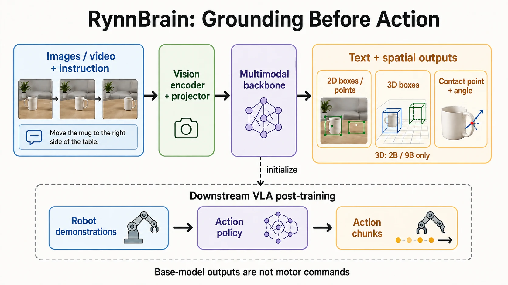

RynnBrain 最值得研究的地方，不是把机器人接到一个能聊天的模型上，而是尝试让模型的回答具有明确的**对象、位置、时间和交互含义**。例如，“拿起杯子”需要继续回答：哪一个杯子、出现在哪一帧、接触哪里、目标是否仍然可见，以及这个判断如何进入动作策略。

本文核对到 **2026-09-05**。[官方仓库](https://github.com/alibaba-damo-academy/RynnBrain)的主分支此时已是 **RynnBrain 1.1**；1.0 的推理、导航与规划代码保留在历史分支。全文以 1.1 为主线，同时解释 1.0 提出的基础思路，不把不同版本的规模、模型名、训练脚本和实验数字混在一起。

文中有三类内容：官方材料直接支持的事实、基于接口与数学的个人分析、本文提供的离线教学实验。**没有在本地复现大模型训练、权重推理或真实机器人成功率**；文中的实验指标均标明出处。

## 1. 阅读路线与核心结论

如果你关注模型原理，先读第 2～6 节；如果准备接入机器人，重点看第 7～10 节；如果要复现，直接从第 11 节的代码与第 12 节的源码核对开始。

第一次阅读可沿“[基础架构](#3-架构为什么它首先仍是一个多模态基础模型) → [三维投影算例](#84-把三维框重新投影回图像) → [CPU 输入检查](#114-先在-cpu-上检查真实输入)”前进，再回看训练与评测。公式、代码和模型指标分别对应不同的验收问题，不必一次背完所有名词。

先记住四个区别：

1. **具身 VLM 不等于动作策略。** 输出位置和计划，与输出可执行动作块，是不同接口。
2. **图像坐标不等于机器人坐标。** 归一化点、像素点、相机三维点、基座三维点之间需要不同的转换。
3. **视觉历史不等于永久记忆。** 输入了哪些帧、如何采样、上下文是否截断，决定模型实际能利用什么信息。
4. **基础模型能力提升不等于任意平台零样本成功。** 动作表示、示教分布、执行控制器和任务评价都需要单独核对。



## 2. 版本、模型与开源内容：先确定你在研究哪一个 RynnBrain

### 2.1 1.0 与 1.1 的对应关系

| 维度 | RynnBrain 1.0 | RynnBrain 1.1 |
| --- | --- | --- |
| 基础模型家族 | Qwen3-VL | Qwen3.5 |
| 首篇报告的主要规模 | 2B、8B、30B-A3B | 2B、9B、122B-A10B |
| 空间输出主线 | 物体、区域、可供性、轨迹 | 保留基础任务，增加接触点与三维定位 |
| 下游研究方向 | CoP、Nav、Plan、VLA | 强调跨本体动作建模及真实机器人迁移 |
| 阅读入口 | `rynnbrain1.0` 分支 | 当前主分支与 RynnScale |

这些是版本定位，不是完整权重清单；例如 1.0 后续还发布了 4B。完整发布状态应分别查[1.0 分支](https://github.com/alibaba-damo-academy/RynnBrain/tree/rynnbrain1.0)与[当前 Model Zoo](https://github.com/alibaba-damo-academy/RynnBrain#model-zoo)，不能用首篇论文的表格代替当前模型仓库。

`122B-A10B` 中的两个数字分别描述总规模与激活规模。即使每个 token 只路由到一部分专家，大多数部署方式仍需存放完整专家权重，因此不能按“10B 模型”计算全部显存。

### 2.2 原生 3D 能力的范围要单独注明

1.1 报告将原生 3D Grounding 的明确训练与评估范围限定在 **2B 和 9B**；接触点预测则是该系列新增能力。不能因为 122B 更大，就自行给它补上相同的三维监督与评估结论。[来源：1.1 报告](https://arxiv.org/html/2607.17977v1)

这是一个很有启发性的例子：模型规模、数据覆盖和任务接口是三个独立维度。选模型时应先问“有没有针对这个任务训练和验证”，再看参数量。

### 2.3 开源仓库并不只有一个入口

| 入口 | 适合检查什么 | 不应据此假定什么 |
| --- | --- | --- |
| RynnBrain 主仓库 | 推理入口、Cookbook、模型链接 | 每一种机器人策略都已附完整权重与驱动 |
| Hugging Face 模型仓库 | 权重、配置、Processor、许可证标注 | 论文全部训练数据都包含在模型仓库 |
| RynnScale | VLM 训练、数据处理、评测框架 | README 的占位路径能够直接执行 |
| 1.0 的 `reasoning/navigation/planning` | 历史任务配方 | 换成 1.1 权重后所有脚本无需适配 |
| RynnBrain-Bench | 数据格式、任务分类与评估输入 | 数据下载分片名称就是训练/验证隔离策略 |

核对的 RynnScale 项目 README 中，`RynnBrain-VLA` 小节仍是 `TBD...`。因此本文不会给出一个虚构的“训练全部 1.1 VLA 并部署所有机器人”的一键命令。[固定版本源码](https://github.com/alibaba-damo-academy/RynnScale/blob/aaedf103bff9ff2ede3c6c900537b15a49801dd9/projects/rynn_brain/README.md)

## 3. 架构：为什么它首先仍是一个多模态基础模型

### 3.1 一条输入链，多个输出任务

从接口上，可将基础模型抽象为：

$$
p_\theta(Y\mid I_{1:T},Q),
$$

其中 $I_{1:T}$ 是输入图像或采样帧，$Q$ 是任务指令，$Y$ 可以混合语言与空间表示。

视觉编码器把像素转为特征；视觉—语言投影模块对齐特征维度；语言骨干在任务指令条件下生成目标序列。模型并不是每遇到一种任务就必须增加一个独立的传统检测头。[架构入口：官方 README](https://github.com/alibaba-damo-academy/RynnBrain#model-architecture)

用工程语言理解，这种设计把“输出什么”更多地交给了数据和任务格式。但它也带来一个代价：**语法合法性、数值范围和物理可行性不会因为输出经过 softmax 就自动成立。**

例如，模型可能生成一个看起来合理、实际越界的点；也可能输出合法坐标，却指向错误对象。两种错误需要不同的检查。

### 3.2 不能把 1.1 的每一层都画成普通全注意力

核对 [RynnBrain1.1-2B 的配置](https://huggingface.co/Alibaba-DAMO-Academy/RynnBrain1.1-2B/blob/b4663299019d15468301f64435539632daed7985/config.json)，可见：

| 配置项 | 2B 检查点的值 | 阅读含义 |
| --- | --- | --- |
| `model_type` | `qwen3_5` | 必须使用支持这一架构的加载实现 |
| `num_hidden_layers` | 24 | 这是该检查点的文本骨干配置 |
| `hidden_size` | 2048 | 不是所有 RynnBrain 的统一维度 |
| `layer_types` | 每组三层 `linear_attention`，一层 `full_attention` | 不能套用全层普通 Attention 的缓存模型 |
| `spatial_merge_size` | 2 | 视觉侧有空间合并配置 |
| `deepstack_visual_indexes` | 空列表 | 不应仅凭论文的家族描述宣称这个文件启用了指定 DeepStack 注入层 |

这里的重点不是记参数，而是学会交叉验证：**论文解释设计思路，配置描述具体检查点，运行实现决定实际行为。** 三者有出入时，要记录差异，而不是选择最容易讲故事的一份。

### 3.3 “记住刚才看到的杯子”具体需要什么

考虑一个自拟例子：第一帧看见杯子在柜子上，随后相机转向桌面，最后用户问“刚才的杯子在哪里”。

系统至少要保留：

- 帧的先后关系及其对应时间；
- 同一对象跨视角的身份线索；
- 回答中坐标究竟属于哪一帧；
- 当前视图是否仍包含可以执行的目标。

因此，历史帧中的正确定位只能回答“过去在哪里”。如果要现在抓取，还需要重新观测或把历史观测纳入可信的状态估计。这是由输入输出接口推导出的工程要求，不是模型已经实现 SLAM 或永久记忆的证据。

## 4. 空间输出：比“说对物体名字”多了哪些约束

### 4.1 五类任务不能合并为一个“检测”

官方训练格式为不同任务使用带标签的空间序列，且视频输出可能带帧索引。[数据格式来源](https://github.com/alibaba-damo-academy/RynnScale/blob/aaedf103bff9ff2ede3c6c900537b15a49801dd9/projects/rynn_brain/README.md)

| 任务 | 自拟问题 | 需要验证的输出 |
| --- | --- | --- |
| Object grounding | 哪一个是蓝色杯子？ | 目标身份与二维框 |
| Area localization | 桌上哪里可以放杯子？ | 满足条件的区域，而不只是任意空白像素 |
| Affordance localization | 应该从哪里拿起杯子？ | 与操作意图相关的点 |
| Trajectory localization | 手刚才怎样移动？ | 对应时序与图像参考系的路径点 |
| Contact prediction | 接触哪里、平面内朝向如何？ | 接触点及角度协议 |

“检测杯子”与“找到杯柄”不是同一个标注问题。前者可由整物体框表达；后者与部件、物体姿态和指令有关。训练数据如果只覆盖前者，不能期待模型自动获得可靠的操作接口。

### 4.2 为什么用 `[0,1000]`，又为什么不能乱乘图像宽度

归一化坐标降低了输出与图像分辨率的直接耦合。下面采用官方接触点 Cookbook 的**像素中心索引约定**：

$$
u=\frac{x_n}{1000}(W-1),\qquad
v=\frac{y_n}{1000}(H-1).
$$

这样 $x_n=1000$ 对应最后一个像素中心 $W-1$，而不是数组越界的 $W$。[接触点可视化源码](https://github.com/alibaba-damo-academy/RynnBrain/blob/5b8641993fd265300dba89f079d9b708ffe19ed4/cookbooks/7_contact_point_prediction.ipynb)

不要把这个约定无条件套用到所有检测器。某些框协议描述的是连续图像边界，使用 $W,H$ 也有合理含义。**点和框、像素中心和图像边界，必须在接口契约里写清。**

还有一个容易遗漏的顺序：先确定模型看到的是原图、缩放图还是裁剪图，再恢复坐标。若先裁剪了左上角偏移 $(u_0,v_0)$ 的区域，恢复到原图时还要加回偏移；若做了填充，则先去除 padding。

### 4.3 量化误差与模型误差不是一回事

在上述约定下，归一化坐标每增加 1，水平位置变化为 $(W-1)/1000$ 像素。这是表示分辨率，不是模型定位精度。

以宽度 1920 为例，一格约为 1.919 像素。即使模型始终输出整数，真正误差也可能远大于这一格：目标识别错、遮挡、透视、裁剪恢复错，都不是多保留一位小数能解决的。

## 5. 1.0 的 Chain-of-Point：把语言推理与空间证据连接起来

1.0 的 CoP（Chain-of-Point）把语言判断与空间定位交织组织；配套历史代码提供 SFT 与 RL 流程，RL 示例使用 GRPO。这里不能把 InternVL 3.5 的 GSPO 配方挪过来当成 RynnBrain-CoP 的实现。[CoP 代码与训练流程](https://github.com/alibaba-damo-academy/RynnBrain/tree/rynnbrain1.0/reasoning)

下面是为理解接口写的概念例子，不是模型实测输出，也不是必须逐字使用的官方模板：

```text
任务：找到上一次被放回抽屉的工具。
证据一：定位历史帧中的工具。
证据二：定位放置动作结束时的抽屉区域。
检查：工具身份与帧顺序是否一致。
回答：给出对应帧及空间位置；若当前不可见，要求重新观测。
```

它的价值在于给推理建立可检查的中间落点。但“写出了坐标”不保证证据真实。一个错误点如果被后续步骤当成事实，可能产生比纯语言回答更难察觉的连锁错误。

我会用三组消融来判断这种设计是否真正起作用：

1. 保留问题与当前帧，移除历史帧，看历史任务是否退化。
2. 保留所有帧但打乱顺序，检查时间敏感问题是否受到影响。
3. 保留语言判断但替换定位结果，检查后续回答是否真正依赖空间证据。

这三组是本文建议的实验，不是官方已经报告的新增结果。它们分别检查“有没有用历史”“有没有用时序”“有没有用空间证据”。

## 6. 训练：任务格式与数据组织可能比模块名更重要

### 6.1 学习目标并不神秘

基础模型的语言与离散空间输出都可以纳入自回归目标。对第 $i$ 个样本，定义需要监督的位置集合 $\mathcal S_i$，一个便于理解的样本归一化表达是：

$$
\ell_i=-\frac{1}{|\mathcal S_i|}
\sum_{t\in\mathcal S_i}\log p_\theta(y_{i,t}\mid y_{i,<t},I_i,Q_i).
$$

这里的集合不能简单设为全部输入 token：视觉占位符、问题前缀与答案监督位置要区分。1.0 报告讨论了 per-sample loss reduction 与按序列长度平衡工作负载。[1.0 训练基础设施](https://arxiv.org/html/2602.14979v1#S2)

个人理解是：一个十几个 token 的坐标答案，与一个几百 token 的说明答案，若按 token 总量混在一起归一化，实际训练权重可能与“样本采样比例”完全不同。讨论配方时，只写“某任务占 20%”是不够的，还要问损失如何归约。

### 6.2 具身数据应该教会哪些区别

与其背一长串数据集名字，不如检查训练集能否区分以下情况：

| 数据能力 | 正例应体现什么 | 特别需要的难例 |
| --- | --- | --- |
| 对象理解 | 类别、属性、计数 | 外观相似的多个实例 |
| 空间理解 | 左右、前后、支撑与相对位置 | 相机改变后关系的参考系变化 |
| 时空定位 | 哪一帧、哪个点、哪条路径 | 短暂出现、遮挡、重新出现 |
| 交互部位 | 杯柄、把手、可操作区域 | 倒置物体与指令改变 |
| 三维定位 | 位置、尺寸、朝向与内参 | 同类物体不同真实尺寸 |
| 规划 | 子任务、目标与状态变化 | 前置条件不成立与执行失败 |

这是面向数据审查的个人分类，不代表官方每一项都提供了完整公开训练集。尤其不能把自动生成的标注数量当成独立真实场景数量：同一段视频产生多个问题，会扩大样本数，却不一定增加环境多样性。

### 6.3 从公开脚本核对训练配置

核对的 [1.1-2B 训练脚本](https://github.com/alibaba-damo-academy/RynnScale/blob/aaedf103bff9ff2ede3c6c900537b15a49801dd9/projects/rynn_brain/scripts/train_rynn_brain_1_1_2b.sh)设置了：

- `model_max_length=16384`，`mm_max_length=10240`；
- `fps=2`，`max_frames=512`；
- 主学习率 `5e-6`，视觉部分学习率 `1e-6`；
- BF16、梯度检查点、序列负载均衡和 sequence 级 loss reduction。

这些值是该脚本快照的配置，不是所有 RynnBrain 训练与推理的统一上限。`max_frames=512` 与视觉长度限制同时存在，也不意味着任何 512 张高分辨率图像都能完整放进一次输入。

脚本中的模型路径、数据路径和分布式环境变量需要用户提供。论文里的 global batch size 还必须结合实际数据并行度、micro batch 与梯度累积计算，不能只从一个启动脚本的 `micro_batch_size` 推断。

## 7. 1.1 接触点：为什么“一个点加一个角度”仍不是抓取姿态

当前接触点 Cookbook 使用历史标签 `grasp pose` 序列化结果，但将其解释为二维接触点和图像平面内的无向朝向；角度按 180° 周期显示。图中的定长朝向线不是夹爪开度。[官方接触点示例](https://github.com/alibaba-damo-academy/RynnBrain/blob/5b8641993fd265300dba89f079d9b708ffe19ed4/cookbooks/7_contact_point_prediction.ipynb)

为了说明协议，可构造以下**人工示例**：

```text
<grasp pose> (500, 250), 190 </grasp pose>
```

在该可视化约定下，190° 与 10° 描述同一条无向轴。但这不意味着真实夹爪在三维空间绕任意轴旋转 180° 都等价：电缆、手腕姿态、障碍物、非对称手指都可能破坏这种等价性。

把这一输出接到机器人前，还缺少：

1. 深度或可信三维估计；
2. 相机到基座的外参；
3. 末端姿态与工具坐标约定；
4. 夹爪尺寸、接近方向与碰撞余量；
5. 逆运动学、关节限制及路径可行性；
6. 接触后的力、滑移与成功反馈。

因此，“模型在杯柄上画了一个点”可以作为一个感知结果，不能直接作为抓取成功率，更不应被描述成完整六自由度抓取解。

## 8. 1.1 的 3D Grounding：最容易出错的是单位和坐标协议

### 8.1 从单目图像到三维框，增加了什么输入

官方 3D Cookbook 以 RGB 图像和相机内参为条件，输出三维中心、局部尺寸与姿态。相机坐标约定为 $x$ 向右、$y$ 向下、$z$ 向前。[固定版本 3D 示例](https://github.com/alibaba-damo-academy/RynnBrain/blob/5b8641993fd265300dba89f079d9b708ffe19ed4/cookbooks/8_3d_grounding.ipynb)

用标准针孔关系解释为什么内参重要：

$$
u=f_x\frac{X}{Z}+c_x,\qquad
v=f_y\frac{Y}{Z}+c_y.
$$

若已知可信深度 $Z$，才可以反投影为：

$$
X=\frac{u-c_x}{f_x}Z,\qquad
Y=\frac{v-c_y}{f_y}Z.
$$

但 RGB 模型并没有直接获得真实深度传感器读数。它预测的米制尺度包含学习到的场景和物体先验；单幅图像仍存在尺度歧义。输入真实内参有助于约束问题，不会让所有单目预测变成几何真值。

### 8.2 本次核对发现的角度说明冲突

在上述固定提交的 Notebook 中，提示词一方面称角度是 radians，另一方面又把 `[-1,1]` 对应到 `[-180°,180°]`；可视化函数实际按后者转换。

两种解释在数学上不同：

$$
\theta_{\mathrm{rad}}=a
\quad\text{与}\quad
\theta_{\mathrm{rad}}=\pi a.
$$

例如输出 $a=0.5$，前者约为 28.65°，后者为 90°。本文不会把这个冲突静默“修正”为某一种协议并宣称已经得到作者确认。

如果目标是复现该 Notebook 的投影图，应明确采用其实际可视化约定，并记录转换；如果目标是接机器人，应先通过数据标注、评测实现和已知姿态样本确认单位，**不能直接把原始三个角度传入机器人驱动**。

该示例还保留了开发机路径与 `RynnBrain-8B` 模型名，同时选择了 `qwen3_5` wrapper。它们都需要按实际检查点修改。这也是本文提供独立最小推理脚本、而不声称原 Notebook 可原样运行的原因。

### 8.3 三维框不等于可用的末端目标

模型预测的是物体框；机器人需要的是工具目标。两者至少还相差一个任务相关的变换：

$$
{}^BT_{\mathrm{tool}}=
{}^BT_C\;{}^CT_O\;{}^OT_{\mathrm{tool}}.
$$

这里 $B,C,O$ 分别表示基座、相机和物体坐标系。物体到工具的相对变换取决于抓取策略，不是检测框自动提供的字段。

对于对称物体，三维框的朝向还可能不唯一。比较姿态误差时应考虑物体对称性，否则“框看起来一样”与“欧拉角逐项接近”可能给出不同结论。

### 8.4 把三维框重新投影回图像

一个很实用的调试闭环是：**中心、尺寸、角度 → 八个角点 → 像素投影 → 对照原图**。这能够暴露单位、轴顺序和内参错误，但不能单凭投影相似证明三维深度正确。

固定版本 Cookbook 的 `euler_to_rotation_matrix` 将三个输出依次用于绕 $x,y,z$ 轴旋转，再组合为 $R_zR_yR_x$。虽然变量叫 `pitch,yaw,roll`，它们的轴对应关系不能套用另一个机器人库对同名变量的解释；`box3d_corners_from_params` 则使用完整边长的一半构造局部角点。[对应源码](https://github.com/alibaba-damo-academy/RynnBrain/blob/5b8641993fd265300dba89f079d9b708ffe19ed4/cookbooks/8_3d_grounding.ipynb)

本文统一写成轴角参数 $(\alpha_x,\alpha_y,\alpha_z)$，采用**列向量、主动旋转**：

$$
\begin{aligned}
R&=R_z(\alpha_z)R_y(\alpha_y)R_x(\alpha_x),\\
p_C&=Rp_O+c.
\end{aligned}
$$

按这个乘法顺序，最右侧的 $R_x$ 先作用；如果代码存的是行向量，则等价写法是 `local @ R.T + center`，不是 `local @ R + center`。

设完整尺寸为 $(d_x,d_y,d_z)$，八个局部角点来自：

$$
\begin{aligned}
p_O&=\left(s_x\frac{d_x}{2},s_y\frac{d_y}{2},s_z\frac{d_z}{2}\right)^T,\\
s_x,s_y,s_z&\in\{-1,+1\}.
\end{aligned}
$$

下面是**独立构造的几何算例**，没有调用模型。中心在相机前方 2 米，尺寸为 `0.6×0.2×0.4` 米：

```python
from grounding_contracts import box_corners, project_point

corners = box_corners(
    center=(0, 0, 2), dimensions=(0.6, 0.2, 0.4),
    angles=(0, 0, 0), encoding="radians",
)
uv = project_point(corners[0], fx=1000, fy=1000, cx=960, cy=540)
print(corners[0])                        # (-0.3, -0.1, 1.8)
print(tuple(round(value, 2) for value in uv))  # (793.33, 484.44)
```

若改成 `angles=(0,0,0.5), encoding="normalized_pi"`，表示按本文协议绕 $z$ 轴转 90°，第一个角点变为约 `(0.1,-0.3,1.8)`。如果把同样的 `0.5` 当成弧度，就不会得到这个结果。

附带代码检查正边长和有限数；投影时拒绝 $Z\leq0$ 的点，而不是除以一个很小的正数把它“修好”。真正绘制跨越相机近裁剪面的边，还需要线段裁剪；本例只验证角点几何，不实现完整渲染器。

### 8.5 缩放、裁剪和相机内参必须属于同一张图

假设你在模型输入之前明确执行了一个已知像素变换：

$$
u'=s_xu+o_x,\qquad v'=s_yv+o_y.
$$

把第 8.1 节的针孔关系代入，可得对应内参：

$$
\begin{aligned}
f'_x&=s_xf_x,& f'_y&=s_yf_y,\\
c'_x&=s_xc_x+o_x,& c'_y&=s_yc_y+o_y.
\end{aligned}
$$

例如先从原图左侧裁去 100 像素，再按原点对齐的坐标约定缩小一半，则 $s_x=0.5,o_x=-50$。原 `fx=1000,cx=960` 应对应 `fx'=500,cx'=430`；只修改焦距、不移动主点是不完整的。

这个例子先声明了坐标变换。真实缩放器若采用 half-pixel 采样，还会有半像素偏移；畸变矫正和旋转也不能概括成随意乘一个比例。不要仅凭输出图尺寸反猜完整变换，更不要自行把 Processor 内部 tile 的局部坐标当成模型协议中的全图坐标。

最小脚本只接受没有 EXIF 方向标签或方向值为 1 的图片，保留文件存储的像素方向，不静默旋转。手机图片若需要转正，应先统一图像、像素标注与相机约定。Notebook 在缺少内参时还有假设视场角的回退示例；这适合演示接口，**不等于完成了相机标定**。[官方自定义输入示例](https://github.com/alibaba-damo-academy/RynnBrain/blob/5b8641993fd265300dba89f079d9b708ffe19ed4/cookbooks/8_3d_grounding.ipynb)

## 9. RynnBrain-VLA：动作建模与基础 VLM 的分界线

### 9.1 从文本生成切换到动作块预测

1.1 的 VLA 描述采用 single-stream DiT 与 flow matching，将语言、视觉、机器人状态和带噪动作块放入一个交互模型；动作块位于序列末端以支持前缀缓存。这属于下游动作策略，不是基础模型 `.generate()` 多输出几行文本。[1.1 报告，第 4 节](https://arxiv.org/html/2607.17977v1#S4)

下面用一般 flow matching 写法解释它在学什么，**不是逐行复刻官方实现**。设 $A$ 是示教动作块，$\epsilon$ 是噪声，取：

$$
A_\tau=(1-\tau)\epsilon+\tau A,\qquad
u^*=A-\epsilon.
$$

模型在观测条件 $C$ 下拟合速度场：

$$
\mathcal L_{\mathrm{FM}}=
\mathbb E\left[\|v_\theta(A_\tau,\tau,C)-u^*\|^2\right].
$$

推理时从噪声出发积分得到动作块。这与离散语言 token 的逐个采样不同；工程上需要额外确认噪声路径、时间方向、动作归一化和求解步数，不能只凭这一公式猜官方超参数。

### 9.2 81 维统一动作空间的含义

报告将统一空间分为以下语义组：

| 组 | 维数 |
| --- | ---: |
| Arm-Joint | 14 |
| Arm-EEF | 18 |
| Gripper | 2 |
| Hand | 40 |
| Torso | 4 |
| Head | 3 |
| 合计 | 81 |

具体机器人只激活可用部分。G1 的独立 64 维 SONIC latent **不包含在这 81 维中**，不能把二者相加后说成每个平台都输出同样的关节向量。[动作空间出处：报告图 3 与第 4.2 节](https://arxiv.org/html/2607.17977v1#S4.S2)

理解 mask 的关键：不存在的自由度不应被当作“目标值恰好为零”的有效训练标签。一个教学损失可以写为：

$$
\ell=\frac{\sum_{h,d}m_d(\hat u_{h,d}-u_{h,d})^2}
{H\sum_d m_d},\qquad \sum_d m_d>0.
$$

这里 $H$ 是动作块长度。实际系统还可能有时间步 mask、不同动作组的权重及各本体的归一化统计，不能把这个简式当成完整训练配方。

### 9.3 统一向量不等于统一驱动

即使两个机器人都有“左臂关节”字段，关节数量、方向、零位、可动范围、控制模式仍然可能不同。动作组按语义对齐后，还需要适配层把策略输出变成平台的合法输入。

我会在适配层强制记录：关节顺序、单位、绝对/增量模式、时间戳、执行时长、归一化统计版本，以及缺失动作组的处理规则。任何一项不匹配，都可能让形状完全正确的张量产生错误动作。

### 9.4 动作块能减轻调用开销，也会带来延迟问题

假设推理耗时 $d$ 秒，控制周期为 $\Delta t$。在新结果返回时，大约已有 $d/\Delta t$ 个控制步过去。若每次把一个新动作块从头强行覆盖旧动作，可能产生不连续。

因此应区分策略推理频率、动作块覆盖时长与底层伺服频率。论文讨论的 RTC 是处理动作块实时衔接的一部分；不能由“模型能够一次预测多个动作”推出它能够直接替代底层实时控制与安全监控。[RTC 相关设计出处](https://arxiv.org/html/2607.17977v1#S4.S4)

## 10. 实验怎么读：离线空间能力与机器人完成率要分开

### 10.1 RynnBrain-Bench 在测什么

官方数据卡介绍该基准包含 **3,616 段视频、12,000 道开放式问题、21 项子能力**，覆盖对象认知、空间认知、Grounding 与 Pointing。它是具身理解评测，不是 12,000 次机器人抓取试验。[基准数据卡](https://huggingface.co/datasets/Alibaba-DAMO-Academy/RynnBrain-Bench)

建议分别看答案正确性、空间误差、格式有效率和跨帧一致性。若一个模型经常不按格式回答，应同时报告格式失败率；不能把无法解析的样本全部丢弃后，只评价剩余样本。

此外，视频级隔离通常比问答行级随机切分更有意义。同一视频中的多个问题如果分别进入训练和测试，模型可能利用场景重叠获得过于乐观的成绩。

### 10.2 报告中的真实机器人对照

下面只摘录 1.1 报告表 6 的最终成功率，单位为百分比，不混入过程得分：

| 模型 | 撒花瓣 | 倒酒 | 取锅铲 | 三任务平均 |
| --- | ---: | ---: | ---: | ---: |
| Qwen-Based-VLA | 65 | 65 | 50 | 60.00 |
| RynnBrain-VLA | 85 | 80 | 95 | 86.67 |
| RynnBrain-VLA Generalist | 85 | 95 | 95 | 91.67 |

每个任务进行 20 次尝试；前两个任务在 Astribot，第三个在 Tianji-Wuji。表中前两种模型采用相同 VLA 后训练配方与动作块长度，因而比跨不同完整系统的比较更接近“更换基础模型”的研究问题。[原始协议与完整对照表](https://arxiv.org/html/2607.17977v1#S5.S6)

个人解读有四点：

- 20 次试验中，一次成败对应 5 个百分点，因此不应把小差异解释为极其精确的总体概率差。
- 过程得分高表示完成了更多子任务，不表示整项任务成功。
- Generalist 的改进支持在这些设置下联合训练的价值，不证明任意新机器人都能零样本迁移。
- 若比较完整基线，应保留动作块、控制器和数据设置；不能只拎出一个平均数做“全面领先”的结论。

## 11. 可运行的入门材料：先离线验证协议，再尝试模型

### 11.1 不下载权重的坐标与接口练习

本文附带 [grounding_contracts.py](grounding_contracts.py)，仅使用 Python 标准库，包含：归一化接触点解析、像素映射、针孔投影与反投影、显式角度编解码、旋转矩阵、三维框角点及 mask 损失检查。

在本文页面包目录运行：

```bash
python3 grounding_contracts.py
```

它验证的是**自拟数值和错误输入的处理**，不是 RynnBrain 模型精度。程序会拒绝越界坐标、非有限数、未知角度编码、非正深度和空动作 mask。

例如，接触点 `(500,250)` 在 `1920×1080` 图像上应映射到 `(959.5,269.75)`；若 `fx=fy=1000`、主点为 `(960,540)`、输入像素为 `(1060,540)` 且深度为 2 米，则反投影结果为 `(0.2,0,2)` 米。

### 11.2 单图最小推理，不直接控制硬件

附带的 [infer_image.py](infer_image.py)固定使用 `RynnBrain1.1-2B` 及本次核对的权重 revision，沿官方 `AutoProcessor` 与 `AutoModelForImageTextToText` 路线加载。它只读取本地图像并打印生成回答，不发送机器人命令。[官方推理入口](https://github.com/alibaba-damo-academy/RynnBrain#quick-start)

建议单独建环境，避免与 InternVL 的研究环境混装：

```bash
python3 -m venv .venv-rynnbrain
source .venv-rynnbrain/bin/activate
python -m pip install --upgrade pip
# 先按本机 CUDA/驱动选择兼容的 PyTorch 与匹配的 torchvision。
python -m pip install "transformers==5.2.0" pillow
python infer_image.py --image /absolute/path/to/scene.jpg
```

脚本会先检查 CUDA 与图像路径；支持 BF16 时使用 BF16，否则使用 FP16。首次运行会下载模型权重。未在本文工作环境执行完整权重推理，因此这里不承诺某张显卡的实际延迟或峰值显存。

已执行的检查仅覆盖固定 revision 的原生模型类解析与 CPU 输入构造：使用本站 Transformer 文章的结构图和提示词 `Describe the diagram.`，生成 1526 个输入 token，浮点图像张量均为有限值，并核对了关闭 Thinking 时的模板前缀。这验证 Processor 与输入接口可以对接，**不验证模型是否答对**。脚本先渲染聊天模板，再处理图片，避免 Transformers 5.2.0 把 `enable_thinking` 同时转发给图像处理器所产生的无效参数警告。

从 [2B 模型文件元数据](https://huggingface.co/api/models/Alibaba-DAMO-Academy/RynnBrain1.1-2B)可核对约 22.13 亿个 BF16 参数。仅参数存储约为 $2.213\times10^9\times2$ 字节，即约 4.43 GB；**这不是所需显存**，还需输入、激活、缓存和运行时余量。

### 11.3 推理成功后的建议顺序

先让模型描述场景，再使用官方对应任务的提示模板测试对象定位、接触点或三维框。每一步保留原始回答，随后独立解析与画图，不要让解析函数暗中改变任务语义。

对于 3D 任务，先用尺寸、距离和相机内参已知的静态场景做交叉验证；对于动作策略，先使用记录数据或仿真回放，最后才进入带有独立限位、碰撞检查和急停的真实平台流程。

### 11.4 先在 CPU 上检查真实输入

安装匹配的 Transformers、Pillow 和 CPU 版 PyTorch 后，不必先准备 GPU 或下载全部权重。进入本文页面包目录，运行：

```bash
python infer_image.py --image /absolute/path/to/scene.jpg --prepare-only
```

这个模式调用真正的 Processor，并输出 JSON：模型 revision、库版本、图像尺寸、输入 token 数、各张量形状以及输出预算。它不会构造模型参数或调用 `generate()`；第一次仍可能下载 Tokenizer、Processor 等小文件。

小文件缓存齐全后，可以明确禁用 Hub 网络访问：

```bash
HF_HUB_OFFLINE=1 python infer_image.py \
  --image /absolute/path/to/scene.jpg \
  --prepare-only --local-files-only
```

这里的“离线”与 `grounding_contracts.py` 不同：后者只需要标准库，前者还需要已安装的深度学习依赖和缓存文件。缓存不足时应明确失败，不会自动切换另一个模型。

本例的 `--max-input-tokens` 只约束输入，默认上限 16384；`--max-new-tokens` 是单独的生成上限。这是教学入口的保护阈值，不表示任意输入加任意回答都在论文的训练长度之内。准备阶段会在加载权重前拒绝超限输入；它不做截断，因为随意截断可能破坏视觉占位与特征的一一对应。

### 11.5 失败发生在哪一层，就检查哪一层

| 现象 | 优先检查 | 不能由此推出 |
| --- | --- | --- |
| 模型架构无法识别 | 环境是否确实为脚本要求的 5.2.0、revision 是否匹配 | 权重损坏或模型能力差 |
| 离线模式找不到文件 | 对应 revision 的处理器与 Tokenizer 是否缓存完整 | 必须下载全部模型权重才能检查输入 |
| 空间结果整体偏移 | 裁剪、缩放、图像方向、像素中心与内参 | 加长 Thinking 一定能修正 |
| 三维框绕错轴 | 角度单位、轴对应、列/行向量、乘法顺序 | 只要交换两个数字就一定正确 |
| 输出合法但目标错误 | 对象身份、遮挡和任务语义 | 严格解析器已经保证物理正确性 |

排查时保存原始输入和原始回答；任何单位转换、坐标恢复、拒绝原因都应单独记录，才能定位是模型判断错，还是后处理改错了。

## 12. 源码阅读清单：如何避开“看起来可以运行”的示例

| 检查项 | 本次核对看到的风险 | 正确处理 |
| --- | --- | --- |
| 版本路径 | 1.0 功能保留在历史分支 | 记录仓库 commit 与模型 revision |
| 3D 角度 | radians 描述与归一化转换冲突 | 明确 codec，利用已知姿态核验 |
| 3D 模型选择 | Notebook 的模型名与 wrapper 家族不一致 | 根据实际配置选择正确检查点 |
| 开发机路径 | 示例包含不可移植路径 | 改为用户提供路径，不复制开发机目录结构 |
| 数据 JSON | 文档示意与严格 JSON 不完全等价 | 通过解析器后再交给训练入口 |
| 接触点标签 | 历史名称不等于完整抓取姿态 | 按该版本实际输出语义解析 |
| VLA 开源状态 | RynnScale 项目小节仍为占位 | 不宣称已有可复现全部硬件结果的一键脚本 |

这些结论固定于本文记录的提交，不代表未来版本仍有同样的问题。进一步开发时，应重新核对上游变化，并把本地修正与原始论文结论分开记录。

## 13. 与 InternVL 3.5、Being-0 该怎样放在一起理解

RynnBrain 更适合沿“时空观测—空间语义—机器人策略迁移”这条线研究；[InternVL 3.5](../internvl-3-5/)更适合沿“通用多模态输入—推理后训练—视觉 token 与服务效率”研究。

[Being-0](/posts/thesis/being_0/)则提供了另一种系统视角：高层理解、连接协调与既有技能的衔接。它们可以帮助解释不同层的职责，但不能把不同论文的成功率直接排成统一排行榜。

如果目标是做自己的机器人系统，我会先写一份输入输出契约，再选择模型：系统需要的是对象描述、位置、目标姿态、技能调用，还是动作块？缺少哪个中间环节，决定了后续适配工作量。

## 14. 局限、可研究的问题与复现记录

值得继续研究的不是单一“能不能抓”的演示，而是：

- 历史帧选择策略是否影响短事件与遮挡恢复；
- 三维估计在真实尺寸变化、镜面、透明物体上的失效方式；
- 接触点的多个合理答案应如何评价；
- 空间输出错误如何传播到规划和动作；
- 联合训练的提升来自共享视觉知识，还是更多任务数据本身；
- 不同机器人、相机与控制模式下，哪些模块可以复用，哪些必须重新学习。

每次实验至少记录：模型及 revision、代码 commit、图像预处理、帧采样与时间戳、任务提示版本、输出解析器、随机种子、解码预算、失败计数与硬件配置。只保留成功截图，无法支持可重复的能力结论。

## 阅读自测与验收

- 能否明确区分 1.0 与 1.1、2B/9B 的 3D 能力范围，以及基础 VLM 的空间输出与 VLA 动作块？用官方配置和模型 ID 逐项核对。
- 运行离线协议测试，解释归一化点、相机内参、角度编码和动作 mask 的作用；面对非法输出应拒绝执行，而不是自动裁剪成貌似可用的命令。
- 用一个已知三维姿态样本分别检查两种角度解释，记录不能确定的协议；不把生成图、Notebook 可视化或本文自拟算例当成真实机器人结果。
- 能否按明确的轴顺序构造八个角点并投影回图像，再用 CPU 预检查验证真实输入预算？区分几何一致、接口可用和模型判断正确这三种结论。

## 参考材料与版本快照

- [RynnBrain 1.0 报告：2602.14979v1](https://arxiv.org/html/2602.14979v1)：原始问题定义与 CoP、Nav、Plan、VLA 研究路线。
- [RynnBrain 1.1 报告：2607.17977v1](https://arxiv.org/html/2607.17977v1)：1.1 能力范围、动作空间与实验协议。
- [RynnBrain 仓库快照：5b86419](https://github.com/alibaba-damo-academy/RynnBrain/tree/5b8641993fd265300dba89f079d9b708ffe19ed4)：本文源码核对基线。
- [RynnScale 快照：aaedf10](https://github.com/alibaba-damo-academy/RynnScale/tree/aaedf103bff9ff2ede3c6c900537b15a49801dd9)：公开训练与评估入口。
- [RynnBrain1.1-2B 模型卡](https://huggingface.co/Alibaba-DAMO-Academy/RynnBrain1.1-2B)：权重 revision 为 `b4663299019d15468301f64435539632daed7985`。

模型卡和代码仓库标注 Apache-2.0；实际使用还应分别核对所用权重与数据的具体许可，不把仓库许可证自动扩展为所有第三方数据的授权。
