本文从 Transformer 层的全局结构出发，逐步拆解单头自注意力、多头自注意力及其配套模块。全文包含公式、形状分析和可直接运行的 PyTorch 示例，不依赖外部源码。

> **学习目标**：读完后，你应该能解释 `X → Q/K/V → scores → attn → output` 的全过程，并能独立写出单头和多头自注意力的张量形状。

本文默认读者了解 Python、矩阵乘法和 PyTorch 张量。代码建议使用 Python 3.10+ 与 PyTorch 2.x；除明确标出的训练示例外，CPU 即可运行。公式使用行向量批处理约定，因此 `nn.Linear` 对应写成 `XWᵀ+b`。

## 阅读路线

1. 先用第 1 节建立 Transformer 层的全局认识。
2. 再用第 3～4 节理解单头注意力的公式与代码。
3. 掌握单头后，阅读第 5～6 节的多头拆分和形状变化。
4. 最后组合完整 Block，并完成文末的自测与动手实验。

### 快速目录

- [Transformer 全貌](#1-先看-transformer-层的全貌)
- [符号与张量维度](#21-张量符号与示例配置)
- [Attention 的目标与连接方式](#22-单头多头与-window-attention-的目标)
- [X 到 Q/K/V](#3-x-如何变成-qkv)
- [单头注意力与 Softmax](#4-单头缩放点积注意力)
- [多头注意力](#5-从单头过渡到多头)
- [完整单头/多头代码](#7-单头注意力完整示例)
- [Transformer 配套模块](#9-transformer-的其他模块)
- [现代 Transformer 改进](#10-现代-transformer-常用改进)
- [MoE、并行与量化](#11-模型扩展与训练并行)
- [文本生成与解码](#12-文本生成与解码加速)
- [端到端 MiniGPT](#13-端到端-minigpt从-token-到一次参数更新)
- [三类 Transformer 架构](#14-encoderdecoder-与-encoder-decoder)
- [Tokenizer 与 Batch](#15-tokenizerpacking-与-batch)
- [训练工程与稳定性](#16-训练工程与稳定性)
- [评测与排错](#17-评测监控与排错)
- [Attention 方法全景](#18-attention-方法全景)
- [代码与形状速查](#19-代码与形状速查)
- [运行、自测与完成标准](#20-运行与自测)

### 配图阅读约定（图例）

全文配图的具体颜色会随主题变化，应优先看框内文字与箭头。下面这些符号保持一致：

| 图形或符号 | 含义 |
|---|---|
| 矩阵的行 / 列 | Attention 图中通常分别表示 Query / Key |
| 彩色单元格 / 灰色单元格 | 允许关注 / 被 Mask 屏蔽 |
| 绕过子层的弧线 | 残差连接（Residual Connection） |
| `+` 或 `⊕` | 形状相同张量的逐元素相加 |
| `×`、`·` 或连线汇入 | 矩阵乘法、点积或加权汇总，以相邻标签为准 |
| `B, T, C, H, Dh, Cff` | Batch、序列长度、模型维度、Head 数、每头维度、FFN 中间维度 |

图号按照正文首次出现顺序连续编号；图注不仅说明“画了什么”，也会指出阅读该图时需要注意的适用范围。

## 1. 先看 Transformer 层的全貌

Transformer 处理的不是原始文字，而是 token 对应的向量。一个典型的 Transformer 层由注意力子层和前馈网络组成，两个子层外都有残差连接与归一化。

<figure class="article-figure">
  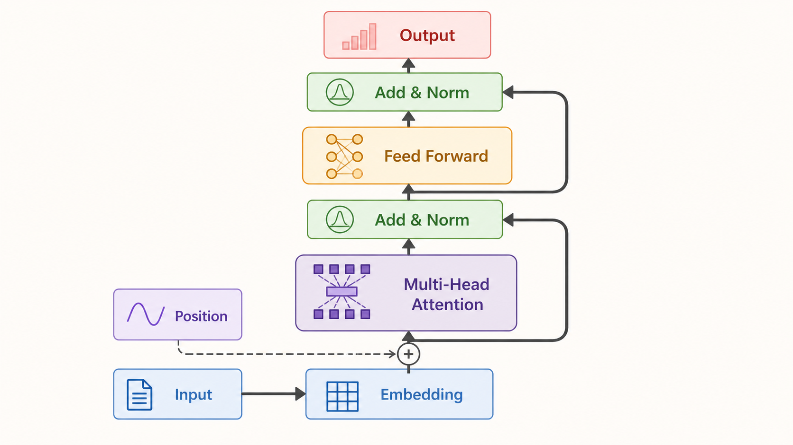
  <figcaption>
    <span class="article-figure__number">图 1</span>
    <span class="article-figure__text">Post-Norm Transformer 层的主要数据流；弧形箭头表示残差连接。Pre-Norm 会把 Norm 移到子层之前。</span>
  </figcaption>
</figure>

各部分职责：

| 组件 | 作用 |
|---|---|
| Embedding | 把离散 token ID 转为连续向量 |
| 位置编码 | 注入 token 的顺序信息 |
| Self-Attention | 让每个 token 汇总其他 token 的信息 |
| Feed-Forward | 独立变换每个 token 的特征 |
| 残差与归一化 | 保留原信息并稳定训练 |

本文先放大讲解图中的 **Self-Attention 核心**，再逐步补齐其余模块。

> **范围提示**：不同模型可能采用 Pre-Norm 或 Post-Norm，LayerNorm 的位置会不同；这不影响本文讲解的 Attention 核心计算。

## 2. Attention 要解决什么问题

假设一句话经过 embedding 后得到：

$$
X\in\mathbb{R}^{B\times T\times C}
$$

其中 `B` 是 batch size，`T` 是 token 数，`C` 是每个 token 的特征维度。Attention 的目标是：对每个 token，计算它应该从其他 token 获取多少信息。

### 2.1 张量符号与示例配置

后文会反复使用这些缩写。括号内给出英文来源，便于结合代码和论文阅读：

```python
import torch

B = 32  # B = Batch Size：一次输入 32 个样本
T = 5   # T = Token Count / Sequence Length：每个样本包含 5 个 token
C = 48  # C = Channels / Hidden Dimension：每个 token 有 48 维特征
H = 8   # H = Number of Heads：把 48 维拆成 8 个 attention heads
Dh = C // H  # Dh = Head Dimension：每个 head 处理 6 维特征

x = torch.randn(B, T, C)  # 输入形状：[32, 5, 48]
```

| 符号 | 英文全称 | 中文含义 | 常见位置 |
|---|---|---|---|
| `B` | Batch size | 一批中的样本数 | 所有张量的第 1 维 |
| `T` | Tokens / Sequence length | 每个样本的 token 数 | `[B,T,C]` 的第 2 维 |
| `C` | Channels / Hidden dimension | 每个 token 的特征维度 | `[B,T,C]` 的最后一维 |
| `H` | Heads | Query head 数 | 多头张量的第 2 维 |
| `Dh` | Head dimension | 每个 head 的特征维度，`C // H` | `[B,H,T,Dh]` |
| `Tq` | Query sequence length | Query 序列长度 | Cross-Attention 输出长度 |
| `Tk` | Key sequence length | Context/Key 序列长度 | Cross-Attention 被查询长度 |
| `V_vocab` | Vocabulary size | 词表大小 | logits 的最后一维 |
| `E` | Experts | MoE 专家数量 | Router 输出的最后一维 |
| `N` | Number of layers/items | 层数或元素总数 | `Blocks × N`、Loss 平均项 |

> **避免混淆**：公式中的大写 `V` 通常表示 Value 张量；词表大小建议写成 `V_vocab`，虽然一些图和论文会把它简写为 `V`。

Attention 公式中还会使用以下字母：

| 字母 | 英文全称 | 中文解释 |
|---|---|---|
| `X` | Input | 输入的 token 特征张量 |
| `Q` | Query | 查询：当前 token 想寻找什么信息 |
| `K` | Key | 键：每个 token 用什么特征接受匹配 |
| `V` | Value | 值：匹配后真正被加权汇总的内容 |
| `Wq` | Query Projection Weight | 生成 Query 的投影权重 |
| `Wk` | Key Projection Weight | 生成 Key 的投影权重 |
| `Wv` | Value Projection Weight | 生成 Value 的投影权重 |
| `Wo` | Output Projection Weight | 多头拼接后的输出投影权重 |
| `S` / `scores` | Attention Scores | softmax 前的注意力分数 |
| `A` / `attn` | Attention Weights | softmax 后的注意力概率 |
| `M` / `mask` | Attention Mask | 被加入分数矩阵的屏蔽信息 |
| `O` / `out` | Output | Attention 加权汇总后的输出 |
| `P` / `probs` | Probabilities | 归一化后的概率分布 |
| `L` / `loss` | Loss | 用于反向传播的损失值 |

例如在“我爱你”中，每个 token 都会根据与其他 token 的相关程度重新汇总信息，从而得到包含上下文的表示。

可以先记住一句话：**Attention 是一次“查找并汇总”操作。Q/K 负责查找，V 负责提供内容。**

### 2.2 单头、多头与 Window Attention 的目标

单头和多头首先解决的是**表示能力**问题：使用多少组独立的 Q/K/V 子空间来观察同一序列。

| 方式 | 主要目标 | 优点 | 局限 |
|---|---|---|---|
| Single-Head Attention | 用一张注意力图完成一次查找与汇总；也是理解公式的最小实现 | 结构直观、易调试 | 只能在一组表示空间中建立关系 |
| Multi-Head Attention | 让多个 head 并行学习不同表示子空间和依赖模式 | 表达能力更强；可同时建模多类关系 | 计算和缓存更大；head 不一定具有清晰可解释语义 |
| GQA/MQA | 保留多个 Query heads，同时共享部分或全部 K/V heads | 降低 KV Cache 和解码带宽 | K/V 表达自由度低于标准 MHA |

Window、Causal、Sparse 描述的则是**可见范围**：一个 Query 被允许查看哪些 Key。它们可以与单头或多头任意组合。例如“Multi-Head Causal Sliding-Window Attention”表示多个 head 都只查看一定长度的过去窗口。

<figure class="article-figure">
  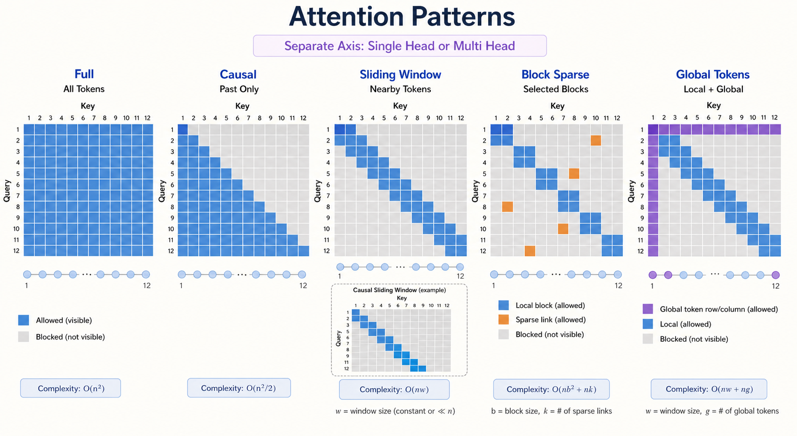
  <figcaption>
    <span class="article-figure__number">图 2</span>
    <span class="article-figure__text">Head 数量与可见性模式是两个独立设计轴；蓝色区域表示 Query 可以读取的 Key。</span>
  </figcaption>
</figure>

> 图中 `O(n²/2)` 用于直观表示 Causal Attention 只计算约半个矩阵；按大 O 记号忽略常数后，它仍是 `O(n²)`。另外，稀疏模式只有在实现使用相应稀疏或分块内核时才会带来实际加速。

| 可见性模式 | 每个 Query 可以看什么 | 复杂度（忽略 head/特征维） | 适用场景 |
|---|---|---:|---|
| Full Attention | 全部 token | `O(T²)` | 中短序列、全局理解 |
| Causal Attention | 当前及过去 token | `O(T²)` | 自回归生成；三角结构只减少常数，不改变平方阶 |
| Sliding-Window Attention | 附近 `W` 个 token | `O(TW)` | 长文本、局部依赖明显的序列 |
| Block-Sparse Attention | 预先设计的局部块和少量远程连接 | 取决于稀疏模式 | 长上下文与结构化稀疏计算 |
| Local + Global Tokens | 局部窗口加少数全局位置 | 约 `O(TW + TG)` | 需要局部高效计算和全局信息汇聚 |
| Cross-Attention | 另一个 Context 序列 | `O(Tq × Tk)` | 编码器—解码器、多模态条件输入 |

#### Sliding-Window Attention

设窗口宽度为 `W`。因果窗口中，第 `i` 个 Query 只查看：

$$
\max(0,i-W+1)\le j\le i
$$

因此单层无法直接连接相距超过 `W` 的 token，但堆叠多层后感受野会逐渐扩大。全局 token、周期性全局层或少量稀疏远程连接可以弥补长距离信息传递。

```python
def sliding_window_mask(T: int, window: int, causal: bool = True):
    # T = Token Count；window = 每个 Query 可见的局部宽度/半径
    query = torch.arange(T)[:, None]  # [T,1]
    key = torch.arange(T)[None, :]    # [1,T]

    if causal:
        # 当前 Key 以及最多 window-1 个过去 Key 可见
        allowed = (key <= query) & (key >= query - window + 1)
    else:
        # 左右各 window 个位置可见
        allowed = (query - key).abs() <= window
    return ~allowed  # True 表示需要屏蔽


mask = sliding_window_mask(T=6, window=3, causal=True)
scores = torch.randn(2, 4, 6, 6)  # [B,H,T,T]
scores = scores.masked_fill(mask, -torch.inf)
attn = torch.softmax(scores, dim=-1)
print(mask.shape, attn.shape)  # [6,6], [2,4,6,6]
```

> Window Attention 不是“比多头更高级”的替代品。`H` 决定有多少组 head，mask 决定每个 head 的连接范围，FlashAttention 则决定如何高效执行；三者分别属于表示、连接和实现层面。

## 3. X 如何变成 Q、K、V

同一个输入 `X` 分别通过三个独立、可学习的线性层：

```python
Q = self.q_proj(x)
K = self.k_proj(x)
V = self.v_proj(x)
```

<figure class="article-figure">
  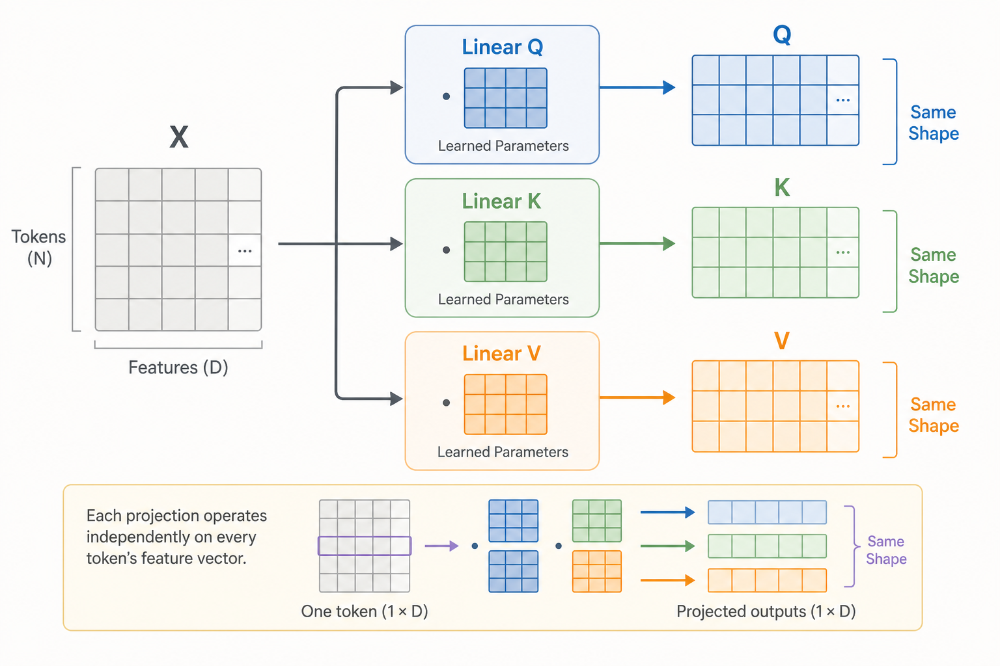
  <figcaption>
    <span class="article-figure__number">图 3</span>
    <span class="article-figure__text">同一个 X 经过三组不同的可学习参数，得到形状相同但语义不同的 Q、K、V。</span>
  </figcaption>
</figure>

对每个 token 向量分别计算：

$$
Q=XW_Q^\top+b_Q,\qquad
K=XW_K^\top+b_K,\qquad
V=XW_V^\top+b_V
$$

`nn.Linear(C, C)` 只变换最后一维，同一组参数会应用到所有 batch 和 token：

$$
[B,T,C]\times[C,C]^\top+[C]\longrightarrow[B,T,C]
$$

Q、K、V 不是简单复制出来的。它们输入相同，但使用不同权重；这些权重在训练中通过反向传播学习。当前示例没有训练循环，因此使用的是随机初始化参数。

| 投影 | 直觉 | 在后续计算中的作用 |
|---|---|---|
| Q（Query） | 我想找什么？ | 与所有 K 计算匹配分数 |
| K（Key） | 我能用什么被找到？ | 被所有 Q 检索 |
| V（Value） | 我实际提供什么？ | 根据注意力权重被加权汇总 |

## 4. 单头缩放点积注意力

<figure class="article-figure">
  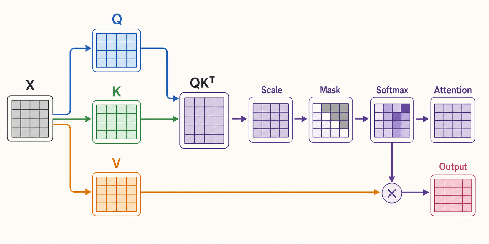
  <figcaption>
    <span class="article-figure__number">图 4</span>
    <span class="article-figure__text">单头缩放点积注意力，从相关性分数到 Value 加权汇总。</span>
  </figcaption>
</figure>

完整公式为：

$$
\operatorname{Attention}(Q,K,V)=
\operatorname{softmax}\left(\frac{QK^\top}{\sqrt C}+M\right)V
$$

### 4.1 计算相关性

`Q @ K.transpose(-2, -1)` 得到 `[B, T, T]`。其中第 `i` 行、第 `j` 列表示第 `i` 个 Query 与第 `j` 个 Key 的匹配分数。除以 `sqrt(C)` 可避免维度增大时点积过大、softmax 饱和。

更具体地说，若 $q$ 和 $k$ 的各维近似独立、均值为 0、方差为 1，则点积 $q^\top k$ 是 $C$ 项乘积之和，其方差约为 $C$、标准差约为 $\sqrt C$。除以 $\sqrt C$ 后，分数的典型尺度回到常数量级，Softmax 不容易在初始化阶段过早进入接近 one-hot 的饱和区域。多头中实际点积维度是 $D_h$，因此改除以 $\sqrt{D_h}$。

| 数学步骤 | 对应代码 | 输出形状 |
|---|---|---|
| `QKᵀ` | `Q @ K.transpose(-2, -1)` | `[B,T,T]` |
| 除以 `√C` | `scores / math.sqrt(C)` | `[B,T,T]` |
| 行归一化 | `softmax(scores, dim=-1)` | `[B,T,T]` |
| 权重乘 V | `attn @ V` | `[B,T,C]` |

### 4.2 Softmax 与加权求和

Softmax 把任意实数分数转换为非负、总和为 1 的概率。对向量 `z = [z₁, …, zₙ]`：

$$
\operatorname{softmax}(z)_i=
\frac{e^{z_i}}{\sum_{j=1}^{n}e^{z_j}}
$$

在 Attention 中，`scores` 的形状为 `[B,H,T,T]`（单头时没有 `H` 维）。`softmax(scores, dim=-1)` 会固定 batch、head 和 Query 行，只沿最后一个 Key 维计算；也就是每个 Query 分别得到一行概率。

#### 手算一个 Softmax

取一行分数 `z = [2, 1, 0]`。直接计算和稳定计算的结果相同，但实际实现会先减去最大值：

| 步骤 | 计算 | 结果（近似） |
|---|---|---|
| 1. 减最大值 | `[2,1,0] - 2` | `[0,-1,-2]` |
| 2. 求指数 | `[e⁰,e⁻¹,e⁻²]` | `[1,0.368,0.135]` |
| 3. 求总和 | `1 + 0.368 + 0.135` | `1.503` |
| 4. 分别除以总和 | `exp(z-2) / 1.503` | `[0.665,0.245,0.090]` |

最后三个权重之和为 1，较大的原始分数获得较大的概率。

<figure class="article-figure">
  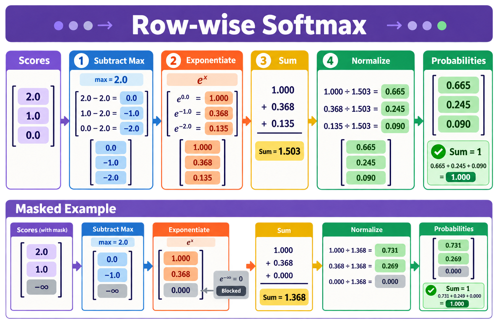
  <figcaption>
    <span class="article-figure__number">图 5</span>
    <span class="article-figure__text">逐步计算 row-wise Softmax；被 mask 的负无穷位置在指数运算后变为 0。</span>
  </figcaption>
</figure>

#### 为什么要减去最大值

Softmax 对所有输入同时平移一个常数，结果不变：

$$
\frac{e^{z_i-m}}{\sum_j e^{z_j-m}}
=\frac{e^{z_i}/e^m}{\sum_j e^{z_j}/e^m}
=\frac{e^{z_i}}{\sum_j e^{z_j}}
$$

取 `m = max(z)` 后，最大的指数是 `e⁰ = 1`，其他指数不超过 1，可以避免 `exp(1000)` 一类的浮点溢出。

```python
def stable_softmax(x: torch.Tensor, dim: int = -1):
    shifted = x - x.amax(dim=dim, keepdim=True)
    exp_x = torch.exp(shifted)
    return exp_x / exp_x.sum(dim=dim, keepdim=True)


scores = torch.tensor([2.0, 1.0, 0.0])
manual = stable_softmax(scores)
builtin = torch.softmax(scores, dim=-1)
print(manual)  # tensor([0.6652, 0.2447, 0.0900])
assert torch.allclose(manual, builtin)
```

#### Mask 为什么会得到零权重

被屏蔽的位置先填为负无穷。因为 `e⁻∞ = 0`，它在分子中变成 0，也不会贡献给分母：

$$
\operatorname{softmax}([2,1,-\infty])
\approx[0.731,0.269,0]
$$

```python
masked_scores = torch.tensor([2.0, 1.0, -torch.inf])
print(torch.softmax(masked_scores, dim=-1))
# tensor([0.7311, 0.2689, 0.0000])
```

> 如果一整行全是负无穷，softmax 会出现 `NaN`，因为计算退化为 `0 / 0`。构造 mask 时应确保每个有效 Query 至少能看到一个 Key，并单独处理 padding Query。

Softmax 还会让各位置形成竞争。其导数为：

$$
\frac{\partial p_i}{\partial z_j}=p_i(\delta_{ij}-p_j)
$$

提高某个分数通常会提高自己的概率，同时压低其他位置的概率。得到注意力权重后，第 `i` 个输出才是所有 Value 的加权和：

$$
o_i=\sum_{j=1}^{T}a_{ij}v_j
$$

所以 Q 和 K 决定“关注谁”，V 决定“取出什么内容”。

#### 如何正确理解 Attention Heatmap

注意力矩阵的一行表示“一个 Query 对各 Key 的权重分配”，适合检查 mask、局部性和异常集中等实现问题；但单张热力图不能直接证明模型的完整推理过程。输出还会经过多个 Head、`W_O`、残差连接、FFN 和后续层。将 Attention 权重用于解释时，应结合梯度、消融实验或输入扰动，不能简单把最高权重等同于唯一原因。

### 4.3 因果掩码

生成文本时，当前位置不能看到未来 token。代码把分数矩阵的上三角设为负无穷：

$$
M=\begin{bmatrix}
0&-\infty&-\infty&-\infty\\
0&0&-\infty&-\infty\\
0&0&0&-\infty\\
0&0&0&0
\end{bmatrix}
$$

<figure class="article-figure">
  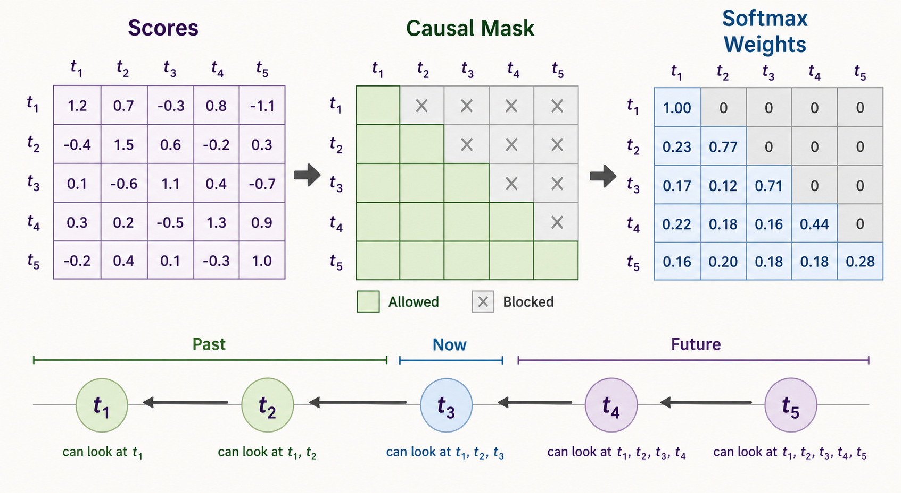
  <figcaption>
    <span class="article-figure__number">图 6</span>
    <span class="article-figure__text">上三角的未来位置被屏蔽；softmax 后对应权重严格为 0。</span>
  </figcaption>
</figure>

示例还可以调用 PyTorch 的 `scaled_dot_product_attention`。在 `torch.no_grad()` 中手动重算权重仅用于观察，不参与反向传播。

## 5. 从单头过渡到多头

单头只学习一套相关性。多头注意力把特征维度分给 `H` 个 head，让它们并行学习不同关系：

$$
d_h=\frac{C}{H}
$$

因此必须满足 `C % H == 0`。示例中 `C=48`、`H=8`，所以每头 `Dh=6`。

<figure class="article-figure">
  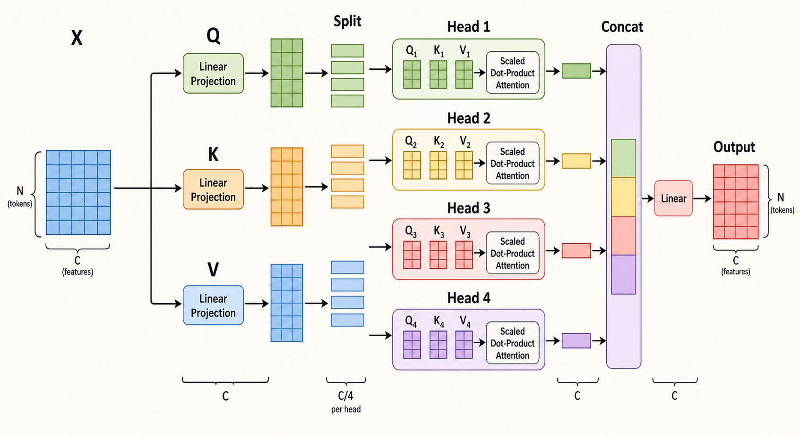
  <figcaption>
    <span class="article-figure__number">图 7</span>
    <span class="article-figure__text">特征维被拆给多个 head，并行计算后再拼回原维度。</span>
  </figcaption>
</figure>

### 5.1 先投影，再拆 Head

当前实现先生成完整的 Q、K、V，再依次变形为 `[B,T,H,Dh]` 和 `[B,H,T,Dh]`。上面的多头图完整展示了这条路径。

`transpose(1, 2)` 把 head 放到批量维附近。矩阵乘法会将 `B` 和 `H` 都视作批量维，因此不需要编写 Python 循环。

### 5.2 每头独立计算

$$
\operatorname{head}_i=
\operatorname{softmax}\left(\frac{Q_iK_i^\top}{\sqrt{d_h}}+M\right)V_i
$$

缩放因子变成 `sqrt(head_dim)`，因为每次点积只沿 `Dh` 维进行。形状 `[T,T]` 的 causal mask 会自动广播到 `[B,H,T,T]`。

### 5.3 拼接与输出投影

$$
\operatorname{MultiHead}(X)=
\operatorname{Concat}(\operatorname{head}_1,\ldots,\operatorname{head}_H)W_O^\top+b_O
$$

`out_proj` 的作用是混合不同 head 的结果；否则它们只是在特征轴上排列在一起。

> **关键区别**：单头用 `sqrt(C)` 缩放；多头的点积发生在每头的 `Dh` 维上，因此使用 `sqrt(Dh)`。

## 6. 单头与多头形状对照

| 阶段 | 单头 | 多头 |
|---|---|---|
| 输入 X | `[B,T,C]` | `[B,T,C]` |
| Q/K/V | `[B,T,C]` | `[B,H,T,Dh]`（拆头后） |
| 注意力分数 | `[B,T,T]` | `[B,H,T,T]` |
| 每头输出 | `[B,T,C]` | `[B,H,T,Dh]` |
| 最终输出 | `[B,T,C]` | `[B,T,C]` |
| 缩放因子 | `sqrt(C)` | `sqrt(Dh)` |

多头通常不会使最终输出维度扩大：因为 `H × Dh = C`，拼接后仍恢复为 `C`。

### 6.1 参数量、计算量与显存分别看什么

“多头”不等于把参数量乘以 Head 数。保持总模型维度 $C=H\times D_h$ 不变时，标准 MHA 的四个投影矩阵约有：

$$
\underbrace{3C^2}_{W_Q,W_K,W_V}+\underbrace{C^2}_{W_O}=4C^2
$$

这里忽略了规模较小的 bias。改变 `H` 只是在固定的 $C$ 维中重新分组，通常不会改变上述主项。一个标准两层 FFN 则约有 $2CC_{ff}$ 个权重；当 $C_{ff}=4C$ 时约为 $8C^2$，因此很多 Transformer 中 FFN 的参数量高于 Attention 投影层。

计算成本要分成两部分：

| 部分 | 时间复杂度 | 主要受什么影响 |
|---|---:|---|
| Q/K/V 与输出投影 | $O(BTC^2)$ | 模型维度 $C$ |
| Scores 与加权 Value | $O(BT^2C)$ | 序列长度 $T$ |

普通训练实现还可能保存 `[B,H,T,T]` 的分数或概率，Attention 激活显存因而随 $T^2$ 增长。FlashAttention 主要减少这部分中间矩阵的显存读写；它不会消除 Dense Attention 本身的平方级算术量。

## 7. 单头注意力完整示例

下面是可直接运行的教学版代码。它同时支持手写 Attention 和 PyTorch SDPA，并返回注意力权重供观察：

```python
import math
import torch
import torch.nn as nn
import torch.nn.functional as F


class SimpleAttention(nn.Module):
    def __init__(self, dim: int):
        super().__init__()
        self.q_proj = nn.Linear(dim, dim)
        self.k_proj = nn.Linear(dim, dim)
        self.v_proj = nn.Linear(dim, dim)

    def forward(
        self,
        x: torch.Tensor,
        causal: bool = False,
        use_sdpa: bool = False,
    ):
        # B = Batch Size；T = Token Count；C = Channels / Hidden Dimension
        B, T, C = x.shape
        Q = self.q_proj(x)  # [B, T, C]
        K = self.k_proj(x)  # [B, T, C]
        V = self.v_proj(x)  # [B, T, C]

        if use_sdpa:
            out = F.scaled_dot_product_attention(
                Q, K, V, is_causal=causal
            )

        # 手动计算权重；SDPA 路径下只用于观察
        context = torch.no_grad() if use_sdpa else torch.enable_grad()
        with context:
            scores = Q @ K.transpose(-2, -1) / math.sqrt(C)
            if causal:
                mask = torch.ones(
                    T, T, device=x.device, dtype=torch.bool
                ).triu(diagonal=1)
                scores = scores.masked_fill(mask, -torch.inf)
            attn = torch.softmax(scores, dim=-1)
            if not use_sdpa:
                out = attn @ V

        return out, attn


torch.manual_seed(0)
x = torch.randn(2, 4, 8)
model = SimpleAttention(dim=8)
out, attn = model(x, causal=True)

print("out:", out.shape)    # [2, 4, 8]
print("attn:", attn.shape)  # [2, 4, 4]
```

## 8. 多头注意力完整示例

多头版本的关键是把 `C` 拆成 `H × Dh`，让 `H` 个 head 作为额外批量维并行计算：

```python
import math
import torch
import torch.nn as nn


class SimpleMultiHeadAttention(nn.Module):
    def __init__(self, dim: int, num_heads: int):
        super().__init__()
        if dim % num_heads != 0:
            raise ValueError("dim must be divisible by num_heads")

        self.dim = dim
        self.num_heads = num_heads
        self.head_dim = dim // num_heads
        self.q_proj = nn.Linear(dim, dim)
        self.k_proj = nn.Linear(dim, dim)
        self.v_proj = nn.Linear(dim, dim)
        self.out_proj = nn.Linear(dim, dim)

    def forward(
        self,
        x: torch.Tensor,
        causal: bool = False,
        valid_tokens: torch.Tensor | None = None,
        return_attn: bool = False,
    ):
        # B = Batch Size；T = Token Count；C = Channels / Hidden Dimension
        B, T, C = x.shape

        def split_heads(proj: nn.Linear):
            # [B,T,C] -> [B,T,H,Dh] -> [B,H,T,Dh]
            return proj(x).reshape(
                B, T, self.num_heads, self.head_dim
            ).transpose(1, 2)

        Q = split_heads(self.q_proj)
        K = split_heads(self.k_proj)
        V = split_heads(self.v_proj)

        scores = Q @ K.transpose(-2, -1)
        scores = scores / math.sqrt(self.head_dim)

        if causal:
            mask = torch.ones(
                T, T, device=x.device, dtype=torch.bool
            ).triu(diagonal=1)
            scores = scores.masked_fill(mask, -torch.inf)

        if valid_tokens is not None:
            if valid_tokens.shape != (B, T):
                raise ValueError("valid_tokens must have shape [B,T]")
            valid_tokens = valid_tokens.to(
                device=scores.device, dtype=torch.bool
            )
            key_mask = ~valid_tokens[:, None, None, :]
            scores = scores.masked_fill(key_mask, -torch.inf)

        attn = torch.softmax(scores, dim=-1)  # [B,H,T,T]
        out = attn @ V                        # [B,H,T,Dh]
        out = out.transpose(1, 2).reshape(B, T, C)
        out = self.out_proj(out)

        return (out, attn) if return_attn else out


torch.manual_seed(0)
B = 2   # B = Batch Size：一批包含 2 个样本
T = 4   # T = Token Count / Sequence Length：每个样本有 4 个 token
C = 12  # C = Channels / Hidden Dimension：每个 token 有 12 维特征
H = 3   # H = Number of Heads：拆成 3 个 attention heads
Dh = C // H  # Dh = Head Dimension：每个 head 为 4 维

x = torch.randn(B, T, C)
model = SimpleMultiHeadAttention(dim=C, num_heads=H)
out, attn = model(x, causal=True, return_attn=True)

print("out:", out.shape)    # [2, 4, 12]
print("attn:", attn.shape)  # [2, 3, 4, 4]
```

## 9. Transformer 的其他模块

Attention 只是 Transformer Block 的一部分。下面继续补齐位置编码、前馈网络、残差连接和归一化。

### 9.1 Token Embedding 与位置编码

`nn.Embedding` 把 token ID 映射为向量。由于 Attention 本身不理解顺序，还要加入位置编码：

$$
X_0=\operatorname{Embedding}(token\_ids)+\operatorname{Position}(0,\ldots,T-1)
$$

最容易理解的是可学习位置编码：

```python
class InputEmbedding(nn.Module):
    def __init__(self, vocab_size: int, dim: int, max_seq_len: int):
        super().__init__()
        self.token = nn.Embedding(vocab_size, dim)
        self.position = nn.Embedding(max_seq_len, dim)

    def forward(self, token_ids: torch.Tensor):
        # token_ids: [B,T]
        T = token_ids.size(1)
        positions = torch.arange(T, device=token_ids.device)
        return self.token(token_ids) + self.position(positions)
```

输出形状从 `[B,T]` 变成 `[B,T,C]`。token embedding 回答“是什么”，position embedding 回答“在哪里”。

<figure class="article-figure">
  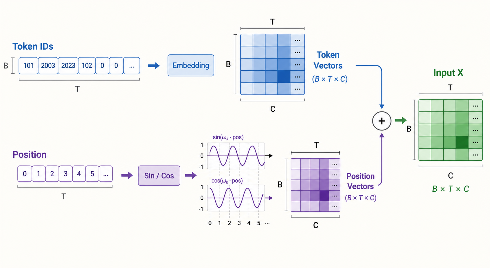
  <figcaption>
    <span class="article-figure__number">图 8</span>
    <span class="article-figure__text">Token 向量与位置向量逐元素相加，得到 Transformer 的输入 X。位置编码原始形状通常为 [T,C] 或 [1,T,C]，图中的 [B,T,C] 表示广播到 batch 后的逻辑形状。</span>
  </figcaption>
</figure>

### 9.2 Feed-Forward Network

Attention 完成 token 之间的信息聚合后，FFN（Feed-Forward Network）会对每个 token 的特征做进一步变换。它对序列中的每个位置独立应用**同一组参数**，不会在不同 token 之间交换信息，因此也常被称为 position-wise FFN。

设模型维度为 $C$，FFN 的中间维度为 $C_{ff}$，则两层线性变换通常先把特征从 $C$ 维升到 $C_{ff}$ 维，再投影回 $C$ 维：

$$
\operatorname{FFN}(x)=W_2\,\sigma(W_1x+b_1)+b_2
$$

其中：

- $W_1\in\mathbb{R}^{C_{ff}\times C}$，负责升维；
- $W_2\in\mathbb{R}^{C\times C_{ff}}$，负责降维；
- $\sigma$ 是非线性激活函数，例如 ReLU 或 GELU；
- $C_{ff}$ 通常大于 $C$，原始 Transformer 常取 $C_{ff}=4C$。

升维给网络提供了更大的中间特征空间，非线性激活使它能够组合和筛选不同语义特征；最后降回 $C$ 维，是为了与残差分支的输入保持相同形状。

#### 为什么需要 GELU 激活

如果两层 Linear 之间没有激活函数，那么无论中间维度多大，两次线性变换仍可合并成一次线性变换，FFN 就无法学习更复杂的非线性关系。这里使用的 GELU（Gaussian Error Linear Unit）定义为：

$$
\operatorname{GELU}(x)=x\,\Phi(x)
$$

其中 $\Phi(x)$ 是标准正态分布的累积分布函数。也可以用下面的近似式计算：

$$
\operatorname{GELU}(x)\approx\frac{x}{2}
\left(1+\tanh\left[\sqrt{\frac{2}{\pi}}
\left(x+0.044715x^3\right)\right]\right)
$$

可以把 $\Phi(x)\in(0,1)$ 理解成一个由输入大小决定的**软门控系数**：较大的正输入接近原样通过，较大的负输入逐渐趋近于 0，中间区域则被平滑缩放。这里的“概率式门控”只是数学直觉，`nn.GELU()` 的前向计算本身是确定性的，并不会随机采样。

与 `ReLU(x) = max(0, x)` 相比，GELU 在 0 附近没有硬截断，并允许一部分较小的负值通过，因此梯度变化更平滑。GELU 被 BERT、GPT 等许多 Transformer 采用，但它不是对所有模型和硬件都必然更优；ReLU 计算更简单，现代大模型也常改用 SiLU/SwiGLU 等门控结构。

```python
class FeedForward(nn.Module):
    def __init__(self, dim: int, hidden_dim: int, dropout: float = 0.1):
        super().__init__()
        self.net = nn.Sequential(
            nn.Linear(dim, hidden_dim),
            nn.GELU(),
            nn.Dropout(dropout),
            nn.Linear(hidden_dim, dim),
        )

    def forward(self, x: torch.Tensor):
        return self.net(x)  # [B,T,C] -> [B,T,C]
```

对输入 `x: [B,T,C]`，`nn.Linear` 只作用于最后一个维度。它等价于对全部 `B × T` 个 token 分别执行相同的 MLP，只是 PyTorch 将这些计算并行完成：

$$
[B,T,C]\xrightarrow{W_1}[B,T,C_{ff}]
\xrightarrow{\operatorname{GELU}}[B,T,C_{ff}]
\xrightarrow{W_2}[B,T,C]
$$

<figure class="article-figure">
  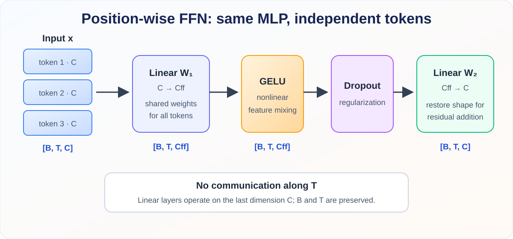
  <figcaption>
    <span class="article-figure__number">图 9</span>
    <span class="article-figure__text">Position-wise FFN 的数据流。B 和 T 保持不变，特征维执行 C → Cff → C；所有 token 共享同一组 W₁、W₂。</span>
  </figcaption>
</figure>

因此，Attention 与 FFN 承担互补的职责：

- **Attention** 沿序列维度混合信息，让一个 token 能读取其他 token；
- **FFN** 沿特征维度变换信息，增强每个 token 自身的表示能力。

实际大模型中也常见带门控的 FFN，如 GLU、GEGLU 和 SwiGLU。它们改变了中间层的计算方式，但“逐 token 共享参数、最后回到模型维度”这一基本结构不变。

### 9.3 残差连接与 LayerNorm

一个 Transformer Block 通常包含 Attention 和 FFN 两个子层，每个子层外都配有残差连接与归一化。它们承担不同作用：

- **残差连接**为信息和梯度提供直接通路，使深层网络更容易保留原始表示并稳定训练；
- **LayerNorm**控制每个 token 特征的数值尺度，减小不同层之间分布变化带来的训练不稳定。

残差连接把子层输入直接加回输出：

$$
r=x+\operatorname{Sublayer}(x)
$$

逐元素相加要求 `Sublayer(x)` 与 `x` 形状一致。这也是 Attention 最后要投影回 $C$ 维、FFN 第二层要从 $C_{ff}$ 降回 $C$ 维的原因。

LayerNorm 则对**每个 token 的最后一个特征维度**独立归一化。对于某个 token 的向量 $x\in\mathbb{R}^{C}$：

$$
\mu=\frac{1}{C}\sum_{i=1}^{C}x_i,\qquad
\sigma^2=\frac{1}{C}\sum_{i=1}^{C}(x_i-\mu)^2
$$

$$
\operatorname{LayerNorm}(x)_i=
\gamma_i\frac{x_i-\mu}{\sqrt{\sigma^2+\epsilon}}+\beta_i
$$

其中 $\gamma$ 和 $\beta$ 是可学习参数。对于 `[B,T,C]` 输入，`nn.LayerNorm(C)` 分别归一化每个样本、每个 token 的 $C$ 个特征，不会在 batch 维或序列维之间混合统计量。

残差连接和 LayerNorm 的相对顺序主要有两种。

**Post-Norm** 在子层与残差相加之后归一化：

$$
y=\operatorname{LayerNorm}(x+\operatorname{Sublayer}(x))
$$

下面的代码先执行 Attention，再执行 FFN；两次都使用 Post-Norm：

```python
dim = 12
x = torch.randn(2, 4, dim)
attention = SimpleMultiHeadAttention(dim, num_heads=3)
ffn = FeedForward(dim, hidden_dim=48)
norm1, norm2 = nn.LayerNorm(dim), nn.LayerNorm(dim)
dropout = nn.Dropout(0.1)

attn_out = attention(x, causal=True)
x = norm1(x + dropout(attn_out))
ffn_out = ffn(x)
x = norm2(x + dropout(ffn_out))
print(x.shape)  # [2, 4, 12]
```

Dropout 只作用于子层输出，随后再与残差分支相加。即使丢弃了部分子层特征，原始输入仍能通过残差路径继续向后传播。

**Pre-Norm** 则先归一化，再把结果送入子层：

$$
y=x+\operatorname{Sublayer}(\operatorname{LayerNorm}(x))
$$

对应的核心写法是：

```python
x = x + dropout(attention(norm1(x), causal=True))
x = x + dropout(ffn(norm2(x)))
```

<figure class="article-figure">
  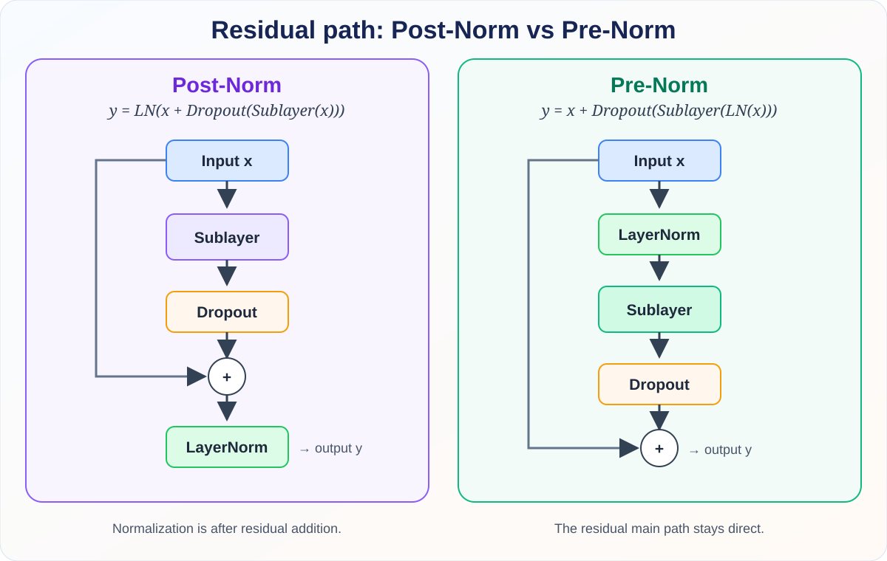
  <figcaption>
    <span class="article-figure__number">图 10</span>
    <span class="article-figure__text">Post-Norm 与 Pre-Norm 的计算顺序。Post-Norm 在残差相加后归一化；Pre-Norm 在进入子层前归一化，并保留更直接的残差主路径。</span>
  </figcaption>
</figure>

Post-Norm 是原始 Transformer 采用的形式，也与图 1 一致；Pre-Norm 的残差主路径更直接，训练较深网络时通常更容易优化，因此现代大模型中十分常见。无论采用哪一种，整个 Block 都保持 `[B,T,C] -> [B,T,C]`，从而可以连续堆叠多层。

### 9.4 组合成一个 Transformer Block

下面把本节组件与前面的多头注意力组合起来：

```python
class TransformerBlock(nn.Module):
    def __init__(
        self,
        dim: int,
        num_heads: int,
        hidden_dim: int,
        dropout: float = 0.1,
    ):
        super().__init__()
        self.attention = SimpleMultiHeadAttention(dim, num_heads)
        self.ffn = FeedForward(dim, hidden_dim, dropout)
        self.norm1 = nn.LayerNorm(dim)
        self.norm2 = nn.LayerNorm(dim)
        self.dropout = nn.Dropout(dropout)

    def forward(
        self,
        x: torch.Tensor,
        causal: bool = False,
        valid_tokens: torch.Tensor | None = None,
    ):
        attn_out = self.attention(
            x, causal=causal, valid_tokens=valid_tokens
        )
        x = self.norm1(x + self.dropout(attn_out))
        ffn_out = self.ffn(x)
        x = self.norm2(x + self.dropout(ffn_out))
        return x


x = torch.randn(2, 4, 12)
block = TransformerBlock(
    dim=12, num_heads=3, hidden_dim=48
)
out = block(x, causal=True)
print(out.shape)  # [2, 4, 12]
```

这个 Block 已覆盖图 1 的主体，但还没有 padding mask、交叉注意力、KV cache、输出词表投影和训练目标。

### 9.5 正弦位置编码

可学习位置编码简单直观，但位置范围受训练时的 `max_seq_len` 限制。经典 Transformer 使用固定的正弦/余弦函数：

$$
PE(pos,2i)=\sin\left(\frac{pos}{10000^{2i/C}}\right),\qquad
PE(pos,2i+1)=\cos\left(\frac{pos}{10000^{2i/C}}\right)
$$

```python
class SinusoidalPositionEncoding(nn.Module):
    def __init__(self, dim: int, max_seq_len: int = 2048):
        super().__init__()
        if dim % 2 != 0:
            raise ValueError("sinusoidal encoding requires an even dim")
        position = torch.arange(max_seq_len).unsqueeze(1)
        scale = torch.exp(
            torch.arange(0, dim, 2) * (-math.log(10000.0) / dim)
        )
        pe = torch.zeros(max_seq_len, dim)
        pe[:, 0::2] = torch.sin(position * scale)
        pe[:, 1::2] = torch.cos(position * scale)
        self.register_buffer("pe", pe.unsqueeze(0), persistent=False)

    def forward(self, x: torch.Tensor):
        # x: [B,T,C]
        return x + self.pe[:, :x.size(1)]
```

`register_buffer` 让位置编码随模型迁移设备，但不把它作为可训练参数。

### 9.6 Padding Mask、Causal Mask 与 Dropout

两类 mask 解决的问题不同：

<figure class="article-figure">
  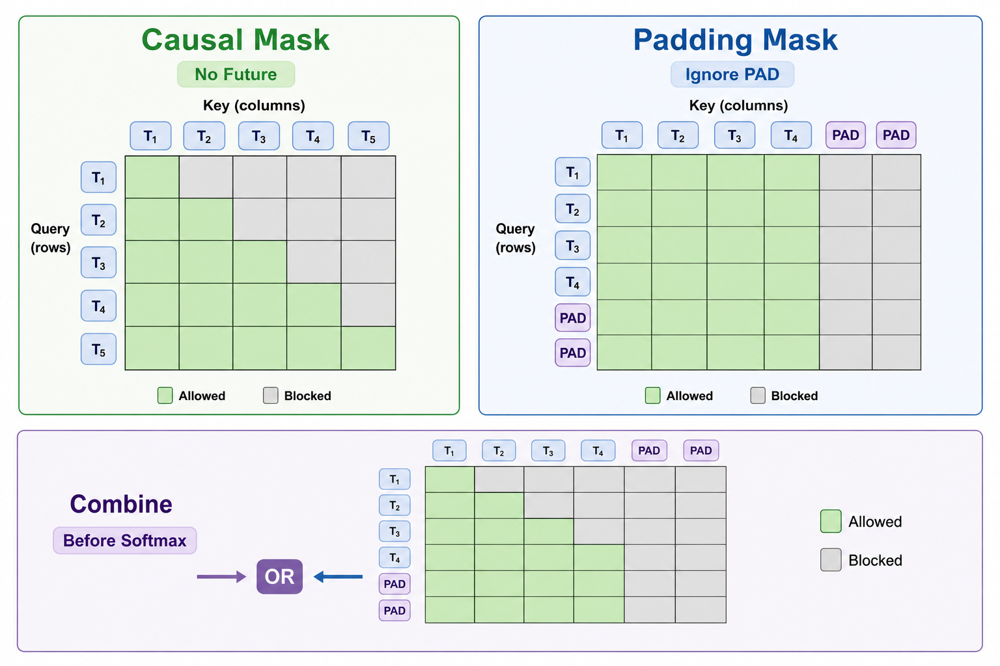
  <figcaption>
    <span class="article-figure__number">图 11</span>
    <span class="article-figure__text">Causal Mask 与 Padding Mask 的作用范围。前者屏蔽未来位置，后者屏蔽补齐的 Key 列；二者可在 Softmax 前组合。</span>
  </figcaption>
</figure>

图中的 Padding Mask 只屏蔽 PAD 对应的 **Key 列**，保证有效 Query 不读取补齐内容；PAD 对应的 Query 行仍可能产生数值。训练时通常再通过 loss mask 忽略这些位置，或在后续显式清零其输出。

| Mask | 屏蔽对象 | 常见形状 | 典型用途 |
|---|---|---|---|
| Causal mask | 未来 token | `[T,T]` | 自回归生成 |
| Padding mask | 补齐 token | `[B,T]` | 不同长度序列组成 batch |

将 `[B,T]` 的有效位置标记扩展为 `[B,1,1,T]` 后，可以广播到所有 head 和 Query：

```python
def apply_attention_masks(
    scores: torch.Tensor,
    valid_tokens: torch.Tensor | None = None,
    causal: bool = False,
):
    # scores: [B,H,T,T], valid_tokens: [B,T]，True 表示有效
    T = scores.size(-1)
    if valid_tokens is not None:
        key_mask = ~valid_tokens[:, None, None, :]
        scores = scores.masked_fill(key_mask, -torch.inf)
    if causal:
        future_mask = torch.ones(
            T, T, device=scores.device, dtype=torch.bool
        ).triu(1)
        scores = scores.masked_fill(future_mask, -torch.inf)
    return scores
```

Attention Dropout 通常作用在 softmax 权重上，Residual Dropout 则作用在子层输出上：

```python
scores = torch.randn(2, 3, 4, 4)  # [B,H,T,T]
V = torch.randn(2, 3, 4, 4)       # [B,H,T,Dh]
attn_dropout = nn.Dropout(0.1)

attn = torch.softmax(scores, dim=-1)
attn = attn_dropout(attn)
out = attn @ V
```

Dropout 只在 `model.train()` 时随机丢弃元素；调用 `model.eval()` 后会自动关闭。训练模式下，PyTorch 会把保留下来的元素除以 `1-p` 以保持期望不变，因此 Attention Dropout 后某一行的**实际和不一定仍为 1**；“每行和为 1”只适用于 Dropout 之前的 Softmax 权重或评估模式。

### 9.7 Self-Attention 与 Cross-Attention

两者使用相同公式，区别在 Q、K、V 的来源：

<figure class="article-figure">
  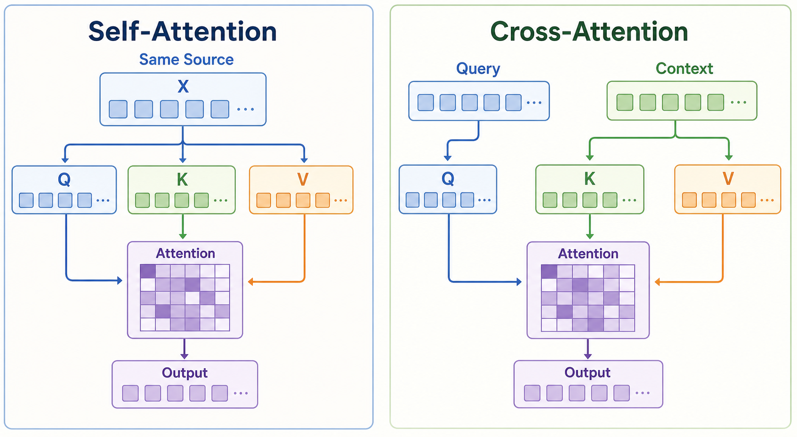
  <figcaption>
    <span class="article-figure__number">图 12</span>
    <span class="article-figure__text">Self-Attention 与 Cross-Attention 的输入来源。前者的 Q/K/V 来自同一序列；后者的 Q 来自查询序列，K/V 来自 Context。</span>
  </figcaption>
</figure>

| 类型 | Q 来源 | K/V 来源 |
|---|---|---|
| Self-Attention | 当前序列 | 当前序列 |
| Cross-Attention | 解码器状态 | 编码器输出或外部条件 |

```python
class SimpleCrossAttention(nn.Module):
    def __init__(self, dim: int):
        super().__init__()
        self.q_proj = nn.Linear(dim, dim)
        self.k_proj = nn.Linear(dim, dim)
        self.v_proj = nn.Linear(dim, dim)
        self.out_proj = nn.Linear(dim, dim)

    def forward(self, query: torch.Tensor, context: torch.Tensor):
        # query: [B,Tq,C], context: [B,Tk,C]
        Q = self.q_proj(query)
        K = self.k_proj(context)
        V = self.v_proj(context)
        scores = Q @ K.transpose(-2, -1) / math.sqrt(Q.size(-1))
        attn = torch.softmax(scores, dim=-1)  # [B,Tq,Tk]
        return self.out_proj(attn @ V), attn
```

Cross-Attention 允许一个序列主动查询另一个序列，例如翻译解码器查询源语言编码结果，或文本条件查询图像特征。

### 9.8 自回归生成与 KV Cache

生成第 `t` 个 token 时，过去位置的 K、V 不会改变。若每一步都重新计算整个前缀，会产生大量重复工作。KV Cache 保存历史 K、V，新一步只追加一项：

<figure class="article-figure">
  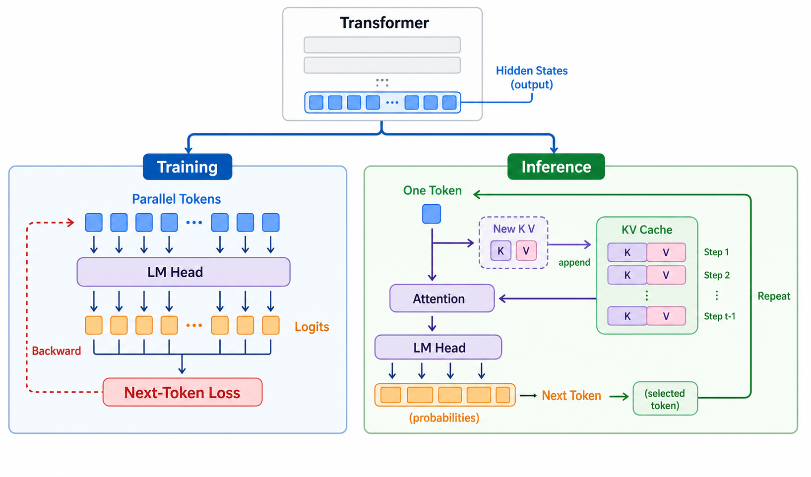
  <figcaption>
    <span class="article-figure__number">图 13</span>
    <span class="article-figure__text">训练与自回归推理的数据流。训练并行计算所有位置并反向传播；推理逐 token 生成，并通过 KV Cache 复用历史 K/V。</span>
  </figcaption>
</figure>

```text
第 1 步：计算 K1,V1                   → cache=[1]
第 2 步：只计算 K2,V2，与 cache 拼接  → cache=[1,2]
第 3 步：只计算 K3,V3，与 cache 拼接  → cache=[1,2,3]
```

```python
def append_kv_cache(K_new, V_new, cache=None):
    # K_new/V_new: [B,H,1,Dh]
    if cache is None:
        return K_new, V_new
    K_cache, V_cache = cache
    K = torch.cat([K_cache, K_new], dim=2)
    V = torch.cat([V_cache, V_new], dim=2)
    return K, V
```

KV Cache 用额外显存换取更快解码。训练时通常一次并行处理整个序列，不需要这种逐 token cache。上面的 `torch.cat` 适合解释形状，但每一步都会重新分配并复制越来越长的张量；生产推理通常使用预分配缓存或分页式 KV Cache，直接写入新位置。

#### Prefill、Decode 与缓存大小

推理通常分成两个阶段：

- **Prefill**：并行处理完整 Prompt，建立各层的初始 K/V Cache；
- **Decode**：每一步只输入一个新 token，生成新的 Q/K/V，并把 K/V 追加到缓存。

假设共有 $L$ 层、batch 大小为 $B$、已缓存长度为 $T_{cache}$、KV Head 数为 $H_{kv}$、每头维度为 $D_h$，每个元素占 $s$ 字节，则缓存主体约为：

$$
\operatorname{KVBytes}\approx
2LBT_{cache}H_{kv}D_hs
$$

系数 2 来自 K 和 V。MHA 中通常有 $H_{kv}=H_q$；GQA 和 MQA 通过减少 $H_{kv}$ 直接降低缓存大小与解码时的内存带宽。KV Cache 避免重复计算历史 token 的 K/V，但新 Query 仍需读取历史 Key/Value，因此单步 Decode 的 Attention 工作量仍随当前上下文长度增长。

### 9.9 语言模型输出层与训练目标

多层 Transformer 输出 `[B,T,C]` 的隐藏状态。语言模型用线性层把每个位置映射到词表 logits：

$$
logits=HW_{vocab}^\top+b,\qquad logits\in\mathbb{R}^{B\times T\times V_{vocab}}
$$

```python
class LanguageModelHead(nn.Module):
    def __init__(self, dim: int, vocab_size: int):
        super().__init__()
        self.proj = nn.Linear(dim, vocab_size, bias=False)

    def forward(self, hidden: torch.Tensor):
        return self.proj(hidden)  # [B,T,C] -> [B,T,V_vocab]


hidden = torch.randn(2, 4, 12)
targets = torch.randint(0, 100, (2, 4))
head = LanguageModelHead(dim=12, vocab_size=100)
logits = head(hidden)
loss = nn.functional.cross_entropy(
    logits[:, :-1].reshape(-1, 100),
    targets[:, 1:].reshape(-1),
)
print(logits.shape, loss.item())
```

这里用位置 `t` 的输出预测位置 `t+1` 的 token。训练通过交叉熵损失反向传播，更新 Attention、FFN、Embedding 和输出层的全部可学习参数。

## 10. 现代 Transformer 常用改进

基础 Transformer 便于理解，但现代语言模型常用 RoPE、RMSNorm、SwiGLU 和 GQA，并通过 FlashAttention 提升执行效率。

### 10.1 三种位置编码与 RoPE

<figure class="article-figure">
  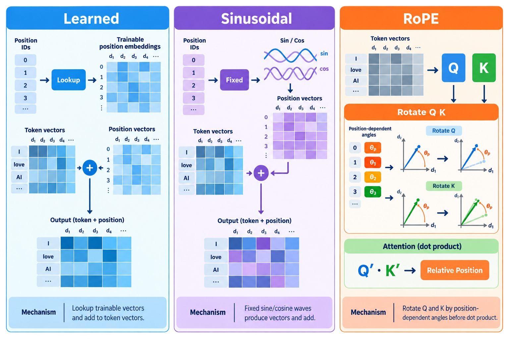
  <figcaption>
    <span class="article-figure__number">图 14</span>
    <span class="article-figure__text">可学习位置编码、正弦位置编码与 RoPE。前两者把位置向量加到 token 向量；RoPE 按位置旋转 Q 和 K，使点积包含相对位置信息。</span>
  </figcaption>
</figure>

RoPE 把特征两两配对，在每个二维平面中按位置旋转。Q 和 K 的相对旋转角进入点积，因此注意力分数自然包含相对位置信息；V 不做旋转。

```python
def rotate_half(x: torch.Tensor):
    # (..., d0,d1,d2,d3) -> (..., -d1,d0,-d3,d2)
    even = x[..., 0::2]
    odd = x[..., 1::2]
    return torch.stack((-odd, even), dim=-1).flatten(-2)


def apply_rope(x: torch.Tensor, position_offset: int = 0):
    # x: [B,H,T,Dh]，要求 Dh 为偶数
    T, Dh = x.shape[-2:]
    if Dh % 2 != 0:
        raise ValueError("RoPE requires an even head dimension")
    inv_freq = 1.0 / (
        10000 ** (torch.arange(0, Dh, 2, device=x.device) / Dh)
    )
    positions = torch.arange(
        position_offset, position_offset + T, device=x.device
    )
    angles = torch.outer(positions, inv_freq)
    angles = angles.repeat_interleave(2, dim=-1)  # [T,Dh]
    return x * angles.cos() + rotate_half(x) * angles.sin()


Q_rot = apply_rope(torch.randn(2, 3, 4, 8))
K_rot = apply_rope(torch.randn(2, 3, 4, 8))
print(Q_rot.shape, K_rot.shape)  # [2,3,4,8]
```

这是便于理解的基础实现。Prefill 时 `position_offset=0`；使用 KV Cache 解码时，新 token 必须传入它在完整序列中的绝对位置，例如当前缓存长度。实际模型还会处理更长上下文的频率缩放、缓存 cos/sin，以及不同的维度排列约定。

### 10.2 RMSNorm

LayerNorm 会减去均值再按方差缩放；RMSNorm 只根据均方根缩放：

$$
\operatorname{RMSNorm}(x)=
\frac{x}{\sqrt{\operatorname{mean}(x^2)+\epsilon}}\odot g
$$

```python
class RMSNorm(nn.Module):
    def __init__(self, dim: int, eps: float = 1e-6):
        super().__init__()
        self.eps = eps
        self.weight = nn.Parameter(torch.ones(dim))

    def forward(self, x: torch.Tensor):
        rms = x.float().pow(2).mean(dim=-1, keepdim=True)
        normalized = x.float() * torch.rsqrt(rms + self.eps)
        return (normalized * self.weight.float()).to(x.dtype)
```

RMSNorm 保持输入输出形状不变。显式用 float 计算归一化可提高低精度训练时的数值稳定性。

### 10.3 SwiGLU 前馈网络

SwiGLU 使用一条门控分支和一条值分支：

$$
\operatorname{SwiGLU}(x)=
W_{down}\left(\operatorname{SiLU}(W_gx)\odot W_vx\right)
$$

```python
class SwiGLU(nn.Module):
    def __init__(self, dim: int, hidden_dim: int):
        super().__init__()
        self.gate_proj = nn.Linear(dim, hidden_dim, bias=False)
        self.up_proj = nn.Linear(dim, hidden_dim, bias=False)
        self.down_proj = nn.Linear(hidden_dim, dim, bias=False)

    def forward(self, x: torch.Tensor):
        gated = nn.functional.silu(self.gate_proj(x))
        return self.down_proj(gated * self.up_proj(x))
```

其中 `*` 是逐元素乘法，不是矩阵乘法。输出仍为 `[B,T,C]`，可以直接进入残差连接。

### 10.4 MHA、GQA 与 MQA

<figure class="article-figure">
  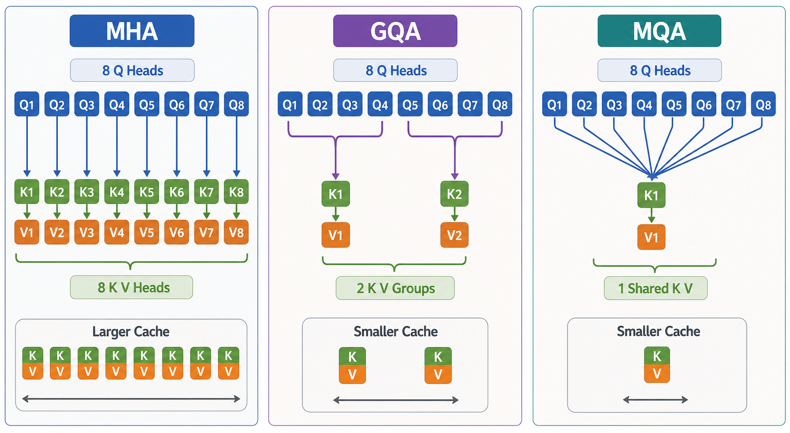
  <figcaption>
    <span class="article-figure__number">图 15</span>
    <span class="article-figure__text">MHA、GQA 与 MQA 的 K/V 共享方式。在 Query head 数不变时，共享范围越大，需要保存的 K/V head 越少。</span>
  </figcaption>
</figure>

令 Query head 数为 `Hq`、KV head 数为 `Hkv`：

| 结构 | KV head 数 | 特点 |
|---|---:|---|
| MHA | `Hkv = Hq` | 每个 Q head 有独立 K/V |
| GQA | `1 < Hkv < Hq` | 一组 Q heads 共享 K/V |
| MQA | `Hkv = 1` | 所有 Q heads 共享一套 K/V |

教学实现可以复制 K/V head 来匹配 Q head；高性能内核通常避免真实复制：

```python
def repeat_kv(x: torch.Tensor, num_query_heads: int):
    # x: [B,Hkv,T,Dh] -> [B,Hq,T,Dh]
    num_kv_heads = x.size(1)
    if num_query_heads % num_kv_heads != 0:
        raise ValueError("Hq must be divisible by Hkv")
    repeats = num_query_heads // num_kv_heads
    return x.repeat_interleave(repeats, dim=1)


K = torch.randn(2, 2, 4, 8)  # 2 个 KV heads
K_for_q = repeat_kv(K, num_query_heads=8)
print(K_for_q.shape)          # [2,8,4,8]
```

GQA 常用于在模型质量与解码显存/带宽之间折中。它主要减少 K/V 投影与 KV Cache，Query head 数可以保持较多。

### 10.5 FlashAttention 在优化什么

<figure class="article-figure">
  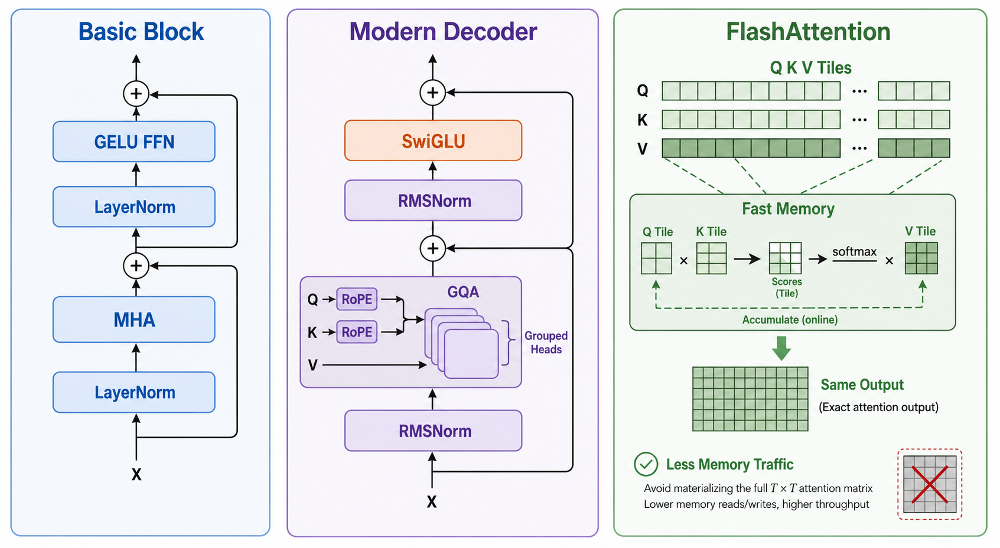
  <figcaption>
    <span class="article-figure__number">图 16</span>
    <span class="article-figure__text">基础 Pre-Norm Block、现代 Decoder 组件与 FlashAttention。现代 Decoder 常组合 RMSNorm、RoPE、GQA 和 SwiGLU；FlashAttention 改变分块与内存访问，不改变 Attention 的数学定义。</span>
  </figcaption>
</figure>

普通实现会显式产生 `[B,H,T,T]` 的 scores 和 attn，序列很长时占用大量显存。FlashAttention 将 Q/K/V 分块送入更快的片上存储，在线维护 softmax 统计量，避免把完整的 `T × T` 矩阵写回显存。

需要区分两个概念：

- **数学层面**：仍然计算缩放点积、mask、softmax 和加权 V。
- **实现层面**：改变分块顺序与内存读写方式；除浮点舍入差异外，目标结果相同。

PyTorch 的 SDPA 会根据设备、数据类型和输入条件选择可用内核：

```python
Q = torch.randn(2, 4, 8, 16)
K = torch.randn(2, 4, 8, 16)
V = torch.randn(2, 4, 8, 16)
out = nn.functional.scaled_dot_product_attention(
    Q, K, V,
    attn_mask=None,
    dropout_p=0.0,
    is_causal=True,
)
```

使用 SDPA 时不应在 `is_causal=True` 的同时重复传入等价的 causal mask。是否采用特定优化内核属于运行时行为，不应仅根据函数名假定。

## 11. 模型扩展与训练并行

### 11.1 Mixture-of-Experts（MoE）

普通 Transformer 的每个 token 都经过同一个 FFN。MoE 准备多个专家 FFN，由 Router 为每个 token 选择少量专家：

设 Router logits 为 $r_t=W_rx_t$，选中的专家集合为 $I_t=\operatorname{TopK}(r_t)$。本文代码只在入选专家之间重新归一化：

$$
\widetilde p_{t,i}=
\frac{e^{r_{t,i}}}{\sum_{j\in I_t}e^{r_{t,j}}},\quad i\in I_t,
\qquad
y_t=\sum_{i\in I_t}\widetilde p_{t,i}E_i(x_t)
$$

也有实现先对所有专家做 Softmax，再截取 Top-K，并选择是否重新归一化；阅读具体模型时需要确认这一细节。

<figure class="article-figure">
  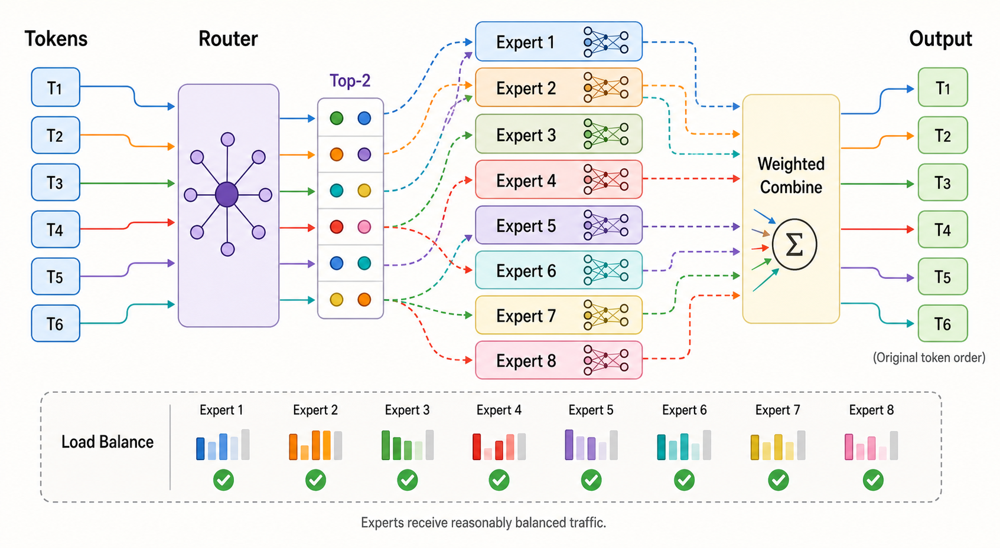
  <figcaption>
    <span class="article-figure__number">图 17</span>
    <span class="article-figure__text">Top-2 MoE 路由。Router 为每个 token 选择两个专家；专家结果按 token 分别加权求和，不会混合不同 token，最后恢复原顺序。</span>
  </figcaption>
</figure>

下面是强调数学过程的教学实现。它会计算所有专家，因此没有真实稀疏内核的性能收益：

```python
class SimpleMoE(nn.Module):
    def __init__(
        self,
        dim: int,
        hidden_dim: int,
        num_experts: int = 4,
        top_k: int = 2,
    ):
        super().__init__()
        if not 1 <= top_k <= num_experts:
            raise ValueError("top_k must be in [1, num_experts]")
        self.top_k = top_k
        self.router = nn.Linear(dim, num_experts, bias=False)
        self.experts = nn.ModuleList(
            [SwiGLU(dim, hidden_dim) for _ in range(num_experts)]
        )

    def forward(self, x: torch.Tensor):
        router_logits = self.router(x)               # [B,T,E]
        top_values, top_indices = router_logits.topk(self.top_k, dim=-1)
        top_weights = torch.softmax(top_values, dim=-1)

        output = torch.zeros_like(x)
        for rank in range(self.top_k):
            selected = top_indices[..., rank]        # [B,T]
            weight = top_weights[..., rank, None]    # [B,T,1]
            for expert_id, expert in enumerate(self.experts):
                mask = (selected == expert_id)[..., None]
                output = output + mask * weight * expert(x)
        return output, router_logits


moe = SimpleMoE(dim=12, hidden_dim=24, num_experts=4, top_k=2)
moe_out, router_logits = moe(torch.randn(2, 5, 12))
print(moe_out.shape, router_logits.shape)  # [2,5,12], [2,5,4]
```

MoE 增加模型总参数量，但每个 token 只激活少量专家。训练时还需处理专家容量、跨设备 All-to-All 通信，以及辅助负载均衡损失，防止 Router 把大多数 token 都送到少数专家。

### 11.2 数据、张量与流水线并行

单张设备放不下模型或算力不足时，可以从三个维度拆分：

<figure class="article-figure">
  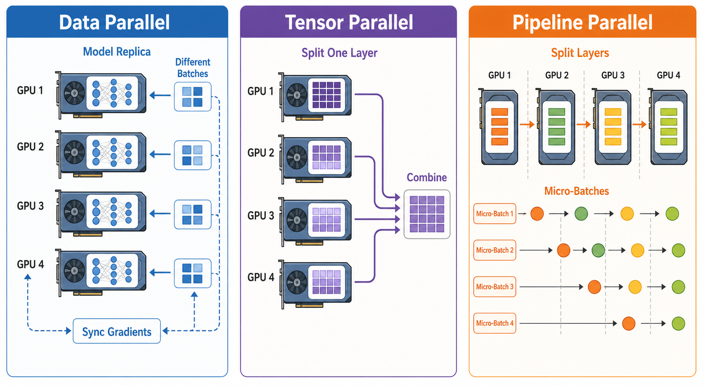
  <figcaption>
    <span class="article-figure__number">图 18</span>
    <span class="article-figure__text">三种分布式并行方式。数据并行拆 batch 并同步梯度；张量并行拆分层内计算；流水线并行把连续层分配到不同设备。</span>
  </figcaption>
</figure>

| 方法 | 拆分对象 | 主要通信 | 主要挑战 |
|---|---|---|---|
| 数据并行（DP） | batch | 梯度 All-Reduce | 每卡仍需容纳模型 |
| 张量并行（TP） | 单层矩阵 | 层内 All-Reduce/All-Gather | 通信频繁、要求高速互联 |
| 流水线并行（PP） | 模型层 | 相邻 stage 激活值 | 流水线气泡与调度 |

实际大模型训练常组合三者。ZeRO/FSDP 还会进一步分片参数、梯度和优化器状态，降低数据并行副本的显存占用。

### 11.3 训练精度与推理量化

| 格式 | 常见用途 | 特点 |
|---|---|---|
| FP32 | 关键统计量、基准 | 精度高，显存和带宽开销大 |
| BF16 | 训练与推理 | 指数范围接近 FP32，训练较稳定 |
| FP16 | 训练与推理 | 精度较高，但指数范围较小 |
| INT8 | 推理权重/激活 | 更省显存，通常需校准 |
| INT4 | 推理权重 | 压缩更强，量化误差更明显 |

对称量化的基本思想是用缩放因子把浮点值映射到有限整数范围：

$$
s=\frac{\max|x|}{q_{max}},\qquad
q=\operatorname{clamp}(\operatorname{round}(x/s),-q_{max},q_{max})
$$

```python
def fake_symmetric_quantize(x: torch.Tensor, bits: int = 8):
    qmax = 2 ** (bits - 1) - 1
    scale = x.abs().amax().clamp_min(1e-8) / qmax
    q = torch.clamp(torch.round(x / scale), -qmax, qmax)
    dequantized = q * scale
    return dequantized, q, scale


x = torch.randn(4, 8)
x_hat, q, scale = fake_symmetric_quantize(x, bits=8)
print(x.shape, q.dtype, scale.shape)
```

这是理解量化误差的简化示例。`q` 的数值已经取整，但为了方便反量化仍存放在浮点 Tensor 中，并不代表真实的 INT8 存储压缩。工程实现通常采用逐通道或分组量化，并使用真正的整数打包与专用低比特内核；“文件更小”不自动等于“运行更快”。

## 12. 文本生成与解码加速

### 12.1 Temperature、Greedy、Top-K 与 Top-P

语言模型先输出 logits，再用温度调整分布：

$$
p_i=\operatorname{softmax}(z_i/\tau)
$$

- `τ < 1`：分布更尖锐，输出更确定。
- `τ > 1`：分布更平坦，随机性更强。
- Greedy：总是选择最大概率 token。
- Top-K：只从概率最高的固定 K 个 token 中采样。
- Top-P：选择累计概率达到 P 的最小候选集合，也称 nucleus sampling。

<figure class="article-figure">
  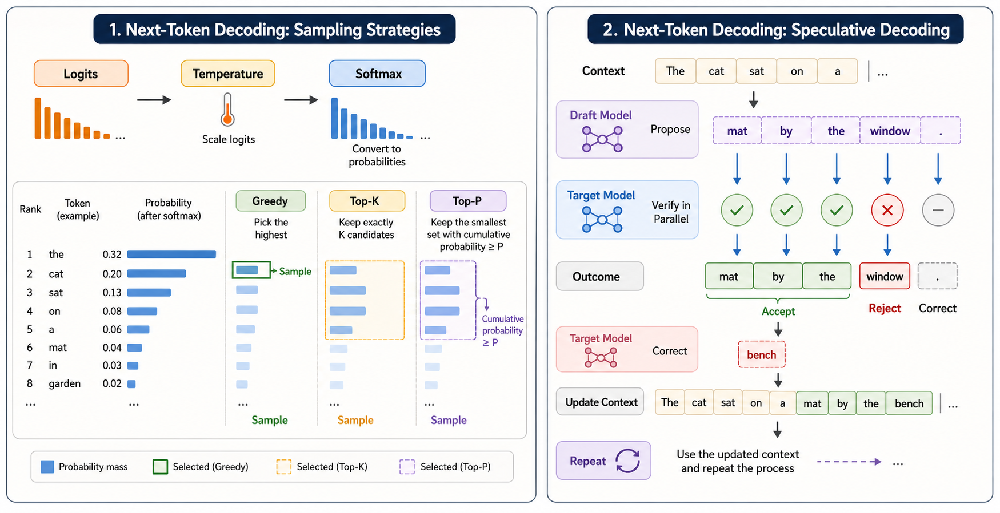
  <figcaption>
    <span class="article-figure__number">图 19</span>
    <span class="article-figure__text">采样与推测解码。左侧比较 Greedy、Top-K、Top-P 的候选范围；右侧展示 Draft Model 提议和 Target Model 并行验证的概念流程。</span>
  </figcaption>
</figure>

右图中的勾和叉是接受或拒绝结果的概念化表示，并不等同于“Draft token 是否等于 Target Model 的 argmax”。标准随机推测采样依据 Draft 与 Target 的概率比执行接受检验，并在拒绝处从校正后的分布采样，才能保持目标模型原本的输出分布。

```python
def sample_top_k(logits: torch.Tensor, temperature=1.0, top_k=50):
    if temperature <= 0:
        raise ValueError("temperature must be positive")
    if top_k <= 0:
        raise ValueError("top_k must be positive")
    logits = logits / temperature
    k = min(top_k, logits.size(-1))
    top_values, top_indices = torch.topk(logits, k, dim=-1)
    filtered = torch.full_like(logits, -torch.inf)
    filtered.scatter_(-1, top_indices, top_values)
    probs = torch.softmax(filtered, dim=-1)
    return torch.multinomial(probs, num_samples=1)


next_token = sample_top_k(torch.randn(2, 100), temperature=0.8, top_k=20)
print(next_token.shape)  # [2,1]
```

采样策略改变的是解码决策，不会改变模型参数。评测确定性任务时常用 Greedy；开放式生成则需根据任务调节温度和候选截断。

### 12.2 推测解码

推测解码使用较小的 Draft Model 快速提出多个候选 token，再让 Target Model 一次并行验证：

1. Draft Model 根据当前上下文连续提出若干 token。
2. Target Model 在一次前向中计算这些位置的分布。
3. 按严格接受规则保留一段候选；首次拒绝处由 Target Model 修正。
4. 将接受结果加入上下文并重复。

它的目标是在保持目标模型分布不变的前提下，一次推进多个 token。收益取决于草稿接受率、两模型速度差和验证开销；它与 KV Cache 可以同时使用。

## 13. 端到端 MiniGPT：从 Token 到一次参数更新

前面已经分别实现 Attention、Embedding、FFN、Transformer Block 和 LM Head。现在把它们组合成一个最小因果语言模型。

<figure class="article-figure">
  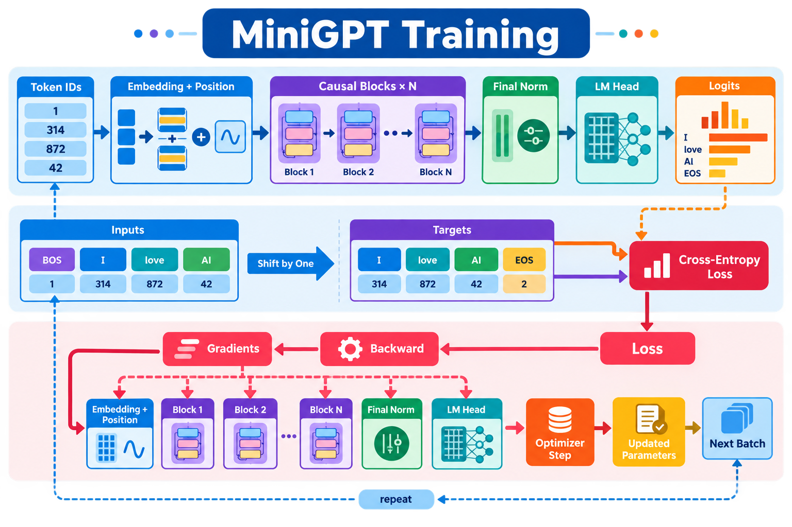
  <figcaption>
    <span class="article-figure__number">图 20</span>
    <span class="article-figure__text">MiniGPT 的一次训练迭代。输入与目标错开一个 token；Cross-Entropy 产生损失，反向传播计算梯度，优化器更新可学习参数。</span>
  </figcaption>
</figure>

### 13.1 Shifted Inputs 与 Targets

给定完整 token 序列：

```text
完整序列：[BOS, I, love, AI, EOS]
模型输入：[BOS, I, love, AI]
监督目标：[I, love, AI, EOS]
```

位置 `t` 的 logits 用于预测目标 `t`，也就是原序列中的下一个 token。因果 mask 保证模型无法从隐藏状态中偷看未来答案。

### 13.2 MiniGPT 模型

下面的代码复用前文定义的 `InputEmbedding` 和 `TransformerBlock`：

```python
class MiniGPT(nn.Module):
    def __init__(
        self,
        vocab_size: int,
        max_seq_len: int,
        dim: int,
        num_heads: int,
        hidden_dim: int,
        num_layers: int,
        dropout: float = 0.1,
    ):
        super().__init__()
        self.vocab_size = vocab_size
        self.embedding = InputEmbedding(vocab_size, dim, max_seq_len)
        self.blocks = nn.ModuleList([
            TransformerBlock(dim, num_heads, hidden_dim, dropout)
            for _ in range(num_layers)
        ])
        self.final_norm = nn.LayerNorm(dim)
        self.lm_head = nn.Linear(dim, vocab_size, bias=False)

        self.apply(self._init_weights)

        # Weight tying：输入 token embedding 与输出词表投影共享参数
        self.lm_head.weight = self.embedding.token.weight

    @staticmethod
    def _init_weights(module: nn.Module):
        if isinstance(module, (nn.Linear, nn.Embedding)):
            nn.init.normal_(module.weight, mean=0.0, std=0.02)
            if isinstance(module, nn.Linear) and module.bias is not None:
                nn.init.zeros_(module.bias)

    def forward(
        self,
        token_ids: torch.Tensor,
        targets: torch.Tensor | None = None,
        valid_tokens: torch.Tensor | None = None,
    ):
        x = self.embedding(token_ids)             # [B,T,C]
        for block in self.blocks:
            x = block(                            # [B,T,C]
                x, causal=True, valid_tokens=valid_tokens
            )
        hidden = self.final_norm(x)
        logits = self.lm_head(hidden)              # [B,T,V_vocab]

        loss = None
        if targets is not None:
            loss = nn.functional.cross_entropy(
                logits.reshape(-1, self.vocab_size),
                targets.reshape(-1),
            )
        return logits, loss
```

`cross_entropy` 直接接收 logits，内部完成 `log_softmax` 与负对数似然；不要提前手动调用 softmax，否则会造成重复归一化和数值稳定性下降。

### 13.3 一次完整训练步骤

```python
torch.manual_seed(0)
model = MiniGPT(
    vocab_size=100,
    max_seq_len=32,
    dim=24,
    num_heads=4,
    hidden_dim=96,
    num_layers=2,
    dropout=0.1,
)
optimizer = torch.optim.AdamW(model.parameters(), lr=3e-4)

# full_tokens: [B,T+1]，最后一维相邻错位生成输入和目标
full_tokens = torch.randint(0, 100, (4, 9))
inputs = full_tokens[:, :-1]   # [4,8]
targets = full_tokens[:, 1:]   # [4,8]

model.train()
optimizer.zero_grad(set_to_none=True)
logits, loss = model(inputs, targets)
loss.backward()
grad_norm = torch.nn.utils.clip_grad_norm_(model.parameters(), max_norm=1.0)
optimizer.step()

print("logits:", logits.shape)  # [4,8,100]
print("loss:", float(loss.detach()))
print("grad norm:", float(grad_norm))
```

训练循环会对不同 batch 重复上述步骤。真实训练还需要学习率调度、验证集、checkpoint、混合精度、梯度累积和分布式数据加载。

### 13.4 Loss 与困惑度

平均 token 交叉熵为：

$$
\mathcal{L}=-\frac{1}{N}\sum_{n=1}^{N}\log p(y_n\mid x_{<n})
$$

困惑度（Perplexity）定义为：

$$
\operatorname{PPL}=e^{\mathcal{L}}
$$

```python
perplexity = torch.exp(loss.detach())
print("perplexity:", float(perplexity))
```

困惑度越低表示模型平均给正确 token 分配了更高概率，但它只适合在相同 tokenizer 和相同数据处理方式下比较。

## 14. Encoder、Decoder 与 Encoder-Decoder

Transformer 不是只有一种结构。三类架构的核心差异是 Attention 可见范围，以及是否需要 Cross-Attention。

<figure class="article-figure">
  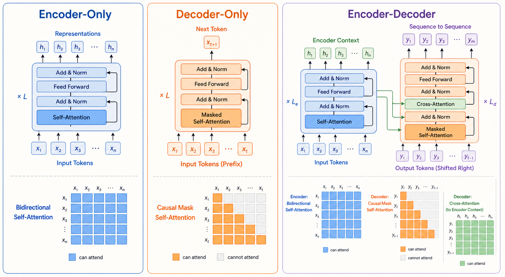
  <figcaption>
    <span class="article-figure__number">图 21</span>
    <span class="article-figure__text">三类 Transformer 架构。Encoder-Only 使用双向注意力，Decoder-Only 使用因果注意力，Encoder-Decoder 通过 Cross-Attention 连接输入与输出。</span>
  </figcaption>
</figure>

| 架构 | Attention | 输出形式 | 典型任务 |
|---|---|---|---|
| Encoder-Only | 双向 Self-Attention | 每个输入 token 的上下文表示 | 分类、抽取、检索表示 |
| Decoder-Only | Causal Self-Attention | 下一个 token 分布 | 文本生成、续写、对话 |
| Encoder-Decoder | Encoder 双向；Decoder 因果 + Cross-Attention | 条件生成序列 | 翻译、摘要、结构转换 |

Encoder-Only 能同时看到左右上下文，但不能直接作为严格的自回归生成器。Decoder-Only 只能看当前位置及过去。Encoder-Decoder 的 Decoder 先读取已生成前缀，再用 Query 查询 Encoder Context 的 K/V。

## 15. Tokenizer、Packing 与 Batch

### 15.1 从文本到 Token IDs

Tokenizer 通常先把文本切成子词，再映射为整数 ID。子词方法可以在词表大小和未知词问题之间折中。

```text
原始文本：unbelievable!
子词序列：["un", "believ", "able", "!"]
Token IDs：[421, 9832, 617, 5]
```

常见特殊 token：

| Token | 英文 | 用途 |
|---|---|---|
| `BOS` | Beginning of Sequence | 标记序列开始 |
| `EOS` | End of Sequence | 标记序列结束 |
| `PAD` | Padding | 补齐 batch 内不同长度序列 |
| `UNK` | Unknown | 表示无法编码的内容；子词词表通常很少需要 |

模型的 embedding、LM Head 和 tokenizer 必须使用同一个 token-ID 映射。更换 tokenizer 会改变序列长度、词表大小和模型输入语义。

### 15.2 Padding 与有效位置

不同长度序列组成 batch 时，可以补齐到同一长度，并生成布尔 mask：

```python
def make_lm_batch(sequences: list[list[int]], pad_id: int):
    # 每条 sequence 至少包含两个 token
    B = len(sequences)  # B = Batch Size
    T_full = max(len(seq) for seq in sequences)
    full = torch.full((B, T_full), pad_id, dtype=torch.long)
    valid = torch.zeros((B, T_full), dtype=torch.bool)

    for row, seq in enumerate(sequences):
        length = len(seq)
        full[row, :length] = torch.tensor(seq)
        valid[row, :length] = True

    inputs = full[:, :-1]                 # [B,T]
    targets = full[:, 1:]                 # [B,T]
    input_valid = valid[:, :-1]           # Attention 使用
    target_valid = valid[:, 1:]
    targets = targets.masked_fill(~target_valid, -100)  # Loss 忽略
    return inputs, targets, input_valid


sequences = [[1, 20, 21, 2], [1, 30, 2]]
inputs, targets, valid_tokens = make_lm_batch(sequences, pad_id=0)
print(inputs.shape, targets.shape, valid_tokens.shape)  # 都是 [2,3]

# MiniGPT 会把 valid_tokens 逐层传给 Attention，并用 -100 忽略 PAD target
logits, loss = model(
    inputs,
    targets=targets,
    valid_tokens=valid_tokens,
)
```

`valid_tokens` 作为 Key Padding Mask 逐层传入 Attention；target 中的 `-100` 是 PyTorch Cross-Entropy 默认忽略值。二者相关但不能互相替代：一个控制 Attention 可见性，另一个控制哪些位置计入 Loss。本文实现采用右侧 Padding，并保证每条序列至少有一个有效输入 token，因此不会产生整行 Key 都被屏蔽的情况。

### 15.3 Packing

Padding 过多会浪费计算。Packing 把多条短样本拼入一个固定长度块，提高有效 token 比例。工程实现必须额外阻止不同样本之间互相 Attention，并正确处理每段的位置编号和 Loss 边界，不能只把 token 粗暴连接。

## 16. 训练工程与稳定性

<figure class="article-figure">
  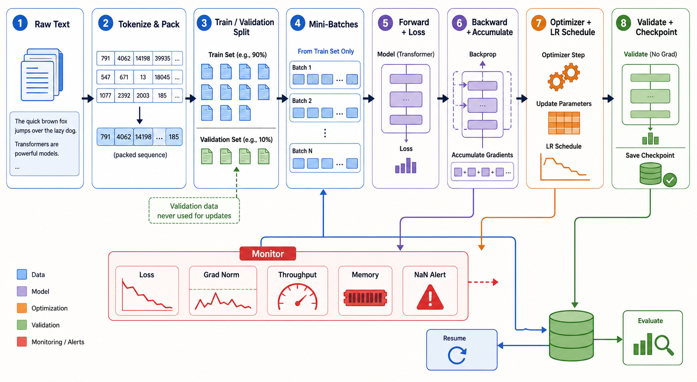
  <figcaption>
    <span class="article-figure__number">图 22</span>
    <span class="article-figure__text">训练生命周期。从数据处理到前向、反向、参数更新、验证和 Checkpoint 形成闭环；验证集只用于评估，不参与梯度更新。</span>
  </figcaption>
</figure>

### 16.1 AdamW、Warmup 与学习率衰减

AdamW 将权重衰减与梯度更新解耦。Transformer 训练通常先 warmup，随后使用 cosine 或线性衰减：

```python
def warmup_cosine_lr(step: int, warmup: int, total: int):
    if step < warmup:
        return step / max(1, warmup)
    progress = (step - warmup) / max(1, total - warmup)
    progress = min(max(progress, 0.0), 1.0)
    return 0.5 * (1.0 + math.cos(math.pi * progress))


optimizer = torch.optim.AdamW(model.parameters(), lr=3e-4, weight_decay=0.1)
scheduler = torch.optim.lr_scheduler.LambdaLR(
    optimizer,
    lr_lambda=lambda step: warmup_cosine_lr(step, warmup=100, total=1000),
)
```

Warmup 可以避免训练初期参数和优化器统计量尚不稳定时使用过大的学习率。实际项目通常不对 bias 和归一化缩放参数施加 weight decay。

### 16.2 梯度累积

显存只能容纳小 micro-batch 时，可以累积多个 micro-batch 的梯度，再更新一次：

```python
accumulation_steps = 4
optimizer.zero_grad(set_to_none=True)

for micro_step in range(accumulation_steps):
    full_tokens = torch.randint(0, 100, (2, 9))
    inputs, targets = full_tokens[:, :-1], full_tokens[:, 1:]
    _, loss = model(inputs, targets)
    (loss / accumulation_steps).backward()

torch.nn.utils.clip_grad_norm_(model.parameters(), 1.0)
optimizer.step()
scheduler.step()
```

除以 `accumulation_steps` 可以让累积后的梯度尺度接近大 batch 的平均损失。分布式训练还应避免在非最后一个 micro-step 做不必要的梯度同步。

### 16.3 混合精度

混合精度让主要矩阵乘法使用 BF16/FP16，同时保留必要的高精度统计：

| 选择 | 建议 |
|---|---|
| BF16 | 硬件支持时通常优先，指数范围较大 |
| FP16 | 常配合 GradScaler 防止梯度下溢 |
| FP32 | Loss、归一化统计或敏感操作可保留高精度 |

`autocast` 控制算子精度，而参数、优化器状态和梯度的实际 dtype 取决于训练框架配置。不要把整个模型盲目转换为低精度后假设数值一定稳定。

### 16.4 Checkpoint 应保存什么

为了真正恢复训练，至少需要：

- 模型参数 `model.state_dict()`
- 优化器状态 `optimizer.state_dict()`
- 学习率调度器状态
- 当前 step/epoch
- 随机数状态与数据采样位置（追求严格复现时）
- 模型配置、tokenizer 版本和代码版本

只保存模型权重适合推理，不足以无缝恢复训练。

## 17. 评测、监控与排错

### 17.1 最小评测原则

- 训练集用于梯度更新；验证集只做 `model.eval()` 和 `torch.no_grad()` 前向。
- 报告 token 加权的平均 Loss，避免先平均每个 batch 再平均造成长度偏差。
- PPL 只能在相同 tokenizer、数据切分和预处理下比较。
- 生成质量还要结合任务指标、人工评测以及安全性评测。

### 17.2 推荐监控项

| 指标 | 正常信号 | 异常可能原因 |
|---|---|---|
| Train/Val Loss | 总体下降，间距可控 | 过拟合、数据分布偏移 |
| Gradient Norm | 有波动但有限 | 学习率过大、数值爆炸 |
| Learning Rate | 符合计划曲线 | scheduler 调用顺序错误 |
| Tokens/s | 相对稳定 | 数据阻塞、通信瓶颈 |
| GPU Memory | 接近稳定平台 | 内存泄漏、动态 shape |
| Expert Load | 相对均衡 | Router collapse |

### 17.3 常见故障定位

| 现象 | 优先检查 |
|---|---|
| Loss 接近 `log(V_vocab)` 且不下降 | labels 是否错位、梯度是否存在、学习率是否为 0 |
| Loss 异常地接近 0 | 是否发生未来信息泄漏或训练/验证数据重复 |
| 出现 NaN/Inf | 全 mask 行、学习率、低精度溢出、除零 |
| 输出重复 | 解码温度过低、训练数据重复、EOS 处理错误 |
| Padding 影响结果 | Key mask 广播方向、Loss 的 `ignore_index` |
| 训练很慢 | 有效 token 比、数据加载、Attention 内核、通信等待 |

最有效的起步调试方法是让模型过拟合一个极小 batch：如果几十到几百步内 Loss 仍无法明显下降，优先怀疑实现、数据或优化器，而不是模型容量。

## 18. Attention 方法全景

“Attention 的种类”并不是一张互斥清单。同一个模型可以同时使用 **RoPE + Causal Mask + GQA + Sliding Window + FlashAttention**：它们分别改变位置表达、可见范围、K/V 共享方式、连接稀疏性和执行算法。

### 18.1 先按六个维度分类

| 维度 | 核心问题 | 常见选择 |
|---|---|---|
| 打分函数 | Query 与 Key 如何计算相关性？ | Additive、Dot Product、Scaled Dot Product、Cosine |
| 可见范围 | 一个 Query 能看到哪些 Key？ | Bidirectional、Causal、Window、Sparse、Global Token |
| 位置机制 | 顺序和距离如何进入计算？ | Absolute、Relative Bias、RoPE、ALiBi |
| 头部共享 | 各 Query Head 是否共享 K/V？ | MHA、GQA、MQA |
| 计算方式 | 是否构造完整的 `T × T` 矩阵？ | Dense、Low-rank、Kernel/Linear、FlashAttention |
| 信息来源 | Q 与 K/V 来自哪里？ | Self、Cross、Co-Attention、Memory/Retrieval |

<figure class="article-figure">
  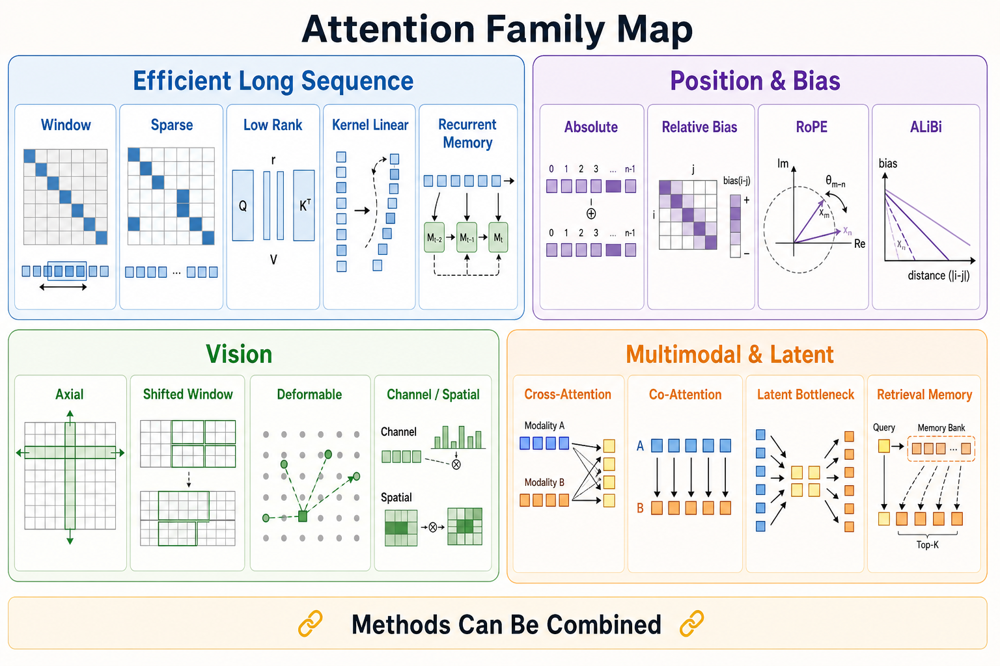
  <figcaption>
    <span class="article-figure__number">图 23</span>
    <span class="article-figure__text">Attention 方法族的分类视图。长序列、位置机制、视觉结构、多模态和外部记忆是可组合的设计维度，并非互斥类别。</span>
  </figcaption>
</figure>

### 18.2 四种常见打分函数

设单个 Query 为 \(q_i\)，单个 Key 为 \(k_j\)，打分结果 \(e_{ij}\) 表示二者的匹配程度：

\[
\begin{aligned}
\text{Additive:}\quad &e_{ij}=v_a^\top\tanh(W_q q_i+W_k k_j+b) \\
\text{Dot Product:}\quad &e_{ij}=q_i^\top k_j \\
\text{Scaled Dot Product:}\quad &e_{ij}=\frac{q_i^\top k_j}{\sqrt{D_h}} \\
\text{Cosine:}\quad &e_{ij}=\frac{q_i^\top k_j}{\lVert q_i\rVert_2\lVert k_j\rVert_2}
\end{aligned}
\]

Additive Attention 用一个小网络学习匹配函数；点积可以直接用矩阵乘法；缩放点积抑制维度增大造成的分数过大；Cosine 只比较方向。无论采用哪一种，后续通常仍是 `mask → Softmax → 加权汇总 V`。

<figure class="article-figure">
  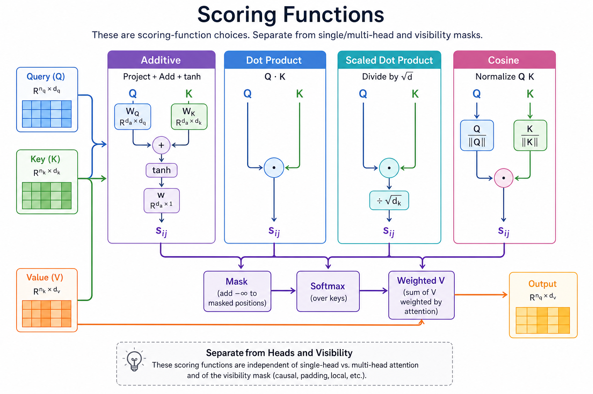
  <figcaption>
    <span class="article-figure__number">图 24</span>
    <span class="article-figure__text">四类 Attention 打分函数。它们改变 Query-Key 相关性分数的计算方式；Mask、按 Key 归一化和 Value 加权汇总的后续流程可以保持一致。</span>
  </figcaption>
</figure>

下面的代码统一返回 `[B, Tq, Tk]`，适合直接比较：

```python
import math
import torch
import torch.nn as nn
import torch.nn.functional as F

B, Tq, Tk, D = 2, 3, 5, 8
q = torch.randn(B, Tq, D)
k = torch.randn(B, Tk, D)

dot_scores = q @ k.transpose(-2, -1)
scaled_scores = dot_scores / math.sqrt(D)
cosine_scores = F.normalize(q, dim=-1) @ F.normalize(k, dim=-1).transpose(-2, -1)

class AdditiveScore(nn.Module):
    def __init__(self, dim, attn_dim):
        super().__init__()
        self.q_proj = nn.Linear(dim, attn_dim, bias=False)
        self.k_proj = nn.Linear(dim, attn_dim, bias=False)
        self.energy = nn.Linear(attn_dim, 1, bias=False)

    def forward(self, q, k):
        # [B,Tq,1,A] + [B,1,Tk,A] -> [B,Tq,Tk,A]
        joint = torch.tanh(self.q_proj(q)[:, :, None, :] + self.k_proj(k)[:, None, :, :])
        return self.energy(joint).squeeze(-1)

additive_scores = AdditiveScore(D, attn_dim=12)(q, k)
for scores in (dot_scores, scaled_scores, cosine_scores, additive_scores):
    assert scores.shape == (B, Tq, Tk)
    attn = torch.softmax(scores, dim=-1)
    assert torch.allclose(attn.sum(-1), torch.ones(B, Tq), atol=1e-6)
```

### 18.3 位置相关 Attention：Relative Bias 与 ALiBi

绝对位置编码加到输入上；Relative Position Bias 根据 Query 与 Key 的相对距离给分数加偏置；RoPE 旋转 Q/K，使点积自然包含相对位置信息。ALiBi（Attention with Linear Biases）则不修改 Embedding，而是在分数上加入与距离成正比的线性惩罚：

\[
S_{h,i,j}=\frac{q_{h,i}k_{h,j}^{\top}}{\sqrt{D_h}}-m_h(i-j),\qquad j\le i
\]

其中 \(m_h\) 是第 \(h\) 个 Head 的固定斜率；距离越远，惩罚通常越大。不同 Head 使用不同斜率，可以同时关注局部与较远上下文。

```python
def add_alibi(scores, slopes):
    # scores: [B,H,T,T]；slopes: [H]
    T = scores.size(-1)
    pos = torch.arange(T, device=scores.device)
    distance = (pos[:, None] - pos[None, :]).clamp_min(0)  # [T,T]
    bias = -slopes[None, :, None, None] * distance[None, None, :, :]
    return scores + bias
```

上例只添加 ALiBi 距离偏置。自回归模型还必须在 Softmax 前对 `j > i` 的未来位置应用 Causal Mask；ALiBi 本身不会阻止未来信息泄漏。

### 18.4 长序列：稀疏、低秩、线性与记忆

标准 Dense Attention 的分数矩阵包含 \(T^2\) 个元素。长序列方法主要从以下方向降低开销：

| 方法 | 核心做法 | 典型特点 |
|---|---|---|
| Local/Sliding Window | 每个 token 只连接附近窗口 | 局部建模强，成本随窗口宽度近似线性增长 |
| Sparse + Global | 局部连接外加入少量全局 token | 兼顾局部细节和跨段传播 |
| Low-rank | 沿序列维压缩 K/V | 以低秩假设换取更低成本 |
| Kernel/Linear | 用特征映射重排 `Q(KᵀV)` | 避免显式保存完整 `T × T` 矩阵 |
| Recurrent Memory | 分段处理并复用前一段状态 | 上下文可跨 segment 延伸 |

必须特别区分：**FlashAttention 不改变标准 Attention 的数学结果，也不是低秩或稀疏近似**。它通过分块计算和减少显存读写来加速精确 Attention；而 Linformer、Kernel/Linear Attention 等会改变计算形式或采用近似假设。

### 18.5 视觉、多模态与外部记忆

- **Axial Attention**：依次沿图像的高、宽等轴计算，减少二维全连接成本。
- **Window / Shifted Window**：在局部图像窗口内注意，再移动窗口实现跨窗口交流。
- **Deformable Attention**：围绕参考点只采样少量关键位置，适合检测和多尺度特征。
- **Channel/Spatial Attention**：分别给通道或空间位置加权，常见于卷积视觉模块。
- **Cross-Attention**：Q 来自当前流，K/V 来自另一流，例如文本解码器读取图像特征。
- **Co-Attention**：两种模态相互查询，形成双向交互。
- **Latent Bottleneck**：用少量可学习 Latent 查询大量输入，再在 Latent 空间处理。
- **Retrieval/Memory Attention**：K/V 来自检索结果、历史记忆或外部数据库。

### 18.6 如何选择

| 需求 | 优先考虑 | 原因 |
|---|---|---|
| 普通短序列编码 | Bidirectional MHA | 实现成熟，所有 token 可互相读取 |
| 自回归文本生成 | Causal MHA/GQA + KV Cache | 防止未来泄漏，并降低逐 token 解码成本 |
| 很长的局部结构 | Sliding Window + 少量 Global Token | 控制显存，同时保留跨区信息通道 |
| 长文本但要求精确 Dense Attention | FlashAttention | 保持数学定义不变，重点优化硬件执行 |
| 图文或编码器—解码器交互 | Cross-Attention | 明确区分查询来源和信息来源 |
| 大量输入、较少任务状态 | Latent Bottleneck | 先把输入压缩到固定数量的 Latent |
| 解码显存成为瓶颈 | GQA 或 MQA | 多个 Query Head 共享较少的 K/V Head |

选择时先确定“谁能看谁”和“Q、K、V 来自哪里”，再决定位置机制与 Head 共享；只有在序列成本确实成为瓶颈时，才需要引入稀疏或近似结构。

### 18.7 延伸阅读：代表性原始论文

- [Attention Is All You Need（Transformer、Scaled Dot-Product 与 Multi-Head Attention）](https://arxiv.org/abs/1706.03762)
- [Root Mean Square Layer Normalization（RMSNorm）](https://arxiv.org/abs/1910.07467)
- [Fast Transformer Decoding: One Write-Head is All You Need（MQA）](https://arxiv.org/abs/1911.02150)
- [GLU Variants Improve Transformer（GEGLU、SwiGLU）](https://arxiv.org/abs/2002.05202)
- [RoFormer: Enhanced Transformer with Rotary Position Embedding（RoPE）](https://arxiv.org/abs/2104.09864)
- [FlashAttention: Fast and Memory-Efficient Exact Attention with IO-Awareness](https://arxiv.org/abs/2205.14135)
- [GQA: Training Generalized Multi-Query Transformer Models from Multi-Head Checkpoints](https://arxiv.org/abs/2305.13245)
- [Neural Machine Translation by Jointly Learning to Align and Translate（Additive Attention）](https://arxiv.org/abs/1409.0473)
- [Effective Approaches to Attention-based Neural Machine Translation（Dot-product Attention）](https://arxiv.org/abs/1508.04025)
- [Longformer: The Long-Document Transformer（局部、稀疏与全局 Attention）](https://arxiv.org/abs/2004.05150)
- [Linformer: Self-Attention with Linear Complexity（低秩投影）](https://arxiv.org/abs/2006.04768)
- [Rethinking Attention with Performers（Kernel Attention）](https://arxiv.org/abs/2009.14794)
- [Train Short, Test Long: Attention with Linear Biases（ALiBi）](https://arxiv.org/abs/2108.12409)
- [Perceiver: General Perception with Iterative Attention（Latent Bottleneck）](https://arxiv.org/abs/2103.03206)
- [Deformable DETR（Deformable Attention）](https://arxiv.org/abs/2010.04159)

这些方法不要求一次全部掌握。先用标准缩放点积 Attention 建立形状直觉，再根据长上下文、视觉、多模态或推理显存等具体问题选择分支。

## 19. 代码与形状速查

```text
单头：X [B,T,C] → Q/K/V [B,T,C] → attn [B,T,T] → out [B,T,C]
多头：X [B,T,C] → Q/K/V [B,H,T,Dh] → attn [B,H,T,T]
      → heads [B,H,T,Dh] → concat [B,T,C] → out [B,T,C]
```

常见误区：

- Q、K、V 不是三份完全相同的 X，而是 X 的三种可学习投影。
- 多头不是把完整的 `C` 维复制 `H` 次，而是通常满足 `H × Dh = C`。
- `scores` 和 `attn` 的最后两维都是 `[T,T]`，表示 token 两两之间的关系。
- causal mask 屏蔽未来信息；padding mask 则屏蔽补齐位置，两者用途不同。
- 完整实现还要正确组合 mask、位置编码、归一化、Dropout 和训练目标。

## 20. 运行与自测

把第 7 或第 8 节的任一完整代码块保存为 Python 文件并运行即可。单头示例的输入、输出为 `[2,4,8]`，注意力矩阵为 `[2,4,4]`；多头示例的输入、输出为 `[2,4,12]`，注意力矩阵为 `[2,3,4,4]`。

建议验证这些数学性质：

```python
# 每一行都是概率分布
assert torch.allclose(attn.sum(-1), torch.ones_like(attn.sum(-1)))

# causal=True 时，上三角未来位置的权重为 0
future = torch.triu(attn, diagonal=1)
assert torch.allclose(future, torch.zeros_like(future))
```

### 建议动手实验

1. 把 `T` 改成 3，手动画出 `[3,3]` 的 causal mask。
2. 固定 `torch.manual_seed(0)`，比较手写路径和 SDPA 路径的输出。
3. 将多头示例改为 `C=48, H=4`，预测并验证 `head_dim`。
4. 给输入设置 `requires_grad=True`，调用 `out.sum().backward()`，观察投影层是否获得梯度。

### 知识检查

建议先在纸上写出形状或公式，再展开答案核对。前 5 题检查 Attention 核心，后 6 题覆盖完整 Block 与推理工程。

#### Attention 核心

<details>
<summary>1. 为什么 Q、K、V 形状相同，却承担不同作用？</summary>

它们来自三个参数彼此独立的线性投影。Q/K 的点积决定匹配程度，V 则提供最终被加权汇总的内容。
</details>

<details>
<summary>2. 为什么单头除以 √C，多头除以 √Dh？</summary>

缩放维度必须等于实际参与一次点积的特征数。单头沿完整的 `C` 维点积；多头沿每头的 `Dh = C // H` 维点积。
</details>

<details>
<summary>3. Softmax 为什么沿最后一维计算？</summary>

Attention 分数的最后一维枚举所有 Key。对每个 Query 行沿该维归一化，才能得到“这个 Query 应该分别关注哪些 Key”的概率分布。

这里说的是 Dropout 前的 Softmax 权重。训练模式下应用 Attention Dropout 后，某一行的实际和不一定仍为 1。
</details>

<details>
<summary>4. Causal Mask 和 Padding Mask 有什么区别？</summary>

Causal Mask 屏蔽未来位置，防止自回归模型泄露答案；Padding Mask 屏蔽为凑齐 batch 长度而添加的 PAD Key。两种 mask 可以组合使用，但它们都不能替代 Loss Mask：PAD target 仍需通过 `ignore_index` 等方式排除。
</details>

<details>
<summary>5. 训练阶段为什么通常不需要 KV Cache？</summary>

训练通常一次并行处理完整序列，所有 K/V 一次生成。KV Cache 主要用于逐 token 推理，避免重复计算已生成前缀的 K/V。
</details>

#### Block 结构与现代组件

<details>
<summary>6. FFN 为什么需要激活函数，并且最后必须降回 C 维？</summary>

没有激活函数时，两层 Linear 可以合并成一层，模型仍只是线性变换。GELU 等激活提供非线性；第二层降回 `C` 维，是为了保持 Block 的输入输出形状一致，并能与残差分支逐元素相加。
</details>

<details>
<summary>7. Post-Norm 与 Pre-Norm 的主要区别是什么？</summary>

Post-Norm 计算 `LN(x + Sublayer(x))`，归一化发生在残差相加之后；Pre-Norm 计算 `x + Sublayer(LN(x))`，归一化发生在子层之前。Pre-Norm 保留更直接的残差主路径，深层网络通常更容易优化。
</details>

<details>
<summary>8. MHA、GQA、MQA 为什么会有不同的 KV Cache 大小？</summary>

它们可以保持相同的 Query Head 数，但 K/V Head 数不同。MHA 通常每个 Query Head 对应一组 K/V；GQA 让一组 Query Heads 共享 K/V；MQA 让所有 Query Heads 共享一组 K/V。缓存大小与 `Hkv` 成正比，因此依次减小。
</details>

<details>
<summary>9. FlashAttention 是否把 O(T²) 的 Dense Attention 变成了线性复杂度？</summary>

没有。FlashAttention 仍计算精确的 Dense Attention，主要通过分块和在线 Softmax 减少 HBM 与片上存储之间的数据读写，并避免把完整注意力矩阵写回显存。它不等同于 Sliding Window、稀疏或线性 Attention。
</details>

#### 推理与工程

<details>
<summary>10. 如何估算 KV Cache？32 层、B=1、Tcache=4096、Hkv=8、Dh=128、BF16 时约占多少显存？</summary>

使用公式 `2 × L × B × Tcache × Hkv × Dh × bytes`。代入 BF16 的 2 bytes：

```text
2 × 32 × 1 × 4096 × 8 × 128 × 2
= 536,870,912 bytes
= 512 MiB
```

这只是 K/V 主体，不含模型权重、激活、分配器保留空间和分页管理开销。
</details>

<details>
<summary>11. 使用 KV Cache 逐 token 解码时，RoPE 为什么需要 position_offset？</summary>

新 token 的张量长度虽然是 1，但它在完整序列中的位置不是 0。RoPE 必须使用当前绝对位置，通常等于已有缓存长度；如果每一步都从位置 0 开始旋转，Query/Key 的相对位置信息就会错误。
</details>

### 学习完成标准

不必一次掌握所有扩展方法。先完成“核心推导”，再检查实现和工程判断。

#### 核心推导

- [ ] 能从 `[B,T,C]` 推导出 Q/K/V、Scores、Attention Weights 和输出的形状。
- [ ] 能把 `[B,T,C]` 拆成 `[B,H,T,Dh]`，并在多头拼接后恢复 `[B,T,C]`。
- [ ] 能解释缩放因子为什么是实际点积维度的平方根。
- [ ] 能手算一行稳定 Softmax，并解释减最大值和 Mask 填 `-∞` 的原因。
- [ ] 能说明 Attention 沿序列维混合信息、FFN 沿特征维变换信息。

#### 代码实现

- [ ] 能独立实现 Causal Mask，并正确组合 Key Padding Mask。
- [ ] 能解释 `reshape → transpose → matmul → transpose → reshape` 中每一步的维度。
- [ ] 能实现一个带残差、Dropout、Norm 和 FFN 的 Transformer Block。
- [ ] 能运行单头、多头及 MiniGPT 示例，并验证形状、概率和梯度。
- [ ] 能让 Padding 位置既不被有效 Query 读取，也不计入训练 Loss。

#### 工程判断

- [ ] 能区分 Post-Norm/Pre-Norm、LayerNorm/RMSNorm 和 GELU/SwiGLU。
- [ ] 能区分 MHA/GQA/MQA，并根据 `Hkv` 估算 KV Cache。
- [ ] 能说明 Prefill 与 Decode 的差异，以及 RoPE 解码位置偏移的必要性。
- [ ] 能区分 Dense、Sparse/Window、Linear Attention 与 FlashAttention。
- [ ] 能判断 NaN、未来信息泄漏、Padding 污染和 KV Cache 过大应优先检查什么。

## 21. 进一步学习路线

<figure class="article-figure">
  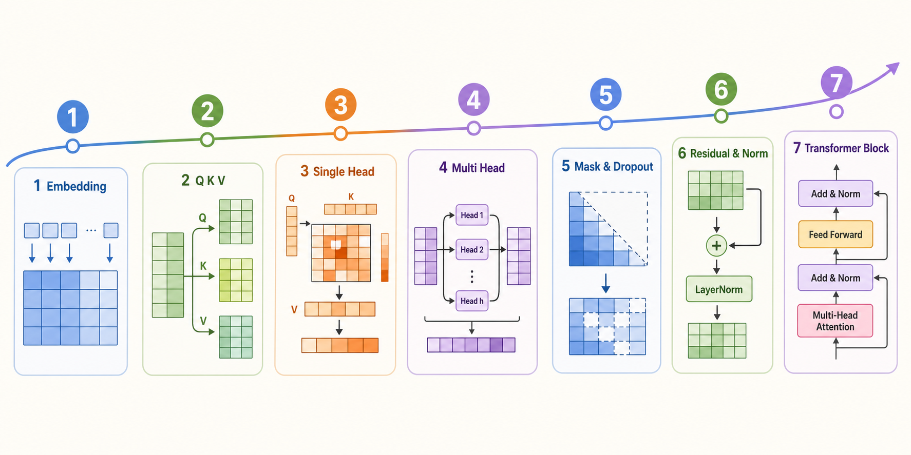
  <figcaption>
    <span class="article-figure__number">图 25</span>
    <span class="article-figure__text">推荐学习路线。从 Embedding 和 Q/K/V 出发，依次掌握单头、多头、Mask、残差与归一化，最后组合完整 Transformer Block。</span>
  </figcaption>
</figure>

掌握本文内容后，可以按目标选择路线：偏算法可继续研究长上下文、稀疏/线性 Attention 与 MoE；偏训练可学习分布式并行、指令微调和偏好对齐；偏应用可研究 RAG 与多模态；偏部署可研究连续批处理、量化和分页 KV Cache。无需按顺序全部学习。
