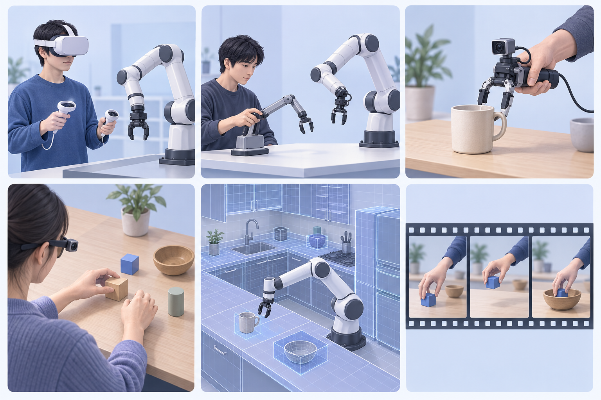
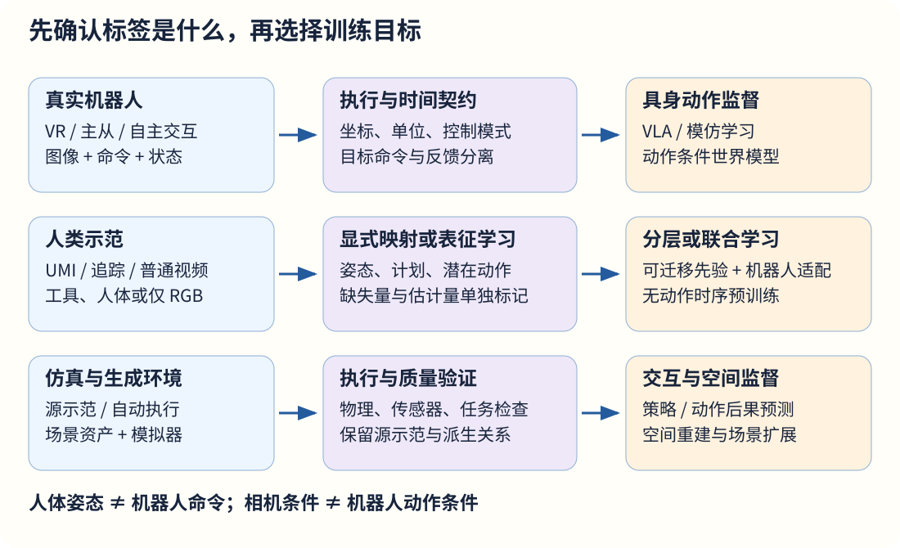
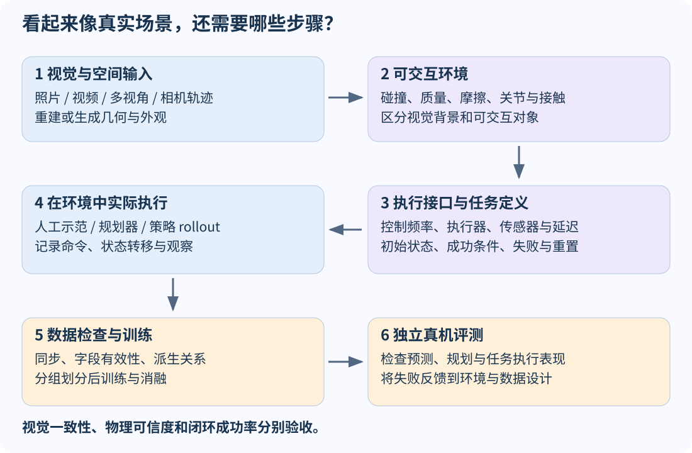
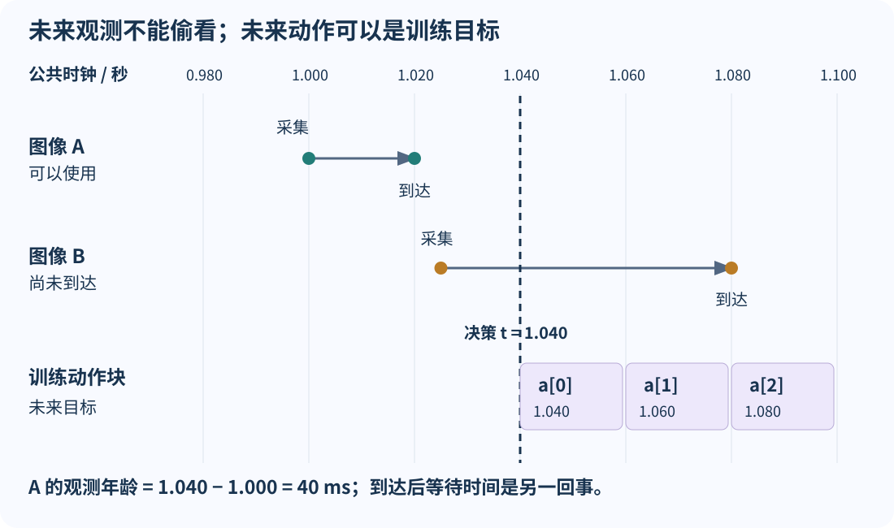

**VLA 和世界模型都需要大量数据，但它们需要的“数据”并不是同一种东西。** 一段人把杯子放进柜子的录像，可以告诉模型物体外观、动作顺序和场景变化；它通常不会直接告诉模型机器人应该向哪个关节发送多少弧度的目标，更不会自动提供接触力、控制延迟和动作失败的反事实结果。

这篇文章围绕一个具体问题展开：**如果要让机器人在真实环境中看懂任务、做出动作并预测后果，哪些数据可以直接使用，哪些需要重建、映射或补采？** 资料核对截至 **2026-09-14**，主要依据论文、作者项目页、官方代码和数据说明。论文结果、开放数据和企业产品进展分别标明；文中的工程建议是基于这些材料的归纳，不是各项目共同采用的标准。



| 想回答的问题 | 阅读入口 |
| --- | --- |
| VR、UMI、egocentric 到底是不是同一层分类 | [分类与监督](#taxonomy)、[来源对照](#comparison) |
| PICO 能记录什么，怎样与机器人连接 | [VR／PICO](#vr-pico)、[时间与坐标](#data-contract) |
| 主从机械臂和手持夹爪怎么选 | [ALOHA 与 BRS](#leader-follower)、[UMI](#umi) |
| 只有人的视频，如何训练机器人的动作 | [第一视角](#egocentric)、[Human Video](#human-video) |
| 李飞飞相关工作有哪些，分别解决什么 | [研究脉络](#fei-fei)、[世界模型](#world-models) |
| 仿真和生成数据能替代多少真机数据 | [仿真](#simulation)、[配比与评测](#evaluation) |
| 想开始搭采集方案 | [源码核对](#xr-source)、[数据契约](#data-contract)、[实施路线](#recipes) |
| 想运行检查与位姿例子 | [数据实验](#data-lab)、[UMI 坐标约定](#umi-action-frame) |

## 1. 先拆开三个维度：接口、视角和监督 {#taxonomy}

“VR、主从、UMI、egocentric、仿真、human video”经常并排出现，但它们回答的问题不同。

- **动作来源与接口**：人怎样提供示范，或者策略怎样自主运行？VR 控制器、主手机械臂、手持夹爪、身体动作和策略输出分别提供输入。
- **视角与载体**：在哪里看、如何记录？头部第一视角、腕部相机、外部固定相机、已有视频属于这一层。
- **交互环境与监督**：动作由真机还是仿真执行？是否保存命令、状态、人体姿态、力觉或只有 RGB？

因此，VR 可以操控真机，也可以操控仿真机器人，还可以只记录人的身体运动；主从系统可以带第一视角相机；UMI 本身包含人类示范与工具视角视频。**Egocentric 描述“从哪里看”，并不保证“有机器人动作”。**

### 1.1 VLA 要学什么

以输出动作块的策略为例：

$$
p_\theta(a_{t:t+H-1}\mid I_{\le t},q_t,\ell).
$$

这里 $I$ 是图像或视觉历史，$q_t$ 是可用的机器人本体状态，$\ell$ 是任务指令，$a$ 是模型所使用的动作表示。要用动作监督训练它，至少需要知道动作的含义、坐标系、单位、时间范围和适用机器人。

“动作向量有 7 个数”远远不够：它可能是 7 个关节角，也可能是三维位移、旋转参数与夹爪量；绝对位姿与增量位姿即使形状相同，语义也完全不同。不同具身可以共享表征或部分动作空间，但仍需要定义适配方式。[X-VLA 专题]()进一步讨论了动作表示与多具身接入。

### 1.2 世界模型至少有三种数据需求

| 目标 | 简化形式 | 数据需要回答的问题 |
| --- | --- | --- |
| 无动作条件的时序预测 | $p(z_{t+1:t+K}\mid z_{\le t})$ | 接下来可能出现什么？ |
| 动作条件的状态／观测预测 | $p(z_{t+1:t+K}\mid z_{\le t},a_{t:t+K-1})$ | 执行这段动作会出现什么？ |
| 空间重建与视角生成 | 场景表示与相机条件渲染 | 换个位置看，场景是什么样？ |
{.table-readable}

$z$ 可以是视觉特征、潜变量或其他状态表征，不一定是 RGB 像素。三种能力可以放进同一个模型，但训练监督和验证方法仍须分别讨论。

**相机轨迹不是机器人控制轨迹；生成连续视频也不等于验证了接触动力学。** 对动作条件模型而言，必须进一步问：条件是电机目标、末端位姿、人体动作、潜在动作编码，还是仅仅相机运动？



## 2. 六类来源各自贡献什么 {#comparison}

下表比较典型配置；实际能记录哪些字段由具体硬件和软件决定。

| 来源 | 常见原始记录 | 对 VLA／世界模型的用途 | 转成机器人学习数据还缺什么 |
| --- | --- | --- | --- |
| VR／XR 遥操作真机 | 头手追踪、图像、机器人命令与状态 | VLA 动作监督；动作条件预测 | 重定向、延迟对齐、实际执行记录 |
| 主从机械臂 | 主手关节、从手命令与反馈、多相机 | VLA 连续动作监督；真实执行后果 | 主从零位与尺度、夹爪映射、跨机器人适配 |
| UMI 类工具 | 工具视角图像、工具轨迹、开合量 | 工具动作策略；工具／物体时序建模 | 跟踪质量、工具接口、可达性和部署时延 |
| 带追踪的第一视角 | RGB、头手／身体姿态、可选深度与语言 | 跨具身预训练；人体条件或无动作预测 | 人体到机器人的动作与视角对齐 |
| 普通人类视频 | RGB、音频、可能不可靠的字幕 | 视觉／计划／潜在动作预训练；视频预测 | 相机运动分离、尺度、动作推断和物理落地 |
| 物理仿真数据 | 仿真状态、控制命令、渲染图像、任务标注 | 模拟示范训练；可控动作后果建模 | 物理与传感器真实性、真机验证 |
{.table-readable}

这里没有一个来源同时拥有“最便宜、最真实、最多样、最精确”的优势。更实用的比较单位是：**满足目标任务的数据契约后，每单位成本能产生多少有效、非重复的监督。**

## 3. VR 与 PICO：把人的意图变成可记录的控制 {#vr-pico}

### 3.1 一套 XR 遥操作系统包含哪些层

典型链路如下，追踪和反馈方向相反：

```text
头显／控制器／手部追踪
          ↓  带时间戳的头手姿态
坐标变换、动作缩放、离合与重定位
          ↓  末端／关节／底盘目标
IK 或全身控制器 → 机器人执行 → 本体反馈
          ↑                        ↓
操作者 ← 网络与头显显示 ← 机器人相机图像
```

头显提供的是人端输入与显示。机器人末端能否到达目标、接触时如何施力、底盘如何保持平衡，依赖后面的控制系统。

**Open-TeleVision（2024）**将立体视觉反馈与人的头、手运动结合，使操作者能主动改变观察方向，再用采集的机器人示范训练策略。它说明“看得清、看得到”也是示范质量的一部分，不能只优化控制器采样率。[论文与项目](https://robot-tv.github.io/)

**XRoboToolkit（2025）**将 XR 端、PC 服务、追踪传输与机器人侧接入拆成模块，以 OpenXR 等接口支持跨设备遥操作。对使用 PICO 的团队，它提供了比从零写头显客户端更具体的系统起点。应沿官方组织中的 Unity Client、PC Service 和 Teleop Sample 阅读，而不是把工具包当成已经适配所有机器人的完整采集产品。[论文](https://arxiv.org/abs/2508.00097)、[项目](https://xr-robotics.github.io/)、[官方仓库组织](https://github.com/XR-Robotics)

论文还给出了一条具体的 VLA 数据链：在 ARX R5 双臂折毯任务中，以 50 FPS 记录 14 维机器人关节状态、14 维位置控制命令，以及三路 424 × 240 RGB 图像；用采集的 100 条示范对 π₀ 做 LoRA 微调。这个例子说明 XR 输入最终应落成机器人侧的状态、命令与视觉记录，而不是只保存头显的手部轨迹。[论文 Section IV-B](https://arxiv.org/html/2508.00097v1)

### 3.2 PICO 的三种不同用途

| 用途 | PICO 侧主要作用 | 训练图像来自哪里 |
| --- | --- | --- |
| 操控真机 | 头手输入、按钮与视觉反馈 | 通常来自机器人相机 |
| 操控仿真 | 向虚拟机器人发送输入 | 仿真渲染器 |
| 记录人类示范 | 头部、手部或身体追踪 | 头显相机接口或另装相机，取决于方案 |
{.table-readable}

不能因为头显能显示透视画面，就默认应用可以保存同样的 RGB 流。PICO 的相机访问还涉及设备、系统、插件版本与权限；XRoboToolkit 的具体测试配置和较新的 PICO Camera Access API 也未必采用相同前提。实施时应对照**自己的设备版本矩阵**，分别验证追踪、原始图像、相机参数与时间戳。[PICO Camera Access 文档](https://developer.picoxr.com/document/unreal-openxr/camera-access/)、[XRoboToolkit Unity Client](https://github.com/XR-Robotics/XRoboToolkit-Unity-Client)

### 3.3 EgoHumanoid：同一种 VR 设备连接两条数据链

**EgoHumanoid（2026）**是非常具体的例子：人体采集使用 PICO、身体追踪器与头戴 ZED X Mini；机器人采集则用 PICO 遥操作 Unitree G1。论文的人体 RGB 由另装相机记录，不能将其描述成“直接读取 PICO 透视画面”。人体数据经过视角与动作对齐，再与机器人数据共同训练。[论文 Section III-B／III-C](https://arxiv.org/html/2602.10106v1)

这条路线的关键是把“带不带机器人出门”变成可分工的问题：机器人示范提供目标具身的执行依据，人类示范提供更多场景。具体如何消除差异，见[第一视角迁移](#ego-transfer)。

### 3.4 VR 示范最容易丢失的四种信息

以下是本文建议保留的工程字段：

1. **追踪原始量与置信度**：遮挡、重定位、手部丢失应能定位到时间段。
2. **变换后的目标**：记录缩放、离合、IK 和限幅后真正下发的量。
3. **机器人实际反馈**：目标到达与否、关节状态、夹爪反馈和异常原因。
4. **图像采集时刻**：曝光时间、接收时间、编码延迟应尽可能分开。

操作者的手已经向前移动，而机器人因限位没有动，是完全可能的。只保存人端追踪会把“意图”误当作机器人已经执行的动作。

### 3.5 从工具包到可用数据：一次源码核对 {#xr-source}

本文另外检查了 XRoboToolkit Python 示例的固定提交 [`79e5cb8`](https://github.com/XR-Robotics/XRoboToolkit-Teleop-Sample-Python/tree/79e5cb8a56e3455515ce1b476e993c764ec58739)。下面是代码阅读结果，不是实际设备性能测试：

| 位置 | 固定版本的行为 | 数据处理时要确认什么 |
| --- | --- | --- |
| [硬件控制基类](https://github.com/XR-Robotics/XRoboToolkit-Teleop-Sample-Python/blob/79e5cb8a56e3455515ce1b476e993c764ec58739/xrobotoolkit_teleop/common/base_hardware_teleop_controller.py) | IK、控制发送与日志分别在线程中运行；日志时间由调用方填写 | 一行日志不代表所有字段在同一瞬间采样 |
| [ARX R5 日志](https://github.com/XR-Robotics/XRoboToolkit-Teleop-Sample-Python/blob/79e5cb8a56e3455515ce1b476e993c764ec58739/xrobotoolkit_teleop/hardware/arx_r5_teleop_controller.py) | 保存 `qpos`、`qvel`、`qpos_des` 与夹爪目标等 | 目标快照不自动证明发送时刻与执行结果 |
| [DataLogger](https://github.com/XR-Robotics/XRoboToolkit-Teleop-Sample-Python/blob/79e5cb8a56e3455515ce1b476e993c764ec58739/xrobotoolkit_teleop/common/data_logger.py) | `add_entry` 保存传入记录，本身不补采集时间 | 字段应由正确的上游采集环节提供 |
| [RealSense 接口](https://github.com/XR-Robotics/XRoboToolkit-Teleop-Sample-Python/blob/79e5cb8a56e3455515ce1b476e993c764ec58739/xrobotoolkit_teleop/hardware/interface/realsense.py) | 将 `get_timestamp()` 返回量放入名为 `timestamp_us` 的字段 | 不能只根据字段名判断单位 |
{.table-readable}

最后一项特别具体：RealSense SDK 的 `rs2_get_frame_timestamp` 文档标明返回**毫秒**；上述代码没有乘 1,000 就写入 `timestamp_us`。如果读者按字段名解释成微秒，会产生 1,000 倍的单位差异。还需要读取相机时间域，再与系统时钟对齐。[SDK v2.58.4 接口说明](https://github.com/realsenseai/librealsense/blob/v2.58.4/include/librealsense2/h/rs_frame.h)

这里并不推断所有已发布 XRoboToolkit 数据都存在相同问题：转换脚本可能另做处理，其他版本也可能修改。它说明了一个实际工作顺序：**先确认代码怎样生成字段，再确认转换脚本怎样解释字段，最后抽样重放验证。**

### 3.6 第一轮 PICO 试采怎样验收

下面是一份小规模试采的检查顺序，属于本文的工程建议。重点是先得到可解释的一小批记录，再扩大采集；各项通过阈值应依据控制周期与任务要求制定。

| 检查项 | 操作与记录 | 通过依据 |
| --- | --- | --- |
| 设备与软件组合 | 固定头显型号、系统、客户端、PC 服务及机器人控制版本 | 换一台采集机仍可识别同一数据接口 |
| 坐标与按钮状态 | 分别沿三个轴移动、旋转；记录离合、重置与追踪失效事件 | 目标方向、尺度和四元数顺序与接口定义一致；参考系跳变有标记 |
| 观测与控制时序 | 分别保存采集、接收、命令生效与反馈时间 | 能算出在线观测年龄与命令延迟分布，而不只是一个平均帧率 |
| 目标与实际运动 | 对照限幅后目标、实际末端／关节反馈和相机画面 | 能解释限位、接触或丢追踪造成的差异 |
| 从日志到训练窗口 | 抽取正常、掉帧、重置、人工接管与任务结束片段 | 可以明确保留、屏蔽或拒绝每段的原因，且部署采用相同时间／动作约定 |
{.table-readable}

观察年龄和延迟建议同时报告中位数、尾部分位数、最大值与有效样本数。均值较小但偶尔出现长尾停顿的系统，仍可能产生过期的动作窗口。通过画面中的共同运动事件估计时间差可以辅助排查，但它会混入显示、运动响应和检测误差，不能直接证明多设备已经同步。

## 4. 主从采集：动作更接近机器人，但仍有接口选择 {#leader-follower}

### 4.1 ALOHA 与 ACT 分别是什么

ALOHA 用人操纵的主手机械臂带动从手机器人，采集双臂操作；ACT 是利用这些示范学习动作块的策略方法。**采集装置与学习算法要分开理解**：主从数据也可以训练其他策略，动作块策略也不要求示范必须来自主从机械臂。[ALOHA／ACT 论文](https://arxiv.org/abs/2304.13705)

主从常见优势是运动关系直观、持续接触操作方便，并能记录目标机器人自身的传感器反馈。代价是主手装置的机械维护、关节零位与映射，以及采集空间对整套机器人系统的依赖。

**Mobile ALOHA（2024）**进一步将双臂操作扩展到移动底盘，使示范覆盖移动与操作的组合。把桌面夹取数据扩展成移动操作，增加的不仅是底盘动作维度，还包括接近位置、相机观察和操作阶段之间的协调。[论文](https://arxiv.org/abs/2401.02117)、[项目](https://mobile-aloha.github.io/)

### 4.2 李飞飞参与的 BRS 与 JoyLo

**BEHAVIOR Robot Suite（BRS，2025）**面向双臂、移动底盘和可调躯干组成的全身操作平台。其 **JoyLo** 将低成本运动学主手与 Joy-Con 输入结合，服务于全身遥操作；**WB-VIMA** 则是对应的视觉运动策略。作者包含 Yunfan Jiang、Ruohan Zhang、Jiajun Wu 和 Li Fei-Fei 等。[BRS 项目、硬件与代码入口](https://behavior-robot-suite.github.io/)

它提供了一个重要视角：**手臂轨迹是否有效，取决于底盘和躯干怎样配合。** 同一个手部目标，可能因底盘位置不同而不可达；同一个躯干动作，又可能显著改变相机观察。采集全身示范时，需要把这些关系作为一个联合行为记录下来。

BRS 是真实机器人系统；BEHAVIOR-1K 是任务与仿真研究体系。JoyLo 可以用于两者的数据采集，名称相近并不意味着数据来自同一种环境。

选择主从还是 VR 时，BRS 还提供了一项值得参考的对照：10 名参与者在 **OmniGibson 仿真**中，用 JoyLo、VR 控制器和 Apple Vision Pro 完成指定全身操作任务，比较完成时间、成功率、轨迹重放与奇异位形比例。该设置下 JoyLo 表现更好；这反映了接口如何组织底盘、躯干与手臂控制，不能扩大成所有任务、所有 VR 映射都输给主从装置。采集方案应比较完整的人机接口，而不只是头显品牌。[项目用户研究 Q3](https://behavior-robot-suite.github.io/)

### 4.3 从 DROID、Open X 到多具身交互数据

[DROID](https://droid-dataset.github.io/)展示了分布式真实机器人采集的价值：其项目报告约 76,000 条示范、350 小时、564 个场景与 86 类任务。场景、操作者和布置的变化，让模型有机会摆脱单一实验室的视觉捷径。使用时还应注意官方后续的标定与标注更新。

[Open X-Embodiment](https://robotics-transformer-x.github.io/)则聚合不同机器人的数据。它解决了资源协作与数据组织的一部分问题，但**统一容器格式不等于统一控制语义**。读取 RLDS 或转换成 LeRobot 后，仍要核对每个来源的动作空间、终止语义、相机选择与归一化方式。

进一步看截至 2026 年的资源，值得关注的变化不只是轨迹数量，还包括触觉、移动和执行反馈：

| 数据资源 | 公开说明中的数据范围 | 使用时的关键区分 |
| --- | --- | --- |
| [RoboMIND 2.0](https://arxiv.org/abs/2512.24653v3) | 超过 310,000 条真实双臂轨迹；其中包括约 12,000 条触觉增强、20,000 条移动操作轨迹；另有约 20,000 条仿真轨迹 | 前两项是主数据中的子集；仿真数据另列，不能全部算成触觉或移动数据 |
| [AgiBot World 2026](https://huggingface.co/datasets/agibot-world/AgiBotWorld2026) | 多主题真实交互资源，说明文件包含状态／动作字段、分层指令和可选接管标注；仓库也有仿真相关资源 | 按主题和子目录核对环境来源、字段与版本，不把所有文件视为一种数据 |
{.table-readable}

RoboMIND 2.0 的意义在于把多具身、移动与接触模态放进同一研究框架；它仍然要求读者确认**哪一个子集实际拥有所需传感器**。[官方项目与数据入口](https://log2r.github.io/RoboMIND2.0/)

### 4.4 示范之后：自主运行与人工接管也是数据来源

当已有基础策略后，继续让人从标准初态完成漂亮示范，不一定最能解决真实失败。机器人会进入示范中少见的状态，例如杯子抓歪、门只打开一半，或移动后手臂够不到物体。

**RECAP／π*0.6（2025）**研究将自主执行经验、人工接管纠错与结果反馈用于改进策略。接管示范针对策略实际访问的失败附近状态；自主轨迹则需要通过结果与价值等信号学习，不能把所有旧动作都当成好标签照抄。[官方方法介绍](https://www.pi.website/blog/pistar06)

**AgiBot World 2026 Theme 3**提供了对应的数据发布实例。9 月 1 日的官方说明报告 11,430 条真实轨迹，包含专家示范、自主成功／失败及人工接管纠错，并提供进度、错误、扰动和干预标注。这是特定主题批次的发布数字，不能与旧版 AgiBot World 的总体规模混用。[官方发布说明](https://www.agibot.com/article/231/detail/95.html)

因此，采集系统最好从开始就保留 `operator_mode`、接管起止、策略版本、任务结果和复位区间。它们帮助区分“人演示应该怎么做”“策略自己做了什么”与“人怎样纠正它”。对于世界模型，自主失败轨迹同样可能包含有价值的动作后果。

## 5. UMI：在采集时就缩小人手与夹爪的差异 {#umi}

### 5.1 为什么不是直接拍人手

**Universal Manipulation Interface（UMI，RSS 2024）**让人手持带相机的平行夹爪完成操作。这样，接触工具、局部视角与将来机器人使用的接口更接近；人仍然可以在不搬运机器人到现场的情况下采集示范。[UMI 论文](https://arxiv.org/abs/2402.10329)

与自由人手相比，这种选择主动牺牲了一部分灵巧度，换来更清楚的“工具位姿与开合”表示。抓杯子的手指接触分布很复杂；如果示范者和机器人都使用相近的平行夹爪，迁移问题会收敛到更明确的接口。

### 5.2 一条 UMI 数据处理链

```text
手持夹爪操作 + 相机／惯性记录
                 ↓
相机标定、视觉惯性定位／SLAM、夹爪开合恢复
                 ↓
工具轨迹、双夹爪相对关系、轨迹质量检查
                 ↓
相对动作表示 + 时间对齐 + 机器人可行性检查
                 ↓
策略训练 → 匹配接口的机器人执行
```

UMI 的贡献不只是夹爪硬件。原工作还强调**相对轨迹表示、推理时观测与动作延迟匹配，以及双臂之间的相对信息**。这些设计共同减少采集与部署之间的差异。[UMI 项目与消融说明](https://umi-gripper.github.io/)

假设采集时每一帧对应当前工具状态，而部署时相机、推理和控制器累计造成明显延迟，模型看到的图像就可能比实际执行阶段落后一截。复制同一套动作表示并不足以解决这种错位。这个问题与 [RTC 的动作块时间对齐]()相关，但 UMI 的接口设计和 RTC 的异步生成方法不能互相替代。

### 5.3 相对轨迹与逐步增量不是一个表示 {#umi-action-frame}

UMI 论文的相对轨迹以本次推理的当前末端位姿为共同参考。令 $T_t$ 将末端坐标变换到某个共同参考系，则目标序列可写成：

$$
A_{t,k}=T_t^{-1}T_{t+k},\qquad T_{t+k}=T_t A_{t,k}.
$$

每个目标都相对于同一个 $T_t$。逐步增量则相对于前一个目标，需要沿序列累积。两者都可能被口头称为“相对动作”，却有不同的解码规则。[论文 Policy Interface／Figure 6](https://arxiv.org/html/2402.10329v1)

固定 UMI 仓库提交 [`d095ba9`](https://github.com/real-stanford/universal_manipulation_interface/tree/d095ba9590df789df5189eea5ee7e431689038a6)的 [`convert_pose_mat_rep`](https://github.com/real-stanford/universal_manipulation_interface/blob/d095ba9590df789df5189eea5ee7e431689038a6/diffusion_policy/common/pose_repr_util.py)进一步保留了两个名字相近的分支：

| 配置值 | 平移的处理 | 含义 |
| --- | --- | --- |
| `relative` | 通过当前位姿逆变换表达目标 | 完整的当前末端坐标变换 |
| `rel` | 直接计算共同参考系中的位置差 | 代码为历史兼容保留的旧表示，不能与上一项互换 |
{.table-readable}

本文用一个人工例子调用这两个固定分支：当前末端绕共同参考系的 z 轴旋转 90°，位置为 `(0.3, 0.2, 0)` m；目标保持姿态，移到 `(0.4, 0.2, 0)` m。`relative` 的平移标签为 `(0, -0.1, 0)`，旧 `rel` 为 `(0.1, 0, 0)`。若用旧标签配新解码器，就会走向 `(0.3, 0.3, 0)`，与目标相差约 14.1 cm。

两种表示分别配对编码与解码，都能通过这个例子的往返检查。**因此，仅验证 round-trip 不足以证明数据与 checkpoint 使用了相同约定。** 不能只改一个配置字符串，就认为旧模型已经迁移到新的动作表示。

可下载 [source_probe.py](source_probe.py)与[本次源码探针结果](source-probe-results.json)。这个可选探针需要 NumPy，以及包含上述提交的两个本地 Git 仓库；它读取固定 Git 对象，只执行日志与位姿转换函数，不加载机器人控制器：

```bash
python source_probe.py \
  --xr-root /path/to/XRoboToolkit-Teleop-Sample-Python \
  --umi-root /path/to/universal_manipulation_interface
```

### 5.4 便携不等于没有约束

对 UMI 类方案，本文建议逐项确认：

- **轨迹是否可靠**：跟踪丢失、运动模糊与尺度误差可能污染动作监督。
- **工具是否匹配**：开合范围、工具中心、相机内参与安装关系需要一致或有明确适配。
- **目标机器人是否可执行**：人能把夹爪伸到的位置，机器人不一定能达到。
- **任务是否适合夹爪**：手指滚动、指尖换位、复杂触觉探索不能简单压缩成开／合。
- **是否需要力觉**：位姿与 RGB 并不直接给出实际接触力。

相对表示可以减少对固定世界／基座外参的依赖；这不表示整条视觉、工具和时间接口都不需要校准。

**FastUMI**进一步探索便于扩展的硬件与追踪方案；**UMI on Legs**则研究将手持示范与移动机器人控制结合。它们提示两个独立方向：让采集更稳定高效，以及让可迁移接口覆盖更复杂的机器人。比较时要核对各版本的追踪系统、下游控制器和任务范围。[FastUMI](https://arxiv.org/abs/2409.19499)、[UMI on Legs](https://arxiv.org/abs/2407.10353)

## 6. Egocentric：从“看到人的生活”到“监督机器人的动作” {#egocentric}

### 6.1 第一视角数据有不同层级

| 数据层级 | 例子 | 可以直接支持什么 | 不能默认拥有什么 |
| --- | --- | --- | --- |
| 日常活动视频 | Ego4D | 视觉、语言、活动与时序理解 | 连续机器人控制标签 |
| 同步第一／第三视角 | Ego-Exo4D | 多视角技能分析、人体运动理解 | 目标机器人的执行反馈 |
| 第一视角与追踪姿态 | EgoDex | 人体动作与视觉的联合建模 | 原生机器人关节命令 |
| 对齐后的人机联合数据 | EgoMimic、EgoHumanoid | 跨具身策略训练 | 对任意形态的无条件迁移 |
{.table-readable}

[Ego4D](https://ego4d-data.org/)覆盖广泛日常活动；[Ego-Exo4D](https://ego-exo4d-data.org/)增加同步外部视角，以更好地研究技能表现。它们对理解“发生了什么、如何发生”很有价值，但不能仅凭第一视角视频数量推导可直接训练的机器人动作小时数。

**EgoDex（2025）**使用 Apple Vision Pro 与 ARKit，提供第一视角视频、头部／上身／手部三维姿态及语言标注。官方当前说明为 **829 小时**，约分为 725 小时训练、7 小时测试、97 小时额外数据；829 小时不能整体当成论文训练集。这里的动作信息来自人体追踪，仍需要机器人适配。[官方数据与代码](https://github.com/apple-aiml-research/ml-egodex)

### 6.2 迁移要同时处理视角与动作 {#ego-transfer}

**EgoMimic**使用人类与机器人数据联合训练，在共享的视觉与运动信息之外保留具身相关输出。它体现了一种实用方式：共享可迁移部分，让机器人数据监督机器人特有的控制量。[EgoMimic 项目](https://egomimic.github.io/)

前文的 **EgoHumanoid**则处理移动操作中的更大差异：通过深度重投影与图像补全调整人／机观察差别；将上肢组织为末端位姿增量、移动组织为离散速度命令，并对手部开合进行对齐。生成或补全的像素应理解为处理后的训练视图，不能反过来当作传感器真实看到的证据。[项目方法说明](https://opendrivelab.com/EgoHumanoid/)

这两类工作共同说明：对齐不只是“把图像 resize 一下”。相机高度、手臂长度、关节限制、移动方式和接触能力都会改变数据含义。**运动学上存在解，也不保证在真实动力学与接触条件下成功。**

### 6.3 2026 年进展：EgoScale 扩大的究竟是什么

**EgoScale（2026-02）**研究大规模人类动作预训练，再通过对齐的人机数据和目标任务数据迁移到灵巧机器人。项目报告使用超过 20,000 小时的 **action-labeled egocentric human video**，并给出高自由度手部操作实验。[论文](https://arxiv.org/abs/2602.16710)、[项目](https://research.nvidia.com/labs/gear/egoscale/)

这里最重要的限定词是 **action-labeled**，但还应追问标签是怎样得到的。论文中的大规模视频经过 SLAM 与手部姿态估计，再把人体手指映射到机器人手部表示；其中相当一部分属于**估计与重定向标签**。精确追踪的 EgoDex 数据与更小规模的人机对齐数据又提供不同质量的监督。[论文 Section 2](https://arxiv.org/html/2602.16710v1)

| 阶段 | 数据侧的主要作用 | 不能省略的限定 |
| --- | --- | --- |
| 大规模人类预训练 | 学习广泛的腕部运动与手部结构 | 多数动作由估计／重定向得到，不全是直接测量 |
| 对齐的人机中间训练 | 匹配视角、传感器与控制接口 | 使用人类与机器人数据，仍有真机投入 |
| 目标任务后训练 | 学习具体任务的执行分布 | “One-shot”实验仍建立在前两阶段之上 |
{.table-readable}

论文 One-shot 设置还配有人类示范，不能解释成“整个系统只看过一条视频”。因此，规模、动作标注与迁移流程共同构成结果，不能只保留“人类视频越多越好”这一句。

截至核对日，项目页的 GitHub 入口仍标为 **Coming Soon**。论文报告使用某个规模的数据，不等于该完整训练语料已经公开下载；复现计划必须单独核对数据、代码和权重的可获得性。

### 6.4 另一条扩展轴：机器人底座越强，越能利用人类数据？

Physical Intelligence 的 **Emergence of Human to Robot Transfer in VLAs（2025-12）**研究了与 EgoScale 互补的问题：固定人类迁移数据，增加机器人预训练数据的规模与多样性，模型吸收人类示范的能力会怎样变化。其方法将带三维手部位置的人类数据作为一种具身，与相关机器人数据共同微调。[官方研究与论文入口](https://www.pi.website/research/human_to_robot)

两条线不矛盾：EgoScale 主要研究扩大人类预训练数据；这项工作强调机器人基础能力与数据多样性也影响迁移效果。由此可以提出更有针对性的实验问题：**当前瓶颈是人类示范不够，还是机器人底座尚未具备利用这些示范的能力？**

这里的“无需特殊迁移机制”也不等于没有动作表示：三维手部位置仍然承担监督角色。不能将这种实验改写成任意 RGB 文件无需处理就能成为动作训练样本。

## 7. Human Video：没有机器人动作时，可以走哪些路 {#human-video}

带追踪器的人体示范与普通 RGB 视频之间，有很大的监督差距。对没有动作标签的视频，常见用途可以分成四条路线。

### 7.1 先学视觉和时序表征

视频可以提供对象变化、遮挡、动作阶段和场景规律。将这些能力迁移到策略视觉编码器或世界模型，再用机器人数据学习控制，是最直接的一条路线。

它通常不要求把每段视频转换成可靠的机器人动作，但收益仍要通过下游任务验证。视觉表征更好，不保证在精密插接、受力接触等任务上等比例提升。

具体来源也应按标注方式选择。例如 [EPIC-KITCHENS-100](https://epic-kitchens.github.io/2023)提供自然厨房活动、动作片段与叙述；[HowTo100M](https://www.di.ens.fr/willow/research/howto100m/)以带讲解的教学视频和字幕为核心。这类资料有助于理解“倒入、搅拌、打开”等行为及语言关系，但动作类别／字幕不等于逐时刻的机器人控制量。

相比教学视频，自然第一视角更接近真实行为分布；相比自然视频，教学内容可能更容易找到任务步骤。两者又各有剪辑、镜头切换、画外讲解和动作遮挡问题。选择时应围绕所需监督抽样检查，而不是只按数据集名称和总时长决定。

### 7.2 学高层计划，再交给机器人控制器

**MimicPlay（2023）**是李飞飞参与的代表工作：利用人类 play 数据学习高层潜在计划，再结合机器人遥操作数据学习底层控制。人的示范提供任务推进与运动结构，机器人数据负责落到目标具身上。[论文](https://arxiv.org/abs/2302.12422)、[项目](https://mimic-play.github.io/)

这解释了为什么“人体数据有用”与“仍需要机器人数据”可以同时成立。MimicPlay 的分层模仿框架也不应仅因涉及视频和动作就被统一称为 VLA。

### 7.3 学潜在动作，再对接物理动作

**LAPA：Latent Action Pretraining from Videos（2024）**从图像变化学习离散潜在动作，再用于策略预训练，之后借助机器人数据与实际动作建立联系。[论文](https://arxiv.org/abs/2410.11758)

可用下式表达这种思路，符号为本文简化：

$$
z_t^{a}=E(I_t,I_{t+\Delta}),\qquad
\pi_\theta(z_t^{a}\mid I_t,\ell),\qquad
\hat a_t=g_\phi(z_t^{a},q_t).
$$

第一步得到的是解释视觉变化的编码；最后一步才涉及具身动作落地。实际论文架构不必恰好是三个独立网络。**潜在动作编号没有天然的米、弧度或牛顿单位**，还可能混入相机移动、人体运动和外部物体变化。

### 7.4 重建人体运动，再重定向与验证

另一条路线先估计手部／人体姿态、物体轨迹和接触，再将参考运动映射到机器人，通过控制优化或仿真学习得到可执行策略。

它适合需要显式几何关系的任务，但误差会沿“视频重建 → 重定向 → 控制”累积。被遮挡的手指、缺失的物体背面和接触力都不能凭一段 RGB 唯一确定。[Light-Loco-Parkour 专题]()中的参考增强展示了人体运动先验与物理仿真可以怎样分工；它不是任意操作视频直接转换成 VLA 标签的通用方案。

### 7.5 生成视频可以放在哪里

生成式视频可以帮助扩展外观、场景或行为候选。工程上应区分三种使用方式：

| 使用方式 | 保留了什么依据 | 必须补做的检查 |
| --- | --- | --- |
| 已有轨迹的外观增强 | 原动作与状态序列 | 生成画面是否改变接触、对象或任务结果 |
| 生成行为后推断动作 | 视频与动作估计器 | 动作可信度、可达性、真实或仿真执行 |
| 生成场景后重新执行策略 | 场景资产与执行日志 | 碰撞、质量、关节、传感器及任务定义 |
{.table-readable}

**DreamGen（2025）**给出了一条具体的四阶段路线：适配目标机器人视频模型，按初始画面与指令生成视频，通过潜在动作模型或逆动力学模型生成伪动作，再用这些“神经轨迹”训练策略。[论文](https://arxiv.org/abs/2505.12705v2)、[官方项目](https://research.nvidia.com/labs/gear/dreamgen/)

它与 MimicGen 的区别很明确：MimicGen 的新轨迹通过显式仿真执行；DreamGen 从视频世界模型输出中推断动作。后者的视觉多样性很有价值，但标签来源仍然是推断，不能自动升级成物理测量。

这些是处理路线，不是“生成的越多就越有效”的证据。特别是第一种方式，若视频生成把失败画面改成成功，原来的动作标签与新图像就已经不一致。

## 8. 仿真数据：谁在操作，与在哪里执行，是两个问题 {#simulation}

### 8.1 三种常见生产方式

1. **人在仿真中遥操作**：示范由人给出，状态转移由模拟器产生。
2. **规划器、脚本或学习策略自动执行**：更容易扩大数量，但可能存在固定解法偏差。
3. **从少量示范合成新轨迹**：改变对象或场景，再在仿真中重放并筛选。

仿真提供可重复重置和干预，这是收集失败、边界情况与动作后果的重要优势。其价值并不只在于“便宜地渲染大量 RGB”。

### 8.2 MimicGen：扩展示范，而不是复制视频

**MimicGen（2023）**将少量原始示范按子任务处理，利用物体相关的运动关系产生新配置下的示范，并通过仿真执行检查结果。[论文](https://arxiv.org/abs/2310.17596)、[项目](https://mimicgen.github.io/)

需要注意“源示范多样性”和“派生轨迹数量”的区别。同一条示范可以派生很多轨迹，但它们可能继承相同的接近方式、抓取选择与恢复策略。训练／测试划分也应保留这种派生关系，避免同一示范的近亲同时进入两边。

### 8.3 RoboCasa365：规模口径必须写完整

**RoboCasa365（2026）**将家庭操作仿真扩展到 365 个任务、2,500 个厨房环境，论文报告约 **612 小时人工遥操作示范与 1,615 小时合成示范**。[论文](https://arxiv.org/abs/2603.04356)、[官方项目](https://robocasa.ai/)

这里的两类小时数**都属于仿真数据**。人工遥操作意味着动作来源是人，不能把 612 小时写成真实机器人执行时长；合成示范也不应与人工源示范视为同等独立样本。

它适合研究场景泛化、任务组合、数据量与策略训练之间的关系。迁移到真实厨房还需要处理物理参数、相机、物体资产和控制器差异。

### 8.4 BEHAVIOR-1K：任务语义、仿真和采集工具一起设计

**BEHAVIOR-1K／OmniGibson**关注丰富的日常家庭活动，提供任务、场景、物体与仿真体系。与只有几何抓取目标的任务相比，家庭活动还涉及容器、开合状态、物体关系和长序列条件。[BEHAVIOR 官方站点](https://behavior.stanford.edu/)

截至核对日，**2026 Challenge** 数据页列出 **20,000 条轨迹、100 个任务**；它与 2025 年的 **10,000 条、50 个任务**是不同发布版本。引用数据规模时应带上年份，不能沿用旧表格又声称是最新数据。[2026 数据说明](https://behavior.stanford.edu/challenge/dataset.html)、[2025 归档](https://behavior.stanford.edu/challenge/archive/2025/dataset.html)

官方 2025 数据说明还有一个很有教育意义的细节：某些 `joint_efforts` 因观测通过状态回放、没有对应物理步进而不正确，明确提示不要用于训练。**文件中存在一个名叫力矩的字段，不代表它就是有效力矩监督。** 这是特定版本的已知限制，不能直接推断所有新版数据仍有同样问题。[2025 数据字段说明](https://behavior.stanford.edu/challenge/archive/2025/dataset.html)

### 8.5 MoMaGen：移动操作不能只变换手部轨迹

**MoMaGen**将数据生成推进到全身移动操作：根据新场景调整末端目标，还要协调底盘放置、躯干与观察。作者包括 Li Fei-Fei、Jiajun Wu、Ruohan Zhang 等。[项目与论文入口](https://momagen.github.io/)

工程上的启发是：生成的手部轨迹即使单独可达，也可能对应糟糕的底盘路径或看不见目标的相机视角。移动操作数据应把“走到哪里、看哪里、身体如何让出空间”一起生成与检查。

### 8.6 SimFoundry：把真实场景带进模拟器

**SimFoundry（2026）**研究从真实场景视频构建用于策略学习与评测的环境，将视觉背景与可交互对象的表示组合起来。它属于 NVIDIA 等机构与 Stanford 研究者的合作，作者包含 Li Fei-Fei。[官方项目与论文](https://research.nvidia.com/labs/gear/simfoundry/)

这条路线连接了真实图像、空间重建和仿真数据生产。需要独立检查的是：视觉重建是否准确、可交互物体是否有正确物理属性，以及模拟结果能否预测真机表现。一个场景可以在渲染上很好看，却仍然不适合验证抽屉阻力或柔性物体接触。



## 9. 李飞飞相关研究应该怎样串起来 {#fei-fei}

把相关工作放在一条数据链上，比笼统地说“李飞飞的机器人数据项目”更清楚。

| 工作／方向 | 主要贡献所在 | 对数据来源的意义 |
| --- | --- | --- |
| [MimicPlay](https://mimic-play.github.io/) | 人类 play 与机器人控制之间的分层学习 | 人类数据可以贡献计划，机器人数据负责执行落地 |
| [BEHAVIOR-1K](https://behavior.stanford.edu/) | 日常活动、环境与任务定义 | 把数据采集放到完整任务语义中 |
| [BRS／JoyLo](https://behavior-robot-suite.github.io/) | 全身机器人、遥操作接口与策略 | 采集底盘、躯干、双臂协调行为 |
| [MoMaGen](https://momagen.github.io/) | 移动操作示范生成 | 少量源示范扩展到不同场景配置 |
| [SimFoundry](https://research.nvidia.com/labs/gear/simfoundry/) | 真实场景到仿真环境 | 让真实环境的视觉分布进入可执行评测 |
| [World Labs](https://www.worldlabs.ai/about) 的 Marble／Atlas | 空间世界建模与生成 | 提供场景、视角与时空建模能力，具体产品见下一节 |
{.table-readable}

前五项依据论文或项目作者信息归类；World Labs 是另一条企业研究与产品线，不能把它与 Stanford 的开源数据集合并成同一个项目。

也要避免“同在 Stanford”造成的误归属：**UMI 的作者包含 Shuran Song；ALOHA／Mobile ALOHA 包含 Chelsea Finn；XRoboToolkit、EgoHumanoid、EgoScale 和 RoboCasa365 也不能统一标成李飞飞团队工作。** 研究者之间存在合作和学术联系，但文章应按具体论文作者与项目归属引用。

## 10. 世界模型：视频、动作和空间各自解决哪部分 {#world-models}

### 10.1 V-JEPA 2：无动作预训练与动作条件训练可以分阶段

**V-JEPA 2（2025）**研究通过大规模视频自监督学习视觉预测表征，再构建动作条件的 **V-JEPA 2-AC** 用于机器人规划。其动作条件阶段使用机器人交互数据，而不是仅凭互联网视频自动获得物理控制接口。[论文](https://arxiv.org/abs/2506.09985)、[Meta 官方研究说明](https://ai.meta.com/research/publications/v-jepa-2-self-supervised-video-models-enable-understanding-prediction-and-planning/)

这提供了一种清晰分工：广泛视频覆盖外观和时序规律；较少的机器人交互把动作与后果联系起来。论文中的“无标注机器人视频”也不能被理解成动作条件模型完全没有动作信息：缺少人工任务注释，与缺少控制动作，是两件不同的事。

再深入一层，V-JEPA 2-AC 的动作由**相邻采样帧的末端状态变化**构造，包含位置、姿态与夹爪状态变化。它在训练中使用的是观测到的运动结果表示，不应直接标成原始驱动命令。实际部署时再通过末端控制接口执行规划结果。[论文 Section 3.1](https://arxiv.org/html/2506.09985v1)

这一区别在接触任务尤其关键：若控制器要求夹爪前进，但物体阻挡导致末端几乎不动，“下发位移”和“实际状态差分”会很不一样。两种标签都可服务于明确设计的模型；训练和规划时必须保持含义一致，并理解状态差分条件会带来什么控制假设。

世界模型若服务于规划，关心的不只是未来画面像不像，还包括：改变候选动作时预测是否随之变化、能否保留任务相关状态，以及预测偏差会不会把规划器引向真实失败。

### 10.2 DreamZero：联合预测视频与动作

**DreamZero（2026）**以预训练视频扩散模型为基础，联合建模未来视频与机器人动作，将世界预测与策略输出结合成 World Action Model。它使用异构机器人数据，并研究额外的人类或其他机器人纯视频怎样帮助迁移。[论文](https://arxiv.org/abs/2602.15922)、[项目与评测](https://dreamzero0.github.io/)

从数据角度看，这与前面的几种路线形成清楚的对照：V-JEPA 2-AC 学动作条件潜在预测并用于规划；DreamGen 生产带伪动作的训练轨迹；DreamZero 将视频与动作联合生成用于控制。额外视频可以提供运动信息，但底座、机器人数据与动作接口仍是系统的一部分。

这种模型还带来运行时问题：一段未来视频或动作块生成得再好，如果到达控制器时已经过期，也无法直接执行。模型训练所用的帧率、动作频率和部署时异步队列应分开核对，详见 [RTC 与世界动作模型实时执行]()。

### 10.3 Marble 与 Atlas：截至 2026 年 9 月的进展边界

World Labs 在 **2025-11**发布的 **Marble**面向从多种输入构建可探索的三维世界，并提供相应资产输出能力。[Marble 发布说明](https://www.worldlabs.ai/blog/marble-world-model)

**2026-09-01**，World Labs 又介绍了 **Atlas**：一个结合文本、图像、视频与三维信息的多模态自回归扩散模型，展示相机条件生成、空间重建与时空模拟等能力。发布时处于面向部分合作伙伴的早期访问阶段。[Atlas 官方技术介绍](https://www.worldlabs.ai/blog/atlas)

对本文主题，它们最值得关注的是“如何生成、重建和扩展空间环境”。阅读时应区分三个层次：

- **模型输入**：用户可以提交什么，不等于训练语料由什么组成。
- **展示能力**：相机控制、场景一致性或交互演示，不等于目标机器人的闭环控制成功率。
- **可用资源**：产品／早期访问，不等于论文、权重和完整训练数据都已开放。

Atlas 的技术介绍未给出足以重建其完整训练语料的数据清单。本文因此不推断它使用了哪些具体机器人数据集，也不将企业演示写成独立复现实验结论。

### 10.4 为什么还需要失败与干预

策略模仿常常偏重成功示范；但世界模型还需要理解错误动作的后果。例如抽屉拉不动，可能是未解锁、施力方向错误，也可能是夹爪没有抓住把手。

只有成功开抽屉的视频，未必能区分这些原因。要训练适用于控制的预测器，需要覆盖动作变化、初始状态变化和失败恢复；同时记录实际下发的控制与反馈。对真机不适合大量尝试的情况，可先用仿真构造候选，再通过有限真机实验校正。

这不是要求每个模型收集所有反事实，而是要求评测清楚指出：**当前数据覆盖了哪些可干预变量，模型在哪些条件下仍在外推。**

## 11. 把不同来源放进一个数据契约 {#data-contract}

以下是本文建议的整理方法，不是 RLDS、LeRobot 或某篇论文的既有规范。

### 11.1 原始观测、控制目标与推断标签分开存

| 字段组 | 建议内容 | 避免的混淆 |
| --- | --- | --- |
| 原始传感器 | 图像、状态、时间戳、设备与标定版本 | 把补全画面当真实观测 |
| 控制链 | 人端输入、控制器接收目标、限幅后命令、执行反馈 | 把意图当执行，把反馈当命令 |
| 派生标签 | 重建姿态、伪动作、语言、置信度、生成器版本 | 把模型估计当测量真值 |
| 来源与划分 | 场景、会话、具身、源示范与派生关系 | 同源增强泄漏到测试集 |
| 质量与结果 | 丢帧、跟踪有效性、成功／失败、人工修订 | 只剩筛选后的数字却不知道筛掉什么 |
{.table-readable}

例如，一条**没有机器人动作**的人类视频记录可以显式写成：

```json
{
  "episode_id": "human-session-017-clip-03",
  "environment": "real",
  "embodiment": "human",
  "viewpoint": "head_egocentric",
  "source_family": "human-session-017",
  "robot_action": null,
  "robot_action_valid": false,
  "human_pose": {
    "provenance": "tracker_estimate",
    "frame": "tracking_world",
    "position_unit": "m",
    "calibration_id": "session-017-calib-v2"
  },
  "rgb_timestamp_basis": "capture_clock",
  "split": "train"
}
```

缺失动作应保留为缺失并使用有效性掩码。填成零向量会把“没有标签”变成“机器人应保持某个零动作”，从而悄悄改变训练目标。标准化统计也应只从训练集的有效标签计算，并按已经明确的动作语义分组；人体位置、机器人关节角和夹爪开合不能因为排列在同一列就共享单位与统计。

触觉与力觉也应单独描述来源：指尖触觉阵列、腕部六维力／力矩传感器、由电流估计的关节力矩，测量位置和物理含义不同。应保留单位、传感器坐标系、零偏处理、滤波和采样时间；夹爪宽度或“已闭合”状态不能直接代替接触力。若只有某个子集包含这些模态，应使用对应的有效性字段，不能给其余轨迹制造零力标签。

### 11.2 时间：同一行不一定对应同一瞬间

对遥操作，至少有相机采集、人端追踪、控制下发和状态反馈四条时间线。多个设备时钟还可能存在偏移与漂移，可先用近似映射表示：

$$
t_{\mathrm{common}}=\alpha\,t_{\mathrm{device}}+\beta.
$$

$\alpha$ 描述速率差异，$\beta$ 描述偏移；真实系统应通过同步机制或标定估计，不是随意拟合后假定正确。保存接收时间便于排查网络，但不能直接用它替代曝光时间。

动作块训练还要明确 $a_t$ 是从 $t$ 开始执行的命令，还是下一状态的目标；重采样时对连续量、离散夹爪状态、掉帧区间应分别处理。仅把所有流统一成 30 Hz，不会自动修正原来的时钟错位。

重采样还会改变增量动作的含义。例如 1 cm 的相邻位置变化，在 20 ms 与 50 ms 间隔下分别对应约 0.5 m/s 与 0.2 m/s 的平均速度。若模型预测的是增量，而数据处理只改帧率却不重建动作窗口，训练目标就变了；夹爪开合等离散状态也不能照搬同一种插值规则。

### 11.3 坐标：写清矩阵方向和重置边界

约定 ${}^{A}T_B$ 将在 $B$ 系中的坐标变换到 $A$ 系。如果数据给出世界系中的头部与手腕位姿，则：

$$
\mathord{{}^{H}T_W}=({}^{G}T_H)^{-1}\,{}^{G}T_W,
$$

其中 $G$ 为追踪世界系、$H$ 为头部系、$W$ 为手腕系。机器人使用这一相对位姿前，还需明确机器人坐标约定、零姿态、尺度与重定向规则。

相对表示可消除一部分共同的全局漂移，却不能消除手腕相对头部的估计误差。头显重新居中或 SLAM 重定位时，还应记录事件，避免把参考系跳变标成一次快速物理运动。

### 11.4 数据集划分先于切窗口

推荐先按目标泛化问题分组，再切训练窗口：

```text
原始会话／场景／源示范家族
             ↓  分组划分
        train / validation / test
             ↓  各自处理
切片、图像增强、动作块窗口、仿真派生样本
```

若同一条长视频的相邻片段进入两边，或 MimicGen 式源示范的近似派生轨迹跨越划分，模型可能靠记住背景、轨迹模板或对象配置得到虚高结果。需要新场景泛化时，还应按场景划分；同一操作者跨集合是否允许，则由评测问题决定。

### 11.5 同一份日志怎样变成三种训练样本

假设一条真实交互轨迹同时记录了观测 $o_t$、指令 $\ell$、动作 $a_t$ 与后续观测。那么，同一段原始数据可以构造不同的监督方向：

| 训练目标 | 条件输入 | 预测目标 |
| --- | --- | --- |
| VLA 策略 | 当前／历史观测、任务指令、可用本体状态 | 后续动作块 |
| 动作条件世界模型 | 当前／历史观测，以及给定的候选动作序列 | 后续状态或观测表征 |
| 联合视频动作模型 | 当前／历史观测、任务条件 | 后续视频／状态与动作 |
{.table-readable}

在第二行，未来动作是**给定的候选条件**，可以作为模型输入；未来观测才是待预测结果。在第一行，未来动作恰恰是待学习的输出。讨论“用了未来信息”时，必须先说明它在当前任务中扮演条件还是目标。

这里还有一个建模边界：离线日志中的动作可能由操作者根据未记录的触觉或后续观察作出，因而**条件预测准确，并不自动证明对任意替换动作的干预预测准确**。例如人在感觉杯子即将滑落时突然加大夹紧量，日志同时包含“大夹紧量”和“滑落风险”，不能仅凭相关性断言前者造成后者。服务于规划时，需要记录影响决策的状态，并通过匹配初态、改变动作的执行实验检验模型；这也是失败与干预数据的价值所在。

同样，只有 RGB 的人类视频可以为视频预测提供目标，却缺少真实机器人动作条件；带人体追踪的记录可构造人体运动条件，但要对接机器人候选动作仍需映射。数据容器能复用，标签语义和训练目标不能省略。

### 11.6 一个可独立运行的数据检查实验 {#data-lab}

下载 [完整实验包](data-contract-lab.zip)（含脚本、结果、SVG 与阅读索引），或单独下载 [data_contract_lab.py](data_contract_lab.py)。使用 Python 3.10 或更新版本运行：

```bash
python data_contract_lab.py
```

程序只使用标准库与人工构造的小例子，不连接机器人、不下载模型，也不是某种数据格式的完整验证器。来源检查只验证声明的元数据，不能证明硬件真正执行；真实系统还需核对反馈。[本次运行结果](lab-results.json)保存了 26 项检查与关键数值。

| 实验 | 故意构造的情况 | 应得到的结果 |
| --- | --- | --- |
| 观测可用性 | 较新的图像尚未到达推理进程 | 选择已到达的旧帧，按采集时间计算年龄 |
| 时钟换算 | 设备与公共时钟相差 4 秒 | 换算后判断，不能直接比较原始数字 |
| 未来动作标签 | 为当前观测取后续动作窗口 | 未来标签允许；未来输入仍需防止泄漏 |
| 命令保持 | 查询时刻位于两个位置目标之间 | 取当时有效的目标，不能偷取更近的未来命令 |
| 跟踪重置 | 重置发生在两个采样点之间 | 整个窗口仍应拒绝，不能因低频采样漏掉 |
| 缺失动作 | 标签为 `None` 或被屏蔽的 `NaN` | 先选择有效维度再计算；全部缺失时跳过动作损失 |
| 来源与划分 | 源示范与其合成后代跨训练／测试 | 检出家族泄漏；新场景协议另检查场景 |
| 动作证据 | 人体重定向、状态差分或仿真命令 | 不允许悄悄改名成真实机器人记录命令 |
{.table-readable}

示例中推理决策时刻为 1.040 秒，可用图像采集于 1.000 秒、到达于 1.020 秒，所以**观测年龄是 40 ms**，并不是 20 ms。另一帧虽然采集更晚，却在 1.080 秒才到达，不能作为这次在线决策的输入。



实验还在 5 种周期、400 个规则窗口上检查边界索引。即使两个时间在数学上相等，二进制浮点的计算顺序也可能让比较偏向前一条命令；程序将相对公共时钟统一到声明的整数纳秒网格再比较。观测选择也采用同一比较网格，包含“校准后的图像恰好在决策时刻到达”的回归例子。这是在消除数值比较伪差，**不会把传感器精度提升到纳秒**。实际日志应保留原始整数计数及时间域，不能把大数值浮点时间戳反推成不存在的精度。

本例将动作标签锚定在决策时刻，三个目标时刻为 1.040、1.060、1.080 秒，输入则使用已经变旧的图像。真实模型也可能把动作块锚定在图像采集时刻，再做延迟补偿；两种约定不能在数据处理和部署时混用。

动作示例采用“关节位置目标保持到下一次更新”的约定。它不适用于把末端增量命令重复执行；连续状态插值、离散夹爪状态和累积位移应分别设计处理规则。

缺失值示例的有效平方误差为 1 和 4，均方误差因此是 **2.5**。如果把缺失维度填零再平均，分母和监督含义都会改变；如果先做减法再乘零掩码，`NaN` 仍可能污染损失。

### 11.7 语言与结果标注也需要时间语义

VLA 中的语言不是一个任意附加字符串。建议区分：

| 标注 | 例子 | 常见用途 |
| --- | --- | --- |
| 任务指令 | “把杯子放进左边柜子” | 策略的目标条件 |
| 动作叙述 | “正在打开柜门” | 片段语义与阶段识别 |
| 事后结果 | “杯子没有放稳，掉下来了” | 结果预测、失败分析或价值学习 |
| 接管说明 | “先退回，重新抓住杯柄” | 人工纠错与恢复示范 |
{.table-readable}

从完整视频生成的描述可能含有决策时刻尚不知道的结果。它可以作为训练标签，但若作为在线输入，就需要说明部署时如何获得同类信息。否则，训练时的“上下文”实际上包含了未来答案。

同样，成功状态和结束标志应分开记录：日志停止可能是成功、超时、人工放弃或设备中断。机器人复位片段通常需要独立标识，不能默认接在任务动作末尾让策略学习。

## 12. 怎样选择采集组合与评价收益 {#recipes}

### 12.1 按目标选择第一条闭环

| 当前目标 | 合理的起点 | 第二阶段补什么 | 最先检查什么 |
| --- | --- | --- | --- |
| 固定机械臂精细操作 | 主从或 VR 真机示范 | 物体、光照与失败恢复变化 | 动作语义、接触与时序 |
| 跨场景平行夹爪操作 | UMI 类示范 | 目标机器人接口与闭环验证 | 轨迹质量、可达性、延迟 |
| 灵巧手或人形移动操作 | 机器人示范作执行依据 | 带追踪的人体第一视角 | 手部表示、全身与视角对齐 |
| 通用视觉／行为预训练 | 多样的人类视频 | 目标域与动作落地数据 | 数据覆盖、视频捷径与下游收益 |
| 大规模任务／场景扩展 | 仿真源示范与生成 | 真实环境校正 | 物理差异与派生重复 |
| 动作条件世界模型 | 带执行记录的交互序列 | 失败、干预和多步滚动 | 动作是否影响预测、误差是否累积 |
| 空间重建与环境生成 | 多视角或带相机信息的视频 | 可交互资产和物理定义 | 几何一致性与可执行性 |
{.table-readable}

这些是起点，而非硬件采购排名。选择 PICO、主手臂或 UMI 前，先用少量试采数据走通“记录 → 重放 → 训练样本 → 真机评测”，再判断瓶颈是采集速度、标签质量还是部署接口。

### 12.2 不要只比较原始小时数 {#evaluation}

针对已经定义好的动作监督目标，可以用一个简化账本估算有效产出：

$$
N_{\mathrm{usable}}=N_{\mathrm{raw}}\cdot r_{\mathrm{sync}}
\cdot r_{\mathrm{tracking}\mid\mathrm{sync}}
\cdot r_{\mathrm{task}\mid\mathrm{previous}}.
$$

这里各比例是**依次筛选后的条件通过率**，不是假设同步、追踪和任务质量相互独立。真正用于比较时，还要单独报告覆盖的场景、物体、任务和独立源示范数。某段记录不适合精确动作监督，也可能仍有视觉预训练价值，因此“有效率”必须附带训练目标，不能给数据一个跨用途通用的好坏分数。

例如“100 小时原始记录”可能包含大量等待与复位；“20 小时动作标注视频”与“20 小时任意生活录像”也提供不同监督。数据处理、标注、重采和机器人维护成本都应计入，而不只是头显或夹爪售价。

### 12.3 混合训练需要控制来源权重

训练时可以写成多来源目标：

$$
\mathcal L=\sum_s\lambda_s\,\mathbb E_{x\sim D_s}
\left[\mathcal L_{\mathrm{shared}}(x)+m_s(x)\mathcal L_{\mathrm{action}}(x)\right].
$$

这是本文的概念表达：$m_s$ 控制某个样本是否具有当前动作头可用的标签，$\lambda_s$ 控制来源权重。若不同来源使用不同动作头或不同损失，还要显式拆开；不能因为存在一个掩码，就把人体关节与机器人关节混进同一监督空间。

不建议按原始帧数直接混采：一段高帧率长视频可能压过大量短而多样的机器人示范。可以按轨迹、任务或来源设计采样，再通过消融判断收益。

### 12.4 至少做四组可解释的评测

1. **等机器人数据量**：固定机器人示范，比较加入人类／合成数据前后，回答补充来源有没有帮助。
2. **等总资源预算**：把采集、处理与训练成本计入，回答哪种组合更有效率。
3. **不同泛化轴**：分别测试新对象、新场景、新任务和新具身，避免一个“泛化成功率”遮住差异。
4. **真实闭环与失败归因**：统计任务完成、重试、恢复、接触异常和长时序退化；视频美观度不能替代这些指标。

对世界模型再增加动作干预、多步预测及规划后的真实执行评测。可以先检查去掉或打乱动作后预测是否改变，再在匹配初态下比较不同真实动作的后果。前者只是模型是否利用动作的诊断，不能单独证明因果正确，因为打乱动作也可能制造分布外输入。对仿真数据则增加 sim-to-real 对照，检验模拟器中改善的指标是否真的对应真机收益。

报告结果时还应给出独立运行次数、场景和随机种子，并说明误差区间怎样计算。相邻视频帧、同一任务的多个阶段、同一源示范的派生样本往往相关，不能把它们全当成独立试验来获得过窄的置信区间。

### 12.5 怎样读论文中的提升数字

以 EgoHumanoid v1 为例，主体实验固定每任务 100 条机器人示范，联合训练额外加入 300 条人类示范。论文 Figure 5 所用的是平均阶段得分，数值取自正文的四舍五入报告：[实验设置、结果与附录评分规则](https://arxiv.org/html/2602.10106v1)。

| 评测设置 | 仅机器人数据 | 人机联合训练 | 可以得出的结论 |
| --- | --- | --- | --- |
| 实验室内 | 约 59% | 约 78% | 相同机器人数据量下，加入人类数据提高平均阶段完成度 |
| 人类数据覆盖、机器人数据未覆盖的场景 | 约 31% | 约 82% | 人类场景数据有助于跨机器人采集场景迁移 |
{.table-readable}

这里的 31% → 82% 是约 **51 个百分点**，不是相对提高 51%；平均阶段完成度也不是“所有阶段都成功”的整任务成功率。第二行不等于模型完全没见过这些场景，因为人类示范已经覆盖它们。论文附录另有固定数据量、改变人类场景数量后在全新场景测试的实验，应分开引用。

同样，XRoboToolkit v1 报告的 82 ms 是特定 ZED Mini → PICO 4 Ultra 配置下的**视觉反馈延迟均值**，不是控制指令延迟或 VLA 推理时间。实验在同一局域网、给定分辨率与码率下，对每种配置采样 10 帧测量；它适合解释系统设计，不能当作任何 PICO 部署的固定延迟。[论文 Section IV-A](https://arxiv.org/html/2508.00097v1)

### 12.6 用“把杯子放进柜子”检查方案是否闭合

假设目标是让移动双臂机器人走到柜前、打开柜门、拿起杯子、放入并关门。以下是一个设计示例，不是前述论文的统一实验：

- **先用目标机器人采集**：验证底盘站位、双臂可达、夹爪接触与关门动作；记录执行反馈和失败恢复。
- **再引入 UMI 或人体示范**：扩大杯型、柜体布置和房间外观，但明确哪些操作能由夹爪示范，哪些依赖灵巧手或移动身体。
- **用仿真补初态与干预**：改变门的角度、杯子位置、接近方向等因素，保留源示范家族；涉及铰链阻力或接触时单独校验物理模型。
- **按训练目标切片**：VLA 学会选动作；世界模型检验指定动作之后门、杯子和机器人怎样变化；长任务还需要正确的阶段与终止语义。
- **保留独立测试场景**：明确哪些房间只有人类数据覆盖，哪些对所有训练来源都未见，再比较完整任务成功、阶段得分与恢复能力。

若实验只证明模型能生成“杯子在柜中”的画面，就还没有回答它能否控制机器人完成放置；若只证明真机在同一个柜子前成功，也还没有回答人类／仿真数据是否带来了跨场景收益。每种来源应对应一个可检验的贡献。

## 13. 研究进展与资源可获得性速查 {#research-progress}

以下是本文重点工作的阅读顺序与资源定位，不是按成功率排名。时间采用首发年份或明确的发布事件；资源状态以 2026-09-14 核对的官方入口为准，后续可能变化。

| 时间 | 工作 | 最值得阅读的内容 | 资源与边界 |
| --- | --- | --- | --- |
| 2023 | [ALOHA／ACT](https://tonyzhaozh.github.io/aloha/) | 主从采集与动作块学习 | 论文、代码与硬件资料；采集与策略分开理解 |
| 2023 | [MimicPlay](https://mimic-play.github.io/) | 人类高层计划与机器人底层控制 | 论文与代码；不是完全去掉机器人示范 |
| 2023 | [MimicGen](https://mimicgen.github.io/) | 从少量示范生成新仿真轨迹 | 论文、代码与数据入口；注意派生关系 |
| 2024 | [UMI](https://umi-gripper.github.io/) | 工具、相对动作与延迟接口 | 论文、代码、硬件与采集教程 |
| 2024 | [Open-TeleVision](https://robot-tv.github.io/) | 沉浸式主动视觉反馈 | 论文、代码、硬件与数据入口 |
| 2024 | [LAPA](https://arxiv.org/abs/2410.11758) | 无动作视频的潜在动作预训练 | 论文；物理动作仍需后续对接 |
| 2025 | [XRoboToolkit](https://xr-robotics.github.io/) | PICO 等 XR 设备的分层接入 | 论文与模块代码；硬件支持需看具体版本 |
| 2025 | [EgoDex](https://github.com/apple-aiml-research/ml-egodex) | 第一视角视频与人体三维姿态 | 数据下载与代码；数据条款需单独核对 |
| 2025 | [BRS](https://behavior-robot-suite.github.io/) | 全身主从采集与策略 | 论文、硬件、算法与控制代码入口 |
| 2025 | [DreamGen](https://research.nvidia.com/labs/gear/dreamgen/) | 视频世界模型生产伪动作轨迹 | 论文与代码；与物理仿真生成区分 |
| 2025-11 | [RECAP／π*0.6](https://www.pi.website/blog/pistar06) | 自主经验、接管与结果反馈 | 方法介绍与论文入口；不是纯示范复制 |
| 2025-12 | [Human-to-Robot Transfer](https://www.pi.website/research/human_to_robot) | 机器人预训练规模对人类迁移的影响 | 研究与论文；人类数据包含三维手部监督 |
| 2025 | [V-JEPA 2](https://arxiv.org/abs/2506.09985) | 视频预训练与动作条件世界模型 | 论文；区分通用表征和机器人 AC 阶段 |
| 2026-02 | [EgoHumanoid](https://opendrivelab.com/EgoHumanoid/) | PICO 人体／机器人双链采集 | 论文与代码入口；对齐后联合训练 |
| 2026-02 | [DreamZero](https://dreamzero0.github.io/) | 未来视频与动作联合建模 | 论文、代码与评测；额外视频依托机器人训练底座 |
| 2026-02 | [EgoScale](https://research.nvidia.com/labs/gear/egoscale/) | 大规模有动作标注的人类预训练 | 论文；项目页代码仍标 Coming Soon |
| 2026-03 论文 | [RoboCasa365](https://arxiv.org/abs/2603.04356) | 家庭仿真任务与示范扩展 | 官方环境、代码与数据入口；人工数据也在仿真中 |
| 2026 版本 | [BEHAVIOR Challenge](https://behavior.stanford.edu/challenge/dataset.html) | 100 任务、20,000 条仿真轨迹 | 数据与格式说明；不能混用 2025 数字 |
| 2026 | [SimFoundry](https://research.nvidia.com/labs/gear/simfoundry/) | 视频到可交互模拟环境 | 论文与代码入口；需独立检查 sim-to-real |
| 2025-12 首发 | [RoboMIND 2.0](https://arxiv.org/abs/2512.24653v3) | 多具身、触觉与移动操作 | 论文与数据入口；真机主体、模态子集与仿真分别计数 |
| 2026 版本 | [AgiBot World 2026](https://huggingface.co/datasets/agibot-world/AgiBotWorld2026) | 分层任务、真实经验与接管标注 | 多主题发布；Theme 3 包含成功与失败的自主轨迹 |
| 2026-09-01 | [Atlas](https://www.worldlabs.ai/blog/atlas) | 空间与时空世界建模 | 企业技术发布、早期访问；非完整训练语料公开 |
{.table-readable}

[下载论文与项目阅读索引](source-map.json)，可按类别检索 36 项资料及固定源码版本；[图示生成脚本](make_figures.py)可以重建本文的三张 SVG。索引只列阅读入口与证据边界，不代表各论文完整训练数据都已公开。

完整阅读时，可以沿三条线推进：**XRoboToolkit → ALOHA／BRS**理解直接采集；**UMI → EgoMimic／EgoHumanoid → EgoScale／LAPA**理解人机迁移；**MimicGen → BEHAVIOR／RoboCasa → SimFoundry → 世界模型**理解环境、动作与预测的关系。

未来值得持续跟踪的不是某个统一的“最大数据集”，而是几个具体问题：人体动作标注能否稳定扩大；跨具身对齐能否减少真机需求；合成轨迹是否增加真正不同的解决策略；世界模型能否在动作干预与真实规划中保持可靠。

## 阅读自测与验收

- 区分 VR 接口、第一视角、人体追踪与机器人动作，解释为什么这些类别可以重叠。
- 沿 PICO、主从和 UMI 各写出一条从原始传感器到机器人训练标签的处理链。
- 说明 MimicPlay、LAPA 与 EgoHumanoid 如何使用人类数据，以及分别还需要什么机器人监督。
- 区分真机、人工遥操作仿真、合成示范与生成视频，按版本解释公开数据规模。
- 运行数据契约实验，区分未来标签与未来输入，核对观测年龄、缺失值和同源划分。
- 为 VLA、动作条件世界模型和空间生成分别设计数据字段、划分规则与闭环验证方法。
