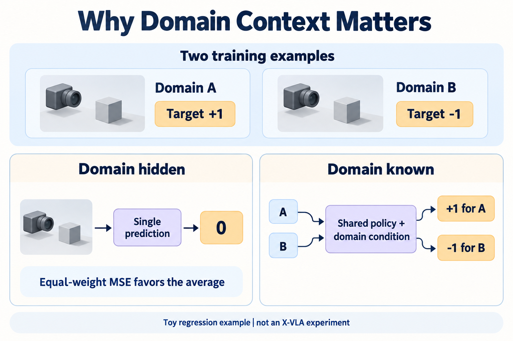
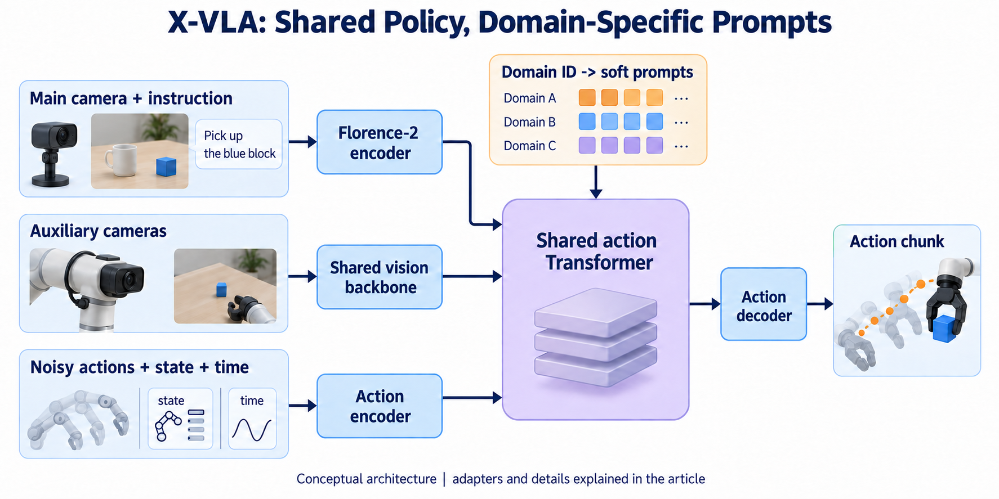
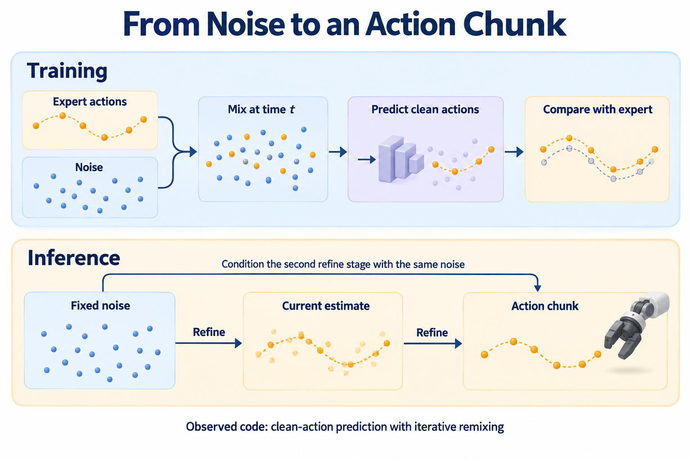
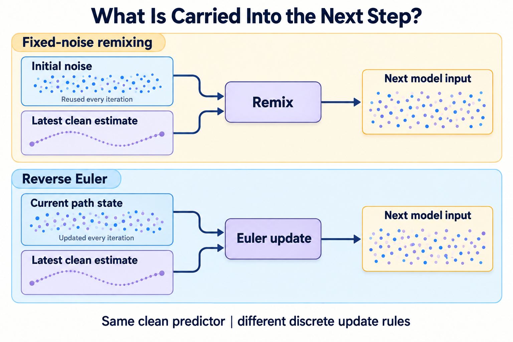
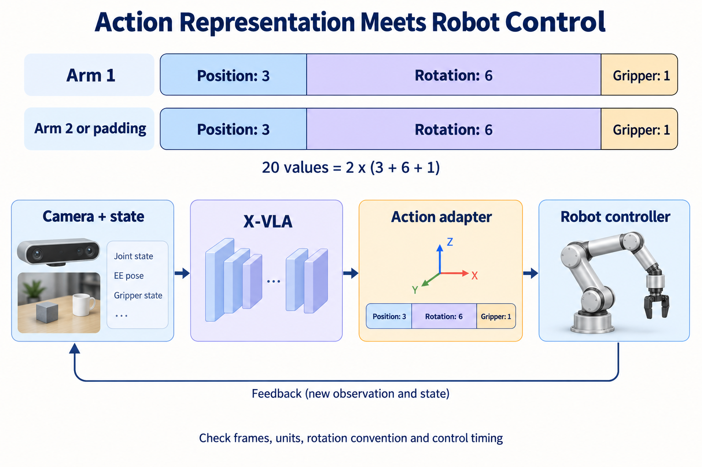
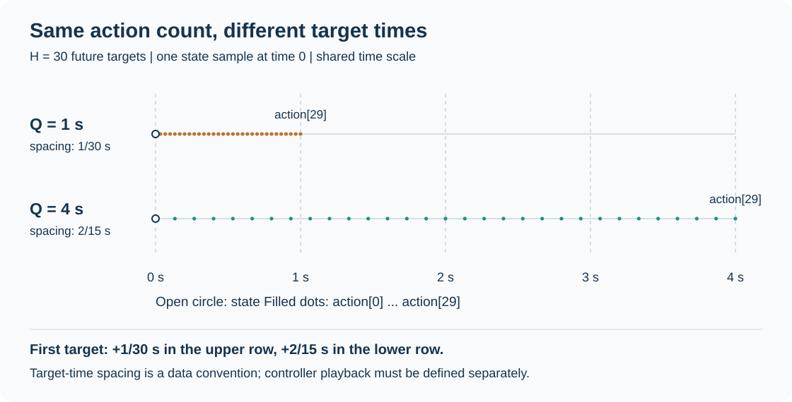

**X-VLA 研究的是：不同机器人的数据混在一起训练时，怎样共享操作知识，又保留各自的相机、动作和控制差异。** 它给不同数据域配置可学习的软提示，再通过共享 Transformer 生成连续动作块。理解这套方法，需要同时看网络、训练数据和执行接口。

本文以 [X-VLA 官方仓库](https://github.com/2toinf/X-VLA)、[论文 v1](https://arxiv.org/html/2510.10274v1)和[项目主页](https://thu-air-dream.github.io/X-VLA/)为入口。源码固定在提交 [`6bc2513`](https://github.com/2toinf/X-VLA/tree/6bc2513f5f1cbec715cc668b414392a6cae5c671)，核对日期为 2026-09-12。文中的“当前实现”均指这一提交；模型成绩来自作者报告，数值练习由本文独立编写并在 CPU 上验证。

先把整条链路连起来：相机与任务语言提供“当前看到什么、想做什么”，状态与数据域提供“动作应该按什么约定解释”，模型据此生成一段未来动作，再由客户端转换并交给控制器执行。**软提示主要解决跨域条件建模；动作表示和执行闭环仍由整条数据链共同决定。**

| 想解决的问题 | 阅读入口 |
| --- | --- |
| Soft Prompt 到底是什么 | [跨本体问题](#problem)、[软提示与域条件](#prompts) |
| 图像、语言和状态怎样进入模型 | [网络结构与张量](#architecture)、[图像预处理](#image-contract) |
| Flow Matching 在代码中怎样实现 | [动作生成](#generation) |
| 为什么输出 20 维还不能直接控制机器人 | [EE6D 与旋转约定](#action-space)、[控制闭环](#control) |
| 怎样微调、怎样启动服务 | [数据管线](#data)、[训练](#training)、[服务字段与相机槽位](#http-request) |
| 想让推理与机器人执行重叠 | [RTC 接入边界](#rtc-integration)、[RTC 专文]() |
| 如何理解成绩与验证接口 | [实验口径](#evaluation)、[独立实验包](#lab-download)、[CPU 练习](#lab) |


偏研究的读者可以按 **1 → 2 → 3 → 4 → 10** 阅读；准备接入机器人的读者可以先走 **5 → 6 → 7 → 9 → 11**，再回看训练设置。

<details>
<summary>展开接入排查索引：数据采样、旋转夹爪、随机性与单位</summary>

| 接入问题 | 阅读入口 |
| --- | --- |
| 新数据读得进来，但采样比例不对 | [数据名、处理器与域编号的查表键](#dataset-routing) |
| 旋转或夹爪通道该怎样处理 | [6D 损失与插值](#rotation-interpolation)、[夹爪软标签](#gripper-targets)、[夹爪前缀条件](#gripper-conditioning) |
| 同一请求为什么可能输出不同动作 | [随机噪声与可复现实验](#sampling-reproducibility) |
| 换单位后能否继续使用原 checkpoint | [动作尺度、损失权重与噪声](#action-scaling) |

</details>

## 1. 跨本体训练：困难不只是机械臂长得不同 {#problem}

考虑两个自拟的抓取场景：一个使用单臂和固定相机，另一个使用双臂及腕部相机。即使指令都叫“把杯子放进盒子”，输入与标签也可能存在多层差异。

| 差异来源 | 一个具体例子 | 对学习的影响 |
| --- | --- | --- |
| 机器人机构 | 单臂与双臂、不同工作空间 | 同一任务需要不同协作方式 |
| 相机配置 | 俯视固定相机与随手移动的相机 | 同一个像素运动对应不同的空间变化 |
| 动作语义 | 绝对目标位姿与当前帧增量 | 数值接近也可能表示完全不同的命令 |
| 采样时间 | 10 Hz 示教与 30 Hz 示教 | 相邻动作之间对应的运动时长不同 |
| 任务分布 | 某域主要抓取，另一域主要折叠 | 大域可能主导训练梯度 |

如果只把数组补成同一长度，网络仍然不知道这些数来自什么约定。如果给每台机器人训练一套独立策略，又会失去共享示范的价值。X-VLA 的设计可以理解为在这两者之间分配参数：**共享主干学习可复用的条件动作规律，域相关参数帮助主干解释当前的数据来源。**

这里的 domain 更接近“数据与部署约定”，不一定等于一个机器人型号。同一机械臂换相机、控制器或数据处理方式，都可能需要重新考虑域划分。反过来，相同的数字 ID 在两个独立 checkpoint 中，也不必表示同一种机器人。

作者将主要模型实例称为 **X-VLA-0.9B**，并发布基础预训练模型与面向具体环境的适应模型。研究共享初始化可以从 `X-VLA-Pt` 入手，复现基准则应选择对应的专用 checkpoint。[官方概述与模型列表](https://github.com/2toinf/X-VLA/blob/6bc2513f5f1cbec715cc668b414392a6cae5c671/README.md)

## 2. Soft Prompt：模型里的可训练向量 {#prompts}

### 2.1 它不是一句自然语言提示词

令域编号为 $d$，该域的提示矩阵为：

$$
P_d\in\mathbb R^{K\times h}.
$$

$K$ 是提示 token 数，$h$ 是隐藏维度。提示矩阵由训练优化，部署时通过域编号查表；它与“拿起蓝色积木”这样的任务指令走不同路径。

在 [`SoftPromptedTransformer`](https://github.com/2toinf/X-VLA/blob/6bc2513f5f1cbec715cc668b414392a6cae5c671/models/transformer.py) 中，`soft_prompt_hub` 是 embedding 表。每个样本取出对应的一行，重排成 $K\times h$，追加到动作 Transformer 的输入序列。软提示没有被送进语言 tokenizer，也没有被加到 Florence-2 的文本提示中。

以 [`XVLAConfig` 的默认值](https://github.com/2toinf/X-VLA/blob/6bc2513f5f1cbec715cc668b414392a6cae5c671/models/configuration_xvla.py)计算：$K=32$、$h=1024$，每个域包含 $32\times1024=32{,}768$ 个提示参数；30 个槽位共 $983{,}040$ 个参数。FP32 存放这张提示表约需 3.75 MiB，不包含梯度、优化器状态和其他模块。

提示表只是模型开销的一部分。完整显存还包括主干权重、中间激活与训练状态；下面也会单独计算域相关动作映射的参数量。

### 2.2 提示 token 怎样影响动作 token

为了说明交互机制，把输入简写为动作条件 $Z_a$、主视角语言特征 $Z_{vl}$、辅助视觉特征 $Z_{aux}$ 和软提示：

$$
Z=[Z_a;Z_{vl};Z_{aux};P_d].
$$

分号表示沿序列维拼接。标准自注意力计算为：

$$
\operatorname{Attention}(Z)=
\operatorname{softmax}\left(\frac{QK^{\mathsf T}}{\sqrt{h_{head}}}\right)V.
$$

因此，一个动作 token 的更新可以依赖视觉证据，也可以依赖域提示。提示不必显式存储“相机位于左上方”这类可读句子；它只需在训练中形成对预测有帮助的条件表示。源码使用非因果自注意力，动作块中的未来槽位可以互相交流，这与逐个生成文字 token 的因果解码不同。

考虑一个只用于说明条件回归的标量例子：两个等概率数据域给出相同的可见输入，但标签分别为 $+1$ 与 $-1$。若模型看不到域编号，只能输出同一个 $y$，则均方误差为：

$$
\mathcal L(y)=\tfrac12(y-1)^2+\tfrac12(y+1)^2=y^2+1.
$$

最优预测是 $y=0$，却与两个域的标签都不一致。有了域条件，模型可以学习 $y(d_1)=1$、$y(d_2)=-1$，同时继续共享其他计算。这说明提示可以为原本混在一起的条件分布提供区分信息；它本身并不替代坐标变换或数据对齐。



读图时，先看上方两条训练记录，再比较下方两种条件设置。右侧的关键是让共享模型知道当前样本来自 A 还是 B；$+1$ 与 $-1$ 是抽象标签，不代表真实机器人运动方向。

这个算例使用确定性的标量回归。真实生成策略可以表达多峰分布，但仍需根据输入判断当前样本属于哪一组约定。要研究提示具体学到了什么，可以固定观测、交换提示并测量输出变化；提示向量的聚类图只能提供相关性线索。

### 2.3 当前实现不只有软提示是域相关的

源码还为 `action_encoder` 和 `action_decoder` 使用 `DomainAwareLinear`。也就是说，动作输入与输出映射也按 `domain_id` 选择权重；视觉投影是否按域选择，则由 `use_hetero_proj` 控制，默认关闭。参见[动作编码器、解码器与投影层定义](https://github.com/2toinf/X-VLA/blob/6bc2513f5f1cbec715cc668b414392a6cae5c671/models/transformer.py#L319)。

按默认 EE6D 配置，单个域的三项参数量可以直接算出：

| 域相关模块 | 计算 | 参数数 |
| --- | --- | ---: |
| 软提示 | $32\times1024$ | 32,768 |
| 动作编码器，含 bias | $72\times1024+1024$ | 74,752 |
| 动作解码器，含 bias | $1024\times20+20$ | 20,500 |
| 合计 | 三项相加 | 128,020 |

这里的 72 维由动作、状态和时间 embedding 拼接得到，详见下一节。默认 30 个域槽位合计 3,840,600 个上述参数；这是对实现的参数核算，新增一个未训练槽位是否有效仍取决于后续适应。

`domain_id` 也是需要维护的接口字段，不是模型自动识别机器人的结果。增加新域时，要同时检查提示表、动作映射表的容量，以及数据配置与 checkpoint 中槽位的含义。仅仅给请求换一个整数，不会自动完成新机器人的适应。

## 3. 网络结构：先分别编码，再融合为动作条件 {#architecture}



### 3.1 主视角与语言：使用 Florence-2 的编码路径

[`XVLA.forward_vlm`](https://github.com/2toinf/X-VLA/blob/6bc2513f5f1cbec715cc668b414392a6cae5c671/models/modeling_xvla.py#L104)首先将有效图像送入共享视觉骨干，再把第一个视角的视觉特征与语言 embedding 合并，送入 Florence-2 的语言模型 encoder。

该策略删除了 Florence-2 的语言 decoder 与 `lm_head`。因此，此处利用的是多模态编码能力，不是先生成一段自然语言答案，再把答案翻译成动作。

这个实现也赋予相机顺序明确的含义：`image0` 对应主视觉语言路径，后续视角对应辅助路径。相同的两张图，交换顺序并不保证输入语义不变。

### 3.2 辅助视角：共用视觉骨干，但不经过同一语言融合路径

腕部图像通常适合观察手与物体的局部关系。当前代码直接把剩余视角的视觉特征展开，作为 `aux_visual_inputs` 送给动作 Transformer，而不是再次与文本共同通过语言 encoder。

主、辅视角在 `_encode_image` 阶段共用视觉骨干，分离的是之后的融合路线。图 2 把两条路线画开，便于说明信息流。

[`XVLAProcessor`](https://github.com/2toinf/X-VLA/blob/6bc2513f5f1cbec715cc668b414392a6cae5c671/models/processing_xvla.py)默认提供 3 个图像槽位，缺失视角补零并设置 `image_mask`，语言默认截断／填充到 50 个 token。这里的 50 是 tokenizer 输出长度，不是 50 个汉字。超过默认视角数量不能简单依赖自动截断，应检查 processor 与模型实现是否匹配。

手工组装 batch 时，还应逐条验证主视角是否有效。固定 `forward_vlm` 只检查整个 batch 至少有一张有效图像，并没有逐样本检查 `image_mask[:, 0]`。即使主槽位无效，代码仍取第 0 槽的零特征走主视觉语言路径，不会自动把腕部图像提升为主视角。因而“没有抛出无图像错误”不等于每个样本都具备预期的视觉条件。[有效图像检查与主槽位选择](https://github.com/2toinf/X-VLA/blob/6bc2513f5f1cbec715cc668b414392a6cae5c671/models/modeling_xvla.py#L118)

### 3.3 低维输入：每个动作槽位都带当前状态与生成时间

设动作块长度为 $H$，动作维度为 $D_a$，本体状态维度为 $D_r$。对每个动作槽位，源码拼接噪声动作、复制的当前状态和时间 embedding：

$$
z_i=E_d\left([x_{t,i};r;\tau(t)]\right),\quad i=1,\ldots,H.
$$

这里 $t$ 表示生成过程中的噪声混合时间，不是机器人示教的时间戳。`proprio` 在动作槽位之间复制，并不会自动变成一段历史状态序列。

默认 EE6D 配置下，$D_a=D_r=20$、时间 embedding 为 32 维，因此每个动作槽位的线性映射输入为 $20+20+32=72$ 维。映射后与视觉语言 token 一起进入隐藏维度为 1024 的 Transformer。

| 张量／参数 | 默认或符号形状 | 含义 |
| --- | --- | --- |
| `input_ids` | $B\times L$，默认 $L=50$ | 任务语言 |
| `image_input` | $B\times V\times3\times W_h\times W_w$ | 预处理后的多视角图像 |
| `image_mask` | $B\times V$ | 哪些视角有效 |
| `proprio` | $B\times20$，EE6D 情况 | 经数据域约定处理的低维状态 |
| 噪声动作／预测动作 | $B\times30\times20$，默认配置 | 30 个动作槽位 |
| 选中的软提示 | $B\times32\times1024$ | 当前数据域的条件向量 |
| 动作主干 | 24 层、16 个 attention head | 以实际 checkpoint 配置为准 |

这些默认数值来自[模型配置](https://github.com/2toinf/X-VLA/blob/6bc2513f5f1cbec715cc668b414392a6cae5c671/models/configuration_xvla.py)。其中 $B$ 为 batch size，$V$ 为视角槽位数，$W_h,W_w$ 为图像高宽；实际运行应读取所用 checkpoint 的配置。

### 3.4 为什么只解码动作那一段

源码先拼接动作、主视觉语言和辅助视觉 token，加上位置 embedding，随后追加软提示。经过共享主干后，只取序列开头的 $H$ 个动作 token，送入动作解码器。

视觉 token 与提示 token 的作用是参与条件计算，不需要逐一变成机器人输出。`max_len_seq` 默认 512，代码先检查追加提示前的序列长度；因此它也不能直接解释成包括软提示在内的总 attention 长度。

以 batch size 为 1 的默认动作配置为例，可以沿以下形状追踪一次前向。记主视觉语言 token 数为 $T_{vl}$，辅助视觉 token 数为 $T_{aux}$：

```text
动作 + 状态 + 时间       [1, 30, 72]
域相关动作编码          [1, 30, 1024]
拼接两条视觉特征流      [1, 30 + T_vl + T_aux, 1024]
追加 32 个软提示        [1, 62 + T_vl + T_aux, 1024]
24 层共享 Transformer   形状不变
取前 30 个 token 并解码  [1, 30, 20]
```

这里保留实际视觉 token 数作为变量，避免把图像像素数直接当成 token 数。还要留意，`image_mask` 用来选择需要视觉编码的有效图像；当前代码仍为缺失视角保留零特征槽位，并将辅助槽位展开到动作主干。因此，少传一张图像未必会同步缩短动作主干的序列。[视觉特征填充与展开](https://github.com/2toinf/X-VLA/blob/6bc2513f5f1cbec715cc668b414392a6cae5c671/models/modeling_xvla.py)

增加处理器的视角槽位可能增加 attention 计算量；仅把已有槽位置为无效与真正缩短序列，是不同的操作。比较推理速度时，应一起记录视角槽位数、有效图像数、特征长度和动作迭代次数。

### 3.5 训练与服务端走不同的图像预处理入口 {#image-contract}

固定 `train.py` 的图像张量由 `InfiniteDataReader` 生成，训练循环只调用 processor 编码语言。HTTP 服务则把解码后的图像交给 `XVLAProcessor.image_processor`。两条路径需要保持语义一致，但并不是在调用同一段图像处理代码。

| 环节 | 固定训练读取器 | HTTP 推理入口 |
| --- | --- | --- |
| 图像大小 | 显式 resize 为 224×224 | 由加载的 image processor 配置决定 |
| 重采样 | torchvision bicubic | 检查 image processor 的实际配置 |
| 颜色增强 | 训练时启用 ColorJitter | 服务代码没有显式加入该增强 |
| 转张量与归一化 | `ToTensor` 后使用 ImageNet 均值、标准差 | 由 image processor 执行 |
| 缺失视角 | 预处理后补零并设置 mask | processor 补零并设置 mask |

训练归一化的均值是 $(0.485,0.456,0.406)$，标准差是 $(0.229,0.224,0.225)$。这里补的是归一化之后的零张量，不等同于把一张 RGB 全黑图片当作有效图像送入处理器。两者的数值、mask 和视觉编码行为都可能不同。[训练图像变换](https://github.com/2toinf/X-VLA/blob/6bc2513f5f1cbec715cc668b414392a6cae5c671/datasets/dataset.py#L77)；[推理图像处理](https://github.com/2toinf/X-VLA/blob/6bc2513f5f1cbec715cc668b414392a6cae5c671/models/processing_xvla.py#L132)

一个可复查的接入步骤是：固定同一张 RGB 图像，关闭训练增强，分别经过读取器变换和服务端使用的 image processor，比较输出的形状、通道顺序、值域与逐像素差异。还应保存 processor 配置的 revision。HTTP 示例发送的是原始 `uint8` 图像，不应先在客户端归一化一次，再让服务端重复归一化。

本次额外核对了 `2toINF/X-VLA-Libero` 的 revision `129e71460678b7236cee6fc9707f09d9fa0c3590`。其 [preprocessor_config.json](https://huggingface.co/2toINF/X-VLA-Libero/blob/129e71460678b7236cee6fc9707f09d9fa0c3590/preprocessor_config.json) 指定 `CLIPImageProcessor`、224×224 resize、bicubic 重采样、ImageNet 均值与标准差，并关闭中心裁剪。用这份配置构建图像处理器，与关闭 ColorJitter 的读取器变换对照，结果如下：

| 合成 RGB 输入 | 原始 H×W | 两路输出形状 | 本次最大绝对差 |
| --- | --- | --- | ---: |
| 全黑 | 320×480 | `(3, 224, 224)` | 0 |
| 全白 | 480×320 | `(3, 224, 224)` | 0 |
| 三通道渐变 | 317×479 | `(3, 224, 224)` | 0 |
| 高频棋盘格 | 317×479 | `(3, 224, 224)` | 0 |

这只确认上述输入和依赖版本下的像素处理一致，不覆盖 JPEG 解码、图像翻转、多视角补零、tokenizer 或完整 HTTP 链路，也不是对任意 checkpoint 的保证。测试在 CPU 上使用 PyTorch 2.8.0、torchvision 0.23.0、Transformers 4.51.3、NumPy 1.26.4、Pillow 12.3.0；[完整记录](processor-check.json)保留了配置与环境。

如需重跑，另下载 [processor_check.py](processor_check.py) 与上面固定 revision 的配置文件，在具备这些依赖的环境中执行：

```bash
python processor_check.py \
  --config preprocessor_config.json \
  --output processor-check-local.json
```

这个可选诊断不下载模型权重，也不包含在第 11 节的轻量 NumPy 实验包中。换到自己的 checkpoint 后，应重新运行并检查结果，不能只复制这张表的结论。

## 4. 动作生成：论文公式与当前代码要分开读 {#generation}

### 4.1 论文中的 Flow Matching 表述

论文用从高斯噪声到专家动作的线性路径说明 Flow Matching。设专家动作块为 $A$，噪声为 $\epsilon$，使用从噪声走向动作的时间 $s$：

$$
X_s=(1-s)\epsilon+sA.
$$

$$
\mathcal L_{FM}=\mathbb E\left[
\|v_\theta(X_s,o,s)-(A-\epsilon)\|^2
\right].
$$

网络学习沿路径的速度，用生成过程把噪声逐渐变成条件动作。此处是对[论文第 2 节](https://arxiv.org/html/2510.10274v1#S2)数学表述的整理；下面阅读开源代码时，需要重新确认网络的输出目标。

### 4.2 当前训练直接监督干净动作

在本次固定提交的 `XVLA.forward` 中，输入混合方式是：

$$
X_t=t\epsilon+(1-t)A.
$$

此时 $t=1$ 对应纯噪声，$t=0$ 对应干净动作，与上节 $s$ 的方向相反。更关键的是，代码将 Transformer 输出与 `action` 直接送入 `action_space.compute_loss`，监督目标是干净动作 $A$，没有把 `A - noise` 作为速度标签。参见[训练前向函数](https://github.com/2toinf/X-VLA/blob/6bc2513f5f1cbec715cc668b414392a6cae5c671/models/modeling_xvla.py#L148)。

用 $f_\theta$ 表示这个干净动作预测器，可以概括为：

$$
\widehat A=f_\theta(X_t,t,o,r,d).
$$

这一写法保留了干净动作监督的核心关系；标准 `ee6d` 对夹爪输入还有屏蔽处理，损失也区分连续位姿与夹爪分类，详见第 5 节。

训练生成时间也有一个容易漏掉的细节：代码对大小为 $B$ 的当前 batch 只采样一个随机偏移 $u$，再令 $t_b=(u+b/B)\bmod(1-10^{-5})$。同一 batch 的时间因此相关，不能把它描述为给每个样本独立调用一次均匀采样。它也不是按动作位置分配时间：同一样本的全部动作仍共用一个 $t_b$。这与训练时 RTC 的[逐动作时间条件](#training-rtc)不同。

### 4.3 推理：固定一份噪声，反复混合与预测

[`generate_actions`](https://github.com/2toinf/X-VLA/blob/6bc2513f5f1cbec715cc668b414392a6cae5c671/models/modeling_xvla.py#L182)先编码一次视觉语言输入，采样一份固定噪声 $\epsilon$，将动作估计初始化为零。随后按 $t_i=i/N$，从 $i=N$ 到 1 迭代：

$$
X^{(i)}=t_i\epsilon+(1-t_i)\widehat A_{\mathrm{prev}}.
$$

$$
\widehat A_{\mathrm{next}}=f_\theta(X^{(i)},t_i,o,r,d).
$$

最后对预测做 action-space 后处理。默认 `steps=10` 表示动作头进行 10 次迭代；每次迭代都预测整个动作块，不是依次生成一个机器人时间步。代码没有在每轮重新采样独立噪声，也没有在循环里重新编码相机图像。



为了看清更新过程，取一个标量教学例子：固定噪声 $\epsilon=-1$，使用手写预测函数 $f(x,t)=0.5x+2$，迭代 3 次。这里故意选一个简单函数来观察数据流，不模拟 X-VLA 的预测能力。

| 迭代 | $t$ | 与固定噪声混合后的输入 $x$ | 新的干净动作估计 |
| --- | --- | --- | --- |
| 1 | $1$ | $-1$ | $1.5$ |
| 2 | $2/3$ | $-1/6$ | $23/12\approx1.9167$ |
| 3 | $1/3$ | $17/18$ | $89/36\approx2.4722$ |

第一步完全忽略初始化为零的动作估计，因为它的混合权重为零；后续始终复用最开始的噪声。最后一次网络调用发生在 $t=1/3$，返回的是预测器给出的干净动作估计，代码不再额外调用一次 $t=0$。可运行版本见[数值练习](#lab)。

### 4.4 干净动作预测与速度预测有什么数学联系？

沿训练路径 $X_t=t\epsilon+(1-t)A$ 求导，得到朝噪声方向的速度 $u_t=\epsilon-A$。当 $t>0$ 时，由路径公式消去噪声可得：

$$
u_t=\frac{X_t-A}{t},\qquad
\widehat u_\theta=\frac{X_t-\widehat A}{t}.
$$

于是，在同一个路径点上，连续通道的平方误差满足：

$$
\|\widehat u_\theta-u_t\|^2
=\frac{\|\widehat A-A\|^2}{t^2}.
$$

这说明两种预测参数化可以建立代数联系，但均匀加权的动作 MSE 与均匀加权的速度 MSE 对不同 $t$ 的重视程度不同。该关系针对线性路径上的连续通道；夹爪 BCE 和通道屏蔽需要另外处理，$t=0$ 也不能直接代入除法。

训练目标的联系还不等于离散采样器相同。若按上述速度做一步反向 Euler 更新，步长为 $\delta>0$，则：

$$
X_{t-\delta}
=\left(1-\frac{\delta}{t}\right)X_t
+\frac{\delta}{t}\widehat A.
$$

这个更新保留当前路径状态 $X_t$；仓库循环则重新用固定噪声与上一轮干净动作估计构造输入。拿前面的标量例子比较，第一步从 $t=1$ 到 $2/3$ 时两者恰好都得到 $-1/6$，但下一步 Euler 状态为 $7/8$，固定噪声重混合状态为 $17/18$，已经不同。因而复现当前代码时，应采用第 4.3 节的递推式。



图中的上路每次回到同一份初始噪声，下路则继续推进当前路径状态。两路都调用干净动作预测器，但预测器看到的输入可以从中途开始分离；仅保持网络权重和迭代次数相同，不足以保证输出相同。

### 4.5 一个动作块里存在三种不同的时间

| 时间概念 | 由什么决定 | 不能混淆的对象 |
| --- | --- | --- |
| 生成时间 $t$ | 噪声混合与迭代调度 | 不是机器人实际执行时间 |
| 动作轨迹时间 | 数据采样、未来窗口与重采样 | 不是 `steps` 的倒数 |
| 控制与请求周期 | 客户端消费动作、控制器和网络延迟 | 不等于一次模型前向时间 |

假设一个自拟客户端输出 30 个动作、按 30 Hz 执行，那么动作块覆盖约 1 秒；若只执行前 6 个再请求，名义重规划间隔约为 0.2 秒。这个计算依赖执行约定，不是 X-VLA 所有 checkpoint 的固定时序。

## 5. EE6D：统一数组长度以后，仍然要统一语义 {#action-space}

### 5.1 20 维怎样拆开

在 [`EE6DActionSpace`](https://github.com/2toinf/X-VLA/blob/6bc2513f5f1cbec715cc668b414392a6cae5c671/models/action_hub.py#L109) 中，一个动作有 20 个数，可按两个 10 维槽位理解：

$$
a=[p_1;u_1;g_1;p_2;u_2;g_2],
\qquad 20=2\times(3+6+1).
$$

其中 $p$ 是三维位置，$u$ 是旋转的 6D 表示，$g$ 是夹爪通道。单臂数据处理器可以把第二个槽位补零；双臂则使用两个槽位。左右臂对应关系以具体 handler 为准。

| Python 索引 | 含义 |
| --- | --- |
| `0:3`、`10:13` | 两个槽位的三维位置 |
| `3:9`、`13:19` | 两个槽位的旋转 6D |
| `9`、`19` | 夹爪 |

这里的六个旋转数是在冗余空间中表达一个三维姿态，不是六个旋转自由度。末端位置与姿态输出也不是关节电机命令，通常还需要控制器完成运动学和跟踪。

### 5.2 损失权重与夹爪处理是模型的一部分

当前 `ee6d` 的损失可按源码写成：

$$
\mathcal L=
500\sum_{j=1}^{2}\operatorname{MSE}(\widehat p_j,p_j)
+10\sum_{j=1}^{2}\operatorname{MSE}(\widehat u_j,u_j)
+\frac12\sum_{j=1}^{2}\operatorname{BCEWithLogits}(\widehat g_j,g_j).
$$

MSE 在各自张量上求均值。训练时夹爪采用 BCE 目标，网络输出是 logit；推理末端再施加 sigmoid。目标是否只有 0 和 1，还取决于后续的数据插值，见[夹爪软标签](#gripper-targets)。`preprocess` 则会将状态和噪声动作中的夹爪输入通道置零。参见[损失与前后处理](https://github.com/2toinf/X-VLA/blob/6bc2513f5f1cbec715cc668b414392a6cae5c671/models/action_hub.py#L129)。

两点由此直接影响工程接入。第一，`500` 是损失系数，不是“所有位置输入都乘以 500”的归一化规则；单位必须从数据管线确认。第二，标准 `ee6d` 不会将输入夹爪通道原样作为条件使用，但这不能推广到所有模式：`agibot_ee6d` 使用不同的夹爪损失和 hooks，`joint`、`auto` 也有各自定义。

补零也不等于自动忽略。标准 `ee6d` 对两个槽位都计算损失，单臂的第二槽位仍参与训练目标。若改成只对有效维度计算损失，就是训练行为的改动，需要单独评估。

### 5.3 仓库内部存在两种旋转 6D 排列

令旋转矩阵前两列为 $c_1,c_2$。常见的表示思路都是保留这两列，但数组排列可以不同：

| 约定 | 六个数的顺序 | 本次核对到的代码路径 |
| --- | --- | --- |
| 交错排列 | $[R_{00},R_{01},R_{10},R_{11},R_{20},R_{21}]$ | `datasets/utils.py` 中的转换函数 |
| 整列拼接 | $[R_{00},R_{10},R_{20},R_{01},R_{11},R_{21}]$ | LIBERO 客户端的 `LiberoAbsActionProcessor` |

公共工具通过 `matrix[..., :, :2].reshape(..., 6)` 编码，并按偶数／奇数下标解码；LIBERO 客户端则拼接完整的第一列与第二列，并按前三个／后三个值解码。两处可分别查阅 [`datasets/utils.py`](https://github.com/2toinf/X-VLA/blob/6bc2513f5f1cbec715cc668b414392a6cae5c671/datasets/utils.py#L54)和 [LIBERO 的旋转处理器](https://github.com/2toinf/X-VLA/blob/6bc2513f5f1cbec715cc668b414392a6cae5c671/evaluation/libero/libero_client.py#L77)。

单位矩阵可以给出最直接的检查：

```text
交错排列： [1, 0, 0, 1, 0, 0]
整列拼接： [1, 0, 0, 0, 1, 0]
```

这不是说其中一种数学表示必然错误，而是**编码、标签、checkpoint 和解码必须匹配**。不能仅仅看到字段名 `rot6d` 就混用公共工具与 LIBERO 专用客户端；已有数据文件的实际生成方式也要确认。

### 5.4 从六个数恢复一个旋转矩阵

先按正确排列取出两个三维向量 $a_1,a_2$，再做正交化：

$$
\begin{aligned}
b_1&=\frac{a_1}{\|a_1\|},\\
\widetilde b_2&=a_2-(b_1^{\mathsf T}a_2)b_1,\\
b_2&=\frac{\widetilde b_2}{\|\widetilde b_2\|},\\
b_3&=b_1\times b_2.
\end{aligned}
$$

最后以列向量组成 $R=[b_1\ b_2\ b_3]$。这解释了为什么网络可以预测六个不完全正交的数，再在解码时得到旋转矩阵。

若第一个向量接近零，或两向量几乎共线，正交化就会退化。一个工程适配层需要显式识别这些情况；只检查数组是否为 `(6,)` 并不足够。本文的 CPU 练习会拒绝零向量、共线向量和非有限数，并检查恢复后的 $R^{\mathsf T}R=I$ 与 $\det(R)=1$。

### 5.5 6D 的数值损失与旋转插值要分开理解 {#rotation-interpolation}

正交化是一个多对一映射。采用交错排列时，`[1, 0, 0, 1, 0, 0]` 与 `[2, 1, 0, 3, 0, 0]` 都会解码成单位旋转：第二组的第一列沿 X 轴，第二列去掉 X 分量后仍沿 Y 轴。两组六维数组的 MSE 却等于 1。因此，**训练中的旋转 MSE 不能直接换算成角度误差**；评测姿态时，可以另外报告解码后的旋转角距离。

插值也需要区分“六个数之间的直线”和“旋转之间的路径”。考虑以下边界例子：

```text
单位旋转的交错 6D：        [ 1, 0, 0,  1, 0, 0]
绕 Z 轴旋转 180° 的 6D：  [-1, 0, 0, -1, 0, 0]
逐元素取中点：             [ 0, 0, 0,  0, 0, 0]  → 无法正交化
```

绕 Z 轴旋转 90° 是这两个姿态之间一条有效旋转路径的中点，但不是上面六维线段的中点。当前 [`BaseHDF5Handler`](https://github.com/2toinf/X-VLA/blob/6bc2513f5f1cbec715cc668b414392a6cae5c671/datasets/domain_handler/base.py#L142) 对整组动作通道使用默认线性 `interp1d`，包括已经编码的 6D 通道。这说明它没有单独执行旋转空间插值；并不表示真实数据经常存在相邻 180° 跳变。实际影响还取决于源数据连续性，以及查询时间是否恰好落在原始采样点上。

若新数据需要重采样，可以评估先在旋转空间插值、再编码成约定 6D 的方案。不过这会改变训练标签，不能当作与原管线完全等价的实现。部署端另外进行插值或限速时，还应保留动作时间对应关系，参见 [RTC 中的已承诺执行前缀](#executed-prefix)。

### 5.6 BCE 的夹爪目标也可能是软标签 {#gripper-targets}

例如 [`LiberoHandler`](https://github.com/2toinf/X-VLA/blob/6bc2513f5f1cbec715cc668b414392a6cae5c671/datasets/domain_handler/simulations.py#L120) 先将原始夹爪通道按 `> 0` 转成二值，再交给公共管线插值。若查询点位于一次 0 → 1 跳变的正中间，得到的目标就是 0.5。二值化发生在插值之前，所以不能据此断言最终所有训练目标仍为硬标签。

对目标 $g\in[0,1]$、logit $z$ 和 $p=\sigma(z)$，二元交叉熵为：

$$
\begin{aligned}
\ell&=-g\log p-(1-g)\log(1-p),\\
\frac{\partial\ell}{\partial z}&=p-g.
\end{aligned}
$$

对一个固定软目标，损失在 $p=g$ 处最小。因此 0.5 是合法的 BCE 目标；它既不自动说明模型输出经过概率校准，也不自动对应夹爪物理行程的一半。推理输出如何映射到开合命令，仍取决于客户端的阈值、开闭方向与控制接口。

如果希望夹爪事件保持离散，可以评估最近邻或前值保持，并单独检查开合事件的时间偏移。它们改变了监督信号，需要与训练及部署约定一同确认，不宜只在服务端临时换规则。第 11 节的旋转练习同时给出了线性软标签和 BCE 梯度的数值例子。

### 5.7 损失加权不等于动作归一化 {#action-scaling}

标准 `ee6d` 的 action-space hooks 只屏蔽夹爪输入、对夹爪输出施加 sigmoid；它们没有按数据均值和标准差对位置或旋转执行标准化。进入模型的连续数值仍要追溯具体 handler 与数据文件。不能从 `XYZ_SCALE=500` 推断“位置已经归一化”，也不能因此忽略外部数据预处理。[`EE6DActionSpace` 的完整实现](https://github.com/2toinf/X-VLA/blob/6bc2513f5f1cbec715cc668b414392a6cae5c671/models/action_hub.py#L109)

一个单样本、单时间步的例子能说明区别：仅第一臂 X 坐标预测错了 1 cm，其余位置全部正确。因为该臂的 MSE 会平均三个位置维度，位置损失为：

$$
\mathcal L_{pos}=500\times\frac{0.01^2}{3}
=\frac1{60}\approx0.01667.
$$

若把预测和标签的米制数值都换成毫米，却仍用系数 500，同一物理误差的数值变成 10，损失放大 $10^6$ 倍。将系数改成 $500/10^6$ 可以恢复这个位置损失的数值，但**仅修正损失，并不能使整个训练与原来等价**。

| 发生变化的位置 | 为什么还需要单独处理 |
| --- | --- |
| 数据与状态输入 | 原 checkpoint 的输入映射针对原数值约定；改标签单位时还要检查状态与动作是否一致 |
| 噪声路径 | 原混合使用单位标准差高斯噪声；数据放大 1000 倍而噪声不变，会改变同一生成时间下的数据与噪声比例 |
| 输出与控制器接口 | 控制器使用毫米时，可以在接口处把模型的米制位置换算为毫米；无需因此把模型内部表示也换掉 |

这一点也能直接从路径公式检查。记单位变换系数为 $c$：

$$
\begin{aligned}
cX_t&=t(c\epsilon)+(1-t)(cA),\\
X'_t&=t\epsilon+(1-t)(cA).
\end{aligned}
$$

两者在噪声项上不同。即使同时缩放噪声，还需要一致地变换模型输入、输出及参数化，才能讨论生成过程的对应关系。给现有 checkpoint 接入新控制器时，先在适配边界完成明确的单位转换；若有意更改训练表示，则将其作为训练配方的改动评估。RTC 的[误差尺度说明](#action-metric)进一步解释了这些约定怎样影响前缀引导。

## 6. 从动作块到控制闭环 {#control}



### 6.1 绝对位姿与相对动作不能仅靠数值相加转换

位置增量可能相对基座坐标，也可能相对工具坐标；姿态增量还涉及旋转乘法的先后顺序。假设约定是在基座系中左乘旋转增量，那么 $R_{target}=\Delta R\,R_{current}$；若是工具系中的右乘约定，则是 $R_{target}=R_{current}\,\Delta R$。旋转不满足一般的交换律，这两种写法不能随意互换。

对于 LIBERO，[官方预处理说明](https://github.com/2toinf/X-VLA/blob/6bc2513f5f1cbec715cc668b414392a6cae5c671/evaluation/libero/preprocess.md)要求回放相对动作，读取控制器内部的目标位置与目标旋转，得到绝对动作，再转换旋转表示。这比“把相对动作直接加到观测状态”更贴近原控制器语义。

#### 用一个目标位姿核对基座系与工具系 {#relative-pose-frames}

以下是本文的几何算例，不是 LIBERO 控制器的替代实现。采用列向量，用 $T$ 表示将工具坐标映射到基座系的齐次位姿，其旋转和平移分别为 $R,p$；目标对应 $T',R',p'$。同一个目标可以写成：

$$
\delta p_{base}=p'-p,\qquad
\delta p_{tool}=R^\mathsf T(p'-p),
$$

$$
\Delta R_{base}=R'R^\mathsf T,\qquad
\Delta R_{tool}=R^\mathsf TR'.
$$

若工具相对基座绕 $z$ 轴旋转 90°，当前位置为 $(1,2,0)$ 米，目标为 $(1,2.1,0)$ 米，则基座系位移是 $(0,0.1,0)$，工具系位移是 $(0.1,0,0)$。把后一数组直接加到基座位置，会得到错误的 $(1.1,2,0)$。旋转同理：工具系绕 $x$ 轴的 90° 增量应右乘当前旋转，不能不变地挪到左侧。

还要区分“分别存储位置差与旋转差”和“完整齐次变换的增量”。右乘增量 $T^{-1}T'$ 的平移正是 $\delta p_{tool}$；左乘增量 $T'T^{-1}$ 的平移却是：

$$
p'-\Delta R_{base}p,
$$

一般不等于 $p'-p$。因此，一个名为 `delta_pose` 的六维接口，可能表达控制器的位移与轴角，也可能表达李代数坐标，不能只凭字段名按完整矩阵增量解释。

随文 [rotation_lab.py](rotation_lab.py) 验证了两种完整变换组合均能恢复目标，并拒绝上述错误的直接相加／乘法顺序。它验证坐标代数，不验证控制器的缩放、参考目标更新规则或机器人运动；这些仍以对应控制器实现为准。RTC 前缀回填也需要保持这层语义一致，见[已承诺动作的空间映射](#executed-prefix)。

### 6.2 动作块的执行范围决定反馈延迟

如果一次生成 $H$ 步并全部执行，下一次模型看到新图像前，环境已经变化了一段时间。缩短执行前缀可以更频繁地利用反馈，但会增加请求频率，也可能让相邻动作块发生不连续。

用本文自拟的预算表达式，可以检查一次同步请求何时可能跟不上执行：

$$
T_{request}=T_{capture}+T_{encode}+T_{network}
+T_{policy}+T_{decode}.
$$

这里 `encode/decode` 指请求与响应的数据编码／解码，$T_{policy}$ 包括视觉语言编码和动作头迭代，避免将模型编码开销重复计入。

要区分请求发生在什么时候。令每块实际执行的前缀长度为 $M$，控制频率为 $f_{ctrl}$：

| 调度方式 | 块之间会发生什么 | 简化的时间预算 |
| --- | --- | --- |
| 队列耗尽后同步请求 | 等待新动作返回，执行时钟可能暂停或保持上一命令 | 一个周期约为 $M/f_{ctrl}+T_{request}$ |
| 执行当前块时异步预取 | 请求与动作消费重叠，有机会隐藏等待 | 提前量应覆盖请求延迟及其抖动 |

例如 $M=6$、$f_{ctrl}=30$ Hz、请求耗时 80 ms，同步方式的周期约为 280 ms，对应约 3.57 次请求／秒，而不是仅按执行前缀推算的 5 次／秒。异步方式即使满足 80 ms 小于 200 ms，还要考虑观测时间戳、返回动作的起点与当前机器人状态是否匹配。

这是面向实际机器人时钟的预算分析。仿真若在模型请求期间暂停推进，其墙钟速度与仿真动作频率可以不同，应分别报告。

### 6.3 图像反馈与本体状态反馈要分别检查

本次提交的 LIBERO 客户端还有一个具体实现细节：动作队列为空时请求新的动作块；本体输入首次用观测初始化，后续把上一动作块最后一步的前 9 维预测写回 `self.proprio`，而不是每次都用新测量覆盖它。参见 [`_format_query` 与 `step`](https://github.com/2toinf/X-VLA/blob/6bc2513f5f1cbec715cc668b414392a6cae5c671/evaluation/libero/libero_client.py#L159)。

因此，客户端仍可在块边界接收新图像，但不能据此说所有状态通道都实现了每周期测量反馈。复现官方结果时先保留其行为；接入自己的机器人时，可以评估测量状态回填的方案，但要把它记录为控制接口变更，并与训练时的状态分布核对。

### 6.4 接入 RTC：先统一时间，再改生成器 {#rtc-integration}

[RTC 专文]()讨论一种互补能力：模型生成下一块时，机器人继续执行旧块，并让新计划考虑这段已经承诺的运动。它与 X-VLA 的软提示分别作用于执行衔接和跨域条件。

对于根据观测步 $k$ 预测的动作块，如果结果直到控制步 $k+d_{delay}$ 才能采用，就不能从新块的第 0 项开始重播。应将旧块剩余动作按同一绝对时间对齐，生成时把等待期间的动作当作条件，返回后仅使用尚未过期的后缀。这里 $d_{delay}$ 是延迟步数，与本文选择软提示的域编号 $d$ 完全不同。

| 层次 | X-VLA 接入时需要核对的内容 |
| --- | --- |
| 时间网格 | 模型第 $i$ 项对应哪个绝对时刻；数据重采样后的间隔是否等于控制周期 |
| 动作语义 | 旧前缀与新输出是否使用相同坐标、单位、旋转 6D 排列和夹爪表示 |
| 运行时 | 请求期间已经执行及无法撤回的动作有多少；迟到结果应从哪一项接入 |
| 推理时引导 | 干净动作预测器、重混合采样器和输入梯度是否有一致的定义 |
| 训练时条件 | 网络是否支持逐动作时间，以及干净前缀与后缀损失掩码 |

在连续通道上，可以进一步看清数学接口。把 X-VLA 的噪声时间 $t$ 改写为 RTC 的生成时间 $\tau=1-t$，则路径为 $x^\tau=(1-\tau)\epsilon+\tau A$。用当前干净动作预测 $f_\theta(x,1-\tau,\ldots)$ 构造一个速度参数化：

$$
\widehat v_\tau=\frac{f_\theta(x,1-\tau,\ldots)-x}{1-\tau},
\qquad \tau<1.
$$

对应的一步终点估计满足：

$$
F_\tau(x)=x+(1-\tau)\widehat v_\tau
=f_\theta(x,1-\tau,\ldots).
$$

因此，在这个参数化下，对终点估计求输入 Jacobian 就相当于对干净动作预测器求输入 Jacobian。**这是可以研究 RTC 适配的数学入口，不意味着固定噪声重混合已经等同于原始 RTC 的 Euler 采样。** 第 4.4 节的算例已经展示两种离散更新可以产生不同结果；引导系数、端点数值和最终采样过程仍需重新验证。

还有两个源码层面的限制。`generate_actions` 使用 `@torch.no_grad()`，直接沿用其梯度关闭状态无法计算 RTC 所需的输入 VJP；适配时需要为相关动作计算建立梯度图，而视觉条件可以在适当情况下缓存。标准 `ee6d` 又会屏蔽夹爪输入、用 BCE 训练夹爪并在最后 sigmoid，因而不能把上面的连续路径公式不加区分地应用到全部 20 个通道。[生成入口与梯度上下文](https://github.com/2toinf/X-VLA/blob/6bc2513f5f1cbec715cc668b414392a6cae5c671/models/modeling_xvla.py#L182)；[动作空间处理](https://github.com/2toinf/X-VLA/blob/6bc2513f5f1cbec715cc668b414392a6cae5c671/models/action_hub.py)

训练时 RTC 则需要改造训练分布：前缀作为干净输入，后缀带噪，只在后缀计算损失，并提供逐动作的生成时间。本文核对的 X-VLA 训练入口给每个样本一个时间标量，推理入口没有旧动作前缀参数，不能通过开启一个现成开关获得这一能力。以上是基于接口与公式的适配分析，本文没有实现或验证 X-VLA + RTC 的闭环策略。

### 6.5 把夹爪前缀填回数组，不等于模型使用了它 {#gripper-conditioning}

标准 `ee6d` 在每次动作头调用前，将 `proprio` 和带噪动作的第 9、19 通道置零。因此，仅把旧夹爪指令写回这些位置，下一步也会被前处理擦除。把概率改回 logit 不能解决这个问题；同样，屏蔽本体状态中的夹爪值，不意味着图像中也没有开合信息。[`preprocess` 与 `postprocess`](https://github.com/2toinf/X-VLA/blob/6bc2513f5f1cbec715cc668b414392a6cae5c671/models/action_hub.py#L159)

这一行为也影响推理时引导。将置零操作表示为对角矩阵 $M$，暂时固定观测等其他输入，实际预测是 $h(x)=f_\theta(Mx)$。链式法则给出：

$$
J_h(x)=J_f(Mx)M.
$$

被屏蔽的输入对应 Jacobian 的零列：改变原始夹爪输入，不会改变本次网络输出。这与“输出夹爪无法被引导”并不等价，因为位置等未屏蔽输入仍可能影响夹爪输出。

例如使用一个两通道教学函数，输入为位置 $p$ 与夹爪数值 $g$，先屏蔽 $g$，再令预测为 $h(p,g)=(p,2p)$。若当前输入为零，只对第二项施加残差 1，则：

$$
J_h=\begin{bmatrix}1&0\\2&0\end{bmatrix},
\qquad J_h^{\mathsf T}\begin{bmatrix}0\\1\end{bmatrix}
=\begin{bmatrix}2\\0\end{bmatrix}.
$$

修正发生在位置输入，夹爪输入仍不变。这说明通道耦合可以传递约束，也说明不能据此宣称模型已经使用旧夹爪动作作为条件。此例只解释输入屏蔽与 VJP，不代表 X-VLA 学到的具体耦合强度。

还应区分输出空间：标准动作头先给夹爪 logit，最终服务输出经过 sigmoid。如果选择在 sigmoid 输出上定义误差，求输入梯度时还要包含 $\sigma(z)(1-\sigma(z))$；直接拿旧开合值减去原始 logit，使用的是另一种误差定义。第 5.6 节的 BCE 监督也不能自动替代 RTC 的终点误差。

接入方案应明确哪些通道参与连续路径引导，以及夹爪条件通过什么入口表达。若希望模型直接利用旧夹爪序列，需要评估修改前处理或增加条件入口，并匹配训练；仅去掉置零操作也可能改变 checkpoint 原有的输入分布。RTC 侧的完整求导对象见[终点估计与输入 VJP](#input-vjp)。

## 7. 数据管线：一个样本怎样形成 {#data}

### 7.1 从元数据找到轨迹处理器

[`InfiniteDataReader`](https://github.com/2toinf/X-VLA/blob/6bc2513f5f1cbec715cc668b414392a6cae5c671/datasets/dataset.py)支持包含 `dataset_name`、`datalist` 的通用元数据，也有 LeRobot v2.1 的专门分支。通用格式的核心可以写成：

```json
{
  "dataset_name": "my_robot",
  "datalist": ["/data/episode_000.h5", "/data/episode_001.h5"]
}
```

这只是结构示意，不是已经可训练的完整数据集。具体 handler 还可能要求图像键、指令键等字段，并规定 HDF5／视频／Parquet 内部格式。

读取器先决定使用 `robot_type` 还是数据集名来查找处理器。随后由 handler 的 `iter_episode` 产生样本，读取器补上 `domain_id`，再拆分状态和未来动作。新域至少要协调三处：

1. 在 [`domain_handler/registry.py`](https://github.com/2toinf/X-VLA/blob/6bc2513f5f1cbec715cc668b414392a6cae5c671/datasets/domain_handler/registry.py) 注册实际可用的处理器。
2. 在 [`domain_config.py`](https://github.com/2toinf/X-VLA/blob/6bc2513f5f1cbec715cc668b414392a6cae5c671/datasets/domain_config.py) 配置域编号和采样权重。
3. 确认 checkpoint 对应槽位及动作空间，不要覆盖仍需保留的域含义。

当前代码使用 `DATA_DOMAIN_ID.get(robot_type, 0)`，漏配域 ID 会回退到 0；漏配采样权重会回退到 1.0。处理器注册本身则要求精确匹配。这意味着“数据能读出来”并不代表它被分配到了预期的域。

### 7.2 状态和标签可能来自同一段轨迹

handler 常返回 `abs_trajectory`，其长度是 $H+1$。[`action_slice`](https://github.com/2toinf/X-VLA/blob/6bc2513f5f1cbec715cc668b414392a6cae5c671/datasets/utils.py#L90)默认取第 0 行作为 `proprio`，取后 $H$ 行作为 `action`；如果提供 `idx_for_delta`，才对指定通道减去首行，另有状态屏蔽选项。

所以字段名 `proprio` 不保证它必然来自关节编码器或独立测量文件。对某些 handler，它来自动作／位姿轨迹的首行。检查训练—部署一致性时，需要追到这个字段的生成位置。

最终进入训练的样本主要包括：

```text
language_instruction: str
domain_id:            scalar integer
image_input:          [V, C, height, width]
image_mask:           [V]
proprio:              [D]
action:               [H, D]
```

### 7.3 未来窗口由数据处理器决定 {#action-timing}

论文描述过以 30 个锚点表达未来 4 秒意图的预训练处理。这是[论文的数据方案](https://arxiv.org/html/2510.10274v1#S4.SS2.SSS2)，不应成为所有任务的通用部署常量。

例如本次源码中的 [`LiberoHandler`](https://github.com/2toinf/X-VLA/blob/6bc2513f5f1cbec715cc668b414392a6cae5c671/datasets/domain_handler/simulations.py#L97)指定 `freq=30.0`、`qdur=1.0`；公共 HDF5 处理器在当前时刻到未来窗口之间取 `num_actions + 1` 个插值点，到轨迹尾部时缩短窗口。实际标签时间跨度因此依赖 handler、当前位置及轨迹长度。

LIBERO handler 还读取 `abs_action_6d`，并对图像去掉首帧以匹配其已有数据处理方式。把这个偏移机械复制到新的同步数据，会引入新的错位。数据对齐应通过“这一张图与哪一个动作／状态对应”逐帧验证。

把插值过程写出来，可以更清楚地看出动作槽位与控制周期的区别。设当前参考时间为 $u_0$、该轨迹最后参考时间为 $u_{end}$，则：

$$
Q=\min(qdur,u_{end}-u_0),\qquad
q_j=u_0+\frac{jQ}{H},\quad j=0,\ldots,H.
$$

`action_slice` 把 $q_0$ 对应的轨迹值作为状态，把 $q_1,\ldots,q_H$ 对应的值作为动作标签。因此，**输出 `action[0]` 的标签时间是 $u_0+Q/H$，不是状态时间 $u_0$**。如果用 RTC 专文中“索引 0 对应观测时刻”的记号来接入，就必须显式处理这个起点差异；两篇里的数组索引不能只按名字直接对接。[公共插值与状态拆分](https://github.com/2toinf/X-VLA/blob/6bc2513f5f1cbec715cc668b414392a6cae5c671/datasets/domain_handler/base.py#L150)

以完整未来窗口、$H=30$ 为例：

| 数据处理路径 | 原始序列参考频率 | 未来窗口 $Q$ | 相邻目标锚点间隔 $Q/H$ |
| --- | ---: | ---: | ---: |
| `LiberoHandler` | 30 Hz | 1 秒 | 约 33.3 ms |
| `DroidHandler` | 15 Hz | 4 秒 | 约 133.3 ms |
| 本文构造的 LIBERO 尾部样本，仅余 0.4 秒 | 30 Hz | 0.4 秒 | 约 13.3 ms |

前两行来自固定版本的 [LIBERO](https://github.com/2toinf/X-VLA/blob/6bc2513f5f1cbec715cc668b414392a6cae5c671/datasets/domain_handler/simulations.py#L97) 与 [DROID](https://github.com/2toinf/X-VLA/blob/6bc2513f5f1cbec715cc668b414392a6cae5c671/datasets/domain_handler/droid.py) 处理器；第三行用于演示同一公式在轨迹尾部的结果。这里列的是标签构造的参考频率与目标间隔，不是对真实机器人驱动频率的测量。



若把 4 秒窗口的 30 个目标不加重采样地每隔 $1/30$ 秒发送一次，名义播放周期只剩 1 秒，相当于把时间安排压缩为原来的四分之一。这不保证机器人真的以四倍速度完成原轨迹，因为控制器跟踪能力、插值和约束也会介入。它只说明：**数组长度相同，不能保证执行时间语义相同。**

按绝对时间选择动作时还要区分“当前区间内要保持的命令”和“下一次应达到的目标”。假设目标时间为 $[0.1,0.2,0.3,0.4]$ 秒，结果在 0.25 秒返回：若接口要求取第一个尚未到期的目标，应选择 0.3 秒、索引 2；直接计算 $\lfloor0.25/0.1\rfloor$ 恰好也为 2，但在恰好 0.2 秒的边界上，两者可能因“该时刻命令是否已发送”而不同。生产实现应依据下一条可发送命令的时间和明确的边界规则，而不是依赖浮点数取整的巧合。

### 7.4 混合采样改变的是梯度来源

训练读取器按归一化权重随机选择数据集，再从该数据集的迭代器取样。这不是简单把所有轨迹连成一个大列表，也不意味着样本数多的数据集必然拥有最大的训练概率。不同数据集是否共用同一个域 ID，另由域配置决定。

一个自拟例子：两个数据集分别有 100 和 10,000 条轨迹，但采样权重都为 1，则抽取时二者的期望概率都是 1/2；小数据集的单条轨迹可能被重复看到更多次。设置权重时需要同时关注任务覆盖、轨迹长度和重复采样，而不只比较总文件数。

### 7.5 数据名、处理器与域编号使用不同的查表键 {#dataset-routing}

固定读取器中有三个相近但不同的标识。理解它们能解释为什么有时数据处理正确，采样比例却不符合预期：

| 用途 | 通用 metadata 的查找方式 | LeRobot v2.1 metadata 的查找方式 |
| --- | --- | --- |
| 保存数据集与查询 `DATA_WEIGHTS` | `dataset_name` | `root_path` |
| 查找 handler | 优先 `robot_type`，未提供则使用数据集名 | `robot_type` |
| 查询 `DATA_DOMAIN_ID` | 与 handler 相同的 `robot_type` 或回退名称 | `robot_type` |

关键在于 `DATA_WEIGHTS.get(n, 1.0)` 中的 `n` 是 `self.metas` 的键，而不是无条件使用 `robot_type`。LeRobot 路径下，即使配置了某个机器人名称的权重，读取器仍可能因实际查询的是 `root_path` 而使用默认权重 1。[metadata 注册、域编号与权重查询](https://github.com/2toinf/X-VLA/blob/6bc2513f5f1cbec715cc668b414392a6cae5c671/datasets/dataset.py)

例如，两份自拟 metadata 分别叫 `lab_day` 和 `lab_night`，都设 `robot_type="Droid-Left"`。它们共用 `DroidHandler`，也会查到相同的域编号 13；若希望抽样概率为 1:3，应给 `DATA_WEIGHTS` 配置 `lab_day: 1` 与 `lab_night: 3`。只修改 `Droid-Left` 的权重，不会改变这两个数据集键的默认比例。这里的名称和比例是教学设置，域编号 13 来自固定版本配置。

另外，通用 metadata 以 `self.metas[dataset_name] = meta` 注册。同名的两份 metadata 会由后读入的内容覆盖前者，而不是自动合并 `datalist`。要把多份数据作为一个集合读取，可以先明确合并轨迹列表；要分别控制采样比例，则保留不同数据集键，再显式决定它们是否共享 handler 和域编号。

这也说明，**数据集数量、域 ID 数量和处理器数量不必相等**。排查时同时打印这三层映射与归一化采样概率，比只统计加载了多少个 JSON 文件更有用。

### 7.6 划分不同起始帧，不等于隔离未来标签 {#split-support}

一个训练样本不只是起始图像，它还使用未来窗口中的动作标签。因此，按起始帧随机划分 train/validation，即使两边没有相同的起始索引，也可能共享大量未来轨迹。这是由[第 7.3 节的窗口构造](#action-timing)导出的数据检查要求，不是对论文已发生数据泄漏的断言。

以同一条足够长的轨迹、4 秒窗口、30 个未来目标为例：

| 样本 | 起始时刻 | 未来标签时间 |
| --- | ---: | --- |
| 训练样本 | 10 s | $10+2/15,\ldots,14$ s |
| 验证样本 | 12 s | $12+2/15,\ldots,16$ s |

两组起始时刻不同，但恰好有 15 个未来目标时间相同。随文 [timing_lab.py](timing_lab.py) 用有理数逐项验证，避免浮点近似影响集合比较。把验证起点移到 15 s 后，这个算例不再共享目标时间，但同一轨迹的场景、物体与操作者条件仍然相关。

因此，应先根据要回答的泛化问题划分原始轨迹、采集会话或场景，再在各自分区内构造窗口，并确保窗口不会越过分区边界。还应检查插值所用的相邻原始样本和历史帧是否跨界；只检查查询时间落在哪边，可能漏掉构造该查询值使用的另一侧数据。

记录划分单位、轨迹标识、原始时间范围及窗口规则，才能解释验证结果到底反映同场景新片段、独立 episode，还是新场景表现。轨迹内窗口数也不等于独立机器人试验次数；更多相邻窗口不能自动提供更多独立闭环证据。

## 8. 训练与微调：先看参数组，再解释“冻结” {#training}

### 8.1 论文的两阶段适应

论文提出先固定预训练策略、预热新域提示，再联合适应策略与提示的流程。它将硬件／数据条件的初始化与策略调整分开，相关说明见[论文第 4.2.1 节](https://arxiv.org/html/2510.10274v1#S4.SS2.SSS1)。

这种方法仍然需要新域示范和梯度更新。它与“把一次示范放进上下文、完全不更新权重”的适应方式不同；可以对照本站的 [GEN-1.5 阅读笔记]()。

### 8.2 当前 `train.py` 的预热还训练动作头

[`build_optimizer` 与 `update_group_lrs`](https://github.com/2toinf/X-VLA/blob/6bc2513f5f1cbec715cc668b414392a6cae5c671/train.py#L116)将参数分为四组。记基础学习率为 $\eta$，`learning_coef` 为 $c$：

| 参数组 | `step < freeze_steps` | 解冻后、不启用余弦调度 |
| --- | --- | --- |
| `vlm` | 0 | $c\eta$ |
| `transformer_core` | 0 | $\eta$ |
| `soft_prompts` | $c\eta$ | $c\eta$ |
| `action_heads` | $\eta$ | $\eta$ |

因此，这个训练入口的第一阶段是提示与动作头一起更新。“冻结”主要通过学习率为零实现，不能直接等同于关闭主干的梯度计算，也不能据此预估成纯 prompt tuning 的显存占用。

还有两个容易被参数名掩盖的细节：`learning_coef` 同时影响视觉语言模块与软提示；`warmup_steps` 在启用 `--use_cosine_decay` 后才进入对应的 warmup／cosine 分支。只设置 `--warmup_steps 2000` 而不打开该开关，不会自动出现预期的线性预热曲线。

启用调度后，四组参数都会从 `freeze_steps` 开始使用同一进度的 warmup。以下一节命令为例，按代码中从 0 开始的 step 计数：

| step | VLM／软提示学习率 | 主干／动作头学习率 | 所处阶段 |
| --- | --- | --- | --- |
| 999 | VLM 为 0，软提示为 `1e-5` | 主干为 0，动作头为 `1e-4` | 第一阶段末尾 |
| 1000 | 都为 0 | 都为 0 | 联合阶段 warmup 起点 |
| 2000 | 都为 `5e-6` | 都为 `5e-5` | warmup 进行一半 |
| 3000 | 都为 `1e-5` | 都为 `1e-4` | 达到各组基础学习率 |

因此，提示和动作头的学习率在阶段切换处也会先降到零，再升高。监控日志时应查看每组学习率曲线，而不只确认“主干已解冻”。

### 8.3 一个明确含调度开关的训练入口

在完成 handler、元数据和动作对齐后，可以从下列命令理解训练参数。路径需要替换，学习率和训练预算是起点，不是适用于任意新机器人的推荐最优值。

```bash
accelerate launch --mixed_precision bf16 train.py \
  --models 2toINF/X-VLA-Pt \
  --train_metas_path /data/my_robot/meta.json \
  --output_dir runnings/my_robot \
  --batch_size 16 \
  --learning_rate 1e-4 \
  --learning_coef 0.1 \
  --iters 50000 \
  --freeze_steps 1000 \
  --warmup_steps 2000 \
  --use_cosine_decay
```

多卡情况下，应同时记录每卡 batch size、进程数和是否做梯度累积；“迭代 50,000 次”本身不足以定义数据预算。这个入口加载预训练权重，并不会因为 metadata 中出现新名字，就自动扩容或重新初始化所有域相关参数。

### 8.4 LoRA 与软提示调整不是同一件事

仓库的 [`peft_train.py`](https://github.com/2toinf/X-VLA/blob/6bc2513f5f1cbec715cc668b414392a6cae5c671/peft_train.py#L197)使用 `r=8`、`lora_alpha=16` 和 `target_modules="all-linear"`，同时把软提示表与动作编码／解码器列入 `modules_to_save`。

LoRA 通过低秩增量改变层的映射；软提示则增加作为输入条件的可训练向量。两者能组合使用，但不能把保存下来的 PEFT 适配器都称为“只有提示参数”。部署适配器时还要确认基础 checkpoint 与 processor 的对应关系。

### 8.5 新域适应不自动保证旧域能力保留

域相关参数把一部分条件分开存放，但共享主干在联合阶段仍会更新。因此，新域的动作误差下降与旧域任务能力保持，是两个需要分别验证的结果。适应前后应使用相同的旧域观测、噪声与执行协议做对照，再检查新域的独立验证集。

还要区分“没有选择某个域槽位”和“严格冻结那个槽位”。软提示是同一个 `nn.Embedding` 参数张量，优化器接收的是整张表。固定 `train.py` 的 `weight_decay` 默认值为 0；若改成非零的 AdamW 权重衰减，某行在当前 batch 的数据梯度为零，也不保证该行数值保持不变。若恢复了带历史动量的优化器，历史状态同样需要考虑。这是根据参数存储与优化器更新方式作出的工程分析，不是论文声称发生了遗忘。[软提示参数与优化器配置](https://github.com/2toinf/X-VLA/blob/6bc2513f5f1cbec715cc668b414392a6cae5c671/train.py#L116)

最直接的核对方法是保存适应前后的指定域参数快照，并记录旧域的输出差异与闭环指标。若实验设计要求其他槽位严格不变，应明确实现并验证这一约束；仅给训练数据设置一个新 `domain_id` 不足以表达它。

### 8.6 checkpoint 中的步数记录不等于断点续训 {#training-resume}

固定 `train.py` 会保存模型、processor，以及包含 `global_step` 的 `state.json`。但重新启动时，训练入口只从 `--models` 加载模型和 processor，随后新建优化器，并将 `global_step` 设为 0；没有读取这个 JSON 来恢复训练进度，也没有恢复优化器动量或随机状态。[训练初始化与保存逻辑](https://github.com/2toinf/X-VLA/blob/6bc2513f5f1cbec715cc668b414392a6cae5c671/train.py#L192)

因此，从 `ckpt-10000` 启动并设置 `--iters 50000`，在数据持续可用的情况下会再训练 50,000 次更新，而不是自动只补到累计 50,000 次。学习率调度也从新运行的第 0 步开始；若保留原来的 `freeze_steps`，提示与动作头先训练的阶段会再次发生。

这与 RTC 仓库[从权重重新微调的语义](#checkpoint-semantics)相似。需要连续恢复时，应明确保存并恢复优化器、随机数与调度进度；仅凭目录名或存在 `state.json`，不能认定入口已经实现了这些行为。比较训练预算时，记录权重来源、旧运行已完成更新数及新运行的实际更新数。

## 9. 本地部署：先固定一条完整的数据与模型链 {#deployment}

### 9.1 固定源码，使用独立环境

下列命令固定本文核对的提交，并使用仓库提供的 Conda 环境文件：

```bash
git clone https://github.com/2toinf/X-VLA.git
cd X-VLA
git checkout 6bc2513f5f1cbec715cc668b414392a6cae5c671
conda env create -f environment.yml
conda activate xvla-stable
```

该环境文件包含 PyTorch 2.1、CUDA 12.1 与 torchvision 0.16 系列约束；驱动、平台和包解析仍需在目标机器确认。推理与仿真分开建环境的原因是依赖组合不同，尤其是 LIBERO 等模拟器的旧版依赖。参见[环境文件](https://github.com/2toinf/X-VLA/blob/6bc2513f5f1cbec715cc668b414392a6cae5c671/environment.yml)与 [LIBERO 安装说明](https://github.com/2toinf/X-VLA/blob/6bc2513f5f1cbec715cc668b414392a6cae5c671/evaluation/libero/README.md)。

源码提交固定以后，还应记录下载的 Hugging Face 模型 revision。HF 远程代码加载与本地 `models/` 类不是天然同一份代码，复现时要明确使用哪条入口。

### 9.2 用 LIBERO 专用 checkpoint 启动服务

```bash
python -m deploy \
  --model_path 2toINF/X-VLA-Libero \
  --device cuda \
  --host 127.0.0.1 \
  --port 8000 \
  --output_dir ./logs/libero-local \
  --disable_slurm
```

本例把服务绑定到本机；客户端与服务同机时可以直接访问。`deploy.py` 使用本地 `XVLA` 类加载权重，并在本次提交中显式转成 FP32，不应在没有修改和测量的情况下把它描述成 BF16 推理。具体参数见[部署入口](https://github.com/2toinf/X-VLA/blob/6bc2513f5f1cbec715cc668b414392a6cae5c671/deploy.py)。

`output_dir` 用来写服务的 `info.json`，不是模型目录。当前脚本发现该文件已存在就退出，结束服务后也没有自动删除它。因此，第二次启动即使端口已经空闲，也可能被上一次留下的文件阻止。可以为新运行选择另一个输出目录；若要复用旧目录，先确认旧服务已结束，再处理对应的旧记录。这个文件检查不是进程存活检测。

### 9.3 `/act` 请求里的字段各管什么 {#http-request}

| 字段 | LIBERO 路径下应如何理解 |
| --- | --- |
| `language_instruction` | 任务指令字符串 |
| `image0` | 按参考客户端处理后的主相机图像 |
| `image1` | 腕部图像 |
| `proprio` | 与该 checkpoint 匹配的 20 维输入 |
| `domain_id` | 本次 LIBERO 参考客户端使用 3 |
| `steps` | 动作生成迭代次数，示例为 10 |

图像与状态经 `json_numpy.dumps` 序列化，返回 JSON 的 `action` 字段为动作数组。服务不会因为收到了 7 个状态数就自动知道该怎样转换成 EE6D；README 中的通用零数组示例不能替代具体模型的接口定义。

在数据转换已经完成后，一个独立的请求片段如下。这里 `proprio20`、`main_rgb` 和 `wrist_rgb` 都是实际采集并按参考客户端转换好的数组，不能用随机值代替来测试策略质量。

```python
import json_numpy
import numpy as np
import requests


def query_libero(proprio20, main_rgb, wrist_rgb, instruction):
    state = np.asarray(proprio20, dtype=np.float32)
    if state.shape != (20,) or not np.isfinite(state).all():
        raise ValueError("Expected a finite 20-D state in the checkpoint convention")
    for image in (main_rgb, wrist_rgb):
        if image.ndim != 3 or image.shape[-1] != 3 or image.dtype != np.uint8:
            raise ValueError("Expected an HWC uint8 image after camera preprocessing")
    payload = {
        "language_instruction": instruction,
        "proprio": json_numpy.dumps(state),
        "image0": json_numpy.dumps(main_rgb),
        "image1": json_numpy.dumps(wrist_rgb),
        "domain_id": 3,
        "steps": 10,
    }
    response = requests.post("http://127.0.0.1:8000/act", json=payload, timeout=30)
    response.raise_for_status()
    actions = np.asarray(response.json()["action"], dtype=np.float32)
    if actions.ndim != 2 or actions.shape[0] == 0 or actions.shape[1] != 20:
        raise ValueError(f"Unexpected action shape: {actions.shape}")
    if not np.isfinite(actions).all():
        raise ValueError("Non-finite action prediction")
    return actions
```

这段代码验证请求和输出结构，不负责旋转转换、控制器映射或轨迹执行。真实的服务调用没有在本文写作环境中执行；函数只做了语法检查与模拟响应检查。

发送普通 HWC 数组时，服务直接构造 PIL 图像；发送压缩字节数组时会走 OpenCV 解码分支。当前分支没有显式的 BGR→RGB 转换，替换传输方式时需检查颜色是否仍与训练一致。LIBERO 参考客户端还有主视角翻转行为，应一并保留或验证。[服务解码逻辑](https://github.com/2toinf/X-VLA/blob/6bc2513f5f1cbec715cc668b414392a6cae5c671/models/modeling_xvla.py#L232)

**HTTP 字段名也不保留缺失槽位。** 服务按 `image0`、`image1`、`image2` 顺序遍历，只把存在的图像追加到列表，然后交给 processor。因此其行为与第 3.2 节直接组装 `image_input/image_mask` 的接口不同：

| 实际发送的字段 | processor 得到的图像顺序 | 主视觉语言路径使用什么 |
| --- | --- | --- |
| `image0`、`image1` | `[image0, image1]` | `image0` |
| 仅 `image1` | `[image1]` | `image1` 被放到第 0 槽 |
| `image0`、`image2` | `[image0, image2]` | `image0`；`image2` 成为第 1 槽 |

所以相机暂时缺帧时，不能只省略字段就认为其他相机的槽位保持不变。应在客户端明确处理缺帧，或在改造接口时显式传递固定槽位及有效性掩码；采用哪一种方式要与 checkpoint 的训练条件一致。请求结构、图像预处理与主视角有效性可以结合[图像接口章节](#image-contract)一起核对。

### 9.4 在仿真环境运行参考客户端

另开一个终端，按官方说明装好 LIBERO 及其依赖，再运行：

```bash
conda activate libero
cd X-VLA/evaluation/libero
python libero_client.py \
  --task_suites libero_spatial libero_goal libero_object libero_10 \
  --server_ip 127.0.0.1 \
  --server_port 8000
```

这里 `libero_10` 对应长程任务套件。记录 checkpoint、任务集、初始状态、动作类型、随机种子和 rollout 数量，才能把自己的结果与参考结果放在同一口径下讨论。

## 10. 实验成绩应该怎样读 {#evaluation}

### 10.1 区分基础模型与各任务适应后的模型

仓库既提供 `X-VLA-Pt` 基础 checkpoint，也提供 LIBERO、CALVIN、Simpler、RoboTwin2 等专用模型。下面只整理本次 [README 模型表](https://github.com/2toinf/X-VLA/blob/6bc2513f5f1cbec715cc668b414392a6cae5c671/README.md)中的部分报告值，便于认识不同评测的量纲。

| 评测／模型 | 仓库报告值 | 阅读时保留的口径 |
| --- | --- | --- |
| LIBERO | 98.1% | 专用适应模型的基准成功率 |
| CALVIN ABC→D | 4.43 | 连续任务链平均完成长度，不是百分比 |
| Simpler Google Robot | VM 83.5%、VA 76.4% | 两种不同评测设置，不能混为一个数字 |
| Simpler WidowX | 95.8% | 指定机器人及任务设置 |
| RoboTwin2 | 70% | 表中注明每任务 50 条示范的双臂设置 |
| VLABench | 51.1 score | 基准分数，不应直接当作成功率 |

VM 指 Visual Matching，VA 指 Variant Aggregation，可结合 [Simpler 的评测配置](https://github.com/2toinf/X-VLA/blob/6bc2513f5f1cbec715cc668b414392a6cae5c671/evaluation/simpler/README.md)检查具体任务与变化范围。

这些结果不意味着一个完全不适应的基础 checkpoint，可以在任意机器人上同时取得表中成绩。模型选择、数据预算和执行接口都参与了最终结果；全量微调与 LoRA 的模型表也应分别阅读。

### 10.2 用自己的实验分开回答三类问题

**能否拟合数据？** 检查独立验证集上的位置、旋转、夹爪误差，并分别统计不同域。总损失下降可能只来自某个高权重通道，不能替代分项结果。

划分验证集时，先按完整 episode 或采集会话分组，再生成滑动窗口。相邻窗口会共享大量图像和未来动作；如果先展开窗口再逐窗口随机划分，同一段运动可能同时出现在训练与验证中。若要测新相机、新场景或新物体的泛化，还应按相应因素单独留出数据。这是本文建议的评测设计，不是对官方数据划分的推断。

**能否闭环完成任务？** 固定初始状态分布、成功条件和执行预算，统计多次 rollout。离线动作误差相近的策略，可能因为反馈时机、接触误差和恢复能力不同而有不同成功率。

**是否实现跨域复用？** 设计相同示范预算下的从头训练、预训练后适应、移除提示、替换提示等对照。若还改变了模型规模、数据量和动作预处理，就无法把收益全部归因于软提示。

本文建议额外记录新物体、新背景、新相机位置和新机器人这几种变化，不将它们统称为一种泛化。换背景成功与换控制器成功，考验的系统环节不同。

### 10.3 怎样单独检验软提示的作用

当前 `domain_id` 同时选择软提示和动作编码／解码器。因此，直接给整条请求换一个域 ID，会一次改动多个模块，测到的是整组域条件变化的影响。若要研究软提示，需要把改动范围限定到提示查表结果，同时固定输入、动作映射和生成噪声。

| 对照 | 保持不变 | 可以回答的问题 |
| --- | --- | --- |
| 同一 checkpoint 中，仅替换提示矩阵 | 观测、动作映射、初始噪声、迭代设置 | 输出是否对提示条件敏感？ |
| 同一 checkpoint 中，将提示 token 置零 | 其他参数、序列长度、输入 | 训练好的策略是否依赖这些提示值？ |
| 重新训练有提示与无提示的两组模型 | 数据划分、动作表示、优化预算和评测协议 | 在该训练配方下，加入提示是否带来收益？ |
| 直接更换整条请求的 `domain_id` | 观测与生成设置 | 整组域相关模块变化如何影响输出？ |

前两项属于推理干预：替换值可能离开训练分布，即使出现退化，也不能直接估计“从头训练一个无提示模型会差多少”。第三项才能更接近评估结构本身的收益；移除 token 还会改变序列长度，比较速度时应同时报告这一变化。

动作输出差异可以先在离线样本上测量，例如位置误差、旋转测地角和夹爪概率变化；任务收益仍需用固定初始状态的闭环 rollout 判断。重复实验时固定同一份初始噪声，可以减少把随机采样差异误判成提示作用的可能。

### 10.4 留下一份能解释实验差异的记录

仅记录“X-VLA、10 步、成功率多少”不足以复现实验。建议至少保存下面几组信息；它们也是出现退化时的排查顺序。

| 记录项 | 最小内容 | 可以排除的混淆 |
| --- | --- | --- |
| 代码与模型 | Git commit、模型仓库与 revision、实际加载类、精度 | 远程代码与本地类不同，权重版本变化 |
| 数据与域 | handler、训练/验证划分、域 ID、采样权重 | 数据泄漏、域槽位或混合比例变化 |
| 状态与动作 | 测量或预测来源、单位、坐标、旋转排列、有效臂槽位 | 数组形状相同但控制含义不同 |
| 生成 | 初始噪声或种子、迭代次数、采样更新、前后处理 | 把随机性或采样器改动归因于模型能力 |
| 执行 | 动作间隔、执行前缀、同步/异步、实际延迟 | 推理速度与反馈频率混用 |
| 评测 | 任务与初始状态、重试规则、终止条件、次数、原始结果 | 平均分、任务链长度与成功率口径不同 |

一条有诊断价值的离线样本应能串起：原始图像 → 处理后的图像 → 输入状态 → 域相关模块 → 模型输出 → 解码后的控制目标。先在这条链上比较参考实现与自己的实现，再开展大规模训练，通常更容易解释差异。

若加入 RTC，还应保存每次请求的观测时间、已承诺前缀长度、新块安装时的真实索引与过期块数量。这样才能区分“动作模型预测失误”和“正确预测被安排到了错误的时刻”。

### 10.5 `eval()` 不会固定生成噪声 {#sampling-reproducibility}

当前 `generate_actions` 每次调用都会执行一次 `torch.randn`，产生形状为 `[B, num_actions, dim_action]` 的初始噪声。`self.eval()` 切换模块的评估行为，`@torch.no_grad()` 关闭梯度记录；两者都不会让随机数生成器停止前进。因此，相同图像、状态、域编号与 `steps` 不保证每次得到相同动作。这里的“固定噪声”指**一次生成调用内部复用同一份噪声**，不是所有请求永久共用一份噪声。[生成入口](https://github.com/2toinf/X-VLA/blob/6bc2513f5f1cbec715cc668b414392a6cae5c671/models/modeling_xvla.py#L182)

HTTP `/act` 在这个版本没有读取 `seed` 或外部噪声字段；仅给请求 JSON 加上 `seed` 不会实现种子控制。要做第 10.3 节的配对比较，可以在独立离线进程中控制随机状态，或者为自己的实验封装增加显式噪声输入。后者是实验代码改动，应记录下来，不是原服务已有参数。

| 比较方式 | 能控制什么 | 仍需留意什么 |
| --- | --- | --- |
| 只在进程启动时设一次种子 | 固定随机数序列的起点 | 后续调用仍消费新噪声，请求顺序会影响对应关系 |
| 每组配对实验前恢复相同随机状态 | 在相同调用路径下重放随机数 | batch 形状、额外随机操作与运行环境也要一致 |
| 保存并注入同一份初始噪声 | 直接保证两组动作生成的噪声输入相同 | 仍不保证所有设备与算子逐位确定性 |

前面的三步标量算例也能展示这种差异：同一预测器使用噪声 $-1$ 得到 $89/36$，改用噪声 $1$ 得到 $37/12$，输出相差 $11/18$。这是教学函数的精确结果，不是 X-VLA 的随机波动测量。正式评测应在配对控制之外覆盖多个噪声样本，并报告任务结果的变化，避免由单个噪声样本得出方法优劣结论。

## 11. CPU 练习：动作生成、参数量与旋转约定 {#lab}

### 下载与运行 {#lab-download}

可以下载完整的 [X-VLA CPU 实验包](x-vla-lab.zip)，无需克隆博客或官方模型仓库。压缩包包含三个程序、[运行说明](README.txt)及固定 NumPy 版本的 [requirements.txt](requirements.txt)。本次在 Python 3.10.0、NumPy 2.2.6 下验证；以下为 Linux/macOS 命令，先解压并进入 `x-vla-lab` 目录：

```bash
python3 -m venv .venv
. .venv/bin/activate
python -m pip install -r requirements.txt
python action_generation_lab.py
python rotation_lab.py
python timing_lab.py
```

依赖安装完成后，三个程序都可以离线在 CPU 上运行。下面仍提供单文件下载入口；其中动作生成和时间实验仅使用标准库。这里验证的是教学公式与接口约定，没有加载 checkpoint，也没有执行第 8–9 节的训练或机器人部署命令。

### 11.1 跑通固定噪声重混合的标量算例

下载 [action_generation_lab.py](action_generation_lab.py)，直接运行，无需安装第三方库：

```bash
python action_generation_lab.py
```

程序使用分数精确计算第 4 节的三步迭代，同时对照反向 Euler。两种算法第三次调用预测器时的输入分别是 `17/18` 与 `7/8`，最终输出分别是 `89/36` 与 `39/16`。这种差别来自更新规则，不能解释成某一种算法的任务表现更好。

程序还验证连续通道的损失关系、单位变换对位置损失与噪声路径的影响、输入屏蔽后的 Jacobian，以及参数量、同步请求周期和数据采样权重。所有数字都有明确的教学假设，便于修改参数后自行观察变化。

### 11.2 检查两种旋转 6D 的往返转换

下载 [rotation_lab.py](rotation_lab.py)，在装有 NumPy 的环境执行：

```bash
python rotation_lab.py
```

这是本文编写的独立教学程序，不加载 X-VLA 权重。它检查两种排列的单位旋转及一般旋转往返，计算错误排列造成的角度误差，并拒绝退化输入；还验证“六维 MSE 为 1、旋转角误差为 0”的例子、180° 边界处的线性插值退化，以及夹爪软标签对应的 BCE 梯度。

姿态误差用旋转矩阵之间的测地角衡量：

$$
\theta_{err}=\arccos\left(
\operatorname{clip}\left(
\frac{\operatorname{tr}(R_{true}^{\mathsf T}R_{pred})-1}{2},-1,1
\right)\right).
$$

这比逐个比较六个编码数字更贴近实际姿态差异。即便一个错误解码结果仍满足正交性，也可能与目标旋转差得很远；所以“矩阵合法”与“姿态正确”是两个检查。

本次运行中，错误排列的三维组合旋转产生约 83.29° 的姿态误差；两种正确排列的往返检查均通过，退化输入被拒绝。这是人为构造的数值实验，不是模型预测误差。

程序还会计算默认配置的提示参数数量。将它与第 2 节手算结果核对，可以确认提示长度、隐藏维度和域槽位各自影响哪一部分开销。

### 11.3 检查目标时间与动作槽位的对应

下载 [timing_lab.py](timing_lab.py)，只需 Python 标准库：

```bash
python timing_lab.py
python timing_lab.py --write-figure
```

第一条命令用有理数精确检查 $H+1$ 个采样点、状态与未来动作拆分、尾部窗口缩短，以及非零首目标时间下的动作选择。它会得到 1 秒、4 秒、0.4 秒窗口的间隔分别为 $1/30$、$2/15$、$1/75$ 秒，并确认 4 秒标签按 30 Hz 消费的名义周期为 1 秒。第二条命令额外重建图 6。

程序还检查结果恰好落在目标时间上时，允许使用该目标与要求严格晚于该目标两种规则的差异；超过最后一个目标时明确报告已过期。它没有选择某种机器人驱动的默认行为，而是把调用者必须决定的时间约定暴露出来。

## 12. 关键结论与源码路线 {#self-check}

回到开头的数据链，最需要保留的是五个对应关系：

1. **域编号对应可训练参数。** 它选择软提示和动作映射，含义随 checkpoint 确定。
2. **预测目标对应生成循环。** 当前实现监督干净动作，并用固定噪声反复重混合；与速度参数化的代数联系不足以确定采样器。
3. **动作表示对应数据与控制约定。** `(30, 20)` 之外，还要明确坐标、单位、旋转排列和执行时间。
4. **适应阶段对应参数组学习率。** 第一阶段会更新提示与动作头，联合阶段的调度还可能重新预热这些参数。
5. **状态输入对应实际来源。** 测量状态、示教轨迹首行和上一块预测目标会形成不同的输入分布。

继续阅读源码时，推荐按实际数据流浏览：

| 文件 | 重点追踪的问题 |
| --- | --- |
| [`processing_xvla.py`](https://github.com/2toinf/X-VLA/blob/6bc2513f5f1cbec715cc668b414392a6cae5c671/models/processing_xvla.py) | 文本截断、相机数量、缺失视角怎样处理？ |
| [`modeling_xvla.py`](https://github.com/2toinf/X-VLA/blob/6bc2513f5f1cbec715cc668b414392a6cae5c671/models/modeling_xvla.py) | 编码、训练目标、生成循环与 HTTP 输入如何连接？ |
| [`transformer.py`](https://github.com/2toinf/X-VLA/blob/6bc2513f5f1cbec715cc668b414392a6cae5c671/models/transformer.py) | 软提示进入哪里，哪些权重按域选择？ |
| [`action_hub.py`](https://github.com/2toinf/X-VLA/blob/6bc2513f5f1cbec715cc668b414392a6cae5c671/models/action_hub.py) | 动作空间、损失和前后处理如何配套？ |
| [`dataset.py`](https://github.com/2toinf/X-VLA/blob/6bc2513f5f1cbec715cc668b414392a6cae5c671/datasets/dataset.py) 与 domain handlers | 图像、状态和标签是否对齐，域权重从哪里来？ |
| [`train.py`](https://github.com/2toinf/X-VLA/blob/6bc2513f5f1cbec715cc668b414392a6cae5c671/train.py) | 哪些参数在什么时候更新？ |
| [`evaluation/libero`](https://github.com/2toinf/X-VLA/tree/6bc2513f5f1cbec715cc668b414392a6cae5c671/evaluation/libero) | 特定 checkpoint 最终如何驱动控制器？ |

第一次接入时，可以先取一条示范，记录原始图像、选中的域编号、编码后的状态、动作标签和解码后的控制器目标。只有这条链的每一步都能解释清楚，后续训练曲线和闭环结果才容易定位与比较。

## 阅读自测与验收 {#reading-checks}

完成正文与实验后，可以用以下问题检查自己是否掌握了方法及其适用范围：

- 运行三个 CPU 程序，区分固定噪声重混合、反向 Euler、动作与速度损失。
- 解释 domain_id 选择的参数，以及相机槽位、旋转排列、坐标系、夹爪屏蔽和动作单位如何影响接入。
- 为 H+1 查询点写出状态及未来目标时间，区分数据窗口、生成步数与控制周期。
- 解压实验包独立运行，说明这些检查为何不代表 checkpoint 推理或机器人成功率复现。
