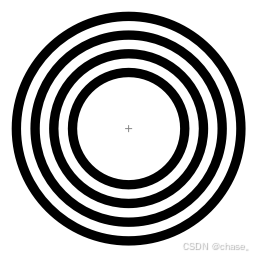

# CCTag 标记技术详解

## 简介
CCTag 是一种基于同心圆的标记技术，广泛应用于计算机视觉领域，特别是在高精度定位和识别任务中。本文将详细介绍 CCTag 的编码原理、识别原理、优势和缺点，并探讨其在实际应用中的表现。

## 编码原理
CCTag 标记由一组同心圆组成，这些同心圆具有不同的半径，形成一个独特的模式。这种设计允许标记在不同的尺度和视角下被识别，同时还能保持较高的识别准确度。每个 CCTag 标记具有一个中心圆，周围是若干个同心的环形，通过环形的宽度、数量和排列顺序来编码信息。

### 编码示例
- **中心圆**：标记的核心部分，通常用于初步定位。
- **同心环**：围绕中心圆的多个环形，通过不同的宽度和数量来编码信息。

这种结构使得 CCTag 标记在图像中具有高度的辨识度，即使在复杂的背景下也能被准确识别。

## 识别原理
CCTag 的识别原理基于多个同心圆的检测，这些同心圆组成的标记能够提供高精度的定位和识别能力。具体步骤如下：

1. **图像预处理**：对输入图像进行灰度化和二值化处理，以突出同心圆的边缘。
2. **边缘检测**：使用边缘检测算法（如 Canny 算法）提取图像中的边缘信息。
3. **圆形检测**：通过霍夫变换等方法检测图像中的圆形结构。
4. **同心圆匹配**：根据检测到的圆形结构，匹配同心圆的模式，识别出 CCTag 标记。
5. **信息解码**：根据同心圆的排列顺序和宽度，解码出标记所携带的信息。

## 优势
CCTag 标记技术具有以下优势：

1. **高精度**：通过利用多个同心圆的结构，可以实现非常精确的位置和方向估计。
2. **高鲁棒性**：CCTag 通过多个同心圆的设计，即使在部分遮挡、不同光照条件下也能保持高识别精度和鲁棒性。
3. **良好的可扩展性**：通过调整同心圆的数量、大小和排列，可以设计出大量的独特标记。
4. **计算成本较高**：识别过程涉及复杂的图像处理和几何分析。
5. **手眼标定采样工作范围要求相对低**：适用于六轴及其以上轴数的机械臂手眼标定。

## 缺点
尽管 CCTag 标记技术具有诸多优势，但也存在一些缺点：

1. **计算成本较高**：由于识别过程涉及复杂的图像处理和几何分析，计算成本较高。
2. **适用范围有限**：仅适合六轴机械臂的手眼标定，不适合三轴和四轴机械臂（不包含姿态），以及相机内参标定。

## 应用场景
CCTag 标记技术在以下领域具有广泛的应用：

1. **机器人导航**：通过高精度的定位和识别能力，CCTag 可用于机器人导航和路径规划。
2. **增强现实**：在增强现实应用中，CCTag 可用于精确的物体跟踪和定位。
3. **工业自动化**：在工业自动化中，CCTag 可用于机械臂的手眼标定和精确定位。

## 总结
CCTag 标记技术通过独特的同心圆编码方式，实现了高精度、高鲁棒性的标记识别。尽管其计算成本较高，但在需要高精度定位和识别的应用中，CCTag 具有显著的优势。未来，随着计算能力的提升和算法的优化，CCTag 有望在更多领域得到应用和推广。

希望本文能帮助读者更好地理解 CCTag 标记技术，并在实际应用中充分发挥其优势。