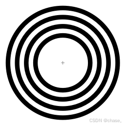

CCTag 使用同心圆环形成可识别的标记，重点是恢复标记身份和稳定的图像中心位置。它属于视觉标记检测方法，不由机器人是三轴、四轴还是六轴决定是否能使用。

## 1. 编码与检测

圆环的相对几何关系对应码本中的标记 ID。实际使用应从工具提供的码本生成标记，并保持打印比例，不能任意改变圆环数量或宽度后仍期待同一检测器识别。

透视投影会把圆投成椭圆。官方实现围绕图像梯度、候选结构与几何验证进行检测，不能把“霍夫圆检测后匹配”当作其完整算法。[CCTag 官方实现与说明](https://github.com/alicevision/CCTag)

## 2. 一个标记能提供什么

单个旋转对称标记的身份和中心检测，并不直接提供完整的六维刚体位姿，尤其不能单独区分绕自身法向的面内旋转。需要姿态时，应使用具有已知空间布局的多个标记，并结合相机模型进行几何求解。

| 任务 | 还需要的信息 |
| --- | --- |
| 图像中跟踪中心 | 合适的检测阈值、清晰度与像素尺度 |
| 相机外参或物体位姿 | 多个已知三维位置与二维观测的对应关系 |
| 相机内参标定 | 标定物几何、多个视角及内参优化流程 |
| 手眼标定 | 机器人位姿、时间同步与可观测的运动激励 |

## 3. 优势与限制如何评估

同心圆结构可用于模糊等条件下的检测，但鲁棒性需要在实际曝光、焦距、距离、遮挡和运动速度下测试。不要把“对模糊有鲁棒性”扩展成任意遮挡和任意光照下都可靠。

标记类型与手眼问题的可观测性应分开分析：机器人运动缺少必要旋转激励时，换一个标记不一定能消除标定退化。

## 4. 工程检查

固定打印尺寸，记录图像中的最小标记直径；检查误检率、漏检率、中心定位抖动和处理耗时。进行位姿估计时，还应在独立图像上测量重投影误差和坐标变换残差。

## 阅读自测与验收

- 从不同距离和倾角拍摄标记，记录检出率与圆心误差；图案能被识别不等于它提供了完整、无歧义的六维位姿。
- 需要尺度或朝向时，明确增加了哪些已知几何信息和标记组合；不要仅由同心圆的 ID 推出绕对称轴的旋转。
