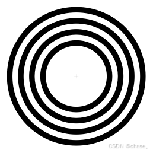

CCTag 使用同心圆环形成可识别的标记，重点是恢复标记身份和稳定的图像中心位置。它属于视觉标记检测方法，不由机器人是三轴、四轴还是六轴决定是否能使用。



## 1. 编码与检测

圆环的相对几何关系对应码本中的标记 ID。实际使用应从工具提供的码本生成标记，并保持打印比例，不能任意改变圆环数量或宽度后仍期待同一检测器识别。

透视投影会把圆投成椭圆。官方实现围绕图像梯度、候选结构与几何验证进行检测，不能把“霍夫圆检测后匹配”当作其完整算法。[CCTag 官方实现与说明](https://github.com/alicevision/CCTag)

## 2. 一个标记能提供什么

单个旋转对称标记的身份和中心检测，并不直接提供完整的六维刚体位姿，尤其不能单独区分绕自身法向的面内旋转。需要姿态时，应使用具有已知空间布局的多个标记，并结合相机模型进行几何求解。

| 任务 | 还需要的信息 |
| --- | --- |
| 图像中跟踪中心 | 合适的检测阈值、清晰度与像素尺度 |
| 相机外参或物体位姿 | 多个已知三维位置与二维观测的对应关系 |
| 相机内参标定 | 标定物几何、多个视角及内参优化流程 |
| 手眼标定 | 机器人位姿、时间同步与可观测的运动激励 |

## 3. 优势与限制如何评估

同心圆结构可用于模糊等条件下的检测，但鲁棒性需要在实际曝光、焦距、距离、遮挡和运动速度下测试。不要把“对模糊有鲁棒性”扩展成任意遮挡和任意光照下都可靠。

标记类型与手眼问题的可观测性应分开分析：机器人运动缺少必要旋转激励时，换一个标记不一定能消除标定退化。

## 4. 工程检查

固定打印尺寸，记录图像中的最小标记直径；检查误检率、漏检率、中心定位抖动和处理耗时。进行位姿估计时，还应在独立图像上测量重投影误差和坐标变换残差。

### 先跑通样例，再接真实相机

按 [官方仓库的构建说明](https://github.com/alicevision/CCTag)编译检测程序后，可以在仓库根目录运行其三环样例。下面的路径对应 README 的构建布局；使用不同构建目录时要相应调整。

```bash
./build/src/detection -n 3 -i sample/01.png
```

这里的 `-n 3` 指标记的环数，必须与打印图案和检测配置一致。先确认样例能产生有效识别，再替换输入图像；否则无法判断问题来自编译环境，还是实际拍摄条件。

API 返回的候选列表也不能直接当作可信的 ID—像素坐标表。[官方使用示例](https://cctag.readthedocs.io/en/stable/api/usage.html)会检查 `getStatus()` 是否为可靠识别状态；接口说明中有效状态值为 `1`。集成时优先使用所安装版本提供的具名状态常量，并保留失败状态用于诊断。

| 输出阶段 | 建议保留的信息 | 下一步能做什么 |
| --- | --- | --- |
| 找到候选圆环 | 帧号、中心、候选状态 | 检查尺度、曝光与误检，尚不能用于 ID 对应 |
| 可靠解码 | ID、中心、检测状态 | 与已知标记布局建立对应；重复 ID 或布局外 ID 仍需拒绝 |
| 几何求解 | 内参、畸变、3D–2D 对应、内点集合 | 估计位姿并检查深度、重投影与时间连续性 |
| 独立验收 | 未参与拟合的图像及机器人位姿 | 检查最终定位误差，不只统计解码成功率 |

在整条链路里保留亚像素中心，显示时再取整。把中心提前转换为整数像素会丢失信息；把未解码候选强行分配到最近 ID，则可能得到数值很稳定、对应关系却错误的外参。

### 怎样记录一次可比较的检测实验

同一静止标记连续拍摄时，可用中心相对时间均值的标准差衡量**重复性**；没有独立真值，这不等于圆心的绝对定位误差。运动场景则需使用同步参考轨迹，不能把真实运动算进检测抖动。

将测试按距离、倾角和曝光分组，同时报告“真实可见标记数、可靠识别数、错误 ID 数”和检测耗时的中位数、较高分位数。只在成功帧上统计误差会漏掉困难条件下的失败；只给平均耗时也看不出偶发长帧对控制链路的影响。


## 阅读自测与验收

- 从不同距离和倾角拍摄标记，记录检出率与圆心误差；图案能被识别不等于它提供了完整、无歧义的六维位姿。
- 需要尺度或朝向时，明确增加了哪些已知几何信息和标记组合；不要仅由同心圆的 ID 推出绕对称轴的旋转。
