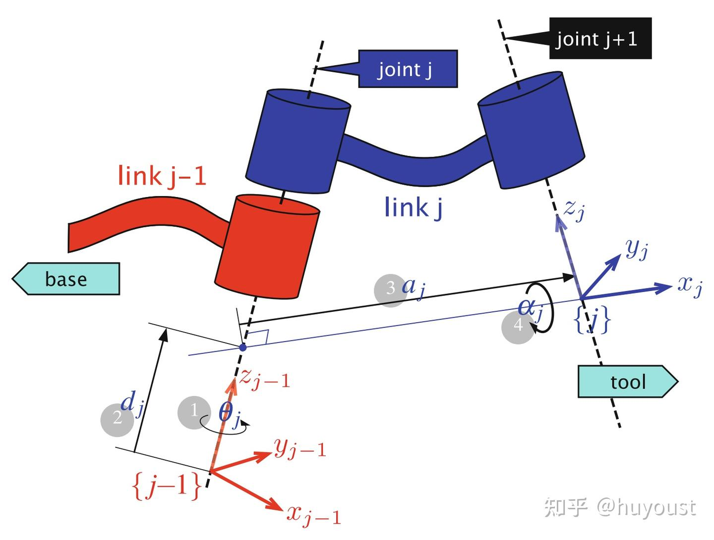
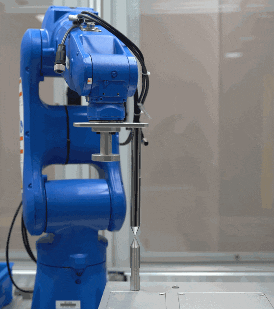
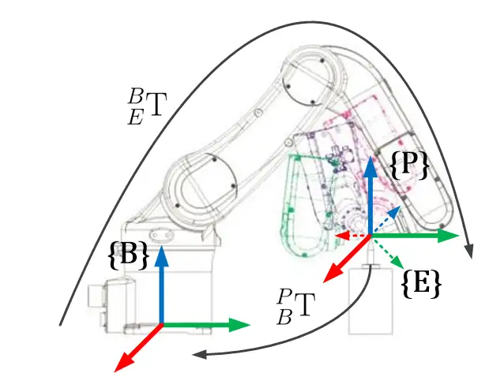

知乎参考: https://www.zhihu.com/question/54682285/answer/336365316

---

## 1. 机器人正运动学
### 1.1 机器人DH参数简介
Denavit-Hartenberg（DH）参数是一种标准化方法，用于描述机器人各关节之间的几何关系。通过DH参数，可以将机器人关节的旋转和平移统一表示为矩阵变换。

DH参数包括以下四个变量：

**$a_i$**：相邻关节轴之间的连杆长度。
**$d_i$**：沿关节轴的偏移量。
**$\alpha_i$**：相邻关节轴之间的扭转角。
**$\theta_i$**：关节的旋转角度。
对于机器人，关节角度 $\theta_i$ 通常由硬件编码器返回的值 $q_i$ 和关节零位偏置 $\theta_i^{\text{offset}}$ 组成： $$ \theta_i = q_i + \theta_i^{\text{offset}} $$

### 1.2 正运动学公式
通过DH参数和关节角度，可以计算机器人末端在基坐标系下的位姿矩阵： $$ {}_{E}^{B}\textrm{T} = f(\overrightarrow{q}, \overrightarrow{\phi}) $$

其中：

**$\overrightarrow{q}$**：关节角度向量，由编码器返回的值组成。
**$\overrightarrow{\phi}$**：机器人运动学参数向量，包括所有的DH参数： $$ \overrightarrow{\phi} = (a_0, d_0, \alpha_1, \theta_1, \dots, a_{n-1}, d_{n-1}, \alpha_n, \theta_n)^T $$

由于装配误差、加工误差等原因，$\overrightarrow{\phi}$ 中的参数可能存在偏差，因此需要通过标定来修正这些参数。

## 2. 机器人标定公式
### 2.1 标定目标
标定的目标是通过实验数据优化 $\overrightarrow{\phi}$，使得机器人末端的实际位置与理论计算位置之间的误差最小。

### 2.2 标定方法
标定的核心思想是利用固定的针尖基准点 $P$，通过最小二乘法迭代优化 $\overrightarrow{\phi}$。

#### 2.2.1 数据采集

- 将机器人末端与针尖基准点 $P$ 对齐。
- 选取若干个不同的关节角度配置 $\overrightarrow{q}$，记录每个配置下的关节角度数据。
- 通过正运动学公式计算每个配置下的末端位姿 ${}^{\text{B}}_{\text{E}}T$。

 
#### 2.2.2 误差定义
由于末端点始终与针尖基准点 $P$ 接触，末端点在 $P$ 坐标系下的位置应为 $(0, 0, 0)^T$。因此，误差函数可以定义为： 
$$ \Delta_{E}^{P}\overrightarrow{p} = \begin{bmatrix} 0 \\ 0 \\ 0 \end{bmatrix} - {}_{E}^{P}\overrightarrow{p} $$

其中：

**${}_{E}^{P}\overrightarrow{p}$**：末端点在 $P$ 坐标系下的位置，由正运动学计算得到。

#### 2.2.3 雅可比矩阵
误差函数 $\Delta_{E}^{P}\overrightarrow{p}$ 对运动学参数 $\overrightarrow{\phi}$ 的偏导数构成雅可比矩阵 $J$： $$ J = \begin{bmatrix} \frac{\partial f}{\partial a_0} & \frac{\partial f}{\partial d_0} & \cdots & \frac{\partial f}{\partial \theta_n} \end{bmatrix} $$

#### 2.2.4 参数更新
通过最小二乘法，计算运动学参数的修正值 $\Delta\overrightarrow{\phi}$： 
$$ \Delta\overrightarrow{\phi} = (J^T J)^{-1} J^T \cdot \Delta_{E}^{P}\overrightarrow{p} $$

然后更新运动学参数： 
$$ \overrightarrow{\phi}^{k+1} = \overrightarrow{\phi}^{k} + \Delta\overrightarrow{\phi} $$

#### 2.2.5 迭代停止条件
重复上述步骤，直到 $\Delta\overrightarrow{\phi}$ 足够小，即： $$ |\Delta\overrightarrow{\phi}| < \epsilon $$

其中 $\epsilon$ 是预设的误差阈值。

### 3. 参考开源仓库
通过其他方法进行运动学参数标定.
- https://github.com/PhilNad/robot-arm-kinematic-calibration
	- 采用基于POE的机器人运动学校准方法，利用轴配置空间和伴随误差模型，基于扭转和正向运动学的指数积(POE)公式。通过迭代最小二乘优化方案，可以找到螺旋轴校正，从而最小化观测值与机器人正向运动学之间的误差。

- https://github.com/neuebot/Kinematic-Calibration
	- 一种基于圆拟合和对偶矢量几何的方法，用于确定串行机械手的经典Denavit-Hartenberg参数。 
- https://github.com/cursi36/Kalibrot?tab=readme-ov-file
	- 采用Kalibrot(一种优化算法)解决寻找正确机器人运动学校准的最佳 DH 参数的问题。 