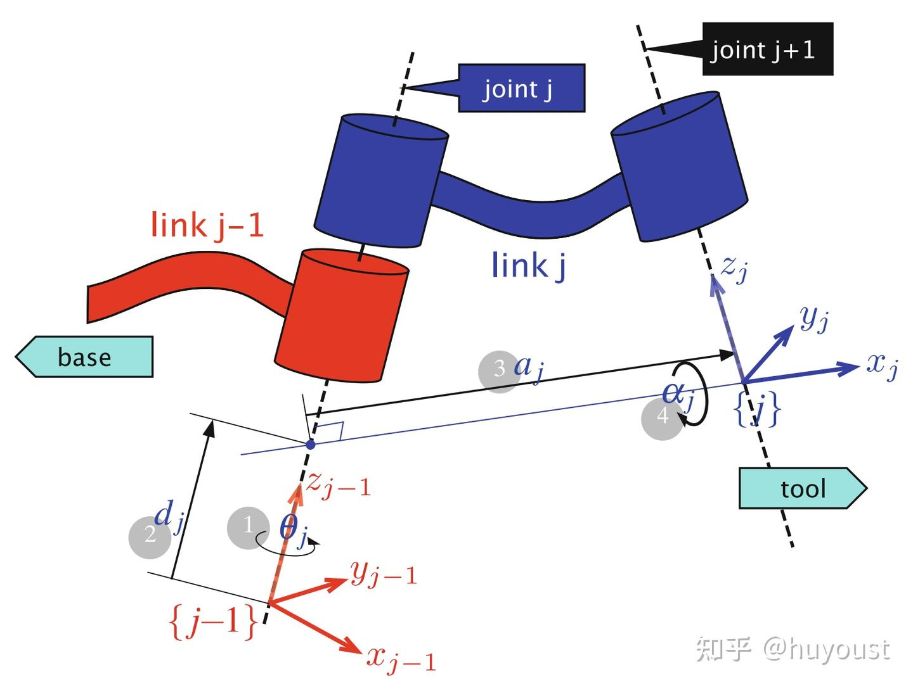
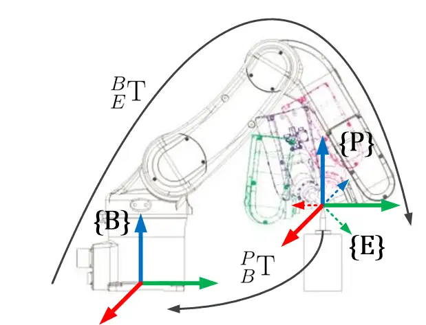

## 从零位偏置扩展到几何参数

运动学标定通过外部观测修正模型参数，不是“把所有 DH 数值都放进最小二乘就能唯一求出”。本文使用基坐标系下的 TCP **位置观测**，区分关节 Jacobian 与参数 Jacobian。

设正运动学为 $T(q,\phi)$，其中 $q$ 是编码器读数，$\phi$ 只包含选定的待估参数，例如连杆长度、轴线偏差、关节零偏或工具参数。不要把随采样变化的关节角 $q_i$ 当作共同待估常量。

标准 DH 与改进 DH 的变换顺序不同，参数表必须与 FK 实现一致。近似平行轴等结构还可能使经典 DH 参数化病态，需要考虑更合适的参数化。

## 明确残差与坐标系

若测量给出基坐标系下的位置 $p_i^{\mathrm{meas}}$，定义：

$$
r_i(\phi)=p_i^{\mathrm{meas}}-p(q_i,\phi),\qquad
J_{\phi,i}=\frac{\partial p(q_i,\phi)}{\partial\phi}\in\mathbb R^{3\times k}.
$$

这里对 **位置向量** 求导，不是将完整 $4\times4$ 位姿矩阵的导数直接塞进三维残差。若使用姿态观测，应另行构造 SO(3)/SE(3) 上的误差，并处理米与弧度的权重。

### 固定针尖实验的限制

如果固定点 $P$ 在基坐标系中的位置未知，可令残差为 $P-p(q_i,\phi)$，联合估计 $P$；也可使用姿态间位置差消去 $P$。不能因为点固定就把它在基坐标系中的坐标写成零。

仅凭同一点接触，不一定能区分全部连杆、工具、基座与零位参数。应固定坐标规范、去掉不可辨识参数，必要时增加外部位置/姿态观测。重复采很多退化姿态不会消除这种歧义。

## 迭代最小二乘

在当前参数 $\phi_k$ 处线性化：

$$
p(q_i,\phi_k+\Delta\phi)\approx p(q_i,\phi_k)+J_{\phi,i}\Delta\phi.
$$

堆叠 $J_\phi$ 和 $r$ 后，求解带阻尼的线性最小二乘：

$$
\min_{\Delta\phi}\|W^{1/2}(J_\phi\Delta\phi-r)\|^2
+\lambda^2\|D\Delta\phi\|^2.
$$

$W$ 表示测量权重，$D$ 用于参数尺度归一化或正则化。用 QR/SVD 或增广最小二乘求解，避免显式计算 $(J^\top J)^{-1}$。更新 $\phi_{k+1}=\phi_k+\alpha\Delta\phi$，通过步长控制确保非线性目标确实下降。

### 每轮需要检查什么

1. 比较解析/自动微分 Jacobian 与有限差分结果，先排除符号和索引错误。
2. 检查奇异值和秩，区分不可观测与优化尚未收敛。
3. 同时记录残差、更新量、代价下降与参数边界；更新很小可能只是停滞。
4. 在未参与拟合的姿态上验证，并报告测量系统的噪声与单位。

## 可继续阅读的实现

以下是不同参数化或测量方法的研究实现，应分别核对其实验假设与许可证：

- [基于 POE 的机器人运动学校准](https://github.com/PhilNad/robot-arm-kinematic-calibration)
- [圆拟合与运动学标定实现](https://github.com/neuebot/Kinematic-Calibration)
- [Kalibrot 标定工具](https://github.com/cursi36/Kalibrot)

## 阅读自测与验收

- 先用已知参数合成观测，再尝试恢复参数；检查哪些列近似线性相关，以及单独改变某参数能否被其他参数抵消。
- 把标定样本与验证样本分开，比较标定前后位置残差和参数变化；训练残差下降但验证变差时，应检查可辨识性与过拟合。
