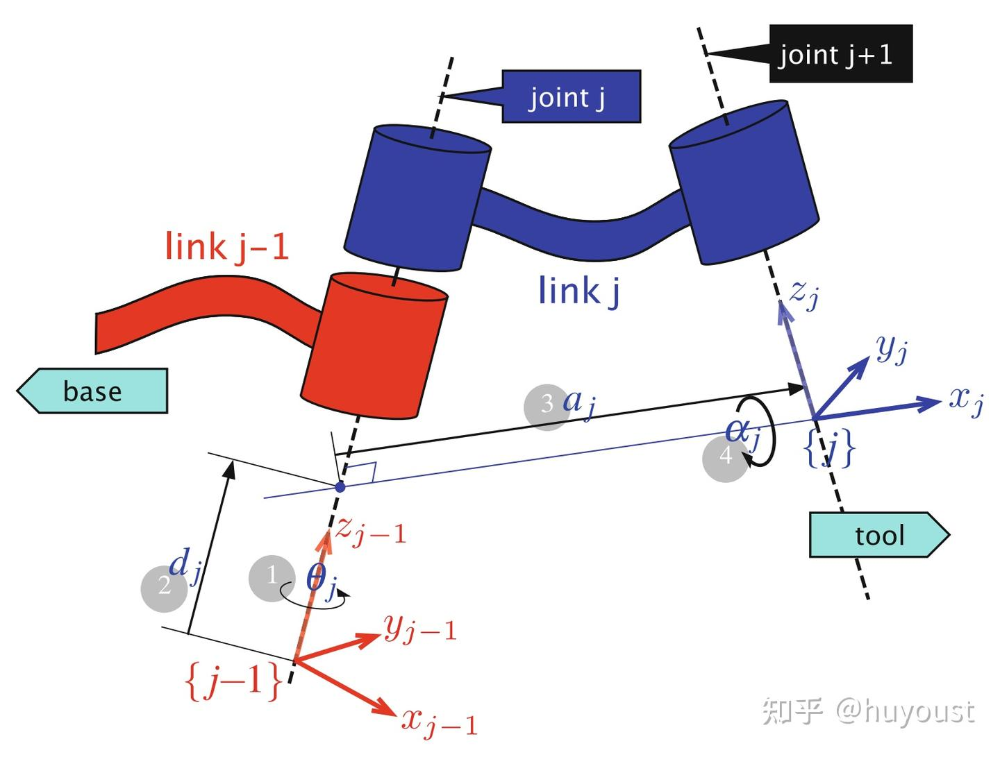
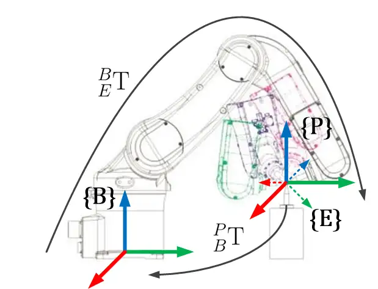
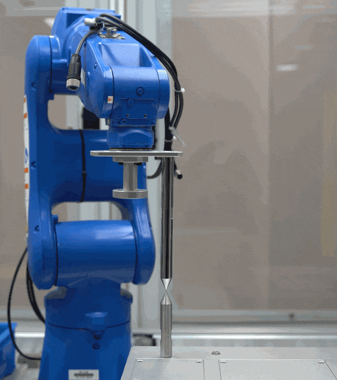

## 从零位偏置扩展到几何参数

运动学标定通过外部观测修正模型参数，不是“把所有 DH 数值都放进最小二乘就能唯一求出”。本文使用基坐标系下的 TCP **位置观测**，区分关节 Jacobian 与参数 Jacobian。



设正运动学为 $T(q,\phi)$，其中 $q$ 是编码器读数，$\phi$ 只包含选定的待估参数，例如连杆长度、轴线偏差、关节零偏或工具参数。不要把随采样变化的关节角 $q_i$ 当作共同待估常量。

标准 DH 与改进 DH 的变换顺序不同，参数表必须与 FK 实现一致。近似平行轴等结构还可能使经典 DH 参数化病态，需要考虑更合适的参数化。

<figure class="article-figure">
  
  <figcaption><span class="article-figure__number">图 1</span><span class="article-figure__text">从采样到验收的标定流程。留出批次不参与参数拟合；位置与姿态观测应分别报告相应误差，本文的位置模型仅使用位置残差。</span></figcaption>
</figure>

划分数据时应尽量按采集批次或姿态区域留出，避免相邻时间帧几乎重复，导致验证集只是拟合集的拷贝。若根据留出结果反复选择模型或调阈值，这批数据已经参与模型选择，最终验收还需要新的独立批次。

## 明确残差与坐标系

若测量给出基坐标系下的位置 $p_i^{\mathrm{meas}}$，定义：

$$
r_i(\phi)=p_i^{\mathrm{meas}}-p(q_i,\phi),\qquad
J_{\phi,i}=\frac{\partial p(q_i,\phi)}{\partial\phi}\in\mathbb R^{3\times k}.
$$

这里对 **位置向量** 求导，不是将完整 $4\times4$ 位姿矩阵的导数直接塞进三维残差。若使用姿态观测，应另行构造 SO(3)/SE(3) 上的误差，并处理米与弧度的权重。

### 固定针尖实验的限制





如果固定点 $P$ 在基坐标系中的位置未知，可令残差为 $P-p(q_i,\phi)$，联合估计 $P$；也可使用姿态间位置差消去 $P$。不能因为点固定就把它在基坐标系中的坐标写成零。

仅凭同一点接触，不一定能区分全部连杆、工具、基座与零位参数。应固定坐标规范、去掉不可辨识参数，必要时增加外部位置/姿态观测。重复采很多退化姿态不会消除这种歧义。

## 迭代最小二乘

在当前参数 $\phi_k$ 处线性化：

$$
p(q_i,\phi_k+\Delta\phi)\approx p(q_i,\phi_k)+J_{\phi,i}\Delta\phi.
$$

堆叠 $J_\phi$ 和 $r$ 后，求解带阻尼的线性最小二乘：

$$
\min_{\Delta\phi}\|W^{1/2}(J_\phi\Delta\phi-r)\|^2
+\lambda^2\|D\Delta\phi\|^2.
$$

$W$ 表示测量权重，$D$ 用于参数尺度归一化或正则化。用 QR/SVD 或增广最小二乘求解，避免显式计算 $(J^\top J)^{-1}$。更新 $\phi_{k+1}=\phi_k+\alpha\Delta\phi$，通过步长控制确保非线性目标确实下降。

### 每轮需要检查什么

1. 比较解析/自动微分 Jacobian 与有限差分结果，先排除符号和索引错误。
2. 检查奇异值和秩，区分不可观测与优化尚未收敛。
3. 同时记录残差、更新量、代价下降与参数边界；更新很小可能只是停滞。
4. 在未参与拟合的姿态上验证，并报告测量系统的噪声与单位。

## 一个可复现实验：残差为零，参数仍不唯一

考虑连杆长度已知的平面二连杆，只估计基座相对测量系的偏航 $\beta$ 和两个关节零偏 $\delta_1,\delta_2$。令：

$$
a=q_1+\beta+\delta_1,\qquad b=a+q_2+\delta_2,
\qquad
p=\begin{bmatrix}l_1\cos a+l_2\cos b\\l_1\sin a+l_2\sin b\end{bmatrix}.
$$

位置只依赖 $\beta+\delta_1$，所以对任何常数 $c$，用 $(\beta+c,\delta_1-c,\delta_2)$ 替代原参数，**每个关节姿态的预测都完全相同**。参数 Jacobian 的前两列相等，方向 $[1,-1,0]^\top$ 落在零空间中。这是结构性不可辨识，增加同类位置样本、换优化器或减小停止阈值都解决不了。

[下载完整 NumPy 实验](calibration_identifiability.py)，运行：

```bash
python calibration_identifiability.py
```

脚本用 seed 42 生成 30 个拟合姿态和 12 个留出姿态，先用中心差分验证解析 Jacobian，再验证上述等价参数族。无噪声运行结果如下；末位随数值库可能略有变化。

| 检查 | 结果 | 含义 |
| --- | --- | --- |
| 三参数 Jacobian 的奇异值 | 约 9.935、2.522、$1.8\times10^{-15}$ | 秩为 2，存在一个不可辨识方向 |
| 固定 $\beta=0$ 后的两列奇异值 | 约 7.203、2.460 | 剩余两参数可在这些姿态下局部区分 |
| 原始参数 $(\beta,\delta_1,\delta_2)$ | $(0.07,-0.02,0.04)$ rad | 合成数据的设定 |
| 固定规范后的拟合值 | $(0,0.05,0.04)$ rad | 第一关节参数吸收了基座偏航 |
| 留出位置误差 | 小于 $10^{-10}$ m | 检查代数实现，不代表实机测量精度 |
{.table-readable}

因此，即使留出误差也接近零，仍不能声称恢复了真实的第一关节零偏 $-0.02$ rad。若业务需要区分这两个物理量，必须独立测量基座朝向，或增加能打破该等价关系的观测；简单补充同一末端在外部测量系中的姿态，仍然只看到它们的和，也未必足够。

### 奇异值比较前，先统一参数尺度

上例的三个参数都是弧度，便于直接展示列相关性。真实模型混有毫米、米和弧度时，直接比较原始 Jacobian 的条件数会受单位选择影响。若令 $z=D\Delta\phi$，应分析与优化一致的缩放矩阵：

$$
\widetilde J=W^{1/2}J_\phi D^{-1}.
$$

例如 $D$ 的对角元可取各参数合理变化尺度的倒数，$W$ 则根据测量协方差构造。这里的尺度应来自测量与模型，而不是为了把条件数“调好看”。[SciPy `least_squares` 的 `x_scale` 文档](https://docs.scipy.org/doc/scipy/reference/generated/scipy.optimize.least_squares.html)说明了变量缩放对求解步长的影响；它能改善数值行为，不能创造原本不存在的观测信息。

## 可继续阅读的实现

以下是不同参数化或测量方法的研究实现，应分别核对其实验假设与许可证：

- [基于 POE 的机器人运动学校准](https://github.com/PhilNad/robot-arm-kinematic-calibration)
- [圆拟合与运动学标定实现](https://github.com/neuebot/Kinematic-Calibration)
- [Kalibrot 标定工具](https://github.com/cursi36/Kalibrot)


## 阅读自测与验收

- 先用已知参数合成观测，再尝试恢复参数；检查哪些列近似线性相关，以及单独改变某参数能否被其他参数抵消。
- 把标定样本与验证样本分开，比较标定前后位置残差和参数变化；训练残差下降但验证变差时，应检查可辨识性与过拟合。
