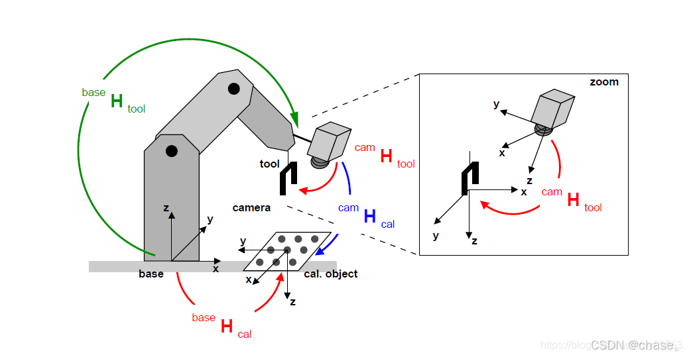
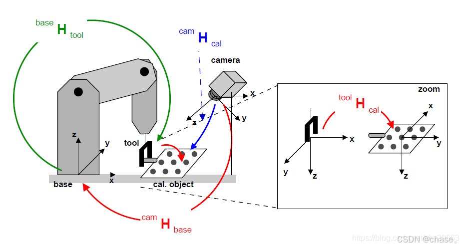

手眼标定的关键是统一坐标变换的方向。本文约定 $ {}^{a}T_b$ 把 **b 坐标系中的点变换到 a 坐标系**：$p_a = {}^{a}T_b p_b$。矩阵按从右到左的顺序作用，相邻坐标系下标必须相接。

## 1. 区分相机内参与手眼外参

相机内参标定估计焦距、主点和畸变；手眼标定估计相机与机械臂之间的刚体变换。张正友标定法主要解决前者，不能把它直接当作 $AX=XB$ 的手眼求解方法。

记基座为 $b$、末端为 $g$、相机为 $c$、标定板为 $t$。机器人提供 $ {}^{b}T_g$；PnP 等视觉算法通常提供 $ {}^{c}T_t$，即标定板到相机的变换。

## 2. Eye-in-Hand：相机安装在末端



定义第 $i$ 次采样的机器人位姿 $G_i={}^{b}T_{g_i}$，视觉观测 $C_i={}^{c_i}T_t$，未知手眼变换 $X={}^{g}T_c$。固定标定板在基座中的位姿为 $Y={}^{b}T_t$，因此：

$$
G_i X C_i = Y.
$$

对两次采样消去 $Y$：

$$
G_j^{-1}G_i X = X C_j C_i^{-1}.
$$

这就得到 $AX=XB$，其中 $A=G_j^{-1}G_i$，$B=C_jC_i^{-1}$。这里的 $X$ 只有一个，表示**相机到末端**的固定变换。

## 3. Eye-to-Hand：相机固定在环境中



此时未知相机外参为 $X={}^{b}T_c$，标定板安装变换为 $Z={}^{g}T_t$。闭合关系变成：

$$
G_i Z = X C_i.
$$

对两次采样可得到：

$$
G_j^{-1}G_i Z = Z C_j^{-1}C_i.
$$

先求出 $Z$，再由 $X=G_i Z C_i^{-1}$ 恢复相机外参。注意：这一构造里 $AZ=ZB$ 直接求出的是**标定板到末端**，不能把它误称为相机到末端。

如果 $Z$ 已经过独立测量，也可以直接使用多组 $G_i Z C_i^{-1}$ 估计 $X$。旋转平均应在旋转群上处理，不能逐元素平均后直接当作合法旋转矩阵。

## 4. AX=YB：两个未知固定变换

机器人—世界/手眼联合标定常写为 $AX=YB$。字母名称本身不决定坐标系，必须先写出闭合关系，再逐项映射到库函数的定义。

例如 Eye-in-Hand 的 $G_i X C_i=Y$ 可以写成 $G_i X=Y C_i^{-1}$。这里同时估计手眼变换与标定板在基座中的位姿；它与已通过相对运动消去一个未知量的 $AX=XB$ 不同。

## 5. 数据采集与验收

1. 先确定相机内参与畸变，并检查每帧标定板检测质量。
2. 采集覆盖不同位置和多个旋转轴的姿态，保证板与安装结构保持刚性。两个姿态一般不足以唯一确定完整手眼变换。
3. 统一长度单位、角度单位、时间戳和变换方向；运动中采集尤其要检查同步。
4. 用训练数据估计外参，用独立采样检查闭合残差和目标定位误差。
5. 分别报告平移误差与旋转角误差；重投影误差较小不等于机器人基座中的定位误差一定较小。

## 6. OpenCV 接口与原始方法

[OpenCV calib3d 文档](https://docs.opencv.org/4.x/d9/d0c/group__calib3d.html)分别提供 `calibrateHandEye` 和 `calibrateRobotWorldHandEye`。调用前逐项核对 `gripper2base`、`target2cam` 等参数的方向，不能只看矩阵形状。

常见手眼方法包括 Tsai–Lenz、Park–Martin、Horaud、Andreff 和 Daniilidis。选择方法后仍需验证采样的可观测性、噪声敏感性和留出集残差。


## 7. 用合成位姿验证接口与乘法顺序

先用已知 `X`、`Y` 合成 `C_i = inv(X) @ inv(G_i) @ Y`，再调用 OpenCV 恢复 `X`。下面的无噪声测试覆盖多个旋转轴，并留出 6 个姿态检验闭合关系；它验证坐标约定与 API，不证明真实相机或机器人的测量精度。

```python
import cv2
import numpy as np


def transform(rotvec, translation):
    result = np.eye(4)
    result[:3, :3] = cv2.Rodrigues(np.asarray(rotvec, dtype=float))[0]
    result[:3, 3] = translation
    return result


def rigid_inverse(matrix):
    result = np.eye(4)
    result[:3, :3] = matrix[:3, :3].T
    result[:3, 3] = -result[:3, :3] @ matrix[:3, 3]
    return result


rng = np.random.default_rng(42)
X_true = transform([0.2, -0.3, 0.1], [0.04, -0.02, 0.12])  # g <- c
Y_true = transform([-0.1, 0.2, 0.3], [0.5, 0.1, 0.8])     # b <- t
G = [transform(rng.normal(0, 0.6, 3), rng.uniform(-0.4, 0.4, 3))
     for _ in range(20)]
C = [rigid_inverse(X_true) @ rigid_inverse(g) @ Y_true for g in G]
train = 14
rotation, translation = cv2.calibrateHandEye(
    [g[:3, :3] for g in G[:train]], [g[:3, 3] for g in G[:train]],
    [c[:3, :3] for c in C[:train]], [c[:3, 3] for c in C[:train]],
    method=cv2.CALIB_HAND_EYE_PARK,
)
X_est = np.eye(4)
X_est[:3, :3] = rotation
X_est[:3, 3] = translation.ravel()
assert np.isfinite(X_est).all()
np.testing.assert_allclose(rotation.T @ rotation, np.eye(3), atol=1e-10)
np.testing.assert_allclose(np.linalg.det(rotation), 1, atol=1e-10)
np.testing.assert_allclose(X_est, X_true, atol=1e-9)

translation_errors, rotation_errors = [], []
for g, c in zip(G[train:], C[train:]):
    closure = g @ X_est @ c
    translation_errors.append(np.linalg.norm(closure[:3, 3] - Y_true[:3, 3]))
    delta_R = Y_true[:3, :3].T @ closure[:3, :3]
    rotation_errors.append(np.linalg.norm(cv2.Rodrigues(delta_R)[0]))
assert max(translation_errors) < 1e-9
assert max(rotation_errors) < 1e-7

# 再独立核对相对运动方程，防止 i、j 或求逆顺序写反。
A = rigid_inverse(G[1]) @ G[0]
B = C[1] @ rigid_inverse(C[0])
np.testing.assert_allclose(A @ X_est, X_est @ B, atol=1e-9)
print("held-out translation error [m]:", max(translation_errors))
print("held-out rotation error [rad]:", max(rotation_errors))
```

只有将真实的同步机器人位姿和视觉观测填入 `G`、`C` 后，才进入测量误差问题。真实数据通常达不到此处的无噪声容差，也不应为了让测试通过而反复剔除留出集。上例的虚拟姿态只保证代数成立，没有模拟标定板是否在视野内。

## 阅读自测与验收

- 为每个位姿写清从哪个坐标系变到哪个坐标系，用合成变换验证 AX=XB 的乘法顺序。
- 分别计算相机观测残差和机器人运动一致性；采样姿态应包含足够不同的旋转轴，单纯增加同方向运动的数量未必改善标定。
