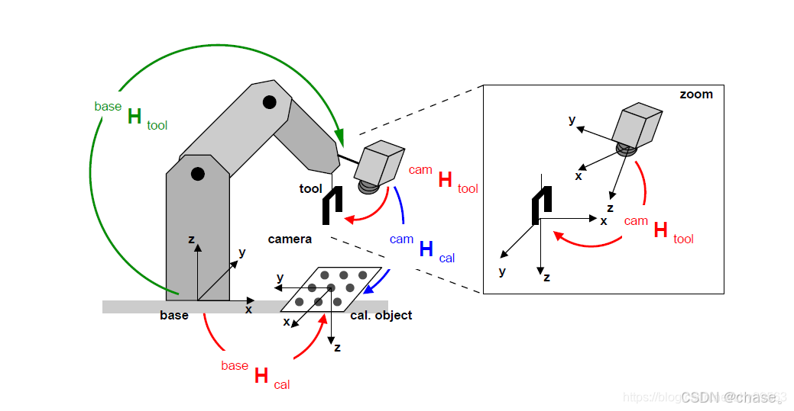
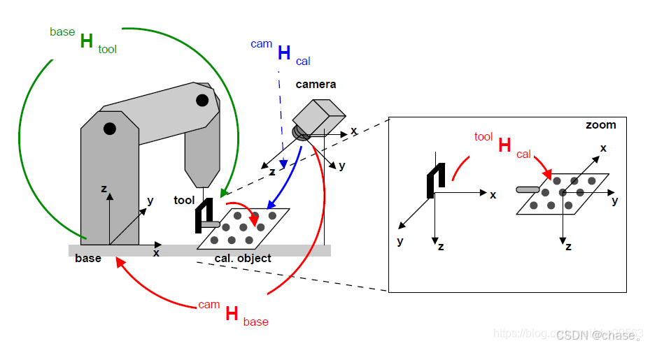

手眼标定的关键是统一坐标变换的方向。本文约定 $ {}^{a}T_b$ 把 **b 坐标系中的点变换到 a 坐标系**：$p_a = {}^{a}T_b p_b$。矩阵按从右到左的顺序作用，相邻坐标系下标必须相接。

## 1. 区分相机内参与手眼外参

相机内参标定估计焦距、主点和畸变；手眼标定估计相机与机械臂之间的刚体变换。张正友标定法主要解决前者，不能把它直接当作 $AX=XB$ 的手眼求解方法。

记基座为 $b$、末端为 $g$、相机为 $c$、标定板为 $t$。机器人提供 $ {}^{b}T_g$；PnP 等视觉算法通常提供 $ {}^{c}T_t$，即标定板到相机的变换。

## 2. Eye-in-Hand：相机安装在末端



定义第 $i$ 次采样的机器人位姿 $G_i={}^{b}T_{g_i}$，视觉观测 $C_i={}^{c_i}T_t$，未知手眼变换 $X={}^{g}T_c$。固定标定板在基座中的位姿为 $Y={}^{b}T_t$，因此：

$$
G_i X C_i = Y.
$$

对两次采样消去 $Y$：

$$
G_j^{-1}G_i X = X C_j C_i^{-1}.
$$

这就得到 $AX=XB$，其中 $A=G_j^{-1}G_i$，$B=C_jC_i^{-1}$。这里的 $X$ 只有一个，表示**相机到末端**的固定变换。

## 3. Eye-to-Hand：相机固定在环境中



此时未知相机外参为 $X={}^{b}T_c$，标定板安装变换为 $Z={}^{g}T_t$。闭合关系变成：

$$
G_i Z = X C_i.
$$

对两次采样可得到：

$$
G_j^{-1}G_i Z = Z C_j^{-1}C_i.
$$

先求出 $Z$，再由 $X=G_i Z C_i^{-1}$ 恢复相机外参。注意：这一构造里 $AZ=ZB$ 直接求出的是**标定板到末端**，不能把它误称为相机到末端。

如果 $Z$ 已经过独立测量，也可以直接使用多组 $G_i Z C_i^{-1}$ 估计 $X$。旋转平均应在旋转群上处理，不能逐元素平均后直接当作合法旋转矩阵。

## 4. AX=YB：两个未知固定变换

机器人—世界/手眼联合标定常写为 $AX=YB$。字母名称本身不决定坐标系，必须先写出闭合关系，再逐项映射到库函数的定义。

例如 Eye-in-Hand 的 $G_i X C_i=Y$ 可以写成 $G_i X=Y C_i^{-1}$。这里同时估计手眼变换与标定板在基座中的位姿；它与已通过相对运动消去一个未知量的 $AX=XB$ 不同。

## 5. 数据采集与验收

1. 先确定相机内参与畸变，并检查每帧标定板检测质量。
2. 采集覆盖不同位置和多个旋转轴的姿态，保证板与安装结构保持刚性。两个姿态一般不足以唯一确定完整手眼变换。
3. 统一长度单位、角度单位、时间戳和变换方向；运动中采集尤其要检查同步。
4. 用训练数据估计外参，用独立采样检查闭合残差和目标定位误差。
5. 分别报告平移误差与旋转角误差；重投影误差较小不等于机器人基座中的定位误差一定较小。

## 6. OpenCV 接口与原始方法

[OpenCV calib3d 文档](https://docs.opencv.org/4.x/d9/d0c/group__calib3d.html)分别提供 `calibrateHandEye` 和 `calibrateRobotWorldHandEye`。调用前逐项核对 `gripper2base`、`target2cam` 等参数的方向，不能只看矩阵形状。

常见手眼方法包括 Tsai–Lenz、Park–Martin、Horaud、Andreff 和 Daniilidis。选择方法后仍需验证采样的可观测性、噪声敏感性和留出集残差。

### 导入成功，还要检查接口是否存在

`import cv2` 成功只说明 Python 找到了一个可加载的模块。遇到 `AttributeError: module 'cv2' has no attribute 'calibrateHandEye'`，先记录实际解释器、模块位置与接口能力：

```bash
python -c "import sys, cv2; print(sys.executable); print(cv2.__version__, cv2.__file__); print('calibrateHandEye:', hasattr(cv2, 'calibrateHandEye'))"
python -m pip show opencv-python opencv-python-headless opencv-contrib-python opencv-contrib-python-headless
```

这不一定是函数名拼错。OpenCV 上游曾记录 [5.0.0.93 Python 包缺少该绑定的问题](https://github.com/opencv/opencv/issues/29565)。排查时以当前包实际暴露的接口为准，不能据此推断所有 5.x 版本都不可用。四种 OpenCV wheel 都提供 `cv2` 命名空间，同一环境应选择其中一种；不要为了补一个函数而把它们叠装。

下面的独立环境用于复现本文无界面的数值示例，不影响已有机器人项目。固定版本便于比较结果；需要 GUI 时应另外选择带 GUI 的包。

```bash
python3 -m venv .venv-handeye
. .venv-handeye/bin/activate
python -m pip install "numpy==2.2.6" "opencv-python-headless==4.13.0.92"
python -m pip check
```

`pip check` 检查声明的依赖关系，不能代替下面的合成位姿测试。后者才检查函数能否调用、输入方向是否一致，以及输出是否满足闭合关系。


## 7. 用合成位姿验证接口与乘法顺序

先用已知 `X`、`Y` 合成 `C_i = inv(X) @ inv(G_i) @ Y`，再调用 OpenCV 恢复 `X`。下面的无噪声测试覆盖多个旋转轴，并留出 6 个姿态检验闭合关系；它验证坐标约定与 API，不证明真实相机或机器人的测量精度。

```python
import cv2
import numpy as np

if not hasattr(cv2, "calibrateHandEye"):
    raise RuntimeError(
        f"OpenCV {cv2.__version__} at {cv2.__file__} lacks calibrateHandEye; "
        "check the installed wheel before changing the calibration equations."
    )


def transform(rotvec, translation):
    result = np.eye(4)
    result[:3, :3] = cv2.Rodrigues(np.asarray(rotvec, dtype=float))[0]
    result[:3, 3] = translation
    return result


def rigid_inverse(matrix):
    result = np.eye(4)
    result[:3, :3] = matrix[:3, :3].T
    result[:3, 3] = -result[:3, :3] @ matrix[:3, 3]
    return result


rng = np.random.default_rng(42)
X_true = transform([0.2, -0.3, 0.1], [0.04, -0.02, 0.12])  # g <- c
Y_true = transform([-0.1, 0.2, 0.3], [0.5, 0.1, 0.8])     # b <- t
G = [transform(rng.normal(0, 0.6, 3), rng.uniform(-0.4, 0.4, 3))
     for _ in range(20)]
C = [rigid_inverse(X_true) @ rigid_inverse(g) @ Y_true for g in G]
train = 14
rotation, translation = cv2.calibrateHandEye(
    [g[:3, :3] for g in G[:train]], [g[:3, 3] for g in G[:train]],
    [c[:3, :3] for c in C[:train]], [c[:3, 3] for c in C[:train]],
    method=cv2.CALIB_HAND_EYE_PARK,
)
X_est = np.eye(4)
X_est[:3, :3] = rotation
X_est[:3, 3] = translation.ravel()
assert np.isfinite(X_est).all()
np.testing.assert_allclose(rotation.T @ rotation, np.eye(3), atol=1e-10)
np.testing.assert_allclose(np.linalg.det(rotation), 1, atol=1e-10)
np.testing.assert_allclose(X_est, X_true, atol=1e-9)

translation_errors, rotation_errors = [], []
for g, c in zip(G[train:], C[train:]):
    closure = g @ X_est @ c
    translation_errors.append(np.linalg.norm(closure[:3, 3] - Y_true[:3, 3]))
    delta_R = Y_true[:3, :3].T @ closure[:3, :3]
    rotation_errors.append(np.linalg.norm(cv2.Rodrigues(delta_R)[0]))
assert max(translation_errors) < 1e-9
assert max(rotation_errors) < 1e-7

# 再独立核对相对运动方程，防止 i、j 或求逆顺序写反。
A = rigid_inverse(G[1]) @ G[0]
B = C[1] @ rigid_inverse(C[0])
np.testing.assert_allclose(A @ X_est, X_est @ B, atol=1e-9)
print("held-out translation error [m]:", max(translation_errors))
print("held-out rotation error [rad]:", max(rotation_errors))
```

只有将真实的同步机器人位姿和视觉观测填入 `G`、`C` 后，才进入测量误差问题。真实数据通常达不到此处的无噪声容差，也不应为了让测试通过而反复剔除留出集。上例的虚拟姿态只保证代数成立，没有模拟标定板是否在视野内。

### 7.1 Eye-to-Hand 的两条等价接口路径 {#eye-to-hand-api}

对于第 3 节的 $G_iZ=XC_i$，其中 $X={}^{b}T_c$、$Z={}^{g}T_t$，先整理成 `calibrateHandEye` 所求的“左变换 × 未知量 × 右变换 = 常量”形式：

| 目标 | 整理后的闭合式 | API 第一组位姿 | API 第二组位姿 | 返回量 |
| --- | --- | --- | --- | --- |
| 直接求相机在基座中的外参 | $G_i^{-1}XC_i=Z$ | $G_i^{-1}$ | $C_i$ | $X={}^{b}T_c$ |
| 先求标定板的安装变换 | $G_iZC_i^{-1}=X$ | $G_i$ | $C_i^{-1}$ | $Z={}^{g}T_t$ |

第二条路径再用 $X=G_iZC_i^{-1}$ 恢复相机外参。两种调用都在复用函数的数学形式，所以不能继续按参数名 `gripper2base`、返回名 `cam2gripper` 的字面含义解释所有输入输出；应以表中的坐标方向为准。也不能在两组输入上同时随意求逆。

[handeye_conventions.py](handeye_conventions.py) 使用 24 个已知机器人位姿，其中 18 个拟合、6 个留出，独立验证 Eye-in-Hand 及上述两条 Eye-to-Hand 路径。在 OpenCV 4.13.0 的无噪声算例中，两条 Eye-to-Hand 路径的矩阵元素最大差约 $7.22\times10^{-16}$，留出闭合关系也达到浮点误差量级。它证明接口和乘法顺序一致，不能当作实机定位精度。[OpenCV 的手眼方程与接口说明](https://docs.opencv.org/4.13.0/d9/d0c/group__calib3d.html)

与前面的安装环境一致，执行 `python handeye_conventions.py` 可得到[结果记录](assets/handeye-results.json)。脚本不读取相机、不连接机器人，也未模拟标定板能否被实际看见。

### 7.2 多拍几张，并不一定消除退化 {#handeye-translation-observability}

从 $AX=XB$ 的平移部分得到：

$$
(R_A-I)t_X=R_Xt_B-t_A.
$$

即使暂时把 $R_X$ 当作已知，恢复 $t_X$ 仍需要将多组 $R_A-I$ 堆叠后的矩阵具有足够秩。上面的脚本比较三种无噪声采样：

| 机器人姿态变化 | 平移子问题的秩 | 不能确定的量 |
| --- | ---: | --- |
| 只有平移，所有姿态旋转相同 | 0 | 三个平移分量 |
| 只绕同一 z 轴改变姿态 | 2 | 沿共同旋转轴的平移 |
| 绕多个不同轴充分改变姿态 | 3（本例） | 本例平移子问题没有严格零方向 |

这里的秩只描述固定 $R_X$ 后的平移子问题，不是整个旋转与平移联合估计的自由度计数。实际数据还要看最小奇异值和噪声尺度，不能把“数值秩为 3”当作精度保证。

更直观地，令 $D$ 是沿 z 轴平移 10 cm 的变换，同时把 Eye-in-Hand 候选解改成
$X'=DX$、固定标定板位姿改成 $Y'=DY$。只要采样的 $G_i$ 与 $D$ 可交换，就有：

$$G_iX'C_i=G_iDXC_i=DG_iXC_i=DY=Y'.$$

因此，在纯平移或只绕共同 z 轴旋转的采样中，**外参错了 10 cm，所有训练闭合残差仍可接近零**。脚本得到的残差分别约 $3.19\times10^{-16}$ m 与 $2.50\times10^{-16}$ m；换成多轴旋转后，同一错误候选产生约 0.101 m 的最大闭合误差，才被区分出来。

这也解释了留出集该怎样设计：如果留出的姿态仍沿同一个退化运动族，低残差不能揭示该自由度。需要增加新的旋转激励或独立外部几何约束，而不只是把同类样本数从几十增加到几百。这里假定标定板位姿 $Y$ 也未知；若它已被独立准确测定，约束问题本身就改变了。

## 阅读自测与验收

- 为每个位姿写清从哪个坐标系变到哪个坐标系，用合成变换验证 AX=XB 的乘法顺序。
- 分别计算相机观测残差和机器人运动一致性；采样姿态应包含足够不同的旋转轴，单纯增加同方向运动的数量未必改善标定。
