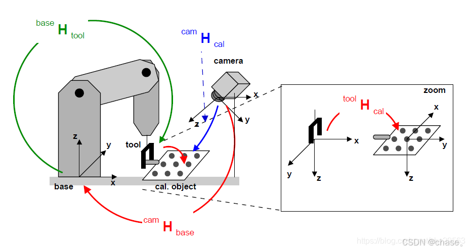
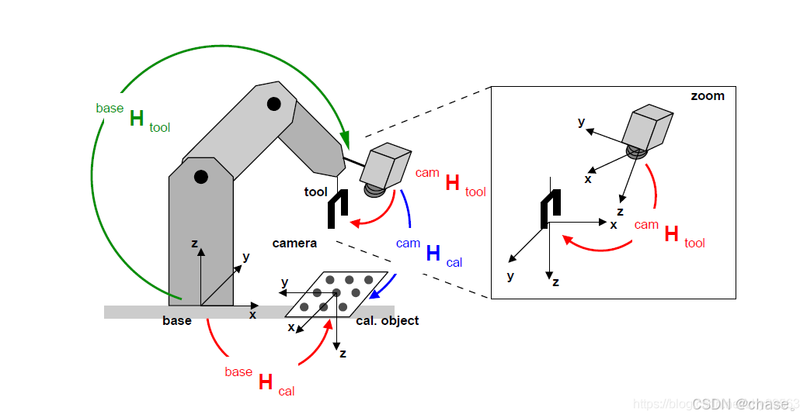

## 手眼标定介绍
在手眼标定中，AX=XB和AX=YB是两种常见的数学模型，用于描述相机和机械臂之间的关系。
手眼标定中的两种情况：眼在手上（Eye-in-Hand）和眼在手外（Eye-to-Hand）
- 求解略有不同，但基本原理相似。

### 眼在手外（Eye-to-Hand）

|$H_{\text{cam}}^{\text{base}}$= $H_{\text{tool}}^{\text{base}}$* $H_{\text{cal}}^{\text{tool}}$* $H_{\text{cam}}^{\text{cal}}$|
|--|

在这种配置中，相机固定在工作空间的某个位置，观察整个机械臂的运动。此时，变换矩阵X表示相机相对于机械臂基座的固定变换。
这时候，我们让机械臂两个位置，保证这两个位置都能使得camera看到标定板
假设A=$H_{\text{tool}}^{\text{base}}$，B=$H_{\text{cal}}^{\text{tool}}$, C=$H_{\text{cam}}^{\text{cal}}$
那么两个位置的等式如下：
|$A_{\text{1}}$ * $B$ * $C_{\text{1}}$ = $A_{\text{2}}$ * $B$ * $C_{\text{2}}$ |
|--|

等式转换
|$A_{\text{2}}^{\text{-1}}$ * $A_{\text{1}}$ * $B$  =  $B$ * $C_{\text{2}}$ * $C_{\text{2}}^{\text{-1}}$|
|--|

此时就能获得关于AX=XB问题：
#### AXXB 模型
- **A**：表示机械臂在两个不同位置之间的变换矩阵。
- **X**：表示相机相对于机械臂末端的固定变换矩阵（手眼变换矩阵）。
- **B**：表示标定板在两个不同位置之间的变换矩阵。

这个模型的目标是同时求解变换矩阵X和Y，使得在不同位置下的变换关系成立。
### 眼在手上（Eye-in-Hand）

公式如下
|  $H_{\text{tool}}^{\text{cam}}$= $H_{\text{tool}}^{\text{base}}$* $H_{\text{base}}^{\text{cal}}$* $H_{\text{cal}}^{\text{cam}}$|
|--|

在这种配置中，相机安装在机械臂的末端执行器上。此时，变换矩阵X表示相机相对于机械臂末端的固定变换。

这时候，我们让机械臂两个位置，保证这两个位置都能使得camera看到标定板
假设A=$H_{\text{tool}}^{\text{base}}$，B=$H_{\text{base}}^{\text{cal}}$, C=$H_{\text{cal}}^{\text{cam}}$
那么两个位置的等式如下：
|$A_{\text{1}}$ * $B$ * $C_{\text{1}}$ = $A_{\text{2}}$ * $B$ * $C_{\text{2}}$ |
|--|

等式转换
|$A_{\text{2}}^{\text{-1}}$ * $A_{\text{1}}$ * $B$  =  $B$ * $C_{\text{2}}$ * $C_{\text{2}}^{\text{-1}}$|
|--|

此时又能获得关于AX=XB问题：

#### AX=XB 模型
- **A**：表示机械臂在两个不同位置之间的变换矩阵。
- **X**：表示相机相对于机械臂末端的固定变换矩阵（手眼变换矩阵）。
- **B**：表示相机在两个不同位置之间的变换矩阵。

这个模型的目标是求解变换矩阵X，使得在不同位置下的变换关系成立。

### AX = XB问题的求解
- Y. Shiu, S. Ahmad Calibration of Wrist-Mounted Robotic Sensors by Solving Homogeneous Transform Equations of the Form AX = XB. In IEEE Transactions on Robotics and Automation, 5(1):16-29, 1989.
- R. Tsai, R. Lenz A New Technique for Fully Autonomous and Efficient 3D Robotics Hand/Eye Calibration. In IEEE Transactions on Robotics and Automation, 5(3):345-358, 1989.
5
- Horaud, Radu, and Fadi Dornaika. "Hand-eye calibration." The international journal of robotics research 14.3 (1995): 195-210.
- Daniilidis, Konstantinos. "Hand-eye calibration using dual quaternions." The International Journal of Robotics Research 18.3 (1999): 286-298.

基本 OpenCV 或者 Matlab 都是采用了张老师的方法：
- Zhang, Zhengyou. "A flexible new technique for camera calibration." IEEE Transactions on pattern analysis and machine intelligence 22.11 (2000): 1330-1334.

#### AX=YB 模型
此外，还有AX=YB模型，这种情况会通过迭代优化的方式来求解。
这个模型表示不同位置下，机器人末端执行器和相机之间的变换关系：
- **A**：表示机器人末端执行器的变换矩阵。
- **X**：表示相机坐标系到机器人末端执行器坐标系的变换矩阵（手眼变换矩阵）。
- **Y**：表示相机坐标系到机器人基座坐标系的变换矩阵。
- **B**：表示相机的变换矩阵。

通过求解这个方程，可以得到 X 和 Y 矩阵，从而确定相机相对于机器人末端执行器和机器人基座的变换关系。
