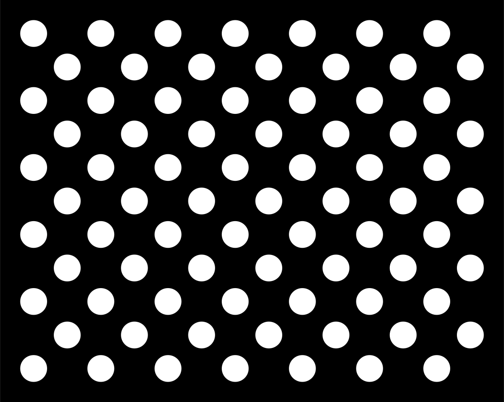

## 非对称圆点阵解决什么问题

非对称圆标定板通过错位排列的圆点，为相机内参标定或位姿估计提供有序的图像点。它依靠 **整块点阵的几何布局** 建立对应关系，不是给每个圆嵌入独立 ID 的编码标签。



完整点阵的布局有助于确定顺序，但仍需检查所用板型、观测方向和检测结果，不能假设任意局部裁剪都能唯一识别。它是否适合手眼标定还取决于机械臂运动的可观测性，而不只取决于轴数。

## OpenCV 最小检测示例

以下示例假设黑圆白底的 4 列、11 行错位板，图像文件为 `board.png`。尺寸必须按实物修改；`spacing` 是坐标生成公式中的基本间距，示例中同一行相邻圆心距离为 `2 * spacing`。

```python
import cv2
import numpy as np

pattern_size = (4, 11)  # 每行圆点数、行数，不是图像像素
spacing = 0.01         # 米，按实物测量
image = cv2.imread("board.png")
if image is None:
    raise FileNotFoundError("board.png")

gray = cv2.cvtColor(image, cv2.COLOR_BGR2GRAY)
found, centers = cv2.findCirclesGrid(
    gray, pattern_size, flags=cv2.CALIB_CB_ASYMMETRIC_GRID
)
if not found:
    raise RuntimeError("未找到完整点阵：检查板型、圆点大小、光照和边界")

cols, rows = pattern_size
object_points = np.array(
    [[(2 * col + row % 2) * spacing, row * spacing, 0.0]
     for row in range(rows) for col in range(cols)],
    dtype=np.float32,
)
assert len(centers) == len(object_points)
cv2.drawChessboardCorners(image, pattern_size, centers, found)
if not cv2.imwrite("board-detected.png", image):
    raise OSError("无法保存检测结果")
```

先查看检测图，确认第一个点、行方向和物体点顺序与实际板型相符，再收集多视角观测传给 `calibrateCamera`。已知内参和畸变后，才能用同一组 3D–2D 对应点做 `solvePnP`。

## 精度与失败定位

- 检测失败：检查白边、完整可见性、圆点极性、曝光和 blob 检测器的面积阈值；默认检测器未必适合每个分辨率。
- 残差偏大：检查打印缩放、板面平整度和实测间距，避免把毫米误作米。
- 斜视误差：透视下拟合椭圆的几何中心不必等于真实圆心的投影，高精度应用需评估这种系统偏差。
- 标定不稳定：让板覆盖不同图像区域、距离和倾角；重复几乎相同的正视图不能充分约束参数。

保留真实板图和检测截图比添加装饰性生成图更有诊断价值。

## 参考

[OpenCV 相机标定与圆点阵检测 API](https://docs.opencv.org/4.x/d9/d0c/group__calib3d.html)


## 阅读自测与验收

- 按 patternSize 的列、行顺序逐项打印 objectPoints，检查单位、交错行偏移和图像检测顺序是否一致。
- 留出未参与求解的图像检查重投影误差；仅增加重复视角，或把完整网格检测误当作单圆 ID，都不能提升几何约束质量。
