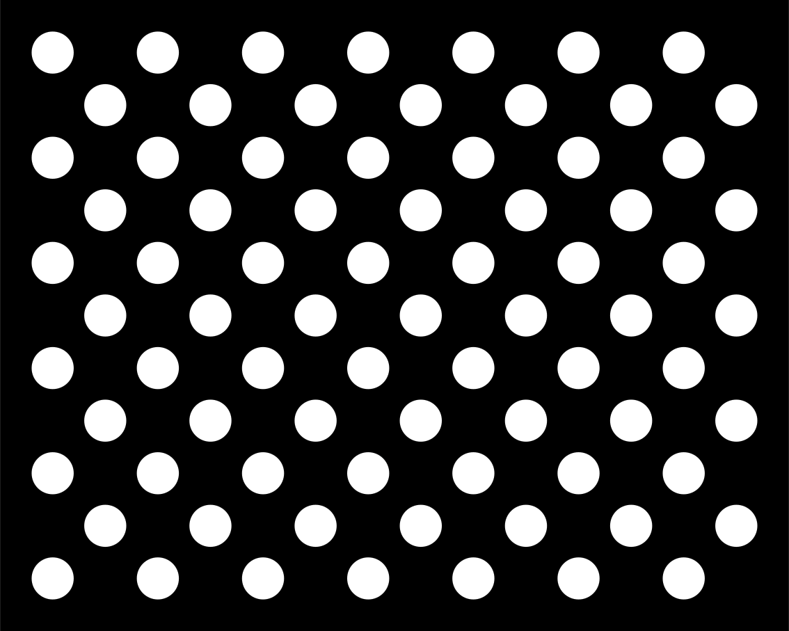

## 非对称圆点阵解决什么问题

非对称圆标定板通过错位排列的圆点，为相机内参标定或位姿估计提供有序的图像点。它依靠 **整块点阵的几何布局** 建立对应关系，不是给每个圆嵌入独立 ID 的编码标签。



完整点阵的布局有助于确定顺序，但仍需检查所用板型、观测方向和检测结果，不能假设任意局部裁剪都能唯一识别。它是否适合手眼标定还取决于机械臂运动的可观测性，而不只取决于轴数。

## OpenCV 最小检测示例

以下示例假设黑圆白底的 4 列、11 行错位板，图像文件为 `board.png`。尺寸必须按实物修改；`spacing` 是坐标生成公式中的基本间距，示例中同一行相邻圆心距离为 `2 * spacing`。

```python
import cv2
import numpy as np

pattern_size = (4, 11)  # 每行圆点数、行数，不是图像像素
spacing = 0.01         # 米，按实物测量
image = cv2.imread("board.png")
if image is None:
    raise FileNotFoundError("board.png")

gray = cv2.cvtColor(image, cv2.COLOR_BGR2GRAY)
found, centers = cv2.findCirclesGrid(
    gray, pattern_size, flags=cv2.CALIB_CB_ASYMMETRIC_GRID
)
if not found:
    raise RuntimeError("未找到完整点阵：检查板型、圆点大小、光照和边界")

cols, rows = pattern_size
object_points = np.array(
    [[(2 * col + row % 2) * spacing, row * spacing, 0.0]
     for row in range(rows) for col in range(cols)],
    dtype=np.float32,
)
assert len(centers) == len(object_points)
cv2.drawChessboardCorners(image, pattern_size, centers, found)
if not cv2.imwrite("board-detected.png", image):
    raise OSError("无法保存检测结果")
```

先查看检测图，确认第一个点、行方向和物体点顺序与实际板型相符，再收集多视角观测传给 `calibrateCamera`。已知内参和畸变后，才能用同一组 3D–2D 对应点做 `solvePnP`。

## 精度与失败定位

- 检测失败：检查白边、完整可见性、圆点极性、曝光和 blob 检测器的面积阈值；默认检测器未必适合每个分辨率。
- 残差偏大：检查打印缩放、板面平整度和实测间距，避免把毫米误作米。
- 斜视误差：透视下拟合椭圆的几何中心不必等于真实圆心的投影，高精度应用需评估这种系统偏差。
- 标定不稳定：让板覆盖不同图像区域、距离和倾角；重复几乎相同的正视图不能充分约束参数。

### 调整 blob 检测器时，先把面积换算成像素

`findCirclesGrid` 默认的 blob 参数未必适合当前图像。下面的代码替换最小示例中的检测调用，适用于半径约 6–18 像素的黑圆候选；面积范围留有余量，具体值应按实际图像调整。

```python
params = cv2.SimpleBlobDetector_Params()
params.filterByColor = True
params.blobColor = 0                   # 黑圆；白圆需改为 255 并检查背景
params.filterByArea = True
params.minArea = 80                    # 像素面积，不是毫米或圆的直径
params.maxArea = 1400
params.filterByCircularity = False     # 斜视会拉长圆的投影
params.filterByConvexity = False
params.filterByInertia = False
detector = cv2.SimpleBlobDetector_create(params)
found, centers = cv2.findCirclesGrid(
    gray, pattern_size,
    flags=cv2.CALIB_CB_ASYMMETRIC_GRID,
    blobDetector=detector,
)
```

关闭形状筛选能保留斜视椭圆，也会放进更多背景候选，需结合完整点阵检查评估误检。分辨率缩小一半，直径也约缩小一半，面积约变为四分之一。不要原样搬用另一台相机的面积阈值。

若完整点阵透视明显，可尝试额外的 `CALIB_CB_CLUSTERING` 标志。按照 [OpenCV 的接口说明](https://docs.opencv.org/4.13.0/d9/d0c/group__calib3d.html)，该选项在透视变形下可能更稳，但对背景杂乱更敏感。它不是“缺几个点也能自动补齐”的开关；只有 `found` 为真并核对点数与顺序后，才向标定函数提交这一帧。

## 不接相机，先检查点序与单位

[下载合成点阵检查脚本](circle_grid_smoke.py)，在安装 NumPy 与 OpenCV 的环境中执行：

```bash
python circle_grid_smoke.py --output-dir circle-grid-check
```

脚本生成黑圆白底图像，检测 44 个点，逐项比较检测坐标与已知像素坐标，再验证物体点的同排间距为 0.02 m、相邻排纵向间距为 0.01 m。它会写出 `board.png` 与带编号的 `board-detected.png`，不需要桌面窗口。

<figure class="article-figure">
  
  <figcaption><span class="article-figure__number">图 1</span><span class="article-figure__text">OpenCV 4.13 对脚本生成点阵的检测结果。图中编号用于核对顺序；真实打印板仍需独立确认原点与朝向。</span></figcaption>
</figure>

这张合成图没有透视、畸变和成像噪声，检测误差接近零只证明软件流程和坐标约定一致。真实验收应另采图像：先固定内参，再计算每张图的重投影残差，并分别报告像素误差与机器人坐标系中的长度误差。

对于每点二维残差 $e_i$，每点 RMS 定义为 $\sqrt{\sum_i\|e_i\|^2/N}$。若把全部 $2N$ 个坐标分量直接做 `sqrt(mean(error**2))`，结果会比这个定义小 $\sqrt2$ 倍；比较工具输出时要先核对分母。低重投影误差也无法识别“整块板尺寸统一错了十倍”这类尺度错误。

## 参考

[OpenCV 相机标定与圆点阵检测 API](https://docs.opencv.org/4.x/d9/d0c/group__calib3d.html)


## 阅读自测与验收

- 按 patternSize 的列、行顺序逐项打印 objectPoints，检查单位、交错行偏移和图像检测顺序是否一致。
- 留出未参与求解的图像检查重投影误差；仅增加重复视角，或把完整网格检测误当作单圆 ID，都不能提升几何约束质量。
