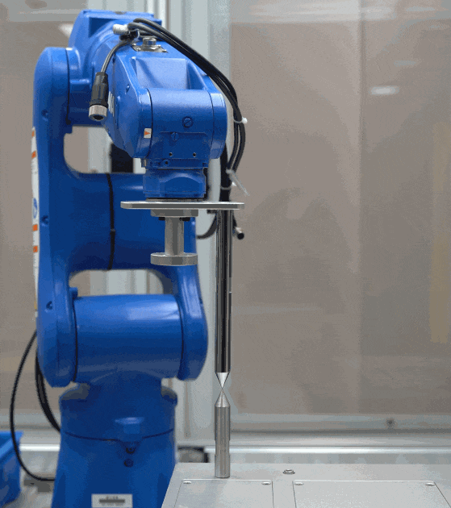

## 零位标定能修正什么

关节零位偏置使编码器读数与模型中的关节角不一致。本文采用约定 $q_{\mathrm{model}}=q_{\mathrm{encoder}}+\phi$，估计偏置 $\phi$；写入控制器前必须核对厂商的符号、单位和补偿位置，避免软件和控制器重复补偿。

零位标定不能代替连杆几何、基座、工具或相机外参标定。模型误差也不能全部归因于编码器零点。


## 两种观测，不能混用

设 $p(q)$ 为同一基坐标系下的 TCP 位置，$J_p(q)\in\mathbb R^{3\times m}$ 为位置对关节角的 Jacobian。小偏置的一阶模型为：

$$
p(q_i+\phi)\approx p(q_i)+J_p(q_i)\phi.
$$

### 已知每次测量的 TCP 位置

若外部测量系统给出 $p_i^{\mathrm{meas}}$，则堆叠：

$$
Y=\begin{bmatrix}p_1^{\mathrm{meas}}-p(q_1)\\ \vdots\\p_n^{\mathrm{meas}}-p(q_n)\end{bmatrix},
\qquad
B=\begin{bmatrix}J_p(q_1)\\ \vdots\\J_p(q_n)\end{bmatrix},
\qquad B\phi\approx Y.
$$

测量值与 FK 必须使用同一坐标系、同一 TCP 定义及米/弧度等一致单位。

### 只知道多次触碰的是同一个未知点

固定点 $P$ 未知时，不能凭空填入 `p_real`。可以通过与参考姿态作差消去 $P$：

$$
[J_p(q_i)-J_p(q_1)]\phi
\approx p(q_1)-p(q_i),\qquad i=2,\dots,n.
$$

另一种方式是联合估计 $\phi$ 和 $P$，构造 $[J_p(q_i),-I][\phi^\top,P^\top]^\top\approx-p(q_i)$。两种方式都需分析秩；差分会引入相关噪声，精密估计应使用合适的加权最小二乘。



## 用 SVD/QR 求解，不显式求逆

求解 $\min_\phi\|B\phi-Y\|_2^2$。不要把正规方程的显式逆作为默认实现，它会放大病态问题。以下是验证求解过程的合成数据，不是实测精度报告：

```python
import numpy as np


def fk_and_jacobian(q):
    q = np.asarray(q, dtype=float)
    a, b = q[:, 0], q[:, 0] + q[:, 1]
    l1, l2 = 0.8, 0.6
    p = np.column_stack((l1 * np.cos(a) + l2 * np.cos(b),
                         l1 * np.sin(a) + l2 * np.sin(b)))
    first = np.column_stack((-l1 * np.sin(a) - l2 * np.sin(b),
                              l1 * np.cos(a) + l2 * np.cos(b)))
    second = np.column_stack((-l2 * np.sin(b), l2 * np.cos(b)))
    return p, np.stack((first, second), axis=-1)  # [N,2], [N,2,2]


rng = np.random.default_rng(42)
q_encoder = rng.uniform([-1.2, 0.3], [1.2, 2.3], size=(30, 2))
phi_true = np.array([0.018, -0.026])  # rad；仅用于合成数据
p_measured, _ = fk_and_jacobian(q_encoder + phi_true)
train = 20
phi = np.zeros(2)
for iteration in range(20):
    predicted, jacobian = fk_and_jacobian(q_encoder[:train] + phi)
    B = jacobian.reshape(-1, 2)
    Y = (p_measured[:train] - predicted).ravel()
    delta, _, rank, singular_values = np.linalg.lstsq(B, Y, rcond=None)
    if rank < B.shape[1]:
        raise ValueError("Unidentifiable offsets; change observations or model")
    phi += delta
    if np.linalg.norm(delta) < 1e-12:
        break
else:
    raise RuntimeError("Calibration iteration budget exceeded")

np.testing.assert_allclose(phi, phi_true, atol=1e-10)
validation, _ = fk_and_jacobian(q_encoder[train:] + phi)
errors = np.linalg.norm(validation - p_measured[train:], axis=1)
assert errors.max() < 1e-10
print("offset [rad]:", phi)
print("singular values:", singular_values)
print("held-out position error [m]:", errors.max())
```

上例是两连杆平面模型的已知位置观测，用 20 组姿态估计两个零偏，再用另外 10 组验证；每轮在更新后的 $q+\phi$ 处重新计算 FK 和 Jacobian。真实模型偏差较大或有噪声时，还需步长控制、鲁棒性与参数尺度检查，不能把无噪声示例的近机器精度容差直接作为实机门槛。

## 采样数量不等于可观测性

“采 20 个点”只是经验选择，不是保证。已知位置时，$3n\ge m$ 只是必要的维度条件，真正需要的是 $B$ 对待估参数满列秩，且最小奇异值不过小。未知点或附加工具参数会改变未知量数量。

尽量覆盖不同肘部形态、关节组合和末端姿态，避免只在相邻姿态重复采集。保留独立验证姿态，报告标定前后的均方根误差、最大误差及重复测量误差；训练残差下降不代表工作空间整体精度提高。

## 上机前检查

- 离线验证偏置方向、角度单位、关节顺序和 TCP 定义。
- 检查偏置是否合理，若异常大，先检查机械装配、模型和测量坐标变换。
- 先在仿真或安全速度下验证关节限位、碰撞和急停，不直接将示例数值写入机器人。


## 阅读自测与验收

- 在合成零位偏置上测试恢复误差，并比较已知参考点与未知支点两种模型；未知点坐标也要进入待估计变量或消元过程。
- 检查奇异值、验证位姿残差和参数物理范围；只有总残差变小而没有独立验证，不足以说明零位参数可信。
