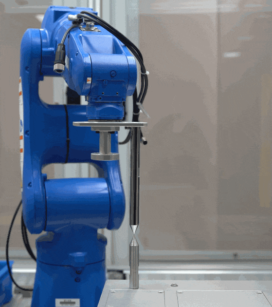

## 1. 零位标定
零位标定是机器人运动学标定中的一个重要步骤，其目的是校正机器人关节的初始位置误差。以下是需要进行零位标定的主要原因：
- **制造误差**
   - 在机器人制造过程中，关节传感器（如编码器）和机械零件的安装可能存在微小的偏差。
   - 这些偏差会导致关节的零位（初始位置）与理论值不一致，从而影响运动学计算的准确性。

- **装配误差**
   - 机器人在组装过程中，关节和连杆之间的对齐可能存在误差。
   - 这些误差会导致正运动学和逆运动学计算的结果与实际位置不符。

- **传感器误差**
   - 编码器或其他位置传感器可能存在零点漂移或校准误差。
   - 零位标定可以校正这些传感器的初始偏差。

- **提高运动精度**
   - 零位偏差会累积到机器人运动的末端位置，导致末端执行器无法准确到达目标位置。
   - 通过零位标定，可以显著提高机器人末端的定位精度。

- **确保一致性**
   - 在多次启动或不同环境下，零位可能会发生轻微变化。
   - 零位标定可以确保机器人在不同时间和环境下的运动一致性。

-  **运动学模型的准确性**
   - 机器人控制依赖于精确的运动学模型（正运动学和逆运动学）。
   - 零位标定是运动学模型校正的重要部分，确保理论模型与实际机器人一致。

-  **避免累积误差**
   - 零位偏差会导致关节角度的计算误差，这些误差在多关节运动中会累积，影响整体运动精度。
   - 零位标定可以有效减少这种累积误差。


## 2. 零位标定思路


假设有一个针尖基准点，令机器人末端对准针尖基准点，则实际末端位置可以表示为：

$$
\overrightarrow{p}^{real} = \overrightarrow{p}^{fk} + J \cdot \overrightarrow{\phi}
$$

其中：
- **$\overrightarrow{p}^{real}$** 是实际末端位置。
- **$\overrightarrow{p}^{fk}$** 是通过正运动学计算得到的理论末端位置。
- **$J$** 是雅可比矩阵，表示关节角度对末端位置的偏导数。
- **$\overrightarrow{\phi}$** 是零位偏差向量。

通过改变机器人姿态，记录两组不同的末端位置和关节角度，得到以下关系：

$$
\overrightarrow{p}^{fk}_1 + J_1 \cdot \overrightarrow{\phi} = \overrightarrow{p}^{fk}_2 + J_2 \cdot \overrightarrow{\phi}
$$

目标是求解零位偏差 **$\overrightarrow{\phi}$**，使上述等式成立。

---

## 3. 零位偏差计算方法及算法流程

### 3.1 数据采集
- 选取多个测量点（例如 $n$ 个）。
- 记录每个测量点的关节角度和实际末端位置。



### 3.2 误差模型
对于每个测量点，误差可以表示为：

$$
\Delta \overrightarrow{p}_i = \overrightarrow{p}^{real}_i - \overrightarrow{p}^{fk}_i = J_i \cdot \overrightarrow{\phi}
$$

将所有测量点的误差组合成矩阵形式：

$$
Y = B \cdot \overrightarrow{\phi}
$$

其中：
- **$Y$** 是误差向量，$Y = [\Delta \overrightarrow{p}_1, \Delta \overrightarrow{p}_2, \dots, \Delta \overrightarrow{p}_n]^T$。
- **$B$** 是雅可比矩阵的组合，$B = [J_1, J_2, \dots, J_n]^T$。

### 3.3 最小二乘法求解
通过最小化误差的平方和，求解零位偏差 **$\overrightarrow{\phi}$**：

$$
\overrightarrow{\phi} = (B^T \cdot B)^{-1} \cdot B^T \cdot Y
$$

---

## 4. Python 实现代码

以下是一个简单的 Python 实现：

```python
import numpy as np
np.set_printoptions(5, suppress=True)

# 示例数据：雅可比矩阵 B 和误差向量 Y
B = np.array([[1, 2], [3, 4], [5, 6]])  # 雅可比矩阵 (3x2)
Y = np.array([1, 2, 3])                 # 误差向量 (3x1)

# 计算零位偏差 φ
BT = B.T                                # B 的转置
phi = np.linalg.inv(BT @ B) @ BT @ Y    # 最小二乘法公式

print("零位偏差 φ:", phi)
```
```python
零位偏差 φ: [0.  0.5]
```

---

## 5. 注意事项

1. **矩阵维度匹配**：确保矩阵 $B$ 的行数与误差向量 $Y$ 的长度一致。
2. **矩阵可逆性**：矩阵 $(B^T \cdot B)$ 必须是可逆的。如果不可逆，可以使用伪逆方法：
```python
   phi = np.linalg.pinv(B) @ Y
   ```
3. **数据精度**：测量数据应尽量精确，以减少误差。

通过上述公式和代码，可以使用最小二乘法计算零位偏差，完成机器人零位标定。

## 6. 问题
### 6.1 为什么需要20个点?
在机器人零位标定中，选择多个测量点（例如 20 个点）是为了提高标定的精度和鲁棒性。以下是原因：

-  **减少测量误差的影响**：
   - 单个点的测量可能存在误差（例如传感器噪声、环境干扰等）。
   - 使用多个点可以通过最小二乘法将误差分散，从而得到更准确的零位偏差。

-  **提高解的稳定性**：
   - 如果测量点过少，矩阵 $B^T \cdot B$ 可能是奇异的（不可逆），导致无法求解。
   - 增加测量点数量可以确保矩阵 $B^T \cdot B$ 的条件数更好，从而提高解的稳定性。

- **覆盖更多的姿态空间**：
   - 通过选择不同的姿态（关节角度组合），可以覆盖更大的工作空间。
   - 这有助于捕捉零位偏差在不同姿态下的影响，避免局部解。

- **减少过拟合风险**：
   - 如果测量点过少，可能会导致模型过拟合，无法准确反映实际的零位偏差。
   - 增加点数可以让模型更具泛化能力。

- **满足最小二乘法的要求**：
   - 最小二乘法需要测量点的数量大于未知参数的数量（即 $n > m$，其中 $n$ 是测量点数，$m$ 是零位偏差的维度）。
   - 选择 20 个点通常是为了确保足够的数据冗余。

总结来说，选择 20 个点是为了在数据冗余、解的稳定性和精度之间取得平衡，同时确保标定结果的可靠性。