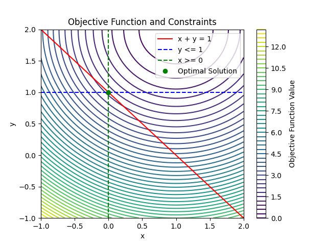
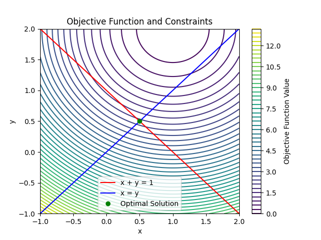

- [CasADi 官方文档](https://web.casadi.org/docs/)
- [CasADi GitHub 仓库](https://github.com/casadi/casadi)
## 1. 概述

在**CasADi**中，你可以通过设置变量的上下界来约束优化变量的取值范围。你可以在创建求解器时通过`lbx`和`ubx`参数来设置变量的下界和上界。以下是一个示例，展示如何在CasADi中添加变量的上下界。

CasADi 是一个用于数值优化和自动微分的开源软件库，特别适用于动态系统的建模和控制。以下是 CasADi 的一些主要特点和用途：

### 主要特点

1. **符号计算**：
   - CasADi 提供了符号计算功能，可以方便地定义和操作符号表达式。
   - 支持自动微分，可以高效地计算函数的导数。

2. **数值优化**：
   - CasADi 支持非线性规划（NLP）问题的求解。
   - 可以与多种优化求解器（如 IPOPT、SNOPT 等）集成。

3. **动态系统建模**：
   - CasADi 可以用于建模和仿真动态系统，特别适合用于控制和优化问题。
   - 支持微分代数方程（DAE）和常微分方程（ODE）的求解。

4. **高效计算**：
   - CasADi 使用稀疏矩阵和高效的数值算法，能够处理大规模优化问题。
   - 提供了接口，可以与 C、C++、Python 和 MATLAB 等多种编程语言集成。

### 主要用途

1. **优化控制**：
   - CasADi 常用于优化控制问题，如模型预测控制（MPC）和最优控制问题（OCP）。

2. **参数估计**：
   - 可以用于系统参数的估计和校准，通过最小化误差来找到最佳参数值。

3. **机器学习**：
   - 在机器学习中，CasADi 可以用于训练神经网络和其他模型，通过优化损失函数来调整模型参数。

4. **工程应用**：
   - 广泛应用于航空航天、机器人、化工过程等领域的优化和控制问题。

## 2. 上下界约束
### 示例代码
使用Matplotlib库来绘制目标函数和约束条件的图形，并标注出最优解的位置。以下是完整的代码，包括绘图部分：
```python
import casadi as ca
import matplotlib.pyplot as plt
import numpy as np

# 定义符号变量
x = ca.SX.sym('x')
y = ca.SX.sym('y')

# 定义目标函数
f = (x - 1)**2 + (y - 2)**2

# 定义约束
g = x + y - 1

# 创建优化问题
nlp = {'x': ca.vertcat(x, y), 'f': f, 'g': g}

# 创建求解器
solver = ca.nlpsol('solver', 'ipopt', nlp)

# 设置初始猜测值
x0 = [0, 0]

# 设置变量的上下界
lbx = [0, -ca.inf]  # x >= 0, y 无下界
ubx = [ca.inf, 1]   # x 无上界, y <= 1

# 设置约束的上下界
lbg = 0
ubg = 0

# 求解优化问题
sol = solver(x0=x0, lbx=lbx, ubx=ubx, lbg=lbg, ubg=ubg)

# 获取最优解
optimal_x = sol['x']
optimal_x_val = optimal_x.full().flatten()

print("Optimal solution:", optimal_x_val)

# 绘制目标函数和约束条件
x_vals = np.linspace(-1, 2, 400)
y_vals = np.linspace(-1, 2, 400)
X, Y = np.meshgrid(x_vals, y_vals)
Z = (X - 1)**2 + (Y - 2)**2

plt.contour(X, Y, Z, levels=50, cmap='viridis')
plt.plot(x_vals, 1 - x_vals, 'r-', label='x + y = 1')
plt.axhline(y=1, color='b', linestyle='--', label='y <= 1')
plt.axvline(x=0, color='g', linestyle='--', label='x >= 0')
plt.plot(optimal_x_val[0], optimal_x_val[1], 'go', label='Optimal Solution')

plt.xlabel('x')
plt.ylabel('y')
plt.title('Objective Function and Constraints')
plt.legend()
plt.colorbar(label='Objective Function Value')
plt.xlim([-1, 2])
plt.ylim([-1, 2])
plt.show()
```

### 代码解释

1. **导入必要的库**：

```python
   import casadi as ca
   import matplotlib.pyplot as plt
   import numpy as np
```

2. **定义符号变量、目标函数和约束条件**（与之前相同）。

3. **创建优化问题和求解器**（与之前相同）。

4. **设置初始猜测值、变量的上下界和约束的上下界**（与之前相同）。

5. **求解优化问题并获取最优解**：
```python
   sol = solver(x0=x0, lbx=lbx, ubx=ubx, lbg=lbg, ubg=ubg)
   optimal_x = sol['x']
   optimal_x_val = optimal_x.full().flatten()
   print("Optimal solution:", optimal_x_val)
```

6. **绘制目标函数和约束条件**：
```python
   x_vals = np.linspace(-1, 2, 400)
   y_vals = np.linspace(-1, 2, 400)
   X, Y = np.meshgrid(x_vals, y_vals)
   Z = (X - 1)**2 + (Y - 2)**2

   plt.contour(X, Y, Z, levels=50, cmap='viridis')
   plt.plot(x_vals, 1 - x_vals, 'r-', label='x + y = 1')
   plt.axhline(y=1, color='b', linestyle='--', label='y <= 1')
   plt.axvline(x=0, color='g', linestyle='--', label='x >= 0')
   plt.plot(optimal_x_val[0], optimal_x_val[1], 'go', label='Optimal Solution')

   plt.xlabel('x')
   plt.ylabel('y')
   plt.title('Objective Function and Constraints')
   plt.legend()
   plt.colorbar(label='Objective Function Value')
   plt.xlim([-1, 2])
   plt.ylim([-1, 2])
   plt.show()
```


通过这段代码，你可以在图中看到目标函数的等高线、约束条件的直线以及最优解的位置, 在CasADi中为优化变量添加上下界约束。。


## 3. 等式约束
在CasADi中，你可以通过在创建优化问题时定义等式约束来添加约束条件。等式约束可以通过将约束表达式添加到`g`中，并将相应的上下界设置为相同的值来实现。以下是一个示例，展示如何在CasADi中添加等式约束。
### 示例代码
使用Matplotlib库来绘制目标函数和约束条件的图形，并标注出最优解的位置。以下是完整的代码，包括绘图部分：
```python
import casadi as ca
import matplotlib.pyplot as plt
import numpy as np

# 定义符号变量
x = ca.SX.sym('x')
y = ca.SX.sym('y')

# 定义目标函数
f = (x - 1)**2 + (y - 2)**2

# 定义等式约束
g1 = x + y - 1  # 等式约束1: x + y = 1
g2 = x - y      # 等式约束2: x = y

# 创建优化问题
nlp = {'x': ca.vertcat(x, y), 'f': f, 'g': ca.vertcat(g1, g2)}

# 创建求解器
solver = ca.nlpsol('solver', 'ipopt', nlp)

# 设置初始猜测值
x0 = [0, 0]

# 设置变量的上下界
lbx = [-ca.inf, -ca.inf]  # 无下界
ubx = [ca.inf, ca.inf]    # 无上界

# 设置约束的上下界（等式约束）
lbg = [0, 0]  # g1 = 0, g2 = 0
ubg = [0, 0]  # g1 = 0, g2 = 0

# 求解优化问题
sol = solver(x0=x0, lbx=lbx, ubx=ubx, lbg=lbg, ubg=ubg)

# 获取最优解
optimal_x = sol['x']
optimal_x_val = optimal_x.full().flatten()

print("Optimal solution:", optimal_x_val)

# 绘制目标函数和约束条件
x_vals = np.linspace(-1, 2, 400)
y_vals = np.linspace(-1, 2, 400)
X, Y = np.meshgrid(x_vals, y_vals)
Z = (X - 1)**2 + (Y - 2)**2

plt.contour(X, Y, Z, levels=50, cmap='viridis')
plt.plot(x_vals, 1 - x_vals, 'r-', label='x + y = 1')
plt.plot(x_vals, x_vals, 'b-', label='x = y')
plt.plot(optimal_x_val[0], optimal_x_val[1], 'go', label='Optimal Solution')

plt.xlabel('x')
plt.ylabel('y')
plt.title('Objective Function and Constraints')
plt.legend()
plt.colorbar(label='Objective Function Value')
plt.show()
```

### 代码解释

1. **导入必要的库**：
   ```python
   import casadi as ca
   import matplotlib.pyplot as plt
   import numpy as np
   ```

2. **定义符号变量、目标函数和约束条件**（与之前相同）。

3. **创建优化问题和求解器**（与之前相同）。

4. **设置初始猜测值、变量的上下界和约束的上下界**（与之前相同）。

5. **求解优化问题并获取最优解**：
   ```python
   sol = solver(x0=x0, lbx=lbx, ubx=ubx, lbg=lbg, ubg=ubg)
   optimal_x = sol['x']
   optimal_x_val = optimal_x.full().flatten()
   print("Optimal solution:", optimal_x_val)
   ```

6. **绘制目标函数和约束条件**：
   ```python
   x_vals = np.linspace(-1, 2, 400)
   y_vals = np.linspace(-1, 2, 400)
   X, Y = np.meshgrid(x_vals, y_vals)
   Z = (X - 1)**2 + (Y - 2)**2

   plt.contour(X, Y, Z, levels=50, cmap='viridis')
   plt.plot(x_vals, 1 - x_vals, 'r-', label='x + y = 1')
   plt.plot(x_vals, x_vals, 'b-', label='x = y')
   plt.plot(optimal_x_val[0], optimal_x_val[1], 'go', label='Optimal Solution')

   plt.xlabel('x')
   plt.ylabel('y')
   plt.title('Objective Function and Constraints')
   plt.legend()
   plt.colorbar(label='Objective Function Value')
   plt.show()
   ```


通过这段代码，你可以在图中看到目标函数的等高线、约束条件的直线以及最优解的位置, 在CasADi中为优化问题添加等式约束。
