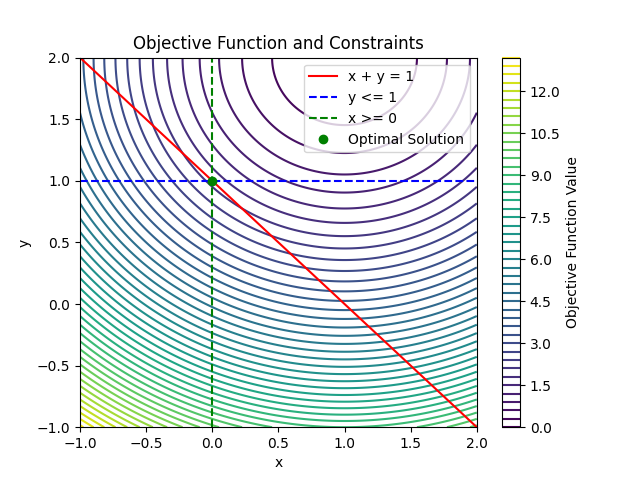
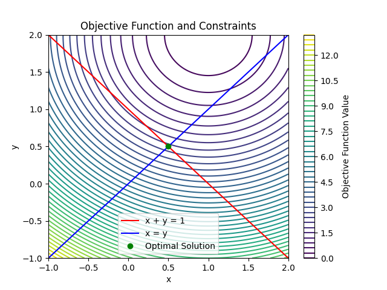

## 1. 先区分建模工具和求解器

CasADi 用符号计算图表达目标、约束及其导数；IPOPT 等求解器负责执行数值优化。自动微分不会把一般非凸问题变成凸问题，也不会让不可行约束自动获得解。

本文先建立变量边界与等式约束，再用能手算的小问题检查残差、乘子和局部最优。安装与符号类型可查 [CasADi 官方文档](https://web.casadi.org/docs/)。

```bash
python -m pip install casadi numpy
```

| 对象 | 含义 | 本例维度 |
| --- | --- | --- |
| `x` | 待求的变量向量 | 2 |
| `f` | 标量目标函数 | 1 |
| `g` | 约束表达式向量 | 1 或 2 |
| `lbx / ubx` | 变量下界 / 上界 | 与 x 一致 |
| `lbg / ubg` | 约束值下界 / 上界 | 与 g 一致 |
| `x0` | 求解器初值，不是最终解 | 与 x 一致 |

`SX` 和 `MX` 用于符号表达，`DM` 用于数值矩阵。不要直接用普通 NumPy 函数处理尚未求值的 CasADi 符号，也不要把有限差分近似与自动微分混为一谈。

## 2. 两个问题的解析预期

共同目标与变量边界：

$$
\min_{x,y}\;(x-1)^2+(y-2)^2,\qquad x\ge0,\quad y\le1.
$$

第一个问题增加 `x+y=1`。代入 `y=1-x` 后，目标是 `2x²+2`，所以最优点为 `(0,1)`，目标值为 `2`。

第二个问题再增加 `x=y`。两个等式共同确定唯一可行点 `(0.5,0.5)`，目标值为 `2.5`。这两个问题可用于验证建模代码，但不能据此声称通用非凸 NLP 有全局最优保证。

## 3. 一份可独立运行的代码

保存为 `casadi_bounds.py`。同一函数求解两种约束，分别检查求解状态、边界、约束残差和解析预期。绘图不参与正确性判断。

```python
import casadi as ca
import numpy as np


def solve_example(equal_xy=False):
    z = ca.SX.sym("z", 2)
    x, y = z[0], z[1]
    objective = (x - 1)**2 + (y - 2)**2
    constraints = ca.vertcat(x + y - 1, x - y) if equal_xy else x + y - 1
    problem = {"x": z, "f": objective, "g": constraints}
    solver = ca.nlpsol(
        "two_equalities" if equal_xy else "one_equality",
        "ipopt", problem,
        {"ipopt.print_level": 0, "print_time": False, "ipopt.tol": 1e-10},
    )
    lower = np.array([0.0, -np.inf])
    upper = np.array([np.inf, 1.0])
    count = int(constraints.numel())
    solution = solver(
        x0=[0.25, 0.75],
        lbx=lower, ubx=upper,
        lbg=np.zeros(count), ubg=np.zeros(count),
    )
    status = solver.stats()
    if not status.get("success", False):
        raise RuntimeError(status.get("return_status", "unknown solver failure"))

    values = np.asarray(solution["x"]).ravel()
    residual = np.asarray(solution["g"]).ravel()
    if not np.isfinite(values).all() or not np.isfinite(residual).all():
        raise RuntimeError("nonfinite solver output")
    tolerance = 1e-7
    if np.any(values < lower - tolerance) or np.any(values > upper + tolerance):
        raise RuntimeError("variable bound violated")
    if np.max(np.abs(residual)) > tolerance:
        raise RuntimeError("equality constraint violated")

    expected = [0.5, 0.5] if equal_xy else [0.0, 1.0]
    # 边界解会受内点法容差影响，因此比较数值误差，而不是浮点严格相等。
    np.testing.assert_allclose(values, expected, atol=3e-4, rtol=0)
    expected_cost = 2.5 if equal_xy else 2.0
    np.testing.assert_allclose(float(solution["f"]), expected_cost, atol=1e-6)
    return values, float(solution["f"]), status["return_status"]


if __name__ == "__main__":
    print("CasADi:", ca.__version__)
    for equal_xy in (False, True):
        print(equal_xy, solve_example(equal_xy))
```

```bash
python casadi_bounds.py
```

第一个解的 x 可能是很小的正数，而不是打印为精确的零。接受标准应来自问题尺度和容差，不应依靠四舍五入后的输出是否“看起来一样”。

## 4. 如何读图





图中直线表示等式或不等式边界，不代表整张平面都是可行域；需要同时满足全部条件。以上是保留的历史绘图，不是当前精简代码的自动输出。

若需要重画，单独安装 Matplotlib，用网格计算目标的等高线，再绘制约束直线和 `solve_example` 返回的点。不要用“图上有一个点”代替约束验收。

## 5. 修改模型时的排查顺序

1. 检查 `x / g` 的维度与对应上下界，等式必须使用相等的 `lbg / ubg`。
2. 用已知可行点直接计算约束，排除符号、单位和边界写反。
3. 检查初值、变量尺度、求解状态和残差；不可行问题不能只靠增加迭代次数解决。
4. 一般非凸问题需要多初值或更合适的建模策略，成功状态不等于全局最优。
5. 非光滑表达式在切换点需要专门处理，自动微分只对给定计算图按其规则求导。

插件是否可用取决于 CasADi 安装包及平台。遇到 IPOPT 加载失败，记录 CasADi 版本、解释器路径和原始错误；不要随意替换系统共享库。


## 6. 约束最优点，为什么目标梯度不一定为零

无约束内部最优点常用 $\nabla f=0$ 检查；有约束时，目标下降方向可能被可行域挡住。考虑：

$$
\min_x (x-2)^2,\qquad -2\le x\le3,\quad x^2\le1.
$$

可行区间实际是 $[-1,1]$，最优解为 $x=1$，目标值为 1，但目标梯度 $f'(1)=-2$。这并非求解失败：向右走虽然能降低目标，却会违反 $x^2\le1$。

写 $g(x)=x^2$，上界乘子为 $\lambda\ge0$，拉格朗日函数为：

$$
\mathcal L(x,\lambda)=(x-2)^2+\lambda(x^2-1).
$$

在 $x=1,\lambda=1$ 时，$\partial\mathcal L/\partial x=-2+2\lambda=0$。应联合检查：

| 检查 | 本例含义 | 不能用什么代替 |
| --- | --- | --- |
| 原始可行性 | 变量边界满足，$g(x)\le1$ | 目标函数值很低 |
| 驻点条件 | $\nabla f+J_g^\top\lambda_g+\lambda_x\approx0$ | 单看 $\nabla f$ 是否接近零 |
| 对偶符号 | 上界乘子非负、下界乘子非正 | 只看乘子绝对值 |
| 互补条件 | 未激活边界的乘子应接近零；乘子与相应松弛量之积接近零 | 求解器打印了成功 |

CasADi 返回 `lam_g` 和 `lam_x`，分别对应一般约束和变量边界的有符号乘子；等式乘子不受非负限制。这里的目标和约束都是无量纲标量。机器人问题混用 m、rad、N 时，要先按问题尺度定义残差和容差；把所有量直接放进同一个无量纲阈值会掩盖建模错误。[CasADi NLP 接口](https://web.casadi.org/docs/#nonlinear-programming)

### 6.1 一个目标值接近零、却不可行的返回结果

把上例变量下界改成 $x\ge2$，同时仍要求 $x^2\le1$。两者没有交集，增加迭代次数无法使它们同时成立。

[solver_audit.py](solver_audit.py) 在 CasADi 3.7.2 / IPOPT 下将 `error_on_fail=False`，以便检查失败时的返回记录。本例返回 `Infeasible_Problem_Detected`，候选 $x\approx2$，目标值接近零，但约束 $x^2\le1$ 违约约 **3**。拉格朗日驻点残差也可能很小；缺少原始可行性和互补检查时，仍会误收这个候选。

`error_on_fail=False` 只改变错误如何传给调用者，并没有把失败变成可用解。换版本或改变初值后，具体失败状态和候选可能不同；验收依据是状态、有限值和原问题约束，而不是固定某个错误字符串。

### 6.2 两次都成功，仍可能得到不同的局部最小值

再考虑非凸目标：

$$
\min_{-2\le x\le2} (x^2-1)^2+0.2x.
$$

| 初值 | 收敛位置 | 目标值 | 求解状态 |
| --- | ---: | ---: | --- |
| -1.5 | -1.024120 | -0.202440 | `Solve_Succeeded` |
| 1.5 | 0.973994 | 0.197434 | `Solve_Succeeded` |

两个点都满足局部驻点条件，二阶导数也为正，但右侧解的目标更高。本例还可以枚举三次导数方程的全部实根和两个区间端点，独立确认左侧解是该一维区间的全局最小值。一般机器人非凸优化没有这样简单的枚举方法，多初值找到更好候选也不自动构成全局证明。

<figure class="article-figure">

<figcaption><span class="article-figure__number">图 1</span><span class="article-figure__text">曲线来自本节明确给出的标量目标。左图检查可行方向，中图检查约束交集，右图检查非凸目标的多个局部解；三者分别说明不同的验收条件。</span></figcaption>
</figure>

下载脚本后运行：

```bash
python -m pip install "casadi==3.7.2" numpy matplotlib
python -B solver_audit.py --output-dir results
```

程序生成图片和 [完整数值记录](assets/solver-audit-results.json)，逐项检查可行性、驻点、互补条件与解析对照。这些小问题验证建模与求解接口；实机问题仍需按实际单位、约束和控制周期制定验收标准。

## 阅读自测与验收

- 把变量边界和 g 的边界分别打印：第一例只有一个等式，第二例有两个；维度匹配不等于约束含义正确。
- 故意添加互相矛盾的约束，确认程序能报告失败，而不是继续把 sol['x'] 当作可用答案。
