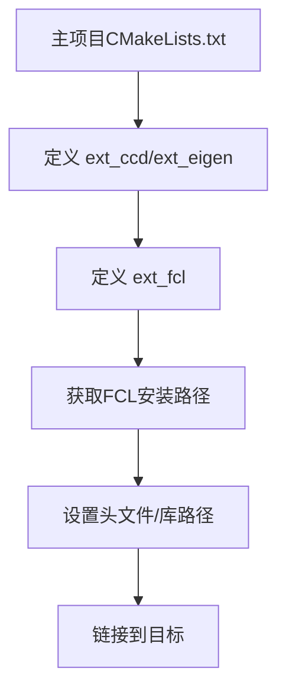

#### **一、基本概念与语法** 
`ExternalProject_Add` 是 CMake 的一个核心命令，用于在构建过程中集成和管理外部项目（如第三方库）。它支持完整的生命周期管理，包括下载、配置、构建、安装和测试。  
**语法**：
```cmake
ExternalProject_Add(<name> [<option>...])
```
- **`<name>`**：自定义的外部项目名称，用于后续引用。
- **`<option>`**：支持 50+ 配置选项，涵盖目录结构、下载方式、构建参数等。

---

#### **二、核心配置选项** 
##### **1. 目录配置**
| 选项              | 描述                                                                 |
|-------------------|----------------------------------------------------------------------|
| `PREFIX <dir>`    | 根目录，所有子目录默认在此路径下生成                                |
| `SOURCE_DIR <dir>`| 源码目录（存放解压后的代码或本地源码路径）                           |
| `BINARY_DIR <dir>`| 构建目录（若未指定，默认为 `<PREFIX>/src/<name>-build`）            |
| `INSTALL_DIR <dir>`| 安装目录（需在配置参数中显式传递给外部项目的 CMake 命令）           |
| `DOWNLOAD_DIR <dir>` | 下载缓存目录（仅用于 URL 下载方式）                               |

##### **2. 下载方式**
- **Git**：
  ```cmake
  GIT_REPOSITORY <url>    # 仓库地址
  GIT_TAG <branch/commit> # 分支/标签/提交哈希（推荐使用 commit 以确保确定性）
  GIT_SHALLOW TRUE        # 浅克隆（仅下载最新提交）
  ```
- **URL**（支持多 URL 轮询）：
  ```cmake
  URL <url1> [<url2>...]
  URL_HASH <algo>=<hash>  # 文件校验（如 MD5/SHA256）
  DOWNLOAD_NO_EXTRACT TRUE # 禁止自动解压
  ```

##### **3. 构建与安装**
```cmake
CONFIGURE_COMMAND <cmd>   # 覆盖默认配置命令（如 `cmake -DCMAKE_INSTALL_PREFIX=...`）
BUILD_COMMAND <cmd>       # 覆盖默认构建命令（如 `make -j4`）
INSTALL_COMMAND <cmd>     # 覆盖默认安装命令
CMAKE_ARGS <args>         # 传递 CMake 参数（如 `-DBUILD_SHARED_LIBS=OFF`）
```

##### **4. 依赖与日志**
```cmake
DEPENDS <targets>         # 指定依赖的其他 CMake 目标
LOG_CONFIGURE 1           # 记录配置阶段日志
LOG_BUILD 1               # 记录构建日志
LOG_INSTALL 1             # 记录安装日志
```

---

#### **三、典型应用示例**
##### **1. 集成 GitHub 库（以 spdlog 为例）**
```cmake
include(ExternalProject)
set(SPDLOG_ROOT ${CMAKE_BINARY_DIR}/thirdparty/spdlog)

ExternalProject_Add(SPDLOG
    PREFIX ${SPDLOG_ROOT}
    GIT_REPOSITORY https://github.com/gabime/spdlog.git
    GIT_TAG v1.11.0
    CMAKE_ARGS -DCMAKE_INSTALL_PREFIX=${SPDLOG_ROOT}
    BUILD_COMMAND make
    INSTALL_COMMAND make install
)

# 链接库与头文件
set(SPDLOG_LIB ${SPDLOG_ROOT}/lib/libspdlog.a)
set(SPDLOG_INCLUDE_DIR ${SPDLOG_ROOT}/include)
target_link_libraries(your_target ${SPDLOG_LIB})
target_include_directories(your_target PRIVATE ${SPDLOG_INCLUDE_DIR})
```

##### **2. 本地源码构建**
```cmake
ExternalProject_Add(LocalProj
    SOURCE_DIR ${CMAKE_CURRENT_SOURCE_DIR}/external/local_proj
    BUILD_IN_SOURCE TRUE    # 在源码目录构建
    CMAKE_ARGS -DOPTION=Value
)
```

##### **3. 跨项目参数传递**
```cmake
ExternalProject_Add(ExternalLib
    ...
    CMAKE_ARGS 
        -DCMAKE_MSVC_RUNTIME_LIBRARY=MultiThreaded
        -DCMAKE_POLICY_DEFAULT_CMP0091=NEW
)
```

---

#### **四、高级用法与调试**
##### **1. 自定义步骤与依赖**
```cmake
# 定义预处理步骤
add_custom_target(PreStep COMMAND ...)
# 绑定依赖
ExternalProject_Add(MyProj DEPENDS PreStep ...)
```

##### **2. 解决构建工具问题**
若调用外部构建工具（如 Bazel）时进程未退出：
```cmake
BUILD_COMMAND bazel --batch build //:target  # 禁用守护进程
```

##### **3. 日志与超时控制**
```cmake
LOG_OUTPUT_ON_FAILURE TRUE  # 失败时输出日志
INACTIVITY_TIMEOUT 60       # 超时设置（秒）
```

---

#### **五、常见问题与解决**
1. **源码目录非空错误**：确保 `SOURCE_DIR` 为空或使用 `URL` 下载方式自动清理。
2. **安装路径未生效**：通过 `CMAKE_ARGS` 显式传递 `-DCMAKE_INSTALL_PREFIX=<dir>`。
3. **依赖顺序错误**：使用 `DEPENDS` 明确声明目标间的依赖关系。

---

#### **六、官方文档与扩展**
- **CMake 官方文档**：[ExternalProject 模块](https://cmake.org/cmake/help/latest/module/ExternalProject.html)
- **高级功能**：自定义下载命令（`DOWNLOAD_COMMAND`）、分步执行（`STEP_TARGETS`）、跨平台构建参数适配。

通过合理配置 `ExternalProject_Add`，开发者可以实现第三方库的自动化集成，显著提升项目的可移植性和构建效率。

#### **七、官方文档与扩展**
 `ExternalProject_Add` 集成 FCL 库的 CMake 脚本的详细解析：

---

##### **1. 基础配置**
```cmake
include(ExternalProject)  # 包含 ExternalProject 模块
set(FCL_CMAKE_CXX_FLAGS "${CMAKE_CXX_FLAGS} -D_GLIBCXX_USE_CXX11_ABI=0")  # 强制禁用 C++11 ABI
```
- **作用**：  
  - `-D_GLIBCXX_USE_CXX11_ABI=0` 确保兼容旧版本 GCC（例如 GCC4 与 GCC5 的 C++ ABI 不兼容问题）。

---

#####  **2. ExternalProject_Add 核心配置**
```cmake
ExternalProject_Add(
    ext_fcl  # 自定义项目名称
    PREFIX fcl  # 项目根目录前缀
    URL ${RLIA_3RDPARTY_DOWNLOAD_PREFIX}fcl/fcl-0.7.0.tar.gz  # 源码下载地址
    URL_HASH SHA256=3308f84...  # 文件 SHA256 校验
    DOWNLOAD_DIR "${RLIA_THIRD_PARTY_DOWNLOAD_DIR}/fcl"  # 下载缓存目录
    UPDATE_COMMAND ""  # 禁用自动更新（避免重复下载）
    CMAKE_ARGS  # 传递给 FCL 的 CMake 参数
        -DBUILD_TESTING:BOOL=OFF  # 关闭测试
        -DFCL_STATIC_LIBRARY:BOOL=ON  # 构建静态库
        -DFCL_WITH_OCTOMAP:BOOL=OFF  # 禁用 Octomap 支持
        -DCCD_LIBRARY=${CCD_LIBRARIES}  # 指定 CCD 库路径
        -DCCD_INCLUDE_DIR=${CCD_INCLUDE_DIRS}  # 指定 CCD 头文件路径
        -DCMAKE_INSTALL_PREFIX=<INSTALL_DIR>  # 安装目录（自动替换为临时路径）
        -DCMAKE_POSITION_INDEPENDENT_CODE:BOOL=ON  # 生成位置无关代码（兼容动态链接）
        -DCMAKE_CXX_FLAGS=${FCL_CMAKE_CXX_FLAGS}  # 传递 C++ 编译标志
    DEPENDS ext_ccd ext_eigen  # 依赖的其他 ExternalProject 目标
)
```

###### **关键参数解析**
| 参数                  | 作用                                                                 |
|-----------------------|----------------------------------------------------------------------|
| `PREFIX`              | 生成目录结构：`fcl/src/`, `fcl/build/`, `fcl/install/`              |
| `URL` + `URL_HASH`    | 确保下载文件的完整性和可复现性                                       |
| `DOWNLOAD_DIR`        | 避免重复下载，复用缓存文件                                           |
| `CMAKE_ARGS`          | 控制 FCL 的编译行为（如静态库、依赖项路径等）                        |
| `DEPENDS`             | 确保先编译 `ext_ccd` 和 `ext_eigen` 项目                             |

---

#####  **3. 获取安装路径**
```cmake
ExternalProject_Get_Property(ext_fcl INSTALL_DIR)  # 获取实际安装路径
set(FCL_INCLUDE_DIRS ${INSTALL_DIR}/include)      # 头文件路径
set(FCL_LIB_DIRS ${INSTALL_DIR}/lib)             # 库文件路径
set(FCL_DIRS ${INSTALL_DIR}/lib/cmake/fcl)        # CMake 配置文件路径
```
- **作用**：  
  - `INSTALL_DIR` 实际值为 `fcl/install`（由 `PREFIX` 决定）。

---

#####  **4. 设置库文件路径**
```cmake
set(FCL_LIBRARIES "${FCL_LIB_DIRS}/${CMAKE_STATIC_LIBRARY_PREFIX}fcl${CMAKE_STATIC_LIBRARY_SUFFIX}")
if(EXISTS "${FCL_LIBRARIES}")
    set(FCL_LIBRARIES "${FCL_LIBRARIES}" CACHE FILEPATH "..." FORCE)
endif()
```
- **行为逻辑**：  
  - 根据平台生成库文件名（如 Linux 下为 `libfcl.a`，Windows 下为 `fcl.lib`）。  
  - 检查库文件是否存在，并缓存路径供后续使用。

---

#####  **5. 完整集成流程**


---

#####  **6. 常见问题与调试**
###### **问题1：编译失败**
- **排查步骤**：
  1. 检查 `fcl/build/CMakeCache.txt` 中的配置参数。
  2. 查看 `fcl/build/CMakeFiles/CMakeOutput.log` 和 `CMakeError.log`。
  3. 确认 `CCD` 和 `Eigen3` 已正确安装且路径被传递。

###### **问题2：头文件/库文件未找到**
- **解决**：  
  - 确保 `FCL_INCLUDE_DIRS` 和 `FCL_LIBRARIES` 被正确传递给 `target_include_directories` 和 `target_link_libraries`：
    ```cmake
    target_include_directories(your_target PRIVATE ${FCL_INCLUDE_DIRS})
    target_link_libraries(your_target ${FCL_LIBRARIES})
    ```

###### **问题3：ABI 不兼容**
- **验证**：  
  - 确认主项目和其他依赖库（如 `Eigen3`）也使用相同的 `_GLIBCXX_USE_CXX11_ABI` 标志。

---

##### **7. 扩展配置建议**
###### **启用 Octomap 支持**
```cmake
-DFCL_WITH_OCTOMAP:BOOL=ON  # 需要先集成 Octomap
DEPENDS ext_ccd ext_eigen ext_octomap
```

###### **动态链接支持**
```cmake
-DFCL_STATIC_LIBRARY:BOOL=OFF  # 生成动态库
# 需处理运行时库路径：
if(UNIX)
    set(CMAKE_INSTALL_RPATH "$ORIGIN")
endif()
```

###### **跨平台路径处理**
```cmake
# 统一路径分隔符
file(TO_NATIVE_PATH "${FCL_LIBRARIES}" FCL_LIBRARIES_NATIVE)
```

---

通过此配置，FCL 将被自动下载、编译并集成到您的主项目中。如需进一步优化，可结合 `find_package(FCL)` 实现更灵活的依赖管理。