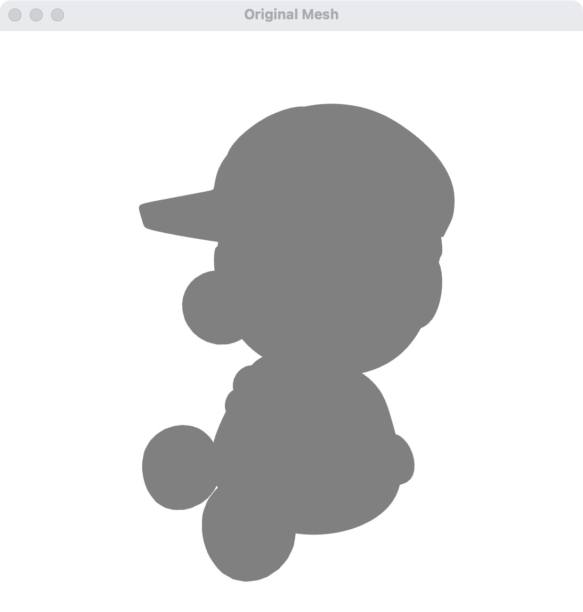
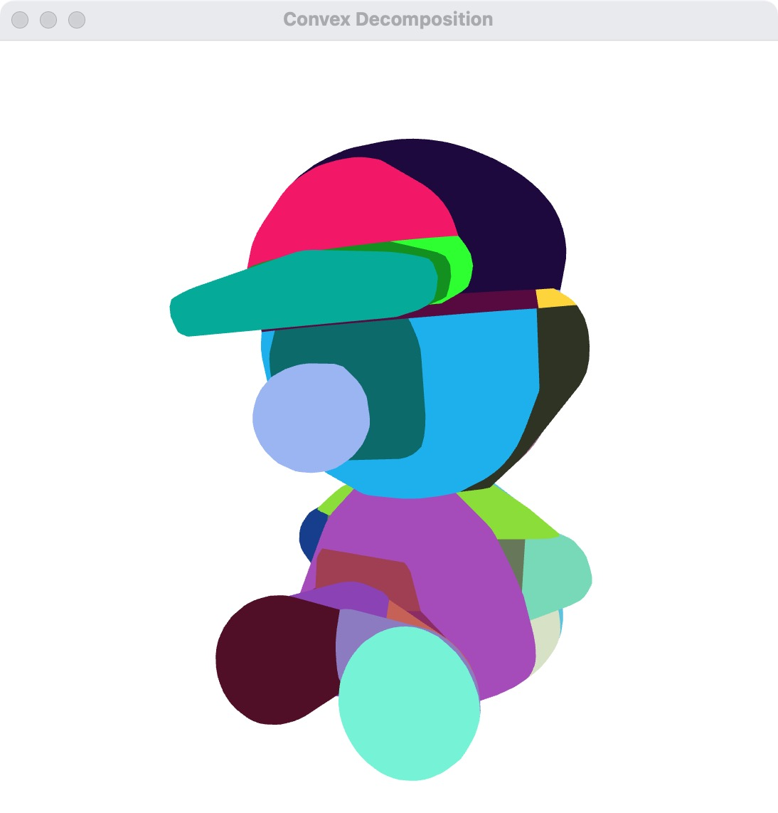

## 先确认输入与输出的用途

CoACD 是面向碰撞几何的近似凸分解方法。输入是三角网格，输出是多个凸组件；它不是纹理简化器，也不保证物体所有功能孔洞在任意阈值下都保留。

本文演示 Python 分解与 Open3D 检查。原有对比图继续作为历史结果展示，不以 AI 生成图模拟分解效果。

## 安装与版本记录

```bash
python -m pip install coacd trimesh open3d numpy
python -m pip show coacd trimesh open3d
```

在独立环境中运行，记录版本和输入模型。无桌面环境可完成分解与导出，但 Open3D 交互窗口还需要可用图形后端。

## 一个可复用的分解脚本

保存为 `decompose.py`，运行 `python decompose.py doll.obj output-parts`。输出目录必须是新目录，避免覆盖旧实验。

```python
import argparse
import inspect
from pathlib import Path
from time import perf_counter

import coacd
import numpy as np
import open3d as o3d
import trimesh

parser = argparse.ArgumentParser()
parser.add_argument("mesh")
parser.add_argument("output")
parser.add_argument("--show", action="store_true")
args = parser.parse_args()

mesh = trimesh.load(args.mesh, force="mesh")
if not isinstance(mesh, trimesh.Trimesh) or mesh.is_empty:
    raise ValueError("需要非空三角网格")
if not np.isfinite(mesh.vertices).all() or mesh.faces.shape[1] != 3:
    raise ValueError("输入包含非有限坐标或非三角面")
print("bounds:", mesh.bounds, "watertight:", mesh.is_watertight)
print("run_coacd:", inspect.signature(coacd.run_coacd))

destination = Path(args.output)
destination.mkdir(parents=True, exist_ok=False)
start = perf_counter()
parts = coacd.run_coacd(
    coacd.Mesh(mesh.vertices, mesh.faces),
    threshold=0.05,
    seed=42,
)
if not parts:
    raise RuntimeError("分解没有返回组件")
print(f"parts={len(parts)}, seconds={perf_counter() - start:.3f}")

rng = np.random.default_rng(42)
visuals = []
for index, (vertices, faces) in enumerate(parts):
    part = trimesh.Trimesh(vertices=vertices, faces=faces, process=False)
    part.export(destination / f"part-{index:03d}.obj")
    if args.show:
        visual = o3d.geometry.TriangleMesh(
            o3d.utility.Vector3dVector(vertices),
            o3d.utility.Vector3iVector(faces),
        )
        visual.compute_vertex_normals()
        visual.paint_uniform_color(rng.uniform(0.25, 0.9, 3))
        visuals.append(visual)
if args.show:
    o3d.visualization.draw_geometries(visuals, window_name="CoACD parts")
```

每块单独导出，便于在物理引擎中配置为多个碰撞体。如果把所有块合成一个资产，而引擎又对整个资产取一次凸包，孔洞会再次消失。





## 调参先看什么

| 参数或设置 | 作用 | 注意事项 |
| --- | --- | --- |
| `threshold` | 控制允许的近似凹度 | 先确认归一化或真实单位模式 |
| `preprocess_mode` | 控制流形预处理 | 关闭前确认输入是有效实体，预处理也可能改变细节 |
| `mcts_iterations` / `mcts_max_depth` | 控制搜索预算 | 更多计算不等于每个模型都获得更好结果 |
| `max_convex_hull` | 限制最终组件数量 | 强制合并可能超出原凹度阈值 |
| `seed` | 固定随机采样 | 同时固定库版本和其他参数 |

Python 参数名与命令行短选项不同，使用 `inspect.signature` 检查已安装版本，不沿用未定义的 `max_iter`。新版本提供 `real_metric=True` 时，可在米制网格上按真实长度设置阈值；旧版本未必支持，默认归一化模式不能直接把 `0.05` 解释成 5 cm。

以上接口与模式说明见[作者仓库的参数文档](https://github.com/SarahWeiii/CoACD)。

## 与 V-HACD 如何比较

两者都用凸组件近似非凸网格。CoACD 重点在碰撞感知度量、直接网格切割与多步搜索；不能因此一概推断它总是更精确，或 V-HACD 可以实时处理所有大网格。

公平比较需固定输入尺度、预处理、组件/顶点预算，并记录具体实现与版本。除了耗时和组件数，还要测试关键孔洞能否通过、抓手接触是否合理，以及物理引擎加载后是否保持这些性质。


## 阅读自测与验收

- 先检查输入是否是预期单位、拓扑和连通性，再比较分解块数、近似误差及耗时；块数少不必然更适合碰撞检测。
- 重新加载全部导出的凸块，确认它们保留原坐标系和相对位置；把每块分别居中会破坏组合几何。
