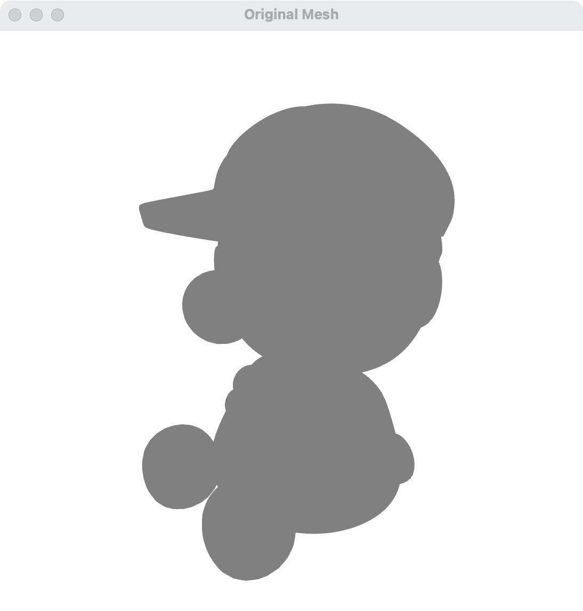
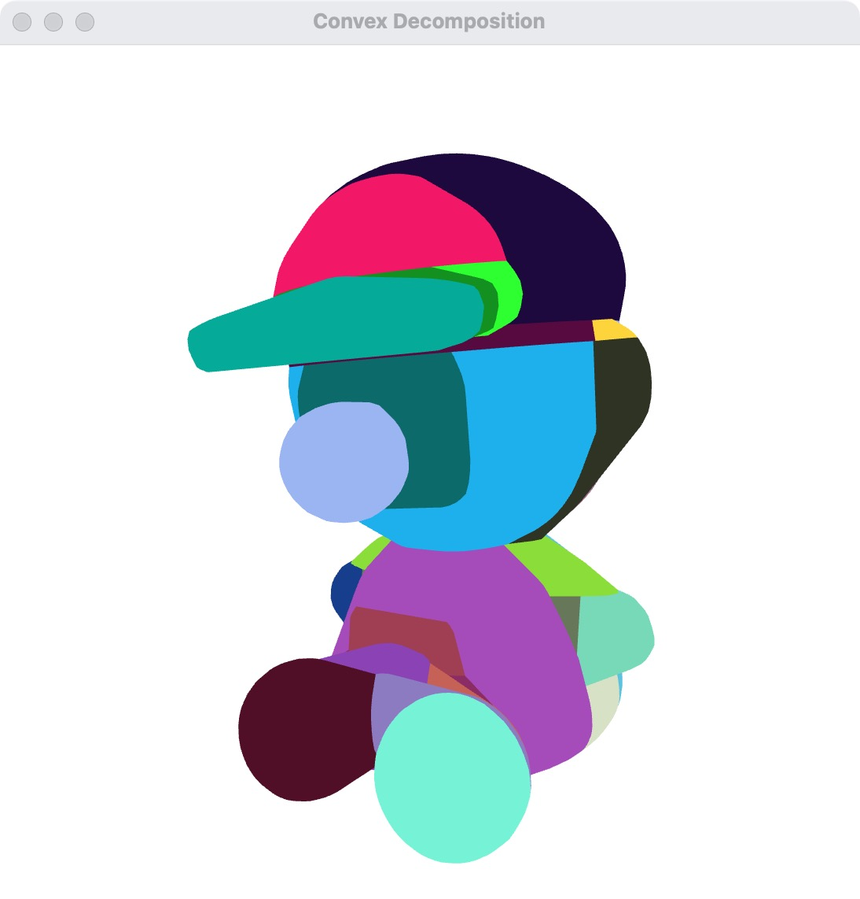

## 先确认输入与输出的用途

CoACD 是面向碰撞几何的近似凸分解方法。输入是三角网格，输出是多个凸组件；它不是纹理简化器，也不保证物体所有功能孔洞在任意阈值下都保留。

本文演示 Python 分解与 Open3D 检查，并保留已有分解结果用于对照。

## 安装与版本记录

```bash
python -m pip install coacd trimesh numpy
python -m pip show coacd trimesh numpy
```

在独立环境中运行，记录版本和输入模型。分解与导出不依赖 Open3D；可视化放在另一个进程中，需要时再安装 `open3d` 或相应平台的 `open3d-cpu`。两者使用同一导入名，不应混装。

## 一个可复用的分解脚本

保存为 `decompose.py`，运行 `python decompose.py doll.obj output-parts`。输出目录必须是新目录，避免覆盖旧实验。

```python
import argparse
import hashlib
import inspect
import json
from importlib.metadata import version
from pathlib import Path
from time import perf_counter

import coacd
import numpy as np
import trimesh

parser = argparse.ArgumentParser()
parser.add_argument("mesh")
parser.add_argument("output")
args = parser.parse_args()

mesh = trimesh.load(args.mesh, force="mesh")
if not isinstance(mesh, trimesh.Trimesh) or mesh.is_empty:
    raise ValueError("需要非空三角网格")
if not np.isfinite(mesh.vertices).all() or mesh.faces.shape[1] != 3:
    raise ValueError("输入包含非有限坐标或非三角面")
print("bounds:", mesh.bounds, "watertight:", mesh.is_watertight)
print("run_coacd:", inspect.signature(coacd.run_coacd))

destination = Path(args.output)
destination.mkdir(parents=True, exist_ok=False)
start = perf_counter()
parameters = {"threshold": 0.05, "seed": 42}
parts = coacd.run_coacd(
    coacd.Mesh(mesh.vertices, mesh.faces),
    **parameters,
)
if not parts:
    raise RuntimeError("分解没有返回组件")
seconds = perf_counter() - start
print(f"parts={len(parts)}, seconds={seconds:.3f}")

for index, (vertices, faces) in enumerate(parts):
    part = trimesh.Trimesh(vertices=vertices, faces=faces, process=False)
    part.export(destination / f"part-{index:03d}.obj")

manifest = {
    "input": Path(args.mesh).name,
    "sha256": hashlib.sha256(Path(args.mesh).read_bytes()).hexdigest(),
    "versions": {name: version(name) for name in ("coacd", "trimesh", "numpy")},
    "parameters": parameters,
    "api_signature": str(inspect.signature(coacd.run_coacd)),
    "input_bounds": mesh.bounds.tolist(),
    "parts": len(parts),
    "seconds": seconds,
}
(destination / "manifest.json").write_text(
    json.dumps(manifest, ensure_ascii=False, indent=2), encoding="utf-8"
)
```

每块单独导出，便于在物理引擎中配置为多个碰撞体。如果把所有块合成一个资产，而引擎又对整个资产取一次凸包，孔洞会再次消失。`manifest.json` 记录显式参数、该版本的默认参数签名及输入摘要；实际工程还应记录网格的物理单位。

### 在单独进程中读取与显示

保存为 `view_parts.py`。`python view_parts.py output-parts --check-only` 只检查读取与包围盒；有图形会话时去掉 `--check-only` 查看各组件。这个进程只导入 Open3D，不导入 CoACD。

```python
import argparse
from pathlib import Path

import numpy as np
import open3d as o3d

parser = argparse.ArgumentParser()
parser.add_argument("directory", type=Path)
parser.add_argument("--check-only", action="store_true")
args = parser.parse_args()
files = sorted(args.directory.glob("part-*.obj"))
if not files:
    raise ValueError("没有找到导出的组件")
rng = np.random.default_rng(42)
visuals = []
for path in files:
    part = o3d.io.read_triangle_mesh(str(path))
    if not part.has_vertices() or not part.has_triangles():
        raise ValueError(f"组件为空: {path.name}")
    points = np.asarray(part.vertices)
    if not np.isfinite(points).all():
        raise ValueError(f"组件含非有限坐标: {path.name}")
    print(path.name, "bounds:", part.get_min_bound(), part.get_max_bound())
    part.compute_vertex_normals()
    part.paint_uniform_color(rng.uniform(0.25, 0.9, 3))
    visuals.append(part)
if not args.check_only:
    o3d.visualization.draw_geometries(visuals, window_name="CoACD parts")
```

本文在 Linux / Python 3.10、CoACD 1.0.14 与 Open3D CPU 0.19.0 的组合中，复现过“先导入 CoACD，再导入 Open3D”时的原生库崩溃；崩溃发生在读取网格之前。拆分进程后，L 形网格的分解、导出和重新读取通过。这个记录仅对应所测组合，不代表所有版本都冲突；若遇到类似问题，可用 `python -X faulthandler` 定位阶段，不要把导入失败直接归因于网格拓扑。





## 调参先看什么

| 参数或设置 | 作用 | 注意事项 |
| --- | --- | --- |
| `threshold` | 控制允许的近似凹度 | 先确认归一化或真实单位模式 |
| `preprocess_mode` | 控制流形预处理 | 关闭前确认输入是有效实体，预处理也可能改变细节 |
| `mcts_iterations` / `mcts_max_depth` | 控制搜索预算 | 更多计算不等于每个模型都获得更好结果 |
| `max_convex_hull` | 限制最终组件数量 | 强制合并可能超出原凹度阈值 |
| `seed` | 固定随机采样 | 同时固定库版本和其他参数 |

Python 参数名与命令行短选项不同，使用 `inspect.signature` 检查已安装版本，不沿用未定义的 `max_iter`。新版本提供 `real_metric=True` 时，可在米制网格上按真实长度设置阈值；旧版本未必支持，默认归一化模式不能直接把 `0.05` 解释成 5 cm。

以上接口与模式说明见[作者仓库的参数文档](https://github.com/SarahWeiii/CoACD)。

## 与 V-HACD 如何比较

两者都用凸组件近似非凸网格。CoACD 重点在碰撞感知度量、直接网格切割与多步搜索；不能因此一概推断它总是更精确，或 V-HACD 可以实时处理所有大网格。

公平比较需固定输入尺度、预处理、组件/顶点预算，并记录具体实现与版本。除了耗时和组件数，还要测试关键孔洞能否通过、抓手接触是否合理，以及物理引擎加载后是否保持这些性质。


## 阅读自测与验收

- 先检查输入是否是预期单位、拓扑和连通性，再比较分解块数、近似误差及耗时；块数少不必然更适合碰撞检测。
- 重新加载全部导出的凸块，确认它们保留原坐标系和相对位置；把每块分别居中会破坏组合几何。
