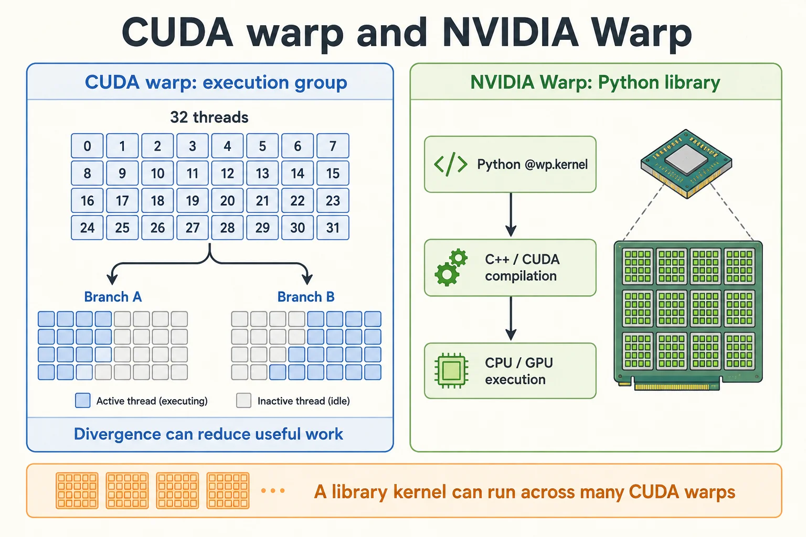

相关文档: [Nvidia-Warp](https://nvidia.github.io/warp/)
GitHub：[nvidia/warp](https://github.com/NVIDIA/warp)

CUDA warp 是 GPU 执行模型中的线程组；NVIDIA Warp 是 Python 数值计算库，两者处在不同层次。



---

## **1. CUDA Warp（硬件/编程模型概念）**

### **1.1 定义与核心概念**

- **定义**：
  CUDA Warp 是 NVIDIA GPU 的线程调度单位，由 **32 个连续线程** 组成（Volta 架构后支持独立线程调度）。
- **核心特性**：
  - **SIMT 执行模型**：同一 Warp 内的线程执行相同指令，但处理不同数据。
  - **分支发散**：若 Warp 内线程执行不同分支，性能会显著下降。
  - **内存访问优化**：需对齐和连续的全局内存访问（合并内存事务）。
- **目标**：
  最大化 GPU 吞吐量，通过减少分支发散和优化内存访问提升性能。

### **1.2 Warp 的关键特性**

#### **(1) 线程调度**

- GPU 以 Warp 为单位调度线程到流多处理器（SM）。
- 每个 SM 可同时管理多个活跃的 Warp，通过上下文切换隐藏内存延迟（Latency Hiding）。

#### **(2) 内存访问模式**

- **合并内存访问（Coalesced Memory Access）**：
  - 同一 Warp 的线程访问全局内存时，若地址连续且对齐，GPU 可合并为少数内存事务。
  - 非连续访问会导致多次内存事务，显著降低性能。
- **共享内存（Shared Memory）**：
  - 合理利用共享内存可减少全局内存访问冲突，优化 Warp 执行效率。

#### **(3) 分支发散处理**

- 若 Warp 内线程的条件分支不同，GPU 会执行所有分支路径，跳过不满足条件的线程。
- 分歧路径可能降低有效吞吐，但实际耗时还受分支长度、活跃掩码、访存与调度影响，不能简单等同于两条路径耗时相加。

### **1.3 Warp 的使用方式**

#### **(1) 显式控制线程逻辑**

- 通过 `threadIdx.x` 计算线程在 Warp 内的位置：

  ```c
  // 仅适用于一维 thread block；多维 block 先展平成线性索引。
  int lane_id = threadIdx.x % 32;  // Warp 内的线程编号（0~31）
  int warp_id = threadIdx.x / 32;  // Warp 的索引
  ```

- 利用 `lane_id` 进行 Warp 内的数据交换（如 Shuffle 指令）。

#### **(2) 避免分支发散**

- **优化分支条件**：尽量让同一 Warp 内的线程走相同分支。

  ```c
  // 差：可能导致分支发散
  if (threadIdx.x % 2 == 0) { ... } else { ... }

  // 示意：按完整 warp 分组；仅在允许重排工作且不改变语义时使用
  if ((threadIdx.x / 32) % 2 == 0) { ... } else { ... }
  ```

#### **(3) 使用 Warp 级原语**

- **Shuffle 指令**（Warp Shuffle Functions）：
  - 允许同一 Warp 内的线程直接交换数据，无需通过共享内存。
  - 例如 `__shfl_sync()`、`__shfl_up_sync()` 等函数。

  ```c
  int value = __shfl_sync(0xffffffff, input_value, src_lane);
  ```

#### **(4) Warp 级规约（Reduction）**

- 在 Warp 内进行高效规约（如求和、最大值）：

  ```c
  for (int offset = 16; offset > 0; offset /= 2)
      value += __shfl_down_sync(0xffffffff, value, offset);
  ```

上面的全掩码 shuffle 规约要求同一 warp 的 32 个线程都参与，且按同一掩码调用；结果仅在 lane 0 是完整和。尾部不满的 warp 或条件执行需要另行设计参与掩码和规约逻辑。独立线程调度也不允许依赖隐式同步。参见 [NVIDIA Warp 级原语说明](https://developer.nvidia.com/blog/using-cuda-warp-level-primitives/)。

### **1.4 优化技巧**

1. **最小化分支发散**：
   - 重构代码，确保同一 Warp 的线程执行相同分支。
   - 使用掩码（如 `__ballot_sync()`）统计条件满足的线程数。

2. **内存访问对齐**：
   - 确保全局内存访问是连续的（如 `threadIdx.x` 对应内存地址连续）。
   - 使用 `cudaMallocPitch` 处理二维数组的内存对齐。

3. **利用活跃 Warp 隐藏延迟**：
   - 提高内核的“Occupancy”（SM 中活跃 Warp 的比例），通过调整线程块大小和共享内存使用。

4. **避免 Warp 内线程的负载不均衡**：
   - 均匀分配任务，避免部分线程空闲。

### **1.5 使用场景**

- **高性能计算**：如矩阵运算、物理模拟、深度学习推理。
- **优化方向**：
  - 减少分支发散（重组线程逻辑）。
  - 合并内存访问（连续地址对齐）。
  - 利用 Warp 级原语（如 Shuffle 指令）。

### **1.6 示例代码（CUDA C++）**

#### **(1) 向量加法（无分支发散）**

```c
__global__ void add_vectors(float *a, float *b, float *c, int n) {
    int idx = blockIdx.x * blockDim.x + threadIdx.x;
    if (idx < n) c[idx] = a[idx] + b[idx];  // 保护尾部线程，避免越界
}
```

#### **(2) Warp 级求和规约**

```c
__device__ float warp_reduce_sum(float val) {
    for (int offset = 16; offset > 0; offset /= 2)
        val += __shfl_down_sync(0xffffffff, val, offset);
    return val;
}
```

---

## **2. Warp-Python（高性能 GPU 编程库）**

### **2.1 定义与核心概念**

- **定义**：
  Warp-Python 是 NVIDIA 推出的 **Python 库**，允许用户通过 Python 语法编写 GPU 加速代码，并自动编译为 CUDA 内核。
- **特点**：
  - 类似 NumPy 的数组操作，支持 GPU 并行计算。
  - 支持自定义内核（Kernels）和梯度计算（自动微分）。
  - 与 PyTorch、TensorFlow 等框架兼容。
  - 自动内存管理（无需手动分配 GPU 内存）。
- **核心特性**：
  - **类 Python 语法**：无需直接编写 CUDA C++ 代码。
  - **自动内存管理**：无需手动分配 GPU 内存。
  - **内置自动微分**：支持机器学习中的梯度计算。
  - **与 CUDA 兼容**：底层生成优化的 CUDA 代码。
- **目标**：
  - 简化 GPU 编程，快速实现高性能计算任务。

### **2.2 使用场景**

- **快速原型开发**：如物理模拟、数值计算。
- **机器学习**：自定义损失函数和梯度计算。
- **科学计算**：替代 NumPy 实现 GPU 加速。

### **2.3 安装 Warp**

通过 `pip` 直接安装：

```bash
python -m pip install warp-lang
```

验证安装：

```python
import warp as wp
print(wp.__version__)  # 输出版本号（如 1.7.0）
```

### **2.4 示例代码（Warp-Python）**

将本节与 2.5 节的片段依次放入同一个 `warp_examples.py`；后续片段复用首例的导入与初始化。先使用 CPU 后端检验数值，改用 CUDA 时显式更改 device，先预热并同步后再计时。只复制中间一个片段时，需要补上导入和初始化。

Warp 的装饰器编译通常需要能读取 Python 源文件，因此应保存为文件执行，而不是依赖任意字符串 exec 环境。参见 [NVIDIA Warp 官方文档](https://nvidia.github.io/warp/)。

#### **(1) 简单向量加法**

```python
import warp as wp
import numpy as np

# 初始化上下文并明确默认设备；验证后可改为 cuda:0。
wp.init()
wp.set_device("cpu")
rng = np.random.default_rng(42)

# 在选定设备上定义数组
n = 1024
a = wp.array(rng.random(n), dtype=wp.float32)
b = wp.array(rng.random(n), dtype=wp.float32)
c = wp.zeros(n, dtype=wp.float32)

# 定义 GPU 内核（@wp.kernel 装饰器）
@wp.kernel
def add_vectors(a: wp.array(dtype=wp.float32),
                b: wp.array(dtype=wp.float32),
                c: wp.array(dtype=wp.float32)):
    i = wp.tid()  # 获取线程索引
    c[i] = a[i] + b[i]

# 启动内核（指定线程数）
wp.launch(kernel=add_vectors, dim=n, inputs=[a, b, c])

# 将结果拷贝回 CPU
result = c.numpy()
np.testing.assert_allclose(result, a.numpy() + b.numpy(), rtol=1e-6)
print("vector addition passed on", c.device)
```

#### **(2) 矩阵乘法**

```python
@wp.kernel
def matrix_mult(a: wp.array2d(dtype=wp.float32),
                b: wp.array2d(dtype=wp.float32),
                c: wp.array2d(dtype=wp.float32)):
    i, j = wp.tid()
    c[i, j] = 0.0
    for k in range(a.shape[1]):
        c[i, j] += a[i, k] * b[k, j]

# 定义矩阵
a = wp.array(rng.random((64, 64)), dtype=wp.float32)
b = wp.array(rng.random((64, 64)), dtype=wp.float32)
c = wp.zeros((64, 64), dtype=wp.float32)

# 执行矩阵乘法
wp.launch(matrix_mult, dim=(64, 64), inputs=[a, b, c])
np.testing.assert_allclose(c.numpy(), a.numpy() @ b.numpy(), rtol=1e-5, atol=1e-5)
```

#### **(3) 自定义原子操作**

```python
@wp.kernel
def atomic_add_example(counter: wp.array(dtype=wp.int32)):
    wp.atomic_add(counter, 0, 1)  # 原子加操作

counter = wp.zeros(1, dtype=wp.int32)
wp.launch(atomic_add_example, dim=100, inputs=[counter])
print(counter.numpy())  # 输出 [100]
```

### **2.5 高级功能案例**

#### **(1) 物理模拟（粒子系统）**

```python
@wp.kernel
def update_particles(positions: wp.array(dtype=wp.vec3),
                     velocities: wp.array(dtype=wp.vec3),
                     dt: float):
    tid = wp.tid()
    velocities[tid] += wp.vec3(0.0, -9.8, 0.0) * dt  # 重力加速度
    positions[tid] += velocities[tid] * dt

# 初始化粒子
num_particles = 1000
positions = wp.array(rng.random((num_particles, 3)), dtype=wp.vec3)
velocities = wp.zeros(num_particles, dtype=wp.vec3)

# 模拟多步
for _ in range(100):
    wp.launch(update_particles, dim=num_particles, inputs=[positions, velocities, 0.01])
```

#### **(2) 自动微分（Autograd）**

```python
@wp.kernel
def loss_function(x: wp.array(dtype=wp.float32),
                  y: wp.array(dtype=wp.float32),
                  loss: wp.array(dtype=wp.float32)):
    tid = wp.tid()
    difference = x[tid] - y[tid]
    wp.atomic_add(loss, 0, difference * difference)

# kernel 通过输出数组写结果；wp.launch 不返回一个标量损失。
x = wp.array(rng.random(10), dtype=wp.float32, requires_grad=True)
y = wp.zeros(10, dtype=wp.float32, device=x.device)
loss = wp.zeros(1, dtype=wp.float32, device=x.device, requires_grad=True)

with wp.Tape() as tape:
    wp.launch(loss_function, dim=10, inputs=[x, y], outputs=[loss],
              device=x.device)

tape.backward(loss=loss)
np.testing.assert_allclose(x.grad.numpy(), 2.0 * x.numpy(), rtol=1e-5)
print(x.grad.numpy())
```

### **2.6 关键 API 和功能**

| **功能**                | **API/语法**                         | **说明**                         |
|-------------------------|--------------------------------------|----------------------------------|
| 定义内核                | `@wp.kernel`                         | 将受支持的 Python 函数编译为 CPU/CUDA 内核 |
| 启动内核                | `wp.launch(kernel, dim, inputs)`     | 指定线程数和输入参数             |
| 数组操作                | `wp.array(data, dtype)`              | 在所选设备上创建数组，需核对 dtype 与布局 |
| 原子操作                | `wp.atomic_add()`, `wp.atomic_max()` | 线程安全的原子操作               |
| 数学函数                | `wp.sqrt()`, `wp.sin()`              | 支持 GPU 加速的数学函数          |
| 自动微分                | `wp.Tape()`                          | 记录计算图并计算梯度             |

---

### **2.7 测试案例**

```python
import warp as wp
from warp import float32 as f32
import numpy as np
import cv2

# 设置画布大小
n = 800
pixel = wp.zeros((n, n), dtype=f32, device='cuda:0')

@wp.func
def mandelbrot_func(z: wp.vec2, c: wp.vec2) -> wp.vec2:
    return wp.vec2(z[0] * z[0] - z[1] * z[1] + c[0],
                   2.0 * z[0] * z[1] + c[1])

@wp.kernel
def paint(p: wp.array2d(dtype=f32), t: f32):
    i, j = wp.tid()

    # 动态缩放和平移
    zoom = 2.8 + wp.sin(t * 0.2) * 0.5
    center_x = -0.5 + wp.cos(t * 0.1) * 0.1
    center_y = wp.sin(t * 0.15) * 0.1

    x = (f32(j) / f32(n) - 0.5) * zoom + center_x
    y = (f32(i) / f32(n) - 0.5) * zoom + center_y

    c = wp.vec2(x, y)
    z = wp.vec2(0.0, 0.0)

    iteration = f32(0.0)
    max_iter = f32(200.0)

    # 迭代计算
    while wp.length(z) < 2.0 and iteration < max_iter:
        z = mandelbrot_func(z, c)
        iteration += 1.0

    # 平滑着色
    smooth_iter = max_iter
    if wp.length(z) > 2.0:
        smooth_iter = iteration + 1.0 - wp.log2(wp.log2(wp.length(z)))
    p[i, j] = smooth_iter / max_iter

def main():
    t = 0.0
    while True:
        wp.launch(paint, dim=(n, n), inputs=[pixel, t], device='cuda:0')

        # 创建彩色效果
        np_pixel = pixel.numpy()
        # 使用更丰富的颜色映射
        colored = cv2.applyColorMap(
            (np_pixel * 255).astype(np.uint8),
            cv2.COLORMAP_MAGMA
        )

        cv2.imshow("Mandelbrot Set", colored)

        t += 0.01
        if cv2.waitKey(1) & 0xFF == ord('q'):
            break

if __name__ == "__main__":
    main()
```

<!-- TODO: 补充 warp_demo.gif 后恢复演示动画。 -->

## **3. 核心区别与联系**

| **特性**                | **CUDA Warp**                          | **Warp-Python**                          |
|-------------------------|----------------------------------------|------------------------------------------|
| **定位**                | GPU 硬件执行单元/编程模型概念           | Python 库，用于简化 GPU 编程              |
| **使用语言**            | CUDA C++                               | Python                                   |
| **控制粒度**            | 直接操作线程、Warp 和内存               | 通过高阶 API 抽象（如 `wp.array` 和内核） |
| **性能优化**            | 需手动优化分支发散和内存访问            | 自动生成优化代码，用户关注算法逻辑        |
| **适用场景**            | 需要极致性能优化的底层开发              | 快速原型设计、科学计算、机器学习          |
| **依赖关系**            | CUDA 开发依赖对应工具链                  | CPU / CUDA 后端依赖不同，应按发行版核对    |

---

## **4. 联合使用场景**

### **4.1 在 Warp-Python 中利用 CUDA Warp 知识**

- **优化 Warp-Python 内核**：
  通过重组线程索引减少分支发散（例如将相邻线程分配到同一 Warp）。

  ```python
  @wp.kernel
  def optimized_kernel(data: wp.array(dtype=wp.float32)):
      tid = wp.tid()
      warp_id = tid // 32  # 逻辑索引分组，不是硬件调度控制
      lane_id = tid % 32
      # 这里仅展示索引分解，不会改变硬件调度或自动建立线程同步。
      data[tid] = data[tid] + 1.0
  ```

- **内存访问优化**：
  使用 `wp.array` 的连续内存布局，避免全局内存访问碎片化。

### **4.2 示例：结合两者的粒子模拟**

```python
@wp.kernel
def particle_update(
    positions: wp.array(dtype=wp.vec3),
    velocities: wp.array(dtype=wp.vec3),
    dt: float
):
    tid = wp.tid()
    # Warp 级优化：同一 Warp 内的线程处理连续数据
    # 线程索引分组本身不构成同步；每个线程独立更新自己的粒子。
    velocities[tid] += wp.vec3(0, -9.8, 0) * dt
    positions[tid] += velocities[tid] * dt
```

---

## **5. 关键注意事项**

### **5.1 CUDA Warp**

- **分支发散**：避免同一 Warp 内线程执行不同条件分支。
- **内存对齐**：全局内存访问需连续对齐（如 `threadIdx.x` 对应连续地址）。
- **Volta+ 架构**：支持独立线程调度，但需注意隐式同步问题。

### **5.2 Warp-Python**

- **安装依赖**：CPU 与 CUDA 后端的要求不同。根据当前 Warp 发行版检查 Python、驱动和预编译包要求；不要把本地 CUDA Toolkit 视为所有运行方式的前提。
- **性能瓶颈**：避免频繁的 CPU-GPU 数据传输（利用 `wp.array` 驻留 GPU 内存）。
- **调试工具**：使用 `wp.synchronize()` 确保内核执行完成。

---

## **6. 总结**

| **场景**                     | **推荐工具**          | **原因**                                 |
|------------------------------|-----------------------|------------------------------------------|
| 底层 GPU 优化（如 HPC 内核） | CUDA Warp（CUDA C++） | 直接控制线程、内存和 Warp 级操作         |
| 快速开发 GPU 加速算法        | Warp-Python           | Python 语法简单，自动内存管理和代码生成  |
| 物理模拟/机器学习            | Warp-Python           | 内置自动微分和物理建模工具               |

通过理解 CUDA Warp 的底层机制和 Warp-Python 的高层抽象，开发者可以灵活选择工具，兼顾开发效率与性能优化。


## 阅读自测与验收

- 把向量加法和矩阵乘法与相同 float32 输入的 NumPy 结果比较；计时前后同步，首次编译时间单独记录。
- 自动微分用能手算的损失检查梯度，并显式记录 device；Python 库名 Warp 与 CUDA 的 32 线程执行组不是同一个抽象层。
