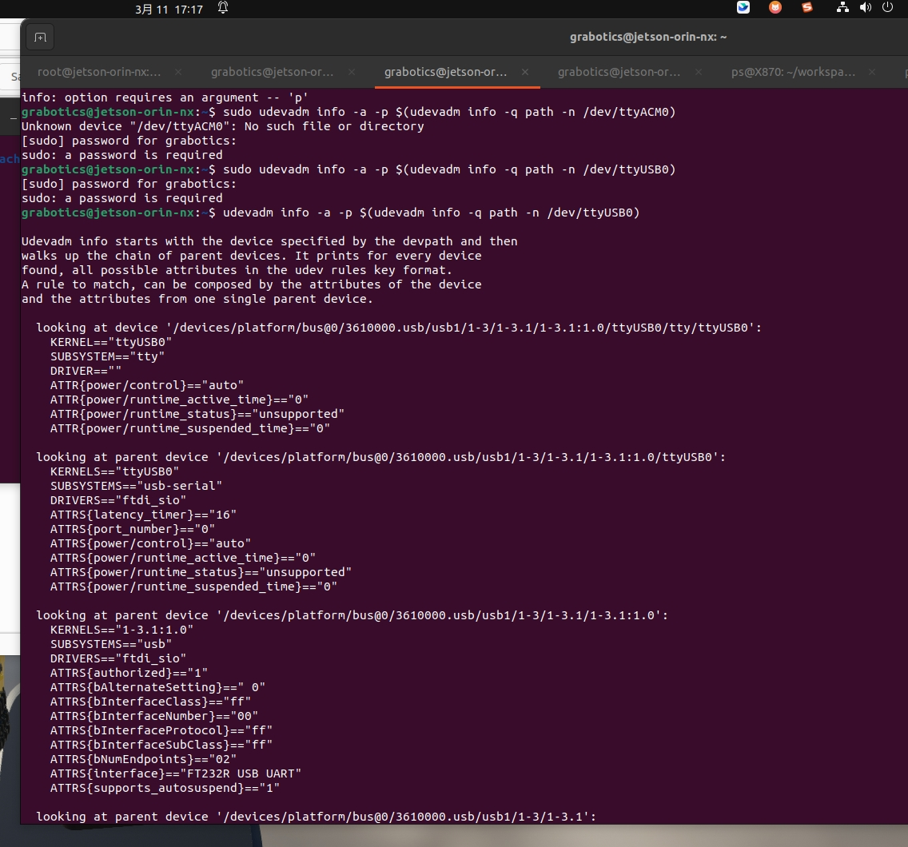
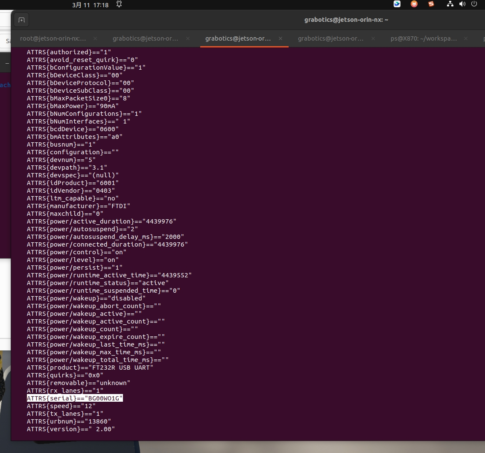
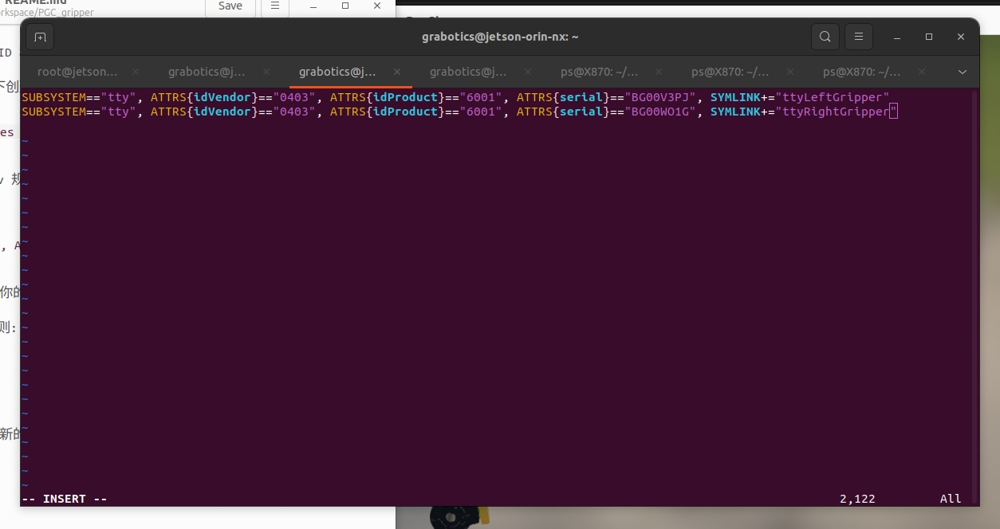
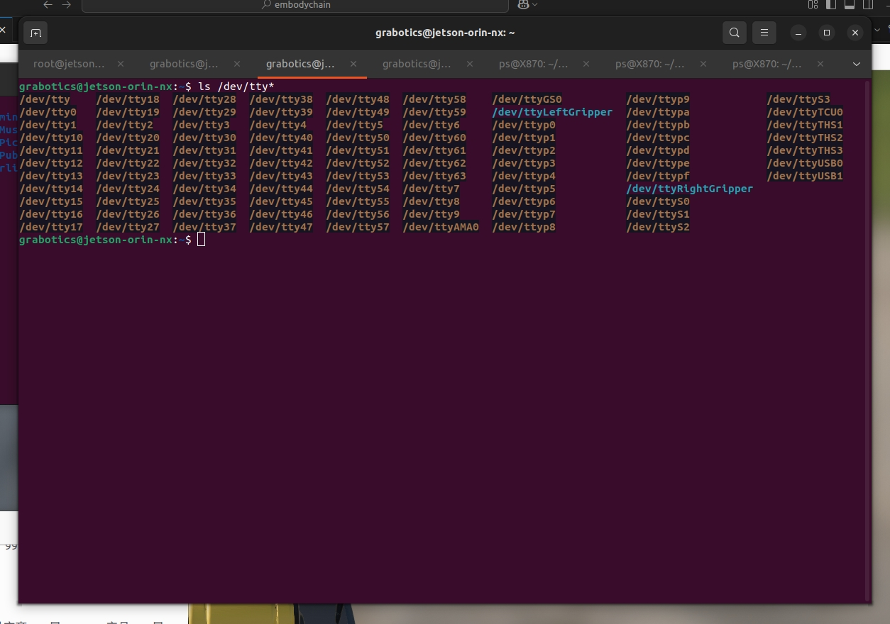
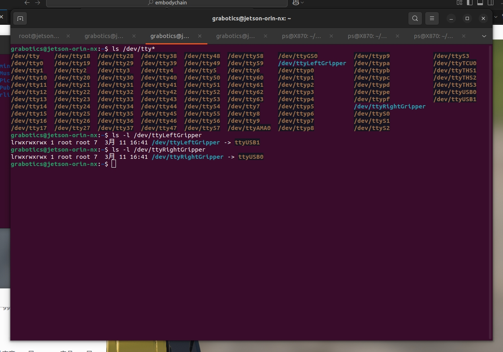

在使用串口设备时，有时需要为设备分配固定的别名，以便更方便地进行访问和管理。本文将介绍如何在 Ubuntu 系统上通过创建 udev 规则来实现这一目标。

#### 1. 检查当前用户是否在 `dialout` 组中

串口设备通常属于 `dialout` 组，确保当前用户在该组中。

```sh
groups
```

如果输出中没有 `dialout`，则需要将当前用户添加到 `dialout` 组：

```sh
sudo usermod -aG dialout $USER
```

然后，重新登录或重启系统以使更改生效。

#### 2. 检查设备权限

查看串口设备的权限：

```sh
ls -l /dev/ttyUSB0
```

输出类似于：

```sh
crw-rw---- 1 root dialout 188, 1 日期 时间 /dev/ttyUSB0
```

确保设备的组是 `dialout`，并且组成员有读写权限。

#### 3. 临时更改设备权限

如果需要立即访问设备，可以临时更改设备权限：

```sh
sudo chmod 666 /dev/ttyUSB0
```

请注意，这只是临时解决方案，设备权限在重启后会恢复默认。

#### 4. 确保设备存在

确保设备 `/dev/ttyUSB1` 存在并已连接：

```sh
ls /dev/ttyUSB*
```

如果设备不存在，检查设备连接或驱动程序是否正确安装。

#### 5. 查找设备信息

插入设备并使用以下命令查找设备信息（此处假设设备路径为 `/dev/ttyACM0`）：

```sh
udevadm info -a -p $(udevadm info -q path -n /dev/ttyUSB0)
```


这将显示设备的详细信息，包括供应商 ID、产品 ID 和序列号等。



#### 6. 创建 udev 规则文件

在 `rules.d` 目录下创建一个新的规则文件，例如 `99-usb-serial.rules`：

```sh
sudo vim /etc/udev/rules.d/99-usb-serial.rules
```

#### 7. 添加规则

根据查找到的设备信息，添加 udev 规则。例如，如果设备的供应商 ID 是 `0403`，产品 ID 是 `6001`，可以添加以下规则：

```sh
SUBSYSTEM=="tty", ATTRS{idVendor}=="0403", ATTRS{idProduct}=="6001", ATTRS{serial}=="BG00V3PJ", SYMLINK+="ttyLeftGripper"
SUBSYSTEM=="tty", ATTRS{idVendor}=="0403", ATTRS{idProduct}=="6001", ATTRS{serial}=="BG00WO1G", SYMLINK+="ttyRightGripper"
```


这将创建符号链接 `/dev/ttyLeftGripper`和 `/dev/ttyRightGripper`，指向你的设备。

#### 8. 重载 udev 规则

保存文件后，重载 udev 规则：

```sh
sudo udevadm control --reload-rules
sudo udevadm trigger
```

#### 9. 验证

断开并重新连接设备，检查是否创建了新的符号链接：

```sh
ls -l /dev/tty*
```


查看情况如下：

```sh
[root@linux ~]# ls -l /dev/ttyLeftGripper
lrwxrwxrwx 1 root root         3月 11 16:41 /dev/ttyLeftGripper -> ttyUSB1
[root@linux ~]# ls -l /dev/ttyRightGripper
lrwxrwxrwx 1 root root         3月 11 16:41 /dev/ttyRightGripper -> ttyUSB0
```


通过以上步骤，你可以为串口设备分配固定的别名，方便日常使用和管理。