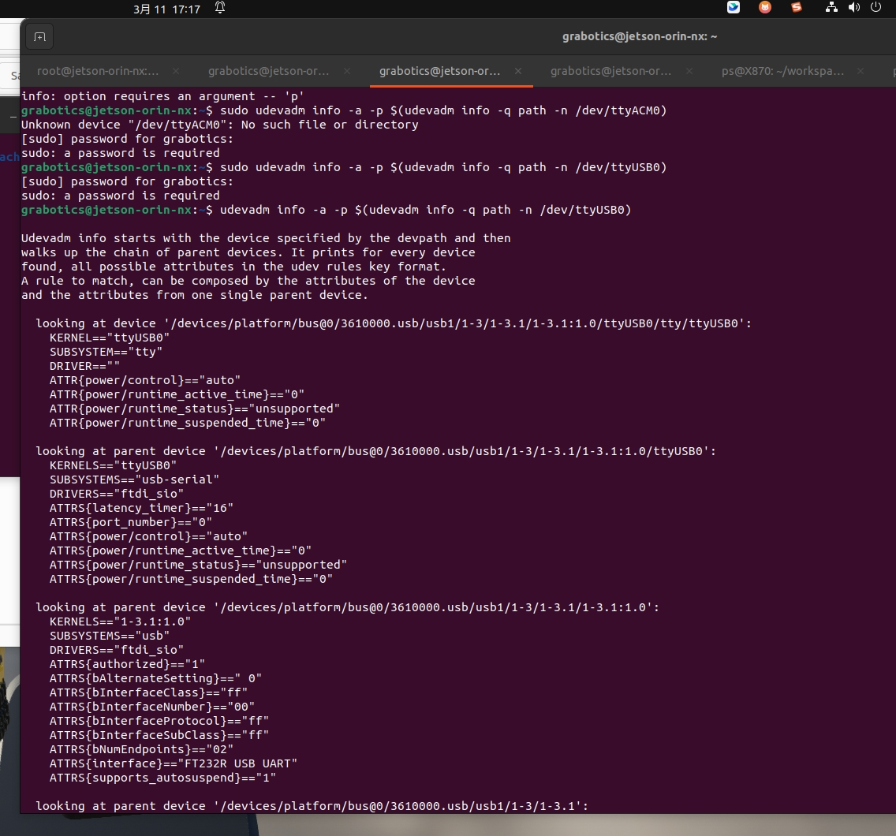
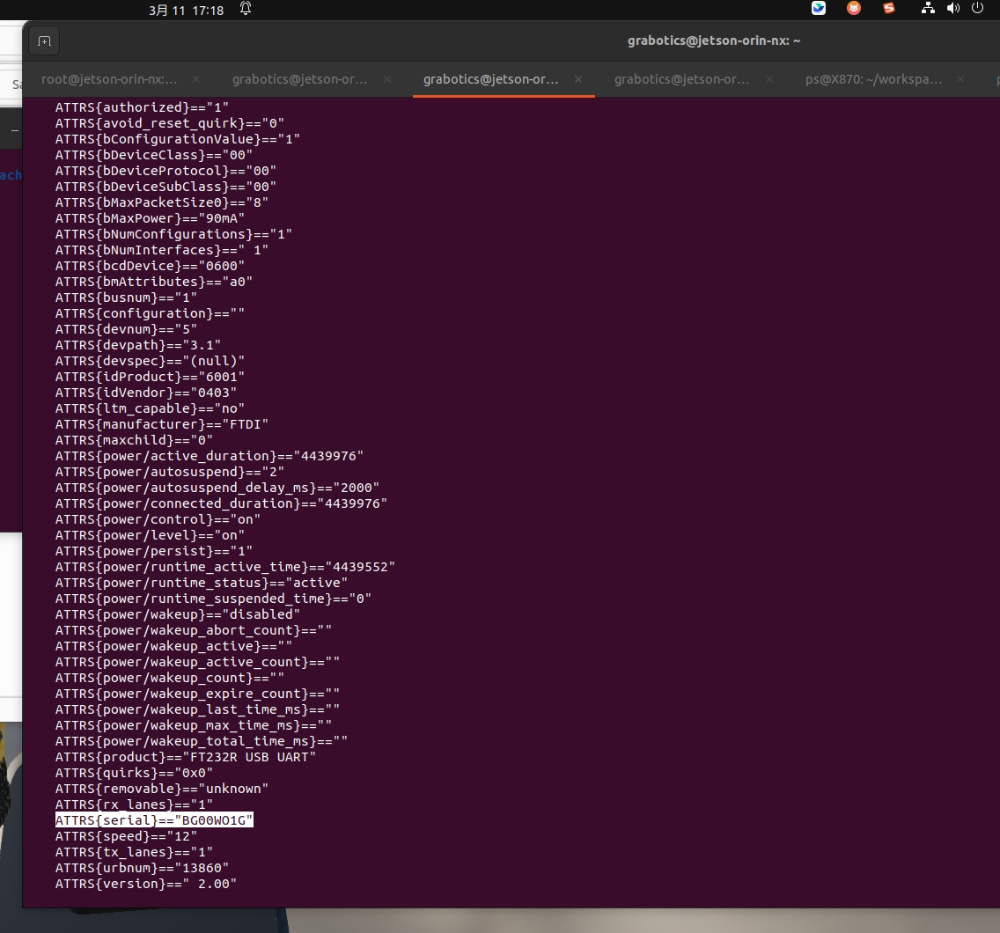
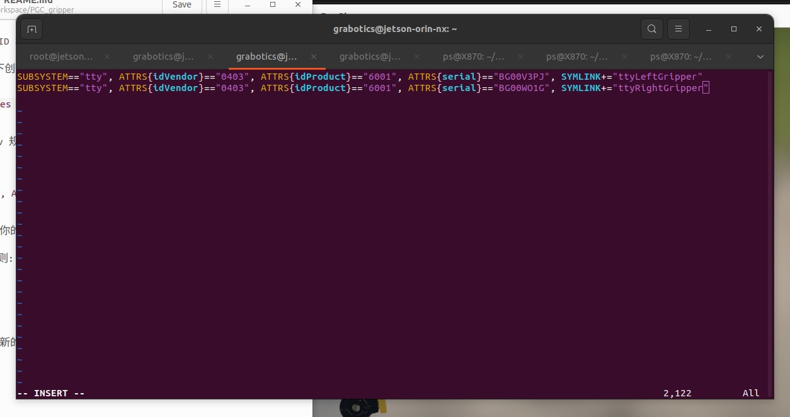
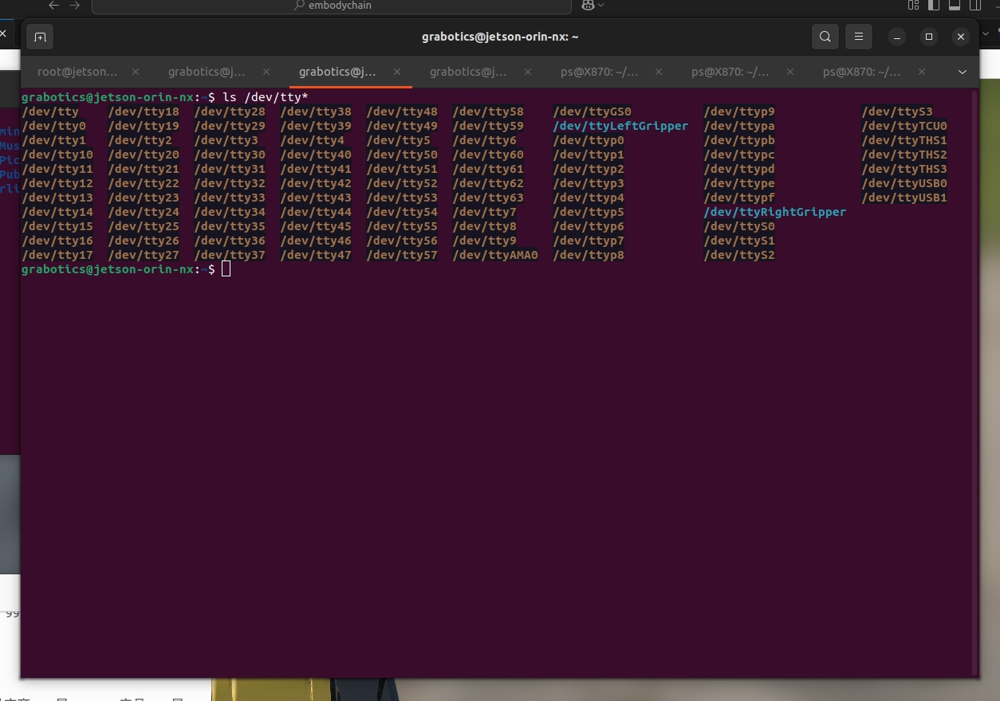
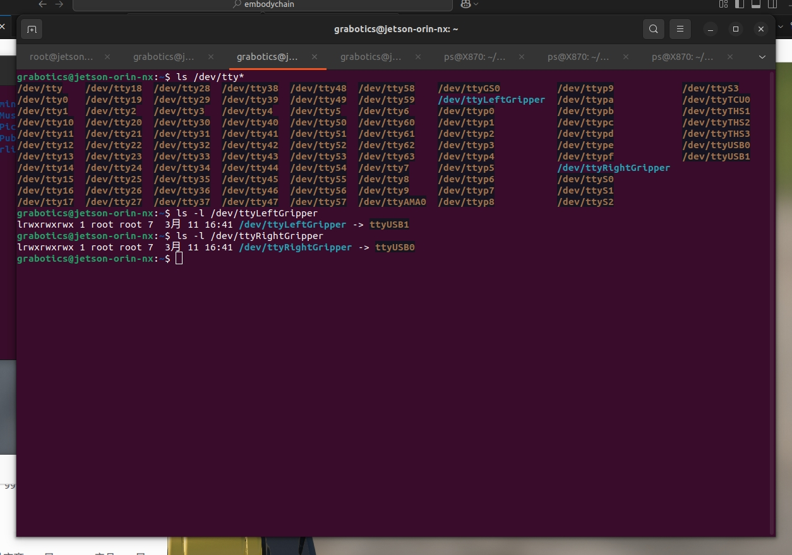

在使用串口设备时，有时需要为设备分配固定的别名，以便更方便地进行访问和管理。本文将介绍如何在 Ubuntu 系统上通过创建 udev 规则来实现这一目标。

## 1. 检查当前用户是否在 `dialout` 组中

串口设备通常属于 `dialout` 组，确保当前用户在该组中。

```sh
groups
```

如果输出中没有 `dialout`，则需要将当前用户添加到 `dialout` 组：

```sh
sudo usermod -aG dialout "$USER"
```

然后，重新登录或重启系统以使更改生效。

## 2. 检查设备权限

查看串口设备的权限：

```sh
ls -l /dev/ttyUSB0
```

输出类似于：

```text
crw-rw---- 1 root dialout 188, 1 日期 时间 /dev/ttyUSB0
```

确保设备的组是 `dialout`，并且组成员有读写权限。

## 3. 使用最小权限

优先通过所属组授权，并在重新登录后用 `id` 检查组成员关系。不建议 `chmod 666`：它会允许本机所有用户访问设备，且重新插拔后可能失效。需要短期跨用户诊断时，应明确授权对象和撤销方式。

## 4. 确保设备存在

先列出已连接的 USB 串口，再确认本文后续使用的 `/dev/ttyUSB0` 确实是目标设备：

```sh
ls /dev/ttyUSB*
```

如果设备不存在，检查设备连接或驱动程序是否正确安装。

## 5. 查找设备信息

插入设备并使用以下命令查找设备信息（此处统一假设目标设备路径为 `/dev/ttyUSB0`；实际是 ACM 设备时需整体替换路径）：

```sh
udevadm info --attribute-walk --name=/dev/ttyUSB0
```



这将显示设备的详细信息，包括供应商 ID、产品 ID 和序列号等。




## 6. 创建 udev 规则文件

在 `rules.d` 目录下创建一个新的规则文件，例如 `99-usb-serial.rules`：

```sh
sudo vim /etc/udev/rules.d/99-usb-serial.rules
```

## 7. 添加规则

根据查找到的设备信息，添加 udev 规则。例如，如果设备的供应商 ID 是 `0403`，产品 ID 是 `6001`，可以添加以下规则：

```text
SUBSYSTEM=="tty", ATTRS{idVendor}=="0403", ATTRS{idProduct}=="6001", ATTRS{serial}=="BG00V3PJ", SYMLINK+="ttyLeftGripper", GROUP="dialout", MODE="0660"
SUBSYSTEM=="tty", ATTRS{idVendor}=="0403", ATTRS{idProduct}=="6001", ATTRS{serial}=="BG00WO1G", SYMLINK+="ttyRightGripper", GROUP="dialout", MODE="0660"
```

上述内容是 `.rules` 文件内容，不是 shell 命令。



示例序列号必须替换为实际设备值。多个 `ATTRS` 匹配需要来自同一个父设备节点；不要把 attribute-walk 中不同父层的属性任意拼接。若适配器没有唯一序列号，考虑按物理端口路径绑定，并明确换 USB 口会改变身份。先查看 `/dev/serial/by-id/` 与 `/dev/serial/by-path/`，已有稳定路径时可能无需自定义规则。

这将创建符号链接 `/dev/ttyLeftGripper`和 `/dev/ttyRightGripper`，指向你的设备。

## 8. 重载 udev 规则

保存文件后，重载 udev 规则：

```sh
sudo udevadm control --reload-rules
sudo udevadm trigger --subsystem-match=tty --sysname-match=ttyUSB0
```

## 9. 验证

在设备停止运动、通信程序退出后重新插拔，检查新链接。重载规则不会自动修正所有已存在节点；上面的 trigger 只针对已确认的 ttyUSB0，不对全系统广播重触发。

检查是否创建了新的符号链接：

```sh
ls -l /dev/tty*
```



查看情况如下：

```text
[root@linux ~]# ls -l /dev/ttyLeftGripper
lrwxrwxrwx 1 root root         3月 11 16:41 /dev/ttyLeftGripper -> ttyUSB1
[root@linux ~]# ls -l /dev/ttyRightGripper
lrwxrwxrwx 1 root root         3月 11 16:41 /dev/ttyRightGripper -> ttyUSB0
```



通过以上步骤，你可以为串口设备分配固定的别名，方便日常使用和管理。


## 阅读自测与验收

- 两台同型号设备交换 USB 接口后，检查别名是否仍对应原序列号；若规则只匹配 vendor/product，可能命中多个设备。
- 以真实运行服务的用户检查权限和用户组，并在重新登录后验证；root 能访问不代表应用用户能访问。
