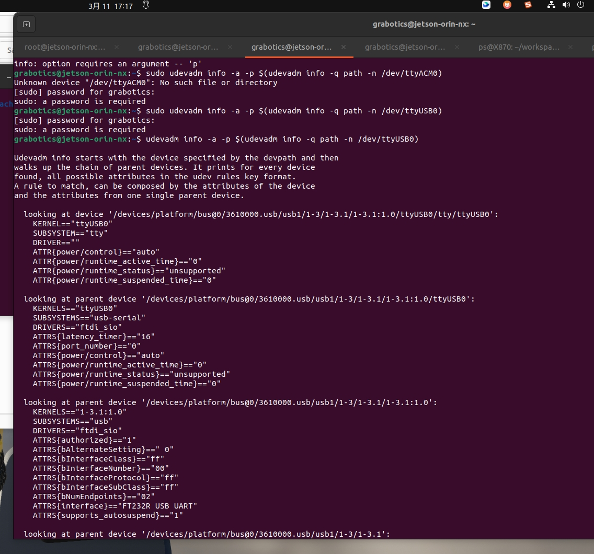
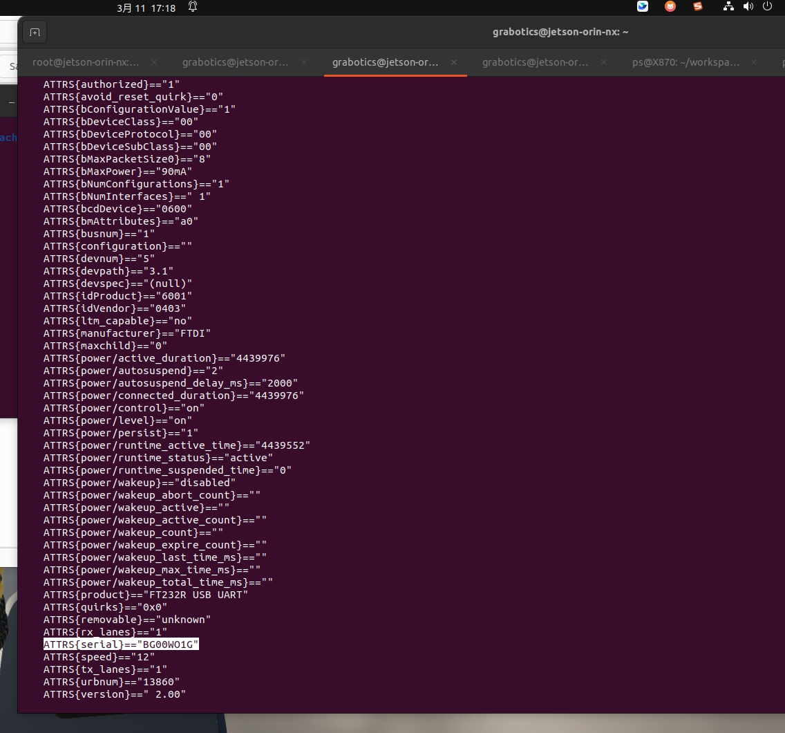
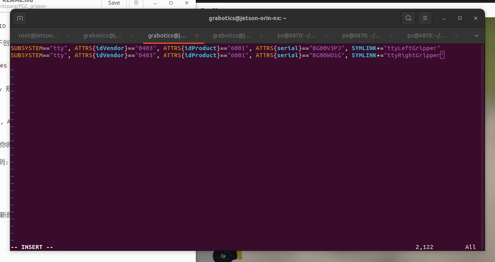
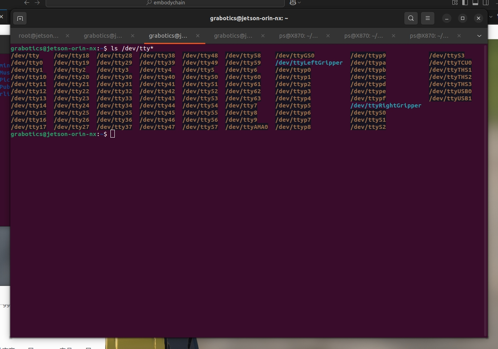
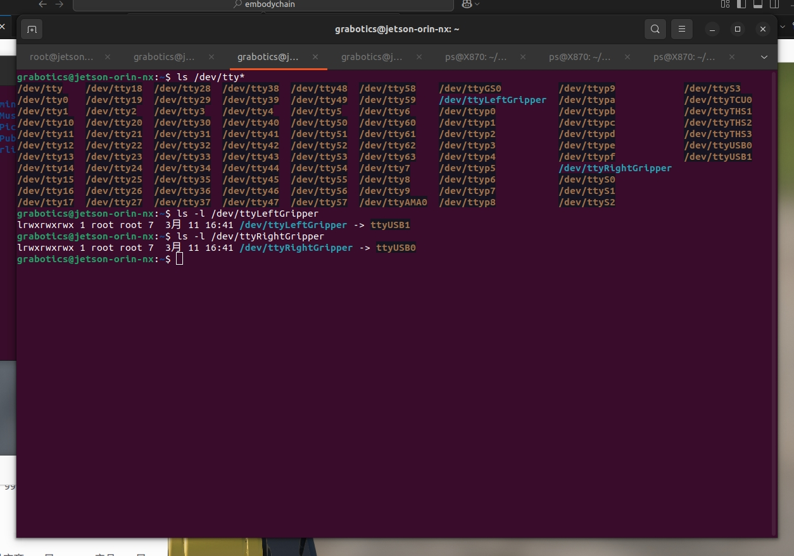

在使用串口设备时，有时需要为设备分配固定的别名，以便更方便地进行访问和管理。本文将介绍如何在 Ubuntu 系统上通过创建 udev 规则来实现这一目标。

## 1. 检查当前用户是否在 `dialout` 组中

串口设备通常属于 `dialout` 组，确保当前用户在该组中。

```sh
groups
```

如果输出中没有 `dialout`，则需要将当前用户添加到 `dialout` 组：

```sh
sudo usermod -aG dialout "$USER"
```

然后，重新登录或重启系统以使更改生效。

## 2. 检查设备权限

查看串口设备的权限：

```sh
ls -l /dev/ttyUSB0
```

输出类似于：

```text
crw-rw---- 1 root dialout 188, 1 日期 时间 /dev/ttyUSB0
```

确保设备的组是 `dialout`，并且组成员有读写权限。

## 3. 使用最小权限

优先通过所属组授权，并在重新登录后用 `id` 检查组成员关系。不建议 `chmod 666`：它会允许本机所有用户访问设备，且重新插拔后可能失效。需要短期跨用户诊断时，应明确授权对象和撤销方式。

## 4. 确保设备存在

先列出已连接的 USB 串口，再确认本文后续使用的 `/dev/ttyUSB0` 确实是目标设备：

```sh
ls /dev/ttyUSB*
```

如果设备不存在，检查设备连接或驱动程序是否正确安装。

## 5. 查找设备信息

插入设备并使用以下命令查找设备信息（此处统一假设目标设备路径为 `/dev/ttyUSB0`；实际是 ACM 设备时需整体替换路径）：

```sh
udevadm info --attribute-walk --name=/dev/ttyUSB0
```



这将显示设备的详细信息，包括供应商 ID、产品 ID 和序列号等。




## 6. 创建 udev 规则文件

在 `rules.d` 目录下创建一个新的规则文件，例如 `99-usb-serial.rules`：

```sh
sudo vim /etc/udev/rules.d/99-usb-serial.rules
```

## 7. 添加规则

根据查找到的设备信息，添加 udev 规则。例如，如果设备的供应商 ID 是 `0403`，产品 ID 是 `6001`，可以添加以下规则：

```text
SUBSYSTEM=="tty", ATTRS{idVendor}=="0403", ATTRS{idProduct}=="6001", ATTRS{serial}=="BG00V3PJ", SYMLINK+="ttyLeftGripper", GROUP="dialout", MODE="0660"
SUBSYSTEM=="tty", ATTRS{idVendor}=="0403", ATTRS{idProduct}=="6001", ATTRS{serial}=="BG00WO1G", SYMLINK+="ttyRightGripper", GROUP="dialout", MODE="0660"
```

上述内容是 `.rules` 文件内容，不是 shell 命令。



示例序列号必须替换为实际设备值。多个 `ATTRS` 匹配需要来自同一个父设备节点；不要把 attribute-walk 中不同父层的属性任意拼接。若适配器没有唯一序列号，考虑按物理端口路径绑定，并明确换 USB 口会改变身份。先查看 `/dev/serial/by-id/` 与 `/dev/serial/by-path/`，已有稳定路径时可能无需自定义规则。

这将创建符号链接 `/dev/ttyLeftGripper`和 `/dev/ttyRightGripper`，指向你的设备。

### 7.1 一台多口适配器，可能共享同一个序列号 {#multi-interface-serial}

设备序列号通常识别 USB 适配器，并不一定唯一识别它暴露的每个串口。例如一个双口适配器产生两个 `ttyUSB` 节点，两个接口可能拥有相同的 vendor、product 和 serial。如果规则只匹配这三项，两者就可能同时请求 `ttyLeftGripper`，造成链接归属随设备事件变化。

先逐个查看 **tty 节点的属性**：

```sh
udevadm info --query=property --name=/dev/ttyUSB0
udevadm info --query=property --name=/dev/ttyUSB1
```

重点对照 `ID_SERIAL_SHORT`、`ID_USB_INTERFACE_NUM`、`ID_PATH` 和 `DEVLINKS`。下表是字段关系示例，不是任何设备都会返回的固定值：

| 属性 | 第一个接口 | 第二个接口 | 识别层级 |
| --- | --- | --- | --- |
| `ID_SERIAL_SHORT` | 同一个序列号 | 同一个序列号 | 整台 USB 适配器 |
| `ID_USB_INTERFACE_NUM` | `00` | `01` | 适配器内部接口 |
| `ID_PATH` | 对应接口的拓扑路径 | 另一接口的拓扑路径 | 主机端口与接口位置 |

如果实际属性确认能这样区分，可使用下面的 `.rules` 内容。这里的 `0403/6010` 只是示例 VID/PID，序列号占位符必须替换，接口号也须按实测填写：

```text
SUBSYSTEM=="tty", ENV{ID_VENDOR_ID}=="0403", ENV{ID_MODEL_ID}=="6010", ENV{ID_SERIAL_SHORT}=="REPLACE_WITH_SERIAL", ENV{ID_USB_INTERFACE_NUM}=="00", SYMLINK+="ttyLeftGripper", GROUP="dialout", MODE="0660"
SUBSYSTEM=="tty", ENV{ID_VENDOR_ID}=="0403", ENV{ID_MODEL_ID}=="6010", ENV{ID_SERIAL_SHORT}=="REPLACE_WITH_SERIAL", ENV{ID_USB_INTERFACE_NUM}=="01", SYMLINK+="ttyRightGripper", GROUP="dialout", MODE="0660"
```

这些 `ENV` 属性通常由前面的系统规则导入，因此自定义规则放在 `99-...rules`，并核对本机实际规则顺序。以 [systemd v249 的串口规则](https://github.com/systemd/systemd/blob/v249/rules.d/60-serial.rules)为例，默认 `by-id` 名称包含接口号，部分驱动还附带端口号；若一个接口内部仍有多个串口，仅添加接口号也可能不够。

不要为凑出同样的效果，把 USB 设备层的 `ATTRS{serial}` 与另一父层的 `ATTRS{bInterfaceNumber}` 直接拼在同一条规则里。多个父设备匹配必须在同一父节点同时成立；`ENV` 匹配的是当前设备已导入的属性，两者的匹配机制不同。[udev 规则匹配说明](https://github.com/systemd/systemd/blob/v249/man/udev.xml)

若属性不存在、设备序列号重复，或驱动布局不同，应回到 `by-id`／`by-path` 和 attribute-walk 的实际输出。`by-path` 绑定的是连接位置，换主机端口或 USB 拓扑可能改变它；`by-id` 也需要设备提供足够独特且稳定的身份信息。

## 8. 重载 udev 规则

保存文件后，重载 udev 规则：

```sh
sudo udevadm control --reload-rules
sudo udevadm trigger --subsystem-match=tty --sysname-match=ttyUSB0
```

## 9. 验证

在设备停止运动、通信程序退出后重新插拔，检查新链接。重载规则不会自动修正所有已存在节点；上面的 trigger 只针对已确认的 ttyUSB0，不对全系统广播重触发。

检查是否创建了新的符号链接：

```sh
ls -l /dev/tty*
```



查看情况如下：

```text
[root@linux ~]# ls -l /dev/ttyLeftGripper
lrwxrwxrwx 1 root root         3月 11 16:41 /dev/ttyLeftGripper -> ttyUSB1
[root@linux ~]# ls -l /dev/ttyRightGripper
lrwxrwxrwx 1 root root         3月 11 16:41 /dev/ttyRightGripper -> ttyUSB0
```



### 别名存在之后，还要核对它指向谁

在两台设备都已连接时，分别检查最终节点与属性，而不只是看到符号链接名称：

```sh
readlink -e /dev/ttyLeftGripper
readlink -e /dev/ttyRightGripper
udevadm info --query=property --name=/dev/ttyLeftGripper
udevadm info --query=property --name=/dev/ttyRightGripper
```

如果左右角色应对应不同串口，两个别名不应解析到同一个设备节点。按先左后右、先右后左、同时插入及交换主机端口几种顺序检查；记录预期 serial、接口号和实际结果。采用 `by-path` 绑定时，交换端口会改变角色，验收标准应与选择的身份规则一致。

USB 串口别名最终识别的是适配器及端口，**不会自动证明线缆另一端仍连接原来的执行器**。应用建立连接后，还应通过设备协议能够提供的型号、固件或唯一身份进行核对，再进入正常控制。只靠“成功打开一个串口”无法发现接线角色交换；断连后也需要重新打开并重新确认，已有文件描述符不会因同名链接重新出现就自动连接到新设备。

本文的规则用于说明匹配方法，具体设备仍需完成上述插拔和身份验收。


## 阅读自测与验收

- 两台同型号设备交换 USB 接口后，检查别名是否仍对应原序列号；若规则只匹配 vendor/product，可能命中多个设备。
- 以真实运行服务的用户检查权限和用户组，并在重新登录后验证；root 能访问不代表应用用户能访问。
