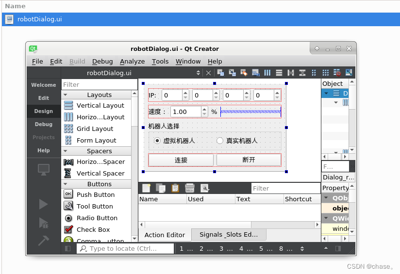
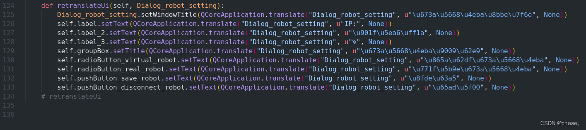
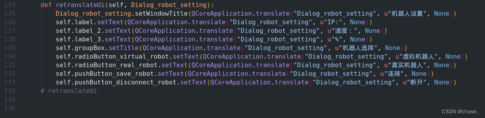

**1. 制作UI**
平时使用QT creator设计器设计UI，然后可将其转化成`.py`文件，以供`.py`脚本使用。

**2.Pyside6 转换ui为`.py`文件**
pyside6使用过程：
```bash
pyside6-uic UI/robotDialog.ui > UI/robot_dialog.py
```

生成的py文件：

**3. `.py`文件国际化**
通过pyside6-uic生成的`.py`代码中，中文或文本将使用unicode表示，即："机器人设置"（u"\u673a\u5668\u4eba\u8bbe\u7f6e"），可在ascii2uni官网安装ascii2uni，然后用以下的命令执行，可生成涵盖中文的`.py`文件。

```bash
pyside6-uic UI/robotDialog.ui | ascii2uni -a U > UI/robot_dialog.py
```
生成的py文件：

