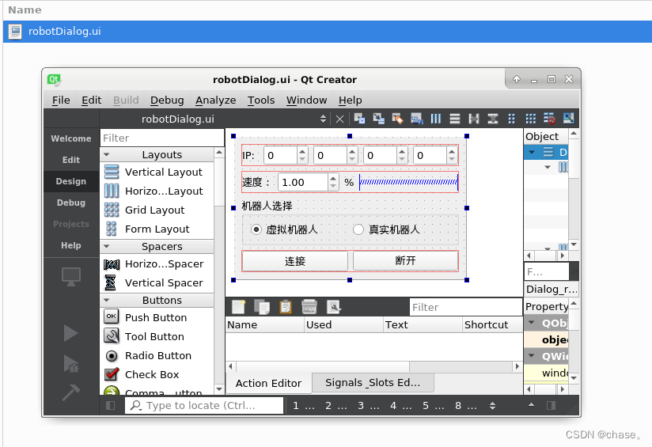
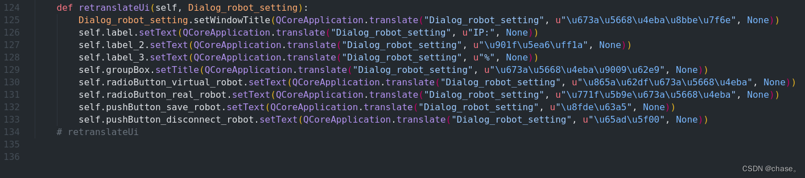
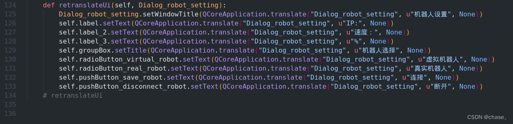

## UI 文件与业务代码分开维护

Qt Designer / Qt Creator 保存的 `.ui` 是界面描述文件。`pyside6-uic` 将其转换成 Python 类，业务逻辑通过导入生成类来使用；不要直接编辑生成文件，否则下次转换会覆盖修改。



## 1. 使用同一 PySide6 环境转换

先下载本文的 [最小 UI 文件](robot-dialog.ui)，保存到项目的 `UI/robot-dialog.ui`；新建空的 `UI/__init__.py`，目录结构如下。它是专门用于复现的两控件示例，并非历史截图中完整的机器人界面。

```text
demo/
├── main.py
└── UI/
    ├── __init__.py
    ├── robot-dialog.ui
    └── robot_dialog.py  # 由下一步命令生成
```

在 `demo` 目录中运行：

```bash
python -m pip show PySide6
command -v pyside6-uic
pyside6-uic UI/robot-dialog.ui -o UI/robot_dialog.py
```

确认目标 `UI` 目录已存在，并且 `pyside6-uic` 来自运行程序所用的环境。不要用 PyQt5 的转换工具生成代码后再按 PySide6 导入。



## 2. 在业务文件中实例化

保存为 `main.py`。本文 UI 的类名为 `Ui_Dialog`、基类为 `QDialog`，控件名为 `applyButton` 和 `statusLabel`；换用自己的 UI 时，需要同时核对这些名称。

```python
import sys
from PySide6.QtCore import Slot
from PySide6.QtWidgets import QApplication, QDialog
from UI.robot_dialog import Ui_Dialog


class RobotDialog(QDialog):
    def __init__(self):
        super().__init__()
        self.ui = Ui_Dialog()
        self.ui.setupUi(self)
        self.applied_count = 0
        self.ui.applyButton.clicked.connect(self.apply_settings)

    @Slot()
    def apply_settings(self):
        self.applied_count += 1
        self.ui.statusLabel.setText(f"已应用 {self.applied_count} 次")


if __name__ == "__main__":
    app = QApplication(sys.argv)
    window = RobotDialog()
    window.show()
    sys.exit(app.exec())
```

执行 `python main.py`，连续点击两次“应用设置”，应显示“已应用 2 次”。修改 `.ui` 的窗口标题并重新转换，业务类不需要改动；再次启动后，按钮仍应正常计数。每次启动计数重新从零开始，并不持久化设置。

有图标等 Qt 资源时，还需要使用 `pyside6-rcc` 处理对应 `.qrc` 文件，并确认生成模块的导入路径。无桌面 CI 可用 `QT_QPA_PLATFORM=offscreen` 验证控件创建和信号，但这不能代替桌面平台插件、字体和实际显示的测试。

## 3. Unicode 转义不等于国际化失败

源码中的 `"\u673a\u5668\u4eba"` 和 `"机器人"` 表示同一个 Python 字符串，无需通过 `ascii2uni` 重写生成文件。历史截图中的差异只是源码显示方式：



真正的多语言国际化需要 Qt 的翻译提取、翻译文件与 `QTranslator` 工作流；改变字符串转义形式不会生成翻译。验收时检查窗口实际显示、信号连接和重新生成后业务逻辑是否保持。

参考：[Qt for Python：使用 UI 文件](https://doc.qt.io/qtforpython-6/tutorials/basictutorial/uifiles.html)。


## 阅读自测与验收

- 修改一次 .ui 后重新生成代码，检查业务逻辑是否仍完整；业务代码不应依靠手动修改生成文件来保存。
- 在实际解释器中核对 PySide6 及 pyside6-uic 来源，测试窗口关闭与信号槽连接，避免系统工具和虚拟环境混用。
