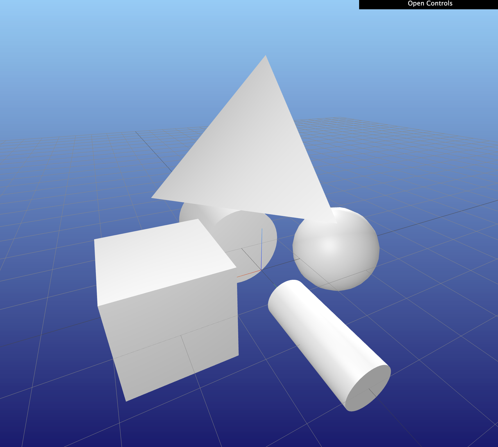

### 1. MeshCat 概述
- 源码仓库: [GitHub](https://github.com/rdeits/meshcat)

MeshCat 是一个基于 [three.js](https://threejs.org/) 构建的远程可控 3D 查看器, 特别适用于机器人学和仿真领域。它可以与 Python 结合使用，提供交互式的 3D 可视化功能。用户可通过浏览器访问 MeshCat 界面，并通过 WebSocket 发送几何指令动态构建场景树。其设计支持多语言接口，目前提供：

* [meshcat-python (Python 2.7/3.4+)](https://github.com/rdeits/meshcat-python)
* [MeshCat.jl (Julia)](https://github.com/rdeits/MeshCat.jl)
---
### 2. 安装 MeshCat

首先，确保你已经安装了 MeshCat。你可以使用 pip 进行安装：

```bash
pip install meshcat
```
---
## 3. 核心功能

### 3.1 程序化 API
#### 创建查看器实例
```js
let viewer = new MeshCat.Viewer(dom_element);
```
- `dom_element`：承载查看器的 DOM 元素容器。

#### 指令处理函数
```js
Viewer.handle_command(cmd)
```
支持以下指令类型：


### 3.2 场景对象操作
#### **set_object** - 设置场景对象
```json
{
  "type": "set_object",
  "path": "/meshcat/box",
  "object": {
    "metadata": {"version": 4.5, "type": "Object"},
    "geometries": [{
      "uuid": "...",
      "type": "BoxGeometry",
      "width": 1, "height": 1, "depth": 1
    }],
    "materials": [{
      "uuid": "...",
      "type": "MeshLambertMaterial",
      "color": 16777215
    }],
    "object": {
      "uuid": "...",
      "type": "Mesh",
      "geometry": "...",
      "material": "..."
    }
  }
}
```
- **特殊格式支持**：
  - `_meshfile_geometry`：直接加载 OBJ/DAE/STL 网格文件
  - `_text`：生成文字纹理
  - `_meshfile_object`：加载完整网格文件及材质

#### **set_transform** - 设置变换矩阵
```json
{
  "type": "set_transform",
  "path": "/meshcat/box",
  "matrix": [1,0,0,0, 0,1,0,0, 0,0,1,0, 0.5,0,0.5,1] 
}
```
- `matrix`：16元素列优先浮点数组

#### **delete** - 删除对象
```json
{
  "type": "delete",
  "path": "/meshcat/box"
}
```

#### **set_property** - 设置对象属性
```json
{
  "type": "set_property",
  "path": "/Lights/DirectionalLight",
  "property": "intensity",
  "value": 1.0
}
```
- **支持属性链**：如 `material.shininess`
- **常用属性**：
  - `visible`：可见性
  - `position`/`quaternion`/`scale`：变换参数
  - `color`/`opacity`：材质属性

---

### 3.3 动画与交互
#### **set_animation** - 设置动画
```json
{
  "type": "set_animation",
  "animations": [{
    "path": "/Cameras/default",
    "clip": {
      "fps": 30,
      "tracks": [{
        "name": ".position",
        "type": "vector3",
        "keys": [
          {"time":0, "value":[0,1,0.3]},
          {"time":80, "value":[0,1,2]}
        ]
      }]
    }
  }],
  "options": {"play": true}
}
```

#### **set_target** - 设置相机焦点
```json
{
  "type": "set_target",
  "value": [0, 1, 0]
}
```

#### **capture_image** - 截图
```json
{
  "type": "capture_image",
  "xres": 1920,
  "yres": 1080
}
```

---

### 3.4 WebSocket 通信
```js
Viewer.connect(url) // 连接 WebSocket 服务器
```
- 消息格式：二进制 MsgPack
- 支持扩展类型：`Float32Array`, `Uint32Array` 等

---

## 4. 实用场景路径
| 路径                    | 描述               |
|-------------------------|--------------------|
| `/Lights/DirectionalLight` | 定向光源         |
| `/Grid`                 | 网格平面           |
| `/Axes`                 | 坐标系（默认隐藏） |
| `/Cameras/default`      | 主摄像机           |
| `/Background`           | 背景颜色控制       |

---

## 5. 相机控制技巧
### 5.1 设置相机焦点与位置
```json
[
  {
    "type": "set_transform",
    "path": "/Cameras/default",
    "matrix": [1,0,0,0, 0,1,0,0, 0,0,1,0, 1,2,3,1]
  },
  {
    "type": "set_property",
    "path": "/Cameras/default/rotated/<object>",
    "property": "position",
    "value": [2, 0, 0]
  }
]
```

### 5.2 锁定相机视角
```json
{
  "type": "set_property",
  "path": "/Cameras/default/rotated/<object>",
  "property": "position",
  "value": [0, 0, 0]
}
```

## 6. 高级特性
### 6.1 透明度控制
```json
{
  "type": "set_property",
  "path": "/path/to/object",
  "property": "modulated_opacity",  # 叠加透明度 (0.0-1.0)
  "value": 0.5
}
```

### 6.2 自定义渲染回调
```json
{
  "type": "set_render_callback",
  "callback": "() => { console.log(this.camera.position); }"
}
```

---


### 7. 基本使用案例

以下是一个简单的使用 MeshCat 进行 3D 可视化的案例。

```python
import meshcat
import meshcat.geometry as g
import meshcat.transformations as tf
import numpy as np

# 创建一个新的 MeshCat 视图
vis = meshcat.Visualizer().open()

# 添加一个立方体到场景中
vis["cube"].set_object(g.Box([1, 1, 1]))

# 设置立方体的变换矩阵
vis["cube"].set_transform(tf.translation_matrix([1, 0, 0]))

# 添加一个球体到场景中
vis["sphere"].set_object(g.Sphere(0.5))

# 设置球体的变换矩阵
vis["sphere"].set_transform(tf.translation_matrix([-1, 0, 0]))

# 添加一个圆柱体到场景中
vis["cylinder"].set_object(g.Cylinder(1, 0.2))

# 设置圆柱体的变换矩阵
vis["cylinder"].set_transform(tf.translation_matrix([0, 1, 0]))

# 使用圆柱体模拟锥体
vis["cone"].set_object(g.Cylinder(1, 0.5))

# 设置锥体的变换矩阵
vis["cone"].set_transform(tf.translation_matrix([0, -1, 0]))

# 添加一个网格到场景中
vertices = np.array([
    [0, 0, 0],
    [1, 0, 0],
    [0, 1, 0],
    [0, 0, 1]
])
faces = np.array([
    [0, 1, 2],
    [0, 1, 3],
    [0, 2, 3],
    [1, 2, 3]
])
vis["mesh"].set_object(g.TriangularMeshGeometry(vertices, faces))

# 设置网格的变换矩阵
vis["mesh"].set_transform(tf.translation_matrix([0, 0, 1]))

# 打开浏览器查看可视化结果
vis.open()
```

#### 详细说明

- **创建 Visualizer**：`vis = meshcat.Visualizer().open()` 创建一个新的 MeshCat 视图，并在浏览器中打开。
- **添加几何对象**：使用 `set_object` 方法添加几何对象，如立方体、球体、圆柱体和锥体。
- **设置变换矩阵**：使用 `set_transform` 方法设置几何对象的变换矩阵，以控制其位置和姿态。
- **添加网格**：使用 `TriangularMeshGeometry` 方法添加自定义网格。

#### 运行代码

运行上述代码后，MeshCat 会在浏览器中打开一个窗口，显示添加的几何对象和网格。你可以通过拖动鼠标来旋转、缩放和平移视图。




### 总结

MeshCat 是一个强大的 3D 可视化工具，适用于各种机器人学和仿真应用。通过简单的 Python 代码，你可以轻松地创建和操作 3D 场景。希望这个案例能帮助你快速上手 MeshCat。

