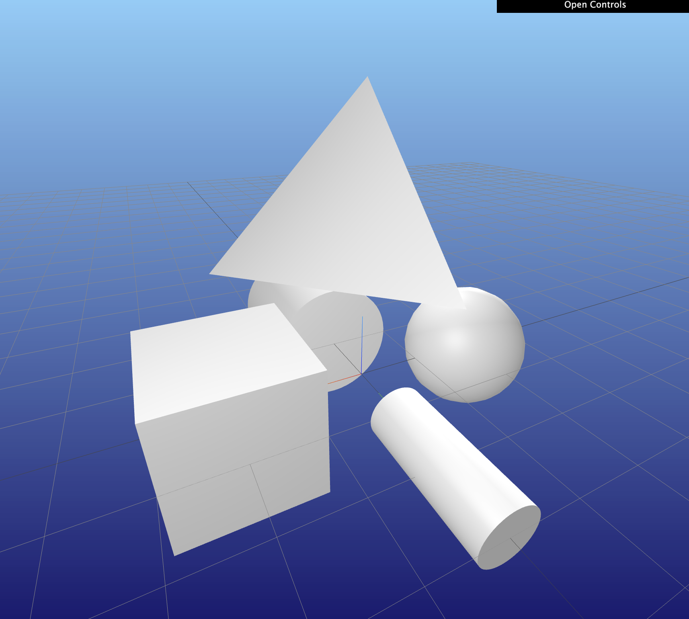

## Python 客户端、服务器和浏览器各做什么

MeshCat 使用浏览器显示 three.js 场景，由 Python 等客户端更新场景树。使用 Python 时通常只需操作 `meshcat.Visualizer`；底层消息协议中的 JSON/MsgPack 示例不等于可直接执行的 Python API。

参考：[meshcat-python](https://github.com/rdeits/meshcat-python)、[MeshCat 查看器](https://github.com/rdeits/meshcat)。

## 安装与最小场景

```bash
python -m pip install meshcat numpy
python -m pip show meshcat
```

保存以下程序运行，打开打印出的地址查看。坐标单位由应用约定，示例按米理解；`set_transform` 使用 $4\times4$ 齐次矩阵，平移位于最后一列。

先确认开发机器的网络隔离或防火墙策略。本文核对的 meshcat-python 0.3.2 虽会打印 `127.0.0.1` URL，但其 HTTP 服务启动代码未限定监听地址；**打印本地 URL 不代表只监听本机**。不要在不受保护的共享服务器上直接运行这个默认服务，远程使用前还要确认下文的两个服务端口。

```python
import meshcat
import meshcat.geometry as g
import meshcat.transformations as tf
import numpy as np

vis = meshcat.Visualizer()
print("Viewer URL:", vis.url())

vis["demo/cube"].set_object(
    g.Box([0.4, 0.4, 0.4]), g.MeshLambertMaterial(color=0x79A9D1)
)
vis["demo/cube"].set_transform(tf.translation_matrix([0.6, 0, 0.2]))
vis["demo/sphere"].set_object(
    g.Sphere(0.2), g.MeshLambertMaterial(color=0x99C7AA)
)
vis["demo/sphere"].set_transform(tf.translation_matrix([-0.6, 0, 0.2]))
vis["demo/cylinder"].set_object(g.Cylinder(0.6, 0.15))
# three.js 圆柱的高度沿局部 Y 轴；旋转后让它沿世界 Z 轴直立。
cylinder_pose = tf.translation_matrix([0, 0.5, 0.3]) @ tf.rotation_matrix(
    np.pi / 2, [1, 0, 0]
)
vis["demo/cylinder"].set_transform(cylinder_pose)

# 四面体：顶点和三角面分别是 (N, 3) 与 (M, 3)。
vertices = np.array([
    [0, 0, 0], [0.4, 0, 0], [0, 0.4, 0], [0, 0, 0.4]
], dtype=np.float32)
faces = np.array([
    [0, 2, 1], [0, 1, 3], [0, 3, 2], [1, 2, 3]
], dtype=np.int32)
vis["demo/tetrahedron"].set_object(g.TriangularMeshGeometry(vertices, faces))
input("Open the viewer, then press Enter to finish...\n")
```

几何体以自己的局部坐标建模：圆柱默认沿 Y 轴，不是 Z 轴。这里先绕 X 轴旋转，再平移，使高度为 0.6 的圆柱中心位于 z=0.3、底面接触 z=0；矩阵乘法顺序不能交换。`Cylinder` 仍是圆柱，不会因命名为 `cone` 变成圆锥。需要特殊几何时，应使用已确认支持的几何参数或导入真实网格。

局部轴的实现可对照 [three.js CylinderGeometry 源码](https://github.com/mrdoob/three.js/blob/master/src/geometries/CylinderGeometry.js)，其中高度写入顶点的 Y 分量。



## 场景树与局部变换

路径形成父子关系，例如 `robot/arm/tool`。对父节点设置变换，会影响所有子节点；工具在世界坐标中的位姿是沿路径的局部变换连乘。

常用操作片段，放在上面完整场景的 `input(...)` 之前：

```python
vis["demo/cube"].set_property("visible", False)
vis["demo/cube"].set_property("visible", True)
vis["demo/cube"].set_transform(tf.translation_matrix([0.8, 0, 0.2]))
vis["demo/tetrahedron"].delete()  # 只删除这个子树
```

更新运动时优先复用对象并改变变换，不必每帧重新发送大网格。先确认物体的局部轴与机器人 FK 轴一致，再连接实时数据。

## 远程查看与安全边界

远程服务器通常不会替你打开本机浏览器。确认服务监听地址和实际端口，再使用 SSH 本地转发，例如：

```bash
ssh -L 7000:127.0.0.1:7000 user@server
```

`7000` 只是示例，必须与 `vis.url()` 和服务配置一致。用 `ss -ltnp` 检查实际监听：浏览器使用 HTTP/WebSocket 端口，Python 客户端另使用 ZeroMQ 端口，两者都需要保护。SSH 隧道只提供访问路径，不会自动收窄原服务的监听范围；应使用已配置的网络隔离、防火墙或经验证的服务端绑定设置。不要直接暴露公网，访问控制和身份认证需要独立处理。

版本核对依据：[meshcat-python 服务启动实现](https://github.com/meshcat-dev/meshcat-python/blob/v0.3.2/src/meshcat/servers/zmqserver.py)。升级后应再次检查实际监听，而不是依赖本文的旧版本默认值。

## 排障顺序

1. 浏览器完全打不开：检查服务器进程、URL、端口与转发。
2. 页面打开但场景不更新：查看浏览器 WebSocket 和脚本错误，确认客户端连接的是同一服务。
3. 几何体不可见：检查尺度、相机、透明度、父节点可见性和矩阵方向。
4. 动画抖动：检查发送频率与时间戳；MeshCat 是可视化工具，不是硬实时控制通道。

底层协议会随查看器版本变化，不应使用未经该版本文档确认的 `set_render_callback` 等消息。普通使用先从 Python 客户端公开 API 开始。


## 阅读自测与验收

- 只添加一个几何体并单独改变父节点变换，检查子节点是否按场景树继承；坐标系错位时先查变换层级。
- 通过本机或 SSH 隧道验证浏览器可访问，并确保 Python 服务仍在运行；页面能打开不等于场景已经收到几何数据。
