本文按 I/O → 空间索引 → 滤波与变换 → 配准 → 重建组织，是 legacy `open3d.geometry` API 的学习笔记，不是一个从头连续执行的脚本。完整示例与依赖前文变量的接口片段分别使用；Tensor API `open3d.t.geometry` 的设备与数据类型不能直接混用。

第一次使用时，可以按下面的问题选择入口；不必先记住所有函数参数。

| 当前问题 | 推荐先读 | 最小验收 |
| --- | --- | --- |
| 点云是否读对了？ | 第 3 节 I/O、第 7 节完整预处理流程 | 非空、有限值、单位和包围范围正确 |
| 点太多或有孤立噪声？ | 第 7 节过滤 | 同时记录点数、几何范围和被删除区域 |
| 两次扫描如何放到同一坐标系？ | 第 8 节变换、第 10 节配准 | 变换方向正确，误差与覆盖一起检查 |
| 如何把点变成表面？ | 第 9 节法线、第 11 节重建 | 法线及尺度合适，空洞和外推区域可解释 |
| 只想得到边界或快速占用表示？ | 第 12–14 节 | 区分包围盒、凸包、占用体素与真实表面 |

本文以 0.19.0 的 legacy API 为基线。先打印 `open3d.__version__`，将模型路径替换为自己的数据。点云非空、尺度一致、有足够重叠和正确法线，比调大迭代次数更重要。

- [Open3D 官网](https://www.open3d.org/)
- [Open3D GitHub 仓库](https://github.com/isl-org/Open3D)


## 1. 概述

Open3D 是一个开源库，旨在为 3D 数据处理提供高效且易用的工具。支持多种 3D 数据处理任务，如点云处理、3D 重建、几何处理和可视化等。

### 1.1 主要功能

- 点云处理：
  - 支持点云的读取、写入和可视化。
  - 提供点云滤波、配准、分割和特征提取等功能。
- 3D 重建：
  - 支持从深度图像生成 3D 网格。
  - 提供多视图 3D 重建算法。
- 几何处理：
  - 支持对三角网格、体素网格和曲面的处理。
  - 提供几何变换与简化；网格布尔运算使用 Tensor `open3d.t.geometry.TriangleMesh` 接口，不能直接在 legacy 网格上调用。
- 可视化：
  - 提供交互式的 3D 可视化工具。
  - 支持点云、网格和体素的渲染。
- 机器学习：
  - 提供与深度学习框架的集成，支持 3D 数据的机器学习任务。

例如 0.19.0 的 [`boolean_union`](https://www.open3d.org/docs/0.19.0/python_api/open3d.t.geometry.TriangleMesh.html#open3d.t.geometry.TriangleMesh.boolean_union) 要求合适的流形网格，并在 CPU 上执行；把数据放到 Tensor API 中，不代表每个操作都会使用 GPU。

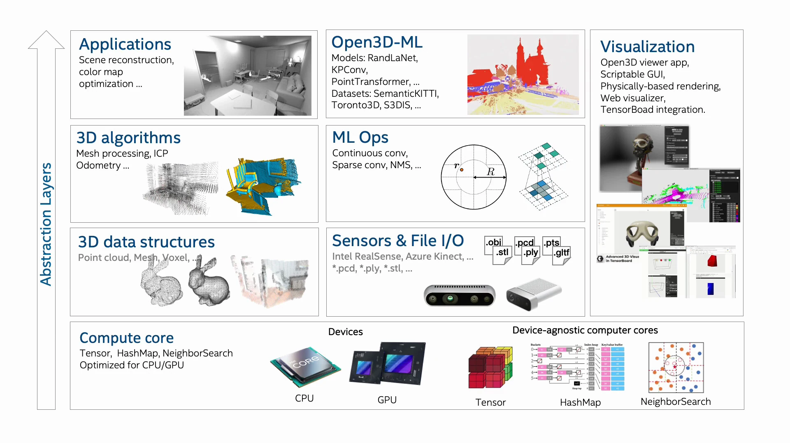

## 2. 安装

### 2.1 在独立环境中选择一种安装包 {#21-安装-open3d}

<span id="方法一通过-pip-安装"></span>
<span id="方法二手动安装"></span>
<span id="方法三安装-cpu-版本"></span>
<span id="方法四源码安装"></span>

下面以 Python 3.10 和 Open3D 0.19.0 为复现基线。先选择环境，再用同一个解释器安装；不需要 CUDA 的 Linux x86_64 环境可使用 CPU wheel：

```bash
python3.10 -m venv .venv-open3d
source .venv-open3d/bin/activate
python -m pip install "open3d-cpu==0.19.0"
python -c "import sys, open3d as o3d; print(sys.executable); print(o3d.__version__, o3d.__file__)"
```

需要标准发行包时，在另一个干净环境安装 `open3d==0.19.0`。`open3d` 与 `open3d-cpu` 都提供同名导入模块，选择一种即可。wheel 是否可用还取决于 Python、操作系统、CPU 架构和系统库版本；没有匹配包时，先检查平台标签，不要只反复升级 pip。

```bash
python -m pip debug --verbose
python -m pip check
```

`cp310` 指 CPython 3.10，`x86_64` 也不能用于 ARM64。历史 `cp39` wheel 不适用于 Python 3.10。平台范围与安装方式可查 [0.19.0 安装文档](https://www.open3d.org/docs/0.19.0/getting_started.html)；需要自行编译时使用对应版本的[源码构建说明](https://www.open3d.org/docs/0.19.0/compilation.html)。CPU 数值计算与窗口渲染是不同能力：安装 CPU 包不会自动解决显示服务、OpenGL 或 EGL 问题。

### 2.2 使用 Open3D 与构建 Open3D 是两件事 {#22-第三方库管理}

Python 用户安装 wheel 后直接导入；C++ 应用通常链接已经安装的 Open3D SDK：

```cmake
cmake_minimum_required(VERSION 3.18)
project(point_cloud_app LANGUAGES CXX)
find_package(Open3D CONFIG REQUIRED)
add_executable(point_cloud_app main.cpp)
target_link_libraries(point_cloud_app PRIVATE Open3D::Open3D)
```

该片段假定已有 `main.cpp` 与可被 CMake 找到的 SDK，单独安装 Python wheel 不等于安装了完整 C++ 开发环境。通过 `Open3D_DIR` 或 `CMAKE_PREFIX_PATH` 指向 SDK 配置文件位置，详见 [C++ 链接指南](https://www.open3d.org/docs/0.19.0/cpp_project.html)。

只有从源码构建 Open3D 时，才需要关注它如何组织第三方依赖。0.19.0 的目录名是 `3rdparty/`；例如 [Filament 构建文件](https://github.com/isl-org/Open3D/blob/v0.19.0/3rdparty/filament/filament_build.cmake)通过 `ExternalProject_Add` 获取固定源码并构建，不能用一个假定存在的 `add_subdirectory(third_party/filament)` 替代。具体系统库选项、下载缓存与构建目标应按所选源码版本核对。

### 2.3 编译原理

1. **CMake 配置**：
   - Open3D 使用 CMake 作为构建系统。CMakeLists.txt 文件定义了项目的构建配置，包括源文件、依赖项、编译选项等。
   - CMake 会生成适合目标平台的构建文件（如 Makefile 或 Visual Studio 项目文件）。

2. **依赖项管理**：
   - Open3D 依赖多个第三方库，如 Eigen（用于线性代数计算）、GLFW（用于窗口管理）、Pybind11（用于 Python 绑定）等。
   - CMake 会自动查找和配置这些依赖项。

3. **编译和链接**：
   - CMake 生成的构建文件会调用编译器（如 GCC 或 Clang）编译源代码，并链接生成目标文件（如库或可执行文件）。
   - 编译过程中会根据配置选项启用或禁用某些功能模块。

4. **Python 绑定**：
   - 如果启用了 Python 绑定，Open3D 会使用 Pybind11 生成 Python 模块，使得 Open3D 可以在 Python 中使用。
   - 编译过程中会生成 `_pybind` 模块，并将其安装到 Python 的包目录中。


## 3. 点云写入、读取、可视化

`open3d.io.write_point_cloud` 是一个用于将点云数据写入文件的函数。
`open3d.io.read_point_cloud` 是一个用于从文件中读取点云数据的函数。
`open3d.visualization.draw_geometries` 是一个用于可视化几何对象列表的函数。

### 3.1 点云写入文件

```text
open3d.io.write_point_cloud(
    filename: os.PathLike,
    pointcloud: open3d.geometry.PointCloud,
    format: str = 'auto',
    write_ascii: bool = False,
    compressed: bool = False,
    print_progress: bool = False
) -> bool
```

参数说明
`filename (os.PathLike)`：文件路径。
`pointcloud (open3d.geometry.PointCloud)`：要写入的 PointCloud 对象。
`format (str, optional, default='auto')`：输出文件的格式。当未指定或设置为 auto 时，格式将从文件扩展名推断。
`write_ascii (bool, optional, default=False)`：如果为 True，则以 ASCII 格式输出，否则使用二进制格式。
`compressed (bool, optional, default=False)`：如果为 True，则以压缩格式写入。
`print_progress (bool, optional, default=False)`：如果为 True，在控制台中显示进度条。

### 3.2 读取点云文件

```text
open3d.io.read_point_cloud(
    filename: os.PathLike,
    format: str = 'auto',
    remove_nan_points: bool = False,
    remove_infinite_points: bool = False,
    print_progress: bool = False
) -> open3d.geometry.PointCloud
```

参数说明
`filename (os.PathLike)`：文件路径。
`format (str, optional, default='auto')`：输入文件的格式。当未指定或设置为 auto 时，格式将从文件扩展名推断。
`remove_nan_points (bool, optional, default=False)`：如果为 True，则移除包含 NaN 值的点。
`remove_infinite_points (bool, optional, default=False)`：如果为 True，则移除包含无限值的点。
`print_progress (bool, optional, default=False)`：如果为 True，在控制台中显示进度条。

### 3.3 可视化点云

```text
open3d.visualization.draw_geometries(
    geometry_list: list[open3d.geometry.Geometry],
    window_name: str = 'Open3D',
    width: int = 1920,
    height: int = 1080,
    left: int = 50,
    top: int = 50,
    point_show_normal: bool = False,
    mesh_show_wireframe: bool = False,
    mesh_show_back_face: bool = False,
    lookat: numpy.ndarray[numpy.float64[3, 1]] | None = None,
    up: numpy.ndarray[numpy.float64[3, 1]] | None = None,
    front: numpy.ndarray[numpy.float64[3, 1]] | None = None,
    zoom: float | None = None
) -> None
```

参数说明
`geometry_list (list[open3d.geometry.Geometry])`：要可视化的几何对象列表。
`window_name (str, optional, default='Open3D')`：可视化窗口的标题。
`width (int, optional, default=1920)`：可视化窗口的宽度。
`height (int, optional, default=1080)`：可视化窗口的高度。
`left (int, optional, default=50)`：可视化窗口的左边距。
`top (int, optional, default=50)`：可视化窗口的上边距。
`point_show_normal (bool, optional, default=False)`：如果为 True，则显示点的法线。
`mesh_show_wireframe (bool, optional, default=False)`：如果为 True，则显示网格的线框。
`mesh_show_back_face (bool, optional, default=False)`：如果为 True，则显示网格三角形的背面。
`lookat (Optional[numpy.ndarray[numpy.float64[3, 1]]], optional, default=None)`：相机的 lookat 向量。
`up (Optional[numpy.ndarray[numpy.float64[3, 1]]], optional, default=None)`：相机的 up 向量。
`front (Optional[numpy.ndarray[numpy.float64[3, 1]]], optional, default=None)`：相机的 front 向量。
`zoom (Optional[float], optional, default=None)`：相机的缩放。

### 3.4 使用案例

```python
import open3d as o3d
import numpy as np

# 生成一个简单的点云（例如，一个立方体的顶点）
points = np.array([
    [0, 0, 0],
    [1, 0, 0],
    [1, 1, 0],
    [0, 1, 0],
    [0, 0, 1],
    [1, 0, 1],
    [1, 1, 1],
    [0, 1, 1],
])

# 创建 PointCloud 对象
pcd = o3d.geometry.PointCloud()

# 将点添加到 PointCloud 对象中
pcd.points = o3d.utility.Vector3dVector(points)

# 保存点云到文件
o3d.io.write_point_cloud("generated_point_cloud.ply", pcd)

# 读取点云文件
load_pcd = o3d.io.read_point_cloud("generated_point_cloud.ply")

# 可视化点云
o3d.visualization.draw_geometries([load_pcd])
```

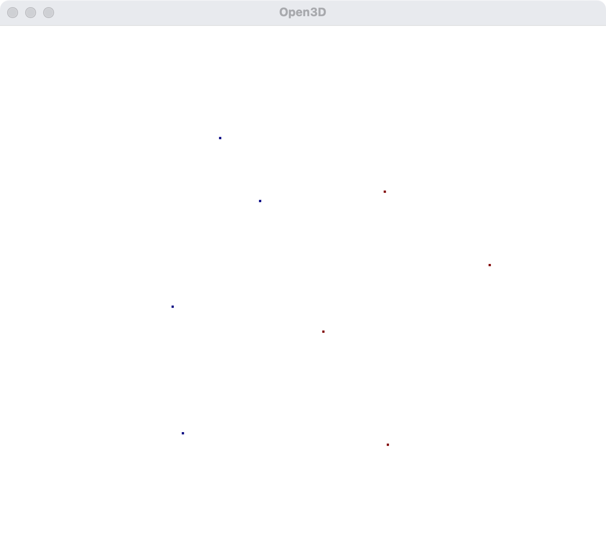

## 4. TriangleMesh 读取、保存

下面的代码节选自 Open3D 0.19.0 的 [TriangleMeshIO.cpp](https://github.com/isl-org/Open3D/blob/v0.19.0/cpp/open3d/io/TriangleMeshIO.cpp)：

```cpp
static const std::unordered_map<
        std::string,
        std::function<bool(const std::string &,
                           geometry::TriangleMesh &,
                           const ReadTriangleMeshOptions &)>>
        file_extension_to_trianglemesh_read_function{
                {"ply", ReadTriangleMeshFromPLY},
                {"stl", ReadTriangleMeshUsingASSIMP},
                {"obj", ReadTriangleMeshUsingASSIMP},
                {"off", ReadTriangleMeshFromOFF},
                {"gltf", ReadTriangleMeshUsingASSIMP},
                {"glb", ReadTriangleMeshUsingASSIMP},
                {"fbx", ReadTriangleMeshUsingASSIMP},
        };

static const std::unordered_map<
        std::string,
        std::function<bool(const std::string &,
                           const geometry::TriangleMesh &,
                           const bool,
                           const bool,
                           const bool,
                           const bool,
                           const bool,
                           const bool)>>
        file_extension_to_trianglemesh_write_function{
                {"ply", WriteTriangleMeshToPLY},
                {"stl", WriteTriangleMeshToSTL},
                {"obj", WriteTriangleMeshToOBJ},
                {"off", WriteTriangleMeshToOFF},
                {"gltf", WriteTriangleMeshToGLTF},
                {"glb", WriteTriangleMeshToGLTF},
        };

}  // unnamed namespace
```

这段分发表中，部分格式的读取交给 Assimp，另一些使用专用读取器；写入则按扩展名选择对应的写入函数，不能概括为全部读写都走 Assimp。以下是这一版本列出的格式：

### 4.1 支持的读取文件格式

- `ply` (使用 `ReadTriangleMeshFromPLY` 函数)
- `stl` (使用 `ReadTriangleMeshUsingASSIMP` 函数)
- `obj` (使用 `ReadTriangleMeshUsingASSIMP` 函数)
- `off` (使用 `ReadTriangleMeshFromOFF` 函数)
- `gltf` (使用 `ReadTriangleMeshUsingASSIMP` 函数)
- `glb` (使用 `ReadTriangleMeshUsingASSIMP` 函数)
- `fbx` (使用 `ReadTriangleMeshUsingASSIMP` 函数)

### 4.2 支持的写入文件格式

- `ply` (使用 `WriteTriangleMeshToPLY` 函数)
- `stl` (使用 `WriteTriangleMeshToSTL` 函数)
- `obj` (使用 `WriteTriangleMeshToOBJ` 函数)
- `off` (使用 `WriteTriangleMeshToOFF` 函数)
- `gltf` (使用 `WriteTriangleMeshToGLTF` 函数)
- `glb` (使用 `WriteTriangleMeshToGLTF` 函数)

这些函数通过文件扩展名与相应的读取和写入函数进行映射，从而支持多种三角网格文件格式的读写操作。


### 4.3 TriangleMesh 读取

`open3d.io.read_triangle_mesh`

```text
open3d.io.read_triangle_mesh(
filename: os.PathLike,
enable_post_processing:
bool = False,
print_progress: bool = False
) → open3d.geometry.TriangleMesh
```

参数说明
`filename`：文件路径，类型为 os.PathLike。
`enable_post_processing`：是否启用后处理，类型为 bool，默认值为 False。
`print_progress`：是否在控制台显示进度条，类型为 bool，默认值为 False。


```python
import open3d as o3d

# 定义文件路径
filename = "doll.stl"

try:
    # 尝试读取三角网格
    mesh = o3d.io.read_triangle_mesh(filename, enable_post_processing=True, print_progress=True)

    # 检查网格是否成功读取
    if mesh.is_empty():
        print("Failed to read the mesh. The file format may not be supported.")
    else:
        print("Successfully read the mesh.")
        # 可视化三角网格
        o3d.visualization.draw_geometries([mesh])
except Exception as e:
    print(f"An error occurred: {e}")
```

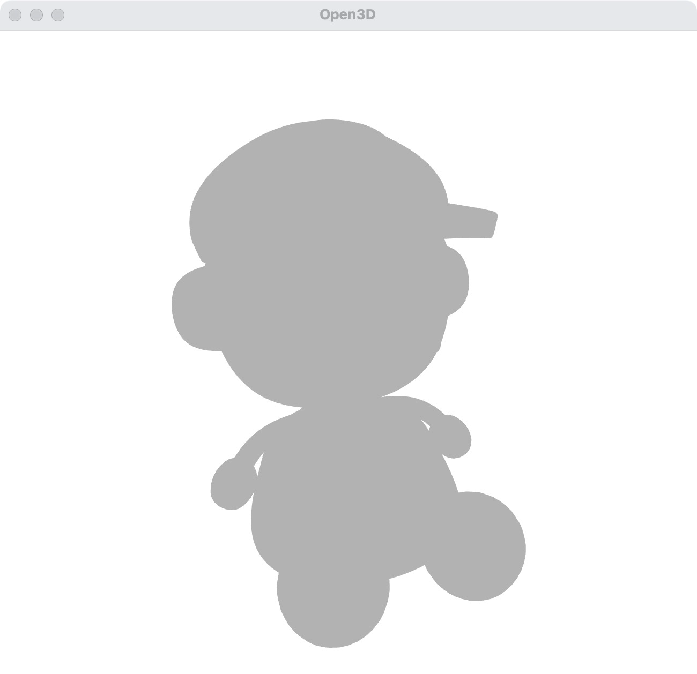

若网格缺少顶点法线，可以调用 `compute_vertex_normals()` 计算法线，以便观察光照下的表面形状。法线与颜色是不同属性：下例另外调用 `paint_uniform_color()` 将网格设为红色。

```python
import open3d as o3d
import numpy as np

# 定义文件路径
filename = "doll.stl"

# 读取三角网格
mesh = o3d.io.read_triangle_mesh(filename, enable_post_processing=True, print_progress=True)

# 检查网格是否成功读取
if mesh.is_empty():
    print("Failed to read the mesh. The file format may not be supported.")
else:
    print("Successfully read the mesh.")

    # 计算法线
    mesh.compute_vertex_normals()

    # 设置网格的颜色为红色
    mesh.paint_uniform_color([1, 0, 0])  # 设置为红色

    # 创建一个可视化窗口
    vis = o3d.visualization.Visualizer()
    vis.create_window()

    # 添加网格到可视化窗口
    vis.add_geometry(mesh)

    # 更新几何体和渲染器
    vis.update_geometry(mesh)
    vis.poll_events()
    vis.update_renderer()

    # 渲染
    vis.run()
    vis.destroy_window()

```

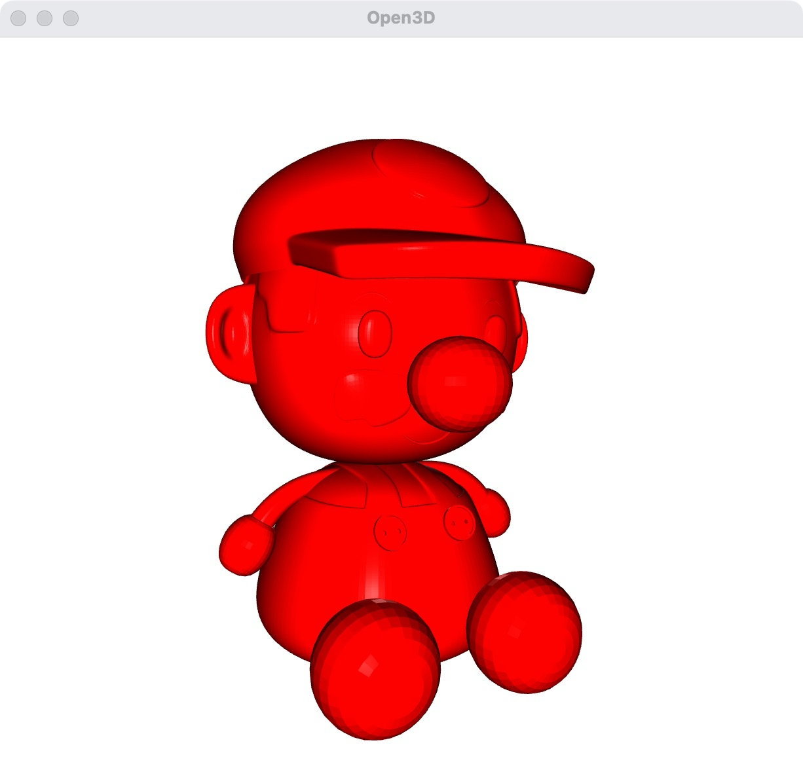

```python
import open3d as o3d
import numpy as np

# 定义文件路径
filename = "doll.stl"

# 读取三角网格
mesh = o3d.io.read_triangle_mesh(filename)
if mesh.is_empty():
    print("Failed to read the mesh. The file format may not be supported.")
else:
    print("Successfully read the mesh.")

    # 计算法线
    mesh.compute_vertex_normals()

    # 设置材质
    mat_box = o3d.visualization.rendering.MaterialRecord()
    mat_box.shader = 'defaultLitSSR'
    mat_box.base_color = [0.467, 0.467, 0.467, 0.2]  # 设置透明度为0.2
    mat_box.base_roughness = 0.0
    mat_box.base_reflectance = 0.0
    mat_box.base_clearcoat = 1.0
    mat_box.thickness = 1.0
    mat_box.transmission = 1.0
    mat_box.absorption_distance = 10
    mat_box.absorption_color = [0.5, 0.5, 0.5]

    # 使用draw函数渲染
    o3d.visualization.draw(
        [{'name': 'box', 'geometry': mesh, 'material': mat_box}],
        show_skybox=False,
        width=800,
        height=600,
        bg_color=[0.5, 0.5, 0.5, 0.8]  # 设置背景颜色为灰色
    )
```

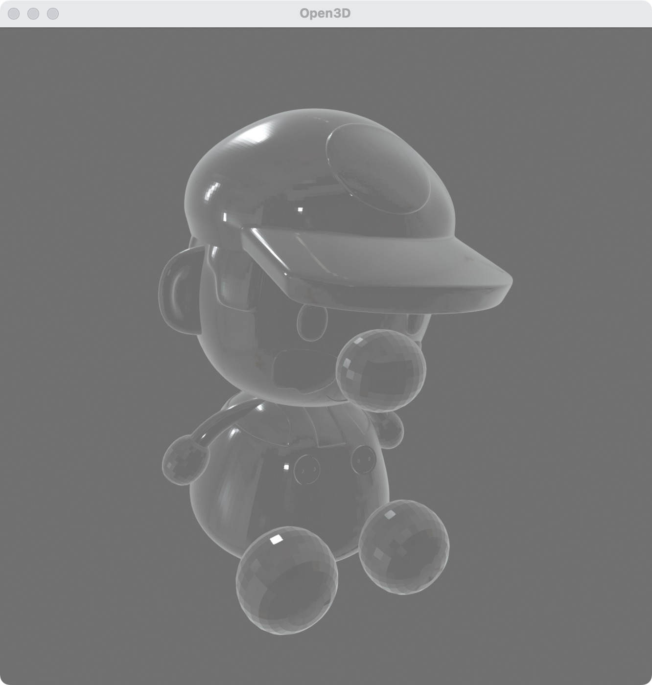


### 4.4 从mesh上提取点云

```python
import open3d as o3d
import numpy as np

# 定义文件路径
filename = "doll.stl"

# 读取三角网格
mesh = o3d.io.read_triangle_mesh(filename)
if mesh.is_empty():
    print("Failed to read the mesh. The file format may not be supported.")
else:
    print("Successfully read the mesh.")

    # 计算法线
    mesh.compute_vertex_normals()

    # 从mesh提取点云
    point_cloud = mesh.sample_points_uniformly(number_of_points=10000)

    # 设置材质
    mat_box = o3d.visualization.rendering.MaterialRecord()
    mat_box.shader = 'defaultLitSSR'
    mat_box.base_color = [0.467, 0.467, 0.467, 0.2]  # 设置透明度为0.2
    mat_box.base_roughness = 0.0
    mat_box.base_reflectance = 0.0
    mat_box.base_clearcoat = 1.0
    mat_box.thickness = 1.0
    mat_box.transmission = 1.0
    mat_box.absorption_distance = 10
    mat_box.absorption_color = [0.5, 0.5, 0.5]

    # 使用draw函数渲染
    o3d.visualization.draw(
        [{'name': 'box', 'geometry': mesh, 'material': mat_box},
         {'name': 'point_cloud', 'geometry': point_cloud}],
        show_skybox=False,
        width=800,
        height=600,
        bg_color=[0.5, 0.5, 0.5, 0.8]  # 设置背景颜色为灰色
    )
```

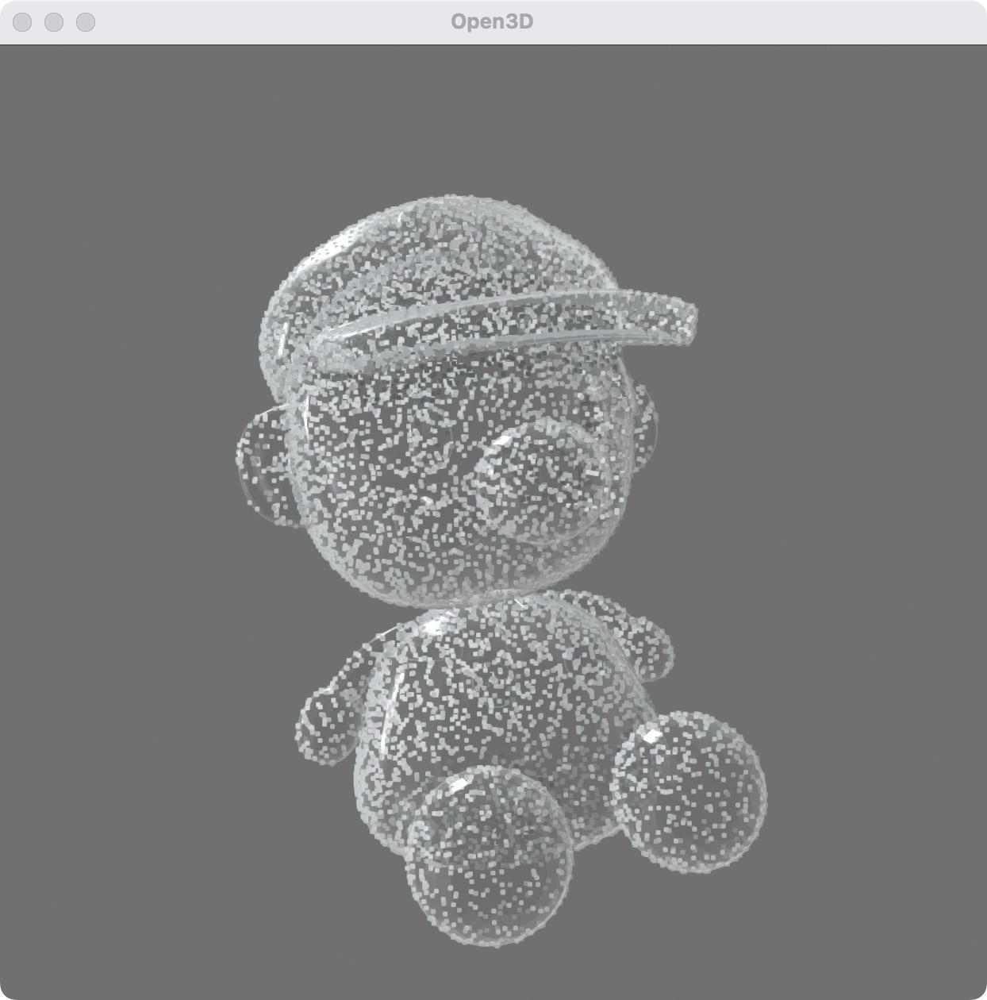


## 5. KD-Tree

### 5.1 KD-树 说明与算法原理

#### 5.1.1 KD-树的简介

KD 树按坐标轴划分空间，常用于低维几何数据的近邻查询。树高较小不代表每次最近邻查询只访问一条根到叶路径：回溯可能访问大量节点，最坏复杂度为 \(O(N)\)。动态插入和重新平衡属于具体实现的设计选择，不能自动归于所有 KD 树或 Open3D 的 KDTreeFlann。
更多背景可参考维基百科的 [k-d tree](https://en.wikipedia.org/wiki/K-d_tree) 条目。

#### 5.1.2 KD-树的构建

KD-树的构建过程如下：

1. **选择分割维度**：从根节点开始，依次选择各维度进行分割。通常选择数据点在该维度上的中位数作为分割点。
2. **递归构建子树**：将数据点分为两部分，左子树包含小于等于分割点的数据点，右子树包含大于分割点的数据点。递归地对每个子树进行上述操作，直到所有数据点都被处理完。

#### 5.1.3 KD-树的搜索

KD-树的搜索过程如下：

1. **递归搜索**：从根节点开始，根据查询点在当前分割维度上的值，递归地搜索左子树或右子树。
2. **回溯检查**：在回溯过程中，检查当前节点是否比已找到的最近邻更接近查询点。如果是，则更新最近邻。
3. **检查其他子树**：如果查询点与当前分割平面的距离小于已找到的最近邻距离，则需要检查另一个子树。

#### 5.1.4 KD-树的插入

KD-树的插入过程如下：

1. **找到插入位置**：从根节点开始，递归地找到适合插入新节点的位置。
2. **插入新节点**：动态 KD 树可以沿分割规则插入，但长期插入可能使树失衡；重建或局部平衡需要额外算法。下面 C++ 示例只演示静态建树和查询，没有实现这些维护操作。

#### 5.1.5 KD-树的应用

KD-树广泛应用于以下场景：

1. **最近邻搜索**：在点云处理、图像检索等领域，KD-树可以高效地找到距离查询点最近的点。
2. **范围查询**：在地理信息系统中，KD-树可以用于查找指定范围内的所有点。
3. **聚类分析**：在机器学习中，KD-树可以用于加速 K-means 聚类算法。

#### 5.1.6 KD-树的C++实现

以下是一个简单的 KD-树的 C++ 实现示例：

```cpp
#include <iostream>
#include <vector>
#include <algorithm>
#include <cmath>
#include <stdexcept>

struct Point {
    std::vector<double> coords;
    Point(std::initializer_list<double> init) : coords(init) {}
};

struct KDNode {
    Point point;
    KDNode* left;
    KDNode* right;
    KDNode(Point p) : point(p), left(nullptr), right(nullptr) {}
};

class KDTree {
public:
    KDTree(const std::vector<Point>& points) {
        if (points.empty() || points.front().coords.empty())
            throw std::invalid_argument("Nonempty points required");
        for (const auto& point : points)
            if (point.coords.size() != points.front().coords.size())
                throw std::invalid_argument("Inconsistent dimensions");
        root = build(points, 0);
    }
    ~KDTree() { destroy(root); }
    KDTree(const KDTree&) = delete;
    KDTree& operator=(const KDTree&) = delete;

    KDNode* build(const std::vector<Point>& points, int depth) {
        if (points.empty()) return nullptr;
        int k = points[0].coords.size();
        int axis = depth % k;
        std::vector<Point> sorted_points = points;
        std::sort(sorted_points.begin(), sorted_points.end(), [axis](const Point& a, const Point& b) {
            return a.coords[axis] < b.coords[axis];
        });
        int median = sorted_points.size() / 2;
        KDNode* node = new KDNode(sorted_points[median]);
        std::vector<Point> left_points(sorted_points.begin(), sorted_points.begin() + median);
        std::vector<Point> right_points(sorted_points.begin() + median + 1, sorted_points.end());
        node->left = build(left_points, depth + 1);
        node->right = build(right_points, depth + 1);
        return node;
    }

    void nearestNeighborSearch(const Point& query, Point& best, double& best_dist, KDNode* node, int depth) {
        if (!node) return;
        int k = query.coords.size();
        int axis = depth % k;
        double dist = distance(query, node->point);
        if (dist < best_dist) {
            best_dist = dist;
            best = node->point;
        }
        double diff = query.coords[axis] - node->point.coords[axis];
        KDNode* near = diff <= 0 ? node->left : node->right;
        KDNode* far = diff <= 0 ? node->right : node->left;
        nearestNeighborSearch(query, best, best_dist, near, depth + 1);
        if (diff * diff < best_dist) {  // distance 返回平方距离，比较也必须平方
            nearestNeighborSearch(query, best, best_dist, far, depth + 1);
        }
    }

    Point nearestNeighbor(const Point& query) {
        if (query.coords.size() != root->point.coords.size())
            throw std::invalid_argument("Query dimension mismatch");
        Point best = root->point;
        double best_dist = distance(query, best);
        nearestNeighborSearch(query, best, best_dist, root, 0);
        return best;
    }

private:
    KDNode* root;
    static void destroy(KDNode* node) {
        if (!node) return;
        destroy(node->left);
        destroy(node->right);
        delete node;
    }

    double distance(const Point& a, const Point& b) {
        double dist = 0;
        for (size_t i = 0; i < a.coords.size(); ++i) {
            dist += (a.coords[i] - b.coords[i]) * (a.coords[i] - b.coords[i]);
        }
        return dist;
    }
};

int main() {
    std::vector<Point> points = {{2.0, 3.0}, {5.0, 4.0}, {9.0, 6.0}, {4.0, 7.0}, {8.0, 1.0}, {7.0, 2.0}};
    KDTree tree(points);
    Point query = {9.0, 2.0};
    Point nearest = tree.nearestNeighbor(query);
    std::cout << "最近邻点: (" << nearest.coords[0] << ", " << nearest.coords[1] << ")\n";
    return 0;
}
```

**KD-树**是一种高效的多维空间数据搜索结构，适用于最近邻搜索、范围查询和聚类分析等场景。平衡树在适合的数据分布和低维查询中可以有效剪枝，但最近邻查询最坏可能退化到 \(O(N)\)。上例每层复制并排序子数组，展示原理而非最优构建实现。


### 5.2 KDTreeFlann接口

Open3D 提供了 `KDTreeFlann` 类，用于高效的空间查询。主要的接口包括：

- **search_knn_vector_3d**：最近邻搜索

  ```python
  [k, idx, dist] = kdtree.search_knn_vector_3d(query_point, k)
  ```

  - `query_point`：查询点
  - `k`：返回最近邻的数量
  - 返回值：`k` 为找到的邻居数量，`idx` 为邻居的索引，`dist` 为邻居的距离

- **search_radius_vector_3d**：半径搜索

  ```python
  [k, idx, dist] = kdtree.search_radius_vector_3d(query_point, radius)
  ```

  - `query_point`：查询点
  - `radius`：搜索半径
  - 返回值：`k` 为找到的邻居数量，`idx` 为邻居的索引，`dist` 为邻居的距离

- **search_hybrid_vector_3d**：固定距离搜索

  ```python
  [k, idx, dist] = kdtree.search_hybrid_vector_3d(query_point, radius, max_nn)
  ```

  - `query_point`：查询点
  - `radius`：搜索半径
  - `max_nn`：返回的最大邻居数量
  - 返回值：`k` 为找到的邻居数量，`idx` 为邻居的索引，`dist` 为邻居的距离


### 5.3 Open3D 中 k-d 树的接口案例

以下是使用 Open3D 构建和查询 k-d 树的示例代码：

```python
import open3d as o3d
import numpy as np

# 创建一个随机点云
pcd = o3d.geometry.PointCloud()
pcd.points = o3d.utility.Vector3dVector(np.random.rand(5000, 3))

# 为点云设置颜色
colors = np.random.rand(5000, 3)  # 随机颜色
pcd.colors = o3d.utility.Vector3dVector(colors)

# 构建k-d tree
kdtree = o3d.geometry.KDTreeFlann(pcd)

# 查询k-d tree中的最近邻
query_point = np.random.rand(3)
[k, idx, squared_distances] = kdtree.search_knn_vector_3d(query_point, 10)
print("查询点:", query_point)
print("k-d tree最近邻索引:", idx)
print("k-d tree最近邻距离平方:", squared_distances)
print("欧氏距离:", np.sqrt(squared_distances))
expected = np.sum((np.asarray(pcd.points) - query_point)**2, axis=1)
np.testing.assert_allclose(squared_distances, np.sort(expected)[:k])

# 提取最近邻点
nearest_points = np.asarray(pcd.points)[idx, :]

# 创建查询点和最近邻点的点云
query_pcd = o3d.geometry.PointCloud()
query_pcd.points = o3d.utility.Vector3dVector([query_point])
query_pcd.paint_uniform_color([1, 0, 0])  # 将查询点设置为红色

nearest_pcd = o3d.geometry.PointCloud()
nearest_pcd.points = o3d.utility.Vector3dVector(nearest_points)
nearest_pcd.paint_uniform_color([0, 1, 0])  # 将最近邻点设置为绿色

# 可视化点云、查询点和最近邻点
vis = o3d.visualization.Visualizer()
vis.create_window()
vis.add_geometry(pcd)
vis.add_geometry(query_pcd)
vis.add_geometry(nearest_pcd)

# 调整点云大小
opt = vis.get_render_option()
opt.point_size = 2.0  # 设置原始点云大小
opt.background_color = np.asarray([0.8, 0.8, 0.8])  # 设置背景颜色

# 放大最近邻点的大小
for i in range(len(nearest_pcd.points)):
    sphere = o3d.geometry.TriangleMesh.create_sphere(radius=0.02)
    sphere.translate(nearest_pcd.points[i])
    sphere.paint_uniform_color([0, 1, 0])
    vis.add_geometry(sphere)

# 更新可视化
vis.poll_events()
vis.update_renderer()
vis.run()
vis.destroy_window()
```

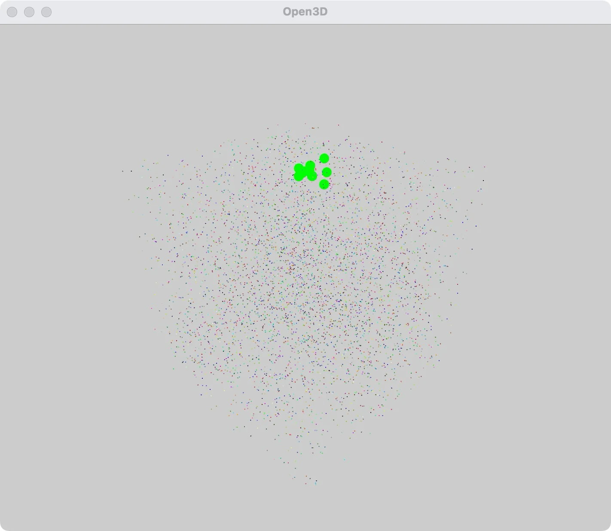

- **创建点云**：生成一个包含 1000 个随机点的点云。
- **构建 k-d 树**：使用 o3d.geometry.KDTreeFlann 构建 k-d 树。
- **查询最近邻**：使用 search_knn_vector_3d 方法查询给定点的 5 个最近邻。
- **提取最近邻点**：从点云中提取最近邻点。
- **设置颜色**：将原始点云设置为灰色，查询点设置为红色，最近邻点设置为绿色。
- **可视化**：将点云、查询点和最近邻点一起可视化。


## 6. Octree 八叉树

Octree 八叉树是一种用于描述三维空间的树状数据结构。它的基本思想是递归地将三维空间划分成更小的体积单元，每个节点表示一个正方体的体积元素，每个节点有八个子节点，将八个子节点所表示的体积元素加在一起就等于父节点的体积。
更多背景可参考维基百科的 [Octree](https://en.wikipedia.org/wiki/Octree) 条目。

### 6.1 基本原理

#### 6.1.1 构建八叉树

1. **根节点**：八叉树的根节点表示整个三维空间或一个较大的正方体。
2. **划分空间**：将空间划分为八个相等的子空间，每个子空间对应一个子节点。
3. **递归划分**：对于每个子节点，如果其包含的元素数量超过预设阈值，则继续递归地将该子节点对应的空间再划分为八个更小的子空间，直到每个子节点包含的元素数量小于或等于阈值，或者达到设定的最大深度。

#### 6.1.2 节点结构

每个八叉树节点包含以下信息：

- **边界（Boundary）**：定义了节点所代表的空间区域。
- **子节点（Children）**：指向八个子节点的指针。
- **元素（Elements）**：节点所包含的元素列表，通常是点、物体或其他空间实体。

#### 6.1.3 空间划分

在三维空间中，每个节点代表一个正方体，可以通过中心点和边长来定义。将正方体沿三个坐标轴（x、y、z）各切一刀，就可以得到八个子正方体。

### 6.2 应用

#### 6.2.1 空间划分

八叉树常用于三维空间的分层表示和管理，例如在计算机图形学中用于加速光线追踪和碰撞检测。通过将复杂的三维场景划分成更小的区域，可以大大减少需要处理的元素数量，从而提高计算效率。

#### 6.2.2 最近邻搜索

在三维空间中查找某个点的最近邻居时，可以利用八叉树快速缩小搜索范围。通过递归地检查包含目标点的节点及其相邻节点，可以高效地找到最近邻居。

#### 6.2.3 碰撞检测

在物理引擎中，八叉树被广泛用于碰撞检测。通过将物体划分到不同的节点中，可以快速确定哪些物体可能发生碰撞，从而减少不必要的碰撞检测计算。

#### 6.2.4 空间索引

八叉树也可以用于空间数据库中的空间索引，支持快速的空间查询操作，如范围查询和K近邻查询。

### 6.3 实现细节

#### 6.3.1 插入元素

将一个元素插入八叉树时，首先找到包含该元素的节点，然后递归地检查该节点是否需要进一步划分，直到找到最适合的叶子节点，将元素插入其中。

#### 6.3.2 查找元素

查找元素时，从根节点开始，根据元素的位置递归地进入对应的子节点，直到找到包含该元素的节点。

#### 6.3.3 删除元素

删除元素时，首先找到包含该元素的节点，然后从节点的元素列表中删除该元素。如果删除后节点的元素数量小于阈值，则可以考虑合并该节点的子节点以减少树的深度。

### 6.4 优缺点

#### 6.4.1 优点

- **高效的空间划分**：八叉树可以高效地划分三维空间，适用于处理大规模三维数据。
- **快速查询**：支持快速的空间查询操作，如最近邻搜索和碰撞检测。
- **灵活性**：可以自适应地划分空间，根据需要调整树的深度和节点容量。

#### 6.4.2 缺点

- **内存消耗**：在处理大规模数据时，八叉树的节点数量可能非常庞大，导致较高的内存消耗。
- **复杂性**：实现和维护八叉树的数据结构相对复杂，特别是在处理动态数据时。


八叉树是一种强大的数据结构，广泛应用于三维空间的划分和管理。通过递归地将三维空间划分为更小的体积单元，八叉树可以高效地支持各种空间查询操作，如最近邻搜索和碰撞检测。然而，在实际应用中，需要权衡其内存消耗和实现复杂性，以确保其高效性和实用性。

### 6.5 Open3D Octree：构建、查询和叶节点

下面使用 legacy geometry API，先从带颜色点云建立边界，再查询已有点所在的叶节点。`locate_leaf_node` 返回的是节点对象与节点信息，不是布尔值；找到所在叶子不代表树中保存过完全相同的点。

```python
import numpy as np
import open3d as o3d

rng = np.random.default_rng(42)
points = rng.random((2000, 3))
pcd = o3d.geometry.PointCloud()
pcd.points = o3d.utility.Vector3dVector(points)
pcd.colors = o3d.utility.Vector3dVector(points.copy())

octree = o3d.geometry.Octree(max_depth=4)
octree.convert_from_point_cloud(pcd, size_expand=0.01)
node, info = octree.locate_leaf_node(points[0])
if node is None:
    raise RuntimeError("Existing input point has no leaf")
print("leaf origin:", info.origin, "size:", info.size)

# 插入需要初始化和更新回调；点必须位于已经定义好的树边界内。
octree.insert_point(
    np.array([0.5, 0.5, 0.5]),
    o3d.geometry.OctreeColorLeafNode.get_init_function(),
    o3d.geometry.OctreeColorLeafNode.get_update_function([1.0, 0.0, 0.0]),
)

centers = []
def visit(node, info):
    if isinstance(node, o3d.geometry.OctreeLeafNode):
        centers.append(info.origin + info.size / 2)
    return False  # 不提前剪枝

octree.traverse(visit)
print("occupied leaves:", len(centers))
o3d.visualization.draw_geometries([octree])
```

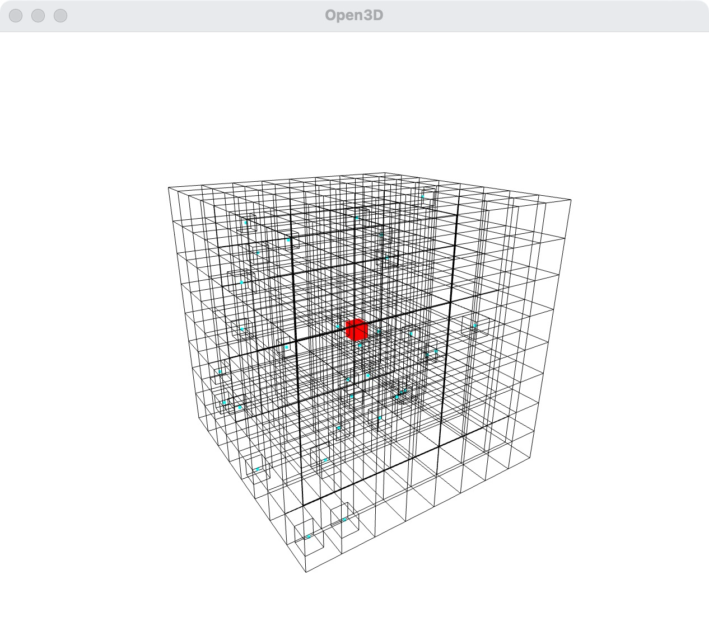

### 6.6 空间分桶不等于语义分割

由点云转换得到的 `OctreePointColorLeafNode` 可以包含原始点索引；通用 `OctreeLeafNode` 并不都具有 `indices`。手工插入只更新颜色时，也不会自动维护索引。基于点索引的分组需统一节点类型和更新逻辑。

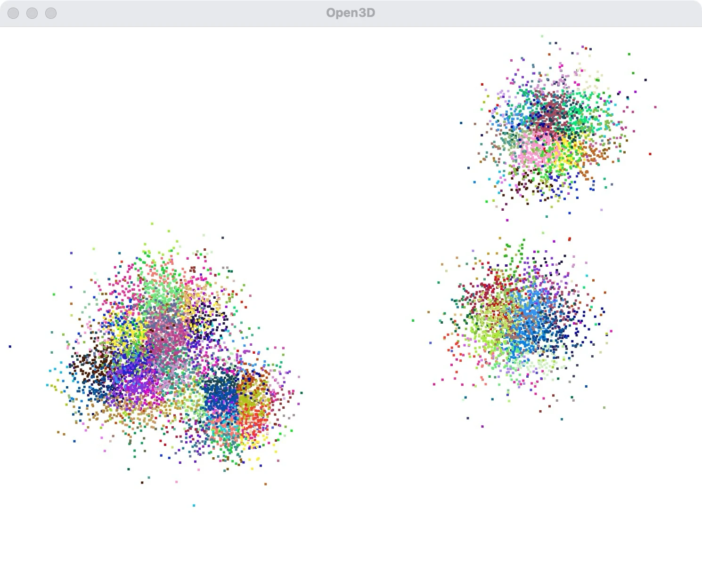

一个物体可能跨越多个叶子，不同物体也可能进入同一叶子，所以这种分桶不是物体实例分割。

### 6.7 三种“体素代表点”不要混用

- 八叉树叶中心由树边界与深度决定，不由一个未使用的 `voxel_size` 参数决定。
- `pcd.voxel_down_sample(voxel_size)` 用每格内输入点的平均位置代表该格。
- `VoxelGrid.create_from_point_cloud` 构建占用体素，输出不是降采样 PointCloud。

| 原始点云 | 历史叶中心表示 |
| --- | --- |
| 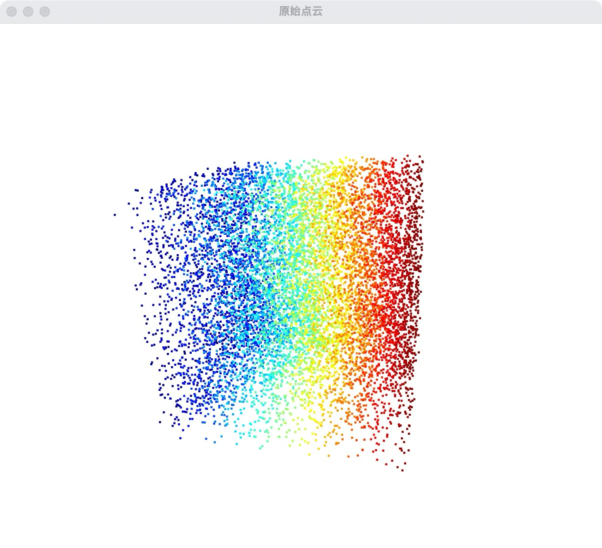 | 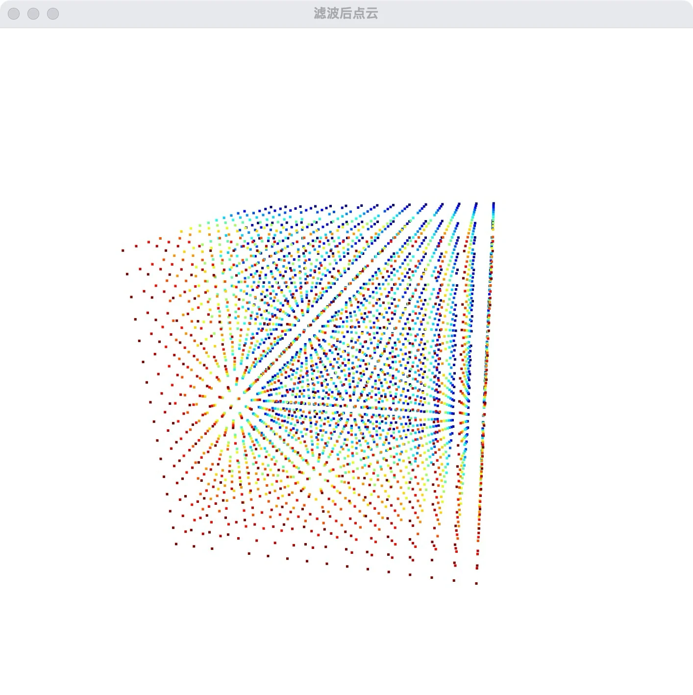 |

参考：[Open3D Octree API](https://www.open3d.org/docs/release/python_api/open3d.geometry.Octree.html)。

## 7. 点云过滤

Open3D 提供了以下几种常用的点云滤波方法：

1. **统计滤波 (Statistical Outlier Removal)**：
   - 方法：`remove_statistical_outlier`
   - 参数：
     - `nb_neighbors`：用于计算平均距离的邻居点数。
     - `std_ratio`：距离的标准差乘数。

2. **半径滤波 (Radius Outlier Removal)**：
   - 方法：`remove_radius_outlier`
   - 参数：
     - `nb_points`：在指定半径内的最小点数。
     - `radius`：搜索半径。

3. **体素下采样 (Voxel Downsampling)**：
   - 方法：`voxel_down_sample`
   - 参数：
     - `voxel_size`：体素的大小。

4. **Uniform Downsampling**：
   - 方法：`uniform_down_sample`
   - 参数：
     - `every_k_points`：每隔多少个点采样一个点。

以下是这些方法的示例代码：

```python
import open3d as o3d
import numpy as np

# 创建一个随机点云
pcd = o3d.geometry.PointCloud()
pcd.points = o3d.utility.Vector3dVector(np.random.rand(10000, 3))

# 统计滤波
pcd_statistical, ind_statistical = pcd.remove_statistical_outlier(nb_neighbors=20, std_ratio=1.0)
filtered_pcd_statistical = pcd.select_by_index(ind_statistical)

# 半径滤波
pcd_radius, ind_radius = pcd.remove_radius_outlier(nb_points=10, radius=0.1)
filtered_pcd_radius = pcd.select_by_index(ind_radius)

# 体素下采样
voxel_size = 0.05
downsampled_pcd_voxel = pcd.voxel_down_sample(voxel_size)

# Uniform 下采样
every_k_points = 10
downsampled_pcd_uniform = pcd.uniform_down_sample(every_k_points)

# 可视化原始点云和过滤后的点云
print("原始点云点数:", len(pcd.points))
print("统计滤波后的点云点数:", len(filtered_pcd_statistical.points))
print("半径滤波后的点云点数:", len(filtered_pcd_radius.points))
print("体素下采样后的点云点数:", len(downsampled_pcd_voxel.points))
print("Uniform下采样后的点云点数:", len(downsampled_pcd_uniform.points))

o3d.visualization.draw_geometries([pcd], window_name="原始点云")
o3d.visualization.draw_geometries([filtered_pcd_statistical], window_name="统计滤波后的点云")
o3d.visualization.draw_geometries([filtered_pcd_radius], window_name="半径滤波后的点云")
o3d.visualization.draw_geometries([downsampled_pcd_voxel], window_name="体素下采样后的点云")
o3d.visualization.draw_geometries([downsampled_pcd_uniform], window_name="Uniform下采样后的点云")
```

<details>
<summary>查看原始点云与四种处理结果的历史截图</summary>

这些截图用于对照显示方式，未绑定上面代码的随机种子，不能据此计算降噪精度；颜色也不是统一的误差刻度。可复现的点数与坐标检查见下一节。

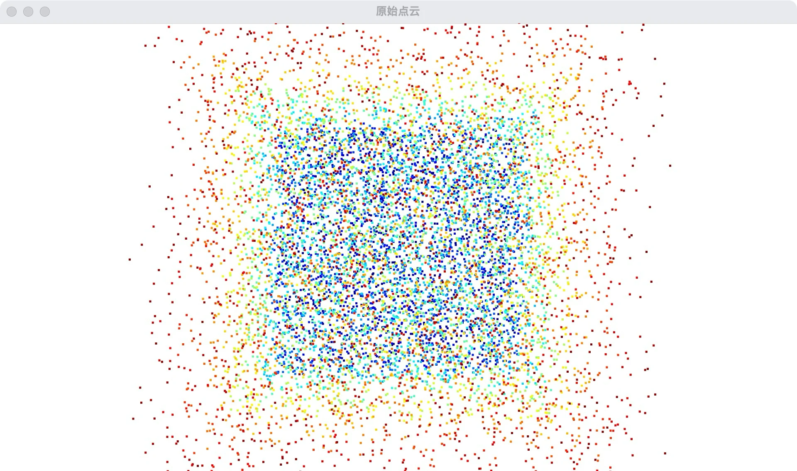

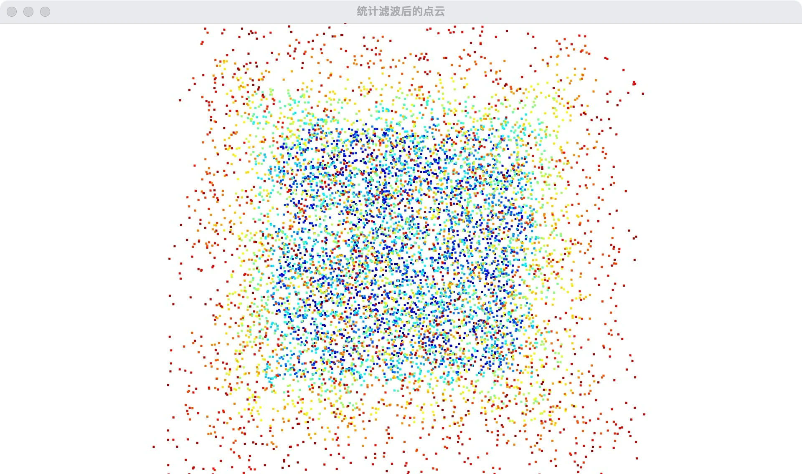

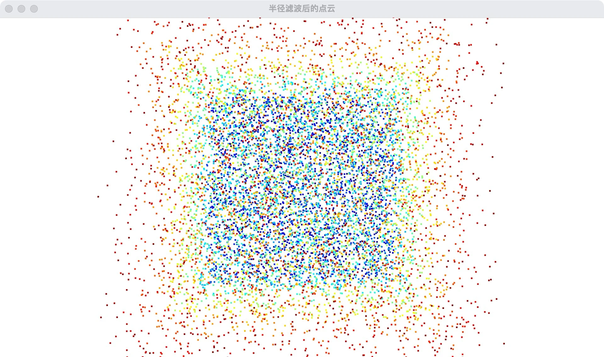

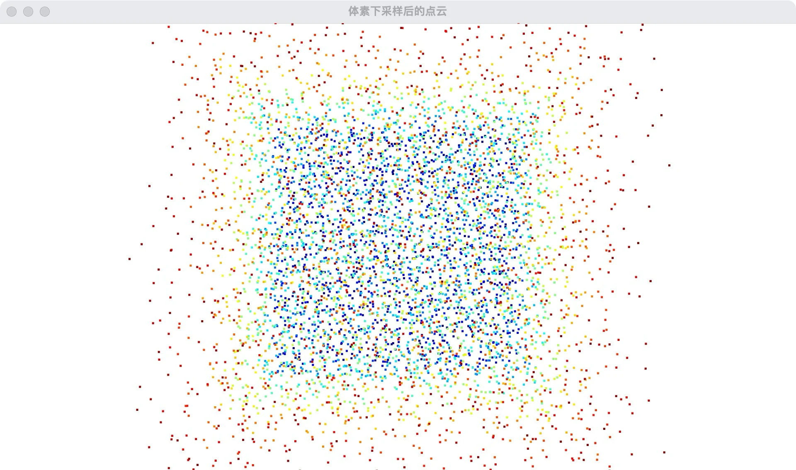

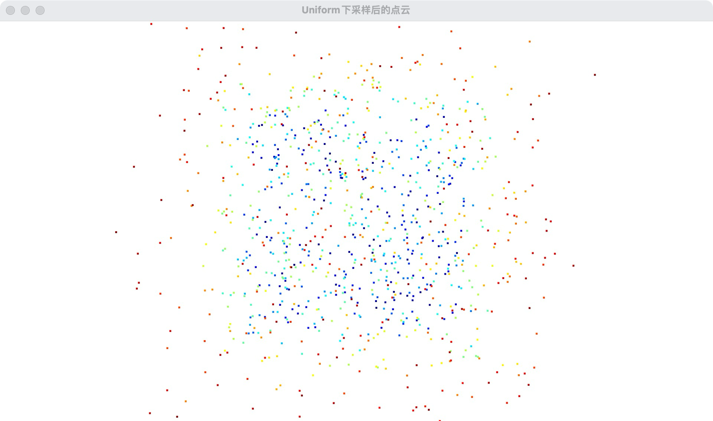

</details>

-  **代码说明**：
1. **统计滤波**：使用 `remove_statistical_outlier` 方法去除离群点。该方法先计算各点的局部平均邻距，再以这些平均距离的全局均值与标准差确定阈值；超过“均值 + `std_ratio` × 标准差”的点被剔除。参数 `nb_neighbors` 指定用于计算平均距离的邻居点数，`std_ratio` 指定距离的标准差乘数。
2. **半径滤波**：使用 `remove_radius_outlier` 方法去除孤立点。该方法通过检查每个点在指定半径内的邻居点数，并将邻居点数少于指定值的点视为孤立点。参数 `nb_points` 指定在指定半径内的最小点数，`radius` 指定搜索半径。
3. **体素下采样**：使用 `voxel_down_sample` 方法通过体素网格下采样点云。该方法将点云划分为体素网格，并用每个体素内的点的重心来代表该体素。参数 `voxel_size` 指定体素的大小。
4. **Uniform 下采样**：使用 `uniform_down_sample` 方法均匀下采样点云。该方法通过按固定间隔选择点来下采样点云。参数 `every_k_points` 指定每隔多少个点采样一个点。

四种方法的目标并不相同：前两种按邻域稀疏程度去除点，后两种减少采样数量。`uniform_down_sample` 中的“均匀”指按**输入索引**等间隔选取，不能保证三维空间均匀。如果输入按扫描行排序，它可能保留周期性条纹。体素降采样也不自动判定哪个点是噪声，孤立离群点通常仍会占据自己的体素。[官方离群点移除说明](https://www.open3d.org/docs/0.19.0/tutorial/geometry/pointcloud_outlier_removal.html)

### 7.1 跑通一条有检查点的预处理流程

<figure class="article-figure">
  
  <figcaption><span class="article-figure__number">图 1</span><span class="article-figure__text">一条点云预处理路线。降采样减少密度，邻域过滤判断稀疏点，法线描述局部表面方向；刚体变换改变坐标表示。处理顺序与阈值应按数据调整，始终保留原始点云。</span></figcaption>
</figure>

[下载完整脚本](point_cloud_pipeline.py)。脚本构造一小块曲面、3 个已知孤立点和 2 个含 NaN/Inf 的无效点，无需相机、外部模型或图形窗口。在本节环境中执行：

```bash
python point_cloud_pipeline.py
```

| 步骤 | 做什么 | 本例 Open3D 0.19.0 的结果 | 这个结果说明什么 |
| --- | --- | --- | --- |
| 检查坐标 | 删除任一坐标非有限的点 | 656 → 654 点 | 清理数值输入，还没处理几何噪声 |
| 文件往返 | 写入临时 PLY，再读回并比较坐标 | 654 点，坐标一致 | 验证 I/O，点的单位仍由应用约定 |
| 体素降采样 | 每格边长 0.04 m | 654 → 191 点 | 合并密集区域，3 个孤立点仍在 |
| 半径过滤 | 半径 0.065 m，`nb_points=3` | 191 → 188 点 | 在这个已知构造中删掉了 3 个孤立点 |
| 法线估计 | 搜索半径 0.12 m，最多 30 个近邻 | 有限、单位长度的法线 | 长度正确不等于方向已一致 |
| 刚体变换 | 在副本上变换，再应用逆变换 | 坐标往返一致，原数据不变 | 验证变换方向与原地修改行为 |
{.table-readable}

这里所有长度参数都按米解释。例如 `voxel_size=0.04` 是 4 cm；如果输入坐标其实是毫米，应先统一单位或同步换算全部距离参数。将毫米数据直接配上米制阈值，会让同一段代码表现得完全不同。

本例先降采样，是为了减少后续邻域查询规模；实际数据不一定适合固定这个顺序。稀疏的物体边缘也可能被半径过滤删除，细小结构也可能被大体素合并。应保留原始数据、比较删除位置，并根据传感器间距和任务精度调整参数；点数变少不是精度提高的证明。

还要区分两种索引：`clean, indices = down.remove_radius_outlier(...)` 返回的是 **`down` 中的索引**。不能把它直接拿去切原始点云的颜色、标签或时间戳。若后续需要原始点到降采样点的对应关系，应显式维护映射或使用带追踪信息的降采样接口。


## 8. 点云转换

这些 legacy 几何方法会**原地修改对象**。`other = pcd` 只增加一个指向同一对象的引用；要保留原始数据，应先 `copy.deepcopy(pcd)`。连续调用变换会累积，乘单位矩阵不能撤销已经发生的变换。

对于机器人刚体坐标变换，还应检查 $R^\top R=I$、$\det R=1$ 和齐次矩阵最后一行。用只保留三位小数的旋转矩阵进行精度验证，可能把舍入产生的缩放或非正交误差混进算法误差；优先从旋转参数构造合法矩阵。

### 8.1 **transform**：应用变换矩阵到点云

`transform` 方法用于将一个 4x4 的变换矩阵应用到点云上。该矩阵可以包含平移、旋转和缩放。

```python
import open3d as o3d
import numpy as np

# 创建一个随机点云
pcd = o3d.geometry.PointCloud()
pcd.points = o3d.utility.Vector3dVector(np.random.rand(1000, 3))

# 定义一个变换矩阵
transformation_matrix = np.array([[1, 0, 0, 1],
                                  [0, 1, 0, 2],
                                  [0, 0, 1, 3],
                                  [0, 0, 0, 1]])

# 应用变换矩阵到点云
pcd.transform(transformation_matrix)

# 可视化变换后的点云
o3d.visualization.draw_geometries([pcd], window_name="Transformed Point Cloud")
```

### 8.2 **translate**：平移点云

`translate` 方法用于将点云沿指定的方向平移。

```python
# 平移向量
translation_vector = np.array([1, 2, 3])

# 平移点云
pcd.translate(translation_vector)

# 可视化平移后的点云
o3d.visualization.draw_geometries([pcd], window_name="Translated Point Cloud")
```

### 8.3 **rotate**：旋转点云

`rotate` 方法用于将点云绕指定的轴旋转。旋转矩阵可以通过欧拉角或四元数生成。

```python
# 定义一个旋转矩阵（绕 Z 轴旋转 45 度）
rotation_matrix = pcd.get_rotation_matrix_from_xyz((0, 0, np.pi / 4))

# 旋转点云
pcd.rotate(rotation_matrix, center=(0, 0, 0))

# 可视化旋转后的点云
o3d.visualization.draw_geometries([pcd], window_name="Rotated Point Cloud")
```

### 8.4 **scale**：缩放点云

`scale` 方法用于将点云按指定的比例缩放。

```python
# 缩放比例
scale_factor = 2.0

# 缩放点云
pcd.scale(scale_factor, center=pcd.get_center())

# 可视化缩放后的点云
o3d.visualization.draw_geometries([pcd], window_name="Scaled Point Cloud")
```

## 9. 点云法线估计

### 9.1 **estimate_normals**：估计点云法线

`estimate_normals` 方法用于估计点云的法线。该方法通过计算每个点的邻域点的协方差矩阵，并求解其特征向量来确定法线方向。

- **参数说明**：
- `search_param`：搜索参数，定义了用于法线估计的邻域搜索方法和半径。
  - `search_param=o3d.geometry.KDTreeSearchParamKNN(knn)`：使用 K 近邻搜索，`knn` 为邻居点的数量。
  - `search_param=o3d.geometry.KDTreeSearchParamRadius(radius)`：使用半径搜索，`radius` 为搜索半径。

### 9.2 **orient_normals_consistent_tangent_plane**：使法线方向一致

`orient_normals_consistent_tangent_plane` 方法用于使点云的法线方向一致。该方法通过构建一致的切平面来调整法线方向。

- **参数说明**：
- `k`：用于一致性调整的邻居点数量。

### 9.3 详细案例

以下是一个完整的案例，展示了如何读取点云、估计法线并使法线方向一致：

```python
import open3d as o3d
import numpy as np

# 生成点云数据
def generate_point_cloud():
    # 从球面采样点云
    mesh = o3d.geometry.TriangleMesh.create_sphere(radius=1.0)
    pcd = mesh.sample_points_poisson_disk(number_of_points=500)
    return pcd

# 生成点云
pcd = generate_point_cloud()

# 打印点云信息
print("Point cloud before normal estimation:")
print(pcd)

# 估计法线
print("Estimating normals...")
pcd.estimate_normals(search_param=o3d.geometry.KDTreeSearchParamKNN(knn=30))

# 打印估计法线后的点云信息
print("Point cloud after normal estimation:")
print(pcd)

# 可视化带法线的点云
o3d.visualization.draw_geometries([pcd], point_show_normal=True, window_name="Point Cloud with Normals")

# 使法线方向一致
print("Orienting normals consistently...")
pcd.orient_normals_consistent_tangent_plane(k=30)

# 打印调整法线方向后的点云信息
print("Point cloud after orienting normals:")
print(pcd)

# 可视化带一致法线的点云
o3d.visualization.draw_geometries([pcd], point_show_normal=True, window_name="Point Cloud with Oriented Normals")
```

|法向生成|法向统一  |
|--|--|
| 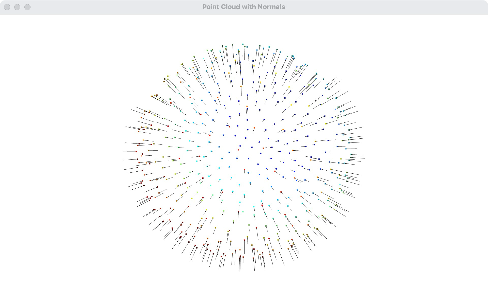 | 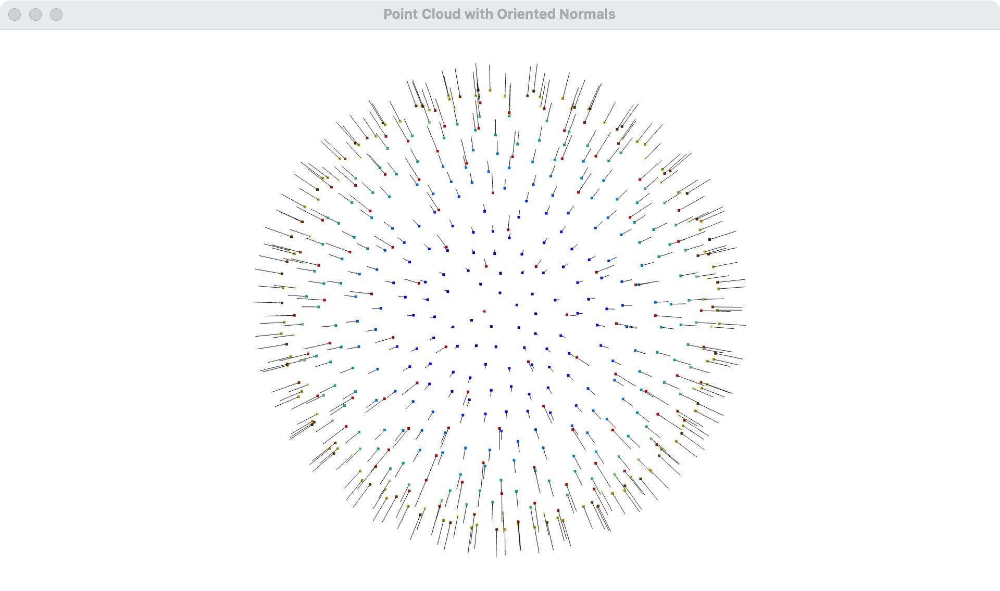 |


通过 `estimate_normals` 和 `orient_normals_consistent_tangent_plane` 方法，你可以估计点云的法线并使其方向一致。这对于后续的点云处理和分析（如表面重建、配准等）非常重要。


## 10. 点云配准

Open3D 提供了多种点云配准方法，主要包括以下几种：

1. **ICP (Iterative Closest Point) 配准**：这是最常用的点云配准方法之一，通过迭代地最小化两组点云之间的距离来实现配准。

2. **Colored ICP 配准**：这是对传统 ICP 的改进，除了几何距离外，还考虑了颜色信息来进行配准。

3. **Global Registration (全局配准)**：用于初始配准，通常在没有初始对齐的情况下使用。包括 RANSAC-based 和 Fast Global Registration (FGR) 方法。

4. **Multiway Registration (多路配准)**：用于将多个点云配准到一个共同的参考框架中。

下面是每种方法的说明和案例：

### 10.1 ICP：已知刚体变换的最小验收 {#101-icp-配准}

ICP 是局部配准方法。先在已知变换、足够重叠、没有球体旋转对称歧义的数据上验证接口，再用于真实扫描。下面生成同一批三维点的两个视图；位置单位为米，目标变换很小，单位矩阵提供了合理初值。该点集用于软件验收，没有模拟扫描噪声或遮挡。

```python
import copy
import numpy as np
import open3d as o3d

rng = np.random.default_rng(42)
points = rng.uniform([-.6, -.3, -.1], [.8, .5, .3], (600, 3))
points[:, 2] += .2 * points[:, 0] ** 2
source = o3d.geometry.PointCloud(o3d.utility.Vector3dVector(points))
truth = np.eye(4)
truth[:3, :3] = source.get_rotation_matrix_from_xyz((.04, -.03, .05))
truth[:3, 3] = [.025, -.015, .02]
target = copy.deepcopy(source).transform(truth)

reg = o3d.pipelines.registration
result = reg.registration_icp(
    source, target, .12, np.eye(4),
    reg.TransformationEstimationPointToPoint(),
    reg.ICPConvergenceCriteria(max_iteration=80),
)
print("fitness:", result.fitness, "inlier RMSE [m]:", result.inlier_rmse)
assert len(result.correspondence_set) >= 3
assert result.fitness >= .99 and result.inlier_rmse < 1e-8
np.testing.assert_allclose(result.transformation, truth, atol=1e-8)
aligned = copy.deepcopy(source).transform(result.transformation)
np.testing.assert_allclose(np.asarray(aligned.points), np.asarray(target.points), atol=1e-8)
```

`registration_icp(source, target, ...)` 返回**源到目标**的变换。要把目标移回源坐标系才使用逆矩阵；不要在配准、显示和后续融合中交替使用两个方向。

这里 `.12` 是建立对应点时允许的最大距离，不是误差验收阈值。仅判断 `inlier_rmse < .12` 几乎没有诊断价值：RMSE 只统计被接受的对应，而没有对应点时结果还可能是 `fitness=0, RMSE=0`。应一起检查有效对应数、覆盖、残差、变换合法性，以及已知真值或独立几何约束。

[下载完整验收脚本](icp_verification.py)，执行 `python icp_verification.py`。除上述恢复测试外，它还把目标平移到远处，确认零对应结果被拒绝，并检查源点云没有被显示操作修改。无噪声合成实验的严格容差不适用于真实传感器精度。

#### 高 fitness、低 RMSE，为什么还可能错位 {#icp-observability}

先把返回指标与优化目标分开。在本文使用的 **Open3D 0.19.0 legacy 接口**中，`fitness` 是接受对应的数量除以**源点数量**；`inlier_rmse` 根据对应点的欧氏距离计算。即使选择 point-to-plane 优化器，返回的 `inlier_rmse` 也不能直接当作点到平面目标的 RMSE。实现可核对 [Registration.cpp 中的结果统计与信息矩阵函数](https://github.com/isl-org/Open3D/blob/v0.19.0/cpp/open3d/pipelines/registration/Registration.cpp)。

因此交换 source 和 target，`fitness` 不必相同。下方实验用 625 个源点组成较小平面块，目标是覆盖它的 1681 个点；在 1 mm 对应距离阈值下，正向覆盖是 100%，反向只有 $625/1681\approx37.18\%$。它是具有方向和距离阈值的统计量，不是唯一的“几何重叠百分比”。

更深一层的问题是目标函数对某些运动根本不敏感。对已变换源点 $y_i=Rp_i+t$、目标点 $q_i$ 和单位法线 $n_i$，点到平面残差为：

$$
r_i=n_i^T(y_i-q_i).
$$

采用目标坐标系中的左侧小扰动 $\delta\xi=[\delta t;\delta\theta]$，固定本次对应与法线，有：

$$
\delta y_i=\delta t+\delta\theta\times y_i,\qquad
J_i=\begin{bmatrix}n_i^T&(y_i\times n_i)^T\end{bmatrix}.
$$

如果所有点都在 $z=0$ 平面，$n_i=[0,0,1]^T$，那么：

$$
J_i=\begin{bmatrix}0&0&1&y_i^{(y)}&-y_i^{(x)}&0\end{bmatrix}.
$$

沿平面的两个平移，以及绕法线的旋转，都处在这个局部残差的零空间中。只让平面更密，并不会补上这三个方向的信息。[Open3D 的点到平面目标说明](https://www.open3d.org/docs/release/tutorial/pipelines/icp_registration.html#Point-to-plane-ICP)

<figure class="article-figure" id="fig-icp-observability">
  
  <figcaption><span class="article-figure__number">图 2</span><span class="article-figure__text">蓝色箭头表示表面法线，橙色箭头表示单平面无法约束的运动。右侧还需有足够的点分布与正确对应，不能仅凭法线方向不同就断言任意场景全局唯一。</span></figcaption>
</figure>

[icp_observability.py](icp_observability.py) 使用精确法线和无噪声合成数据，比较以下情况：

| 数据与初值 | 优化后结果 | 点到平面线性化矩阵的秩 |
| --- | --- | ---: |
| 平面网格，初始平移 0 | 保持 0，fitness 为 1，RMSE 为 0 | 3 |
| 同一平面网格，初始沿 x 偏移 0.1 m | 保持 0.1 m，fitness 仍为 1，欧氏 RMSE 约 $3.94\times10^{-17}$ m | 3 |
| 三个相互垂直、充分展开的平面块，小位姿扰动 | 恢复单位变换，矩阵元素最大差约 $2.22\times10^{-16}$ | 6 |

第二行使用重复网格，偏移两个网格间距后，小平面块仍能逐点匹配到大平面块的另一部分，所以**连欧氏最近邻 RMSE 都可以接近零**。对于一般非规则采样，欧氏 RMSE 未必为零；单平面的点到平面约束缺失则依然存在。平面边界、独特纹理、额外几何、运动先验等可能提供不同的信息，需明确它们是否真的进入了求解目标。

脚本还独立对残差做中心差分，核对上面的扰动方向与 Jacobian。运行 `python icp_observability.py` 可得到[完整结果](assets/icp-observability.json)，无需显示窗口或下载数据。

诊断局部退化时，应构造**实际残差对应**的 $J$，先约定平移／旋转尺度，再分析奇异值。本例取特征长度 $\ell=1\,\mathrm m$，参数写成 $[\delta t/\ell;\delta\theta]$，残差除以 $\ell$，比较 $H=J_s^TJ_s/N$。平面的特征值是 $[0,0,0,0.13,0.13,1]$，三个平面块的最小特征值约为 0.0118。换单位、特征长度、点分布或权重后，数值阈值也要随之解释。

不要仅因为函数名含有 information matrix，就默认它是当前 point-to-plane 目标的 Hessian：这个版本的 `get_information_matrix_from_point_clouds` 不使用目标法线，脚本在同一个平面上得到它的秩为 6，而上述点到平面矩阵的秩为 3。两者描述不同的残差假设，不能互换。

加入阻尼能让线性方程可解，但不会创造新观测。满秩只排除了本次线性化中的严格零方向，也不等于全局配准正确；若要把矩阵逆解释为位姿协方差，还要说明噪声、对应关系、权重及残差相关性的假设。

### 10.2 Colored ICP 配准

一张平整桌面提供了法线方向约束，但沿桌面滑动一点，点到平面的距离仍可能为零。如果桌面有稳定纹理，移动后颜色图案就会错位；Colored ICP 利用这类颜色变化，补充几何残差难以提供的局部约束。

其目标结合几何项和颜色项：

$$
E(T)=\lambda E_G(T)+(1-\lambda)E_C(T).
$$

几何项衡量点到目标局部平面的偏差；颜色项在目标点的切平面上近似颜色变化，并比较变换后的源点颜色。它不是简单给 XYZ 后面拼上 RGB，再对六维向量运行普通 ICP。$\lambda$ 调整两项权重，颜色的尺度与预处理也会影响其意义。[Open3D 彩色配准说明](https://www.open3d.org/docs/0.19.0/tutorial/pipelines/colored_pointcloud_registration.html)

#### 同一平面，为什么纯色与纹理得到不同结果

[下载完整对照脚本](colored_icp_check.py)，安装 NumPy 与 Open3D 后执行。只生成数值结果时不需要 Matplotlib：

```bash
python colored_icp_check.py --output colored-icp-results.json
# 需要重画下图时再安装 Matplotlib，并增加 --plot。
python colored_icp_check.py --output colored-icp-results.json --plot colored-icp-comparison.png
```

脚本建立 2989 个无噪声平面点，并给出解析法线。目标是源点云的一个已知刚体变换副本：绕 Z 轴旋转 0.08 rad，平移 $(0.05,-0.03,0)$ m，颜色随点保留。三个实验都从单位变换开始：

| 实验 | 可用信息 | 本例的平移误差 | 本例的旋转角误差 |
| --- | --- | ---: | ---: |
| 点到平面 ICP | 同一平面的几何 | 58.31 mm | 4.58° |
| Colored ICP，全部点改为同一种颜色 | 几何，颜色没有空间变化 | 58.31 mm | 4.58° |
| Colored ICP，保留二维变化纹理 | 几何与颜色变化 | 小于 0.00001 mm | 小于 0.00001° |

<figure class="article-figure">
  
  <figcaption><span class="article-figure__number">图 3</span><span class="article-figure__text">Open3D 0.19.0、无噪声点和精确法线的受控算例。纹理方案的极小误差只说明这组构造中的数值恢复，不能解释为真实相机具有相同定位精度；脚本同时保存完整配置与误差。</span></figcaption>
</figure>

前两个结果不是“迭代次数不够”：平面内平移和绕法线旋转没有改变点到平面残差，纯色也没有补充颜色梯度。最后一种数据同时具有两个平面方向上的纹理变化，才为这一局部对齐问题补上信息。只有沿一个方向变化的条纹，仍可能留下沿条纹方向的歧义。

代码采用 0.04、0.02、0.01 m 三层体素，从粗到细把上层估计传给下一层；`lambda_geometric=0.968` 与迭代条件均显式记录。每一层运行的是同一个局部算法，多尺度不把它变成全局最优求解器。真实使用还需要足够重叠、合理初值、颜色与几何对齐，并评估曝光变化、反光、重复纹理和运动物体。

均匀颜色球体可以展示调用形式，却不适合作为完整姿态恢复的验收数据：球体有旋转对称性，均匀颜色又没有纹理约束。应先明确几何和纹理分别提供了哪些信息，再选择具有可检查真值的实验。

### 10.3 全局配准

**说明**：用于初始配准，通常在没有初始对齐的情况下使用。

0.19.0 的 `RANSACConvergenceCriteria` 第二个参数是概率 `confidence`，不再是旧接口中的最大验证次数。写成 `(4000000, 500)` 会误传参数；下面显式使用关键字。`confidence=1.0` 会关闭基于置信度的提前终止，通常不应把它当作默认加速设置。[RANSAC 停止条件](https://www.open3d.org/docs/0.19.0/python_api/open3d.pipelines.registration.RANSACConvergenceCriteria.html)

下面是包含配准前后可视化的示例；随机几何上的匹配不保证成功，应检查 fitness、inlier_rmse 和已知变换误差：

```python
import open3d as o3d
import numpy as np

# 生成点云数据
def generate_point_cloud():
    # 创建一个球体点云
    mesh = o3d.geometry.TriangleMesh.create_sphere(radius=1.0)
    pcd = mesh.sample_points_poisson_disk(number_of_points=500)
    return pcd

# 生成源点云和目标点云
source = generate_point_cloud()
target = generate_point_cloud()

# 对目标点云进行随机变换
transformation = np.eye(4)
transformation[:3, :3] = o3d.geometry.get_rotation_matrix_from_xyz((0.2, -0.5, -0.15))
transformation[:3, 3] = [0.5, 0.7, -1.4]
target.transform(transformation)

# 下采样点云
voxel_size = 0.05
source_down = source.voxel_down_sample(voxel_size)
target_down = target.voxel_down_sample(voxel_size)

# 估计法线
source_down.estimate_normals(search_param=o3d.geometry.KDTreeSearchParamHybrid(radius=0.1, max_nn=30))
target_down.estimate_normals(search_param=o3d.geometry.KDTreeSearchParamHybrid(radius=0.1, max_nn=30))

# 计算FPFH特征
source_fpfh = o3d.pipelines.registration.compute_fpfh_feature(
    source_down,
    o3d.geometry.KDTreeSearchParamHybrid(radius=0.25, max_nn=100))
target_fpfh = o3d.pipelines.registration.compute_fpfh_feature(
    target_down,
    o3d.geometry.KDTreeSearchParamHybrid(radius=0.25, max_nn=100))

# 使用RANSAC进行全局配准
result_ransac = o3d.pipelines.registration.registration_ransac_based_on_feature_matching(
    source_down, target_down, source_fpfh, target_fpfh,
    mutual_filter=True,
    max_correspondence_distance=0.15,
    estimation_method=o3d.pipelines.registration.TransformationEstimationPointToPoint(False),
    ransac_n=4,
    checkers=[o3d.pipelines.registration.CorrespondenceCheckerBasedOnEdgeLength(0.9),
              o3d.pipelines.registration.CorrespondenceCheckerBasedOnDistance(0.15)],
    criteria=o3d.pipelines.registration.RANSACConvergenceCriteria(max_iteration=100000, confidence=0.999))

print(result_ransac)

# 可视化配准前的点云
import copy
source_temp = copy.deepcopy(source_down)  # 保存未修改的源点云
o3d.visualization.draw_geometries([source_temp, target_down], window_name="配准前")

# 可视化配准后的点云
source_temp = copy.deepcopy(source_down).transform(result_ransac.transformation)
o3d.visualization.draw_geometries([source_temp, target_down], window_name="配准后")
```

- **代码说明**：
1. **生成点云数据**：创建一个球体点云，并对目标点云进行随机变换。
2. **下采样点云**：对点云进行体素下采样，以减少计算量。
3. **估计法线**：计算点云的法线。
4. **计算FPFH特征**：计算快速点特征直方图（FPFH）特征。
5. **使用RANSAC进行全局配准**：使用 RANSAC 算法基于特征匹配进行全局配准。
6. **可视化配准前的点云**：在配准前显示源点云和目标点云。
7. **可视化配准后的点云**：在配准后显示源点云和目标点云。

| 初始点云 | 配准点云 |
| --- | --- |
| 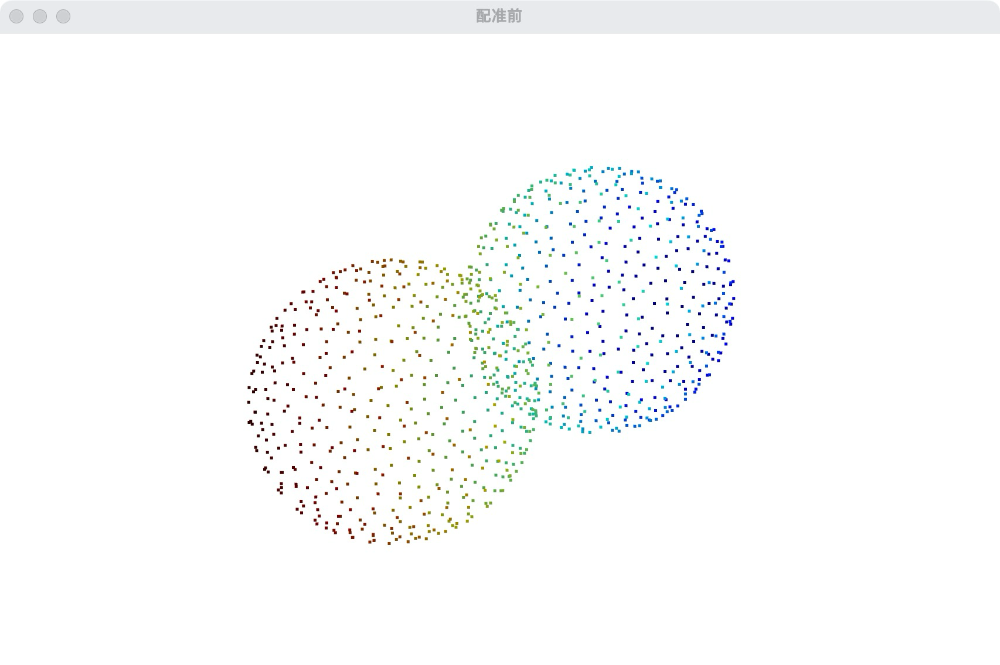 | 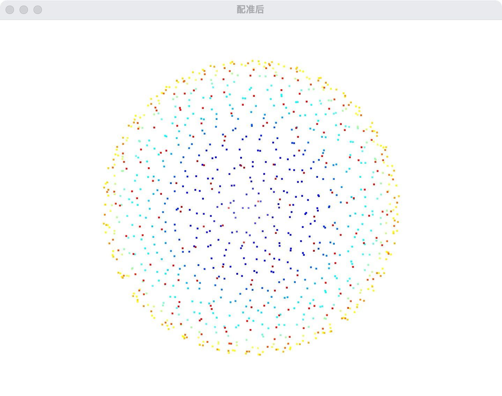 |


### 10.4 多路配准

**说明**：用于将多个点云配准到一个共同的参考框架中。

```python
import open3d as o3d
import numpy as np

def create_colored_sphere(radius, color, density=1000):
    mesh = o3d.geometry.TriangleMesh.create_sphere(radius=radius)
    pcd = mesh.sample_points_poisson_disk(number_of_points=density)
    pcd.paint_uniform_color(color)
    return pcd

def preprocess_point_cloud(pcd, voxel_size):
    pcd_down = pcd.voxel_down_sample(voxel_size)
    radius_normal = voxel_size * 2
    pcd_down.estimate_normals(o3d.geometry.KDTreeSearchParamHybrid(radius=radius_normal, max_nn=30))
    radius_feature = voxel_size * 5
    pcd_fpfh = o3d.pipelines.registration.compute_fpfh_feature(
        pcd_down,
        o3d.geometry.KDTreeSearchParamHybrid(radius=radius_feature, max_nn=100))
    return pcd_down, pcd_fpfh

def pairwise_registration(source, target, voxel_size):
    source_down, source_fpfh = preprocess_point_cloud(source, voxel_size)
    target_down, target_fpfh = preprocess_point_cloud(target, voxel_size)

    distance_threshold = voxel_size * 1.5
    result = o3d.pipelines.registration.registration_ransac_based_on_feature_matching(
        source_down, target_down, source_fpfh, target_fpfh, True,
        distance_threshold,
        o3d.pipelines.registration.TransformationEstimationPointToPoint(False),
        4, [
            o3d.pipelines.registration.CorrespondenceCheckerBasedOnEdgeLength(0.9),
            o3d.pipelines.registration.CorrespondenceCheckerBasedOnDistance(distance_threshold)
        ], o3d.pipelines.registration.RANSACConvergenceCriteria(max_iteration=100000, confidence=0.999))
    return result

def full_registration(pcds, voxel_size):
    pose_graph = o3d.pipelines.registration.PoseGraph()
    odometry = np.identity(4)
    pose_graph.nodes.append(o3d.pipelines.registration.PoseGraphNode(odometry))

    for source_id in range(len(pcds)):
        for target_id in range(source_id + 1, len(pcds)):
            result = pairwise_registration(pcds[source_id], pcds[target_id], voxel_size)
            trans = result.transformation
            information = o3d.pipelines.registration.get_information_matrix_from_point_clouds(
                pcds[source_id], pcds[target_id], voxel_size * 1.5, result.transformation)
            if target_id == source_id + 1:
                odometry = np.dot(trans, odometry)
                pose_graph.nodes.append(o3d.pipelines.registration.PoseGraphNode(np.linalg.inv(odometry)))
                pose_graph.edges.append(o3d.pipelines.registration.PoseGraphEdge(source_id, target_id, trans, information, uncertain=False))
            else:
                pose_graph.edges.append(o3d.pipelines.registration.PoseGraphEdge(source_id, target_id, trans, information, uncertain=True))
    return pose_graph

def run_global_optimization(pose_graph):
    option = o3d.pipelines.registration.GlobalOptimizationOption(
        max_correspondence_distance=0.02,
        edge_prune_threshold=0.25,
        reference_node=0)
    o3d.pipelines.registration.global_optimization(
        pose_graph,
        o3d.pipelines.registration.GlobalOptimizationLevenbergMarquardt(),
        o3d.pipelines.registration.GlobalOptimizationConvergenceCriteria(),
        option)

def merge_point_clouds(pcds, pose_graph):
    pcd_combined = o3d.geometry.PointCloud()
    for point_id in range(len(pcds)):
        pcd_transformed = copy.deepcopy(pcds[point_id]).transform(pose_graph.nodes[point_id].pose)
        pcd_combined += pcd_transformed
    return pcd_combined

# 从同一非对称物体采样，不能用不同半径球体验证刚性配准
import copy
mesh = o3d.geometry.TriangleMesh.create_box(width=1.0, height=0.6, depth=0.3)
sphere1 = mesh.sample_points_uniformly(number_of_points=2000)
sphere2 = copy.deepcopy(sphere1)
sphere3 = copy.deepcopy(sphere1)
sphere1.paint_uniform_color([1, 0, 0])
sphere2.paint_uniform_color([0, 1, 0])
sphere3.paint_uniform_color([0, 0, 1])

# 对球体进行随机变换
transformation1 = np.eye(4)
transformation1[:3, :3] = o3d.geometry.get_rotation_matrix_from_xyz((0.2, -0.5, -0.15))
transformation1[:3, 3] = [0.5, 0.7, -1.4]
sphere2.transform(transformation1)

transformation2 = np.eye(4)
transformation2[:3, :3] = o3d.geometry.get_rotation_matrix_from_xyz((0, 0, np.pi / 4))
transformation2[:3, 3] = [1.0, 0.5, -0.5]
sphere3.transform(transformation2)

pcds = [sphere1, sphere2, sphere3]

# 设置体素大小
voxel_size = 0.05

# 可视化配准前的点云
print("配准前的点云")
o3d.visualization.draw_geometries(pcds, window_name="Before Registration")

# 进行多路配准
pose_graph = full_registration(pcds, voxel_size)

# 运行全局优化
run_global_optimization(pose_graph)

# 合并点云
pcd_combined = merge_point_clouds(pcds, pose_graph)

# 可视化配准后的点云
print("配准后的点云")
o3d.visualization.draw_geometries([pcd_combined], window_name="After Registration")
```

- **代码说明**：
1. **创建彩色球体**：从同一长方体生成三组等尺度点云；变量名为历史命名。原图是旧版示意，不作为修订代码的精度验证。
2. **对球体进行变换**：对第二个和第三个球体进行随机变换。
3. **预处理点云**：使用 `preprocess_point_cloud` 函数对点云进行下采样和特征提取。
4. **配对配准**：使用 `pairwise_registration` 函数对两个点云进行配对配准。
5. **全局配准**：使用 `full_registration` 函数对所有点云进行全局配准，构建位姿图。
6. **全局优化**：使用 `run_global_optimization` 函数对位姿图进行全局优化。
7. **合并点云**：使用 `merge_point_clouds` 函数将所有点云合并到一个全局坐标系中。
8. **可视化配准前的点云**：使用 Open3D 的可视化工具显示配准前的点云。
9. **可视化配准后的点云**：使用 Open3D 的可视化工具显示配准后的点云。

| 原始点云 | 配准点云 |
| --- | --- |
| 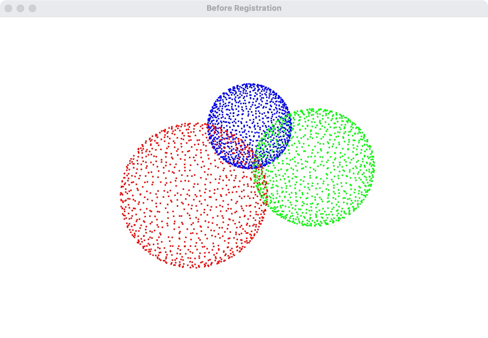 | 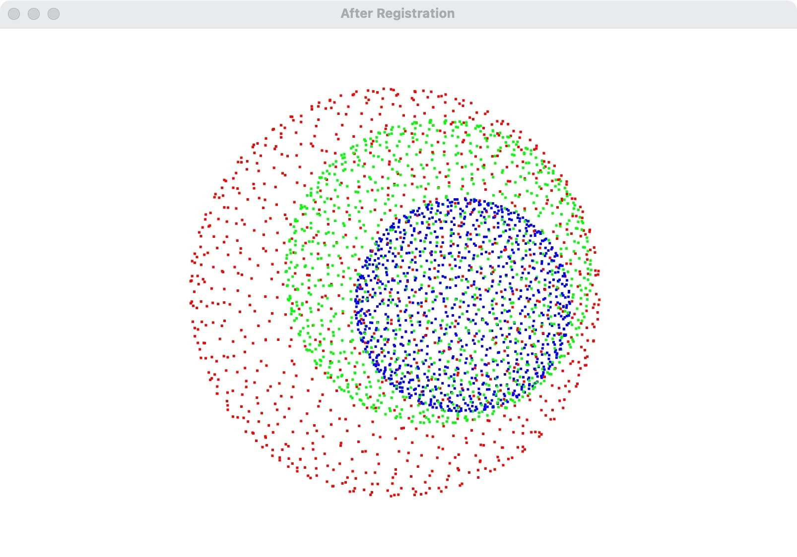 |


这些案例展示了 Open3D 中不同点云配准方法的基本用法。


## 11. 点云表面重建

### 11.1 Alpha形状重建

Alpha 形状用一个几何尺度描述点集的边界。本文关注三维点云重建；[Open3D API](https://www.open3d.org/docs/0.19.0/python_api/open3d.geometry.TriangleMesh.html)参考的是 Edelsbrunner 与 Mücke 的三维 Alpha Shapes 方法。

#### 11.1.1 三维重建中的几何对象 {#1111-原理}

在三维点云中，应从 Delaunay **四面体剖分**理解这个过程，而不是直接套用二维三角形外接圆的筛选描述。Open3D 构造或复用 `TetraMesh`，根据 alpha 尺度选择四面体，并提取所选体积的边界三角面。共享的内部面不应成为最终表面。

alpha 与点坐标使用相同长度尺度。缩小 alpha 可能保留凹陷，也可能断开薄结构或得到空网格；增大 alpha 会填入更多区域，大值趋近凸包，并不是对同一张曲面做普通平滑。若需要重复比较多个 alpha，可以预先计算四面体网格并复用，见 [Open3D 表面重建教程](https://www.open3d.org/docs/0.19.0/tutorial/geometry/surface_reconstruction.html)。

#### 11.1.2 代码示例

以下是使用Open3D库进行Alpha形状重建的代码示例：

```python
import open3d as o3d

# 读取点云
pcd = o3d.io.read_point_cloud("doll_1.ply")

# 估计法线
pcd.estimate_normals(search_param=o3d.geometry.KDTreeSearchParamHybrid(radius=0.1, max_nn=30))

# Alpha形状重建
alpha = 0.03  # 调整alpha值
mesh_alpha = o3d.geometry.TriangleMesh.create_from_point_cloud_alpha_shape(pcd, alpha)

# 可视化Alpha形状重建结果
mesh_alpha.compute_vertex_normals()
o3d.visualization.draw_geometries([mesh_alpha], window_name=f"Alpha Shape Reconstruction with alpha={alpha}")
```

#### 11.1.3 调整Alpha值

通过调整alpha值，可以生成不同细节程度的形状：

- **较小的 alpha**：可能保留细结构，也可能断裂、产生孔洞或空结果。
- **较大的 alpha**：连接更多区域，极限趋向凸包，不等同于普通平滑滤波。

#### 11.1.4 总结

Alpha形状重建是一种有效的从点云数据生成三角网格的方法，通过调整alpha值，可以控制生成形状的细节程度。它在计算几何和计算机图形学中有广泛的应用。


```python
import open3d as o3d

# 读取点云
pcd = o3d.io.read_point_cloud("doll_1.ply")

# 估计法线
pcd.estimate_normals(search_param=o3d.geometry.KDTreeSearchParamHybrid(radius=0.1, max_nn=30))

# 调整Alpha形状重建参数
print("调整Alpha形状重建参数...")
alphas = [0.01, 0.03, 0.05]
for alpha in alphas:
    mesh_alpha = o3d.geometry.TriangleMesh.create_from_point_cloud_alpha_shape(pcd, alpha)
    mesh_alpha.compute_vertex_normals()
    title = f"Alpha Shape Reconstruction with alpha={alpha}"
    print(title)
    o3d.visualization.draw_geometries([mesh_alpha], window_name=title)
```

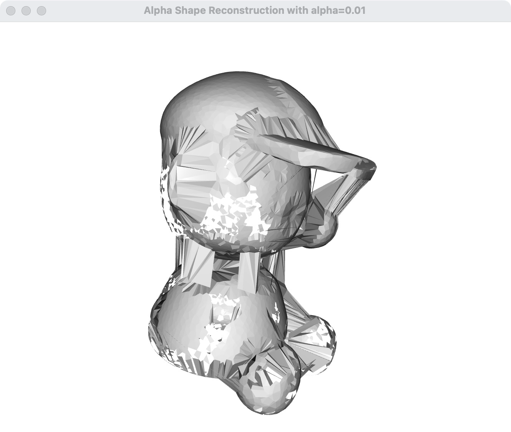

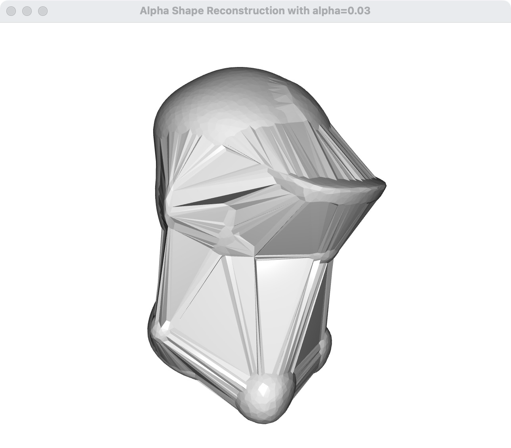

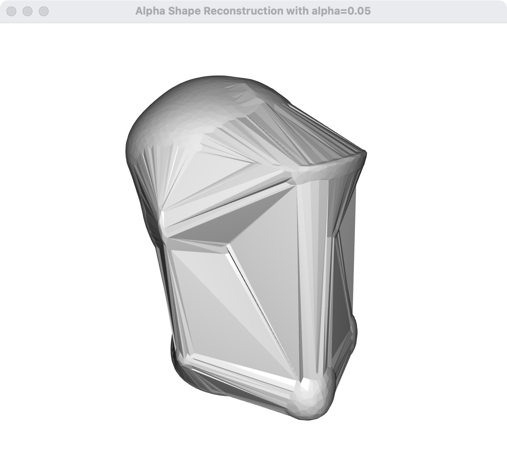

### 11.2 泊松重建

输入需要方向一致的法线；`estimate_normals` 本身不保证全局朝向正确。重建结果可能在低密度区域外推，需结合返回的 density、观测边界和任务需求裁剪，而不是将输出整体视为真实观测表面。
泊松重建（Poisson Surface Reconstruction）是一种从点云数据生成平滑三角网格的方法。它基于泊松方程，通过全局优化的方法生成表面，能够有效处理噪声和不完整的点云数据。

#### 11.2.1 原理

重建的未知量是空间中的**标量隐式函数** $\chi(x)$，而不是“点云的散度”。把点的位置和一致法线扩展成向量场 $\mathbf V(x)$，希望标量函数的梯度尽可能接近它：

$$
\min_\chi\int_\Omega\|\nabla\chi(x)-\mathbf V(x)\|^2\,dx.
$$

对这个能量取变分，并配合相应边界条件，得到基本的 Poisson 方程：

$$
\Delta\chi=\nabla\!\cdot\mathbf V,
\qquad \Delta=\nabla\!\cdot\nabla.
$$

左边是**待求函数的 Laplacian**，右边是**已构造向量场的散度**。仅写 $\nabla\cdot\mathbf V=\rho$ 没有说明要求解哪个未知函数，也就无法解释表面从何而来。求出 $\chi$ 后，再提取合适的等值面形成三角网格。[Poisson Surface Reconstruction 原论文](https://hhoppe.com/poissonrecon.pdf)

直观上，法线告诉算法“表面朝哪里”，隐式函数把这些局部方向整合成一个整体表面。法线局部翻转会让这些约束互相冲突；没有扫描到的区域则缺少直接证据，重建仍可能在那里补出表面。

实现通常使用自适应八叉树，在需要的位置分配更细的空间表示，并求解耦合的稀疏系统；不是每个节点各自独立重建一小块。Open3D 的接口采用 Screened Poisson 实现，还包含点约束；上面的基本方程用于理解其核心思想，不是完整复刻库内目标函数。[Open3D 表面重建说明](https://www.open3d.org/docs/0.19.0/tutorial/geometry/surface_reconstruction.html)

#### 11.2.2 代码示例

下面假定输入是已去除离群点、具有足够局部邻居的物体表面。半径 0.1 使用点云本身的长度单位，不能对米制和毫米制数据原样复用。局部方向传播也不能替代对多层薄面、断开组件和扫描视点的检查。

```python
import open3d as o3d

# 读取点云
pcd = o3d.io.read_point_cloud("doll_1.ply")

# 估计法线
pcd.estimate_normals(search_param=o3d.geometry.KDTreeSearchParamHybrid(radius=0.1, max_nn=30))

# 传播相邻法线的方向；并非保证每个复杂场景的全局朝向都正确
pcd.orient_normals_consistent_tangent_plane(k=30)

# 泊松重建
depth = 9  # 调整深度参数
mesh_poisson, densities = o3d.geometry.TriangleMesh.create_from_point_cloud_poisson(pcd, depth=depth)

# 可视化泊松重建结果
mesh_poisson.compute_vertex_normals()
o3d.visualization.draw_geometries([mesh_poisson], window_name=f"Poisson Reconstruction with depth={depth}")
```

<details>
<summary>历史模型显示结果</summary>

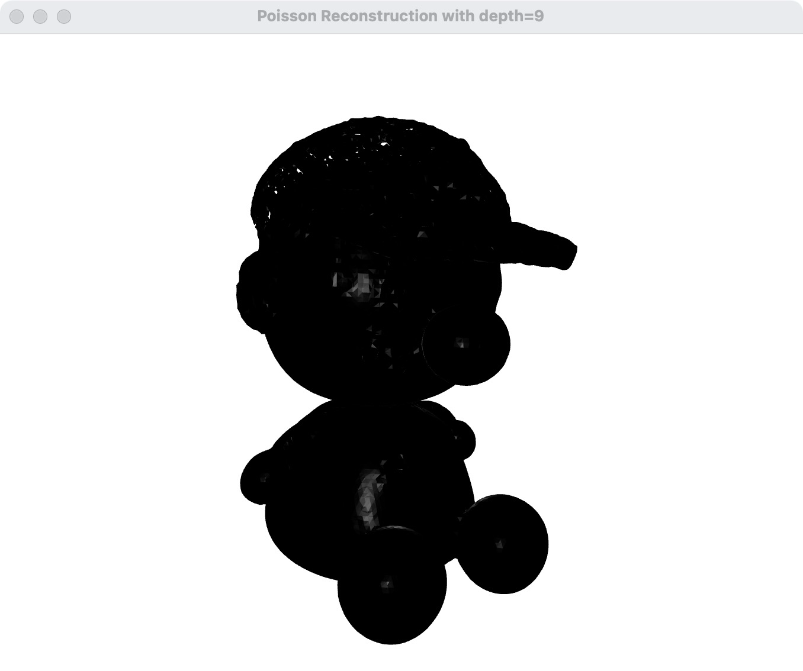

截图主要呈现模型轮廓；颜色和明暗不是误差指标。应进一步检查采样点到重建面的距离、薄结构、观测边界与低密度区域。

</details>

#### 11.2.3 调整深度参数

通过调整深度参数，可以控制生成的网格的细节程度：

- **较小的深度上限**：限制可表示的空间细节，通常减少计算与内存开销。
- **较大的深度上限**：允许更细的自适应划分，也可能增加开销或拟合噪声；不保证实际精度提高。

`depth` 是八叉树深度上限，不是输出网格的固定边长。还要结合物体尺度、点间距、法线质量和重建参数判断结果。

#### 11.2.4 总结

泊松重建把带方向的点整合成隐式表面。返回的 `densities` 与输出网格顶点对应，可辅助识别观测支持较弱的区域，但它不是几何误差或成功概率。裁剪低密度顶点是后处理选择，应保留阈值和裁剪前后统计，避免误删真实的稀疏结构。


## 12.  最小包围盒

使用Open3D计算点云的包围盒可以通过以下两种方式：轴对齐包围盒（Axis-Aligned Bounding Box, AABB）和有向包围盒（Oriented Bounding Box, OBB）。
下面是一个示例代码，展示如何计算和可视化这两种包围盒。

- **示例代码**

```python
import open3d as o3d

# 读取点云
pcd = o3d.io.read_point_cloud("doll_1.ply")

# 计算轴对齐包围盒（AABB）
aabb = pcd.get_axis_aligned_bounding_box()

# 计算有向包围盒（OBB）
obb = pcd.get_oriented_bounding_box()

# 设置包围盒的颜色
aabb.color = (1, 0, 0)  # 红色
obb.color = (0, 1, 0)   # 绿色

# 可视化点云和包围盒
o3d.visualization.draw_geometries([pcd, aabb, obb], window_name="Bounding Boxes")
```

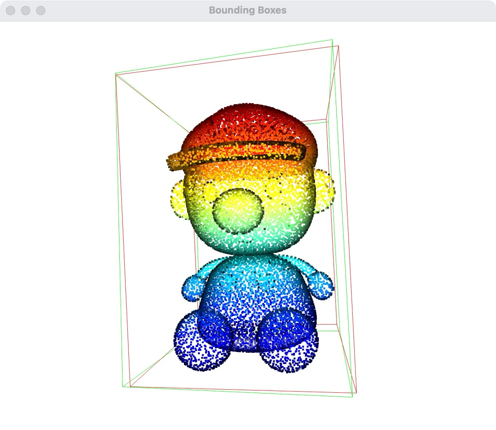

- **说明**

1. **读取点云**：
   - 使用 `o3d.io.read_point_cloud` 函数读取点云数据。

2. **计算轴对齐包围盒（AABB）**：
   - 使用 `pcd.get_axis_aligned_bounding_box()` 方法计算点云的轴对齐包围盒。AABB是一个与坐标轴对齐的最小包围盒。

3. **计算有向包围盒（OBB）**：
   - 使用 `pcd.get_oriented_bounding_box()` 方法计算点云的有向包围盒。该接口通常基于 PCA 计算近似 OBB，不保证全局最小体积；精确/更紧的包围盒需核对版本提供的相应接口。

4. **设置包围盒的颜色**：
   - 通过设置 `color` 属性来改变包围盒的颜色，以便在可视化时区分不同的包围盒。

5. **可视化点云和包围盒**：
   - 使用 `o3d.visualization.draw_geometries` 函数同时可视化点云和包围盒。

- **总结**

通过上述代码，可以使用Open3D计算点云的轴对齐包围盒和有向包围盒，并进行可视化。这对于点云数据的分析和处理非常有用。


## 13. 凸包

使用Open3D计算点云的凸包可以通过 `compute_convex_hull` 方法来实现。
以下是一个示例代码，展示如何计算和可视化点云的凸包。

- **示例代码**

```python
import open3d as o3d

# 读取点云
pcd = o3d.io.read_point_cloud("doll_1.ply")

# 计算凸包
hull, _ = pcd.compute_convex_hull()

# 设置凸包的颜色
hull.paint_uniform_color([1, 0, 0])  # 红色

# 可视化点云和凸包
o3d.visualization.draw_geometries([pcd, hull], window_name="Convex Hull")
```

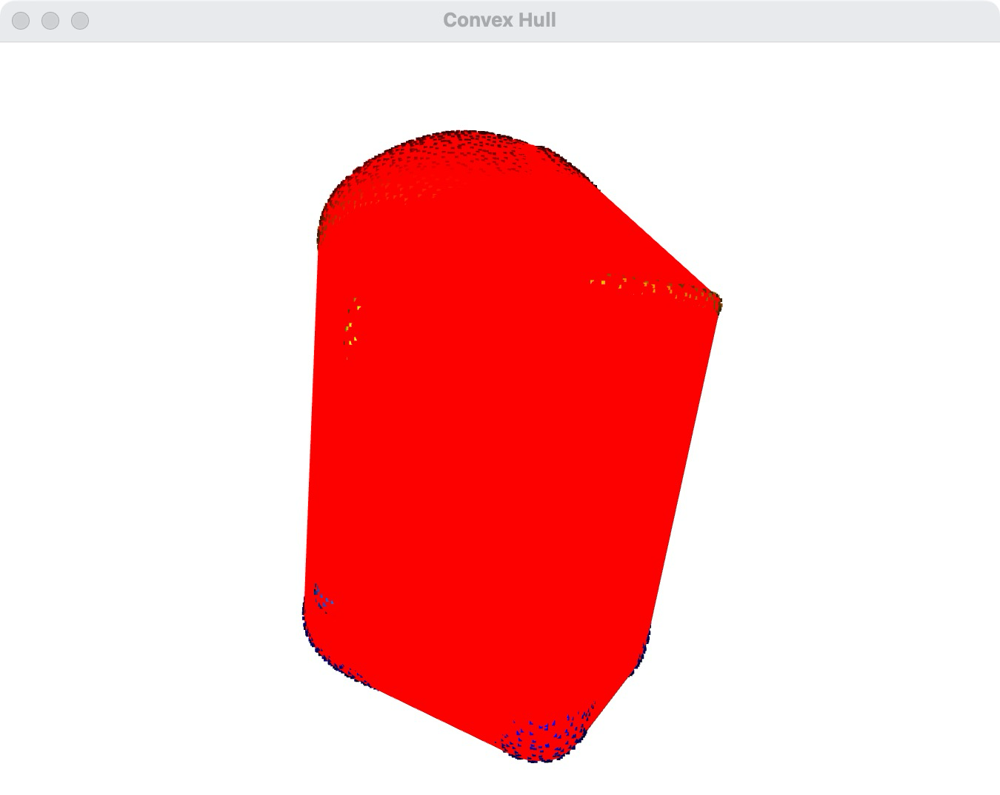

- **说明**

1. **读取点云**：
   - 使用 `o3d.io.read_point_cloud` 函数读取点云数据。

2. **计算凸包**：
   - 使用 `pcd.compute_convex_hull()` 方法计算点云的凸包。该方法返回一个三角网格表示的凸包和一个索引数组（这里我们只关心凸包）。

3. **设置凸包的颜色**：
   - 使用 `hull.paint_uniform_color([1, 0, 0])` 方法将凸包的颜色设置为红色，以便在可视化时区分凸包和点云。

4. **可视化点云和凸包**：
   - 使用 `o3d.visualization.draw_geometries` 函数同时可视化点云和凸包。

- **总结**

	- 通过上述代码，可以使用Open3D计算点云的凸包，并进行可视化。这对于点云数据的分析和处理非常有用，特别是在需要了解点云的外部形状时。


## 14. 体素化

体素可以理解为空间中的立方格子，但下面两个操作的输出不同：

| 操作 | 每个有点的格子保留什么 | 输出类型 |
| --- | --- | --- |
| `voxel_down_sample` | 格内原始点的平均位置，以及相应属性聚合 | 更少的点 |
| `VoxelGrid.create_from_point_cloud` | 哪些格子被输入点占据，可附带颜色 | 占用体素集合 |
{.table-readable}

**平均位置由格内样本决定，格子中心由网格原点与边长决定。** 一个格子里的点都挤在左下角时，重心仍在左下角，体素中心却不会移动。将这两种输出混用，会平白改变几何位置。[Open3D 体素化说明](https://www.open3d.org/docs/0.19.0/tutorial/geometry/voxelization.html)

### 14.1 用五个点手算区别

设长度单位为米，网格原点为 $(0,0,0)$，边长为 1。输入五个点：

```python
import numpy as np
import open3d as o3d

points = np.array([[.1, .1, .1], [.2, .1, .1], [.1, .3, .2],
                   [1.1, .2, .1], [1.8, .7, .2]])
pcd = o3d.geometry.PointCloud(o3d.utility.Vector3dVector(points))
lower, upper = np.zeros(3), np.array([3., 2., 1.])
grid = o3d.geometry.VoxelGrid.create_from_point_cloud_within_bounds(
    pcd, voxel_size=1., min_bound=lower, max_bound=upper)
down, _, original_indexes = pcd.voxel_down_sample_and_trace(1., lower, upper)
print("occupied cells:", len(grid.get_voxels()))  # 2
print("downsampled points:", len(down.points))  # 2
```

这里显式固定两种操作的网格边界，方便一一比较；仅给出相同的 `voxel_size`，不能假设所有接口采用相同的原点或输出顺序。`original_indexes` 可追溯每个降采样点来自哪些输入点，不要靠数组位置猜测对应关系。

| 网格索引 | 输入点数 | 样本重心 XYZ，m | 体素中心 XYZ，m |
| --- | ---: | --- | --- |
| `(0, 0, 0)` | 3 | `(0.1333, 0.1667, 0.1333)` | `(0.5, 0.5, 0.5)` |
| `(1, 0, 0)` | 2 | `(1.45, 0.45, 0.15)` | `(1.5, 0.5, 0.5)` |
{.table-readable}

对于原点 $o$、边长 $v$ 和整数索引 $k$，体素中心是 $o+v(k+\tfrac12)$；样本重心则是 $\frac1N\sum_i p_i$。两者分别回答“这个格子在哪里”和“这些测量点平均在哪里”。

<figure class="article-figure">

<figcaption><span class="article-figure__number">图 4</span><span class="article-figure__text">同一固定网格上的实际坐标投影；所有点都在 Z∈[0,1) 这一层。颜色区分格子和点的类型，星号与叉号也能独立辨认两种代表位置。</span></figcaption>
</figure>

[完整验证与绘图脚本](voxel_centroid_check.py)检查每个格子的原始索引、重心和中心公式。安装 Open3D、NumPy、Matplotlib 后运行 `python voxel_centroid_check.py --plot voxel-centroids.png`；不需要模型文件或显示窗口。

### 14.2 接到机器人地图之前还要分清什么

- **没有点不等于没有障碍。** 点云可能只采到物体表面，背面和遮挡区仍然未知；`VoxelGrid` 不会仅凭点集合自动给出可靠的自由空间。
- **占用格子不等于填满物体内部。** 从点建立的体素集合主要反映采样位置；实体填充、射线清空、TSDF 和距离场是另外的处理。
- **体素尺寸有物理单位。** 数据是米制时 `0.05` 表示 5 cm；毫米制数据中同一个数则小了 1,000 倍。应先检查包围盒尺度，再设置参数。
- **更粗并非总能保留结构。** 细杆、孔洞和相邻表面可能在粗网格里合并；用于碰撞或抓取时，要检查最小关键结构相对体素边长的比例。

这样看，降采样主要控制测量点数量，体素化建立空间离散表示；它们都需要按后续任务验收，而不是只看显示窗口是否出现一个模型。


## 阅读自测与验收

- 对滤波前后点数、法线、包围盒和坐标单位做数值检查；可视化颜色或视角变化不等于几何处理成功。
- 在已知刚体变换的点云上检验配准，同时报告 fitness、RMSE 与变换误差；对称物体尤其不能仅凭视觉重合判断唯一解。
