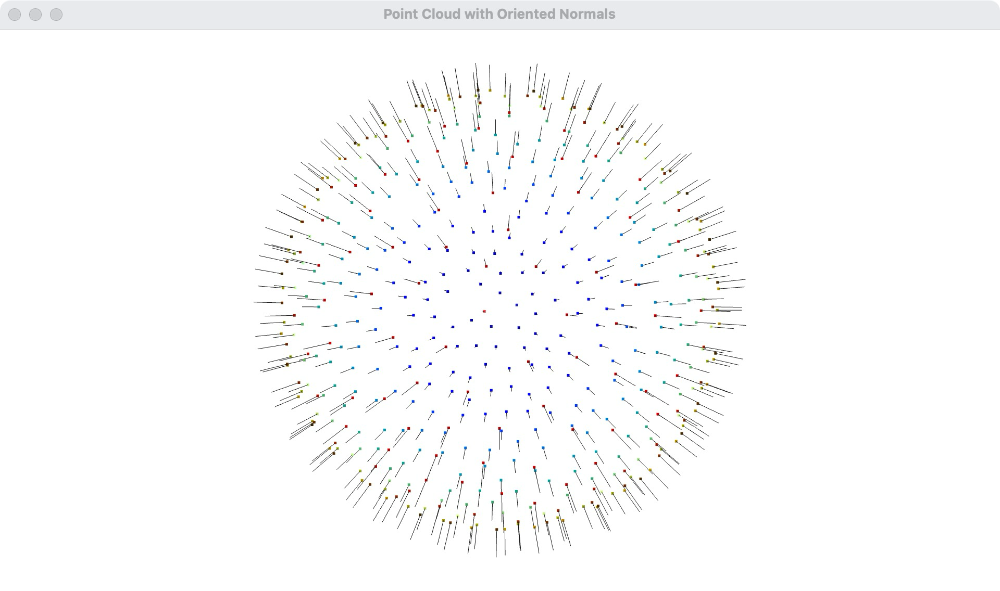

本章仅为个人学习整理。

Open3D: [https://www.open3d.org/](https://www.open3d.org/)
Github repo: [https://github.com/isl-org/Open3D
](https://github.com/isl-org/Open3D)


# 1. 概述
Open3D 是一个开源库，旨在为 3D 数据处理提供高效且易用的工具。它由 Intel 开发和维护，支持多种 3D 数据处理任务，如点云处理、3D 重建、几何处理和可视化等。
## 1.1 主要功能
- 点云处理：
  - 支持点云的读取、写入和可视化。
  - 提供点云滤波、配准、分割和特征提取等功能。
- 3D 重建：
  - 支持从深度图像生成 3D 网格。
  - 提供多视图 3D 重建算法。
- 几何处理：
  - 支持对三角网格、体素网格和曲面的处理。
  - 提供几何变换、简化和布尔运算等功能。
- 可视化：
  - 提供交互式的 3D 可视化工具。
  - 支持点云、网格和体素的渲染。
- 机器学习：
  - 提供与深度学习框架的集成，支持 3D 数据的机器学习任务。


# 2. 安装

## 2.1 安装 Open3D

### 方法一：通过 pip 安装
可以直接使用 pip 安装 Open3D：
```bash
pip install open3d
```

### 方法二：手动安装
你也可以从 [PyPI](https://pypi.org/project/open3d/0.18.0/#description) 下载对应版本的 `.whl` 文件，然后手动安装。例如，对于 Linux x86 系统和 Python 3.9 环境：
```bash
pip install open3d-0.18.0-cp39-cp39-manylinux_2_27_x86_64.whl
```

### 方法三：安装 CPU 版本
如果不使用 NVIDIA 的 CUDA，可以考虑安装 CPU 版本：
```bash
pip install open3d-cpu
```

### 方法四：源码安装
你也可以从源码安装 Open3D。具体步骤可以参考 [Open3D 的官方文档](http://www.open3d.org/docs/release/compilation.html)。

## 2.2 第三方库管理
Open3D 使用 CMake 来管理第三方库。CMake 是一个跨平台的构建系统，它可以帮助自动化软件构建过程，包括查找和配置第三方库。Open3D 通过 CMake 的 `find_package` 和 `ExternalProject` 模块来管理第三方库。

- **第三方库管理步骤**

1. **查找系统库**：
   - Open3D 使用 `find_package` 命令查找系统中已经安装的库。例如，查找 Eigen 库：
     ```cmake
     find_package(Eigen3 REQUIRED)
     include_directories(${EIGEN3_INCLUDE_DIR})
     ```

2. **下载和构建外部项目**：
   - 对于一些没有预安装的库，Open3D 使用 `ExternalProject_Add` 命令从源代码下载并构建这些库。例如，下载并构建 GLFW：
     ```cmake
     include(ExternalProject)
     ExternalProject_Add(glfw
       GIT_REPOSITORY https://github.com/glfw/glfw.git
       GIT_TAG latest
       CMAKE_ARGS -DCMAKE_INSTALL_PREFIX=${CMAKE_BINARY_DIR}/third_party_install
     )
     ```

3. **使用 `third_party` 目录**：
   - Open3D 在其源代码中包含了一些第三方库的副本，这些库存放在 `third_party` 目录下。CMakeLists.txt 文件会配置这些库的构建和链接。例如，配置和使用 Filament 库：
     ```cmake
     add_subdirectory(third_party/filament)
     include_directories(third_party/filament/include)
     ```
Open3D 通过 CMake 的 `find_package` 和 `ExternalProject_Add` 命令来查找和管理第三方库，并使用 `third_party` 目录包含一些必要的库。这样可以确保在不同平台上都能顺利构建和运行 Open3D。

## 2.3 编译原理

1. **CMake 配置**：
   - Open3D 使用 CMake 作为构建系统。CMakeLists.txt 文件定义了项目的构建配置，包括源文件、依赖项、编译选项等。
   - CMake 会生成适合目标平台的构建文件（如 Makefile 或 Visual Studio 项目文件）。

2. **依赖项管理**：
   - Open3D 依赖多个第三方库，如 Eigen（用于线性代数计算）、GLFW（用于窗口管理）、Pybind11（用于 Python 绑定）等。
   - CMake 会自动查找和配置这些依赖项。

3. **编译和链接**：
   - CMake 生成的构建文件会调用编译器（如 GCC 或 Clang）编译源代码，并链接生成目标文件（如库或可执行文件）。
   - 编译过程中会根据配置选项启用或禁用某些功能模块。

4. **Python 绑定**：
   - 如果启用了 Python 绑定，Open3D 会使用 Pybind11 生成 Python 模块，使得 Open3D 可以在 Python 中使用。
   - 编译过程中会生成 `_pybind` 模块，并将其安装到 Python 的包目录中。


# 3. 点云写入、读取、可视化
`open3d.io.write_point_cloud` 是一个用于将点云数据写入文件的函数。
`open3d.io.read_point_cloud` 是一个用于从文件中读取点云数据的函数。
`open3d.visualization.draw_geometries` 是一个用于可视化几何对象列表的函数。
## 3.1 点云写入文件
```python
open3d.io.write_point_cloud(
    filename: os.PathLike, 
    pointcloud: open3d.geometry.PointCloud, 
    format: str = 'auto', 
    write_ascii: bool = False, 
    compressed: bool = False, 
    print_progress: bool = False
) -> bool
```
参数说明
`filename (os.PathLike)`：文件路径。
`pointcloud (open3d.geometry.PointCloud)`：要写入的 PointCloud 对象。
`format (str, optional, default='auto')`：输出文件的格式。当未指定或设置为 auto 时，格式将从文件扩展名推断。
`write_ascii (bool, optional, default=False)`：如果为 True，则以 ASCII 格式输出，否则使用二进制格式。
`compressed (bool, optional, default=False)`：如果为 True，则以压缩格式写入。
`print_progress (bool, optional, default=False)`：如果为 True，在控制台中显示进度条。

## 3.2 读取点云文件
```python
open3d.io.read_point_cloud(
    filename: os.PathLike, 
    format: str = 'auto', 
    remove_nan_points: bool = False, 
    remove_infinite_points: bool = False, 
    print_progress: bool = False
) -> open3d.geometry.PointCloud
```
参数说明
`filename (os.PathLike)`：文件路径。
`format (str, optional, default='auto')`：输入文件的格式。当未指定或设置为 auto 时，格式将从文件扩展名推断。
`remove_nan_points (bool, optional, default=False)`：如果为 True，则移除包含 NaN 值的点。
`remove_infinite_points (bool, optional, default=False)`：如果为 True，则移除包含无限值的点。
`print_progress (bool, optional, default=False)`：如果为 True，在控制台中显示进度条。

## 3.3 可视化点云
```python
open3d.visualization.draw_geometries(
    geometry_list: list[open3d.geometry.Geometry], 
    window_name: str = 'Open3D', 
    width: int = 1920, 
    height: int = 1080, 
    left: int = 50, 
    top: int = 50, 
    point_show_normal: bool = False, 
    mesh_show_wireframe: bool = False, 
    mesh_show_back_face: bool = False, 
    lookat: numpy.ndarray[numpy.float64[3, 1]] | None = None, 
    up: numpy.ndarray[numpy.float64[3, 1]] | None = None, 
    front: numpy.ndarray[numpy.float64[3, 1]] | None = None, 
    zoom: float | None = None
) -> None
```
参数说明
`geometry_list (list[open3d.geometry.Geometry])`：要可视化的几何对象列表。
`window_name (str, optional, default='Open3D')`：可视化窗口的标题。
`width (int, optional, default=1920)`：可视化窗口的宽度。
`height (int, optional, default=1080)`：可视化窗口的高度。
`left (int, optional, default=50)`：可视化窗口的左边距。
`top (int, optional, default=50)`：可视化窗口的上边距。
`point_show_normal (bool, optional, default=False)`：如果为 True，则显示点的法线。
`mesh_show_wireframe (bool, optional, default=False)`：如果为 True，则显示网格的线框。
`mesh_show_back_face (bool, optional, default=False)`：如果为 True，则显示网格三角形的背面。
`lookat (Optional[numpy.ndarray[numpy.float64[3, 1]]], optional, default=None)`：相机的 lookat 向量。
`up (Optional[numpy.ndarray[numpy.float64[3, 1]]], optional, default=None)`：相机的 up 向量。
`front (Optional[numpy.ndarray[numpy.float64[3, 1]]], optional, default=None)`：相机的 front 向量。
`zoom (Optional[float], optional, default=None)`：相机的缩放。

## 3.4 使用案例
```python
import open3d as o3d
import numpy as np

# 生成一个简单的点云（例如，一个立方体的顶点）
points = np.array([
    [0, 0, 0],
    [1, 0, 0],
    [1, 1, 0],
    [0, 1, 0],
    [0, 0, 1],
    [1, 0, 1],
    [1, 1, 1],
    [0, 1, 1],
])

# 创建 PointCloud 对象
pcd = o3d.geometry.PointCloud()

# 将点添加到 PointCloud 对象中
pcd.points = o3d.utility.Vector3dVector(points)

# 保存点云到文件
o3d.io.write_point_cloud("generated_point_cloud.ply", pcd)

# 读取点云文件
load_pcd = o3d.io.read_point_cloud("generated_point_cloud.ply")

# 可视化点云
o3d.visualization.draw_geometries([load_pcd])
```

# 4. TriangleMesh 读取、保存
**TriangleMeshIO**节选代码: [https://github.com/isl-org/Open3D/blob/main/cpp/open3d/io/TriangleMeshIO.cpp](https://github.com/isl-org/Open3D/blob/main/cpp/open3d/io/TriangleMeshIO.cpp)

```cpp
static const std::unordered_map<
        std::string,
        std::function<bool(const std::string &,
                           geometry::TriangleMesh &,
                           const ReadTriangleMeshOptions &)>>
        file_extension_to_trianglemesh_read_function{
                {"ply", ReadTriangleMeshFromPLY},
                {"stl", ReadTriangleMeshUsingASSIMP},
                {"obj", ReadTriangleMeshUsingASSIMP},
                {"off", ReadTriangleMeshFromOFF},
                {"gltf", ReadTriangleMeshUsingASSIMP},
                {"glb", ReadTriangleMeshUsingASSIMP},
                {"fbx", ReadTriangleMeshUsingASSIMP},
        };

static const std::unordered_map<
        std::string,
        std::function<bool(const std::string &,
                           const geometry::TriangleMesh &,
                           const bool,
                           const bool,
                           const bool,
                           const bool,
                           const bool,
                           const bool)>>
        file_extension_to_trianglemesh_write_function{
                {"ply", WriteTriangleMeshToPLY},
                {"stl", WriteTriangleMeshToSTL},
                {"obj", WriteTriangleMeshToOBJ},
                {"off", WriteTriangleMeshToOFF},
                {"gltf", WriteTriangleMeshToGLTF},
                {"glb", WriteTriangleMeshToGLTF},
        };

}  // unnamed namespace
```
在这段代码中，`open3d` 使用 `assimp` 来读取和写入多种三角网格文件格式。以下是支持的文件格式：

## 4.1 支持的读取文件格式
- `ply` (使用 `ReadTriangleMeshFromPLY` 函数)
- `stl` (使用 `ReadTriangleMeshUsingASSIMP` 函数)
- `obj` (使用 `ReadTriangleMeshUsingASSIMP` 函数)
- `off` (使用 `ReadTriangleMeshFromOFF` 函数)
- `gltf` (使用 `ReadTriangleMeshUsingASSIMP` 函数)
- `glb` (使用 `ReadTriangleMeshUsingASSIMP` 函数)
- `fbx` (使用 `ReadTriangleMeshUsingASSIMP` 函数)

## 4.2 支持的写入文件格式
- `ply` (使用 `WriteTriangleMeshToPLY` 函数)
- `stl` (使用 `WriteTriangleMeshToSTL` 函数)
- `obj` (使用 `WriteTriangleMeshToOBJ` 函数)
- `off` (使用 `WriteTriangleMeshToOFF` 函数)
- `gltf` (使用 `WriteTriangleMeshToGLTF` 函数)
- `glb` (使用 `WriteTriangleMeshToGLTF` 函数)

这些函数通过文件扩展名与相应的读取和写入函数进行映射，从而支持多种三角网格文件格式的读写操作。


## 4.3 TriangleMesh 读取
`open3d.io.read_triangle_mesh`
```python
open3d.io.read_triangle_mesh(
filename: os.PathLike, 
enable_post_processing: 
bool = False, 
print_progress: bool = False
) → open3d.geometry.TriangleMesh
```
参数说明
`filename`：文件路径，类型为 os.PathLike。
`enable_post_processing`：是否启用后处理，类型为 bool，默认值为 False。
`print_progress`：是否在控制台显示进度条，类型为 bool，默认值为 False。


```python
import open3d as o3d

# 定义文件路径
filename = "doll.stl"

try:
    # 尝试读取三角网格
    mesh = o3d.io.read_triangle_mesh(filename, enable_post_processing=True, print_progress=True)
    
    # 检查网格是否成功读取
    if mesh.is_empty():
        print("Failed to read the mesh. The file format may not be supported.")
    else:
        print("Successfully read the mesh.")
        # 可视化三角网格
        o3d.visualization.draw_geometries([mesh])
except Exception as e:
    print(f"An error occurred: {e}")
```


此时因为没有计算法线, 可视化出来的模型会涂成统一的灰色
然后我们可以`compute_vertex_normals`来计算出法线信息
```python
import open3d as o3d
import numpy as np

# 定义文件路径
filename = "doll.stl"

# 读取三角网格
mesh = o3d.io.read_triangle_mesh(filename, enable_post_processing=True, print_progress=True)

# 检查网格是否成功读取
if mesh.is_empty():
    print("Failed to read the mesh. The file format may not be supported.")
else:
    print("Successfully read the mesh.")
    
    # 计算法线
    mesh.compute_vertex_normals()
    
    # 设置网格的颜色为红色
    mesh.paint_uniform_color([1, 0, 0])  # 设置为红色

    # 创建一个可视化窗口
    vis = o3d.visualization.Visualizer()
    vis.create_window()

    # 添加网格到可视化窗口
    vis.add_geometry(mesh)

    # 更新几何体和渲染器
    vis.update_geometry(mesh)
    vis.poll_events()
    vis.update_renderer()

    # 渲染
    vis.run()
    vis.destroy_window()

```

```python
import open3d as o3d
import numpy as np

# 定义文件路径
filename = "doll.stl"

# 读取三角网格
mesh = o3d.io.read_triangle_mesh(filename)
if mesh.is_empty():
    print("Failed to read the mesh. The file format may not be supported.")
else:
    print("Successfully read the mesh.")

    # 计算法线
    mesh.compute_vertex_normals()

    # 设置材质
    mat_box = o3d.visualization.rendering.MaterialRecord()
    mat_box.shader = 'defaultLitSSR'
    mat_box.base_color = [0.467, 0.467, 0.467, 0.2]  # 设置透明度为0.2
    mat_box.base_roughness = 0.0
    mat_box.base_reflectance = 0.0
    mat_box.base_clearcoat = 1.0
    mat_box.thickness = 1.0
    mat_box.transmission = 1.0
    mat_box.absorption_distance = 10
    mat_box.absorption_color = [0.5, 0.5, 0.5]

    # 使用draw函数渲染
    o3d.visualization.draw(
        [{'name': 'box', 'geometry': mesh, 'material': mat_box}],
        show_skybox=False,
        width=800,
        height=600,
        bg_color=[0.5, 0.5, 0.5, 0.8]  # 设置背景颜色为灰色
    )
```


## 4.4 从mesh上提取点云

```python
import open3d as o3d
import numpy as np

# 定义文件路径
filename = "doll.stl"

# 读取三角网格
mesh = o3d.io.read_triangle_mesh(filename)
if mesh.is_empty():
    print("Failed to read the mesh. The file format may not be supported.")
else:
    print("Successfully read the mesh.")

    # 计算法线
    mesh.compute_vertex_normals()

    # 从mesh提取点云
    point_cloud = mesh.sample_points_uniformly(number_of_points=10000)

    # 设置材质
    mat_box = o3d.visualization.rendering.MaterialRecord()
    mat_box.shader = 'defaultLitSSR'
    mat_box.base_color = [0.467, 0.467, 0.467, 0.2]  # 设置透明度为0.2
    mat_box.base_roughness = 0.0
    mat_box.base_reflectance = 0.0
    mat_box.base_clearcoat = 1.0
    mat_box.thickness = 1.0
    mat_box.transmission = 1.0
    mat_box.absorption_distance = 10
    mat_box.absorption_color = [0.5, 0.5, 0.5]

    # 使用draw函数渲染
    o3d.visualization.draw(
        [{'name': 'box', 'geometry': mesh, 'material': mat_box},
         {'name': 'point_cloud', 'geometry': point_cloud}],
        show_skybox=False,
        width=800,
        height=600,
        bg_color=[0.5, 0.5, 0.5, 0.8]  # 设置背景颜色为灰色
    )
```


# 5. KD-Tree

## 5.1 KD-树 说明与算法原理
### 5.1.1 KD-树的简介

KD-树（K-Dimension Tree）是一种用于多维空间数据的搜索数据结构，其构建和搜索过程类似于二叉搜索树，但适用于高维场景。通过交替使用各维特征进行划分，KD-树能在 \(O(\log N)\) 的时间复杂度内实现最近邻搜索。此外，它还支持动态插入新节点，通过一种类似替罪羊树的方法保持一定的结构平衡，确保插入效率。
另外, 可以直接看wiki的说明:
[https://en.wikipedia.org/wiki/K-d_tree](https://en.wikipedia.org/wiki/K-d_tree)

### 5.1.2 KD-树的构建

KD-树的构建过程如下：

1. **选择分割维度**：从根节点开始，依次选择各维度进行分割。通常选择数据点在该维度上的中位数作为分割点。
2. **递归构建子树**：将数据点分为两部分，左子树包含小于等于分割点的数据点，右子树包含大于分割点的数据点。递归地对每个子树进行上述操作，直到所有数据点都被处理完。

### 5.1.3 KD-树的搜索

KD-树的搜索过程如下：

1. **递归搜索**：从根节点开始，根据查询点在当前分割维度上的值，递归地搜索左子树或右子树。
2. **回溯检查**：在回溯过程中，检查当前节点是否比已找到的最近邻更接近查询点。如果是，则更新最近邻。
3. **检查其他子树**：如果查询点与当前分割平面的距离小于已找到的最近邻距离，则需要检查另一个子树。

### 5.1.4 KD-树的插入

KD-树的插入过程如下：

1. **找到插入位置**：从根节点开始，递归地找到适合插入新节点的位置。
2. **插入新节点**：在找到的插入位置插入新节点，并根据需要调整树的结构以保持平衡。

### 5.1.5 KD-树的应用

KD-树广泛应用于以下场景：

1. **最近邻搜索**：在点云处理、图像检索等领域，KD-树可以高效地找到距离查询点最近的点。
2. **范围查询**：在地理信息系统中，KD-树可以用于查找指定范围内的所有点。
3. **聚类分析**：在机器学习中，KD-树可以用于加速 K-means 聚类算法。

### 5.1.6 KD-树的C++实现

以下是一个简单的 KD-树的 C++ 实现示例：

```cpp
#include <iostream>
#include <vector>
#include <algorithm>

struct Point {
    std::vector<double> coords;
    Point(std::initializer_list<double> init) : coords(init) {}
};

struct KDNode {
    Point point;
    KDNode* left;
    KDNode* right;
    KDNode(Point p) : point(p), left(nullptr), right(nullptr) {}
};

class KDTree {
public:
    KDTree(const std::vector<Point>& points) {
        root = build(points, 0);
    }

    KDNode* build(const std::vector<Point>& points, int depth) {
        if (points.empty()) return nullptr;
        int k = points[0].coords.size();
        int axis = depth % k;
        std::vector<Point> sorted_points = points;
        std::sort(sorted_points.begin(), sorted_points.end(), [axis](const Point& a, const Point& b) {
            return a.coords[axis] < b.coords[axis];
        });
        int median = sorted_points.size() / 2;
        KDNode* node = new KDNode(sorted_points[median]);
        std::vector<Point> left_points(sorted_points.begin(), sorted_points.begin() + median);
        std::vector<Point> right_points(sorted_points.begin() + median + 1, sorted_points.end());
        node->left = build(left_points, depth + 1);
        node->right = build(right_points, depth + 1);
        return node;
    }

    void nearestNeighborSearch(const Point& query, Point& best, double& best_dist, KDNode* node, int depth) {
        if (!node) return;
        int k = query.coords.size();
        int axis = depth % k;
        double dist = distance(query, node->point);
        if (dist < best_dist) {
            best_dist = dist;
            best = node->point;
        }
        double diff = query.coords[axis] - node->point.coords[axis];
        KDNode* near = diff <= 0 ? node->left : node->right;
        KDNode* far = diff <= 0 ? node->right : node->left;
        nearestNeighborSearch(query, best, best_dist, near, depth + 1);
        if (std::abs(diff) < best_dist) {
            nearestNeighborSearch(query, best, best_dist, far, depth + 1);
        }
    }

    Point nearestNeighbor(const Point& query) {
        Point best = root->point;
        double best_dist = distance(query, best);
        nearestNeighborSearch(query, best, best_dist, root, 0);
        return best;
    }

private:
    KDNode* root;

    double distance(const Point& a, const Point& b) {
        double dist = 0;
        for (size_t i = 0; i < a.coords.size(); ++i) {
            dist += (a.coords[i] - b.coords[i]) * (a.coords[i] - b.coords[i]);
        }
        return dist;
    }
};

int main() {
    std::vector<Point> points = {{2.0, 3.0}, {5.0, 4.0}, {9.0, 6.0}, {4.0, 7.0}, {8.0, 1.0}, {7.0, 2.0}};
    KDTree tree(points);
    Point query = {9.0, 2.0};
    Point nearest = tree.nearestNeighbor(query);
    std::cout << "最近邻点: (" << nearest.coords[0] << ", " << nearest.coords[1] << ")\n";
    return 0;
}
```
**KD-树**是一种高效的多维空间数据搜索结构，适用于最近邻搜索、范围查询和聚类分析等场景。通过交替使用各维特征进行划分，KD-树能在 \(O(\log N)\) 的时间复杂度内实现高效搜索。


## 5.2 KDTreeFlann接口

Open3D 提供了 `KDTreeFlann` 类，用于高效的空间查询。主要的接口包括：

- **search_knn_vector_3d**：最近邻搜索
  ```python
  [k, idx, dist] = kdtree.search_knn_vector_3d(query_point, k)
  ```
  - `query_point`：查询点
  - `k`：返回最近邻的数量
  - 返回值：`k` 为找到的邻居数量，`idx` 为邻居的索引，`dist` 为邻居的距离

- **search_radius_vector_3d**：半径搜索
  ```python
  [k, idx, dist] = kdtree.search_radius_vector_3d(query_point, radius)
  ```
  - `query_point`：查询点
  - `radius`：搜索半径
  - 返回值：`k` 为找到的邻居数量，`idx` 为邻居的索引，`dist` 为邻居的距离

- **search_hybrid_vector_3d**：固定距离搜索
  ```python
  [k, idx, dist] = kdtree.search_hybrid_vector_3d(query_point, radius, max_nn)
  ```
  - `query_point`：查询点
  - `radius`：搜索半径
  - `max_nn`：返回的最大邻居数量
  - 返回值：`k` 为找到的邻居数量，`idx` 为邻居的索引，`dist` 为邻居的距离


## 5.3 Open3D 中 k-d 树的接口案例

以下是使用 Open3D 构建和查询 k-d 树的示例代码：

```python
import open3d as o3d
import numpy as np

# 创建一个随机点云
pcd = o3d.geometry.PointCloud()
pcd.points = o3d.utility.Vector3dVector(np.random.rand(5000, 3))

# 为点云设置颜色
colors = np.random.rand(5000, 3)  # 随机颜色
pcd.colors = o3d.utility.Vector3dVector(colors)

# 构建k-d tree
kdtree = o3d.geometry.KDTreeFlann(pcd)

# 查询k-d tree中的最近邻
query_point = np.random.rand(3)
[k, idx, dist] = kdtree.search_knn_vector_3d(query_point, 10)
print("查询点:", query_point)
print("k-d tree最近邻索引:", idx)
print("k-d tree最近邻距离:", dist)

# 提取最近邻点
nearest_points = np.asarray(pcd.points)[idx, :]

# 创建查询点和最近邻点的点云
query_pcd = o3d.geometry.PointCloud()
query_pcd.points = o3d.utility.Vector3dVector([query_point])
query_pcd.paint_uniform_color([1, 0, 0])  # 将查询点设置为红色

nearest_pcd = o3d.geometry.PointCloud()
nearest_pcd.points = o3d.utility.Vector3dVector(nearest_points)
nearest_pcd.paint_uniform_color([0, 1, 0])  # 将最近邻点设置为绿色

# 可视化点云、查询点和最近邻点
vis = o3d.visualization.Visualizer()
vis.create_window()
vis.add_geometry(pcd)
vis.add_geometry(query_pcd)
vis.add_geometry(nearest_pcd)

# 调整点云大小
opt = vis.get_render_option()
opt.point_size = 2.0  # 设置原始点云大小
opt.background_color = np.asarray([0.8, 0.8, 0.8])  # 设置背景颜色

# 放大最近邻点的大小
for i in range(len(nearest_pcd.points)):
    sphere = o3d.geometry.TriangleMesh.create_sphere(radius=0.02)
    sphere.translate(nearest_pcd.points[i])
    sphere.paint_uniform_color([0, 1, 0])
    vis.add_geometry(sphere)

# 更新可视化
vis.poll_events()
vis.update_renderer()
vis.run()
vis.destroy_window()
```

- **创建点云**：生成一个包含 1000 个随机点的点云。
- **构建 k-d 树**：使用 o3d.geometry.KDTreeFlann 构建 k-d 树。
- **查询最近邻**：使用 search_knn_vector_3d 方法查询给定点的 5 个最近邻。
- **提取最近邻点**：从点云中提取最近邻点。
- **设置颜色**：将原始点云设置为灰色，查询点设置为红色，最近邻点设置为绿色。
- **可视化**：将点云、查询点和最近邻点一起可视化。


# 6. Octree 八叉树

Octree 八叉树是一种用于描述三维空间的树状数据结构。它的基本思想是递归地将三维空间划分成更小的体积单元，每个节点表示一个正方体的体积元素，每个节点有八个子节点，将八个子节点所表示的体积元素加在一起就等于父节点的体积。
另外, 可以直接看wiki的说明:
[https://en.wikipedia.org/wiki/Octree
](https://en.wikipedia.org/wiki/Octree)
## 6.1 基本原理

### 6.1.1 构建八叉树

1. **根节点**：八叉树的根节点表示整个三维空间或一个较大的正方体。
2. **划分空间**：将空间划分为八个相等的子空间，每个子空间对应一个子节点。
3. **递归划分**：对于每个子节点，如果其包含的元素数量超过预设阈值，则继续递归地将该子节点对应的空间再划分为八个更小的子空间，直到每个子节点包含的元素数量小于或等于阈值，或者达到设定的最大深度。

### 6.1.2 节点结构

每个八叉树节点包含以下信息：
- **边界（Boundary）**：定义了节点所代表的空间区域。
- **子节点（Children）**：指向八个子节点的指针。
- **元素（Elements）**：节点所包含的元素列表，通常是点、物体或其他空间实体。

### 6.1.3 空间划分

在三维空间中，每个节点代表一个正方体，可以通过中心点和边长来定义。将正方体沿三个坐标轴（x、y、z）各切一刀，就可以得到八个子正方体。

## 6.2 应用

### 6.2.1 空间划分

八叉树常用于三维空间的分层表示和管理，例如在计算机图形学中用于加速光线追踪和碰撞检测。通过将复杂的三维场景划分成更小的区域，可以大大减少需要处理的元素数量，从而提高计算效率。

### 6.2.2 最近邻搜索

在三维空间中查找某个点的最近邻居时，可以利用八叉树快速缩小搜索范围。通过递归地检查包含目标点的节点及其相邻节点，可以高效地找到最近邻居。

### 6.2.3 碰撞检测

在物理引擎中，八叉树被广泛用于碰撞检测。通过将物体划分到不同的节点中，可以快速确定哪些物体可能发生碰撞，从而减少不必要的碰撞检测计算。

### 6.2.4 空间索引

八叉树也可以用于空间数据库中的空间索引，支持快速的空间查询操作，如范围查询和K近邻查询。

## 6.3 实现细节

### 6.3.1 插入元素

将一个元素插入八叉树时，首先找到包含该元素的节点，然后递归地检查该节点是否需要进一步划分，直到找到最适合的叶子节点，将元素插入其中。

### 6.3.2 查找元素

查找元素时，从根节点开始，根据元素的位置递归地进入对应的子节点，直到找到包含该元素的节点。

### 6.3.3 删除元素

删除元素时，首先找到包含该元素的节点，然后从节点的元素列表中删除该元素。如果删除后节点的元素数量小于阈值，则可以考虑合并该节点的子节点以减少树的深度。

## 6.4 优缺点

### 6.4.1 优点

- **高效的空间划分**：八叉树可以高效地划分三维空间，适用于处理大规模三维数据。
- **快速查询**：支持快速的空间查询操作，如最近邻搜索和碰撞检测。
- **灵活性**：可以自适应地划分空间，根据需要调整树的深度和节点容量。

### 6.4.2 缺点

- **内存消耗**：在处理大规模数据时，八叉树的节点数量可能非常庞大，导致较高的内存消耗。
- **复杂性**：实现和维护八叉树的数据结构相对复杂，特别是在处理动态数据时。


八叉树是一种强大的数据结构，广泛应用于三维空间的划分和管理。通过递归地将三维空间划分为更小的体积单元，八叉树可以高效地支持各种空间查询操作，如最近邻搜索和碰撞检测。然而，在实际应用中，需要权衡其内存消耗和实现复杂性，以确保其高效性和实用性。

## 6.4 Open3D Octree

`Octree` 类是 Open3D 中用于三维空间分割的主要类。它提供了构建、插入、查询等功能。

### 6.4.1 构建 Octree

要构建一个 Octree，可以使用 `Octree` 类并指定最大深度：

```python
import open3d as o3d

# 创建一个 Octree，指定最大深度
max_depth = 4
octree = o3d.geometry.Octree(max_depth)
```

### 6.4.2 从点云构建 Octree

可以从一个点云构建 Octree：

```python
# 创建一个随机点云
pcd = o3d.geometry.PointCloud()
pcd.points = o3d.utility.Vector3dVector(np.random.rand(5000, 3))

# 从点云构建 Octree
octree.convert_from_point_cloud(pcd, size_expand=0.01)
```

### 6.4.3 插入点

可以向 Octree 中插入单个点：

```python
point = [0.5, 0.5, 0.5]
octree.insert_point(point)
```

### 6.4.4 查询点

可以查询一个点是否在 Octree 中，并获取其所在的叶节点信息：

```python
query_point = [0.5, 0.5, 0.5]
success, node_info = octree.locate_leaf_node(query_point)
print("查询成功:", success)
print("节点信息:", node_info)
```

### 6.4.5 可视化 Octree

可以使用 Open3D 的可视化工具来显示 Octree：

```python
o3d.visualization.draw_geometries([octree])
```

### 6.4.6 完整示例代码

以下是一个完整的示例代码，展示了如何构建、插入、查询和可视化 Octree：

```python
import open3d as o3d
import numpy as np

# 创建一个随机点云
pcd = o3d.geometry.PointCloud()
pcd.points = o3d.utility.Vector3dVector(np.random.rand(5000, 3))

# 构建 Octree
max_depth = 4
octree = o3d.geometry.Octree(max_depth)
octree.convert_from_point_cloud(pcd, size_expand=0.01)

# 插入多个点
points = np.random.rand(100, 3)  # 生成 100 个随机点

def leaf_node_init():
    return o3d.geometry.OctreeColorLeafNode()

def leaf_node_update(node):
    pass

def internal_node_init():
    return o3d.geometry.OctreeInternalNode()

def internal_node_update(node):
    pass

for point in points:
    octree.insert_point(point, leaf_node_init, leaf_node_update, internal_node_init, internal_node_update)

# 查询 Octree 中的点
query_point = np.array([0.5, 0.5, 0.5])
success, node_info = octree.locate_leaf_node(query_point)
print("查询点:", query_point)
print("查询成功:", success)
print("节点信息:", node_info)

# 可视化 Octree 节点
def create_pointcloud_from_octree(octree):
    points = []
    colors = []
    def traverse(node, node_info):
        if isinstance(node, o3d.geometry.OctreeColorLeafNode):
            origin = node_info.origin
            size = node_info.size
            depth = node_info.depth
            # 根据深度设置颜色
            if depth == 0:
                color = [1, 0, 0]  # 红色
            elif depth == 1:
                color = [0, 1, 0]  # 绿色
            elif depth == 2:
                color = [0, 0, 1]  # 蓝色
            elif depth == 3:
                color = [1, 1, 0]  # 黄色
            else:
                color = [0, 1, 1]  # 青色
            points.append(origin + size / 2)
            colors.append(color)
        return False
    octree.traverse(traverse)
    pointcloud = o3d.geometry.PointCloud()
    pointcloud.points = o3d.utility.Vector3dVector(np.array(points))
    pointcloud.colors = o3d.utility.Vector3dVector(np.array(colors))
    return pointcloud

octree_pointcloud = create_pointcloud_from_octree(octree)

# 创建 Octree 的线框表示
def create_lineset_from_octree(octree):
    lines = []
    colors = []
    points = []
    def traverse(node, node_info):
        if isinstance(node, o3d.geometry.OctreeColorLeafNode) or isinstance(node, o3d.geometry.OctreeInternalNode):
            origin = node_info.origin
            size = node_info.size
            # 添加立方体的 12 条边
            cube_lines = [
                [0, 1], [1, 3], [3, 2], [2, 0],  # 底面
                [4, 5], [5, 7], [7, 6], [6, 4],  # 顶面
                [0, 4], [1, 5], [2, 6], [3, 7]   # 侧面
            ]
            cube_points = [
                origin,
                origin + [size, 0, 0],
                origin + [0, size, 0],
                origin + [size, size, 0],
                origin + [0, 0, size],
                origin + [size, 0, size],
                origin + [0, size, size],
                origin + [size, size, size]
            ]
            base_index = len(points)
            points.extend(cube_points)
            lines.extend([[base_index + start, base_index + end] for start, end in cube_lines])
            colors.extend([[0, 0, 0] for _ in range(len(cube_lines))])  # 黑色
        return False
    octree.traverse(traverse)
    lineset = o3d.geometry.LineSet()
    lineset.points = o3d.utility.Vector3dVector(np.array(points))
    lineset.lines = o3d.utility.Vector2iVector(np.array(lines))
    lineset.colors = o3d.utility.Vector3dVector(np.array(colors))
    return lineset

octree_lineset = create_lineset_from_octree(octree)

# 创建找到的立方体
if success:
    origin = node_info.origin
    size = node_info.size
    cube = o3d.geometry.TriangleMesh.create_box(width=size, height=size, depth=size)
    cube.translate(origin)
    cube.paint_uniform_color([1, 0, 0])  # 红色

# 使用默认的绘制函数来显示点云和 Octree
geometries = [octree_pointcloud, octree_lineset]
if success:
    geometries.append(cube)
o3d.visualization.draw_geometries(geometries)

```

这段代码展示了如何使用 Open3D 库创建一个 Octree，插入点，查询节点，并可视化 Octree 结构及其节点。
1. **创建随机点云**：
   ```python
   pcd = o3d.geometry.PointCloud()
   pcd.points = o3d.utility.Vector3dVector(np.random.rand(5000, 3))
   ```

2. **构建 Octree**：
   ```python
   octree = o3d.geometry.Octree(max_depth=4)
   octree.convert_from_point_cloud(pcd, size_expand=0.01)
   ```

3. **插入多个点**：
   ```python
   points = np.random.rand(100, 3)
   for point in points:
       octree.insert_point(point, leaf_node_init, leaf_node_update, internal_node_init, internal_node_update)
   ```

4. **查询 Octree 中的点**：
   ```python
   query_point = np.array([0.5, 0.5, 0.5])
   success, node_info = octree.locate_leaf_node(query_point)
   ```

5. **可视化 Octree 和查询结果**：
   ```python
   octree_pointcloud = create_pointcloud_from_octree(octree)
   octree_lineset = create_lineset_from_octree(octree)
   if success:
       cube = o3d.geometry.TriangleMesh.create_box(width=node_info.size, height=node_info.size, depth=node_info.size)
       cube.translate(node_info.origin)
       cube.paint_uniform_color([1, 0, 0])
   geometries = [octree_pointcloud, octree_lineset, cube] if success else [octree_pointcloud, octree_lineset]
   o3d.visualization.draw_geometries(geometries)
   ```

### 6.4.7 点云分割
在 Open3D 中使用 Octree 进行点云分割可以通过以下步骤实现：

- 创建点云并构建 Octree：

	- 创建一个点云对象并填充点数据。
	- 使用点云数据构建 Octree。
- 遍历 Octree 并分割点云：

	- 遍历 Octree 的叶节点。
	- 根据叶节点的信息将点云分割成不同的部分。

```python
import open3d as o3d
import numpy as np

# 创建多个点云簇
def create_clustered_point_cloud(num_clusters=5, points_per_cluster=2000, cluster_radius=0.05):
    points = []
    for i in range(num_clusters):
        cluster_center = np.random.rand(3)
        cluster_points = cluster_center + cluster_radius * np.random.randn(points_per_cluster, 3)
        points.append(cluster_points)
    return np.vstack(points)

# 生成点云
pcd = o3d.geometry.PointCloud()
pcd.points = o3d.utility.Vector3dVector(create_clustered_point_cloud())

# 构建 Octree
max_depth = 4  # 调整 Octree 的深度
octree = o3d.geometry.Octree(max_depth)
octree.convert_from_point_cloud(pcd, size_expand=0.01)

# 分割点云并为每个部分赋予不同的颜色
def segment_point_cloud(octree):
    segments = []
    colors = np.random.rand(100, 3)  # 生成随机颜色
    color_index = 0

    def traverse(node, node_info):
        nonlocal color_index
        if isinstance(node, o3d.geometry.OctreeLeafNode):
            # 获取叶节点中的点
            segment = pcd.select_by_index(node.indices)
            segment.paint_uniform_color(colors[color_index % len(colors)])
            segments.append(segment)
            color_index += 1
        return False

    octree.traverse(traverse)
    return segments

# 获取分割后的点云部分
segments = segment_point_cloud(octree)

# 检查是否有分割后的点云部分
if len(segments) == 0:
    print("没有分割后的点云部分，请检查 Octree 构建和遍历逻辑。")
else:
    # 可视化分割后的点云
    o3d.visualization.draw_geometries(segments)
```


6.4.8 点云过滤
在 Open3D 中使用 Octree 进行点云滤波可以通过以下步骤实现：

- 创建点云并构建 Octree。
- 定义滤波条件。
- 遍历 Octree 并应用滤波条件。
- 生成滤波后的点云。


```python
import open3d as o3d
import numpy as np

# 创建一个随机点云
pcd = o3d.geometry.PointCloud()
pcd.points = o3d.utility.Vector3dVector(np.random.rand(10000, 3))

# 构建 Octree
max_depth = 4  # 调整 Octree 的深度
octree = o3d.geometry.Octree(max_depth)
octree.convert_from_point_cloud(pcd, size_expand=0.01)

# 定义体素滤波函数
def voxel_filter(octree, voxel_size):
    filtered_points = []

    def traverse(node, node_info):
        if isinstance(node, o3d.geometry.OctreeLeafNode):
            # 计算叶节点的中心点
            voxel_center = node_info.origin + node_info.size / 2
            filtered_points.append(voxel_center)
        return False

    octree.traverse(traverse)
    return filtered_points

# 设置体素大小
voxel_size = 0.05

# 获取滤波后的点云
filtered_points = voxel_filter(octree, voxel_size)
filtered_pcd = o3d.geometry.PointCloud()
filtered_pcd.points = o3d.utility.Vector3dVector(filtered_points)

# 可视化原始点云和滤波后的点云
print("原始点云点数:", len(pcd.points))
print("滤波后点云点数:", len(filtered_pcd.points))
o3d.visualization.draw_geometries([pcd], window_name="原始点云")
o3d.visualization.draw_geometries([filtered_pcd], window_name="滤波后点云")
```
|过滤前|过滤后|
|--|--|
|  |  |


# 7. 点云过滤
Open3D 提供了以下几种常用的点云滤波方法：

1. **统计滤波 (Statistical Outlier Removal)**：
   - 方法：`remove_statistical_outlier`
   - 参数：
     - `nb_neighbors`：用于计算平均距离的邻居点数。
     - `std_ratio`：距离的标准差乘数。

2. **半径滤波 (Radius Outlier Removal)**：
   - 方法：`remove_radius_outlier`
   - 参数：
     - `nb_points`：在指定半径内的最小点数。
     - `radius`：搜索半径。

3. **体素下采样 (Voxel Downsampling)**：
   - 方法：`voxel_down_sample`
   - 参数：
     - `voxel_size`：体素的大小。

4. **Uniform Downsampling**：
   - 方法：`uniform_down_sample`
   - 参数：
     - `every_k_points`：每隔多少个点采样一个点。

以下是这些方法的示例代码：

```python
import open3d as o3d
import numpy as np

# 创建一个随机点云
pcd = o3d.geometry.PointCloud()
pcd.points = o3d.utility.Vector3dVector(np.random.rand(10000, 3))

# 统计滤波
pcd_statistical, ind_statistical = pcd.remove_statistical_outlier(nb_neighbors=20, std_ratio=1.0)
filtered_pcd_statistical = pcd.select_by_index(ind_statistical)

# 半径滤波
pcd_radius, ind_radius = pcd.remove_radius_outlier(nb_points=10, radius=0.1)
filtered_pcd_radius = pcd.select_by_index(ind_radius)

# 体素下采样
voxel_size = 0.05
downsampled_pcd_voxel = pcd.voxel_down_sample(voxel_size)

# Uniform 下采样
every_k_points = 10
downsampled_pcd_uniform = pcd.uniform_down_sample(every_k_points)

# 可视化原始点云和过滤后的点云
print("原始点云点数:", len(pcd.points))
print("统计滤波后的点云点数:", len(filtered_pcd_statistical.points))
print("半径滤波后的点云点数:", len(filtered_pcd_radius.points))
print("体素下采样后的点云点数:", len(downsampled_pcd_voxel.points))
print("Uniform下采样后的点云点数:", len(downsampled_pcd_uniform.points))

o3d.visualization.draw_geometries([pcd], window_name="原始点云")
o3d.visualization.draw_geometries([filtered_pcd_statistical], window_name="统计滤波后的点云")
o3d.visualization.draw_geometries([filtered_pcd_radius], window_name="半径滤波后的点云")
o3d.visualization.draw_geometries([downsampled_pcd_voxel], window_name="体素下采样后的点云")
o3d.visualization.draw_geometries([downsampled_pcd_uniform], window_name="Uniform下采样后的点云")
```


-  **代码说明**：
1. **统计滤波**：使用 `remove_statistical_outlier` 方法去除离群点。该方法通过计算每个点的邻居点的平均距离，并将距离超过标准差乘数的点视为离群点。参数 `nb_neighbors` 指定用于计算平均距离的邻居点数，`std_ratio` 指定距离的标准差乘数。
2. **半径滤波**：使用 `remove_radius_outlier` 方法去除孤立点。该方法通过检查每个点在指定半径内的邻居点数，并将邻居点数少于指定值的点视为孤立点。参数 `nb_points` 指定在指定半径内的最小点数，`radius` 指定搜索半径。
3. **体素下采样**：使用 `voxel_down_sample` 方法通过体素网格下采样点云。该方法将点云划分为体素网格，并用每个体素内的点的重心来代表该体素。参数 `voxel_size` 指定体素的大小。
4. **Uniform 下采样**：使用 `uniform_down_sample` 方法均匀下采样点云。该方法通过按固定间隔选择点来下采样点云。参数 `every_k_points` 指定每隔多少个点采样一个点。

这些方法可以帮助你在不同的场景下对点云进行预处理和优化，以提高点云处理的效率和效果。


# 8. 点云转换

## 8.1 **transform**：应用变换矩阵到点云
`transform` 方法用于将一个 4x4 的变换矩阵应用到点云上。该矩阵可以包含平移、旋转和缩放。

```python
import open3d as o3d
import numpy as np

# 创建一个随机点云
pcd = o3d.geometry.PointCloud()
pcd.points = o3d.utility.Vector3dVector(np.random.rand(1000, 3))

# 定义一个变换矩阵
transformation_matrix = np.array([[1, 0, 0, 1],
                                  [0, 1, 0, 2],
                                  [0, 0, 1, 3],
                                  [0, 0, 0, 1]])

# 应用变换矩阵到点云
pcd.transform(transformation_matrix)

# 可视化变换后的点云
o3d.visualization.draw_geometries([pcd], window_name="Transformed Point Cloud")
```

## 8.2 **translate**：平移点云
`translate` 方法用于将点云沿指定的方向平移。

```python
# 平移向量
translation_vector = np.array([1, 2, 3])

# 平移点云
pcd.translate(translation_vector)

# 可视化平移后的点云
o3d.visualization.draw_geometries([pcd], window_name="Translated Point Cloud")
```

## 8.3 **rotate**：旋转点云
`rotate` 方法用于将点云绕指定的轴旋转。旋转矩阵可以通过欧拉角或四元数生成。

```python
# 定义一个旋转矩阵（绕 Z 轴旋转 45 度）
rotation_matrix = pcd.get_rotation_matrix_from_xyz((0, 0, np.pi / 4))

# 旋转点云
pcd.rotate(rotation_matrix, center=(0, 0, 0))

# 可视化旋转后的点云
o3d.visualization.draw_geometries([pcd], window_name="Rotated Point Cloud")
```

## 8.4 **scale**：缩放点云
`scale` 方法用于将点云按指定的比例缩放。

```python
# 缩放比例
scale_factor = 2.0

# 缩放点云
pcd.scale(scale_factor, center=pcd.get_center())

# 可视化缩放后的点云
o3d.visualization.draw_geometries([pcd], window_name="Scaled Point Cloud")
```

# 9. 点云法线估计
## 9.1 **estimate_normals**：估计点云法线
`estimate_normals` 方法用于估计点云的法线。该方法通过计算每个点的邻域点的协方差矩阵，并求解其特征向量来确定法线方向。

- **参数说明**：
- `search_param`：搜索参数，定义了用于法线估计的邻域搜索方法和半径。
  - `search_param=o3d.geometry.KDTreeSearchParamKNN(knn)`：使用 K 近邻搜索，`knn` 为邻居点的数量。
  - `search_param=o3d.geometry.KDTreeSearchParamRadius(radius)`：使用半径搜索，`radius` 为搜索半径。
## 9.2 **orient_normals_consistent_tangent_plane**：使法线方向一致
`orient_normals_consistent_tangent_plane` 方法用于使点云的法线方向一致。该方法通过构建一致的切平面来调整法线方向。

- **参数说明**：
- `k`：用于一致性调整的邻居点数量。

## 9.3 详细案例

以下是一个完整的案例，展示了如何读取点云、估计法线并使法线方向一致：
```python
import open3d as o3d
import numpy as np

# 生成点云数据
def generate_point_cloud():
    # 生成一个简单的平面点云
    mesh = o3d.geometry.TriangleMesh.create_sphere(radius=1.0)
    pcd = mesh.sample_points_poisson_disk(number_of_points=500)
    return pcd

# 生成点云
pcd = generate_point_cloud()

# 打印点云信息
print("Point cloud before normal estimation:")
print(pcd)

# 估计法线
print("Estimating normals...")
pcd.estimate_normals(search_param=o3d.geometry.KDTreeSearchParamKNN(knn=30))

# 打印估计法线后的点云信息
print("Point cloud after normal estimation:")
print(pcd)

# 可视化带法线的点云
o3d.visualization.draw_geometries([pcd], point_show_normal=True, window_name="Point Cloud with Normals")

# 使法线方向一致
print("Orienting normals consistently...")
pcd.orient_normals_consistent_tangent_plane(k=30)

# 打印调整法线方向后的点云信息
print("Point cloud after orienting normals:")
print(pcd)

# 可视化带一致法线的点云
o3d.visualization.draw_geometries([pcd], point_show_normal=True, window_name="Point Cloud with Oriented Normals")
```

|法向生成|法向统一  |
|--|--|
|  |  |


通过 `estimate_normals` 和 `orient_normals_consistent_tangent_plane` 方法，你可以估计点云的法线并使其方向一致。这对于后续的点云处理和分析（如表面重建、配准等）非常重要。


# 10. 点云配准

Open3D 提供了多种点云配准方法，主要包括以下几种：

1. **ICP (Iterative Closest Point) 配准**：这是最常用的点云配准方法之一，通过迭代地最小化两组点云之间的距离来实现配准。

2. **Colored ICP 配准**：这是对传统 ICP 的改进，除了几何距离外，还考虑了颜色信息来进行配准。

3. **Global Registration (全局配准)**：用于初始配准，通常在没有初始对齐的情况下使用。包括 RANSAC-based 和 Fast Global Registration (FGR) 方法。

4. **Multiway Registration (多路配准)**：用于将多个点云配准到一个共同的参考框架中。

下面是每种方法的说明和案例：

## 10.1 ICP 配准

**说明**：通过迭代地最小化两组点云之间的距离来实现配准。

**案例**：

```python
import open3d as o3d
import numpy as np

def create_colored_point_cloud(color):
    """创建并上色的球体点云"""
    pcd = o3d.geometry.TriangleMesh.create_sphere(radius=1.0).sample_points_uniformly(number_of_points=1000)
    pcd.paint_uniform_color(color)
    return pcd

def visualize_point_clouds(pcd1, pcd2, window_name):
    """可视化点云"""
    o3d.visualization.draw_geometries([pcd1, pcd2], window_name=window_name)

# 生成并上色两个相似的点云
pcd1 = create_colored_point_cloud([1, 0, 0])  # 红色
pcd2 = create_colored_point_cloud([0, 1, 0])  # 绿色

# 对第二个点云进行初始变换
initial_transformation = np.array([[0.862, 0.011, -0.507, 0.5],
                                   [-0.139, 0.967, -0.215, 0.7],
                                   [0.487, 0.255, 0.835, -1.4],
                                   [0.0, 0.0, 0.0, 1.0]])
pcd2.transform(initial_transformation)

# 可视化初始点云
visualize_point_clouds(pcd1, pcd2, "Initial Point Clouds")

# 使用 ICP 进行配准
threshold = 0.7  # 增加阈值
trans_init = np.eye(4)
reg_p2p = o3d.pipelines.registration.registration_icp(
    pcd1, pcd2, threshold, trans_init,
    o3d.pipelines.registration.TransformationEstimationPointToPoint()
)

# 打印配准信息
print("ICP converged:", reg_p2p.inlier_rmse < threshold)
print("Fitness:", reg_p2p.fitness)
print("Inlier RMSE:", reg_p2p.inlier_rmse)
print("Transformation matrix:")
print(reg_p2p.transformation)

# 计算逆矩阵
inverse_transformation = np.linalg.inv(reg_p2p.transformation)

# 应用逆矩阵到第二个点云
pcd2.transform(inverse_transformation)

# 可视化配准后的点云
visualize_point_clouds(pcd1, pcd2, "Aligned Point Clouds")

```
|原始点云| 配准点云 |
|--|--|
|  |  |


## 10.2 Colored ICP 配准

**说明**：在传统 ICP 的基础上，考虑了颜色信息来进行配准。

```python
import open3d as o3d
import numpy as np

def create_colored_sphere(radius, color, density=1000):
    mesh = o3d.geometry.TriangleMesh.create_sphere(radius=radius)
    pcd = mesh.sample_points_poisson_disk(number_of_points=density)
    pcd.paint_uniform_color(color)
    return pcd

def estimate_normals(pcd, radius=0.1, max_nn=30):
    pcd.estimate_normals(search_param=o3d.geometry.KDTreeSearchParamHybrid(radius=radius, max_nn=max_nn))

def execute_colored_icp(source, target, max_correspondence_distance, initial_transformation):
    criteria = o3d.pipelines.registration.ICPConvergenceCriteria(
        relative_fitness=1e-3,
        relative_rmse=1e-3,
        max_iteration=500)
    result = o3d.pipelines.registration.registration_colored_icp(
        source, target, max_correspondence_distance, initial_transformation,
        o3d.pipelines.registration.TransformationEstimationForColoredICP(),
        criteria)
    return result

# 创建两个绿色的球体
sphere1 = create_colored_sphere(1.0, [0, 1, 0], density=1000)
sphere2 = create_colored_sphere(1.0, [0, 1, 0], density=1000)

# 对第二个球体进行变换
transformation = np.array([[0.862, 0.011, -0.507, 0.5],
                           [-0.139, 0.967, -0.215, 0.7],
                           [0.487, 0.255, 0.835, -1.4],
                           [0.0, 0.0, 0.0, 1.0]])
sphere2.transform(transformation)

# 估算法线
estimate_normals(sphere1)
estimate_normals(sphere2)

# 可视化配准前的点云
print("配准前的点云：")
o3d.visualization.draw_geometries([sphere1, sphere2], window_name="Before Registration")

# 使用彩色ICP进行配准
max_correspondence_distance = 5.0  # 增大最大对应点距离
initial_transformation = np.identity(4)
result_colored_icp = execute_colored_icp(sphere1, sphere2, max_correspondence_distance, initial_transformation)

# 应用变换到第一个球体点云
sphere1.transform(result_colored_icp.transformation)

# 可视化配准后的点云
print("配准后的点云：")
o3d.visualization.draw_geometries([sphere1, sphere2], window_name="After Registration")
```
- **代码说明**：
1. **创建彩色球体**：使用 `create_colored_sphere` 函数创建两个绿色的球体。
2. **对第二个球体进行变换**：对第二个球体进行随机变换。
3. **估算法线**：计算球体点云的法线。
4. **可视化配准前的点云**：在配准前显示两个球体点云。
5. **使用彩色ICP进行配准**：使用彩色ICP算法进行配准。
6. **应用变换到第一个球体点云**：将配准结果应用到第一个球体点云。
7. **可视化配准后的点云**：在配准后显示两个球体点云。


|原始点云| 配准点云 |
|--|--|
|  |  |


## 10.3 全局配准

**说明**：用于初始配准，通常在没有初始对齐的情况下使用。

好的，以下是包含配准前后可视化的完整代码：

```python
import open3d as o3d
import numpy as np

# 生成点云数据
def generate_point_cloud():
    # 创建一个球体点云
    mesh = o3d.geometry.TriangleMesh.create_sphere(radius=1.0)
    pcd = mesh.sample_points_poisson_disk(number_of_points=500)
    return pcd

# 生成源点云和目标点云
source = generate_point_cloud()
target = generate_point_cloud()

# 对目标点云进行随机变换
transformation = np.array([[0.862, 0.011, -0.507, 0.5],
                           [-0.139, 0.967, -0.215, 0.7],
                           [0.487, 0.255, 0.835, -1.4],
                           [0.0, 0.0, 0.0, 1.0]])
target.transform(transformation)

# 下采样点云
voxel_size = 0.05
source_down = source.voxel_down_sample(voxel_size)
target_down = target.voxel_down_sample(voxel_size)

# 估计法线
source_down.estimate_normals(search_param=o3d.geometry.KDTreeSearchParamHybrid(radius=0.1, max_nn=30))
target_down.estimate_normals(search_param=o3d.geometry.KDTreeSearchParamHybrid(radius=0.1, max_nn=30))

# 计算FPFH特征
source_fpfh = o3d.pipelines.registration.compute_fpfh_feature(
    source_down,
    o3d.geometry.KDTreeSearchParamHybrid(radius=0.25, max_nn=100))
target_fpfh = o3d.pipelines.registration.compute_fpfh_feature(
    target_down,
    o3d.geometry.KDTreeSearchParamHybrid(radius=0.25, max_nn=100))

# 使用RANSAC进行全局配准
result_ransac = o3d.pipelines.registration.registration_ransac_based_on_feature_matching(
    source_down, target_down, source_fpfh, target_fpfh,
    mutual_filter=True,
    max_correspondence_distance=0.15,
    estimation_method=o3d.pipelines.registration.TransformationEstimationPointToPoint(False),
    ransac_n=4,
    checkers=[o3d.pipelines.registration.CorrespondenceCheckerBasedOnEdgeLength(0.9),
              o3d.pipelines.registration.CorrespondenceCheckerBasedOnDistance(0.15)],
    criteria=o3d.pipelines.registration.RANSACConvergenceCriteria(4000000, 500))

print(result_ransac)

# 可视化配准前的点云
source_temp = source_down.transform(np.identity(4))  # 恢复原始位置
o3d.visualization.draw_geometries([source_temp, target_down], window_name="配准前")

# 可视化配准后的点云
source_temp = source_down.transform(result_ransac.transformation)
o3d.visualization.draw_geometries([source_temp, target_down], window_name="配准后")
```
- **代码说明**：
1. **生成点云数据**：创建一个球体点云，并对目标点云进行随机变换。
2. **下采样点云**：对点云进行体素下采样，以减少计算量。
3. **估计法线**：计算点云的法线。
4. **计算FPFH特征**：计算快速点特征直方图（FPFH）特征。
5. **使用RANSAC进行全局配准**：使用 RANSAC 算法基于特征匹配进行全局配准。
6. **可视化配准前的点云**：在配准前显示源点云和目标点云。
7. **可视化配准后的点云**：在配准后显示源点云和目标点云。

|初始点云| 配准点云 |
|--|--|
|  | 
 |


## 10.4 多路配准

**说明**：用于将多个点云配准到一个共同的参考框架中。

```python
import open3d as o3d
import numpy as np

def create_colored_sphere(radius, color, density=1000):
    mesh = o3d.geometry.TriangleMesh.create_sphere(radius=radius)
    pcd = mesh.sample_points_poisson_disk(number_of_points=density)
    pcd.paint_uniform_color(color)
    return pcd

def preprocess_point_cloud(pcd, voxel_size):
    pcd_down = pcd.voxel_down_sample(voxel_size)
    radius_normal = voxel_size * 2
    pcd_down.estimate_normals(o3d.geometry.KDTreeSearchParamHybrid(radius=radius_normal, max_nn=30))
    radius_feature = voxel_size * 5
    pcd_fpfh = o3d.pipelines.registration.compute_fpfh_feature(
        pcd_down,
        o3d.geometry.KDTreeSearchParamHybrid(radius=radius_feature, max_nn=100))
    return pcd_down, pcd_fpfh

def pairwise_registration(source, target, voxel_size):
    source_down, source_fpfh = preprocess_point_cloud(source, voxel_size)
    target_down, target_fpfh = preprocess_point_cloud(target, voxel_size)

    distance_threshold = voxel_size * 1.5
    result = o3d.pipelines.registration.registration_ransac_based_on_feature_matching(
        source_down, target_down, source_fpfh, target_fpfh, True,
        distance_threshold,
        o3d.pipelines.registration.TransformationEstimationPointToPoint(False),
        4, [
            o3d.pipelines.registration.CorrespondenceCheckerBasedOnEdgeLength(0.9),
            o3d.pipelines.registration.CorrespondenceCheckerBasedOnDistance(distance_threshold)
        ], o3d.pipelines.registration.RANSACConvergenceCriteria(4000000, 500))
    return result

def full_registration(pcds, voxel_size):
    pose_graph = o3d.pipelines.registration.PoseGraph()
    odometry = np.identity(4)
    pose_graph.nodes.append(o3d.pipelines.registration.PoseGraphNode(odometry))

    for source_id in range(len(pcds)):
        for target_id in range(source_id + 1, len(pcds)):
            result = pairwise_registration(pcds[source_id], pcds[target_id], voxel_size)
            trans = result.transformation
            information = o3d.pipelines.registration.get_information_matrix_from_point_clouds(
                pcds[source_id], pcds[target_id], voxel_size * 1.5, result.transformation)
            if target_id == source_id + 1:
                odometry = np.dot(trans, odometry)
                pose_graph.nodes.append(o3d.pipelines.registration.PoseGraphNode(np.linalg.inv(odometry)))
                pose_graph.edges.append(o3d.pipelines.registration.PoseGraphEdge(source_id, target_id, trans, information, uncertain=False))
            else:
                pose_graph.edges.append(o3d.pipelines.registration.PoseGraphEdge(source_id, target_id, trans, information, uncertain=True))
    return pose_graph

def run_global_optimization(pose_graph):
    option = o3d.pipelines.registration.GlobalOptimizationOption(
        max_correspondence_distance=0.02,
        edge_prune_threshold=0.25,
        reference_node=0)
    o3d.pipelines.registration.global_optimization(
        pose_graph,
        o3d.pipelines.registration.GlobalOptimizationLevenbergMarquardt(),
        o3d.pipelines.registration.GlobalOptimizationConvergenceCriteria(),
        option)

def merge_point_clouds(pcds, pose_graph):
    pcd_combined = o3d.geometry.PointCloud()
    for point_id in range(len(pcds)):
        pcd_transformed = pcds[point_id].transform(pose_graph.nodes[point_id].pose)
        pcd_combined += pcd_transformed
    return pcd_combined

# 创建不同颜色和大小的球体
sphere1 = create_colored_sphere(1.0, [1, 0, 0], density=1000)  # 红色球体
sphere2 = create_colored_sphere(0.8, [0, 1, 0], density=1000)  # 绿色球体
sphere3 = create_colored_sphere(0.6, [0, 0, 1], density=1000)  # 蓝色球体

# 对球体进行随机变换
transformation1 = np.array([[0.862, 0.011, -0.507, 0.5],
                            [-0.139, 0.967, -0.215, 0.7],
                            [0.487, 0.255, 0.835, -1.4],
                            [0.0, 0.0, 0.0, 1.0]])
sphere2.transform(transformation1)

transformation2 = np.array([[0.707, -0.707, 0.0, 1.0],
                            [0.707, 0.707, 0.0, 0.5],
                            [0.0, 0.0, 1.0, -0.5],
                            [0.0, 0.0, 0.0, 1.0]])
sphere3.transform(transformation2)

pcds = [sphere1, sphere2, sphere3]

# 设置体素大小
voxel_size = 0.05

# 可视化配准前的点云
print("配准前的点云")
o3d.visualization.draw_geometries(pcds, window_name="Before Registration")

# 进行多路配准
pose_graph = full_registration(pcds, voxel_size)

# 运行全局优化
run_global_optimization(pose_graph)

# 合并点云
pcd_combined = merge_point_clouds(pcds, pose_graph)

# 可视化配准后的点云
print("配准后的点云")
o3d.visualization.draw_geometries([pcd_combined], window_name="After Registration")
```

- **代码说明**：
1. **创建彩色球体**：使用 `create_colored_sphere` 函数创建不同颜色和大小的球体。
2. **对球体进行变换**：对第二个和第三个球体进行随机变换。
3. **预处理点云**：使用 `preprocess_point_cloud` 函数对点云进行下采样和特征提取。
4. **配对配准**：使用 `pairwise_registration` 函数对两个点云进行配对配准。
5. **全局配准**：使用 `full_registration` 函数对所有点云进行全局配准，构建位姿图。
6. **全局优化**：使用 `run_global_optimization` 函数对位姿图进行全局优化。
7. **合并点云**：使用 `merge_point_clouds` 函数将所有点云合并到一个全局坐标系中。
8. **可视化配准前的点云**：使用 Open3D 的可视化工具显示配准前的点云。
9. **可视化配准后的点云**：使用 Open3D 的可视化工具显示配准后的点云。

|原始点云| 配准点云 |
|--|--|
|  | 
 |


这些案例展示了 Open3D 中不同点云配准方法的基本用法。


# 11. 点云表面重建

## 11.1 Alpha形状重建

Alpha形状重建是一种用于从点云数据生成三角网格的方法。它基于计算几何中的Alpha形状理论。Alpha形状是由Edelsbrunner等人在1983年提出的，它是Delaunay三角剖分的一个子集，用于描述点集的形状。

### 11.1.1 原理

1. **Delaunay三角剖分**：
   - 首先，对点云进行Delaunay三角剖分。Delaunay三角剖分是一种将点集划分为一系列三角形的算法，具有最大化最小角的性质，避免了瘦长三角形。

2. **Alpha球**：
   - 对于给定的参数α，定义一个半径为α的球（称为Alpha球）。Alpha球用于筛选Delaunay三角剖分中的三角形。

3. **筛选三角形**：
   - 对于每个Delaunay三角剖分中的三角形，检查其外接圆的半径。如果外接圆的半径小于或等于α，则保留该三角形；否则，丢弃该三角形。

4. **生成Alpha形状**：
   - 保留的三角形构成了Alpha形状。通过调整α的值，可以控制生成的形状的细节程度。较小的α值会生成更细致的形状，而较大的α值会生成更平滑的形状。

### 11.1.2 代码示例

以下是使用Open3D库进行Alpha形状重建的代码示例：

```python
import open3d as o3d

# 读取点云
pcd = o3d.io.read_point_cloud("doll_1.ply")

# 估计法线
pcd.estimate_normals(search_param=o3d.geometry.KDTreeSearchParamHybrid(radius=0.1, max_nn=30))

# Alpha形状重建
alpha = 0.03  # 调整alpha值
mesh_alpha = o3d.geometry.TriangleMesh.create_from_point_cloud_alpha_shape(pcd, alpha)

# 可视化Alpha形状重建结果
mesh_alpha.compute_vertex_normals()
o3d.visualization.draw_geometries([mesh_alpha], window_name=f"Alpha Shape Reconstruction with alpha={alpha}")
```

### 11.1.3 调整Alpha值

通过调整alpha值，可以生成不同细节程度的形状：

- **较小的alpha值**：生成的形状更细致，保留更多的细节。
- **较大的alpha值**：生成的形状更平滑，去除了更多的细节。

### 11.1.4 总结

Alpha形状重建是一种有效的从点云数据生成三角网格的方法，通过调整alpha值，可以控制生成形状的细节程度。它在计算几何和计算机图形学中有广泛的应用。


```python
import open3d as o3d

# 读取点云
pcd = o3d.io.read_point_cloud("doll_1.ply")

# 估计法线
pcd.estimate_normals(search_param=o3d.geometry.KDTreeSearchParamHybrid(radius=0.1, max_nn=30))

# 调整Alpha形状重建参数
print("调整Alpha形状重建参数...")
alphas = [0.01, 0.03, 0.05]
for alpha in alphas:
    mesh_alpha = o3d.geometry.TriangleMesh.create_from_point_cloud_alpha_shape(pcd, alpha)
    mesh_alpha.compute_vertex_normals()
    title = f"Alpha Shape Reconstruction with alpha={alpha}"
    print(title)
    o3d.visualization.draw_geometries([mesh_alpha], window_name=title)
```


## 11.2 泊松重建
泊松重建（Poisson Surface Reconstruction）是一种从点云数据生成平滑三角网格的方法。它基于泊松方程，通过全局优化的方法生成表面，能够有效处理噪声和不完整的点云数据。

### 11.2.1 原理

1. **法线估计**：
   - 首先，从点云数据中估计每个点的法线方向。这一步通常使用邻域搜索算法，如KD树搜索。

2. **泊松方程**：
泊松重建的核心是求解泊松方程。泊松方程是一种偏微分方程，形式为：

$$
\nabla \cdot \mathbf{V} = \rho
$$

其中，$\mathbf{V}$ 是一个向量场，$\rho$ 是一个标量场。在泊松重建中，$\mathbf{V}$ 是由点云的法线生成的向量场，$\rho$ 是点云的散度。

3. **构建八叉树**：
   - 为了高效地求解泊松方程，使用八叉树（Octree）对点云进行分层表示。八叉树将空间递归地划分为八个子空间，直到达到指定的深度。

4. **求解泊松方程**：
   - 在八叉树的每个节点上，求解泊松方程。通过最小二乘法或其他数值方法，计算出每个节点的标量场值。

5. **提取等值面**：
   - 使用Marching Cubes算法从标量场中提取等值面，生成三角网格。等值面是标量场中具有相同值的点的集合。

6. **平滑和优化**：
   - 对生成的三角网格进行平滑和优化，以去除噪声和不规则性，生成最终的平滑表面。

### 11.2.2 代码示例

以下是使用Open3D库进行泊松重建的代码示例：

```python
import open3d as o3d

# 读取点云
pcd = o3d.io.read_point_cloud("doll_1.ply")

# 估计法线
pcd.estimate_normals(search_param=o3d.geometry.KDTreeSearchParamHybrid(radius=0.1, max_nn=30))

# 泊松重建
depth = 9  # 调整深度参数
mesh_poisson, densities = o3d.geometry.TriangleMesh.create_from_point_cloud_poisson(pcd, depth=depth)

# 可视化泊松重建结果
mesh_poisson.compute_vertex_normals()
o3d.visualization.draw_geometries([mesh_poisson], window_name=f"Poisson Reconstruction with depth={depth}")
```


### 11.2.3 调整深度参数

通过调整深度参数，可以控制生成的网格的细节程度：

- **较小的深度值**：生成的网格较粗糙，计算速度较快。
- **较大的深度值**：生成的网格较细致，计算速度较慢。

### 11.2.4 总结

泊松重建是一种从点云数据生成平滑三角网格的有效方法。它通过求解泊松方程，能够处理噪声和不完整的点云数据，生成高质量的表面。通过调整深度参数，可以控制生成网格的细节程度。


# 12.  最小包围盒

使用Open3D计算点云的包围盒可以通过以下两种方式：轴对齐包围盒（Axis-Aligned Bounding Box, AABB）和有向包围盒（Oriented Bounding Box, OBB）。
下面是一个示例代码，展示如何计算和可视化这两种包围盒。

- **示例代码**

```python
import open3d as o3d

# 读取点云
pcd = o3d.io.read_point_cloud("doll_1.ply")

# 计算轴对齐包围盒（AABB）
aabb = pcd.get_axis_aligned_bounding_box()

# 计算有向包围盒（OBB）
obb = pcd.get_oriented_bounding_box()

# 设置包围盒的颜色
aabb.color = (1, 0, 0)  # 红色
obb.color = (0, 1, 0)   # 绿色

# 可视化点云和包围盒
o3d.visualization.draw_geometries([pcd, aabb, obb], window_name="Bounding Boxes")
```


- **说明**

1. **读取点云**：
   - 使用 `o3d.io.read_point_cloud` 函数读取点云数据。

2. **计算轴对齐包围盒（AABB）**：
   - 使用 `pcd.get_axis_aligned_bounding_box()` 方法计算点云的轴对齐包围盒。AABB是一个与坐标轴对齐的最小包围盒。

3. **计算有向包围盒（OBB）**：
   - 使用 `pcd.get_oriented_bounding_box()` 方法计算点云的有向包围盒。OBB是一个最小体积的包围盒，可以任意旋转。

4. **设置包围盒的颜色**：
   - 通过设置 `color` 属性来改变包围盒的颜色，以便在可视化时区分不同的包围盒。

5. **可视化点云和包围盒**：
   - 使用 `o3d.visualization.draw_geometries` 函数同时可视化点云和包围盒。

- **总结**

通过上述代码，可以使用Open3D计算点云的轴对齐包围盒和有向包围盒，并进行可视化。这对于点云数据的分析和处理非常有用。


# 13. 凸包

使用Open3D计算点云的凸包可以通过 `compute_convex_hull` 方法来实现。
以下是一个示例代码，展示如何计算和可视化点云的凸包。

- **示例代码**

```python
import open3d as o3d

# 读取点云
pcd = o3d.io.read_point_cloud("doll_1.ply")

# 计算凸包
hull, _ = pcd.compute_convex_hull()

# 设置凸包的颜色
hull.paint_uniform_color([1, 0, 0])  # 红色

# 可视化点云和凸包
o3d.visualization.draw_geometries([pcd, hull], window_name="Convex Hull")
```


- **说明**

1. **读取点云**：
   - 使用 `o3d.io.read_point_cloud` 函数读取点云数据。

2. **计算凸包**：
   - 使用 `pcd.compute_convex_hull()` 方法计算点云的凸包。该方法返回一个三角网格表示的凸包和一个索引数组（这里我们只关心凸包）。

3. **设置凸包的颜色**：
   - 使用 `hull.paint_uniform_color([1, 0, 0])` 方法将凸包的颜色设置为红色，以便在可视化时区分凸包和点云。

4. **可视化点云和凸包**：
   - 使用 `o3d.visualization.draw_geometries` 函数同时可视化点云和凸包。

- **总结**

	- 通过上述代码，可以使用Open3D计算点云的凸包，并进行可视化。这对于点云数据的分析和处理非常有用，特别是在需要了解点云的外部形状时。


# 14. 体素化

使用Open3D计算点云的体素化可以通过 `voxel_down_sample` 方法来实现。体素化是将点云划分为固定大小的立方体（体素），并用每个体素内的点的中心点来代表该体素。
以下是一个示例代码，展示如何对点云进行体素化处理并进行可视化。

- **示例代码**

```python
import open3d as o3d

# 读取点云
pcd = o3d.io.read_point_cloud("doll_1.ply")

# 设置体素大小
voxel_size = 0.05

# 进行体素化
voxel_grid = o3d.geometry.VoxelGrid.create_from_point_cloud(pcd, voxel_size=voxel_size)

# 可视化原始点云和体素化后的点云
o3d.visualization.draw_geometries([pcd], window_name="Original Point Cloud")
o3d.visualization.draw_geometries([voxel_grid], window_name="Voxelized Point Cloud")
```


- **说明**

1. **读取点云**：
   - 使用 `o3d.io.read_point_cloud` 函数读取点云数据。

2. **设置体素大小**：
   - 定义体素的大小（例如 `voxel_size = 0.05`），该值决定了每个体素的边长。

3. **进行体素化**：
   - 使用 `o3d.geometry.VoxelGrid.create_from_point_cloud(pcd, voxel_size=voxel_size)` 方法对点云进行体素化处理。该方法返回一个 `VoxelGrid` 对象，表示体素化后的点云。

4. **可视化原始点云和体素化后的点云**：
   - 使用 `o3d.visualization.draw_geometries` 函数分别可视化原始点云和体素化后的点云。

- **总结**

	- 通过上述代码，可以使用Open3D对点云进行体素化处理，并进行可视化。体素化处理可以有效地减少点云数据的数量，同时保留点云的整体结构，对于点云数据的分析和处理非常有用。
