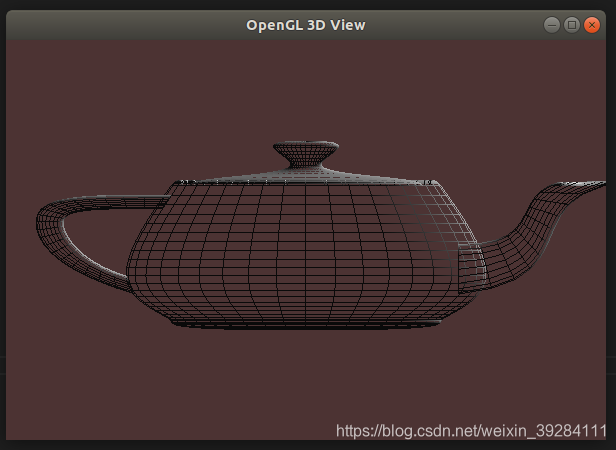

本文是 Ubuntu 18.04 上的历史配置记录，示例使用固定功能管线与 GLUT，不能直接运行在只支持现代 core profile 的上下文中。新项目应单独选择上下文创建、函数加载和 shader 方案。

先把四个环节分开：C++ 编译器把源码变成程序，链接器接入 GL/GLU/GLUT，GLUT 创建窗口和图形上下文，OpenGL 调用才在该上下文中绘制。编辑器只负责组织构建和调试，不能替代系统中的库或显示会话。

| 出错位置 | 典型现象 | 优先检查 |
| --- | --- | --- |
| 编译 | 找不到 `GL/glut.h` | 开发头文件与 include 路径 |
| 链接 | `undefined reference` 指向 GL/GLU/GLUT 函数 | 对应链接库是否齐全、是否放在源码/对象之后 |
| 窗口创建 | 无法打开 display | 启动会话与显示权限 |
| 绘制 | 窗口出现但内容为空或比例变形 | 上下文类型、视口、投影与绘制状态 |

下面保留兼容模式茶壶例子，先在终端验证前三层，再把同一入口接到 VS Code。

## 安装

 - 在终端中，配置步骤如下：

```bash
sudo apt-get install build-essential libgl1-mesa-dev libglu1-mesa-dev freeglut3-dev
# 需要使用下文的 GDB 调试配置时再安装。
sudo apt-get install gdb
```


 - 在选定的文件夹中新建一个`main.cpp` ，可在文件夹中右键打开终端：


```bash
touch main.cpp
```


- 在`main.cpp`中撰写一段测试程序：

```cpp
#include <GL/glut.h>

//初始化
void init(void){
    GLfloat mat_specular [ ] = { 1.0, 1.0, 1.0, 1.0 };
    GLfloat mat_shininess [ ] = { 50.0 };
    GLfloat light_position [ ] = { 1.0, 1.0, 1.0, 0.0 };
    glClearColor(0.3, 0.2, 0.2, 0.1);
    glShadeModel ( GL_SMOOTH );

    glMatrixMode(GL_MODELVIEW);
    glLoadIdentity();
    gluLookAt(0, 0, 10, 0, 0, 0, 0, 1, 0);

    glMaterialfv ( GL_FRONT, GL_SPECULAR, mat_specular);
    glMaterialfv ( GL_FRONT, GL_SHININESS, mat_shininess);
    glLightfv ( GL_LIGHT0, GL_POSITION, light_position);

    glEnable (GL_LIGHTING);
    glEnable (GL_LIGHT0);
    glEnable (GL_DEPTH_TEST);
    glColorMaterial(GL_FRONT_AND_BACK, GL_AMBIENT_AND_DIFFUSE);
    glEnable(GL_COLOR_MATERIAL);
}
// 窗口缩放时同时更新视口和投影，避免把茶壶拉伸。
void reshape(int width, int height) {
    if (width < 1) width = 1;
    if (height < 1) height = 1;
    const double aspect = static_cast<double>(width) / height;
    glViewport(0, 0, width, height);
    glMatrixMode(GL_PROJECTION);
    glLoadIdentity();
    glOrtho(-5 * aspect, 5 * aspect, -5, 5, 5, 15);
    glMatrixMode(GL_MODELVIEW);
}
//茶壶绘图函数
void display(void){
    glClear (GL_COLOR_BUFFER_BIT | GL_DEPTH_BUFFER_BIT);
    glColor3f(0.6, 1.0, 0.7);
    glutWireTeapot(3);
    glFlush();
}
int main(int argc, char* argv[]){
    glutInit(&argc, argv);
    glutInitDisplayMode(GLUT_RGB | GLUT_SINGLE | GLUT_DEPTH);
    glutInitWindowPosition(800, 150);
    glutInitWindowSize(600, 400);
    glutCreateWindow("OpenGL 3D View");
    init();
    glutDisplayFunc(display);
    glutReshapeFunc(reshape);
    glutMainLoop();
    return 0;
}


```

- 在相应文件夹中打开终端，编译运行：


```bash
g++ -std=c++17 -Wall -Wextra -g -O0 main.cpp -o main -lGL -lGLU -lglut
./main
```

程序在初始化中启用颜色材质，因此 `glColor3f` 会影响灯光下的材质颜色；仅启用灯光时，颜色值并不自动替代材质设置。缩放回调根据窗口宽高比调整正交投影，宽窗口和窄窗口中的模型比例保持一致。窄到一定程度时可能裁切模型，这是视野范围的选择，不是几何被压扁。

本例只需要 GL、GLU 和 GLUT，不使用 GLEW、SDL、GLM 或 FreeType；后续项目确实使用这些库时再增加依赖。它仍属于固定功能管线，`glMatrixMode`、固定灯光和材质调用不能直接迁移到 core profile。

## VScode 配置文件

项目文件夹下新建`.vscode` 文件夹，新建 `launch.json` 与 `tasks.json` 文件


按`F5` 选择`C++(GDB/LLDB)` 调出`launch.json`
在`launch.json`文件中配置：

```jsonc
{
    // 使用 IntelliSense 了解相关属性。
    // 悬停以查看现有属性的描述。
    // 欲了解更多信息，请访问: https://go.microsoft.com/fwlink/?linkid=830387
    "version": "0.2.0",
    "configurations": [
        {
            "name": "(gdb) Launch",                                 //配置名称，会在启动配置的下拉菜单中显示
            "type": "cppdbg",                                       //配置类型，只能为cppdbg
            "request": "launch",                                    //请求类型，可以为launch或attach
            "program": "${workspaceFolder}/main",             //将要调试的程序的路径
            "args": [],                                             //调试时传递给程序的命令行参数
            "stopAtEntry": false,                                   //设为true程序会暂停在入口处
            "cwd": "${workspaceFolder}",                            //调试程序时的工作目录
            "environment": [],                                      //环境变量
            "externalConsole": true,                                //调试时是否显示控制台窗口
            "MIMode": "gdb",                                        //指定连接的调试器，可以为gdb或lldb
            "miDebuggerPath": "/usr/bin/gdb",                       //gdb路径
            "setupCommands": [
                {
                    "description": "Enable pretty-printing for gdb",
                    "text": "-enable-pretty-printing",
                    "ignoreFailures": true
                }
            ],
            "preLaunchTask": "build"                                //调试开始前执行的任务，一般为编译程序
        }
    ]
}
```

在生成 `tasks.json` 文件时，可`ctrl + shift + B` ，选择`配置生成任务` ，再者选择`使用模板创建tasks.json文件`，最后选择`Others`.

在 `tasks.json` 编辑为：

```jsonc
{
    "version": "2.0.0",
    "tasks": [
        {
            "label": "build",
            "type": "shell",
            "command": "g++",
            "args": [
                "-std=c++17","-Wall","-Wextra","-g","-O0",
                "main.cpp","-o","main","-lGL","-lGLU","-lglut"
            ],
            "group": {
                "kind": "build",
                "isDefault": true
            }
        }
    ]
}
```

需要加上 `-lGL -lGLU -lglut` 后缀。
然后`ctrl + shift + B`，生成可执行文件`main`，在VScode中`ctrl + ~`调用终端，或者是所在文件夹中调用终端，输入：

```bash
./main
```

即可生成对应的茶壶3D模型视图：




## 阅读自测与验收

- 先确认上下文版本和使用的是固定管线还是现代 shader 管线，不能把旧 GLUT 教程直接当作核心模式示例。
- 把编译、链接、创建上下文与实际绘制分别验收；启用深度测试时也需要请求并清理深度缓冲区。
