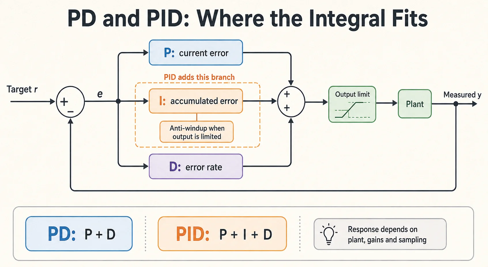

PD 与 PID 的核心区别是是否引入积分项。选择哪一种，需要结合被控对象、采样周期、执行器限制和扰动类型，不能仅凭“PD 快、PID 准”判断。



## 1. 连续时间形式

设参考为 $r(t)$、测量为 $y(t)$、误差为 $e(t)=r(t)-y(t)$：

$$
u_{\mathrm{PD}} = K_p e + K_d \dot e,
\qquad
u_{\mathrm{PID}} = K_p e + K_i\int_0^t e(\tau)\,d\tau + K_d\dot e.
$$

- P 项提供与当前偏差成比例的纠正。
- D 项影响阻尼，但也会放大高频测量噪声。
- I 项在闭环稳定、执行器有余量等条件下，可以消除某些恒定参考或恒定扰动导致的稳态误差。

PID 不会自动保证稳定，也不会修复错误的传感器标定、坐标方向或不可达目标。

## 2. 对比时保留必要条件

| 维度 | PD | PID |
| --- | --- | --- |
| 调参 | $K_p,K_d$ | 还需选择 $K_i$ 与抗饱和策略 |
| 恒定扰动 | 可能存在稳态偏差，可结合前馈补偿 | 稳定且未受限时可通过积分减小偏差 |
| 噪声 | D 项需要滤波 | 同样需要滤波 |
| 输出受限 | 检查力矩、速度或电压限制 | 还需防止积分继续累积 |
| 动态响应 | 取决于对象与增益 | 同样取决于对象与增益，没有固定快慢关系 |

在机械臂位置控制中，PD 加重力前馈是常见组合；如果没有重力补偿，不能把所有静态偏差都归结为比例增益不足。

## 3. 离散实现：采样周期不能省略

用采样周期 $\Delta t$ 积分，并对测量速度进行一阶滤波。下面是标量控制器示例，采用对测量值微分，限幅对象为最终控制输出：

```python
from dataclasses import dataclass
from math import isfinite


@dataclass
class PID:
    kp: float
    ki: float
    kd: float
    limit: float
    tau: float = 0.02
    integral: float = 0.0
    previous_y: float | None = None
    filtered_dy: float = 0.0

    def __post_init__(self):
        if (not all(isfinite(v) for v in (self.kp, self.ki, self.kd,
                                        self.limit, self.tau))
                or self.limit <= 0 or self.tau < 0):
            raise ValueError("limit must be positive and tau nonnegative")

    def update(self, target, measured, dt):
        if not all(isfinite(v) for v in (target, measured, dt)) or dt <= 0:
            raise ValueError("inputs must be finite and dt positive")
        error = target - measured
        dy = 0.0 if self.previous_y is None else (
            measured - self.previous_y
        ) / dt
        alpha = dt / (self.tau + dt)
        self.filtered_dy += alpha * (dy - self.filtered_dy)
        self.previous_y = measured

        candidate = self.integral + self.ki * error * dt
        base = self.kp * error - self.kd * self.filtered_dy
        raw = base + candidate
        # Integrate only if unsaturated or moving back toward the valid range.
        if (abs(raw) <= self.limit
                or (raw > self.limit and self.ki * error < 0)
                or (raw < -self.limit and self.ki * error > 0)):
            self.integral = candidate
        return max(-self.limit, min(self.limit, base + self.integral))


controller = PID(kp=2.0, ki=0.5, kd=0.1, limit=3.0)
print(controller.update(target=1.0, measured=0.0, dt=0.01))
```

代码要求 Python 3.10+。这里只演示控制器内部状态更新；增益和限幅的单位由输入、输出的物理含义决定，示例数字不能直接作为真实机器人参数。

## 4. 调参与验证

先确认反馈符号、单位与采样周期，再在仿真或受控的小幅运动中从保守增益开始。建立 PD 基线后，如确有需要再逐步加入积分。不要把“先调到振荡”作为所有机器人通用的实机操作步骤。

同时记录参考、测量、未限幅输出、实际输出与积分状态。用阶跃、小幅轨迹、恒定扰动及输出受限场景分别检查上升时间、超调、稳态误差和恢复时间。

## 5. 常见误解

- 积分项补偿的是闭环误差，不保证能从车轮编码器中识别打滑后的真实车体位移。
- 增大 D 不一定改善响应；噪声、滤波延迟和采样频率都会影响结果。
- 关闭控制或切换模式时，应设计积分状态重置或无扰切换，避免重新启用后输出突变。

可对照 [Åström 与 Murray《Feedback Systems》](https://fbsbook.org/)中的 PID 与反馈分析继续学习。


## 阅读自测与验收

- 人为设置不可达参考，确认积分不会持续向饱和方向累积；参考恢复后观察输出与积分的恢复过程。
- 改变采样周期后重新测试，并比较对误差微分和对测量微分在参考阶跃时的区别；不要忽略滤波延迟与单位。
