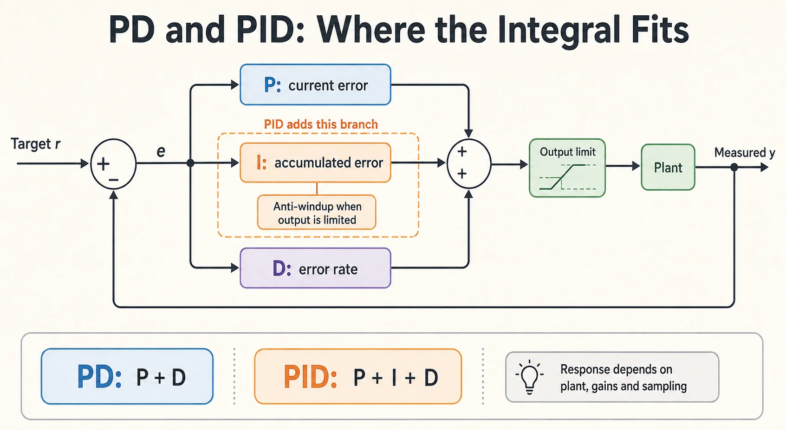

PD 与 PID 的核心区别是是否引入积分项。选择哪一种，需要结合被控对象、采样周期、执行器限制和扰动类型，不能仅凭“PD 快、PID 准”判断。



## 1. 连续时间形式

设参考为 $r(t)$、测量为 $y(t)$、误差为 $e(t)=r(t)-y(t)$：

$$
u_{\mathrm{PD}} = K_p e + K_d \dot e,
\qquad
u_{\mathrm{PID}} = K_p e + K_i\int_0^t e(\tau)\,d\tau + K_d\dot e.
$$

- P 项提供与当前偏差成比例的纠正。
- D 项影响阻尼，但也会放大高频测量噪声。
- I 项在闭环稳定、执行器有余量等条件下，可以消除某些恒定参考或恒定扰动导致的稳态误差。

PID 不会自动保证稳定，也不会修复错误的传感器标定、坐标方向或不可达目标。

## 2. 对比时保留必要条件

| 维度 | PD | PID |
| --- | --- | --- |
| 调参 | $K_p,K_d$ | 还需选择 $K_i$ 与抗饱和策略 |
| 恒定扰动 | 可能存在稳态偏差，可结合前馈补偿 | 稳定且未受限时可通过积分减小偏差 |
| 噪声 | D 项需要滤波 | 同样需要滤波 |
| 输出受限 | 检查力矩、速度或电压限制 | 还需防止积分继续累积 |
| 动态响应 | 取决于对象与增益 | 同样取决于对象与增益，没有固定快慢关系 |

在机械臂位置控制中，PD 加重力前馈是常见组合；如果没有重力补偿，不能把所有静态偏差都归结为比例增益不足。

## 3. 离散实现：采样周期不能省略

用采样周期 $\Delta t$ 积分，并对测量速度进行一阶滤波。下面是标量控制器示例，采用对测量值微分，限幅对象为最终控制输出：

下载 [pid_controller.py](pid_controller.py) 到当前目录，再运行：

```python
from pid_controller import PID

controller = PID(kp=2.0, ki=0.5, kd=0.1, limit=3.0)
u = controller.update(target=1.0, measured=0.0, dt=0.01)
print(u, controller.integral, controller.last_raw)  # 2.005, 0.005, 2.005
```

实现中的 `integral` 已经乘过 $K_i$，单位与输出相同；它不是尚未乘增益的 $\int e\,dt$。记这一状态为 $I_k$，则候选更新和未限幅输出为

$$
I_k^{\mathrm{candidate}}=I_{k-1}+K_i e_k\Delta t,\qquad
u_k^{\mathrm{candidate}}=K_p e_k+I_k^{\mathrm{candidate}}-K_d\hat{\dot y}_k.
$$

条件积分在未饱和时接收候选值；已经越过上限时，只接收让积分贡献下降的更新，下限情况相反。最后对 **整个 P+I+D 输出** 限幅。它没有给积分状态单独设一个任意范围，也不代表执行器实际输出一定等于软件限幅后的数值。

对测量值微分时，参考突变不会直接出现在 D 项中，但 P 项仍会跳变。滤波递推使用

$$
\alpha=\frac{\Delta t}{\tau+\Delta t},\qquad
\hat{\dot y}_k=(1-\alpha)\hat{\dot y}_{k-1}
+\alpha\frac{y_k-y_{k-1}}{\Delta t}.
$$

首次采样把测量导数初始化为零。非法采样周期、非有限输入或计算溢出会被拒绝，且不推进历史状态；重新启用控制器时可以调用 `reset`，但清零本身不保证无扰切换。


代码要求 Python 3.10+。这里只演示控制器内部状态更新；增益和限幅的单位由输入、输出的物理含义决定，示例数字不能直接作为真实机器人参数。

## 4. 调参与验证

先确认反馈符号、单位与采样周期，再在仿真或受控的小幅运动中从保守增益开始。建立 PD 基线后，如确有需要再逐步加入积分。不要把“先调到振荡”作为所有机器人通用的实机操作步骤。

同时记录参考、测量、未限幅输出、实际输出与积分状态。用阶跃、小幅轨迹、恒定扰动及输出受限场景分别检查上升时间、超调、稳态误差和恢复时间。

### 4.1 同一对象上的两个实验

下载 [pid_experiments.py](pid_experiments.py)，与 `pid_controller.py` 放在同一目录：

```bash
python -m pip install numpy scipy matplotlib
python -B pid_experiments.py --output-dir results
```

对象是一维质量—弹簧—阻尼系统，模型和全部参数公开：

$$
m\ddot q+b\dot q+kq=u+d,\quad
m=1\;\mathrm{kg},\quad b=2\;\mathrm{N\,s/m},\quad
k=4\;\mathrm{N/m},\quad d=-1\;\mathrm N.
$$

三个控制器共用 $K_p=16$ N/m、$K_d=6$ N·s/m、$\tau=0.02$ s、$|u|\le8$ N；PID 额外使用 $K_i=8$ N/(m·s)。采样周期为 2 ms。控制量在相邻采样间保持不变，对象使用精确零阶保持离散化；因此没有把粗糙的显式 Euler 积分误差误当作控制器差异。控制器本身仍是离散实现，整体闭环结果会随采样周期变化。

<figure class="article-figure">

<figcaption><span class="article-figure__number">图 1</span><span class="article-figure__text">左列为恒定参考与负载，右列在 3 s 时把不可达参考从 3 m 改为 0.5 m。曲线来自随文脚本；理想对象未包含传感器噪声、通信延迟和执行器自身动力学。</span></figcaption>
</figure>

**恒定负载实验。** 参考为 1 m。PD 在稳定且最终未饱和的情况下满足 $kq=K_p(1-q)+d$，因此解析平衡点为 $q=15/20=0.75$ m；位置偏差为 0.25 m。PID 最终需要约 5 N 的积分贡献来提供弹簧力和负载补偿，它低于输出限制。在这次 20 s 仿真中，末端时刻的 PID 位置误差约 $1.03\times10^{-5}$ m。这是给定理想模型的计算结果，不是实机精度。

**饱和恢复实验。** 参考为 3 m 时，仅维持平衡就需要 $kq-d=13$ N，超过 8 N 的输出上限。持续积分无法让目标变得可达，却会累积后续必须消退的状态。3 s 后参考改为 0.5 m，结果如下：

| 相同 PID 增益 | 最大积分贡献绝对值 | 切换后的记录内 2 cm 调节时间 |
| --- | ---: | ---: |
| 直接累积积分 | 36.674 N | 9.818 s |
| 条件积分 | 2.986 N | 6.656 s |

这里的调节时间指位置误差进入 ±2 cm、并持续保持到本次记录结束的最早时刻。记录在绝对时间 16 s 结束，调节时间从 3 s 的参考切换开始计量，因此切换后的观测窗口为 13 s；这里没有额外要求速度误差进入某个范围。不同对象、增益和饱和方式会得到不同结果，不能把这张表当成通用性能排序。

脚本还把采样周期减半到 1 ms：在共同时间点上，条件积分方案的位置最大差约为 $7.81\times10^{-4}$ m。检查输出边界、平衡点和步长敏感性，比只观察曲线是否平滑更有意义。详细数值同时写入 `pid-saturation-results.json`。

### 4.2 把输出限幅放进完整执行链

如果控制器之后还有速度限制、力矩限制、速率限制、驱动器保护或另一个控制环，控制器内部的限幅值不一定就是实际执行值。此时条件积分可能看不到真正发生的饱和，需要基于完整结构考虑积分冻结、反算或跟踪型抗饱和。

例如把积分状态记为输出单位的 $I$，反算的一种连续形式是

$$
\dot I=K_i e+\frac{u_{\mathrm{applied}}-u_{\mathrm{raw}}}{T_t},\qquad T_t>0.
$$

该式比较的两个输出必须位于同一位置、采用相同单位；$T_t$ 是跟踪时间常数。它与“把积分值裁剪到某个上下限”是不同策略，也需要结合实际执行器与采样周期验证。关于这些结构的推导，可从[《Feedback Systems》的 PID 章节入口](https://fbswiki.org/wiki/index.php/PID_Control)继续阅读。

## 5. 常见误解

- 积分项补偿的是闭环误差，不保证能从车轮编码器中识别打滑后的真实车体位移。
- 增大 D 不一定改善响应；噪声、滤波延迟和采样频率都会影响结果。
- 关闭控制或切换模式时，应设计积分状态重置或无扰切换，避免重新启用后输出突变。

滤波的位置同样重要：只平滑参考、只滤波导数，以及同时滤波 P/D 使用的测量，会形成不同的动态关系。可继续对照[测量低通改变闭环极点的可运行例子](#feedback-stability)，检查降噪收益是否伴随稳定性变化。

可对照 [Åström 与 Murray《Feedback Systems》](https://fbsbook.org/)中的 PID 与反馈分析继续学习。


## 阅读自测与验收

- 人为设置不可达参考，确认积分不会持续向饱和方向累积；参考恢复后观察输出与积分的恢复过程。
- 改变采样周期后重新测试，并比较对误差微分和对测量微分在参考阶跃时的区别；不要忽略滤波延迟与单位。
