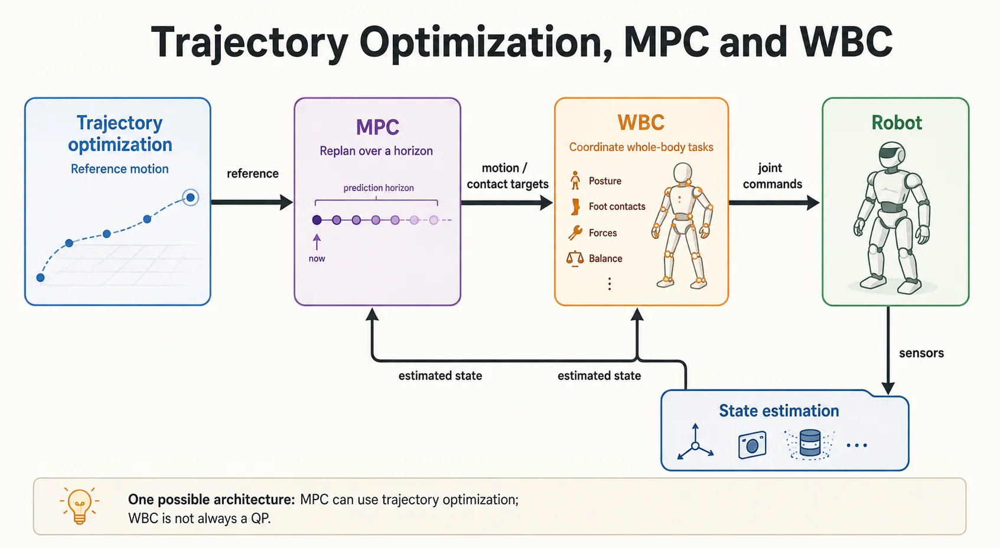

TO、MPC 和 WBC 不是三种互斥算法：TO 描述如何优化一段轨迹，MPC 描述如何滚动求解并利用反馈执行，WBC 描述如何协调全身多个任务。一个 MPC 内部可以求解 TO 问题，WBC 也可以采用不同形式的控制器。

## 1. 从输入与输出理解职责

| 模块 | 典型输入 | 典型输出 | 主要问题 |
| --- | --- | --- | --- |
| TO：轨迹优化 | 初末状态、动力学、约束、代价 | 一段状态与控制轨迹 | 这段运动是否可行，代价有多大？ |
| MPC：模型预测控制 | 当前状态、参考、预测模型 | 当前控制量及预测轨迹 | 执行后状态变了，接下来如何调整？ |
| WBC：全身控制 | 任务目标、接触状态、机器人模型 | 关节力矩、速度或加速度等指令 | 多个任务如何共享关节和接触能力？ |

TO 可以处理动力学、接触和时变约束，也可以在线求解。机器人 TO 往往是非凸问题，求解器得到的通常是局部解，不能笼统保证全局最优。

MPC 在每个周期更新状态，求解有限时域问题，执行当前一小段控制，再滚动向前。它可以采用简化模型，也可以使用更完整的模型。

WBC 常使用加权 QP 或任务优先级优化，但 WBC 本身不等于 QP；基于零空间投影等方法也可以实现全身协调。

## 2. 为什么需要不同时间尺度

长时域规划需要预见未来运动；关节层还需及时响应测量和接触变化。把问题分层，能让每层使用合适的模型与计算预算。

各层频率取决于问题规模、求解器、机器人硬件和稳定性要求。“TO 秒级、MPC 毫秒级、WBC 更快”只能作为某类系统的例子，不能作为定义。MPC 与 WBC 也不一定需要 GPU。

## 3. 以足式机器人为例

1. 规划层产生落足、质心或末端参考。
2. MPC 根据当前状态与接触计划，预测未来运动并调整控制目标。
3. WBC 综合平衡、姿态、足端与操作任务，求解满足约束的关节指令。
4. 状态估计器融合编码器、IMU 等信息，为下一轮规划和控制提供反馈。

对动力学 WBC，常见决策变量包括广义加速度、关节力矩和接触力。应同时检查浮动基动力学、摩擦约束、接触运动约束和执行器限制。高层目标不可行时，底层不能凭空保证精确跟踪。

## 4. 接口比模块名称更值得检查

| 接口问题 | 常见后果 | 检查方式 |
| --- | --- | --- |
| 坐标系或力的正负号不一致 | 运动方向或接触力错误 | 单轴、静态场景验证 |
| 接触计划与实际接触不同 | 约束不成立、力矩突变 | 对比计划接触与传感器反馈 |
| 高层输出超过执行器能力 | WBC 不可行或长期饱和 | 记录约束余量与求解状态 |
| 状态估计或控制消息过期 | 跟踪抖动、稳定性下降 | 测量时间戳与完整控制延迟 |

## 5. 延伸阅读与工具

- [MIT Underactuated Robotics：Trajectory Optimization](https://underactuated.mit.edu/trajopt.html)：理解直接配点、约束和非凸优化。
- [OCS2](https://leggedrobotics.github.io/ocs2/)：用于最优控制与 MPC 的工具箱，需要用户定义或接入系统模型。
- [TinyMPC](https://tinympc.org/)：关注资源受限平台上的 MPC 求解。
- [OpenLoong Dynamics Control](https://github.com/loongOpen/Openloong-dyn-control)：查看具体人形机器人中的 MPC 与 WBC 组合。

评估实现时，记录求解耗时分布、最坏控制周期、约束违反和失败恢复；只报告平均频率无法说明控制链路是否可靠。

## 阅读自测与验收

- 给每一条模块接口写清传递的是状态、轨迹、接触计划还是关节命令，并注明时间戳和坐标系。
- 模拟估计延迟、优化超时或接触变化，确认下层如何处理过期参考；模块频率高不等于闭环一定稳定。
