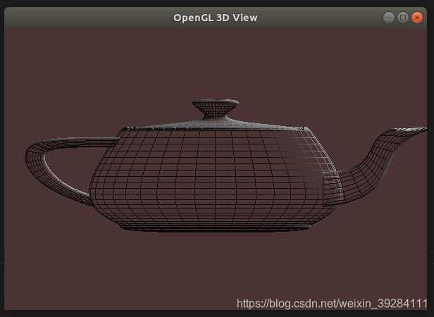

首先配置OpenGL的开发环境，使用apt安装OpenGL及相关的开发包。

## 安装

 - 在终端中，配置步骤如下：

```bash
sudo apt-get install build-essential libgl1-mesa-dev
sudo apt-get install freeglut3-dev
sudo apt-get install libglew-dev libsdl2-dev libsdl2-image-dev libglm-dev libfreetype6-dev
```

 

 - 在选定的文件夹中新建一个`main.cpp` ，可在文件夹中右键打开终端：


```bash
touch main.cpp
```


- 在`main.cpp`中撰写一段测试程序：
```cpp
#include <GL/glut.h>

//初始化
void init(void){
    GLfloat mat_specular [ ] = { 1.0, 1.0, 1.0, 1.0 };
    GLfloat mat_shininess [ ] = { 50.0 };
    GLfloat light_position [ ] = { 1.0, 1.0, 1.0, 0.0 };
    glClearColor(0.3, 0.2, 0.2, 0.1);
    glShadeModel ( GL_SMOOTH );
    
    glMatrixMode(GL_PROJECTION);
    glOrtho(-5, 5, -5, 5, 5, 15);
    glMatrixMode(GL_MODELVIEW);
    gluLookAt(0, 0, 10, 0, 0, 0, 0, 1, 0);

    glMaterialfv ( GL_FRONT, GL_SPECULAR, mat_specular);
    glMaterialfv ( GL_FRONT, GL_SHININESS, mat_shininess);
    glLightfv ( GL_LIGHT0, GL_POSITION, light_position);
    
    glEnable (GL_LIGHTING);
    glEnable (GL_LIGHT0);
    glEnable (GL_DEPTH_TEST);
}
//茶壶绘图函数
void display(void){
    glClear (GL_COLOR_BUFFER_BIT | GL_DEPTH_BUFFER_BIT);
    glColor3f(0.6, 1.0, 0.7);
    glutWireTeapot(3);
    glFlush();
}
int main(int argc, char* argv[]){
    glutInit(&argc, argv);
    glutInitDisplayMode(GLUT_RGB | GLUT_SINGLE);
    glutInitWindowPosition(800, 150);
    glutInitWindowSize(600, 400);
    glutCreateWindow("OpenGL 3D View");
    init();
    glutDisplayFunc(display);
    glutMainLoop();
    return 0;
}


```

- 在相应文件夹中打开终端，编译运行：


```bash
g++ main.cpp -o main -lGL -lGLU -lglut
./main
```

## VScode 配置文件

项目文件夹下新建`-vscode`文件夹，新建`launch-json、task-json`文件


按`F5` 选择`C++(GDB/LLDB)` 调出`launch.json`
在`launch.json`文件中配置：
```javascript
{
    // 使用 IntelliSense 了解相关属性。 
    // 悬停以查看现有属性的描述。
    // 欲了解更多信息，请访问: https://go.microsoft.com/fwlink/?linkid=830387
    "version": "0.2.0",
    "configurations": [
        {
            "name": "(gdb) Launch",                                 //配置名称，会在启动配置的下拉菜单中显示
            "type": "cppdbg",                                       //配置类型，只能为cppdbg
            "request": "launch",                                    //请求类型，可以为launch或attach
            "program": "${workspaceFolder}/main",             //将要调试的程序的路径
            "args": [],                                             //调试时传递给程序的命令行参数
            "stopAtEntry": false,                                   //设为true程序会暂停在入口处
            "cwd": "${workspaceFolder}",                            //调试程序时的工作目录
            "environment": [],                                      //环境变量
            "externalConsole": true,                                //调试时是否显示控制台窗口
            "MIMode": "gdb",                                        //指定连接的调试器，可以为gdb或lldb
            "miDebuggerPath": "/usr/bin/gdb",                       //gdb路径
            "setupCommands": [
                {
                    "description": "Enable pretty-printing for gdb",
                    "text": "-enable-pretty-printing",
                    "ignoreFailures": true
                }
            ],
            "preLaunchTask": "build"                                //调试开始前执行的任务，一般为编译程序
        }
    ]
}
```

在生成 `tasks.json` 文件时，可`ctrl + shift + B` ，选择`配置生成任务` ，再者选择`使用模板创建tasks.json文件`，最后选择`Others`.

在 `tasks.json` 编辑为：
```javascript
{
    "version": "2.0.0",
    "tasks": [
        {
            "label": "build", 
            "type": "shell",
            "command": "g++",
            "args": [
                "main.cpp","-o","main","-lGL","-lGLU","-lglut" 
            ],
            "group": {
                "kind": "build",
                "isDefault": true
            }
        }
    ]
}
```
需要加上 `-lGL -lGLU -lglut` 后缀。
然后`ctrl + shift + B`，生成可执行文件`main`，在VScode中`ctrl + ~`调用终端，或者是所在文件夹中调用终端，输入：

```javascript
./main
```

即可生成对应的茶壶3D模型视图：


