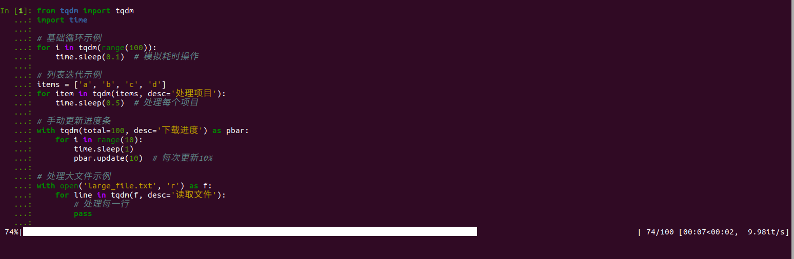
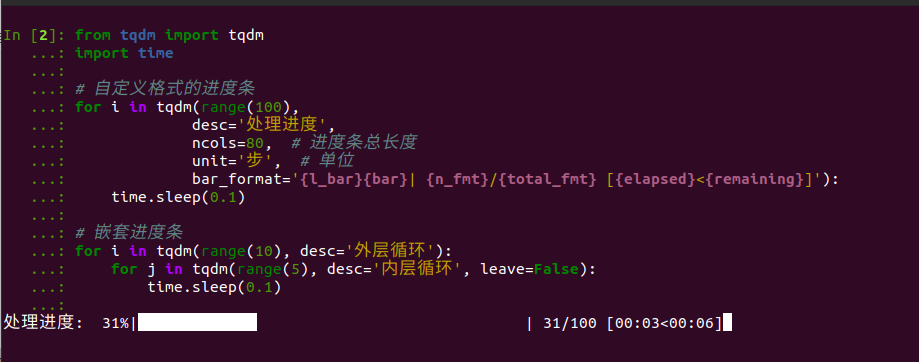
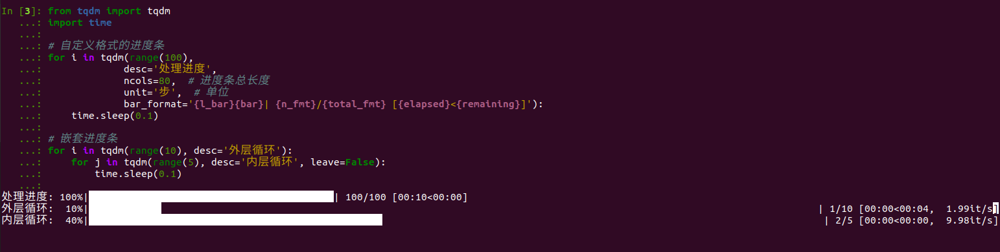

## tqdm 进度条库说明

`tqdm` 是一个快速、可扩展的进度条库，名称来源于阿拉伯语 taqaddum (تقدّم)，意为"进展"。它可以在循环或迭代过程中显示进度，让用户直观地了解程序执行的状态。

### 主要特点：
- 自动计算剩余时间
- 显示迭代速度
- 支持嵌套进度条
- 支持多线程/进程
- 可自定义外观

# tqdm 安装指南

### 使用 pip 安装（推荐）
最简单的安装方式是使用 pip：

```bash
pip install tqdm
```

如果想安装最新的开发版本：
```bash
pip install -U tqdm
```

### 使用 conda 安装
如果你使用 Anaconda 或 Miniconda：

```bash
conda install tqdm
```

### 针对特定用户安装
如果你想只为当前用户安装：

```bash
pip install --user tqdm
```

### 验证安装
安装完成后，可以在 Python 中验证安装是否成功：

```python
from tqdm import tqdm
print(tqdm.__version__)
```

### 可选依赖
- `setproctitle`: 在进程标题中显示进度条
- `colorama`: Windows 系统下的彩色输出支持

安装这些可选依赖：
```bash
pip install tqdm[slack]  # Slack 集成支持
pip install tqdm[telegram]  # Telegram 集成支持
```

### 注意事项
- 建议在虚拟环境中安装以避免包冲突
- 如果遇到权限问题，可能需要使用 `sudo pip install tqdm`
- Windows 用户可能需要以管理员身份运行命令提示符

安装完成后即可开始使用 tqdm 的进度条功能。

### 基本使用示例

```python
from tqdm import tqdm
import time

# 基础循环示例
for i in tqdm(range(100)):
    time.sleep(0.1)  # 模拟耗时操作

# 列表迭代示例
items = ['a', 'b', 'c', 'd']
for item in tqdm(items, desc='处理项目'):
    time.sleep(0.5)  # 处理每个项目

# 手动更新进度条
with tqdm(total=100, desc='下载进度') as pbar:
    for i in range(10):
        time.sleep(1)
        pbar.update(10)  # 每次更新10%

# 处理大文件示例
with open('large_file.txt', 'r') as f:
    for line in tqdm(f, desc='读取文件'):
        # 处理每一行
        pass
```


### 高级使用示例

```python
from tqdm import tqdm
import time

# 自定义格式的进度条
for i in tqdm(range(100), 
             desc='处理进度',
             ncols=80,  # 进度条总长度
             unit='步',  # 单位
             bar_format='{l_bar}{bar}| {n_fmt}/{total_fmt} [{elapsed}<{remaining}]'):
    time.sleep(0.1)

# 嵌套进度条
for i in tqdm(range(10), desc='外层循环'):
    for j in tqdm(range(5), desc='内层循环', leave=False):
        time.sleep(0.1)
```



### 使用注意事项：
1. 对于未知长度的迭代，可以使用 `tqdm(iterator)`
2. 使用 `desc` 参数可以添加描述文字
3. `leave=False` 可以在完成后删除进度条
4. `unit` 参数可以自定义进度单位
5. `ncols` 可以设置进度条宽度

tqdm 通过在终端输出中覆盖前一行来实现动态更新，这使得它在处理长时间运行的任务时特别有用，能够给用户良好的反馈体验。

# Python 进度条库比较

## 1. Rich
Rich 是一个功能丰富的终端美化库，包含进度条功能。

```python
from rich.progress import track

for i in track(range(100), description="处理中..."):
    # 处理逻辑
    pass
```

特点：
- 支持多种样式和颜色
- 可显示表格、树形结构
- 支持嵌套进度条
- 提供丰富的终端格式化功能

## 2. alive-progress
现代化、动画效果丰富的进度条。

```python
from alive_progress import alive_bar

with alive_bar(100) as bar:
    for i in range(100):
        bar()  # 更新进度
```

特点：
- 丰富的动画效果
- 自动调整刷新率
- 支持自定义样式
- 显示运行时间和ETA

## 3. progressbar2
经典的进度条库，功能完善。

```python
import progressbar

bar = progressbar.ProgressBar()
for i in bar(range(100)):
    # 处理逻辑
    pass
```

特点：
- 简单易用
- 支持自定义部件
- 可显示速度、剩余时间等信息

## 4. progress
轻量级进度条库。

```python
import progress.bar

bar = progress.bar.Bar('处理中', max=100)
for i in range(100):
    bar.next()
bar.finish()
```

特点：
- 代码简洁
- 占用资源少
- 基础功能完善

## 5. halo
专注于加载动画的库。

```python
from halo import Halo

spinner = Halo(text='加载中', spinner='dots')
spinner.start()
# 处理逻辑
spinner.stop()
```

特点：
- 多种动画效果
- 适合未知进度的任务
- 支持颜色和自定义文本

## 安装命令

```bash
# Rich
pip install rich

# alive-progress
pip install alive-progress

# progressbar2
pip install progressbar2

# progress
pip install progress

# halo
pip install halo
```

## 选择建议

1. 简单任务：使用 `tqdm`
2. 美观需求：使用 `Rich` 或 `alive-progress`
3. 轻量需求：使用 `progress`
4. 未知进度：使用 `halo`
5. 复杂定制：使用 `progressbar2`

每个库都有其特点和适用场景，可以根据具体需求选择合适的工具。