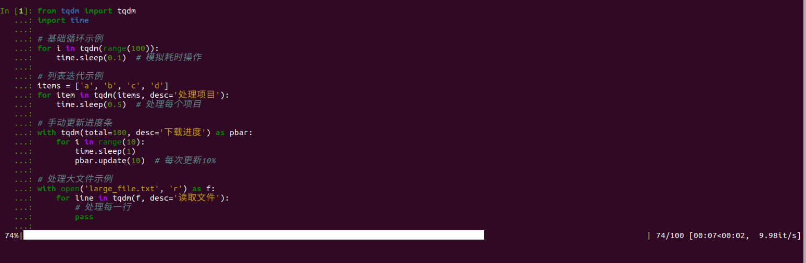
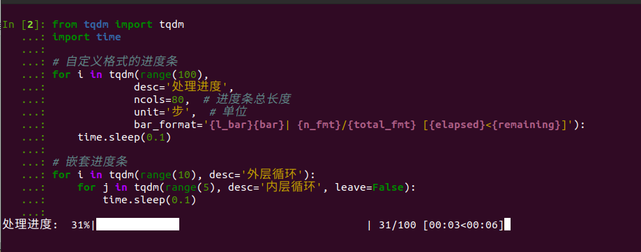
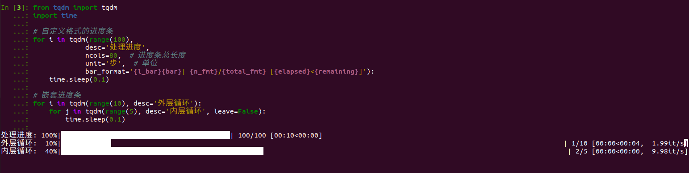

## 进度条首先要定义“完成了什么”

`tqdm` 包装迭代器，或者由你手动调用 `update(n)`。其中 `n` 是 **本次完成的增量**，不是累计完成量，也不天然表示百分比。总量、单位和更新时机一致，剩余时间估计才有意义。

## 安装到实际运行的解释器

```bash
python -m pip install tqdm
python -c "import sys, tqdm; print(sys.executable); print(tqdm.__version__)"
```

在项目虚拟环境中执行；Notebook 可选 `from tqdm.auto import tqdm`。本教程不需要外部消息服务、凭据或其他进度条库。

## 三种常用写法

下面是一个完整脚本，没有外部文件依赖，也不通过长时间 `sleep` 模拟工作。

```python
from tqdm import tqdm


def process_items(items):
    results = []
    # disable=None：非交互输出不刷动态进度；始终独立记录业务结果。
    for item in tqdm(
        items, desc="Items", unit="item", disable=None, mininterval=0.2
    ):
        results.append(item * item)
    return results


def process_batches(batches):
    total = sum(len(batch) for batch in batches)
    completed = 0
    with tqdm(total=total, desc="Records", unit="record", disable=None) as bar:
        for batch in batches:
            results = [value * value for value in batch]
            completed += len(results)
            bar.update(len(results))  # 不是 bar.update(completed)
    assert completed == total
    return completed


def nested():
    outputs = []
    for epoch in tqdm(range(2), desc="Epoch", position=0, disable=None):
        for batch in tqdm(
            range(3), desc="Batch", position=1, leave=False, disable=None
        ):
            outputs.append((epoch, batch))
    return outputs


if __name__ == "__main__":
    assert process_items([1, 2, 3]) == [1, 4, 9]
    assert process_items([]) == []
    assert process_batches([[1, 2], [], [3]]) == 3
    assert len(nested()) == 6
    tqdm.write("All work completed")
```

关闭显示后，不应依赖 `bar.n` 作为业务计数器；业务状态由自己的变量保存。上下文管理器在正常结束或异常退出时都会关闭进度条，异常仍应由业务层处理。





终端宽度、字体与是否支持光标移动会改变实际显示，图片仅用于理解布局。

## 文件进度：行与字节不能混用

文本行数通常未知，可以直接包装文件迭代器，但不能拿文件字节数当作总行数。下面按 **二进制字节** 计数；它只读取文件，不修改原文件内容。

```python
from pathlib import Path
from tqdm import tqdm


def scan_bytes(path, chunk_size=1024 * 1024):
    if not isinstance(chunk_size, int) or chunk_size <= 0:
        raise ValueError("chunk_size must be a positive integer")
    path = Path(path)
    total = path.stat().st_size
    completed = 0
    with path.open("rb") as stream, tqdm(
        total=total, unit="B", unit_scale=True, desc=path.name, disable=None
    ) as bar:
        while chunk := stream.read(chunk_size):
            # 在这里处理 chunk；处理成功后再累计。
            completed += len(chunk)
            bar.update(len(chunk))
    return completed
```

这是普通、大小稳定的本地文件示例；读取过程中被追加或截断的文件，最终读取量可能不同于起始 `stat` 大小。网络流或生成器没有可靠总量时，应省略 `total`，不编造百分比。

## 日志、并发与性能边界

| 现象 | 处理思路 |
| --- | --- |
| CI 日志出现大量回车和重复行 | `disable=None` 自动识别非 TTY；必要时显式 `disable=True` |
| `print` 打断动态进度条 | 使用 `tqdm.write`；普通日志系统可考虑官方 logging 集成 |
| 每步刷新拖慢高频循环 | 增大 `mininterval`，或先累计一批完成量再 `update` |
| 嵌套进度覆盖同一行 | 使用不同 `position`；日志系统不支持光标上移时关闭嵌套显示 |
| 不知道任务总量 | 展示已完成量和速率，不展示不可靠的 ETA / 百分比 |
| 并行任务全部提交后立即显示 100% | 在完成事件、结果回收或 `as_completed` 时更新，而非提交时 |

`tqdm` 不会自动等待异步 GPU 内核；为了更新进度每步强制同步又可能损害性能。应明确统计的是“提交批次”“主机已回收结果”还是“设备已完成工作”，性能实验再在规定边界同步计时。

多进程中不要让各子进程无协调地写同一条进度条；可由主进程接收完成结果并统一更新。进度条是展示层，不承担线程同步、异常重试或任务成功判定。

## 参考与选择

参数、`update`、`write`、非 TTY 与刷新行为以 [tqdm 官方文档](https://tqdm.github.io/docs/tqdm/) 为准。简单循环先使用本文的最小方案；确实需要复杂终端面板时，再评估其他 UI 工具，不必为了一个进度条同时安装多个库。

## 阅读自测与验收

- 在交互终端和重定向日志两种方式下检查进度条行为，必要时关闭动态显示，避免日志被回车刷新控制符淹没。
- 进度更新应对应已完成的工作；异步 GPU 提交数量与完成数量不同，不能直接据此推断真实吞吐率。
